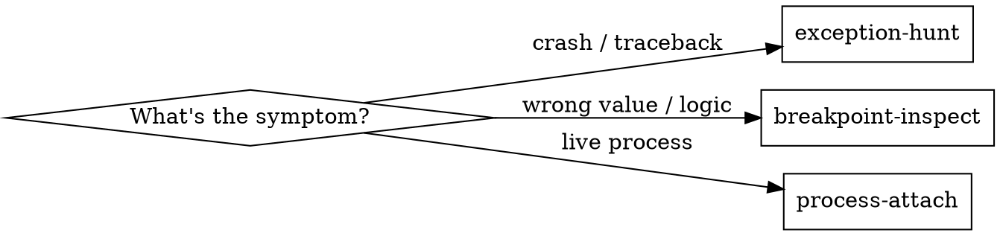

# /supercycle-python-debug — Runtime Python Debugging via Subagent

Argument: **$ARGUMENTS**

Dispatch a **debug subagent** that attaches to a Python process using `bdb`
(the engine behind `pdb`), executes a targeted debugging strategy, and returns
a structured JSON analysis. The subagent manages its own lifecycle — set up,
debug, collect, clean up.

## Strategy Selection



| Strategy | When | What it does |
|----------|------|-------------|
| `exception-hunt` | 500 error, crash, unhandled exception | Run target under `bdb`, break on every exception, capture stack + locals |
| `breakpoint-inspect` | Need variable state at specific lines | Set breakpoints, collect locals/expressions at each hit |
| `process-attach` | Live running process, can't restart | Send SIGUSR1 signal, read state dump JSON |

## Workflow

<phase name="analyse" order="1">

### 1. Analyse the debug target

Before dispatching the subagent, determine:

1. **What to debug** — endpoint, service function, specific code path
2. **How to reproduce** — curl command, test function, manual trigger
3. **Which strategy** — exception-hunt, breakpoint-inspect, or process-attach
4. **What to inspect** — specific variables, expressions, or "capture everything"

If the target is a **running process**, find its PID:
```bash
ps aux | grep python | grep uvicorn
# or
lsof -i :8001 | grep python
```

If the process does NOT have the SIGUSR1 handler installed yet, you must
add it first (see "Installing the Signal Handler" below).

</phase>

<phase name="dispatch" order="2">

### 2. Dispatch the Debug Subagent

The subagent receives a self-contained debug task and returns JSON.

**Subagent prompt template:**

```
You are a Python runtime debugger. Your job is to execute a targeted
debugging session and return structured JSON results.

PROJECT_ROOT: /Users/marc.szymanski/Projects/da3Dalus
SKILL_DIR: $PROJECT_ROOT/.claude/skills/supercycle-python-debug

## Debug Task

<debug-task>
  <strategy>[exception-hunt | breakpoint-inspect | process-attach]</strategy>
  <target>
    <module>[dotted Python module, e.g. app.services.wing_service]</module>
    <function>[function to call, e.g. create_wing]</function>
    <args>[JSON kwargs, e.g. {"wing_id": 5}]</args>
    <pid>[PID if process-attach, otherwise omit]</pid>
  </target>
  <breakpoints>
    [Only for breakpoint-inspect strategy]
    <bp file="app/services/wing_service.py" line="142" />
    <bp file="app/converters/wing_converter.py" line="88" condition="scale == 0" />
  </breakpoints>
  <inspect>
    <variable>wing_config</variable>
    <variable>scale_factor</variable>
    <expression>len(sections)</expression>
  </inspect>
  <constraints>
    <timeout>30</timeout>
    <max-hits>20</max-hits>
  </constraints>
</debug-task>

## Execution Steps

### For exception-hunt or breakpoint-inspect:

1. Create a debug script at /tmp/debug_session_TIMESTAMP.py:
   ```python
   import sys, json
   sys.path.insert(0, "PROJECT_ROOT")
   sys.path.insert(0, "SKILL_DIR")
   from debug_runner import ExceptionHunter  # or BreakpointInspector

   # Import target
   from <module> import <function>

   # Set up and run
   hunter = ExceptionHunter(
       target_func=lambda: <function>(**<args>),
       output_path="/tmp/debug_result.json",
       variables=[<variables>],
       timeout=<timeout>,
   )
   hunter.run_target()
   ```

2. Run it: `cd PROJECT_ROOT && poetry run python /tmp/debug_session_TIMESTAMP.py`

3. Read results: the JSON is printed to stdout AND written to /tmp/debug_result.json

4. Clean up: `rm /tmp/debug_session_TIMESTAMP.py /tmp/debug_result.json`

### For process-attach:

1. Run: `cd PROJECT_ROOT && poetry run python SKILL_DIR/debug_runner.py attach <PID>`

2. For multiple snapshots: add `-n 5 --interval 0.5`

3. Read the JSON output from stdout

## Return Format

Return ONLY the JSON result. Do not add commentary. The orchestrator
will interpret the findings.

## Critical Rules

- ALWAYS clean up temp files before returning
- NEVER modify production code
- NEVER leave breakpoints or traces active
- If the debug script hangs, kill it after timeout
- If you can't reproduce the issue, return {"session": {"status": "no_reproduction"}, "findings": []}
```

</phase>

<phase name="interpret" order="3">

### 3. Interpret Results

The subagent returns JSON matching this schema:

```json
{
  "session": {
    "strategy": "exception-hunt",
    "status": "completed",
    "duration_seconds": 2.3
  },
  "findings": [
    {
      "type": "exception",
      "file": "/path/to/file.py",
      "line": 142,
      "function": "create_wing",
      "exception": {
        "class": "ValueError",
        "message": "invalid scale factor: -1",
        "chain": ["ValueError: invalid scale factor: -1"]
      },
      "locals": {
        "wing_id": {"type": "int", "value": "5"},
        "scale_factor": {"type": "float", "value": "-1.0"}
      },
      "stack_trace": [
        {"file": "app/api/v2/wings.py", "line": 45, "function": "create_wing_endpoint", "code": "result = wing_service.create_wing(data)"},
        {"file": "app/services/wing_service.py", "line": 142, "function": "create_wing", "code": "scaled = dim * scale_factor"}
      ]
    }
  ],
  "breakpoints_hit": [],
  "recommendation": ""
}
```

Use the findings to:
- Identify the **root cause** (exception chain, variable values at crash point)
- Map file:line references back to the source
- Formulate a fix (feed into `/supercycle-bug` or direct TDD fix)

</phase>

## Installing the Signal Handler (for process-attach)

Before using `process-attach` on a running process, the target must have
the SIGUSR1 handler installed. Two options:

**Option A — Add to app startup (recommended for development):**

In `app/main.py`, inside the lifespan or at module level:
```python
if os.getenv("DA3DALUS_DEBUG"):
    # Install debug signal handler — SIGUSR1 dumps state to /tmp/debug_dump.json
    exec(open(".claude/skills/supercycle-python-debug/debug_runner.py").read().split("def handler_code")[0])
    # Or simpler: just paste the handler code from:
    # python .claude/skills/supercycle-python-debug/debug_runner.py install-handler
```

**Option B — Print and paste:**
```bash
poetry run python .claude/skills/supercycle-python-debug/debug_runner.py install-handler
```
Copy the output into the target process's startup code.

Then start the server with `DA3DALUS_DEBUG=1` to activate.

## CLI Quick Reference

```bash
# Exception hunting — run function, catch all exceptions
poetry run python debug_runner.py hunt app.services.wing_service create_wing \
  --args '{"db": null, "wing_id": 5}' --project-root . -o /tmp/result.json

# Breakpoint inspection — break at specific lines
poetry run python debug_runner.py inspect app.services.wing_service create_wing \
  --bp app/services/wing_service.py:142 \
  --bp app/converters/wing_converter.py:88:'scale == 0' \
  --expr 'len(sections)' --vars scale_factor wing_config

# Attach to running process — single snapshot
poetry run python debug_runner.py attach 12345

# Attach — multiple snapshots
poetry run python debug_runner.py attach 12345 -n 5 --interval 0.5

# Print signal handler code
poetry run python debug_runner.py install-handler
```

## Integration with Supercycle

Use within `/supercycle-bug` after root cause investigation starts:

1. `/supercycle-bug` identifies the symptom
2. **`/supercycle-python-debug`** gets runtime evidence (this skill)
3. Debug JSON becomes part of the `has-root-cause` issue comment
4. TDD fix is informed by actual variable values, not guesswork

## Tips

- **Breakpoints in list comprehensions** fire once per iteration, not once
  per line. A breakpoint on `[v * 0.001 for v in origin]` with a 3-element
  list produces 3 hits. Use `--max-hits` to cap if needed.
- **Pre-import target modules** before constructing the lambda to avoid
  internal importlib exceptions showing up as noise (even with the filter).
- **Use `--project-root`** with `hunt` to filter exceptions to project code
  only — eliminates stdlib/third-party noise.
- **Pydantic models serialize automatically** via `model_dump()` in the
  locals capture, giving full object values in JSON.

## Common Mistakes

| Mistake | Fix |
|---------|-----|
| Forgetting to clean up temp files | Subagent prompt explicitly requires cleanup |
| Timeout too short for DB-dependent code | Increase to 60s for integration paths |
| Trying to attach without signal handler | Install handler first, or use hunt/inspect instead |
| Capturing too many locals on large objects | Pass `--vars` to limit capture to specific variables |
| Running against production | Always verify target is local dev process |
| Leaving bdb trace active after error | `run_target()` uses try/finally — always cleans up |
| Breakpoint in comprehension fires too often | Use `--max-hits` or move breakpoint outside the comprehension |
