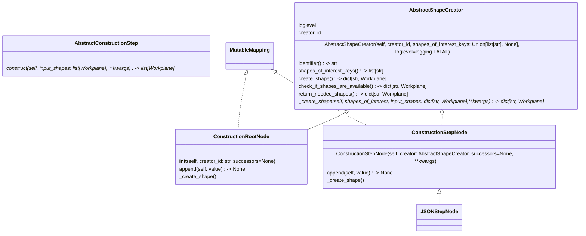
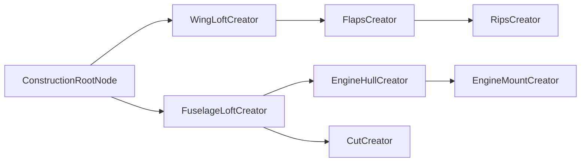

# Core Building Blocks 

The basic idea is, that we create a construction tree. The tree starts with a ```ConstructionRootNode.``` We can
append ```ConstructionStepNodes``` to this root node and to all other ```ConstructionStepNodes.``` All 
```ConstructionStepNodes``` contain instances from classes that inherit from the ```AbstractShapeCreator.```  We call 
those instances shape creators.

Shape creators implement the ```_create_shape(self, shapes_of_interest: dict[str, Workplane],
                      input_shapes: dict[str, Workplane],
                      **kwargs) -> dict[str, Workplane].```
When we call the ```create_shape``` methode of the root node, then the construction tree is traversed depth first, 
and in each step the shape creator is called and either creates new shapes, modifies shapes that have been created 
before or performs other operations like fusing shapes or cutting of shapes from other shapes. The shapes are returned
in a dictionary with a string key and a cadquery ```Workplane``` object that represents the shape. In this way we can 
return multiple shapes from one creator. E.g. cutting a fuselage into 5 equal parts. By convention the dict key
should include the ```creator_id.``` Best practice is that if only one shape is returned the key is the ```creator_id,```
if multiple shapes are returned the keys should begin with the ```creator_id``` followed by an underscore '_'.

The shapes that are used can be referred to by their unique key (same as explained before). Shape created with the 
same key will overwrite the first one as all shapes are stored in a single dictionary after they have been created.

Let's have a look at a simple shape creator which fuses to shapes A and B.
```python
class Fuse2ShapesCreator(AbstractShapeCreator):
    """
    Fusing shape B with shape A.
    """
    def __init__(self, creator_id: str, shape_a: str = None, shape_b: str = None, loglevel=logging.INFO):
        self.shape_a = shape_a
        self.shape_b = shape_b
        
        super().__init__(creator_id, shapes_of_interest_keys=[self.shape_a, self.shape_b], loglevel=loglevel)
```
First have a look at our constructor code. For calling the super constructor of ```AbstractShapeCreator``` we basically 
need a ```creator_id: str``` and ```loglevel=logging.INFO``` what the
loglevel does, will be explained later. And in our case also ```shape_a: str``` and ```shape_b: str.``` Both shapes are
shapes of previous construction steps and are referred by their key string, which by convention should include the 
```creator_id.``` By handing over those shapes
into the ```shapes_of_interest_keys=[self.shape_a, self.shape_b]``` list parameter, the framework takes care of
providing those shapes to the ```_create_shape(self, shapes_of_interest: dict[str, Workplane],
                      input_shapes: dict[str, Workplane],
                      **kwargs) -> dict[str, Workplane]:``` function via the ```shapes_of_interest: dict[str, Workplane]```
parameter. Shapes in the shape_of_interest_keys which are ```None```, will be automatically filled with the last shapes 
produced by the previous steps. So if we produced shape A, after that shape B then we call the fuse operator without 
giving the creator_ids for shape_a and shape_b. Then the input_shapes dict will be filled with [A, B] as shapes.

Let's have a look at the `_create_shape` function inherited from the abstract base class `AbstractShapeCreator`.
```python 
    def _create_shape(self, shapes_of_interest: dict[str, Workplane],
                      input_shapes: dict[str, Workplane],
                      **kwargs) -> dict[str, Workplane]:
        shape_list = list(shapes_of_interest.values())
        logging.info(f"fusing shapes '{list(shapes_of_interest.keys())[0]}' + '{list(shapes_of_interest.keys())[1]}' --> '{self.identifier}'")
        shape_list = [sh if isinstance(sh, cq.Workplane) else cq.Workplane(obj=sh) for sh in shape_list]

        fused_shape = shape_list[0] + shape_list[1]

        fused_shape.display(name=self.identifier, severity=logging.DEBUG)
        return {self.identifier: fused_shape}
```
The ```input_shapes: dict[str, Workplane]``` parameter holds a dictionary with all the shapes that have been constructed 
in the previous step identified by their keys. `**kwargs` holds the shapes of all previous steps as a dict of shapes. 
This is how we can access any shapes. However, best practice is to use the `shapes_of_interest: dict[str, Workplane]` 
parameter, which contains only the shapes that we handed over to the super constructor. 

```python
class Fuse2ShapesCreator(AbstractShapeCreator):
    """
    Fusing shape B with shape A.
    """
    def __init__(self, creator_id: str, shape_a: str = None, shape_b: str = None, loglevel=logging.INFO):
        self.shape_a = shape_a
        self.shape_b = shape_b
        super().__init__(creator_id, shapes_of_interest_keys=[self.shape_a, self.shape_b], loglevel=loglevel)

    def _create_shape(self, shapes_of_interest: dict[str, Workplane],
                      input_shapes: dict[str, Workplane],
                      **kwargs) -> dict[str, Workplane]:
        shape_list = list(shapes_of_interest.values())
        logging.info(f"fusing shapes '{list(shapes_of_interest.keys())[0]}' + '{list(shapes_of_interest.keys())[1]}' --> '{self.identifier}'")
        shape_list = [sh if isinstance(sh, cq.Workplane) else cq.Workplane(obj=sh) for sh in shape_list]

        fused_shape = shape_list[0] + shape_list[1]

        fused_shape.display(name=self.identifier, severity=logging.DEBUG)
        return {self.identifier: fused_shape}
```



