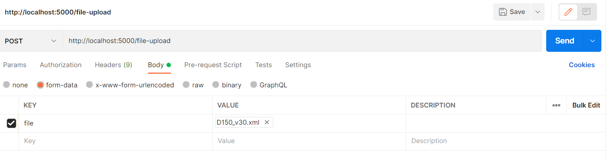

# User Guide


1. Start up the Flask server by navigating to the source directory and entering the following command in a terminal. The server runs by default on port 5000: 
```
python main_funktion.py 
```

3. Make your request to the REST API by sending a CPACS file (see *REST API Definition* below)
4. The response from the API is a an STL file containing the modelled object

## REST API Documentaion

### POST /wing-upload

This endpoint is used for the modelling of wings, defined in the CPACS format.
The *request body* should contain a single entry named `file` that points to a CPACS file.
The *response* is an STL file with the modelled object.

### POST /fuselage-upload

 This endpoint is used for the modelling of fuselages, defined in the CPACS format.
The *request body* should contain a single entry named `file` that points to a CPACS file.
The *response* is an STL file with the modelled object.

### Example



*Note: The response in Postman is shown as raw data. The file can be saved by clicking 'Save Response' -> 'Save to a file'.*

# Development Setup

1. Install Anaconda Distribution for Python 3.9 https://www.anaconda.com/products/distribution

2. Clone the Repository 

3. Open Git Bash (or if it does not work, Anaconda Prompt) and navigate to the repository

4. Build the conda environment with `conda env create -f environment.yml`

5. Open the Anaconda Navigator and select `default-env`

6. Update the package `pythonocc-core` to the latest version

7. Open Pycharm and open the corresponding repository

8. Set as python interpreter the python.exe of the  `default-env` environment

## Troubleshooting

* If a Nullpointer Exception because of Tigl occurs, try to update the pythonocc package in the `default-env` (through Anaconda Navigator)

* It seems like Visual Studio Code has some problems to find certain packages. It is recommended to use with PyCharm

## Useful ressources
[pythonocc-demos](https://github.com/tpaviot/pythonocc-demos/tree/master): Contains a vast amount of examples, how to get things done in pyhton occ.
