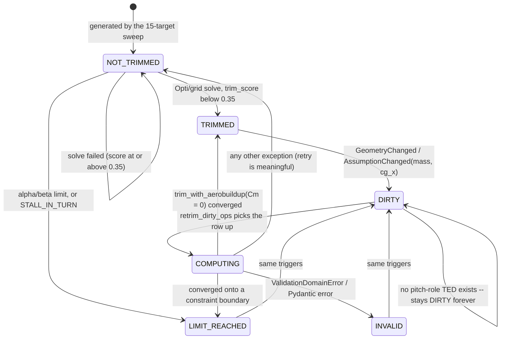
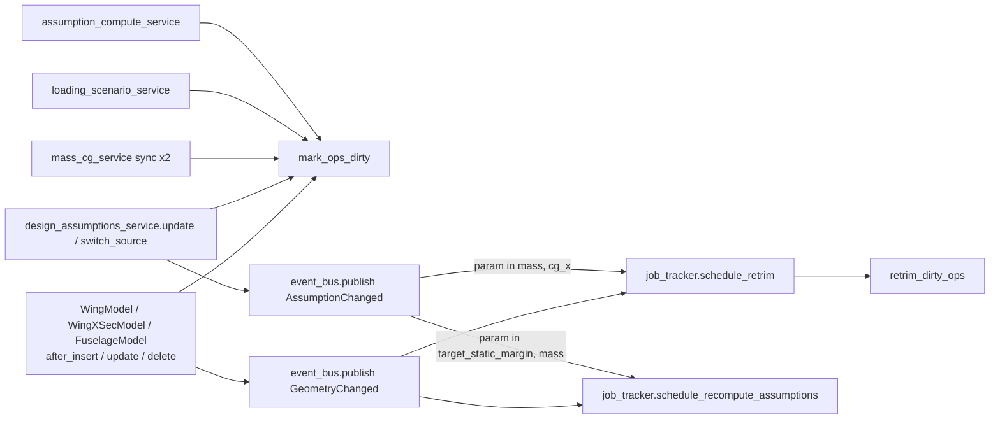

# retrim-invalidation — Technical Design

> Focuses on HOW this use case is built, read from the legacy code.
> Parent module design: [`../design.md`](../design.md).
> Confidence markers: 🟢 CONFIRMED · 🟡 INFERRED · 🔴 GAP.

## Interface

| Symbol | Signature | Returns | Note |
|---|---|---|---|
| `mark_ops_dirty` | `(session, aeroplane_id)` | `None` | bulk `UPDATE`; called by the **publisher**, never by a handler 🟢 |
| `retrim_dirty_ops` | `(aeroplane_id)` | summary dict | opens its **own** `SessionLocal` 🟢 |
| `_find_pitch_control_name` | `(aeroplane_schema)` | `str \| None` | 🔴 returns the raw DB TED name (#955) |
| `job_tracker.schedule_retrim` | `(aeroplane_id)` | `None` | debounced, in-memory 🟢 |
| `job_tracker.schedule_recompute_assumptions` | `(aeroplane_id)` | `None` | debounced, in-memory 🟢 |
| `GeometryChanged` / `AssumptionChanged` | domain events | — | `app/core/events.py` 🟢 |

No HTTP surface of its own; the only observable route is
`GET /aeroplanes/{id}/assumptions/recompute-status` (owned by
`mission-and-sizing`). 🟢

## The status machine



## Main Flow — invalidation fan-in



**Seven publishers, two events, two jobs.** Every publisher performs the pair
`mark_ops_dirty(...)` **then** `event_bus.publish(...)` by hand. Handlers only
schedule jobs — they never mark (BR-82).

### Marking 🟢

```sql
UPDATE operating_points
   SET status = 'DIRTY'
 WHERE aircraft_id = :aeroplane_id
   AND status NOT IN ('DIRTY', 'COMPUTING')
```

The two exclusions carry the whole concurrency story: a row already `DIRTY`
needs no second mark, and a row in `COMPUTING` is being solved right now —
re-marking it would either lose the in-flight result or cause the retrim to
overwrite a newer invalidation.

### Routing 🟢

```
GeometryChanged      → schedule_retrim  AND  schedule_recompute_assumptions
AssumptionChanged    → schedule_retrim              if param ∈ {mass, cg_x}
                     → schedule_recompute_assumptions
                                                    if param ∈ {target_static_margin, mass}
```

`cg_x`, `cd0` and `cl_max` are **deliberately excluded** from the recompute set:
they are the recompute's own outputs, and including them would create
`recompute → AssumptionChanged(cg_x) → recompute` (BR-83).

### Effective-value gating 🟢

`update_assumption` publishes `AssumptionChanged` and marks OPs dirty **only**
when `active_source == "ESTIMATE"`. Editing an estimate while the calculated
value is active changes nothing *effective*, so the whole chain must stay quiet
(BR-27). `switch_source` always publishes, because switching always changes the
effective value.

## Main Flow — the retrim job

```
retrim_dirty_ops(aeroplane_id):

  session = SessionLocal()            # its OWN session — runs outside a request,
                                      # so BR-78's get_db() boundary does not apply
  try:
      pitch = first TED with role ∈ _PITCH_ROLES
                = {elevator, stabilator, elevon, ruddervator}
      if pitch is None:
          log.warning("no pitch control — operating points stay DIRTY")
          return                                          # 🟡 absorbing state removed (P-WARN-0)

      trimmed_any = False
      for op in SELECT … WHERE aircraft_id = :id AND status = 'DIRTY':
          op.status = 'COMPUTING' ; commit          # claim the row
          try:
              result = trim_with_aerobuildup(airplane, op, pitch, Cm, 0.0, bounds)
              if result.converged:
                  op.controls[pitch] = result.deflection
                  op.control_deflections = {...}
                  op.status = 'TRIMMED' ; trimmed_any = True
              else:
                  op.status = 'LIMIT_REACHED'
          except (ValidationDomainError, PydanticValidationError):
              op.status = 'INVALID'                 # terminal — a corrupt row
              log.warning(...)
          except Exception:
              op.status = 'NOT_TRIMMED'             # retryable
          commit

      if trimmed_any:
          recompute stability from the FIRST trimmed operating point
  finally:
      session.close()
```

The `COMPUTING` write **is** the claim: because `mark_ops_dirty` excludes
`COMPUTING`, a concurrent invalidation cannot steal a row mid-solve, and because
the selection is `status = 'DIRTY'`, a second retrim pass will not pick up a
claimed row. 🟡 This is optimistic and relies on the commit landing before the
solve starts; there is no row-level lock.

## Alternative Flows

- **No pitch-role TED.** The job returns immediately; every OP stays `DIRTY`
  with only a log warning. 🟡 **The absorbing `DIRTY` state is removed** — a state indistinguishable from "still working" in the UI is the undeclared degradation `P-WARN-0` forbids. To a user this is indistinguishable from "still
  computing".
- **The trim does not converge.** `LIMIT_REACHED` — the row is *not* left
  `DIRTY`, so the loop terminates rather than retrying forever.
- **The stored row is corrupt.** `INVALID`; the next cycle's
  `WHERE status = 'DIRTY'` skips it. It re-enters the loop only when an
  invalidation moves it back to `DIRTY` (which `mark_ops_dirty` does, since
  `INVALID` is not excluded).
- **Any other exception.** `NOT_TRIMMED` — deliberately retryable, because the
  cause is presumed transient.
- **A handler raises.** The event bus isolates it; the triggering write is
  unaffected (BR-84).
- **The process restarts.** The in-memory job registry is lost, but the `DIRTY`
  rows persist and are picked up by the next scheduled pass. The durable queue
  *is* the status column. 🟡

## Dependencies

- **[`../operating-point-solve/`](../operating-point-solve/requirements.md)** —
  `trim_with_aerobuildup` and the resolution helpers.
- **[`../stability-derivatives/`](../stability-derivatives/requirements.md)** —
  the post-retrim stability refresh.
- **[`../aero-context-single-source/`](../aero-context-single-source/requirements.md)**
  — `schedule_recompute_assumptions` targets it.
- **`mission-and-sizing`** — `design_assumptions_service.update` /
  `switch_source` are two of the seven publishers; `debounce_seconds` lives on
  `aircraft_computation_config`.
- **`wing-design` / `fuselage-design`** — the three listened-to models, and the
  TED roles that decide whether a pitch control exists.
- **`mass-and-balance`** — `mass_cg_service` publishes twice.
- **`platform-core`** — the event bus, the in-memory job tracker, `SessionLocal`,
  BR-78/BR-84.

## Identified Design Decisions

| Decision | Evidence in code | Confidence |
|---|---|---|
| Status is the durable queue; the job registry is in memory | `background_jobs.py` + `operating_points.status` | 🟢 |
| Marking excludes `DIRTY` and `COMPUTING` | `invalidation_service.py:26-36` | 🟢 |
| `COMPUTING` doubles as the claim (no row lock) | retrim loop | 🟡 |
| The retrim owns its own session and commit boundary | `retrim_service.py:53-158` | 🟢 |
| `INVALID` is terminal for retry, everything else is retryable | retrim exception branches | 🟢 |
| Recompute triggers exclude the recompute's own outputs | `_RECOMPUTE_TRIGGERING_PARAMS` | 🟢 |
| Events fire only on an effective-value change | `update_assumption` (BR-27) | 🟢 |
| Marking and publishing are separate, hand-paired responsibilities | seven publishers | 🟡 (BR-82) |
| Only the **pitch** axis is re-trimmed in the background | `_PITCH_ROLES` | 🟢 |
| A subscriber failure never breaks the publishing write | event bus (BR-84) | 🟢 |
| The pitch control is looked up by **DB name** | `_find_pitch_control_name` | 🔴 (#955) |
| The three models are attached in two modules | `stability_events` + `avl_geometry_events` | 🔴 |

## Internal State

- `operating_points.status` — the machine above; the only persisted
  multi-valued status in the system.
- `operating_points.controls` / `control_deflections` — written on a successful
  retrim.
- `operating_points.warnings[]` — accumulates `ALPHA_LIMIT_REACHED`,
  `BETA_LIMIT_REACHED`, `STALL_IN_TURN`, `NOT_TRIMMED`, … and is **never
  cleared**. 🟡
- `stability_results.status` — flipped to `DIRTY` by the same listeners.
- `avl_geometry_files.is_dirty` — flipped by the same listeners; **never
  auto-cleared** (→ `avl-integration`). 🟢 A successful regenerate now clears `is_dirty` (`Q-AV-4`).
- **In memory only:** the debounced job registry (`platform-core`). It does not
  survive a restart, by design. 🟡

## Observability

- `status` is the primary signal, and every transition is a state change a
  reader can poll. 🟢
- `warnings[]` explains *why* a row is `LIMIT_REACHED` (`ALPHA_LIMIT_REACHED`,
  `STALL_IN_TURN`, …). 🟡 but it is additive and never pruned.
- `GET …/assumptions/recompute-status` exposes the scheduler's view. 🟢
- 🔴 The **most important** failure — "no pitch control, nothing will ever
  happen" — is **log-only**. Nothing on the row or in any API response
  distinguishes it from work in progress.
- 🔴 Duplicate listener registration produces duplicate log lines for every
  geometry write, which makes log-based diagnosis of this area misleading.

## Risks and Gaps

- 🔴 **`DIRTY` is absorbing without a pitch control.** Proposed fix: a distinct
  status (or a `NO_PITCH_CONTROL` warning on the row) so the UI can explain the
  stall instead of showing a permanent "recomputing" state.
- 🔴 **Duplicate listener registration** (`stability_events.py` +
  `avl_geometry_events.py`) doubles every `GeometryChanged` and every
  `mark_ops_dirty`. The operations are idempotent, so the damage is doubled work
  and misleading logs — but the debounced scheduler is also poked twice per
  edit.
- 🔴 **`_find_pitch_control_name` returns the DB name** (#955). It works only
  because the AeroBuildup trim service re-resolves display and role names; a
  change there would break the background retrim silently.
- 🟡 **The claim is optimistic.** `COMPUTING` is written and committed before the
  solve, but nothing locks the row. Two schedulers racing on the same aircraft
  could in principle both read `DIRTY` before either commits.
- 🟡 **Marking and publishing are paired by convention.** A new publisher that
  forgets `mark_ops_dirty` schedules a retrim that finds nothing to do — and the
  handler still logs "OPs marked DIRTY" (BR-82).
- 🟡 **Warnings are never cleared**, so a successfully retrimmed row can still
  carry a `NOT_TRIMMED` warning.
- 🟡 **The job registry is in-memory.** Correct by design (the `DIRTY` rows are
  the durable queue), but a restart mid-`COMPUTING` leaves a row stuck in
  `COMPUTING`, which `mark_ops_dirty` explicitly refuses to touch — **there is no
  reaper for orphaned `COMPUTING` rows**. 🟡 `Q-AA-6` (code lookup) settles the orphan handling.
- 🟡 **Only pitch is re-trimmed.** Roll/yaw trim state is never refreshed in the
  background, so a turn operating point's lateral controls silently age.
