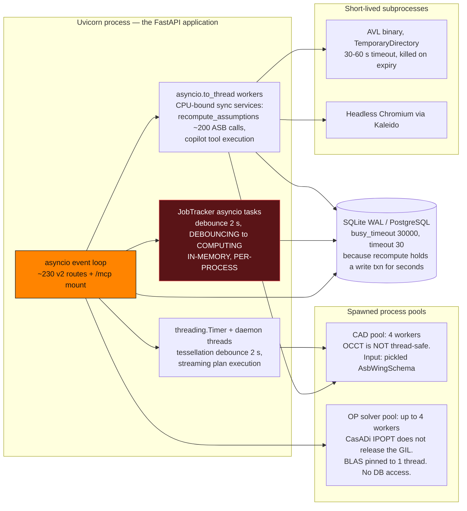
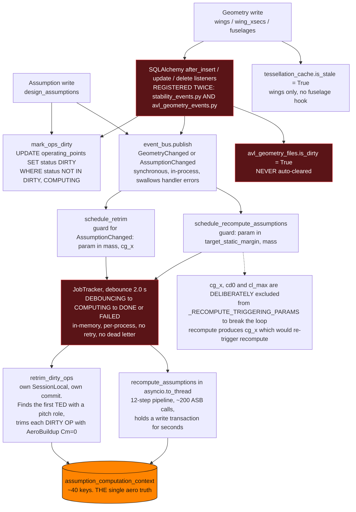

# Architecture — da3Dalus / cad-modelling-service

> Produced by the **Reversa Architect** (`doc_level = completo`, phase
> *interpretação*). This document synthesises
> [`inventory.md`](inventory.md), [`dependencies.md`](dependencies.md),
> [`code-analysis.md`](code-analysis.md),
> [`data-dictionary.md`](data-dictionary.md), [`domain.md`](domain.md),
> [`state-machines.md`](state-machines.md), [`permissions.md`](permissions.md)
> and the 18 retroactive [`adrs/`](adrs/README.md).
>
> Confidence markers: 🟢 CONFIRMED · 🟡 INFERRED · 🔴 GAP.
>
> Companion artifacts: [`c4-context.md`](c4-context.md) ·
> [`c4-containers.md`](c4-containers.md) · [`c4-components.md`](c4-components.md) ·
> [`erd-complete.md`](erd-complete.md) ·
> [`traceability/spec-impact-matrix.md`](traceability/spec-impact-matrix.md).
---

## 0. The fundamental loop 🟢

> Stated by the maintainer, 2026-08-16. **This is the through-line of the whole
> application**, and several decisions in the specification-validation interview only
> make sense against it. It is recorded first because everything after it is a
> refinement of it.

```
    ┌─────────────────────────────────────────────────────────────┐
    │                                                             │
    ▼                                                             │
① PARAMETRIC DESIGN ──► ② COMPONENTS ──► ③ PLAN ──► ④ CREATORS ──┤
   the aircraft            that influence   built from   consume ALL
   described by            the construction  Creators    available
   parameters                                            information
                                                              │
                                                              ▼
                                                    ⑤ EXECUTION RESULTS
                                                       · artefacts
                                                       · design adjustments
                                                       · defects the build revealed
```

**① Parametric design.** The aircraft is described by parameters — wing stations,
superellipse fuselage sections, spar plans — not by drawn geometry.

**② Components withconstructional consequence.** Parts are added that will *influence
the construction*: servos, motors, batteries, spars. They are not merely a bill of
materials; they change what gets built.

**③ A plan is created from Creators.** The construction plan is a tree of Creator
invocations, serialised through the `$TYPE` dialect.

**④ Creators consume *all* available information about the aircraft** to produce a
construction. This is the load-bearing word: not a subset, not what happens to be passed
in — everything the app knows.

**⑤ Results flow back into the app** — as artefacts, **and** as design adjustments or
defects that plan execution uncovered. **Execution is not a terminal output; it closes
the loop.**

### Why this matters for reading the rest of this document

Several decisions are consequences of ⑤ rather than of local reasoning:

| Decision | Follows from |
|---|---|
| `Q-CP-2` — Creators receive the component tree and COTS library; the three hard-coded empty slots are an **unfinished migration**, not a design choice | ④ *all available information* |
| `R2-03` — an unconvertible wing **fails** the run instead of degrading it | ⑤ a degraded result feeds a lie back into the design |
| `Q-VI-4` — the maintainer must be able to **tell when a solid is defective** | ⑤ a defect the build reveals is an output, not an error to swallow |
| `Q-WD-10 ①` — the turbulator optimum **flows back** into `wing_xsec_turbulators`; a `WingCreator` can print it | ⑤, and the turbulator is a *manufacturable* feature |
| `Q-CG-4` — the live 3-D path **is** plan execution | ③/④ the plan is where geometry truth is produced |
| *Minimise part count* — every joint is a weak point | ⑤ construction knowledge constrains the design |

### The gap this exposes — and its structural cause 🟢

**Step ⑤ is the least implemented part of the loop, and the reason is the return type.**
Confirmed by the maintainer, 2026-08-16, and verified in code:

```python
# cad_designer/airplane/AbstractShapeCreator.py:49
def create_shape(self, input_shapes: dict[ShapeId, Workplane] = None,
                 **kwargs) -> dict[ShapeId, Workplane]:
```

**A plan run returns a map of name → CadQuery `Workplane`, and nothing else.** That
signature has no room for anything but geometry — no warnings, no measured values, no
"this spar could not keep its hinge clearance", no "the solid came out non-manifold at
this fillet". `construction_plan_service.py:692` calls `root_node.create_shape()` and
receives exactly that map.

So the artefact half of ⑤ works (`construction_parts`, STEP/STL downloads) and **the
feedback half cannot**, not because nobody wired it but because **the interface cannot
carry it**. Every finding a Creator makes during execution is discarded at the return
statement.

**This reframes several open items as one problem:**

- `Q-VI-4`'s solid-status detection is the first deliberate attempt to get *one* finding
  back — and it needs its own path precisely because the return type has no slot for it.
- `Q-CP-3`'s `DesignWarning` on a dropped wing is emitted by the *service*, not by the
  Creator that discovered the problem.
- `R2-03`'s decision to **fail** rather than degrade is partly a consequence of this: with
  no way to report a partial result faithfully, aborting is the only honest option.

**The design question this raises is deliberately not answered here:** what a Creator
should return instead — geometry plus findings, a result object, an emitted event — is an
architectural decision with consequences for all 29 Creators and for `cad_designer`'s
frozen status (ADR 0002). It is recorded as the **one structural change that would close
the loop**, and it belongs in a design round of its own rather than in a validation
answer.

---

## 1. The system in one page

**da3Dalus** is a *conceptual and preliminary aircraft design workbench* for RC
model aircraft and small UAVs. It is not a CAD program with an aero plug-in and
not an aero tool with a geometry importer — it is a single **design loop** in
which one parametric aircraft description simultaneously drives:

1. **manufacturable geometry** — CadQuery/OCCT solids, STEP/STL/IGES/3MF export,
   3-D-printed wings, carbon spar layout;
2. **aerodynamic prediction** — AeroSandbox AeroBuildup / VLM, a vendored AVL
   Fortran binary, NeuralFoil airfoil surrogates;
3. **classical preliminary sizing** — matching chart, V-n envelope, CG envelope,
   field length, endurance, powertrain;
4. **a bill of materials** — a COTS component library with mass and CG roll-up.

Three code bases live in one repository. 🟢

| Part | Path | LOC | Role | Change policy |
|---|---|---:|---|---|
| Backend service | `app/` | ~182 k | FastAPI v2 REST (≈230 routes) + FastMCP tool server (76 tools). Business logic, persistence, CAD orchestration, aero analysis. | normal |
| CAD / topology library | `cad_designer/` | ~22 k | Standalone CadQuery geometry and topology library. | **frozen** — read-only topology, new Creators only (ADR 0002) |
| Frontend workbench | `frontend/` | ~50 k | Next.js 16 / React 19 client-side design workbench. | normal |

**Scale.** 781 Python files (302 backend tests + 26 `cad_designer` tests), 396
TypeScript files (180 vitest files, 10 Gherkin features), 35 database tables, 62
Alembic revisions on a single head, 1 665 airfoil `.dat` files, ~455 APC
propeller performance files, 13 external integrations, 1 495 commits from
2022-07 to 2026-07.

**Two audiences, one model.** 🟢 Non-professional hobbyists *and* professional
RC/UAV designers are served by the same aircraft description. That duality
explains why the domain vocabulary mixes academic terms (neutral point, Oswald
factor, Reynolds band) with hobby terms (wing cube loading, hand launch, 3-D
acro), and why **almost every computed number carries a provenance and a
confidence alongside it** — `polar` vs `cold_start`, `aerobuildup_trefftz` vs
`fit` vs `fallback`, `weight_items` vs `component_tree`, `trimmed` vs
`computed` vs `estimated` vs `limit`.

---

## 2. Architectural style

### 2.1 The layered request flow 🟢

```
endpoint (app/api/v2/endpoints/)   thin: validate → delegate → return a schema
   → service (app/services/)        business logic, external tools, orchestration
      → model      (app/models/)    SQLAlchemy, 35 tables
      → schema     (app/schemas/)   Pydantic, 49 modules — the boundary contract
      → converter  (app/converters/) schema ↔ model ↔ WingConfiguration ↔ AeroSandbox
```

The layering is a **convention with a written rule**
(`.claude/rules/python-conventions.md`), not a mechanism: nothing in the build
prevents an endpoint from querying the database. In practice it holds — the
85 service modules carry the logic and the 48 endpoint modules are thin. Two
structural exceptions are worth knowing:

* the **MCP server bypasses the layering entirely** — it imports endpoint
  *functions* and calls them as plain callables (see §4.2);
* **`app/api/v1/` does not exist** although both `CLAUDE.md` and `app/CLAUDE.md`
  describe a "legacy v1 REST surface". The documentation is stale 🔴
  (**TD-52**).

### 2.2 The four ring model

The 18 modules organise into five rings whose membership predicts blast radius.
See [`c4-components.md`](c4-components.md) §C-A for the diagram and
[`traceability/spec-impact-matrix.md`](traceability/spec-impact-matrix.md) for
the full coupling matrix.

| Ring | Modules |
|---|---|
| 1 Platform | `platform-core` |
| 2 Domain core | `aeroplane-core`, `wing-design`, `fuselage-design`, `airfoil-catalog` |
| 3 Analysis & intent | `aero-analysis`, `avl-integration`, `mission-and-sizing`, `mass-and-balance` |
| 4 Fabrication & parts | `cad-generation`, `cad-designer-topology`, `construction-plans`, `openvsp-import`, `powertrain` |
| 5 Change & interfaces | `versioning`, `ai-copilot`, `mcp-server`, `frontend-workbench` |

### 2.3 The three organising invariants

Everything else in this document is a consequence of these three. 🟢

**I-1 — Unit duality (ADR 0001).** The database and AeroSandbox speak
**metres**; `WingConfig` and every `cad_designer` topology class speaks
**millimetres**. Conversion happens only in `app/converters/` and in the
`_convert_spare_to_*` helpers of `wing_service` (`scale = 0.001` mm→m,
`scale = 1000.0` m→mm). There is **no type-level unit**; three named conversion
functions are the entire enforcement. Six unit systems coexist in total:
metres (DB/ASB), millimetres (`WingConfig`, `cad_designer`, *and*
`wing_xsec_spares` inside the metre DB — gh-402), grams
(`components.mass_g`, `weight_override_g`, `weight_g`), kilograms
(`weight_items.mass_kg`), inches (propeller `diameter_in` / `pitch_in`, the APC
source unit), and radians (`operating_points.alpha` / `.beta` only).

**I-2 — Transaction ownership (ADR 0009).** `get_db()`
(`app/db/session.py:55-64`) commits on success and rolls back on exception.
Services call `db.flush()` / `db.add()` but **never** `db.commit()` /
`db.begin()`. Four paths legitimately own their own session (the two lifespan
seeders, `_recompute_sync`, `JobTracker._run_backfill_for_names`); one path
should but does not (**TD-01**).

**I-3 — One aero truth per aircraft (ADR 0004).** `cd0` (**parasite**, not
total CD), `e_oswald`, `(L/D)max` and `x_np` are produced **once** by
`assumption_compute_service.recompute_assumptions` at the cruise point and
cached on `aeroplanes.assumption_computation_context`. Every downstream consumer
reads that context; none re-derives its own. One known violation
(**TD-08**).

---

## 3. Runtime architecture

### 3.1 Process topology 🟢



**Why the pools exist, precisely** 🟢

* **CAD pool** — the `cad_service` docstring states it outright: OCCT is not
  thread-safe. The same `.intersect().clean()` call that takes ~100 ms on the
  main thread **hangs indefinitely** in a worker *thread* because OCCT holds
  global state (BRepCheck messaging, memory pools, interrupt handlers). `spawn`
  is chosen for platform consistency; `fork` is unsafe with OCCT bindings
  already loaded. `WingConfiguration` holds `cq.Vector` / OCCT `gp_Vec` and is
  **not picklable**, so the parent ships an `AsbWingSchema` and the worker
  rebuilds the configuration at `scale=1000.0`. ADR 0005.
* **OP solver pool** — the CasADi/IPOPT solve does **not** release the GIL (a
  thread pool benchmarked at 0.35–0.89×), so the streaming generation path uses
  a bounded process pool with BLAS pinned to one thread per worker, giving
  ≈2.9× at 4 workers. Workers receive a picklable `_WorkerSolveCtx` and **never
  touch the database**; the main thread owns all persistence. The
  *non-streaming* batch path stays sequential on purpose so its contract and its
  mocks are unchanged. gh-867.

🔴 **The process-isolation rule is applied inconsistently.** Construction-plan
execution calls the *same* CadQuery/OCCT stack on the request thread
(`execute_plan`) or on a `threading.Thread` (`execute_plan_streaming`) inside
the FastAPI process. Either the isolation is unnecessary or plan execution is
exposed to the documented hang (**TD-10**). ADR 0005 is recorded as
*"Accepted, inconsistently applied"*.

### 3.2 Change propagation — how an edit reaches the numbers 🟢

This is the most important control flow in the system, and it is the one a new
feature is most likely to break.



Three properties of this flow are load-bearing and easy to break:

* **Marking and notifying are two separate responsibilities.** `mark_ops_dirty`
  is called by **seven publishers by hand**, immediately *before*
  `event_bus.publish(...)`. The handlers do not call it — yet their log lines
  read "OPs marked DIRTY". A new geometry-mutating path that publishes but
  forgets to mark leaves stale operating points with no warning. 🔴
* **The recompute loop is broken by an exclusion list, not by a guard.**
  `_RECOMPUTE_TRIGGERING_PARAMS = {target_static_margin, mass}` deliberately
  omits `cg_x`, `cd0` and `cl_max`, because `recompute_assumptions` *produces*
  `cg_x` and including it would loop.
* **Events fire only when the effective value changes.** `update_assumption`
  publishes only when `active_source == "ESTIMATE"` — editing an estimate while
  the calculated value is active changes nothing effective, so the retrim chain
  must not fire.

🔴 The geometry listeners are attached **twice** (once in `stability_events.py`,
once in `avl_geometry_events.py`), so every geometry write publishes
`GeometryChanged` twice and calls `mark_ops_dirty` twice (**TD-13**).

### 3.3 State machines

Twelve lifecycles are catalogued in [`state-machines.md`](state-machines.md).
The one that governs the design loop is the **operating point**:

```
NOT_TRIMMED ──trim──► TRIMMED ──geometry/assumption change──► DIRTY
                 │                                              │
                 ├──► LIMIT_REACHED   (α/β limit, stall in turn) │
                 └──► INVALID         (corrupt row, gh-623)      │
                                                    COMPUTING ◄──┘
```

🔴 **No pitch control ⇒ every OP stays DIRTY forever**, logged only as a
warning. Four of the twelve lifecycles (`JobTracker` jobs, CAD tasks, the MCP
asset registry, the frontend tessellation cache) are **in-memory and
per-process** — they do not survive a restart, are not shared across workers,
and have no persistence, retry or dead-letter path.

---

## 4. The dual API surface

### 4.1 REST v2 — the human path 🟢

≈230 route decorators: 15 unconditional routers + up to 5 capability-gated +
24 `aeroplane/` sub-routers. Two ordering facts are load-bearing:

* `versioning_v2.router` is included **before** `aeroplane_v2.router` so
  `/aeroplanes/compare` matches ahead of `/aeroplanes/{aeroplane_id}` (gh-914);
* `openvsp_import` is the **only** router carrying a path prefix, so its routes
  live under `/api/v2/...` while every other route is mounted at the root 🔴.

Three streaming endpoints use **SSE over POST** (the copilot turn, the OpenVSP
import, and construction-plan execution), which is why the frontend hand-rolls
an SSE reader over `response.body` — the browser's `EventSource` is GET-only.

### 4.2 MCP — the agent path 🟢

76 FastMCP tools mounted in-process at `/mcp`, built at **import time**
(`mcp = get_mcp()` runs before `create_app()`). The registration pattern
separates declaration from installation: `@mcp_tool(name, description)` only
*records* an `MCPToolSpec`; `create_mcp_server()` installs them all.

FastMCP derives each tool's JSON input schema from the **handler signature**, so
the Pydantic parameter types *are* the contract and the decorator's
`description=` string is the only prose the agent sees (the tool functions carry
no docstrings).

The bridge is one function:

```python
async def _call_endpoint(endpoint_fn, **kwargs):
    with SessionLocal() as db:                      # ← no commit, ever
        if "db" in inspect.signature(endpoint_fn).parameters:
            kwargs["db"] = db
        result = endpoint_fn(**kwargs)
        if inspect.isawaitable(result): result = await result
        return _normalize_result(result)
```

It imports the FastAPI **endpoint function** and calls it as a plain callable —
no routing, no `Depends`, no middleware, no exception handlers. Three
consequences, all confirmed:

1. 🔴 **Writes are silently discarded.** `Session.__exit__` calls `close()`,
   which rolls back. Every tool whose service relies on `get_db()`'s commit
   returns a success payload while persisting nothing (**TD-01**).
2. **Only `db` is injected.** Other `Depends(...)` parameters must be supplied
   by hand; several tools pass `settings=get_settings()` and some pass
   `request=None` where the endpoint expects a `Request`.
3. **Service exceptions surface raw** — `NotFoundError` reaches FastMCP as a
   Python exception, not a 404-shaped result.

The surface has also **drifted behind REST**: versioning, the copilot,
components/COTS, construction plans, powertrain and OpenVSP import — every
module added after the initial geometry/analysis core — have no MCP tools
(76 tools vs ≈230 routes) 🔴 (**TD-53**).

Binary results travel through an in-process **asset registry** that returns a
`resource_uri` (`img://<id>` / `data://<id>`) plus a **dual URL** —
`url_from_docker_container` derived from the live request (the agent's network
view) and `url_for_webui` from `settings.base_url` (the browser's view).

---

## 5. The aerodynamic stack

Detailed diagram in [`c4-components.md`](c4-components.md) §C-B.

**Solver policy (ADR 0003).** AeroSandbox is the default everywhere; AVL is
reached only on explicit request. `analyse_aerodynamics` (`app/api/utils.py`) is
the **only** place the three solvers are selected, and it always returns
`(AnalysisModel, Figure | None)` — a solver-agnostic envelope with two adapters
(`from_avl_dict`, `from_abu_dict`). Everything downstream reads
`result.reference.Xnp`, `result.coefficients.*`, `result.derivatives.*`.

**AVL's remaining genuine advantages**, as encoded in the code: native indirect
constraints (`d1 PM 0`-style trim), per-section **CDCL** viscous polars, and the
lateral-directional (roll/yaw) axis of mixed surfaces —
`compute_enrichment` explicitly warns that an AeroBuildup trim solved only the
symmetric axis. 🔴 AVL runs are **wing-only**: `AvlBody`/`BFIL` exist in the
emitter but nothing constructs one, and the `.mass`/`.run` file formats are
never produced (mass and run cases go through the `OPER → m` keystroke submenu).

**Three algorithmic decisions worth carrying forward** 🟢

* **CD0 is parasite drag, not total drag.** On a cambered wing α = 0 already
  carries lift (CL ≈ 0.55 for a glider), so publishing `coefficients.CD` as CD0
  double-counts induced drag and collapses `(L/D)max` — 17 instead of 24 on a
  high-AR glider. Ratified against Anderson §6.7.2.
* **`(L/D)max` comes from the self-consistent scalars, not the sweep argmax.**
  `E_max = ½·√(π·AR·e/CD0)` (Scholz eq. 5.39). The raw flattened-sweep
  `argmax(CL/CD)` mixes Reynolds bands and lands on a spurious high-CL sample
  (documented eHawk case: 18.8 @ CL 0.98 vs the correct 23.4 @ CL 0.55).
* **Resolution goes up; thresholds never move (ADR 0012).** The parabolic polar
  fit has six rejection gates. Only `insufficient_points` and
  `non_monotonic_polar` are refinable, and refinement halves the α step and
  widens the margin. A `k ≤ 0` or an unphysical Oswald `e` becomes a **visible
  design warning**, never a silent `0.8` fallback. `NonFiniteSafeJSONResponse`
  embodies the same philosophy for NaN/Inf: `null` is *"an honest 'no value',
  never a fabricated fallback number that would hide the underlying design
  problem"*.

---

## 6. The CAD stack

Detailed diagram in [`c4-components.md`](c4-components.md) §C-C.

`cad_designer/` is **frozen by policy** (ADR 0002): `aircraft_topology/**` and
`GeneralJSONEncoderDecoder.py` are read-only — bugs and Sonar findings there are
*deliberately* not fixed — while `creator/`, `geometry/`, `cq_plugins/` and
`decorators/` are open. The one approved topology change is gh-934's
`Turbulator`. Enforcement is by **exclusion, not by code**:
`sonar.exclusions = …,cad_designer/**` and ruff `extend-exclude`.

Two serialisation systems coexist and never mix: the `$TYPE` dialect for
construction-plan trees (whose resolvable universe is exactly what
`GeneralJSONEncoderDecoder` imports, so topology classes can never appear in a
plan JSON) and `__getstate__`/`from_json_dict` for topology objects (the
`/wingconfig` endpoints). Topology objects reach a running plan only as
**decoder kwargs**.

The structural design highlight is the **spar pipeline**: section-modulus sizing
→ station sampling → a CAD-free layout solve. The solver is deliberately pure
decision logic so every branch runs on the CI fast tier with hand-built
`StationData`, and it reports **utilisation honestly** — a value above 1.0 with
a message naming the governing station is preferred over a silently clamped
"feasible" answer.

---

## 7. Persistence

SQLAlchemy 2.0.49 + Alembic 1.18.4 (62 revisions, single head `d8015f98814c`).
SQLite by default, PostgreSQL supported. 35 tables — see
[`erd-complete.md`](erd-complete.md).

**SQLite is configured for a specific workload** 🟢 —
`journal_mode=WAL`, `synchronous=NORMAL`, `busy_timeout=30000`,
`check_same_thread=False`, connection `timeout=30`. The reason is written in the
code: the assumption recompute holds a write transaction open for **several
seconds** while AeroBuildup runs, so without WAL a parallel write fails with
"database is locked".

`SessionLocal` uses `expire_on_commit=False`, `autocommit=False` and
`autoflush=False`. **`autoflush=False` is significant**: services must flush
explicitly before a dependent query can see their pending writes, which is why
`db.flush()` appears throughout the versioning and copilot services.

**Three tables reference an aeroplane by a plain column, not a declared FK**
(`component_tree`, `construction_parts`, and `construction_plans` with a
`String` FK onto an `Integer` PK). They are invisible to the `ForeignKey`
reflection that the clone-coverage test uses, and would fail on PostgreSQL.

---

## 8. Versioning and the AI copilot

### 8.1 Versioning by row copy (ADR 0006) 🟢

There is no "unversioned" aircraft. `create_aeroplane` writes `root_id =
self.id`, creates a `main` branch (`is_main=True`, `created_by='human'`) and
points `branch_id` at it; the gh-903 migration backfilled the same shape for
every pre-existing row and **dropped the old `design_versions` JSON-snapshot
table**.

A version is a **real `aeroplanes` row with its own full subgraph** — 17 tables
deep-copied in a fixed order with FK re-keying, 18 excluded with mandatory
reasons. The counter-intuitive operation is `snapshot`, which inserts the frozen
copy *behind* the head:

```
before:   [old_pred] ← [head (mutable, id=H)]
after:    [old_pred] ← [snapshot (immutable, id=S)] ← [head (id=H, unchanged)]
```

The head keeps its id, UUID and every inbound reference, which is why the UI
never has to re-point after a snapshot.

Two invariants are enforced at the DB level: a **partial unique index**
(`uq_branches_one_main_per_root`) guarantees exactly one main branch per
lineage, and `use_alter=True` on four constraints resolves the genuine circular
FK between `aeroplanes` and `branches`.

🔴 **No storage-growth control.** Every snapshot is a full row-copy of the whole
design subgraph, `spar_insert_service` snapshots automatically on every
destructive commit, and there is no retention policy, prune or size accounting
(**TD-50**).

### 8.2 The copilot proposes; only a human adopts (ADR 0007) 🟢

The copilot is deliberately the **least** capable actor in the system, and the
restriction is structural rather than policy-based:

* **6 tools**, not the 76-tool MCP surface and not the 230-route REST surface —
  *"only the tools that are safe, fast, and meaningful for an advisory
  interaction"*;
* its **only** write surface is a single disposable `copilot-proposal` branch
  (`created_by='copilot'`, `is_main=False`);
* **there is deliberately no adopt tool** — promoting a proposal to `main` is a
  human-only action in the Versions panel;
* its errors are sanitised before reaching the browser: the configured API key
  is literally redacted and auth/connectivity failures are replaced by a
  *category* message.

**Numbers are computed in Python, never by the model.** `_drag_breakdown`
carries the reason in a comment: *"the LLM is unreliable at this arithmetic (it
has produced both physically-impossible splits and 10x errors)"*. When the split
is physically impossible it returns a `note`-carrying dict with the raw inputs
rather than a wrong answer. `_run_stability_async` **overrides** the freshly
computed neutral point with `ctx["x_np_m"]` so the app never shows two
divergent neutral points.

**Read-retargeting (gh-938)** — while a proposal is open, the three *read* tools
resolve to the proposal head so the model sees its own edits; the two write
tools and `get_version_tree` always target the live node.

The whole LLM-provider dependency is **one factory function**,
`_make_openai_client()`, which tests monkeypatch so no real API call is ever
made in CI. The hub can route to Claude, GPT, Gemini or a sovereign Qwen without
a code change.

🔴 The AI accountability trail is **designed but inert**:
`provenance_message_id` is written and never read, `get_or_open_proposal`'s
`message_id` parameter is never supplied, and `created_by` has four writers
using three vocabularies (`human` / `ai` / `copilot`) with no enum
(**TD-28**).

---

## 9. Cross-cutting platform concerns

| Concern | Mechanism | Notable property |
|---|---|---|
| **Capability probing** (ADR 0017) | `cad_available()` / `aerosandbox_available()`, `@lru_cache(maxsize=1)`, run *before* `create_app()` is defined | On `linux/aarch64` five routers simply do not exist; endpoints that *are* registered use `Depends(require_cad)` → a clean **503**. *"A broken install detected once stays broken for the life of the process."* The API surface **changes shape by platform**. 🟢 |
| **Configuration** | `pydantic-settings` | 🔴 **Two `Settings` classes** with the same name and the same `.env` (`app/core/config.py` SCREAMING_CASE, `app/settings.py` snake_case), **three version strings** (`1.0.0`, `0.1.0`, FastAPI `2.0.0`), and three settings escaping both via bare `os.getenv` (`SQLALCHEMY_DATABASE_URL`, `LOG_LEVEL`, `DISPLAY_CONSTRUCTION_STEP`) — contradicting the project's own rule (**TD-39**). |
| **Error contract** | `ServiceException` hierarchy → three global handlers | 🔴 **Two coexisting envelopes**: `{"error": {code, message, details}}` globally vs FastAPI's `{"detail": …}` from per-module `_raise_http` helpers. Two handlers emit **German** strings in an English product, and the `IntegrityError` handler assumes *every* integrity violation is a duplicate name (**TD-40**). |
| **Numeric safety** | `NonFiniteSafeJSONResponse` renders NaN/±Inf as `null` + a WARNING with the replacement count | 🔴 It is set as `default_response_class` on **exactly one** router (`aeroanalysis`); `operating_points`, `section_aoa`, `airfoils`, powertrain and speed-polar routers all return solver numbers over plain `JSONResponse` and can still 500 on a NaN. |
| **Path safety** | `resolve()` → `relative_to(base)`, symlink rejection, basename reduction, upload allow-lists + 50 MB cap, sanitised STEP filenames | Consistent and genuinely good. This is the one cross-cutting concern with no debt attached. 🟢 |
| **Log hygiene** | log-injection guard on wing names, log-forging guard (S5145) on `flight_profile`, API-key redaction, type-only tessellation errors | 🔴 But the logging itself is unstructured DEBUG-by-default stdout with no request-correlation id. |
| **Security** (ADR 0016) | **none in the application** | See §10. |

---

## 10. Security posture

**The application has no authentication and no authorisation.** 🟢 No login, no
session, no token, no API key, no user table, no role, no tenant, no per-object
ownership check. The word "user" does not appear as a persisted concept anywhere
in the 35-table schema. The one artefact that looks like auth
(`app/core/security.py::verify_token`, comparing against the literal
`"valid_token"`) has **no callers**.

The real trust boundary is a **gitignored** reverse-proxy chain:
ngrok (TLS, fixed domain) → oauth2-proxy with a GitHub OAuth App and a
comma-separated `GITHUB_USERS` allowlist → Caddy → the app. That allowlist is
the *entire* access-control policy of the system, and behind the login there is
no per-user isolation at all.

This was a deliberate infrastructure decision, visible three times in the Git
history (`d4e111ae`, `efa4f553`, `90886197`), and the code carries the admission
inline: *"copied from other python backends to resolve the cors origin
problem"*.

🔴 **Nothing enforces that the boundary is present.** There is no
`TRUSTED_PROXY`, no forwarded-identity header, no bind-address restriction. The
application starts, serves and mutates identically whether it sits behind
oauth2-proxy or on a public interface — and `deploy/` is gitignored, so a fresh
clone cannot recreate the only access control the system has.

The full 16-item gap list is in [`permissions.md`](permissions.md) §5. The three
that dominate: **`/mcp` is unauthenticated and exposes `delete_aeroplane`**;
**a live SQLite database is committed and baked into the Docker image**; and
**there is no audit log** — `created_by` is the nearest thing and it has no
enum.

---

## 11. Delivery and quality gates (ADR 0015)

| Tier | Trigger | What it runs |
|---|---|---|
| `fast` | every PR + push to `main` | ruff, then pytest **excluding** `slow`, `e2e`, `requires_cadquery`, `requires_aerosandbox`, `requires_avl`; `-n auto`; `--cov-fail-under=70` |
| `full` | `ci-full` label or manual dispatch | adds CAD/ASB/AVL-dependent tests back |
| `nightly` | cron `0 3 * * *` | all markers, Python 3.11 + 3.12, **sequential** (memory-heavy), 3 000 s timeout |
| `frontend` | frontend changes | Node **22**, `npm ci`, eslint, **`npx tsc --noEmit`**, vitest + coverage |
| `sonarcloud` | after `fast` + `frontend` | consumes both coverage artefacts |

**The structural consequence of the tiering** 🔴: the SonarCloud `new_coverage`
gate runs the fast tier **without** aero dependencies, so aero-dependent service
code is only counted when it has *mocked* fast tests that stub the solver
boundary. Roughly 516 test files against ~1 180 non-test source files is an
unusually high ratio — but the coverage number and the risk are not aligned.

---

## 12. Technical debt register

53 items, grouped by tier. Every entry is traceable to a `file:line` reference
in [`code-analysis.md`](code-analysis.md) or a table in
[`data-dictionary.md`](data-dictionary.md). Cross-references to
[`questions.md`](questions.md) are given as `Q:<cluster>/<module>`.

### Tier 1 — Confirmed correctness defects (user-visible wrong behaviour)

| ID | Area | Debt | Impact | Conf. |
|---|---|---|---|---|
| **TD-01** | mcp-server | **MCP writes are silently discarded.** `_call_endpoint` opens a bare `SessionLocal()` and never commits; `Session.__exit__` rolls back. ~40 mutation tools (`create_aeroplane`, all wing/xsec/fuselage/control-surface writes, all design assumptions) return a success payload while persisting nothing. No test drives a real endpoint through a real session — `test_mcp_server_tools.py:89` monkeypatches `_call_endpoint` wholesale. | Every external agent write is a lie. Accidentally mitigates the unauthenticated `/mcp` surface. | 🟢 |
| **TD-02** | openvsp-import | **`openvsp_ss_control.register()` is never called in production.** It is absent from `_ensure_handlers_loaded`; the only caller repository-wide is `app/tests/test_openvsp_ss_control.py:24`. | Imported `.vsp3` aircraft **silently arrive with no control surfaces**, while the unit tests pass because they register the handler themselves. | 🟢 |
| **TD-03** | openvsp-import | **`openvsp_validation.validate_geometry` is never called.** The gh-647 span/area/MAC/length sanity check against VSP's own `TotalSpan`/`TotalProjectedArea`/`TotalChord` is referenced only from its test. Its own docstring shows the intended wiring, which does not exist. | A feature shipped and inert; geometry corruption on import goes undetected. | 🟢 |
| **TD-04** | cad-generation | **3MF export is broken by a casing typo.** `map_exporter_type` emits `"ExportTo3MFCreator"`; the real class is `ExportTo3mfCreator`. The `$TYPE` decoder uses `getattr`, so the worker raises `AttributeError` and the task ends `FAILURE`. `app/tests/test_cad_service_extended.py:130` asserts the **wrong** string, locking the defect in. `construction_plan_service.py:563` uses the correct spelling. | Every 3MF export fails. The test suite actively protects the bug. | 🟢 |
| **TD-05** | cad-generation | **`amf` is advertised but unmapped.** `ExporterUrlType.AMF` exists with no entry in the mapping → `ValidationError` → 422. | A documented export format that can never succeed. | 🟢 |
| **TD-06** | cad-generation | **The merged tessellation scene bounding box is always degenerate.** The worker writes `shapes["bb"]` from `BoundingBox.to_dict()` → `{xmin,xmax,…}`, but `_expand_bounding_box` returns early unless the dict has `min` **and** `max`, so the response always falls back to `{"min":[0,0,0],"max":[0,0,0]}`. | The 3-D viewer cannot auto-frame a multi-part scene. | 🟢 |
| **TD-07** | cad-generation | **`./tmp/exports` is a shared mutable directory.** The worker zips *everything* in it and then `os.unlink`s *every* file. `check_task_available` serialises only **per aeroplane** while the pool has 4 workers — two concurrent exports for different aeroplanes capture each other's files and delete them. | Cross-aeroplane data leakage into a download, plus lost exports. Race by construction. | 🟢 |
| **TD-08** | aero-analysis | **`stability_service._auto_populate_cd0` writes the *total* CD into the `cd0` assumption** with source `"stability_analysis"` — exactly the quantity gh-924/ADR 0004 removed from the authoritative path. It runs on a different trigger. | The single source of aero truth can be overwritten with a wrong value between recomputes, collapsing `(L/D)max` and every consumer that reads `cd0`. | 🟢 |
| **TD-09** | cad-generation | **No unique constraint on the tessellation cache's logical key** `(aeroplane_id, component_type, component_name)`, although `get_cached(...).first()` treats it as one. Two concurrent inserts produce duplicates and `.first()` picks one arbitrarily. Compounded by the tessellation path not calling `check_task_available`, so a second POST for the same wing silently overwrites the task entry. | Stale or wrong geometry rendered without any signal. | 🟢 schema / 🟡 impact |
| **TD-10** | construction-plans | **Plan execution runs OCCT in the request process**, contradicting ADR 0005 (`execute_plan` on the request thread, `execute_plan_streaming` on a `threading.Thread`). Additionally the display callback **and** `DISPLAY_CONSTRUCTION_STEP` are **process-global**, with no lock and no per-execution context. | Exposed to the documented OCCT hang; two concurrent streams cross-deliver shape events and can toggle each other's display gate. | 🟢 |
| **TD-11** | aero-analysis / avl | **Control-surface naming divergence (open bug #955).** `build_deflection_limits_from_schema` keys on the raw DB `ted.name` while `controls` carries gh-772 mixing names (`[ruddervator]pitch_htail_1`). Same assumption in `retrim_service._find_pitch_control_name` and `stability_service._find_trim_elevator` (substring match on `"elevator"`). | On any dual-role aircraft (V-tail, elevon, flaperon) authority ratios are computed against a hard-coded ±25° instead of the real limit, and a **phantom 0° surface** is reported that no solver ever trims. | 🟢 |
| **TD-12** | fuselage-design | **`FuselageConfiguration` unit/type defects.** `analysis_specific_options` is assigned a **set containing a dict** (`{dict(...)}`) — a dict is unhashable, so the line raises `TypeError` if ever executed (either the path is dead or `from_step_file` is unused). `from_step_file` also applies `MM_TO_M = 1e-3` **on top of** the caller's `scale`, so the effective scale is `scale × 0.001`. The CAD-side fuselage carries a literal `#TODO generate fuselage from XSecs` and has **no xsec constructor at all**. | Latent crash plus a silent 1 000× scale trap on the only STEP→fuselage factory. | 🟢 |

### Tier 2 — Silently wrong numbers

| ID | Area | Debt | Impact | Conf. |
|---|---|---|---|---|
| **TD-13** | platform-core | **Geometry listeners registered twice** (`stability_events.py` and `avl_geometry_events.py` attach the same three models). | Every geometry write publishes `GeometryChanged` twice and calls `mark_ops_dirty` twice — duplicated background work on every edit. | 🟢 |
| **TD-14** | aero-analysis | **`min_static_margin` / `max_static_margin` are queried but never seeded.** Neither name exists in `VALID_PARAMETERS` / `PARAMETER_DEFAULTS`, so `_get_margin_bounds` always returns empty and the 5 % / 25 % defaults are **effectively hard-coded**. | A documented, user-facing tuning knob that cannot be tuned. | 🟢 |
| **TD-15** | aero-analysis | **A missing `mass` assumption silently yields a 1.0 kg speed polar** with only a log warning. | The returned polar is *structurally valid and physically meaningless*. | 🟢 |
| **TD-16** | mission-and-sizing | **V-n markers are hard-coded to `load_factor = 1.0`** because the stored OP carries no CL. | Turn operating points plot on the 1-g line of the V-n diagram. | 🟢 |
| **TD-17** | mass-and-balance | **Two mass producers overwrite one another silently.** `weight_items` and the component tree both write `design_assumptions.calculated_value` — last write wins. `weight_items` also has **no `component_id`**, so the same battery entered twice is two unrelated rows. `aggregate_weight_items` computes `y`/`z` CG and only `x` reaches the context. | Undetectable double-counting; the discarded estimate is never surfaced. | 🟢 |
| **TD-18** | powertrain | **Two ESC/battery spec-key vocabularies coexist** (`c_rate` in `BatterySpec` vs `c_rating`/`discharge_c` in `_catalog_battery_match`; `continuous_current_a` vs `max_current_a`). `_find_matching_esc` returns the **first ESC in unordered query order**. Propeller mass is never added to `size_powertrain`'s total although it is now known. | A battery imported under one key is invisible to the other consumer; ESC recommendations are arbitrary and unstable; the sizing mass is systematically low. | 🟢 |
| **TD-19** | powertrain | **`prop_component_seed` bypasses `validate_specs`**, so a polar with NULL `diameter_in`/`pitch_in` produces a component violating its own seeded type schema (both `required`) that 422s on the first API `PUT`. `specs["variant"]` is not in the `propeller` schema at all and is accepted because `validate_specs` never rejects unknown keys. | The type schema is not a complete contract. | 🟢 |
| **TD-20** | powertrain / mass | **Physics constants are duplicated and divergent.** `_air_density = 1.225·exp(−h/8500)` is a private approximation in three services while the aero stack uses `asb.Atmosphere` (they disagree above a few hundred metres). `GRAVITY = 9.81` in `mass_cg_service` vs `G = 9.80665` everywhere else. | Numerically small but there is **no single gravity or atmosphere in the codebase**. | 🟢 / 🟡 |
| **TD-21** | avl-integration | **Convergence and pairing are inferred, not verified.** `converged = ("CL" in raw)` — a partially converged AVL run that still printed coefficients is reported as converged. CDCL injection pairs surfaces to wings **by index** and a mismatch only warns and truncates. `_grid_search_trim` never varies control surfaces (`best_controls = {}`). | Silent partial results presented as converged. | 🟢 / 🟡 |

### Tier 3 — Dead, unwired and latent code

| ID | Area | Debt | Impact | Conf. |
|---|---|---|---|---|
| **TD-22** | cad-designer-topology | **Nine removed Creator classes are still referenced by three shipped plan JSONs** (`wings.root.json`, `fuselage.root.json`, `full_wing.json`). The `$TYPE` decoder resolves by `getattr`, so those plans are undecodable today. | Latent, not live — nothing under `app/` reads that directory. Becomes live the moment a user imports one. | 🟢 (by scan) |
| **TD-23** | cad-designer-topology | **Known frozen defects, documented-and-left**: the dead perpendicular-spare branch in `WingConfiguration._set_standard_spare_origin_vector` (unreachable `elif`); `gp_DX/DY/DZ` module-level singletons corrupted by in-place `Rotate`; unspecified rotation units on `ComponentInformation`/`EngineInformation`; `get_wing_workplane`'s error message naming a value the code never accepts; `AirplaneConfiguration._main_wing_index = 0` — a dormant copy of the gh-788 reference-area bug on an ASB path the app does not use. | By policy these are **not** to be fixed. Recorded so later analysis does not "discover" them as new. | 🟢 |
| **TD-24** | cad-designer-topology | **Unwired extension points.** `ted_sketch_creators` dispatches only `middle`/`top`/`top_simple`, while the persisted `hinge_type` domain also allows **`round_inside`** and **`round_outside`** — two hinge types with no sketch creator. `create_XYZ_ted_sketch` is defined and never dispatched. The `scaleXyz` CadQuery plugin registers `Workplane.scaleXyz` but `cq_plugins/__init__.py` never imports it (and its parameter is typo'd `y_sacle`). `AbstractConstructionStep` has no implementers. | UI-selectable hinge types that cannot be built. | 🟢 |
| **TD-25** | multiple | **Dead surfaces still mounted or exported.** The five `/aeroplanes/{id}/design-versions*` routes are registered and every one calls a stub that unconditionally raises `NotFoundError` → callers get a plausible **404 instead of a 410/501**. `app/api/v2/endpoints/aeroplane.py` is shadowed by the package and never imported. `run_mcp_server()` hard-codes `0.0.0.0:8001`, ignoring `UVICORN_HOST`. `verify_token` is dead. `RecommendedCGRequest`/`Response` are dead schemas; `compute_recommended_cg` has no caller (a **second** implementation of the project's central CG rule); `_load_cg_agg` and `_get_node_by_uuid` are dead. | Misleading API semantics and duplicated domain rules. | 🟢 |
| **TD-26** | wing-design / CAD | **The turbulator has no CAD Creator.** gh-934's `Turbulator` is persisted, cloned, exposed over REST, and drives the NeuralFoil ΔCD0 optimiser — but the 29-Creator inventory contains nothing that renders it, while `wing_xsec_turbulators.enabled` is documented as *"whether it is rendered in CAD"*. | The aero effect is modelled; the physical trip strip is not generated. The column's documented meaning is unmet. | 🟡 (creator inventory is exhaustive) |
| **TD-27** | avl-integration | **AVL is wing-only and file-less.** `AvlBody`/`BFIL` exist in the emitter but nothing constructs one, so fuselages are never sent to AVL. The `.mass` and `.run` formats are never produced — mass properties go through the `OPER → m` keystroke submenu and run cases through keystrokes. `AvlArtefact` (gh-529 replay safety) is built and verified by a service **no production path calls**. | Fuselage effects absent from every AVL result; the replay-safety mechanism is inert. | 🟢 |
| **TD-28** | ai-copilot / versioning | **The AI accountability trail is designed but inert.** `provenance_message_id` is accepted, written and **read by nothing**; `get_or_open_proposal`'s `message_id` is never supplied so proposal branches are always plain `"copilot-proposal"`; `preview_png` is never written; `copilot_messages.parent_id` (message branching) is never set or read; `COPILOT_EMBEDDING_MODEL` is dead configuration (the RAG plan was superseded by gh-929, of which nothing is implemented). | No version can be resolved back to the conversation turn that produced it. | 🟢 |
| **TD-29** | avl-integration | **`avl_geometry_files.is_dirty` is set by the geometry listeners and never auto-cleared** — only a user `PUT` or a regenerate clears it. | A user-edited `.avl` is permanently ignored after the first geometry change. | 🟢 |

### Tier 4 — Frontend

| ID | Area | Debt | Impact | Conf. |
|---|---|---|---|---|
| **TD-30** | frontend | **Backend response types are hand-mirrored.** Only `types/versioning.ts` and `types/versionGraph.ts` are shared; every other interface is redeclared inside its hook (`useCopilot.ts` says *"mirror app/schemas/copilot_history.py"*). Nothing is generated from `/openapi.json`. | A backend schema change is caught only by `npx tsc --noEmit` against hand-written fixtures — the exact failure mode the CI note warns about. | 🟢 |
| **TD-31** | frontend | **Structural debt cluster.** Two HTTP clients with two error shapes (`lib/fetcher.ts` plain `Error` vs `lib/api.ts` typed `ApiError`, bridged by `lib/parseApiError.ts`); no global `SWRConfig` (48 hooks each decide revalidation/retry/error policy); **seven components over 1 000 lines** (`AnalysisViewerPanel` 1 567 … `AnalysisConfigPanel` 1 063) while the tab pages are thin; `components/ui/` holds exactly **one** primitive so there is no design-system boundary; `react-plotly.js` is a declared dependency that is **never imported**; `metricsMock.ts` ships mock data inside the production tree; the module-level tessellation cache is unbounded (only an `updated_at` mismatch evicts); `TOOL_LABEL_MAP` labels 3 of 6 copilot tools and the two **write** tools are the unlabelled ones; Plotly dark theming is duplicated per figure; dark theme only; `next` is pinned to a **canary** build. dependency-cruiser enforces `no-circular` as an **error** but `no-hooks-import-components` / `no-lib-import-components` only as **warnings**, so the layering is partly advisory. | Maintenance cost concentrated in a few very large files; inconsistent error UX. 🔴 **No actual import cycle was observed in this analysis** — if one has been reported elsewhere it needs reproducing with `npm run deps:check`. | 🟢 (except the cycle claim, 🔴 unverified) |

### Tier 5 — Platform, security and delivery

| ID | Area | Debt | Impact | Conf. |
|---|---|---|---|---|
| **TD-32** | repository | **A live SQLite database is committed** (`db/test.db` + two dated backups + WAL files) and copied into the Docker image. | Anything ever entered into it ships with the repository and the container. Highest-severity item in `permissions.md` (P-10). | 🟢 |
| **TD-33** | deployment | **The only access control is not reproducible from a clone.** `deploy/` (ngrok + oauth2-proxy + Caddy) is gitignored. Nothing in the application enforces that the boundary is present — no `TRUSTED_PROXY`, no forwarded-identity header, no bind-address restriction. | A fresh clone cannot recreate the security model, and a misconfigured run is indistinguishable from a correct one. | 🟢 |
| **TD-34** | platform-core | **No authentication or authorisation anywhere**, `CORS allow_origins=["*"]` **with** `allow_credentials=True` (a combination browsers reject for credentialed requests — simultaneously too permissive and internally inconsistent), and `/mcp`, `/docs`, `/redoc`, `/openapi.json`, `/static` (mounted on `tmp/`) all public. No rate limiting, quota or cost accounting — including on the LLM hub call, the only path that costs money per request. No audit log. | Acceptable **only** under the intended localhost+tunnel deployment. Critical if ever exposed. ADR 0016. | 🟢 |
| **TD-35** | build | **Docker overrides the lock file.** `poetry.lock` resolves CadQuery **2.7.0** / cadquery-ocp **7.8.1.1** / VTK **9.3.1**; the Dockerfile force-installs **2.6.1** / **7.9.3.0** / **9.5.2** via `pip --no-deps` and additionally runs `poetry lock --regenerate` at build time. The AVL build stage is `arm64v8`-only while `azure-pipelines.yml` targets amd64. | **The container does not run the geometry kernel that local development and CI run.** A CAD bug may be unreproducible across environments. | 🟢 |
| **TD-36** | quality gates | **≈22 000 LOC unlinted and unmeasured.** `cad_designer/**` is excluded from both SonarCloud and ruff — including the **actively developed** `geometry/` subtree (the gh-1008/1030/1075/1076 spar pipeline), which is explicitly *not* frozen. ruff additionally excludes `test/`, `alembic/`, `Avl/`, `exports/` (a documented backlog of ~400 violations). | New feature code lands in a blind spot. Narrowing the exclusion to `aircraft_topology/**` + `GeneralJSONEncoderDecoder.py` would fix it. | 🟢 |
| **TD-37** | dependencies | **`openai` is declared but never locked.** It sits in `[tool.poetry.dependencies]`, but the project uses PEP 621 `[project]` metadata — under Poetry 2.x that table only *enriches* packages already in `[project].dependencies`. It is absent from both. The copilot imports it lazily, so the app starts — but on a clean `poetry install` (CI, Docker) the copilot fails at first use with `ModuleNotFoundError`. Separately, `ocp-vscode` is an **unpinned personal git fork** that drags Flask, Werkzeug, IPython and Jupyter into the production dependency set for a development-only viewer. Most core deps (`fastapi`, `pydantic`, `sqlalchemy`, `alembic`, `uvicorn`, `shapely`, `casadi`, `jsonpickle`, `kaleido`) carry **no version constraint at all**. | The AI copilot is one clean install away from being broken in production. | 🟢 |
| **TD-38** | CI | **`azure-pipelines.yml` is stale.** It references `docker/Dockerfile.client.amd64.dockerfile` (absent) and triggers on a `master` branch while the default branch is `main`. GitHub Actions is the live pipeline. | Dead pipeline that still looks authoritative. | 🟢 |
| **TD-39** | platform-core | **Configuration sprawl.** Two `Settings` classes with the same name and the same `.env`, three coexisting version strings (`1.0.0` / `0.1.0` / `2.0.0`, `/health` reporting the middle one), three settings escaping via bare `os.getenv`. | Contradicts the project's own written rule; nothing reconciles the versions. Never decided, only accumulated. | 🟢 |
| **TD-40** | platform-core | **API-surface and error-contract inconsistency.** Two error envelopes (`{"error": {…}}` global vs `{"detail": …}` from per-module `_raise_http`); **German** user-facing strings (`"name existiert bereits"`, `"Ungültige Eingabedaten"`, the polar-rejection hints, the seeded component-type labels rendered directly in the UI) in an English-only product; the `IntegrityError` handler assuming every integrity violation is a duplicate name (hiding FK/NOT-NULL/CHECK violations); `openvsp_import` being the **only** router with an `/api/v2` prefix while everything else mounts at the root. | An API consumer cannot write one error handler. | 🟢 |

### Tier 6 — Operability

| ID | Area | Debt | Impact | Conf. |
|---|---|---|---|---|
| **TD-41** | platform-core | **Background jobs are in-memory and per-process.** `JobTracker` state does not survive a restart, is not shared across workers, and has no persistence, retry or dead-letter path. `_create_task_safe` waits up to **2.0 s** on a `threading.Event` when called from a worker thread and **silently drops** the schedule on timeout. `schedule_airfoil_low_re_compute` is untracked fire-and-forget and imports `scripts.backfill_airfoil_low_re` from application code. | Recomputes and retrims can be lost with no signal; multi-worker deployment is not viable. | 🟢 |
| **TD-42** | cad-generation | **The CAD task registry is parent-process, in-memory only.** A task started before a reload becomes unqueryable (`GET /status` → 404) even though its worker may still be running. Artifact `execution_id` collision suffixes are tracked in **per-process** module globals, so two processes in the same second still collide. | Lost task visibility across restarts and workers. | 🟢 / 🟡 |
| **TD-43** | mcp-server | **`ASSET_REGISTRY` is process-local and unbounded** — never evicted, files under `tmp/mcp_assets/` never cleaned, `register_file_asset` copies without a size cap, `_normalize_result` base64-encodes image bodies fully in memory. An asset id from one worker is a 404 in another. | Unbounded disk and memory growth; multi-worker asset delivery is silently broken. | 🟢 |
| **TD-44** | platform-core | **Weak observability.** Logging is unstructured stdout at **DEBUG by default**, no file handler, no JSON, no request-correlation id. `/health` always returns HTTP 200 by design but reports **no** readiness signal: no Alembic head check, no `cad_available`/`aerosandbox_available` flags, no dependency status — and a version string matching neither of the other two. | Hard to operate; a degraded deployment looks healthy. | 🟢 |
| **TD-45** | construction-plans | **A GET has a write side effect.** `_migrate_tree_json` rewrites a legacy root's `$TYPE`, drops the `creator` key, `flag_modified`s the JSON column and flushes — **on every read** via `get_plan`. Separately, `create_template_execution_dir` `shutil.rmtree`s the previous template run, so at most one execution per template survives, and `_resolve_execution_dir` skips `_template_runs` while `list_executions` does not (a template run can surface in a plan listing with `aeroplane_id == "_template_runs"`). | A read request mutates persisted data and destroys prior artefacts. | 🟢 |

### Tier 7 — Schema-level debt

| ID | Area | Debt | Impact | Conf. |
|---|---|---|---|---|
| **TD-46** | persistence | **Soft and mistyped foreign keys.** `component_tree.aeroplane_id` and `construction_parts.aeroplane_id` are plain indexed `String` UUIDs with **no FK** (no cascade, invisible to reflection); `construction_plans.aeroplane_id` is a `String` column carrying an FK onto an `Integer` PK — **PostgreSQL would reject the constraint**. | Blocks the documented PostgreSQL option; the clone-coverage invariant must be maintained by hand. | 🟢 |
| **TD-47** | persistence | **Missing unique constraints** on `tessellation_cache (aeroplane_id, component_type, component_name)`, `propeller_polar_samples (propeller_id, rpm, J)` (protected only by delete-then-insert), and `branches (root_id, name)` (uniqueness checked only on *rename*, so `create_branch` can produce duplicates — and `_find_open_proposal` then takes the newest and orphans the rest). | Duplicate rows selected arbitrarily. | 🟢 |
| **TD-48** | persistence | **Referential gaps.** `airfoil_geometry` / `airfoil_low_re_polar` FK onto the natural key `airfoils.name` with `ON DELETE CASCADE` but no `ON UPDATE CASCADE` (renaming breaks the relation); `mission_objectives.mission_type → mission_presets.id` is conceptual only, so an unknown value is a **silent no-op**; `operating_points.aircraft_id` and `operating_pointsets.aircraft_id` carry no `ondelete` clause; `operating_pointsets.operating_points` is a JSON id array, not an association table. | Dangling references with no database-level protection. | 🟢 |
| **TD-49** | persistence | **Closed sets enforced only in Pydantic.** `weight_items.category`, `component_tree.node_type` / `print_type`, `construction_plans.plan_type`, `aeroplanes.created_by` / `branches.created_by`, `copilot_messages.role`, `stability_results.status`, `operating_points.status`, `tessellation_cache.component_type` are all free `String` columns. `created_by` is the worst case: four writers, three vocabularies (`human` / `ai` / `copilot`), no enum — **any UI filtering on `'ai'` misses every copilot branch**. | A direct SQL insert or a script can store anything; provenance filtering is unreliable. | 🟢 |
| **TD-50** | versioning | **No storage-growth control and lossy deletion.** Every snapshot is a full row-copy of the entire design subgraph, `spar_insert_service` snapshots automatically on every destructive commit, and there is no retention policy, prune or size accounting. `discard_branch` deletes by `branch_id` alone and NULLs inbound `predecessor_id` values, **silently truncating the lineage of surviving nodes**. `list_tree` filters on `id == root_id OR root_id == root_id`, so a node with a NULL `root_id` (legacy or a clone created without one) is invisible in the version graph even though it exists. | Unbounded growth plus invisible orphans. | 🟢 |

### Tier 8 — Known open upstream issues

| ID | Area | Debt | Conf. |
|---|---|---|---|
| **TD-51** | multiple | **Open, tracked findings.** #791 — the OpenVSP importer loses airfoil camber (`C_L0` offset ≈0.43 on a DG-101G). #792 — xsec augmentation makes ASB VLM intractable at default resolution (215 s per solve; AeroBuildup, the app default, is unaffected). #814 — the sewn solid is malformed at sharp fuselage fillets; the xsec path routes around it (gh-812) but the **CAD download path still consumes the solid**. #955 — control-surface naming (TD-11). #956 — `DEFAULT_E_OSWALD = 0.8` should raise a design warning instead of being used silently. Epic #638 — `XS_GENERAL_FUSE`/`XS_FILE_FUSE`/`XS_EDIT_CURVE` polyline sampling and a STEP fallback for CUSTOM/CONFORMAL/NGON_MESH. | 🟢 |
| **TD-52** | documentation | **Documentation drift.** `CLAUDE.md` and `app/CLAUDE.md` both describe a "legacy v1 REST surface"; `app/api/v1/` **does not exist**. `frontend/CLAUDE.md` states *"All API calls go through server-side route handlers or server actions to avoid CORS"* — there are **none**, and the backend's wildcard CORS is the direct consequence, not an independent choice. `app/CLAUDE.md` states *"no scattered `os.getenv`"* and *"all settings go through `core/config.py`"*; three settings violate the first and a whole second `Settings` class violates the second. | 🟢 |
| **TD-53** | mcp-server | **The MCP surface has drifted behind REST** — 76 tools vs ≈230 routes, frozen at the pre-copilot geometry/analysis core. Not exposed: versioning, copilot, component tree, components/component types, construction plans/parts/templates, mass & CG, loading scenarios, mission objectives, weight items, endurance, matching chart, tail sizing, field lengths, forward CG, speed polar, turbulator optimiser, all powertrain routers, OpenVSP import, fuselage slice, health. `_normalize_result` also returns `{"status": "ok"}` for `None`, so a delete that silently failed is indistinguishable from one that succeeded. | 🟢 |

### 12.1 Debt heat map by module

| Module | Tier-1 | Tier-2 | Tier-3 | Other | Note |
|---|:-:|:-:|:-:|:-:|---|
| `cad-generation` | 4 | — | — | 2 | The single most defect-dense module: export, cache and scene assembly all carry confirmed bugs. |
| `openvsp-import` | 2 | — | — | 1 | Two shipped-but-inert features (SS_CONTROL, validation). |
| `mcp-server` | 1 | — | 1 | 3 | One defect (TD-01) invalidates the entire write surface. |
| `aero-analysis` | 2 | 3 | — | — | Debt is *numeric*, not structural — the dangerous kind. |
| `powertrain` | — | 3 | — | 1 | Vocabulary drift between importer and consumer. |
| `cad-designer-topology` | — | — | 3 | 1 | All frozen-by-policy; recorded, not actionable. |
| `platform-core` | — | 1 | 1 | 6 | Configuration, error contract, security, observability. |
| `versioning` / `ai-copilot` | — | — | 2 | 1 | Provenance designed and inert. |
| `frontend-workbench` | — | — | — | 2 | Structural, concentrated in seven files. |

---

## 13. Architecture risks — the five that matter

| # | Risk | Why it is structural | Mitigating factor |
|---|---|---|---|
| **R-1** | **Silent numeric drift.** The coupling medium between the aero pipeline and its nine consumers is a **schemaless JSON column** with per-consumer fallback defaults (`cd0 0.03`, `e 0.8`, `AR 8.0`, `S 0.5 m²`, `mass 1.0 kg`). | A renamed or dropped key does not raise — it silently degrades to an RC-typical default. There is no contract test between producer and consumers. | Every fallback logs a warning and most carry a `*_fallback_used` flag; ADR 0012 keeps unphysical results visible. |
| **R-2** | **Unit leakage.** Six unit systems, no type-level unit, three named conversion helpers as the entire enforcement. | A missed conversion produces a number exactly 1 000× or 57.3× wrong that passes every schema validation. gh-352/gh-362/gh-402/gh-1053 are all instances. | The boundary is narrow (`app/converters/` + `wing_service`) and heavily commented; ADR 0001 names it explicitly. |
| **R-3** | **Frozen-library gravity.** ≈22 k LOC on the critical path of every geometry operation that cannot be fixed, is not linted and is not measured. | Known defects are *documented and left*. Every workaround has to live above the layer, adding indirection to `app/converters/`. | The split is written down and the escape hatch (new Creators) is real; `geometry/` is explicitly outside the freeze. |
| **R-4** | **In-memory coordination.** Job tracker, CAD task registry, MCP asset registry and the frontend tessellation cache are all per-process with no persistence. | **The system cannot be scaled beyond one worker** without losing background work, task visibility and MCP assets. | Correct for the intended single-maintainer, single-process deployment. |
| **R-5** | **The security model lives outside the artefact.** No auth in the application; the boundary is a gitignored proxy chain; nothing detects its absence. | A correct deployment and a catastrophic one are indistinguishable from inside the process. | Deliberate and recorded (ADR 0016); the intended deployment is localhost + a personal tunnel. |

---

## 14. What is genuinely well done

Recording this matters as much as the debt, because these are the patterns a
`/reversa-forward` cycle should preserve.

* **Provenance and confidence are pervasive.** Almost every derived number
  carries a label saying where it came from and how much to trust it —
  `provenance="polar"` vs `"cold_start"`, `e_oswald_provenance`,
  `calculated_source`, `confidence ∈ {trimmed, computed, estimated, limit}`,
  `min_analysis_confidence` as the **primary** sort key in airfoil ranking. 🟢
* **Unphysical results become design warnings, never silent fallbacks**
  (ADR 0012). The polar fit refines resolution but never loosens a threshold;
  `NonFiniteSafeJSONResponse` emits `null` rather than a fabricated number.
* **Path and upload safety is consistent and complete** — `resolve()` +
  `relative_to(base)`, symlink rejection, basename reduction, allow-lists, size
  caps, sanitised export filenames, and an airfoil import directory that must
  resolve inside `<project_root>/components`.
* **The copilot is restricted by construction, not by policy** (ADR 0007) —
  6 tools, one disposable branch, no adopt tool, deterministic arithmetic in
  Python, sanitised errors.
* **Hard rules are enforced in more than one layer where they matter.** The
  "terminal station carries geometry only" invariant is enforced in the Pydantic
  validator, the model factory *and* the service guard — deliberate
  defence-in-depth for the rule that most often breaks round-trips.
* **The reasoning is written down where the decision was made** — the OCCT
  thread-safety docstring, the `AIRFOILS_DIR` absoluteness comment, the
  `expunge_all()` rationale, the `d_sym`/`d_anti` decomposition, the
  `_VOLTS_PER_LIPO_CELL = 3.7` (not 4.2) note. This codebase explains itself far
  better than its size would predict.

---

## 15. Related documents

| Document | Contents |
|---|---|
| [`inventory.md`](inventory.md) | Folder map, languages, entry points, CI/CD, Docker |
| [`dependencies.md`](dependencies.md) | Both dependency trees + anomalies |
| [`code-analysis.md`](code-analysis.md) | Per-module algorithms, formulas, `file:line` references |
| [`data-dictionary.md`](data-dictionary.md) | Authoritative field-level reference |
| [`domain.md`](domain.md) | Glossary + business rules `BR-1`…`BR-n` |
| [`state-machines.md`](state-machines.md) | 12 lifecycles |
| [`permissions.md`](permissions.md) | Trust boundary, capability matrix, gaps `P-1`…`P-16` |
| [`adrs/README.md`](adrs/README.md) | 18 retroactive ADRs |
| [`c4-context.md`](c4-context.md) · [`c4-containers.md`](c4-containers.md) · [`c4-components.md`](c4-components.md) | C4 levels 1–3 |
| [`erd-complete.md`](erd-complete.md) | 35-table ERD |
| [`traceability/spec-impact-matrix.md`](traceability/spec-impact-matrix.md) | Module × module and module × integration impact |
| [`questions.md`](questions.md) | Open questions for the maintainer |
| [`flowcharts/`](flowcharts/) | 18 per-module control-flow diagrams |
