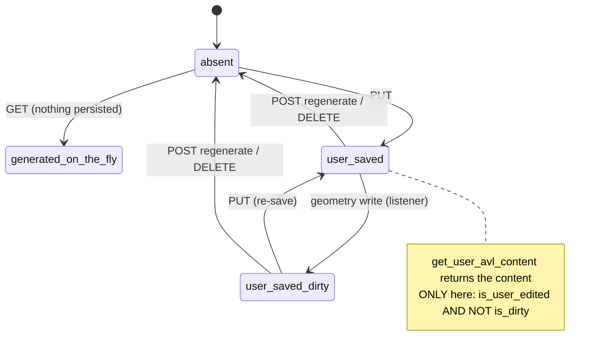

# avl-geometry-generation — Technical Design

> Focuses on HOW this use case is built, read from the legacy code.
> Parent module design: [`../design.md`](../design.md).
> Confidence markers: 🟢 CONFIRMED · 🟡 INFERRED · 🔴 GAP.

## Interface

| Symbol | Signature | Returns | Note |
|---|---|---|---|
| `build_avl_geometry_file` | `(plane_schema, spacing_config=None)` | `AvlGeometryFile` | `repr()` yields the text 🟢 |
| `optimise_surface_spacing` | `(surface, sections, config)` | `SpacingConfig` | three heuristics 🟢 |
| `inject_cdcl` | `(avl_file, plane_schema, operating_point, cdcl_config)` | `None` (in-place) | user values win 🟢 |
| `NeuralFoilCdclService.compute_cdcl` | `(airfoil_name, re, mach, cfg)` | `AvlCdcl` | `lru_cache(128)` 🟢 |
| `compute_reynolds_number` | `(velocity, chord, altitude)` | `float` | ASB `Atmosphere` 🟢 |
| `_resolve_airfoil_reference` | `(airfoil_name)` | `AvlNaca \| AvlAfile \| AvlAirfoilInline` | gh-588 routing 🟢 |
| `get_user_avl_content` | `(db, aeroplane_id)` | `str \| None` | the trust rule 🟢 |
| `save_avl_content` / `regenerate` / `delete` | `(db, aeroplane_id[, content])` | row / `None` | CRUD 🟢 |

HTTP: the four routes on `/aeroplanes/{aeroplane_id}/avl-geometry`
([`../contracts.md`](../contracts.md)).

## Main Flow — building a file

```
build_avl_geometry_file(plane_schema, spacing_config):

  1. reference   = AvlReference(s_ref, c_ref, b_ref, xyz_ref)
     symmetry    = AvlSymmetry(iy_sym=0, iz_sym=0, z_sym=0.0)
  2. per wing:
       sections = []
       per xsec i:
           airfoil = _resolve_airfoil_reference(xsec.airfoil)
                       ^naca\s*(\d{4,5})$   → AvlNaca(digits)          # INTEGERS ONLY
                       else                 → AvlAfile(dat path)
                       unresolvable         → AvlNaca("0012")
           claf    = 1 + 0.77 · asb_airfoil.max_thickness    (default 1.0)
           sections.append(AvlSection(xyz_le, chord, ainc, airfoil, claf))
       _build_controls_for_wing(wing, sections)
           per xsec with a control surface:
               axes = control_surface_mixing → 1 or 2 ControlAxis
               append AvlControl(name, gain, xhinge, hvec, sgn_dup)
                      to sections[i] AND sections[i+1]        # strip duplication
       spacing = optimise_surface_spacing(wing, sections, spacing_config)
       yduplicate = 0.0 if wing.symmetric else None           # None ⇒ block omitted
       surfaces.append(AvlSurface(name, spacing.n_chord, spacing.c_space,
                                  sections, spacing.n_span, spacing.s_space,
                                  yduplicate, …))
  3. dedup control names WITHIN each surface
  4. assert_unique_control_names(across surfaces)  → ValueError on a collision
  5. return AvlGeometryFile(title, mach, symmetry, reference, surfaces, bodies=[], cdp)
```

Step 4 happens **before** any text exists, so a collision can never produce a
file that AVL would silently mis-interpret.

## Emission rules 🟢

| Rule | Behaviour |
|---|---|
| `CDp` | emitted only when `not math.isclose(cdp, 0, abs_tol=1e-12)` |
| `YDUPLICATE` | `0.0` when `wing.symmetric`, otherwise the block is **omitted** (no sentinel value) |
| airfoil | `NACA` for `^naca\s*(\d{4,5})$` only; `AFIL` otherwise; `NACA 0012` as the last resort |
| `CLAF` | `1 + 0.77 · max_thickness`, `1.0` when the airfoil cannot be built |
| `CONTROL` | appended to sections `i` **and** `i+1` |
| `BODY` / `BFIL` | the dataclass exists; **nothing constructs one** — 🟢 correct and deliberate (`Q-AV-2`) |

## Panel spacing 🟢

```
config = spacing_config or SpacingConfig(n_chord=12, c_space=1.0,
                                         n_span=20, s_space=1.0,
                                         auto_optimise=True)
if not config.auto_optimise:
    return config                       # verbatim escape hatch

# 1 — hinge-line resolution
if any(section.controls for section in sections):
    n_chord = max(n_chord, 16)

# 2 — minus-sine spanwise spacing
sweep = atan2(Δx, sqrt(Δy² + Δz²))
has_centreline_break = any(|section.y| < 1e-6 for interior sections)
if sweep < radians(5) and not has_centreline_break:
    s_space = −2.0                      # panels dense at root and tip

# 3 — spanwise vortex sufficiency (gh-590)
gaps    = [ |y[i+1] − y[i]| for consecutive sections if the gap > 1e-9 ]
min_gap = min(gaps)                     # coincident sections EXCLUDED
n_span  = max(n_span, ceil(span / min_gap) + 2)
```

Rule 2's rationale is in the code: the induced-drag gradient is steepest at the
root and the tip, so `−sine` puts panels where they matter. It is suppressed by
a centreline break because a section exactly at `y = 0` on a `−sine`
distribution collapses the innermost panel.

Rule 3's rationale is an AVL failure mode: without it AVL aborts with
`Cannot adjust spanwise spacing at section N` or
`Insufficient number of spanwise vortices`. Coincident sections — deliberate
chord or twist discontinuities at the same `y` — must be excluded, otherwise
`min_gap → 0` and `n_span → ∞`.

## CDCL injection 🟢

```
inject_cdcl(avl_file, plane_schema, operating_point, cdcl_config):

  for surface, wing in zip(avl_file.surfaces, plane_schema.wings):     # BY INDEX 🟡
      for section, xsec in zip(surface.sections, wing.xsecs):
          if section.cdcl is not None and not all-zero:
              continue                                     # USER EDIT WINS
          re = compute_reynolds_number(V, section.chord, altitude)     # ASB Atmosphere ν
          section.cdcl = NeuralFoilCdclService.compute_cdcl(
                             airfoil_name, re, mach, cdcl_config)

compute_cdcl(...):                       # @lru_cache(maxsize=128)
  sweep α over [alpha_start_deg, alpha_end_deg] step alpha_step_deg
  point 2 = argmin(CD)      # drag bucket
  point 3 = argmax(CL)      # positive stall
  point 1 = argmin(CL)      # negative stall
  emit AvlCdcl(cl_min=CL1, cd_min=CD1, cl_0=CL2, cd_0=CD2, cl_max=CL3, cd_max=CD3)
  any non-finite value → warning + AvlCdcl(0, 0, 0, 0, 0, 0)
```

🟡 The `zip` pairing means a **surface/wing count mismatch only truncates** —
the extra surfaces silently keep whatever CDCL they had (usually none), and the
mismatch is a log warning.

The cache key is deliberately primitives-only (airfoil **name**, not the airfoil
object) so it is hashable and stable; the cost is that two airfoils with the same
name and different coordinates would collide. 🟡

## Stored-geometry lifecycle 🟢



```
GET    → stored row if present, else generate (do NOT persist)
PUT    → content saved; is_user_edited = True; is_dirty = False
POST …/regenerate → DELETE the row, return freshly generated content
DELETE → delete the row; 404 when absent; 204 on success

get_user_avl_content(db, id):
    row = SELECT … WHERE aeroplane_id = :id
    return row.content if row and row.is_user_edited and not row.is_dirty else None
```

`is_dirty` is set by the `after_insert/update/delete` listeners on `WingModel`,
`WingXSecModel` and `FuselageModel` in `avl_geometry_events.py`.
🟢 A successful regenerate clears it automatically (`Q-AV-4`). Previously nothing cleared it except a user `PUT` — a
"regenerate-on-read" does not, because that path never touches the row.

## Alternative Flows

- **`auto_optimise = False`.** All three heuristics are skipped and the config
  values pass through verbatim. 🟢
- **No control surfaces on a wing.** Rule 1 does not fire; `n_chord` stays 12. 🟢
- **All sections coincident** (a degenerate wing). `gaps` is empty; `min_gap` is
  undefined. 🟡 The legacy's behaviour in this corner is not documented in the
  analysis — treat as a gap.
- **NeuralFoil unavailable.** CDCL injection is optional; the file is emitted
  without `CDCL` blocks and AVL runs inviscid. 🟢
- **Airfoil `.dat` missing.** `AvlNaca("0012")` — the aircraft stays analysable
  with a documented substitution. 🟢
- **Duplicate control names across surfaces.** `ValueError` before any text. 🟢
- **`GET` with no stored row.** Content is generated and returned; **no row is
  created**, so a read never establishes state. 🟢
- **`DELETE` on an absent row.** 404. 🟢

## Dependencies

- **[`../control-surface-naming/`](../control-surface-naming/requirements.md)** —
  `axis_control_name` and `assert_unique_control_names`.
- **`wing-design`** — the aeroplane schema: wings, x-sections, airfoil
  references, TED roles, hinge points, mixing gains, `symmetric` flags.
- **`airfoil-catalog`** — `.dat` files behind `AvlAfile`; NeuralFoil for the
  polars.
- **AeroSandbox** — `Airfoil.max_thickness` (for `CLAF`) and `Atmosphere` (for
  `ν` in the Reynolds number).
- **`platform-core`** — `get_db()`, the SQLAlchemy listeners.

## Identified Design Decisions

| Decision | Evidence in code | Confidence |
|---|---|---|
| The format lives in `__repr__`, not a template | `app/avl/geometry.py` | 🟢 |
| Integer-only NACA matching (gh-588) | `_NACA_RE` (`avl_geometry_service.py:52`) | 🟢 |
| An unresolvable airfoil degrades to `NACA 0012` | `_resolve_airfoil_reference` | 🟢 |
| Controls duplicated across the strip, mirroring ASB | `_build_controls_for_wing` | 🟢 |
| Uniqueness asserted before any text is produced | `build_avl_geometry_file` step 4 | 🟢 |
| Three spacing heuristics, opt-out via `auto_optimise` | `spacing.py:71-106` | 🟢 |
| Coincident sections excluded from `min_gap` (gh-590) | `spacing.py:43-68` | 🟢 |
| A user-edited CDCL always wins | `inject_cdcl` | 🟢 |
| The polar cache key is primitives-only | `lru_cache(maxsize=128)` | 🟢 |
| Non-finite output → zeros, never a fabricated polar (ADR 0012) | `neuralfoil_cdcl_service` | 🟢 |
| Stored geometry trusted only when user-edited **and** clean | `get_user_avl_content` | 🟢 |
| A read never persists a row | `get_avl_geometry` | 🟢 |
| CDCL surfaces paired to wings **by index** | `zip` in `inject_cdcl` | 🟡 |
| `is_dirty` cleared automatically by a successful regenerate (`Q-AV-4`) | listeners + `PUT`/regenerate | 🟢 |

## Internal State

`avl_geometry_files` — one row per aeroplane
(`uq_avl_geometry_files_aeroplane_id`):

| Column | Type | Default | Note |
|---|---|---|---|
| `aeroplane_id` | Integer FK `ON DELETE CASCADE`, INDEXED | — | backref `avl_geometry_file`, `cascade="all, delete-orphan"` |
| `content` | Text | — | the full `.avl` file |
| `is_dirty` | Boolean | `False` | set by listeners; 🟢 auto-cleared on a successful regenerate (`Q-AV-4`) |
| `is_user_edited` | Boolean | `False` | |
| `created_at` / `updated_at` | DateTime(tz) | `now()` / `onupdate now()` | |

Plus the process-local `lru_cache(maxsize=128)` of CDCL polars — lost on
restart, not shared between workers. 🟡

## Observability

- `is_dirty` and `is_user_edited` are returned on every geometry response — the
  only signal a client has that the served text may not match the current
  aircraft. 🟡
- A missing airfoil, a non-finite CDCL and a surface/wing count mismatch are all
  **log-only**. 🟡 The last of these can leave the file silently under-injected.
- A control-name collision raises with both names in the message. 🟢
- 🔴 Nothing records **which** spacing heuristics fired. **Not addressed by the validation interview.** A surprising
  `n_span` cannot be explained from the output alone.

## Risks and Gaps

- 🟢 **The wing-only model is accepted and correct** (`Q-AV-2`, maintainer-answered): `AvlBody`/`BFIL` is never constructed, and AeroSandbox is the sole authority for `Cnb` — its fuselage model is a strict superset of AVL's (same Drela slender-body theory plus Jorgensen cross-flow, skin friction and base drag). Building `BODY` would be a second producer (ADR 0022) with no physics gained. Every emitted file is
  wing-only and every AVL result omits fuselage contributions.
- 🟢 **A successful regenerate now clears `is_dirty` automatically** (`Q-AV-4`, maintainer-answered). Previously the user-edited file was bypassed permanently after any geometry edit — the escape hatch stopped working without saying so (ADR 0020). Previously a file stayed flagged indefinitely
  after any geometry edit even if the user never intends to re-edit it.
- 🟡 **The duplicated listeners are factored out so a geometry write publishes `GeometryChanged` once** (`Q-AA-4`, derived): both modules attach to the same three models and call the same `mark_ops_dirty`, so "each module owns its own dirty flag" does not describe the code. ADR 0022 applied to invalidation paths. Previously duplicate registration (`avl_geometry_events.py` **and**
  `stability_events.py` attach the same three models).
- 🟡 **CDCL pairs surfaces to wings by index** and only warns on a mismatch, so
  injection can be silently partial.
- 🟡 **The CDCL cache is keyed on the airfoil *name***, so two different
  geometries sharing a name would collide.
- 🟡 **The cache is process-local** — a multi-worker deployment recomputes per
  worker.
- 🟡 **Which heuristics fired is not reported**, making a surprising panel count
  hard to explain.
- 🟡 **A fully degenerate wing** (all sections coincident) leaves `min_gap`
  undefined; the behaviour is undocumented.
- 🟡 **`model_size` defaults to `"large"` here** while the airfoil backfill uses
  `"xxxlarge"`, so a section's CDCL and the catalogue's polar for the same
  airfoil need not agree.
