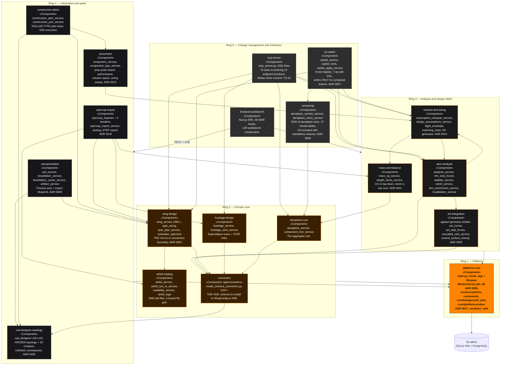
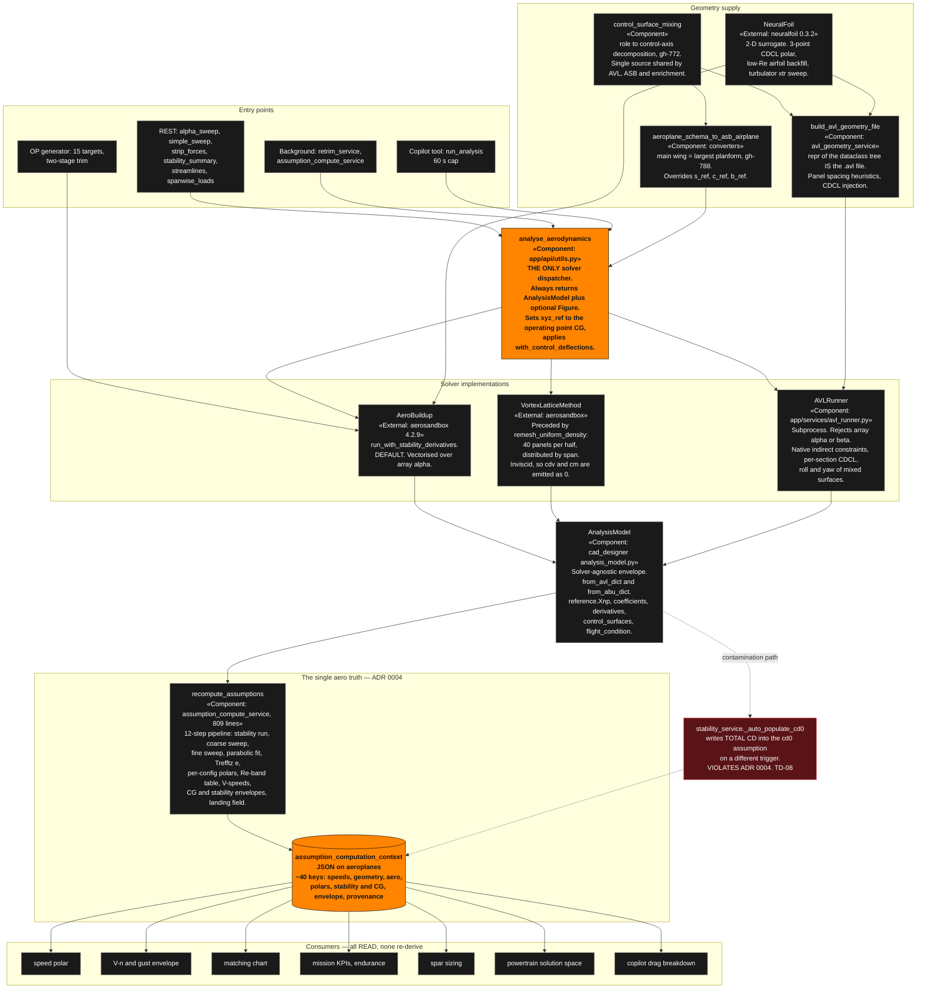
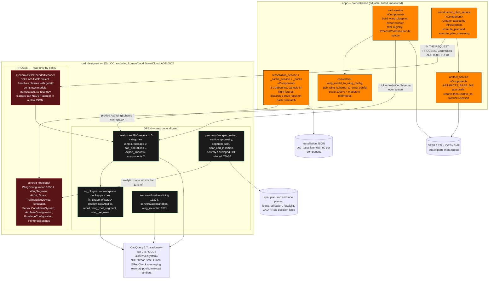

# C4 Level 3 — Components

> Produced by the **Reversa Architect** (`doc_level = completo`).
> Confidence: 🟢 CONFIRMED · 🟡 INFERRED · 🔴 GAP.
> Notation: Mermaid `flowchart` with C4 stereotype labels — see the note in
> [`c4-context.md`](c4-context.md).
>
> Three containers are decomposed here:
> **C-A** the FastAPI application's service layer (the 18 modules),
> **C-B** the aerodynamic solver stack,
> **C-C** the CAD / geometry stack.

---

## C-A — FastAPI application: the 18 modules

The request flow is uniform and enforced by convention plus
`.claude/rules/python-conventions.md`:

```
endpoint (thin: validate → delegate → return a Pydantic schema)
   → service (business logic, external tools, orchestration)
      → model (SQLAlchemy) | schema (Pydantic) | converter (schema ↔ model ↔ CAD ↔ ASB)
```

The 18 modules fall into five concentric rings. Ring membership predicts blast
radius: a change in ring 1 or 2 reaches almost everything; a change in ring 5
reaches almost nothing.

| Ring | Modules | Why here |
|---|---|---|
| **1 — Platform** | `platform-core` | App composition, `get_db()`, exceptions, event bus, job tracker, capability probes. Everything imports it. |
| **2 — Domain core** | `aeroplane-core`, `wing-design`, `fuselage-design`, `airfoil-catalog` | The aggregate root and its geometry. The converter hub (`model_schema_converters.py`) lives here and is imported by four other rings. |
| **3 — Analysis & intent** | `aero-analysis`, `avl-integration`, `mission-and-sizing`, `mass-and-balance` | Produce and consume the single-source aero context. |
| **4 — Fabrication & parts** | `cad-generation`, `cad-designer-topology`, `construction-plans`, `openvsp-import`, `powertrain` | Turn the design into geometry, files and a BoM. |
| **5 — Change & interfaces** | `versioning`, `ai-copilot`, `mcp-server`, `frontend-workbench` | Wrap the whole thing in history and two API surfaces. |



### The three structural hubs 🟢

1. **`app/converters/model_schema_converters.py` (1 104 lines)** — every wing,
   fuselage and airplane conversion passes through it. `cad-generation`,
   `aero-analysis`, `avl-integration`, `openvsp-import`, `construction-plans`
   and `ai-copilot` all depend on it. It is also where the gh-788 "main wing =
   largest planform" rule lives.
2. **`aeroplanes.assumption_computation_context` (a JSON column)** — the
   *data* hub. ~40 keys produced once by `recompute_assumptions` and read by the
   speed polar, V-n envelope, matching chart, mission KPIs, endurance, spar
   sizing, powertrain solution space and the copilot. ADR 0004.
3. **`app/services/invalidation_service.py`** — the *control* hub. Every
   geometry-mutating path must route through it or its operating points go
   stale silently.

### Two dependency cycles, broken by lazy imports 🟢

* `wing_service` / `fuselage_service` → `component_tree_service`
  (auto-sync of `wing:<name>` / `fuselage:<name>` groups, gh-108) →
  `mass_cg_service` → back into the assumption layer. Broken by
  function-local imports inside `_sync_aircraft_mass`.
* `aeroplanes ↔ branches` at the **DDL** level (`aeroplanes.branch_id →
  branches.id` and `branches.root_id/head_id → aeroplanes.id`). Broken with
  `use_alter=True` on all four constraints, so Alembic emits them as separate
  `ALTER TABLE` statements, plus a three-step flush dance in
  `create_aeroplane`.

---

## C-B — The aerodynamic solver stack

Two invariants govern the whole stack (ADR 0003, ADR 0004):

1. **AeroSandbox is the default; AVL is the exception.** Every default path
   (α sweep, simple sweep, strip forces, retrim, assumption recompute, OP
   generation, streamlines) runs AeroBuildup or the in-process VLM.
2. **One aero truth per aircraft.** `cd0` (parasite, *not* total CD),
   `e_oswald`, `(L/D)max` and `x_np` are produced once at the cruise point and
   cached. No consumer re-derives them.



### Solver-selection reality 🟢

| Path | Default | AVL reachable? |
|---|---|---|
| `analyze_wing` / `analyze_airplane` | caller-selected | yes — `analysis_tool=avl` |
| `get_stability_summary` | caller-selected | yes |
| strip forces / spanwise loads | `solver="vlm"` (ASB) | yes — `?solver=avl` |
| streamlines / four-view | `VORTEX_LATTICE`, hard-coded | **no** |
| α sweep / simple sweep | `AEROBUILDUP`, hard-coded | **no** — AVL rejects array sweeps |
| `recompute_assumptions` | `AEROBUILDUP` | **no** |
| OP generation + background retrim | AeroBuildup / `asb.Opti` | **no** |
| `trim_with_avl` | — | this endpoint *is* the AVL path |

🔴 **AVL runs are wing-only.** `AvlBody` / `BFIL` exist in the emitter but
nothing constructs one, so fuselages are never sent to AVL.

---

## C-C — The CAD / geometry stack



### The frozen / editable split 🟢

`cad_designer/CLAUDE.md` is the authority. `aircraft_topology/**` and
`GeneralJSONEncoderDecoder.py` are read-only — bugs and Sonar findings there are
*deliberately* not fixed. `creator/`, `geometry/`, `cq_plugins/` and
`decorators/` are open. The one approved topology change is gh-934's
`Turbulator` plus the `turbulator` parameter on `WingSegment` and
`WingConfiguration`.

Enforcement is by **exclusion, not by code**: `sonar.exclusions = …,cad_designer/**`
and ruff `extend-exclude = [… "cad_designer" …]`. ≈22 000 LOC is neither linted
nor measured — including the actively developed `geometry/` subtree
(**TD-36**).

### The two serialisation systems 🟢

They never mix, and knowing which one you are in is load-bearing:

| System | Marker | Used for | Universe |
|---|---|---|---|
| `$TYPE` dialect (`GeneralJSONEncoder/Decoder`) | `"$TYPE": "<ClassName>"` | construction plan trees (`construction_plans.tree_json`, `build_wing_blueprint`) | exactly what `GeneralJSONEncoderDecoder` imports: `ConstructionRootNode`, `ConstructionStepNode`, and `from …creator import *` |
| `__getstate__` / `from_json_dict` | **none** | topology objects: the `/wingconfig` endpoints, `AirplaneConfiguration.to_dict()` | every topology class |

Topology objects reach a running plan only as **decoder kwargs**
(`wing_config`, `fuselage_config`, `servo_information`, `printer_settings`,
`engine_information`, `component_information`).

**Consequence:** renaming or deleting a Creator invalidates every stored plan
that references the old `$TYPE`. 🔴 Nine removed Creator classes are still
referenced by three shipped plan JSONs (**TD-22**).

---

*Next: [`erd-complete.md`](erd-complete.md) · [`architecture.md`](architecture.md)*
