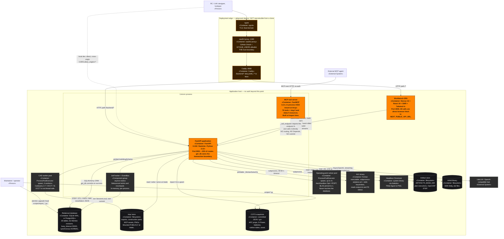

# C4 Level 2 — Containers

> Produced by the **Reversa Architect** (`doc_level = completo`).
> Confidence: 🟢 CONFIRMED · 🟡 INFERRED · 🔴 GAP.
> Notation: Mermaid `flowchart` with C4 stereotype labels — see the note in
> [`c4-context.md`](c4-context.md).

---

## 1. Container inventory (9 + 3 deployment-only)

| # | Container | Technology | Runs where | Purpose |
|---|---|---|---|---|
| K-1 | **Workbench SPA** | Next.js 16.2.1-canary.33 (App Router) + React 19.2.5, SWR 2.4, Tailwind 4 | browser, dev server on `:3000` | The whole UI. Seven tabs, a docked copilot strip, a docked metrics dock and a version-graph overlay. Effectively a **client-only SPA inside the App Router** — no route handlers, no server actions, no server-side fetching. 🟢 |
| K-2 | **FastAPI application** | FastAPI 0.136.1 / Starlette 1.0.0 / Uvicorn 0.46.0, Python 3.11–3.12 | dev `:8001`, container `:8000` (host `8086`) | ≈230 v2 routes; 15 unconditional routers + up to 5 capability-gated + 24 `aeroplane/` sub-routers. Owns the transaction boundary. 🟢 |
| K-3 | **MCP tool server** | FastMCP 3.2.4 + mcp 1.27.0 | **in-process**, ASGI-mounted at `/mcp` | 76 tools + two resource templates (`img://`, `data://`). Built at *import time* (`mcp = get_mcp()`), lifespan nested inside the app's. 🟢 |
| K-4 | **CAD worker pool** | `ProcessPoolExecutor(max_workers=4, mp_context="spawn")` | separate OS processes | Wing loft + tessellation + export. Exists because **OCCT is not thread-safe**. ADR 0005. 🟢 |
| K-5 | **Operating-point solver pool** | `ProcessPoolExecutor(max_workers=max(1, min(4, cpu-1)), spawn)`, BLAS pinned to 1 thread | separate OS processes | Streaming OP generation only. CasADi/IPOPT does not release the GIL (thread pool benchmarked at 0.35–0.89×); processes give ≈2.9× at 4 workers. Workers never touch the DB. 🟢 |
| K-6 | **AVL binary** | AVL Fortran, delivered by the `avl-binary` wheel; compiled from `Avl/` sources in the Docker build | short-lived subprocess in a `TemporaryDirectory` | Fed `airplane.avl` + a keystroke script on stdin; reads back `output.txt` and `FS` stdout. 🟢 |
| K-7 | **Relational database** | SQLite 3 (WAL) by default, PostgreSQL supported via `SQLALCHEMY_DATABASE_URL`; SQLAlchemy 2.0.49 + Alembic 1.18.4 (62 revisions, head `d8015f98814c`) | `db/test.db` (committed 🔴, see TD-32) | 35 tables. WAL + `synchronous=NORMAL` + `busy_timeout=30000` + `timeout=30` because the assumption recompute holds a write transaction open for seconds while AeroBuildup runs. 🟢 |
| K-8 | **Artifact / file store** | plain filesystem, two roots | container/host disk | `ARTIFACTS_BASE_DIR` (default `/tmp/da3dalus_artifacts`, `.resolve()`d by a validator) for plan executions and OpenVSP STEP files; **CWD-relative `tmp/`** for exports, construction parts, MCP assets and PNGs — and `tmp/` is mounted publicly at `/static`. 🟢 🔴 |
| K-9 | **Headless Chromium** | system binary at `BROWSER_PATH`, driven by Kaleido 1.2 | subprocess | Server-side Plotly → PNG for the α-sweep diagram and three-view renders. 🟢 |
| K-10 | *ngrok tunnel* | ngrok, fixed domain, TLS | deployment only (gitignored `deploy/`) | The outer edge. 🟢 |
| K-11 | *oauth2-proxy* | oauth2-proxy `:4180`, GitHub OAuth App, `GITHUB_USERS` allowlist | deployment only | **The entire access-control policy of the system.** ADR 0016. 🟢 |
| K-12 | *Caddy* | Caddy `:8080` | deployment only | Path routing: `/backend/*` → FastAPI (prefix stripped), `/*` → Next.js. Makes the frontend same-origin so the wildcard CORS is not exercised in that deployment. 🟢 |

---

## 2. Container diagram

---

## 3. Inter-container contracts

| From → To | Protocol | Contract | Notable property |
|---|---|---|---|
| SPA → FastAPI | HTTP/JSON | ≈230 v2 routes; response bodies are Pydantic schemas | **Hand-mirrored types.** Only `types/versioning.ts` and `types/versionGraph.ts` are shared; every other interface is redeclared inside the hook that fetches it. Nothing is generated from `/openapi.json`. 🔴 (**TD-30**) |
| SPA → FastAPI (streams) | SSE over **POST** | `event: token \| tool_call \| tool_result \| done \| error` (copilot); `event: progress \| complete \| error` (OpenVSP import); `event: shape \| complete \| error` (plan execution) | The browser's `EventSource` is GET-only, so `lib/sseStream.ts` reads `response.body` as a `ReadableStream` and buffers partial records by hand. 🟢 |
| MCP agent → MCP server | MCP over HTTP | Tool input schemas are **derived from the handler signature** — the Pydantic parameter types *are* the contract; the decorator `description=` string is the only prose the agent sees | Binary results travel through the asset registry as `img://<id>` / `data://<id>` plus a **dual URL** (`url_from_docker_container` for the agent, `url_for_webui` for the browser). 🟢 |
| MCP server → FastAPI | in-process Python call | `_call_endpoint(endpoint_fn, **kwargs)` imports the endpoint function and calls it as a plain callable | **Bypasses routing, `Depends`, middleware and the exception handlers.** Opens a bare `SessionLocal()` that never commits → `Session.__exit__` rolls back → ~40 mutation tools silently persist nothing. 🔴 **TD-01** |
| FastAPI → CAD pool | pickle over `spawn` | Parent ships an `AsbWingSchema`; the worker rebuilds `WingConfiguration` with `asb_wing_schema_to_wing_config(scale=1000.0)` | `WingConfiguration` holds `cq.Vector` / OCCT `gp_Vec` and is **not picklable** — the schema hop is mandatory, not a convenience. 🟢 |
| FastAPI → OP pool | pickle over `spawn` | `_WorkerSolveCtx` carries the `asb.Airplane` (picklable) and `_AircraftMassOnly` (because the SQLAlchemy model is not) | The main thread owns all persistence and streams in `as_completed` order. The **non-streaming** batch path stays sequential on purpose. 🟢 |
| FastAPI → AVL | subprocess + stdin | The `.avl` file format **is** `repr(AvlGeometryFile(...))` — a dataclass hierarchy whose `__repr__` emits its own block | AVL's `.mass` and `.run` file formats are never produced; mass and run cases go through the `OPER → m` keystroke submenu instead. 🟢 |
| FastAPI → database | SQLAlchemy 2.0 | `get_db()` yields → commits on success → rolls back on exception → closes. Services call `db.flush()` / `db.add()` but **never** `commit()` / `begin()`. ADR 0009 | `autoflush=False` and `expire_on_commit=False` — services must flush explicitly before a dependent query, which is why `db.flush()` litters the version and copilot services. 🟢 |
| FastAPI → LLM hub | HTTPS | `chat.completions.create(model=COPILOT_MODEL, tools=…, tool_choice="auto", stream=True)` | The entire provider dependency is **one factory function**, `_make_openai_client()`; tests monkeypatch it so no real API call is ever made in CI. 🟢 |

---

## 4. Deployment shapes

| Shape | Command | Ports | Notes |
|---|---|---|---|
| Local dev | `uvicorn app.main:app --port 8001 --reload` + `next dev` | API 8001, UI 3000 | Cross-origin: the browser hits `http://localhost:8001` directly, which is exactly what the wildcard CORS exists to permit. 🟢 |
| Docker | `docker compose up -d` | host **8086** → container 8000 | Two-stage: `arm64v8/ubuntu:22.04` compiles the vendored AVL Fortran; `mambaorg/micromamba` runs `py311`. 🔴 The Dockerfile then force-installs **CadQuery 2.6.1 / cadquery-ocp 7.9.3.0 / VTK 9.5.2** via `pip --no-deps`, overriding the lock's 2.7.0 / 7.8.1.1 / 9.3.1 — **container and local do not run the same geometry kernel** (**TD-35**). |
| Shared / PR review | `deploy/start.sh`, `deploy/stages.sh` | ngrok domain, per-PR sub-paths | Each PR stage gets its own worktree, uvicorn and **isolated DB copy**; the `main` stage does **not**. One OAuth callback at the domain root protects every stage. 🟢 |
| Standalone MCP | `run_mcp_server()` | hard-coded `0.0.0.0:8001`, path `/mcp` | Ignores `UVICORN_HOST`. 🔴 (**TD-25**) |

> 🔴 **Nothing enforces that the trust boundary is present.** There is no
> `TRUSTED_PROXY` setting, no forwarded-identity header, no bind-address
> restriction. The application starts, serves and mutates identically whether it
> sits behind oauth2-proxy or on a public interface. ADR 0016.

---

*Next: [`c4-components.md`](c4-components.md)*
