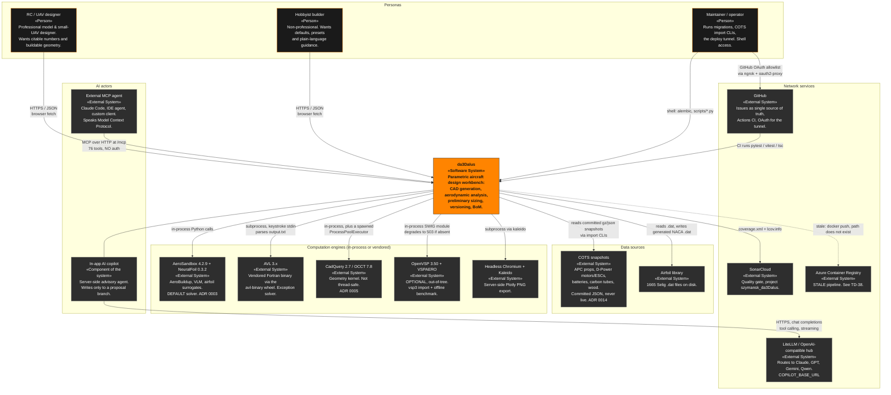

# C4 Level 1 — System Context

> Produced by the **Reversa Architect** (`doc_level = completo`).
> Confidence: 🟢 CONFIRMED · 🟡 INFERRED · 🔴 GAP.
>
> **Notation note.** The diagrams in this document set are written as Mermaid
> `flowchart`s rather than Mermaid's experimental `C4Context`/`C4Container`
> dialect, because the flowchart renderer is universally supported and the
> C4 dialect fails to render in several targets the project already uses
> (GitHub PR previews, the `_reversa_docs` mini-site). C4 semantics are
> preserved through explicit stereotype labels: `«Person»`, `«Software System»`,
> `«External System»`, `«Container: technology»`, `«Component»`.

---

## 1. What sits at the centre

**da3Dalus / cad-modelling-service** is a *conceptual and preliminary aircraft
design workbench* for RC model aircraft and small UAVs. One parametric aircraft
description simultaneously drives manufacturable CAD geometry, aerodynamic
prediction, classical preliminary sizing, and a bill of materials. 🟢

Its defining context characteristic is that it has **two peer front doors**:

* a **human** front door — the Next.js workbench talking to the v2 REST API, and
* an **agent** front door — the FastMCP server at `/mcp`, which exposes 76 tools
  to *external* AI agents.

A third, *internal* AI path (the in-app copilot) is not a front door at all: it
runs server-side and reaches **outbound** to an OpenAI-compatible LLM hub. 🟢

---

## 2. Context diagram

---

## 3. Personas — what each one actually is

| Persona | Reality in the code | Distinguishable afterwards? |
|---|---|---|
| **RC / UAV designer** (A1 in `permissions.md`) | No account, no session, no row. Direct browser `fetch` from the Next.js workbench to `http://localhost:8001`. | Only indirectly, via `created_by="human"` on version nodes and branches. 🟢 |
| **Hobbyist builder** | The *same* actor technically. The split is a **product** distinction served by mission presets, suggested estimates and copilot glossing — not a technical one. 🟢 (`user_target_audience`) |
| **Maintainer / operator** (A4) | Shell access: `alembic upgrade head`, `scripts/import_cots.py`, `scripts/import_apc_props.py`, `scripts/backfill_airfoil_low_re.py`. The only actor who can import COTS data — there is no endpoint for it. 🟢 |
| **External MCP agent** (A3) | Reaches `/mcp` with no identity, no rate limit and no audit trace. Widest reach, least accountability. Its accidental mitigation is a bug: MCP writes never commit (**TD-01**). 🟢 |
| **In-app AI copilot** (A2) | Deliberately the *least* capable actor: 6 tools (not 76, not 230 routes), a single disposable `copilot-proposal` branch as its only write surface, and **no adopt tool at all**. ADR 0007. 🟢 |

---

## 4. External integrations — the complete list (13)

| # | Integration | Direction | Protocol / mechanism | Failure mode | Conf. |
|---|---|---|---|---|---|
| I-1 | **AeroSandbox + NeuralFoil** | in-process | Python import; vectorised `AeroBuildup.run()` / `VortexLatticeMethod` over array-shaped `OperatingPoint` | absent on `linux/aarch64` → 5 routers unregistered, `require_aerosandbox` → 503. ADR 0017 | 🟢 |
| I-2 | **AVL** (vendored Fortran) | subprocess | `avl_path()` from the `avl-binary` wheel → `shutil.which("avl")` → literal `"avl"`; stdin keystroke script, reads `output.txt` + `FS` stdout | 30 s default timeout kills the process → `RuntimeError`; non-zero exit is only logged | 🟢 |
| I-3 | **CadQuery / OCCT** | in-process **and** a spawned `ProcessPoolExecutor(max_workers=4)` | pickled `AsbWingSchema` crosses the boundary; `WingConfiguration` is unpicklable and is rebuilt in the worker | OCCT is not thread-safe: the same call that takes ~100 ms on the main thread hangs indefinitely in a worker thread. ADR 0005 | 🟢 |
| I-4 | **OpenVSP** (optional) | in-process SWIG module with a native global VSP model | `openvsp_adapter` memoises the import in three module globals; `ClearVSPModel()` before every `ReadVSPFile` | not declared in `pyproject.toml` at all (it would break `poetry lock`); missing → `ImportError` naming three install paths | 🟢 |
| I-5 | **VSPAERO** | offline only | `scripts/vspaero_benchmark/` cross-validates the app's ASB path against VSPAERO | the PyPI `openvsp` wheel ships **without** the binaries; they are symlinked from a full OpenVSP install | 🟢 |
| I-6 | **LiteLLM / OpenAI-compatible hub** | outbound HTTPS | `AsyncOpenAI(base_url=COPILOT_BASE_URL)`, `chat.completions.create(stream=True, tools=…, tool_choice="auto")` | errors sanitised (API key redacted, auth/connectivity replaced by a *category* message) before reaching the browser | 🟢 |
| I-7 | **MCP client surface** | inbound | FastMCP 3.2.4 mounted at `/mcp`, lifespan nested in the app's | unauthenticated; service exceptions escape as raw Python exceptions | 🟢 |
| I-8 | **ocp-vscode** | dev-only, outbound websocket | `Workplane.display` gated by `@conditional_execute("DISPLAY_CONSTRUCTION_STEP")`, host/port from env | pinned to a **personal git fork** with no commit pin; drags Flask + Jupyter into the production dependency set | 🟢 |
| I-9 | **Headless Chromium** | subprocess | `kaleido` → `BROWSER_PATH`, `QT_QPA_PLATFORM=offscreen` | required for server-side Plotly PNG export; installed in the Docker image | 🟢 |
| I-10 | **SonarCloud** | CI outbound | `SonarSource/sonarcloud-github-action@v5` consuming `coverage.xml` + `frontend/coverage/lcov.info` | the fast tier runs **without** aero deps, so aero code needs mocked tests to be counted | 🟢 |
| I-11 | **GitHub** | CI + issues + OAuth | Actions (`test.yml`, tiered fast/full/nightly — ADR 0015); Issues as the ticket source of truth; a GitHub OAuth App is the **entire** access-control policy | `deploy/` is gitignored, so the boundary is not reproducible from a clone (**TD-33**) | 🟢 |
| I-12 | **Azure Container Registry** | CI outbound | `azure-pipelines.yml` → `crda3dalusdev.azurecr.io` | **stale**: references `docker/Dockerfile.client.amd64.dockerfile` which does not exist, triggers on a `master` branch that is not the default | 🟢 |
| I-13 | **COTS data snapshots** | read-only, committed | `data/cots/*.json[.gz]` → import CLIs → `components` / `propeller_polars`. Never a live fetch. ADR 0014 | a snapshot with an unchanged `source_version` is skipped by the freshness proxy unless `force=True` | 🟢 |

> The airfoil library (1 665 `.dat` files under `components/airfoils/`) is
> resolved through the **absolute** `AIRFOILS_DIR = REPO_ROOT/components/airfoils`
> rather than a CWD-relative path, because procedurally generated airfoils from
> the OpenVSP importer once landed outside the read directory and appeared
> missing. 🟢

---

## 5. Context-level observations

* **The system has no notion of a user.** 35 tables, none about people. The
  trust boundary is a gitignored reverse-proxy chain (ngrok → oauth2-proxy with a
  `GITHUB_USERS` allowlist → Caddy), not application logic. ADR 0016. 🟢
* **Two of the three AI paths are asymmetric on purpose.** The external MCP agent
  is powerful and anonymous; the in-app copilot is restricted and traceable
  (`branches.created_by='copilot'`). This is a deliberate inversion of the usual
  "internal agents are trusted" pattern. ADR 0007. 🟢
* **Every heavy engine is optional at import time.** `cad_available()` and
  `aerosandbox_available()` are `@lru_cache(maxsize=1)` probes run *before*
  `create_app()` is defined; on `linux/aarch64` the service still starts and
  `/health` still answers, and five routers simply do not exist. The API surface
  therefore **changes shape by platform**. ADR 0017. 🟢

---

*Next: [`c4-containers.md`](c4-containers.md) · [`c4-components.md`](c4-components.md) ·
[`erd-complete.md`](erd-complete.md) · [`architecture.md`](architecture.md)*
