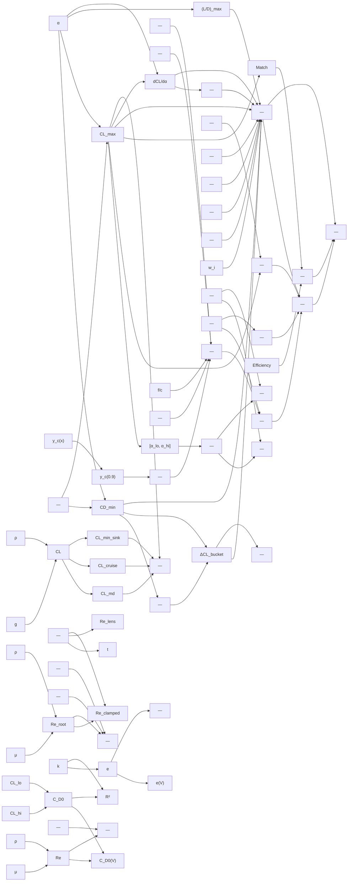

# aero-polars

> 113 nodes · generated from the 2026-08-18 extraction. See [[README|the format and its rules]].

## Cross-cutting findings reported by the extraction

🟡 *Not independently verified — treat as leads, not verdicts.*

```text
Three files, three distinct Reynolds concepts that must not be conflated (documented at polar_re_table_service.py:6-10 and airfoil_low_re_service.py:3-9): (a) aircraft-level Re label at main-wing MAC per V-band, (b) absolute 2D Re grid per airfoil shape, (c) local Re at a query chord/speed in suitability_service.

Cross-cutting findings:

1. THREE producers of Reynolds number with two different viscosities. suitability_service._compute_re:121 uses ρ/μ = 1.225/1.81e-5 (ν = 1.478e-5) while _per_lens_re:383 in the SAME function uses _NU = 1.46e-5. At identical speed and chord the slider Re and the cruise-lens Re differ ~1.2%, which changes which grid rows are bracketed. ADR 0022.

2. Dead computation with a duplicate producer downstream. build_re_table computes top_band_fallback on three code paths (lines 476/492/506) then returns the literal `False` at line 513; the caller re-derives the flag itself at assumption_compute_service.py:428-430. The service-local version is unreachable.

3. Hard-coded fallbacks on the live path that the codebase already knows are wrong. lookup_cd0_at_v returns 0.03 (line 124) and lookup_e_oswald_at_v returns 0.8 (_FALLBACK_E_OSWALD:59). assumption_compute_service.py:437-451 exists purely to backfill fallback rows "instead of the magic constant" ("eHawk: 0.03 vs the real parasite 0.013"). Both substitutions log at most a warning, never a DesignWarning (ADR 0020).

4. Two contradictory "wide bucket" references inside one module: BUCKET_REF = 0.8 (score_re_agnostic:857) vs settings.low_re_bucket_tolerance_ref = 0.6 (used by score_target_cl:1034). Likewise CL_MAX_REF = 1.5 at line 856 is re-inlined as `cl_max / 1.5` at line 935.

5. Threshold duplicated into the UI. low_re_low_confidence_flag = 0.85 is re-hardcoded at frontend/components/workbench/AirfoilSuitabilityCard.tsx:344.

6. Name-vs-definition mismatches: `camber_at_te` stores camber at x = 0.9 (gh-834) while app/models/airfoil_low_re.py:54 still says "at the trailing edge (x≈1)"; `low_re_tip_re_rel_drop` is applied as an absolute Re difference; `min_analysis_confidence` is windowed but the model comment still says "min over the swept α-range".

7. Persisted-but-unread: PolarReTableRow.r2, alpha_attached_lo/hi (only re-read by _windowed_min_confidence), cl_valid_lo/cl_valid_hi (score_target_cl extrapolates the parabola without consulting them), ld_max (highest-weighted re_agnostic input, never surfaced).

8. Dead parameters/vars: interpolate_polar_at_re's re_grid (and the get_settings() import at line 806 that only feeds it), _fit_band_with_ar's v_array, classify_family's upper_mask/lower_mask, _MISSION_TYPE_MAP "thermal"/"soarer".

9. ADR 0023: every scoring reference (LD_REF 60, CL_MAX_REF 1.5, BUCKET_REF 0.8, CD_MIN_REF 0.008, 0.7 family penalty, 5.0 %-chord thickness decay, 1.15 bucket factor, 0.15 gentleness scale, r_poor 2.5, tip floors 80k/50k) is a bare literal with NO_SOURCE_FOUND. Only the family-classifier thresholds carry empirical calibration data (named airfoils with measured values in comments), and only polar_re_table_service cites literature (Blasius 1908, Schlichting 1979, Hepperle 2012, Drela, Anderson 2016).

10. classify_family's max_camber uses np.max(camber) (signed) while the persisted max_camber_pct in scripts/backfill_airfoil_low_re.py:241 uses np.max(np.abs(camber)) — two producers, divergent for negative-camber sections.
```

## Nodes

| node | kind | unit | user-visible | source | flags |
|---|---|---|---|---|---|
| [[alr-cd0-reference-fallback\|cd0 reference fallback]] | constant | dimensionless |  | 🔴 | anomaly, divergence, scale |
| [[alr-cl-max-weight-default\|Mission cl_max_weight default]] | constant | dimensionless |  | 🔴 | divergence |
| [[alr-drag-bucket-factor\|Drag-bucket CD threshold factor]] | constant | dimensionless |  | 🟡 | anomaly, divergence |
| [[alr-family-bonus\|Mission family bonus]] | constant | dimensionless | ✓ | 🔴 | anomaly, divergence |
| [[alr-g\|Standard gravity]] | constant | m/s² |  | 🟢 | anomaly, divergence |
| [[alr-gentleness-scale\|Stall gentleness normalisation scale]] | constant | 1/deg |  | 🔴 | anomaly, divergence |
| [[alr-mach-zero\|Mach number for NeuralFoil calls]] | constant | dimensionless |  | 🟢 | divergence |
| [[alr-min-metric-points\|Minimum trusted points for metric extraction]] | constant | count |  | 🟡 | anomaly, divergence |
| [[alr-min-window-points\|Minimum points for windowed confidence]] | constant | count |  | 🔴 | divergence |
| [[alr-rho\|ISA sea-level density (low-Re module)]] | constant | kg/m³ |  | 🟢 | divergence |
| [[alr-score-bucket-ref\|Drag-bucket reference for re_agnostic]] | constant | dimensionless  | ✓ | 🔴 | anomaly, divergence |
| [[alr-score-cd-min-ref\|CD_min reference for re_agnostic]] | constant | dimensionless | ✓ | 🔴 | divergence, scale |
| [[alr-score-cl-max-ref\|CL_max reference for re_agnostic]] | constant | dimensionless | ✓ | 🔴 | anomaly, divergence, scale |
| [[alr-score-ld-ref\|L/D reference for re_agnostic]] | constant | dimensionless | ✓ | 🔴 | anomaly, divergence, scale |
| [[prt-blasius-source\|Blasius / Schlichting cd0∝Re^(-1/2) scaling rational]] | constant | n/a |  | 🟡 | divergence |
| [[prt-cd0-denom-guard\|1/√Re interpolation denominator guard]] | constant | dimensionless |  | 🔴 | divergence |
| [[prt-cd0-hard-fallback\|cd0 hard fallback 0.03]] | constant | dimensionless | ✓ | 🔴 | anomaly, divergence, scale |
| [[prt-fallback-e-oswald\|Fallback Oswald efficiency]] | constant | dimensionless | ✓ | 🟡 | anomaly, divergence, scale |
| [[prt-monotonicity-tolerance\|Polar monotonicity guard tolerance]] | constant | dimensionless  |  | 🔴 | divergence |
| [[prt-mu-isa-sl\|ISA sea-level dynamic viscosity]] | constant | Pa·s |  | 🟡 | divergence |
| [[prt-rho-default\|Default air density (ISA SL)]] | constant | kg/m³ |  | 🟢 | anomaly, divergence |
| [[sui-min-conf-default\|min_analysis_confidence default]] | constant | dimensionless | ✓ | 🔴 | anomaly, divergence |
| [[sui-mu\|Dynamic viscosity (suitability)]] | constant | Pa·s |  | 🟡 | divergence |
| [[sui-nu\|Kinematic viscosity for per-lens Re]] | constant | m²/s |  | 🟢 | anomaly, divergence |
| [[sui-rho\|ISA sea-level density (suitability)]] | constant | kg/m³ |  | 🟢 | divergence |
| [[alr-alpha-sweep\|Alpha sweep bounds and step]] | parameter | deg |  | 🟡 | anomaly, divergence |
| [[alr-cd0-reference-percentile\|Fleet cd0 reference percentile]] | parameter | percent |  | 🔴 | divergence |
| [[alr-confidence-gate\|NeuralFoil confidence gate]] | parameter | dimensionless |  | 🟡 | divergence |
| [[alr-flat-bottom-aft-x-lo\|Flat-bottom aft window start]] | parameter | chord fraction |  | 🔴 | divergence |
| [[alr-flat-bottom-quad-threshold\|Flat-bottom aft-linearity threshold]] | parameter | 1/chord | ✓ | 🟡 | divergence |
| [[alr-flat-bottom-y-threshold\|Legacy flat-bottom mean-|y| gate]] | parameter | chord fraction | ✓ | 🟡 | divergence |
| [[alr-interp-re-grid-param\|interpolate_polar_at_re re_grid parameter]] | parameter | dimensionless |  | 🔴 | anomaly, divergence |
| [[alr-model-size-default\|NeuralFoil model size (backfill default)]] | parameter | enum |  | 🟢 | anomaly, divergence |
| [[alr-n-crit\|Transition criterion n_crit]] | parameter | dimensionless |  | 🟢 | anomaly, divergence, scale |
| [[alr-reflex-aft-camber-ratio-max\|Reflex Signal A threshold]] | parameter | dimensionless | ✓ | 🟡 | anomaly, divergence |
| [[alr-reflex-aft-concavity-min\|Reflex Signal B threshold]] | parameter | 1/chord | ✓ | 🟡 | divergence |
| [[alr-reflex-b-min-camber\|Reflex Signal B camber guard]] | parameter | % chord |  | 🔴 | divergence |
| [[alr-score-weights\|re_agnostic component weights]] | parameter | dimensionless | ✓ | 🔴 | anomaly, divergence |
| [[alr-semi-symmetric-threshold\|Semi-symmetric camber threshold]] | parameter | % chord | ✓ | 🟡 | divergence |
| [[alr-symmetric-camber-threshold\|Symmetric-family camber threshold]] | parameter | % chord | ✓ | 🟡 | divergence |
| [[low-re-bucket-tolerance-ref\|Bucket tolerance reference width]] | parameter | dimensionless  |  | 🔴 | anomaly, divergence |
| [[low-re-cl-max-safety-band\|CL_max safety band]] | parameter | dimensionless  |  | 🔴 | divergence |
| [[low-re-grid\|Absolute low-Re grid]] | parameter | dimensionless | ✓ | 🟡 | anomaly, divergence |
| [[low-re-low-confidence-flag\|Low-confidence flag threshold]] | parameter | dimensionless | ✓ | 🔴 | anomaly, divergence |
| [[low-re-mission-weights\|Mission weighting table]] | parameter | mixed | ✓ | 🟡 | anomaly, divergence, scale |
| [[low-re-score-r-poor\|Drag-rise ratio at which Match→0]] | parameter | dimensionless |  | 🔴 | divergence |
| [[low-re-tip-re-abs-floor\|Tip-Re absolute floor]] | parameter | dimensionless |  | 🟡 | anomaly, divergence, scale |
| [[low-re-tip-re-rel-drop\|Tip-Re relative drop threshold]] | parameter | dimensionless |  | 🔴 | anomaly, divergence |
| [[prt-e-range-guard\|Oswald physical-range guard (0.4, 1.0]]] | parameter | dimensionless |  | 🟡 | anomaly, divergence, scale |
| [[prt-fit-band-v-array\|_fit_band_with_ar v_array parameter]] | parameter | m/s |  | 🔴 | anomaly, divergence |
| [[prt-min-samples-per-band\|Minimum samples per V-band / per OLS window]] | parameter | count |  | 🔴 | anomaly, divergence |
| [[prt-ols-window-hi\|OLS polar window upper CL bound]] | parameter | dimensionless  |  | 🟡 | divergence |
| [[prt-ols-window-lo\|OLS polar window lower CL bound]] | parameter | dimensionless  |  | 🔴 | anomaly, divergence |
| [[prt-re-degeneracy-ratio\|Re-table degeneracy threshold]] | parameter | dimensionless | ✓ | 🔴 | anomaly, divergence |
| [[prt-v-bin-half-width\|V-bin half-width fraction]] | parameter | dimensionless |  | 🔴 | divergence |
| [[sui-mission-type-map\|Mission preset → weighting key map]] | parameter | enum map | ✓ | 🟡 | anomaly, divergence |
| [[alr-aft-camber-ratio\|Aft camber ratio (reflex Signal A)]] | quantity | dimensionless |  | 🔴 | divergence |
| [[alr-aft-concavity\|Aft camber concavity (reflex Signal B)]] | quantity | 1/chord |  | 🔴 | divergence |
| [[alr-aft-quad-coeff\|Aft lower-surface quadratic coefficient]] | quantity | 1/chord |  | 🔴 | divergence |
| [[alr-alpha-attached-window\|Attached-flow alpha window]] | quantity | deg |  | 🟡 | anomaly, divergence |
| [[alr-best-ld-cl\|CL at maximum L/D (closed form)]] | quantity | dimensionless |  | 🟢 | anomaly, divergence |
| [[alr-camber-at-te\|camber_at_te (camber at x=0.9)]] | quantity | chord fraction | ✓ | 🟡 | anomaly, divergence |
| [[alr-camber-line\|Mean camber line]] | quantity | chord fraction |  | 🟢 | divergence |
| [[alr-cd-at-target\|CD at target CL]] | quantity | dimensionless |  | 🟡 | anomaly, divergence |
| [[alr-cd-min\|Section CD_min]] | quantity | dimensionless | ✓ | 🟢 | divergence |
| [[alr-cl-bonus\|Mission CL_max bonus]] | quantity | dimensionless | ✓ | 🔴 | anomaly, divergence |
| [[alr-cl-max\|Section CL_max]] | quantity | dimensionless | ✓ | 🟢 | divergence |
| [[alr-cl-valid-range\|Polar-fit validity CL range]] | quantity | dimensionless |  | 🔴 | anomaly, divergence |
| [[alr-classify-unused-masks\|upper_mask / lower_mask]] | quantity | n/a |  | 🔴 | anomaly, divergence |
| [[alr-drag-bucket-width\|Drag bucket width]] | quantity | dimensionless  | ✓ | 🟡 | divergence |
| [[alr-drag-rise-ratio\|Relative drag-rise ratio r]] | quantity | dimensionless |  | 🟡 | divergence |
| [[alr-efficiency\|Efficiency component of score_target_cl]] | quantity | dimensionless  |  | 🔴 | divergence |
| [[alr-family\|Airfoil family label]] | quantity | enum | ✓ | 🟡 | divergence, scale |
| [[alr-ld-max\|Section (L/D)_max]] | quantity | dimensionless | ✓ | 🟢 | anomaly, divergence |
| [[alr-level-flight-cl\|Level-flight lift coefficient]] | quantity | dimensionless | ✓ | 🟢 | anomaly, divergence |
| [[alr-match\|Match component of score_target_cl]] | quantity | dimensionless  |  | 🔴 | anomaly, divergence |
| [[alr-max-camber-pct\|Max camber (classifier-internal)]] | quantity | % chord |  | 🟢 | anomaly, divergence |
| [[alr-mean-lower-abs-y\|Mean |y| of lower surface]] | quantity | chord fraction |  | 🔴 | divergence |
| [[alr-min-analysis-confidence\|Windowed min analysis confidence]] | quantity | dimensionless | ✓ | 🟡 | anomaly, divergence |
| [[alr-polar-cd0\|Airfoil cd0 (parabolic fit vertex)]] | quantity | dimensionless |  | 🟡 | anomaly, divergence |
| [[alr-polar-cl0\|CL at minimum drag (cl0)]] | quantity | dimensionless |  | 🟡 | divergence |
| [[alr-polar-k\|Airfoil polar curvature k]] | quantity | dimensionless |  | 🟡 | divergence |
| [[alr-re-cd0-reference\|Per-Re fleet cd0 reference]] | quantity | dimensionless |  | 🔴 | anomaly, divergence |
| [[alr-re-interp-fraction\|ln(Re) interpolation fraction]] | quantity | dimensionless |  | 🟢 | anomaly, divergence |
| [[alr-score-mission\|Mission suitability score]] | quantity | dimensionless  | ✓ | 🔴 | divergence |
| [[alr-score-re-agnostic\|re_agnostic suitability score]] | quantity | dimensionless  | ✓ | 🔴 | divergence |
| [[alr-score-target-cl\|target-CL suitability score]] | quantity | dimensionless  | ✓ | 🔴 | divergence |
| [[alr-stall-gentleness\|Stall gentleness]] | quantity | 1/deg | ✓ | 🟡 | anomaly, divergence |
| [[alr-thickness-match\|Mission thickness match multiplier]] | quantity | dimensionless | ✓ | 🔴 | anomaly, divergence |
| [[alr-tolerance-half\|Match tolerance half-width]] | quantity | dimensionless  |  | 🔴 | anomaly, divergence |
| [[prt-band-boundaries\|V-band lower/upper bounds]] | quantity | m/s |  | 🟡 | divergence |
| [[prt-cd0-fit\|Band cd0 (fitted intercept)]] | quantity | dimensionless | ✓ | 🟢 | divergence |
| [[prt-cd0-lookup\|cd0 at query velocity]] | quantity | dimensionless | ✓ | 🟡 | divergence |
| [[prt-degenerate-flag\|polar_re_table_degenerate]] | quantity | boolean | ✓ | 🔴 | divergence |
| [[prt-e-oswald-band\|Band Oswald efficiency]] | quantity | dimensionless | ✓ | 🟢 | divergence |
| [[prt-e-oswald-lookup\|e_oswald at query velocity (constant mean)]] | quantity | dimensionless | ✓ | 🟡 | anomaly, divergence |
| [[prt-k-fit\|Band induced-drag factor k]] | quantity | dimensionless |  | 🟢 | anomaly, divergence |
| [[prt-r2\|Band OLS R²]] | quantity | dimensionless | ✓ | 🟢 | anomaly, divergence |
| [[prt-re-aircraft\|Aircraft-level Reynolds number (V-band label)]] | quantity | dimensionless | ✓ | 🟢 | anomaly, divergence |
| [[prt-top-anchor-clamp\|Top anchor clamp to sweep max]] | quantity | m/s |  | 🔴 | anomaly, divergence |
| [[prt-top-band-fallback\|top_band_fallback flag (in build_re_table)]] | quantity | boolean |  | 🔴 | anomaly, divergence |
| [[sui-active-lens\|active_lens]] | quantity | enum | ✓ | 🔴 | divergence |
| [[sui-caveat-text\|Suitability caveat block]] | quantity | text | ✓ | 🟢 | divergence |
| [[sui-cl-max-margin\|cl_max_margin]] | quantity | dimensionless  | ✓ | 🟡 | anomaly, divergence, scale |
| [[sui-conf-tier\|Confidence sort tier]] | quantity | ordinal | ✓ | 🔴 | divergence |
| [[sui-per-lens-re\|Per-lens Reynolds number]] | quantity | dimensionless |  | 🟢 | anomaly, divergence |
| [[sui-provenance\|target_cl_provenance]] | quantity | enum | ✓ | 🔴 | anomaly, divergence |
| [[sui-re-clamped\|Grid-clamped Reynolds + clamp flag]] | quantity | dimensionless | ✓ | 🟡 | anomaly, divergence |
| [[sui-re-root\|Root-chord Reynolds number]] | quantity | dimensionless | ✓ | 🟢 | divergence |
| [[sui-target-cl-best-glide\|target_cl_best_glide]] | quantity | dimensionless | ✓ | 🟢 | divergence |
| [[sui-target-cl-cruise\|target_cl_cruise]] | quantity | dimensionless | ✓ | 🟢 | divergence |
| [[sui-target-cl-min-sink\|target_cl_min_sink]] | quantity | dimensionless | ✓ | 🟡 | divergence |
| [[sui-tip-re-flag\|tip_re_flag]] | quantity | boolean | ✓ | 🟡 | anomaly, divergence |

## Graph — user-visible quantities and what feeds them



