# aero-spanwise

> 103 nodes · generated from the 2026-08-18 extraction. See [[README|the format and its rules]].

## Cross-cutting findings reported by the extraction

🟡 *Not independently verified — treat as leads, not verdicts.*

```text
Scope note: the two files contain almost no closed-form aerodynamics — the physics comes from AeroSandbox (AeroBuildup/VLM) and AVL. What lives here is (a) post-processing of solver arrays into characteristic points, (b) the glide speed polar, (c) diagnostic classification heuristics for the PNG, (d) spanwise-loads plumbing and spar-sizing orchestration. Only the speed polar (lines 514/515/524) and q_dyn (2053) are genuine physics formulas.

Duplicate producers (ADR 0022):
- L/D max: three independent producers reaching the user — CL/CD argmax (108/111), forces L/D argmax (1154/1159), speed-polar ld_max (522/546), plus the computation context's cleanPolar.ld_max read by PolarChipRow.tsx:137.
- Reynolds: `_reynolds_from_atmosphere` (1731, velocity·cref/ν at altitude) vs `assumption_compute_service._reynolds_number` (1749, hardcoded rho=1.225 / mu=1.81e-5, MAC-based). Both render in the same workbench.
- V_stall / V_min_sink / alpha_stall / alpha_min_sink / alpha_best_glide: produced both here and in the assumption computation context; the UI reads the context version, the speed-polar version is unread.
- CL_max: argmax at line 129 and max() at line 482.
- `_G_LIMIT_DEFAULT = 3.0` literal copied into spar_plan_service.py:36.

Dead / unread outputs:
- `_TC_FALLBACK` (2101) has no reader in the module — ADR 0021.
- `characteristic_points` is in the /alpha_sweep JSON but useAnalysis.ts:112 reads only `analysis` and `speed_polar`; its real consumers are the PNG and copilot_tools:366.
- `SpeedPolarCurve.alpha_*_deg` (gh-871) are serialised but absent from the frontend interface (useAnalysis.ts:29-41).
- `root_shear_N_port` / `root_bending_moment_Nm_port` are typed in the frontend but never rendered.
- No frontend consumer found for /simple_sweep.

Undeclared fallbacks (ADR 0020) — all log-only, none emits a DesignWarning: base mass → 1.0 kg (619); Reynolds → 0.0 (1723/1734); Mach → 0 (1755); Sref/Bref/Cref → 0 (1746-1758); s_ref → 0.0 collapsing the polar to empty curves (624); stall point fabricated at i_clmax+1 (177); trim point substituted by min|Cm| (209); CD0 substituted by min|CL| (157); empty t/c map → 0.12 (2248).

Magic numbers without any cited source (no literature reference appears anywhere in either file — every comment cites only gh-issue numbers): 9.81, 1e-12 (×4), 1e-9, 0.7, 1.3, ±0.01 (×2 sites), 0.5/2.0, percentiles 50/85, 3.0, 0.12, plus endpoint defaults 1.5 and 0.8.

ADR 0023 concern: `_classify_variation` thresholds of 0.5 m / 2.0 m span applied to a neutral-point position are transport-scale for a 0.5–15 kg aircraft whose whole fuselage is often shorter than 2 m; combined g_limit 3.0 × j 1.5 also has no RC/UAV validation.

Naming defect: `StripForcesResponse.wing_name` is filled with `aircraft.name` on the airplane path (1895) and with the actual wing name on the single-wing path (1979).

German strings ("Ausreißer", "Sprung", "Stall-Indiz") appear in rendered PNG output.
```

## Nodes

| node | kind | unit | user-visible | source | flags |
|---|---|---|---|---|---|
| [[aero-spanwise--g-limit-default\|Default manoeuvre load factor]] | constant | g | ✓ | 🟢 | anomaly, divergence, scale |
| [[aero-spanwise--sigma-allow-positivity-guard\|σ_allow positivity guard]] | constant | MPa | ✓ | 🔴 |  |
| [[axis-autorange-guard\|Axis-bound sanity guard]] | constant | - | ✓ | 🔴 |  |
| [[base-mass-fallback\|Speed-polar mass fallback]] | constant | kg | ✓ | 🔴 | anomaly, divergence, scale |
| [[divide-guard-epsilon\|Division guard epsilon]] | constant | - |  | 🔴 | anomaly |
| [[gravity-g\|Gravitational acceleration]] | constant | m/s² |  | 🟡 | anomaly, divergence |
| [[mass-dedup-tolerance\|Mass de-duplication tolerance]] | constant | kg |  | 🔴 |  |
| [[neutral-strip-percentiles\|Neutral-trend percentile thresholds]] | constant | - | ✓ | 🔴 | anomaly |
| [[reynolds-zero-fallback\|Reynolds zero fallback]] | constant | - | ✓ | 🔴 | anomaly |
| [[stability-slope-thresholds\|Stability classification thresholds]] | constant | 1/deg | ✓ | 🟡 | anomaly, divergence, scale |
| [[stall-fallback-index\|Stall fallback index]] | constant | index | ✓ | 🔴 | anomaly |
| [[tc-empty-map-fallback\|Empty thickness-map fallback]] | constant | - | ✓ | 🔴 | anomaly |
| [[tc-fallback-analysis\|t/c fallback constant (analysis_service copy)]] | constant | - |  | 🟡 | anomaly, divergence |
| [[v-axis-max-factor\|Upper axis-bound factor]] | constant | - |  | 🔴 | anomaly, divergence, scale |
| [[v-axis-min-factor\|Lower axis-bound factor]] | constant | - |  | 🔴 | anomaly |
| [[variation-thresholds\|Variation classification thresholds]] | constant | m (applied to  | ✓ | 🔴 | anomaly, divergence, scale |
| [[aero-spanwise--packing-factor\|Packing factor]] | parameter | - | ✓ | 🔴 | scale |
| [[aero-spanwise--safety-factor-j\|Safety factor j]] | parameter | - | ✓ | 🟢 | anomaly, divergence, scale |
| [[alpha-0-deg\|Zero-lift angle from context]] | parameter | deg |  | 🟢 |  |
| [[altitude-speed-polar\|Speed-polar altitude]] | parameter | m | ✓ | 🟡 | divergence |
| [[avl-strip-forces-timeout\|AVL strip-forces timeout]] | parameter | s |  | 🔴 | anomaly |
| [[cl-alpha-per-rad\|Lift-curve slope from context]] | parameter | 1/rad |  | 🟢 | divergence |
| [[solver-default\|Strip-force solver default]] | parameter | - | ✓ | 🟡 | divergence |
| [[spanwise-alpha-echo\|Spanwise-loads alpha echo]] | parameter | deg | ✓ | 🟡 | divergence |
| [[spanwise-altitude-echo\|Spanwise-loads altitude echo]] | parameter | m | ✓ | 🟡 | divergence |
| [[spanwise-beta-echo\|Spanwise-loads sideslip echo]] | parameter | deg | ✓ | 🟡 | divergence |
| [[spanwise-velocity-echo\|Spanwise-loads velocity echo]] | parameter | m/s | ✓ | 🟡 | divergence |
| [[v-dive-from-context\|Dive speed from context]] | parameter | m/s |  | 🔴 | scale |
| [[aero-model-label\|Aerodynamic model label]] | quantity | - | ✓ | 🔴 |  |
| [[alpha-array\|Alpha sweep array]] | quantity | deg | ✓ | 🟡 | divergence |
| [[alpha-best-glide-deg\|Alpha at best glide]] | quantity | deg | ✓ | 🟢 | anomaly, divergence |
| [[alpha-min-sink-deg\|Alpha at minimum sink]] | quantity | deg | ✓ | 🟢 | anomaly, divergence |
| [[alpha-stall-deg\|Alpha at stall]] | quantity | deg | ✓ | 🟢 | anomaly, divergence |
| [[base-mass-kg\|Effective design mass]] | quantity | kg | ✓ | 🟡 | divergence |
| [[bref-echo\|Reference span echo]] | quantity | m | ✓ | 🟢 | divergence |
| [[cd-values\|Drag coefficient array]] | quantity | - | ✓ | 🟢 | divergence |
| [[center-z-by-y\|Section centre-Z map]] | quantity | mm | ✓ | 🔴 |  |
| [[characteristic-points\|Characteristic points dict]] | quantity | - | ✓ | 🟡 | anomaly, divergence |
| [[chord-mm-by-y\|Station chord in millimetres]] | quantity | mm |  | 🔴 |  |
| [[cl-max-speed-polar\|CL max for stall speed]] | quantity | - |  | 🟢 | anomaly |
| [[cl-values\|Lift coefficient array]] | quantity | - | ✓ | 🟢 |  |
| [[cm-gradient\|Local Cm gradient]] | quantity | 1/deg | ✓ | 🟢 | divergence |
| [[cm-strip-colors\|Cm-gradient stability colours]] | quantity | - | ✓ | 🟡 | anomaly, divergence, scale |
| [[cm-values\|Pitching-moment coefficient array]] | quantity | - | ✓ | 🟢 |  |
| [[cref-echo\|Reference chord echo]] | quantity | m | ✓ | 🟢 |  |
| [[dcm-dalpha-slope\|Longitudinal stability slope]] | quantity | 1/deg | ✓ | 🟢 | anomaly, divergence |
| [[drag-at-zero-lift-point\|Drag at zero lift point]] | quantity | mixed (deg, -, | ✓ | 🟢 | anomaly, divergence |
| [[drag-force-values\|Drag force array]] | quantity | N | ✓ | 🟢 |  |
| [[g-limit-effective\|Effective manoeuvre load factor]] | quantity | g | ✓ | 🟢 | divergence, scale |
| [[g-limit-fallback-flag\|g_limit fallback flag]] | quantity | - | ✓ | 🔴 |  |
| [[i-best-glide\|Best-glide index]] | quantity | index |  | 🟢 |  |
| [[i-ldmax-force\|Sweet-spot index]] | quantity | index | ✓ | 🟢 | divergence |
| [[i-min-sink\|Minimum-sink index]] | quantity | index |  | 🟡 | divergence |
| [[ld-max\|Maximum lift-to-drag ratio]] | quantity | - | ✓ | 🟢 | anomaly, divergence |
| [[ld-ratio-coefficient\|Lift-to-drag ratio (coefficient form)]] | quantity | - | ✓ | 🟢 |  |
| [[ld-ratio-force\|Glide ratio from forces]] | quantity | - | ✓ | 🟢 | anomaly, divergence |
| [[lift-force-values\|Lift force array]] | quantity | N | ✓ | 🟢 |  |
| [[mach-echo\|Mach number echo]] | quantity | - | ✓ | 🟡 | anomaly, divergence |
| [[mass-set\|Speed-polar mass set]] | quantity | kg | ✓ | 🟢 | divergence |
| [[max-cl-point\|Maximum lift coefficient point]] | quantity | mixed (deg, -, | ✓ | 🟢 | anomaly, divergence |
| [[max-ld-point\|Maximum L/D point]] | quantity | mixed (deg, -, | ✓ | 🟢 | divergence |
| [[min-cd-point\|Minimum drag coefficient point]] | quantity | mixed (deg, -, | ✓ | 🟢 | anomaly, divergence |
| [[neutral-combined-metric\|Neutral-point sensitivity metric]] | quantity | m/deg | ✓ | 🔴 |  |
| [[q-dyn\|Dynamic pressure]] | quantity | Pa | ✓ | 🟢 | divergence |
| [[reynolds-strip-forces\|Chord Reynolds number (strip-forces echo)]] | quantity | - | ✓ | 🟢 | anomaly, divergence, scale |
| [[rho-spanwise\|Air density (spanwise loads)]] | quantity | kg/m³ |  | 🟢 |  |
| [[rho-speed-polar\|Air density (speed polar)]] | quantity | kg/m³ | ✓ | 🟢 |  |
| [[root-bm-port\|Port root bending moment]] | quantity | N·m | ✓ | 🟢 |  |
| [[root-bm-starboard\|Starboard root bending moment]] | quantity | N·m | ✓ | 🟢 | divergence |
| [[root-shear-port\|Port root shear]] | quantity | N | ✓ | 🟡 | anomaly, divergence |
| [[root-shear-starboard\|Starboard root shear]] | quantity | N | ✓ | 🟡 | divergence |
| [[s-ref-speed-polar\|Reference wing area]] | quantity | m² | ✓ | 🟢 | anomaly, divergence |
| [[sigma-allow\|Allowable bending stress]] | quantity | MPa | ✓ | 🟡 | divergence |
| [[simple-sweep-range\|Simple-sweep variable range]] | quantity | depends on swe | ✓ | 🔴 | anomaly, divergence |
| [[sizing-half-span-selection\|Design half-span selection]] | quantity | - | ✓ | 🔴 | divergence |
| [[spanwise-bending-moment\|Running bending moment]] | quantity | N·m | ✓ | 🟡 | divergence |
| [[spanwise-chord-m\|Local strip chord]] | quantity | m | ✓ | 🟢 |  |
| [[spanwise-shear\|Running shear force]] | quantity | N | ✓ | 🟡 | divergence |
| [[spanwise-y-m\|Strip spanwise station]] | quantity | m | ✓ | 🟢 | anomaly, divergence |
| [[spar-sizing-block\|Per-surface spar sizing block]] | quantity | mixed | ✓ | 🟡 | divergence |
| [[speed-polar-ld\|Glide ratio per point]] | quantity | - |  | 🟢 | anomaly, divergence |
| [[speed-polar-v\|Glide forward speed]] | quantity | m/s | ✓ | 🟢 | divergence |
| [[speed-polar-w\|Sink rate]] | quantity | m/s | ✓ | 🟢 | divergence |
| [[sref-echo\|Reference area echo]] | quantity | m² | ✓ | 🟢 | divergence |
| [[stall-point\|Stall point]] | quantity | mixed (deg, -, | ✓ | 🟢 | divergence |
| [[strip-forces-wing-name\|Strip-forces wing name]] | quantity | - | ✓ | 🔴 | anomaly |
| [[tc-by-y\|Local thickness-to-chord ratio]] | quantity | - | ✓ | 🟢 | divergence |
| [[trim-fallback-index\|Trim nearest-point fallback]] | quantity | index | ✓ | 🔴 | anomaly |
| [[trim-point-cm-zero\|Trim point (Cm = 0)]] | quantity | mixed (deg, -, | ✓ | 🟢 | divergence |
| [[v-axis-max\|Speed-polar X-axis upper bound]] | quantity | m/s | ✓ | 🟡 | divergence |
| [[v-axis-min\|Speed-polar X-axis lower bound]] | quantity | m/s | ✓ | 🟡 | divergence |
| [[v-best-glide\|Best-glide speed]] | quantity | m/s | ✓ | 🟢 | divergence |
| [[v-min-sink\|Minimum-sink speed]] | quantity | m/s | ✓ | 🟡 | anomaly, divergence |
| [[v-stall\|Stall speed]] | quantity | m/s | ✓ | 🟢 | anomaly, divergence |
| [[variation-span\|Series span]] | quantity | m (for Xnp) | ✓ | 🔴 |  |
| [[w-min\|Minimum sink rate]] | quantity | m/s | ✓ | 🟡 |  |
| [[weight-n\|Weight]] | quantity | N |  | 🟢 |  |
| [[xnp-lat-jump\|Xnp_lat jump]] | quantity | m | ✓ | 🔴 |  |
| [[xnp-lat-median-deviation\|Xnp_lat outlier deviation]] | quantity | m | ✓ | 🔴 | anomaly |
| [[xnp-lat-values\|Lateral neutral point array]] | quantity | m | ✓ | 🔴 |  |
| [[xnp-median-deviation\|Xnp outlier deviation]] | quantity | m | ✓ | 🔴 | anomaly |
| [[xnp-values\|Longitudinal neutral point array]] | quantity | m | ✓ | 🟢 | anomaly, divergence |
| [[zero-crossing-fallback-index\|Zero-lift nearest-point fallback]] | quantity | index | ✓ | 🔴 | anomaly |

## Graph — user-visible quantities and what feeds them

```mermaid
flowchart LR
  n0["n_limit"] --> n1["n"]
  n2["α_0"] --> n3["Alpha at best glide"]
  n2["α_0"] --> n4["Alpha at minimum sink"]
  n2["α_0"] --> n5["α_stall"]
  n6["α"] --> n7["Local Cm gradient"]
  n6["α"] --> n8["dCm/dα"]
  n6["α"] --> n9["CD0"]
  n6["α"] --> n10["CLmax"]
  n6["α"] --> n11["Maximum L/D point"]
  n6["α"] --> n12["CDmin"]
  n6["α"] --> n13["Neutral-point sensitivity "]
  n6["α"] --> n14["Trim point (Cm = 0)"]
  n15["Speed-polar altitude"] --> n16["ρ"]
  n17["m"] --> n18["Speed-polar mass set"]
  n19["C_D"] --> n9["CD0"]
  n19["C_D"] --> n20["L/D"]
  n19["C_D"] --> n12["CDmin"]
  n19["C_D"] --> n21["Glide ratio per point"]
  n19["C_D"] --> n22["w"]
  n19["C_D"] --> n23["Stall point"]
  n19["C_D"] --> n14["Trim point (Cm = 0)"]
  n24["Station chord in millimetr"] --> n25["t/c"]
  n26["C_Lα"] --> n3["Alpha at best glide"]
  n26["C_Lα"] --> n4["Alpha at minimum sink"]
  n26["C_Lα"] --> n5["α_stall"]
  n27["C_L,max"] --> n5["α_stall"]
  n27["C_L,max"] --> n28["V_stall"]
  n29["C_L"] --> n3["Alpha at best glide"]
  n29["C_L"] --> n4["Alpha at minimum sink"]
  n29["C_L"] --> n27["C_L,max"]
  n29["C_L"] --> n9["CD0"]
  n29["C_L"] --> n20["L/D"]
  n29["C_L"] --> n10["CLmax"]
  n29["C_L"] --> n21["Glide ratio per point"]
  n29["C_L"] --> n30["V"]
  n29["C_L"] --> n22["w"]
  n29["C_L"] --> n23["Stall point"]
  n29["C_L"] --> n14["Trim point (Cm = 0)"]
  n29["C_L"] --> n31["Zero-lift nearest-point fa"]
  n7["Local Cm gradient"] --> n32["Cm-gradient stability colo"]
  n33["C_m"] --> n7["Local Cm gradient"]
  n33["C_m"] --> n8["dCm/dα"]
  n33["C_m"] --> n34["Trim nearest-point fallbac"]
  n33["C_m"] --> n14["Trim point (Cm = 0)"]
  n35["Division guard epsilon"] --> n9["CD0"]
  n35["Division guard epsilon"] --> n20["L/D"]
  n35["Division guard epsilon"] --> n36["Glide ratio from forces"]
  n9["CD0"] --> n37["Characteristic points dict"]
  n38["D"] --> n36["Glide ratio from forces"]
  n1["n"] --> n39["g_limit fallback flag"]
  n1["n"] --> n40["Per-surface spar sizing bl"]
  n41["Best-glide index"] --> n3["Alpha at best glide"]
  n41["Best-glide index"] --> n42["(L/D)max"]
  n41["Best-glide index"] --> n43["V_md"]
  n44["Minimum-sink index"] --> n4["Alpha at minimum sink"]
  n44["Minimum-sink index"] --> n45["V_min_sink"]
  n44["Minimum-sink index"] --> n46["w_min"]
  n20["L/D"] --> n11["Maximum L/D point"]
  n36["Glide ratio from forces"] --> n47["Sweet-spot index"]
  n48["L"] --> n36["Glide ratio from forces"]
  n49["Mass de-duplication tolera"] --> n18["Speed-polar mass set"]
  n18["Speed-polar mass set"] --> n50["W"]
  n10["CLmax"] --> n37["Characteristic points dict"]
  n10["CLmax"] --> n51["Stall fallback index"]
  n10["CLmax"] --> n23["Stall point"]
  n11["Maximum L/D point"] --> n37["Characteristic points dict"]
  n12["CDmin"] --> n37["Characteristic points dict"]
  n13["Neutral-point sensitivity "] --> n52["Neutral-trend percentile t"]
  n53["q"] --> n54["M(y)"]
  n53["q"] --> n55["V(y)"]
  n56["ρ"] --> n53["q"]
  n16["ρ"] --> n30["V"]
  n16["ρ"] --> n28["V_stall"]
  n57["Port root bending moment"] --> n58["Design half-span selection"]
  n59["M_root"] --> n58["Design half-span selection"]
  n60["S_ref"] --> n30["V"]
  n60["S_ref"] --> n28["V_stall"]
  n61["σ_allow"] --> n62["σ_allow positivity guard"]
  n61["σ_allow"] --> n40["Per-surface spar sizing bl"]
  n58["Design half-span selection"] --> n40["Per-surface spar sizing bl"]
  n54["M(y)"] --> n57["Port root bending moment"]
  n54["M(y)"] --> n59["M_root"]
  n63["c(y)"] --> n24["Station chord in millimetr"]
  n55["V(y)"] --> n64["Port root shear"]
  n55["V(y)"] --> n65["Starboard root shear"]
  n66["y"] --> n54["M(y)"]
  n21["Glide ratio per point"] --> n42["(L/D)max"]
  n30["V"] --> n22["w"]
  n30["V"] --> n67["Speed-polar X-axis upper b"]
  n30["V"] --> n43["V_md"]
  n30["V"] --> n45["V_min_sink"]
  n22["w"] --> n44["Minimum-sink index"]
  n22["w"] --> n46["w_min"]
  n68["Stability classification t"] --> n32["Cm-gradient stability colo"]
  n23["Stall point"] --> n37["Characteristic points dict"]
  n25["t/c"] --> n40["Per-surface spar sizing bl"]
  n14["Trim point (Cm = 0)"] --> n37["Characteristic points dict"]
  n67["Speed-polar X-axis upper b"] --> n69["Axis-bound sanity guard"]
  n70["Upper axis-bound factor"] --> n67["Speed-polar X-axis upper b"]
  n71["Speed-polar X-axis lower b"] --> n69["Axis-bound sanity guard"]
  n72["Lower axis-bound factor"] --> n71["Speed-polar X-axis lower b"]
  n73["V_D"] --> n67["Speed-polar X-axis upper b"]
  n28["V_stall"] --> n71["Speed-polar X-axis lower b"]
  n50["W"] --> n30["V"]
  n50["W"] --> n28["V_stall"]
  n74["X_np,lat"] --> n13["Neutral-point sensitivity "]
  n74["X_np,lat"] --> n75["Series span"]
  n74["X_np,lat"] --> n76["Xnp_lat jump"]
  n74["X_np,lat"] --> n77["Xnp_lat outlier deviation"]
  n78["X_np"] --> n13["Neutral-point sensitivity "]
  n78["X_np"] --> n75["Series span"]
  n78["X_np"] --> n79["Xnp outlier deviation"]
```



