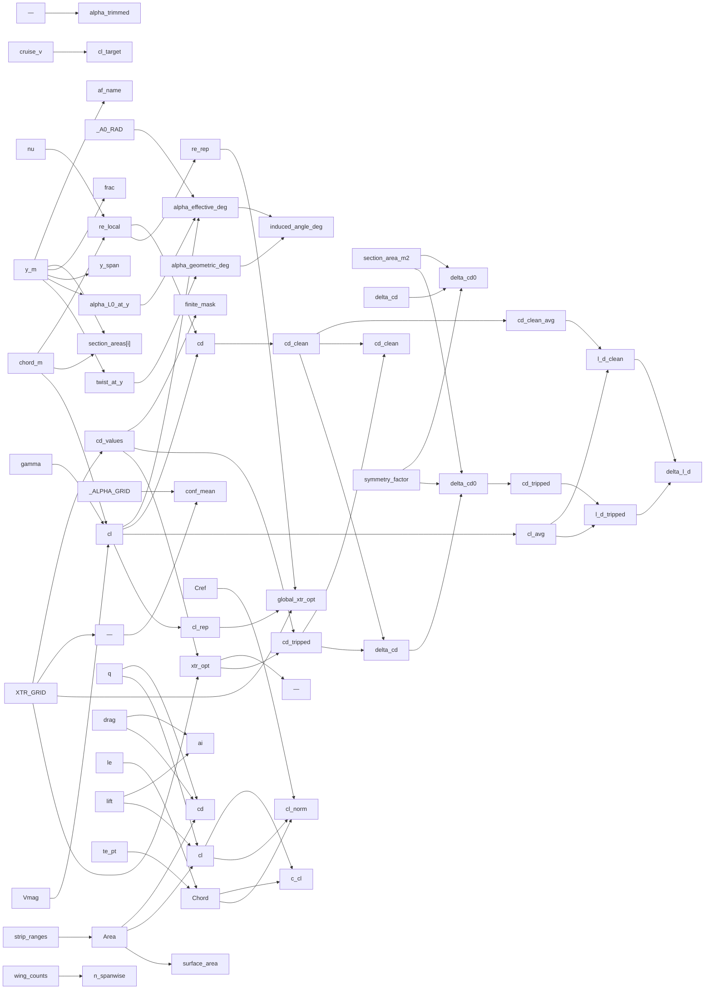

# aero-strips

> 128 nodes · generated from the 2026-08-18 extraction. See [[README|the format and its rules]].

## Cross-cutting findings reported by the extraction

🟡 *Not independently verified — treat as leads, not verdicts.*

```text
CROSS-CUTTING FINDINGS

1. Two independent producers of the same spanwise quantities (ADR 0022). `vlm_strip_forces` produces per-strip `cl` and `ai` (induced angle) from a VortexLatticeMethod at 40 panels/half; `section_aoa_service` produces `cl` and `induced_angle_deg` from a LiftingLine at 8 panels/half via Kutta-Joukowski + thin-airfoil inversion. Both are user-visible (Trefftz chart vs airfoil-preview page). Nothing reconciles them.

2. Kinematic viscosity has three values in the repo: 1.5e-5 hardcoded twice (section_aoa_service.py:141, turbulator_optimizer_service.py:396), 1.46e-5 in suitability_service.py:377, and the altitude-correct `atm.kinematic_viscosity()` in neuralfoil_cdcl_service.py:22 / analysis_service.py:1728. Every Reynolds number in this cluster is therefore sea-level-only regardless of the operating point's altitude.

3. Undeclared fallbacks (ADR 0020) are pervasive, and the turbulator module's own docstring claims the opposite ("NOT a silent fallback"). Concrete cases: nearest-neighbour cd outside the polar band (debug log only), `cd_clean = cd_tripped` on a non-finite baseline (no warning, reports delta_cd=0), naca0012 airfoil substitution, alpha_L0=0° on NeuralFoil failure, velocity=15 m/s and chord=0.20 m substitutions, Re clamp to 1e4, brentq failure → alpha=4°, and the VLM's collapse-to-one-surface on a strip-count mismatch.

4. Dead outputs. `total_lift`/`total_drag` are accumulated and never returned (vlm_strip_forces.py:266-267). `CL`/`CD` are returned by `compute_vlm_strip_forces` but no caller reads them — StripForcesResponse has no such fields. `xtr_lower` is a parameter no caller ever sets, so a lower-surface turbulator cannot be modelled (ADR 0021).

5. Docstring/code contradictions. `alpha_geom = op_alpha + incidence_w + twist(y)` in the docstring vs `op_alpha_deg + twist_at_y` in code. "CL-weighted mean Re" in the docstring vs area-weighted in code. "confidence at the first xtr" in the comment vs the middle grid point in code. `scope="segment"` is advertised in schema + UI but executes the "section" branch.

6. Reference-area authority differs across this cluster: `_resolve_level_flight_op` picks the FIRST symmetric wing's area; `build_wing_section_data` and the turbulator endpoint pick the LARGEST-area wing. A tail-first wing ordering makes the level-flight fallback size the aircraft on the stabiliser.

7. L/D semantics. `l_d_clean` / `l_d_tripped` shown in TurbulatorEditDialog divide CL by area-weighted 2D *section profile* drag only — no induced drag, no fuselage/parasite drag. The displayed absolute L/D is not the aircraft L/D; only the delta is defensible.

8. Constants outside the three files that gate this cluster: seed `alpha=3.0` and `design_speed_mps` default 15.0 m/s in turbulator_optimizer.py:105-113 and assumption_compute_service.py:2130 — both magic, both feed every section cl and Re here.

All values observed are RC/UAV-scale (1.5 kg, 15 m/s, 0.2 m chord, Re 1e4-3e5); no transport-category constant was found in these three files.
```

## Nodes

| node | kind | unit | user-visible | source | flags |
|---|---|---|---|---|---|
| [[bwsd-airfoil-fallback\|Airfoil name fallback]] | constant | n/a |  | 🔴 | anomaly, divergence, scale |
| [[bwsd-nu\|Kinematic viscosity (section builder)]] | constant | m²/s |  | 🟡 | anomaly, divergence, scale |
| [[lfop-alpha-fallback\|Trim alpha fallback]] | constant | deg | ✓ | 🔴 | anomaly, divergence |
| [[lfop-altitude\|Fallback altitude]] | constant | m | ✓ | 🟡 | divergence |
| [[lfop-brentq-bracket\|Brent bracket and tolerances]] | constant | deg / iteratio |  | 🟡 | divergence |
| [[lfop-cl-target-clip\|Target CL clamp]] | constant | dimensionless |  | 🔴 | anomaly, divergence, scale |
| [[lfop-cruise-v\|Assumed cruise speed (level-flight solve)]] | constant | m/s | ✓ | 🔴 | divergence |
| [[lfop-g\|Gravitational acceleration]] | constant | m/s² |  | 🟢 |  |
| [[lfop-mass-fallback\|Aircraft mass fallback (level-flight solve)]] | constant | kg |  | 🔴 | anomaly, divergence |
| [[lfop-rho\|Air density (level-flight solve)]] | constant | kg/m³ |  | 🟢 | divergence |
| [[lfop-s-ref-fallback\|Reference area fallback]] | constant | m² |  | 🔴 | anomaly, divergence |
| [[saoa-a0\|Thin-airfoil lift-curve slope]] | constant | 1/rad |  | 🟢 | divergence, scale |
| [[saoa-alpha-l0-fallback\|Zero-lift angle fallback]] | constant | deg |  | 🔴 | anomaly, divergence, scale |
| [[saoa-alpha-l0-sweep\|Alpha sweep for zero-lift angle]] | constant | deg |  | 🔴 | anomaly, divergence, scale |
| [[saoa-chord-fallback\|Chord fallback for Reynolds]] | constant | m |  | 🔴 | anomaly, divergence |
| [[saoa-nu\|Kinematic viscosity (section AoA)]] | constant | m²/s |  | 🟡 | anomaly, divergence, scale |
| [[saoa-output-rounding\|Output rounding precision]] | constant | decimals | ✓ | 🔴 | divergence |
| [[saoa-re-floor\|Reynolds floor]] | constant | dimensionless |  | 🟡 | anomaly, divergence |
| [[saoa-spanwise-resolution\|LiftingLine spanwise resolution]] | constant | panels |  | 🟡 | anomaly, divergence |
| [[saoa-velocity-fallback\|Velocity fallback for Reynolds]] | constant | m/s |  | 🔴 | anomaly, divergence |
| [[tos-alpha-grid\|Alpha grid for cd lookup]] | constant | deg |  | 🔴 | divergence |
| [[tos-cd-nan\|NaN cd on NeuralFoil failure]] | constant | dimensionless | ✓ | 🟡 | divergence |
| [[tos-confidence-threshold\|NeuralFoil confidence threshold]] | constant | dimensionless | ✓ | 🟡 | divergence, scale |
| [[tos-result-placeholder-geometry\|Placeholder y/chord/area in the raw section result]] | constant | m / m / m² |  | 🔴 | anomaly, divergence |
| [[tos-symmetry-factor\|Symmetric-wing doubling factor]] | constant | dimensionless |  | 🟢 | divergence |
| [[tos-xtr-grid\|Turbulator trip-position sweep grid]] | constant | x/c | ✓ | 🟡 | anomaly, divergence, scale |
| [[vlm-min-panels-per-segment\|Minimum panels per wing segment]] | constant | panels |  | 🔴 | divergence |
| [[vlm-panels-per-segment-degenerate\|Degenerate-span panel fallback]] | constant | panels |  | 🔴 | anomaly, divergence |
| [[vlm-spanwise-panels-per-half\|Spanwise panel budget per half-wing]] | constant | panels |  | 🔴 | anomaly, divergence |
| [[vlm-spanwise-resolution-fixed\|VLM spanwise_resolution literal]] | constant | dimensionless |  | 🟡 | divergence |
| [[vlm-strip-cdv\|Strip viscous drag coefficient]] | constant | dimensionless | ✓ | 🟢 | anomaly, divergence, scale |
| [[vlm-strip-cm-c4\|Strip quarter-chord moment coefficient]] | constant | dimensionless | ✓ | 🔴 | divergence |
| [[vlm-strip-cm-le\|Strip leading-edge moment coefficient]] | constant | dimensionless | ✓ | 🔴 | divergence |
| [[vlm-strip-cp-xc\|Strip centre of pressure x/c]] | constant | x/c | ✓ | 🟡 | anomaly, divergence |
| [[saoa-neuralfoil-model-size\|NeuralFoil model size (alpha_L0)]] | parameter | n/a |  | 🟡 | divergence |
| [[tos-model-size\|NeuralFoil model size (optimiser)]] | parameter | n/a |  | 🟡 | divergence, scale |
| [[tos-scope\|Optimiser scope]] | parameter | n/a | ✓ | 🔴 | anomaly, divergence |
| [[tos-xtr-lower\|Lower-surface trip position]] | parameter | x/c |  | 🟢 | anomaly, divergence |
| [[vlm-chordwise-resolution\|VLM chordwise panels per strip]] | parameter | panels | ✓ | 🟡 | divergence |
| [[vlm-spanwise-spacing-function\|Spanwise panel spacing function]] | parameter | n/a |  | 🟡 | divergence |
| [[bwsd-airfoil-per-section\|Per-section airfoil name]] | quantity | n/a |  | 🟡 | anomaly, divergence |
| [[bwsd-main-wing\|Main wing selection]] | quantity | n/a |  | 🟢 | divergence |
| [[bwsd-re-local\|Local section Reynolds number]] | quantity | dimensionless | ✓ | 🟢 | divergence |
| [[bwsd-section-area-normalised\|Normalised section area]] | quantity | m² |  | 🟡 | anomaly, divergence |
| [[bwsd-section-area-raw\|Raw trapezoidal section area]] | quantity | m² |  | 🟡 | divergence |
| [[cdftp-cd-clean\|Clean section drag (installed-turbulator path)]] | quantity | dimensionless |  | 🟢 |  |
| [[cdftp-cd-tripped\|Tripped section drag (installed-turbulator path)]] | quantity | dimensionless |  | 🟢 |  |
| [[cdftp-delta-cd\|Section drag delta (installed turbulator)]] | quantity | dimensionless |  | 🟢 | divergence |
| [[cdftp-delta-cd0\|Installed-turbulator 3D drag increment]] | quantity | dimensionless | ✓ | 🟡 | anomaly, divergence |
| [[cdftp-frac\|Span fraction of a section]] | quantity | dimensionless |  | 🟡 | divergence |
| [[cdftp-section-skip-warnings\|Per-section failure warnings]] | quantity | n/a |  | 🔴 | anomaly, divergence |
| [[cdftp-xtr-sec\|Section trip position from the installed turbulator]] | quantity | x/c |  | 🟡 | divergence |
| [[cdftp-y-span\|Span extent for trip interpolation]] | quantity | m |  | 🔴 | anomaly, divergence |
| [[lfop-alpha-trimmed\|Trimmed alpha from CL-target solve]] | quantity | deg | ✓ | 🟢 | divergence |
| [[lfop-cl-residual\|CL residual for the root search]] | quantity | dimensionless |  | 🟡 | anomaly, divergence |
| [[lfop-cl-target\|Level-flight target lift coefficient]] | quantity | dimensionless |  | 🟢 | divergence |
| [[lfop-s-ref\|Reference area (level-flight solve)]] | quantity | m² |  | 🟡 | anomaly, divergence |
| [[saoa-alpha-eff\|Effective angle of attack]] | quantity | deg | ✓ | 🟢 | divergence |
| [[saoa-alpha-geom\|Geometric angle of attack]] | quantity | deg | ✓ | 🟢 | anomaly, divergence |
| [[saoa-alpha-l0\|Section zero-lift angle]] | quantity | deg |  | 🟢 | divergence |
| [[saoa-alpha-l0-at-y\|Interpolated zero-lift angle at panel y]] | quantity | deg |  | 🟡 | anomaly, divergence |
| [[saoa-chord\|Panel chord]] | quantity | m | ✓ | 🟡 | divergence |
| [[saoa-cl\|Section lift coefficient (Kutta-Joukowski)]] | quantity | dimensionless | ✓ | 🟢 | anomaly, divergence |
| [[saoa-gamma\|Panel vortex strength]] | quantity | m²/s |  | 🟢 |  |
| [[saoa-induced-angle\|Induced downwash angle]] | quantity | deg | ✓ | 🟢 | anomaly, divergence |
| [[saoa-re-local\|Local chord Reynolds number (alpha_L0 lookup)]] | quantity | dimensionless |  | 🟢 |  |
| [[saoa-twist-at-y\|Interpolated twist at panel y]] | quantity | deg |  | 🟢 |  |
| [[saoa-vmag\|Local velocity magnitude]] | quantity | m/s |  | 🟡 | divergence |
| [[saoa-xsec-twist\|Cross-section twist array]] | quantity | deg |  | 🟡 | divergence |
| [[saoa-y\|Panel spanwise position]] | quantity | m | ✓ | 🟡 | divergence |
| [[tos-all-nan-guard\|All-NaN sweep guard]] | quantity | n/a | ✓ | 🟡 | divergence |
| [[tos-boundary-warning\|Grid-boundary minimum warning]] | quantity | n/a | ✓ | 🟡 | divergence |
| [[tos-cd-at-cl\|Section cd at a target CL and trip position]] | quantity | dimensionless |  | 🟡 | divergence |
| [[tos-cd-clean\|Natural-transition section drag]] | quantity | dimensionless | ✓ | 🟢 |  |
| [[tos-cd-clean-avg\|Area-weighted mean clean section drag]] | quantity | dimensionless |  | 🟡 | anomaly, divergence |
| [[tos-cd-clean-nan-fallback\|cd_clean → cd_tripped fallback]] | quantity | dimensionless | ✓ | 🔴 | anomaly, divergence |
| [[tos-cd-nearest-fallback\|Nearest-neighbour cd fallback]] | quantity | dimensionless |  | 🔴 | anomaly, divergence |
| [[tos-cd-tripped\|Tripped section drag]] | quantity | dimensionless | ✓ | 🟢 |  |
| [[tos-cd-tripped-total\|Tripped total drag coefficient]] | quantity | dimensionless |  | 🟡 | anomaly, divergence |
| [[tos-cd-values\|cd sweep over the trip grid]] | quantity | dimensionless |  | 🟡 | divergence |
| [[tos-cl-avg\|Area-weighted mean section CL]] | quantity | dimensionless |  | 🟢 | divergence |
| [[tos-cl-rep\|Representative lift coefficient (whole scope)]] | quantity | dimensionless |  | 🟡 | divergence |
| [[tos-conf-mean\|Mean NeuralFoil analysis confidence]] | quantity | dimensionless | ✓ | 🟡 | anomaly, divergence, scale |
| [[tos-confidence-probe-xtr\|Confidence-probe trip position]] | quantity | x/c |  | 🔴 | anomaly, divergence |
| [[tos-delta-cd\|Section drag delta]] | quantity | dimensionless | ✓ | 🟢 | divergence |
| [[tos-delta-cd0\|Area-weighted 3D drag increment]] | quantity | dimensionless | ✓ | 🟡 | anomaly, divergence |
| [[tos-delta-l-d\|L/D improvement]] | quantity | dimensionless | ✓ | 🟡 | divergence |
| [[tos-global-xtr-opt\|Whole-wing optimal trip position]] | quantity | x/c | ✓ | 🟡 | anomaly, divergence |
| [[tos-l-d-clean\|Clean lift-to-drag ratio]] | quantity | dimensionless | ✓ | 🟡 | anomaly, divergence, scale |
| [[tos-l-d-tripped\|Tripped lift-to-drag ratio]] | quantity | dimensionless | ✓ | 🟡 | divergence |
| [[tos-re-rep\|Representative Reynolds number (whole scope)]] | quantity | dimensionless |  | 🟡 | anomaly, divergence |
| [[tos-xtr-opt\|Optimal trip position]] | quantity | x/c | ✓ | 🟡 | divergence |
| [[vlm-alpha\|Echoed angle of attack]] | quantity | deg | ✓ | 🟢 |  |
| [[vlm-beta\|Echoed sideslip angle]] | quantity | deg | ✓ | 🟢 | divergence |
| [[vlm-blend-airfoil\|Blended section airfoil]] | quantity | n/a |  | 🟢 | anomaly, divergence |
| [[vlm-blend-chord\|Blended section chord]] | quantity | m |  | 🟢 |  |
| [[vlm-blend-fraction\|Inserted-section blend fraction]] | quantity | dimensionless |  | 🟡 | divergence |
| [[vlm-blend-twist\|Blended section twist]] | quantity | deg |  | 🟢 |  |
| [[vlm-blend-xyz-le\|Blended section leading-edge point]] | quantity | m |  | 🟢 |  |
| [[vlm-bref\|Reference span echoed to the response]] | quantity | m | ✓ | 🟢 |  |
| [[vlm-cd-total\|Whole-airplane drag coefficient (VLM run)]] | quantity | dimensionless |  | 🟢 | anomaly, divergence |
| [[vlm-cl-total\|Whole-airplane lift coefficient (VLM run)]] | quantity | dimensionless |  | 🟢 | anomaly, divergence |
| [[vlm-cref\|Reference chord echoed to the response]] | quantity | m | ✓ | 🟢 |  |
| [[vlm-drag-direction\|Unit freestream (drag) direction]] | quantity | dimensionless |  | 🟢 |  |
| [[vlm-dynamic-pressure\|Freestream dynamic pressure]] | quantity | Pa |  | 🟢 | anomaly, divergence |
| [[vlm-lift-direction\|Unit lift direction]] | quantity | dimensionless |  | 🟢 | anomaly, divergence |
| [[vlm-mach\|Echoed Mach number]] | quantity | dimensionless | ✓ | 🟢 | divergence |
| [[vlm-n-spanwise\|Spanwise strip count per surface]] | quantity | strips | ✓ | 🟡 | divergence |
| [[vlm-panels-per-segment\|Panels allotted to a wing segment]] | quantity | panels |  | 🟡 | divergence |
| [[vlm-segment-span\|Dihedral-inclusive segment span]] | quantity | m |  | 🟡 | divergence |
| [[vlm-sref\|Reference area echoed to the response]] | quantity | m² | ✓ | 🟢 | divergence |
| [[vlm-strip-ai\|Strip induced angle]] | quantity | deg | ✓ | 🟢 | anomaly, divergence |
| [[vlm-strip-area\|Strip area]] | quantity | m² | ✓ | 🟢 | divergence |
| [[vlm-strip-c-cl\|Chord × cl product]] | quantity | m | ✓ | 🟢 | divergence |
| [[vlm-strip-cd\|Local strip drag coefficient]] | quantity | dimensionless | ✓ | 🟢 | anomaly, divergence |
| [[vlm-strip-chord\|Local strip chord]] | quantity | m | ✓ | 🟡 | anomaly, divergence |
| [[vlm-strip-cl\|Local strip lift coefficient]] | quantity | dimensionless | ✓ | 🟢 | anomaly, divergence, scale |
| [[vlm-strip-cl-norm\|Normalised strip lift coefficient]] | quantity | dimensionless | ✓ | 🟡 | divergence |
| [[vlm-strip-drag\|Strip drag force]] | quantity | N |  | 🟢 | divergence |
| [[vlm-strip-force-vector\|Per-strip force vector]] | quantity | N |  | 🟢 |  |
| [[vlm-strip-index-ranges\|Panel index ranges per strip]] | quantity | index |  | 🟡 | divergence |
| [[vlm-strip-le\|Strip leading-edge point]] | quantity | m | ✓ | 🟢 |  |
| [[vlm-strip-lift\|Strip lift force]] | quantity | N |  | 🟢 | divergence |
| [[vlm-strip-te\|Strip trailing-edge point]] | quantity | m |  | 🟡 | divergence |
| [[vlm-surface-area\|Surface total area]] | quantity | m² | ✓ | 🟡 | divergence |
| [[vlm-total-drag\|Accumulated total drag]] | quantity | N |  | 🔴 | anomaly, divergence |
| [[vlm-total-lift\|Accumulated total lift]] | quantity | N |  | 🔴 | anomaly, divergence |
| [[vlm-wing-strip-counts\|Expected strips per wing]] | quantity | strips |  | 🟡 | anomaly, divergence |

## Graph — user-visible quantities and what feeds them



