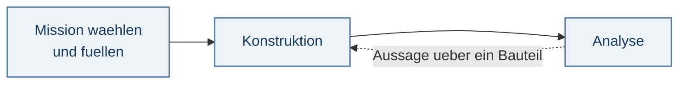
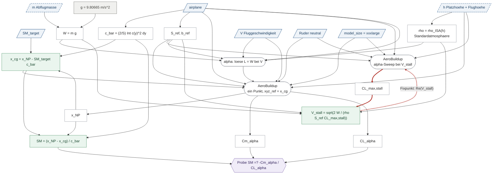

# Anforderungen an das Rechenwerk — der Sollzustand

*Was gerechnet werden soll, an welcher Stelle des Ablaufs, mit welcher Formel, unter
welchen Randbedingungen. Nicht, was der Code heute tut.*

**Dieses Dokument wird sukzessive befüllt.** Was hier steht, ist entschieden; was fehlt,
fehlt sichtbar. Ein leeres Feld ist ein besserer Zustand als ein ausgedachtes.

---

## 0. Wie dieses Dokument zu lesen ist

### 0.1 Drei Ebenen, und wer welche besitzt

Der Sollzustand zerfällt in drei Ebenen. Jede hat **genau eine** Autorität — sonst
entsteht auf der Dokumentebene derselbe Duplikatschaden, den wir im Code beschreiben.

| Ebene | was sie festlegt | Autorität |
|---|---|---|
| **Größe** | Name, Symbol, Einheit, Rolle | `quantities/<name>.md` |
| **Formel** | kanonische Form, Quelle, Gültigkeit bei 0,5–15 kg, Dimensionsprobe | `formulas/<name>.md` |
| **Anwendung** | welche Bindung, unter welcher Bedingung sie existiert | im Formeleintrag, Abschnitt *Applications* |
| **Ablauf · Rechengraph · Verfahren** | **wann gerechnet wird, in welcher Reihenfolge, mit welchen Bindungen** | **dieses Dokument** |

Dieses Dokument wiederholt nichts, was der Katalog trägt. Wo es eine Formel braucht, nennt
es den Eintrag.

**Eine Ausnahme, und sie ist gewollt:** Im Rechengraphen steht die Formel **im Kasten**,
nicht nur ihr Name. Das verlangt die Freigaberegel — an einem Graphen aus bloßen Namen
sieht man nicht, ob alle Eingänge belegt sind. Kasten und Katalogeintrag müssen deshalb
übereinstimmen, und diese Übereinstimmung ist maschinell prüfbar: Formel aus dem Kasten
lesen, gegen den Eintrag halten. Ein Duplikat ist unschädlich, solange es geprüft wird —
gefährlich wird es erst, wenn es unbemerkt auseinanderläuft.

### 0.2 Statusworte

Jeder Eintrag trägt genau eines:

| | |
|---|---|
| **entschieden** | der Maintainer hat es festgelegt; ab hier ist es die Vorgabe |
| **offen** | steht aus — **mit der konkreten Frage**, nicht als Platzhalter |
| **freigegeben** | entschieden *und* der Katalogeintrag hat alle Freigabetore passiert |

Die Vertrauensmarker der Spezifikation (🟢/🟡/🔴) gelten hier **nicht**. Sie sagen, wie
sicher eine Aussage über den Code ist. Dieses Dokument macht keine Aussagen über den Code.

### 0.3 Was ein Verfahren schuldet

Ein Gesetz (`law`) wird über Formel, Quelle und Maßstab freigegeben. Ein **Verfahren**
(`procedure`) schuldet vier Angaben — keine davon darf erfunden werden, beide Ursprünge
sind zitierbar:

1. **Welche Beziehung** es löst — das ist die Physik, und sie steht im Formelkatalog.
2. **Mit welcher Methode** — das ist Numerik, und sie hat eine eigene Quelle.
3. **Unter welchen Annahmen** die Methode gilt.
4. **Was es zurückgibt, wenn es nicht konvergiert.**

Punkt 4 ist kein Randfall: Ein Verfahren ohne erklärtes Verhalten bei Nichtkonvergenz
liefert im Fehlerfall eine Zahl, die aussieht wie ein Ergebnis (ADR 0020).

---

## 1. Der Ablauf

**Status: offen.** Das Gerüst unten sind die drei Schritte, die genannt wurden — mehr
nicht. Welche Schritte es wirklich gibt und wo ihre Grenzen liegen, ist die nächste
Festlegung.

Der Ablauf trägt die **Entwurfszyklen** — analysieren, etwas ändern, neu analysieren. Sie
enden durch das Urteil des Konstrukteurs. Die **Rechenzyklen** (Fixpunkte) bleiben unten in
den Rechengraphen und enden durch ein Konvergenzkriterium. Diese Trennung ist der Grund,
warum es zwei Diagrammarten gibt und nicht eine.

### Was der Ablauf leisten soll

**Er wählt die Bindungen.** Dieselbe Formel, andere Klappenstellung, anderer Name des
Ergebnisses: `v_stall_clean`, `v_stall_launch`, `v_stall_landing` sind **eine** Formel mit
drei Bindungen, nicht drei Formeln. Der Rechengraph zählt Formeln, nicht Größen.

**Er macht Namen prüfbar.** Die Prozessstufe wählt die Bindung, die Bindung bestimmt den
Namen. Jeder benannte Ausgabewert muss sich auf ein Paar *(Formel, Bindung)* zurückführen
lassen. Ein Name, der das nicht kann, ist eine unerklärte Anwendung oder ein Duplikat.

**Er zeigt, was dirty wird** — siehe Anforderung A1.

### Offen

- Welche Prozessschritte gibt es wirklich, und wo verläuft die Grenze zwischen ihnen?
- Welche Schritte sind wiederholbar, welche nur einmal am Anfang?
- Welche Aussagen laufen aus der Analyse in die Konstruktion zurück?

---

## 2. Prozessschritte

### 2.1 Analyse — Stabilitätsreserve und Abrissgeschwindigkeit

**Status: entschieden** bis auf die beiden Verfahren in §3.2 und die offene Entscheidung O1.

**Zweck.** Aus Geometrie, Masse und Zielstabilität die beiden Größen ermitteln, an denen
der Entwurf zuerst scheitert: wo der Schwerpunkt liegen muss, und wie langsam das Modell
werden darf.

#### Eingaben dieses Schritts

| Größe | Art | Anmerkung |
|---|---|---|
| `airplane` | Eingabe | die Konstruktion; **Referenzgrößen und `c̄` folgen daraus** |
| `SM_target` | Entwurfswahl | die Mission schlägt vor, der Konstrukteur überschreibt |
| `m` | Schätzung | der Komponentenbaum ist eine eigene Kette und liefert einen Kandidaten |
| `h` | Schätzung | zerfällt in **bekannte** Platzhöhe und **geschätzte** Flughöhe ≤ 150 m |
| `V` | Eingabe | die Fluggeschwindigkeit; `α` wird daraus gelöst |
| Ruderstellung | Eingabe | **neutral** — die Ableitungen sollen die des sauberen Flugzeugs sein |
| `model_size` | Eingabe | **`xxxlarge`**, siehe A3 |
| `g` | phys. Konstante | keine Eingabe, keine Wahl — siehe A5 |

Sieben Positionen. Alles Weitere ist abgeleitet: `ρ` aus der Höhe, `C_L,max,stall` aus dem
Sweep, `x_cg` aus `SM_target`, `W` aus `m` und `g`.

#### Rechengraph

Schräge blaue Kästen sind Eingaben, **gestrichelt wo geschätzt** — die Form trägt die
Rolle, der Strich die Sicherheit. Grau: physikalische Konstante. Weiß: eine Rechnung.
Raute: eine Probe. Grün: ein Ergebnis. **Rot und dick: der Fixpunkt, der konvergieren muss.**

#### Rechnungen dieses Schritts

| Knoten | Art | Katalogeintrag |
|---|---|---|
| `c̄ = (2/S) ∫ c(y)² dy` | law | **fehlt** — nur `quantities/mean-aerodynamic-chord.md` |
| `S_ref`, `b_ref` | Geometrie | `quantities/wing-reference-area.md` · `quantities/wing-span.md` |
| `ρ = ρ_ISA(h)` | law | `formulas/air-density-isa.md` — **freigegeben** |
| `W = m·g` | law | `formulas/weight-from-mass.md` — **freigegeben** |
| `α: löse L = W bei V` | **procedure** | §3.2.2 — Beziehung entschieden, drei Angaben offen |
| AeroBuildup, ein Punkt | Solveraufruf | `xyz_ref = x_cg`; liefert `x_NP`, `C_mα`, `CL_α` |
| AeroBuildup, α-Sweep | Solveraufruf | gebunden an `V_stall`; liefert `C_L,max,stall` |
| `x_cg = x_NP − SM_target·c̄` | law | **fehlt** — ADR 0011 |
| `SM = (x_NP − x_cg)/c̄` | law | **fehlt** |
| Probe `SM ≟ −C_mα/CL_α` | Probe | **fehlt** — zwei Wege zu einer Größe sind ein *Test*, keine zweite Wahrheit |
| `V_stall = √(2W/(ρ·S_ref·C_L,max,stall))` | law | `formulas/stall-speed.md` — **freigegeben** |

Der Stabilitätsteil des Katalogs existiert noch nicht: weder `static-margin` noch
`neutral-point`, `centre-of-gravity` oder `pitching-moment-slope` haben einen Eintrag. Das
ist die nächste Katalogarbeit.

#### Ausgaben

`x_cg` · `SM` · `V_stall` · das Ergebnis der Probe.

#### Zwei Eigenschaften, die man nachgemessen haben muss

**`x_NP` ist bezugsunabhängig, `C_mα` nicht.** Über 150 mm Verschiebung des Bezugspunkts
wandert `x_NP` um 0,17 mm — das ist Numerik. `C_mα` wechselt dabei das Vorzeichen, genau
bei `xyz_ref = x_NP`. Für den Neutralpunkt muss der Bezugspunkt also *nicht* stimmen, für
den Ableitungsweg zur Stabilitätsreserve **schon**.

**Der scheinbare Kreis `x_cg → xyz_ref → x_NP → x_cg` ist keiner.** Er ist in einem
Durchgang erledigt, weil `x_NP` nicht am Bezugspunkt hängt. Der **echte** Kreis ist der
rote: `C_L,max,stall` gilt bei der Reynoldszahl, die aus `V_stall` folgt.

### 2.2 — noch nicht aufgenommen

---

## 3. Formeln und Verfahren

### 3.1 Formeln

Der Katalog führt **46 Formeln und 65 Größen**; freigegeben sind bisher drei Formeln —
`air-density-isa`, `stall-speed`, `weight-from-mass`, also genau die Gesetze aus §2.1.
Die übrigen stehen auf `draft`, weil sie aus der Bestandsaufnahme stammen und die Freigabe
entlang der Pfade läuft, nicht Eintrag für Eintrag.

Dieses Dokument nennt Formeln nur dort, wo ein Prozessschritt sie verwendet.

### 3.2 Verfahren

Verfahren haben bisher **keinen** Platz im Katalog — sie stehen hier, bis genug davon
zusammenkommen, um `procedures/` zu rechtfertigen.

#### 3.2.1 Fixpunkt `V_stall ↔ C_L,max,stall`

**Status: offen** — die Beziehung steht, die Methode nicht.

| | |
|---|---|
| **Beziehung** | ✅ entschieden. `V_S = √(2W/(ρ·S_ref·C_L,max))` mit `C_L,max` ausgewertet bei `Re(V_S)`. Bei Modell-Reynoldszahlen ist `C_L,max` geschwindigkeitsabhängig, also ist die Gleichung **implizit**. |
| **Methode** | ⚪ offen. Fixpunktiteration, Sekante, Newton, oder eine feste Zahl von Durchgängen? |
| **Annahmen** | ⚪ offen. Monotonie von `C_L,max(Re)` im Modellbereich? Startwert? |
| **Nichtkonvergenz** | ⚪ offen. Was wird zurückgegeben — und mit welcher `DesignWarning`? |
| **Toleranz** | ⚪ offen. Woran wird Konvergenz gemessen: an `V_S` oder an `C_L,max`, absolut oder relativ? |

**Warum das Verfahren nötig ist, ist gemessen** — Flotte, 26 Flugzeuge: Median **+2,9 %**,
schlimmstenfalls **+33,2 %**, **jede** Abweichung in dieselbe Richtung. Die gemeldete
Abrissgeschwindigkeit ist immer die zu niedrige. Vorbedingung dokumentiert in
`formulas/stall-speed.md`, Bindung `cl_max`.

#### 3.2.2 Anstellwinkel aus `L = W`

**Status: offen** — die Beziehung steht, die Methode nicht.

| | |
|---|---|
| **Beziehung** | ✅ entschieden. Zu vorgegebenem `V` den Anstellwinkel finden, für den der Auftrieb das Gewicht trägt. |
| **Methode** | ⚪ offen. Eindimensionale Nullstelle — welche? |
| **Annahmen** | ⚠️ eine steht fest und wird leicht übersehen: **`L = W` gilt nur im stationären Horizontalflug.** Im Steigflug, in der Kurve und beim Handstart ist `L = n·W`. Der gelieferte Anstellwinkel — und damit alle Ableitungen — gelten für den geradeaus fliegenden Zustand. |
| **Nichtkonvergenz** | ⚪ offen. Der Fall existiert real: Oberhalb des Abrisses gibt es **kein** `α`, das `L = W` erfüllt. Was dann? |

---

## 4. Querschnittliche Anforderungen

Sie gelten für **jeden** Prozessschritt und werden nicht pro Schritt wiederholt.

### A1 — Invalidierung ist eine Traversierung, keine gepflegte Regel

**Status: entschieden.**

Was nach einer Änderung ungültig wird, ist die **transitive Hülle stromabwärts** im
Rechengraphen. Eine getrennt geführte Invalidierungsliste ist konstruktionsbedingt ein
Duplikat der Kanten — und Duplikate laufen auseinander.

Der Graph liefert zwei Dinge, die eine Liste nicht hat:

- **Granularität** — nicht alles wird ungültig, sondern das Erreichbare.
- **Reihenfolge** — topologisch, mit den Fixpunkten als markierten Zyklen.

Zwei Fehlerarten, die er verhindert: **Unterinvalidierung** (eine angezeigte Zahl passt
nicht mehr zur Geometrie — still und falsch) und **Überinvalidierung** (alles rechnet neu,
und die Anwender gewöhnen sich ab, auf den Zustand zu achten).

Am Graphen aus §2.1 sieht man, warum das keine Formsache ist:

| Änderung | wird ungültig |
|---|---|
| `h` | `ρ` → `α`, beide Solverläufe, und alles danach — **fast der ganze Schritt** |
| `V` | `α`, der Punktlauf, `x_NP`, `C_mα`, `CL_α`, `x_cg`, `SM`, die Probe — **`V_stall` aber nicht** |

Dass die Fluggeschwindigkeit die Abrissgeschwindigkeit *nicht* ungültig macht, folgt aus
den Kanten: `V_stall` hängt an `W`, `ρ`, `S_ref` und `C_L,max,stall`, und der Sweep hängt
an `V_stall` selbst, nicht an `V`. Genau solche Aussagen bekommt eine handgepflegte Liste
falsch.

### A2 — Benennung

**Status: entschieden.**

Schema `<größe>_<konfiguration>_<einheit>`, ausgeschrieben, keine Normkürzel.

> **Eine reynoldsabhängige Größe trägt die Bedingung, bei der sie ermittelt wurde, im
> Namen.** `C_L,max,stall`, nicht `C_L,max`.

Die Regel ist das Gegenstück zur Vorbedingung: Was die Vorbedingung fordert, macht der Name
sichtbar. Sie hätte den Reynolds-Fehler allein aufgedeckt — heute wird das Maximum über das
ganze Geschwindigkeitsgitter gebildet, also `C_L,max,v_max`, und dort eingesetzt, wo
`C_L,max,stall` stehen müsste. Unter zwei Namen fällt das beim Lesen auf, unter einem nicht.

### A3 — Eine erklärte Genauigkeitsstufe je freigegebener Größe

**Status: entschieden — `xxxlarge` für den Analysepfad.**

`model_size` folgt nicht aus dem Flugzeug; es ist die Netzgröße von NeuralFoil, also ein
Regler zwischen Genauigkeit und Rechenzeit. Gemessen an einem SD7037 im Modellbereich:
`xxsmall` liefert bei Re 50 000 einen um **14–19 % zu niedrigen** `C_L,max`, und zwar dort,
wo die laminare Ablöseblase sitzt. Ab `small` sind sich alle Stufen beim Auftriebsbeiwert
einig; die **Analysekonfidenz** trennt sie, und sie steigt mit der Größe. `xxxlarge`
erreicht 0,961 bei 100k für 5 ms.

> Nicht überall die höchste Stufe — aber **eine, die dasteht.** Sonst hängt eine
> freigegebene Zahl davon ab, über welchen Endpunkt man sie geholt hat.

### A4 — Einheiten

**Status: entschieden.**

Jede Größe trägt ihre Einheit im Katalogeintrag. Jede kanonische Formel muss die
Dimensionsprobe bestehen — mit **Längenmaßstab** (mm gegen m) und getrenntem Winkelfach,
weil beides in diesem Projekt real auseinanderläuft. Werkzeug: `scripts/check_canon.py`.

### A5 — Physikalische Konstanten genau einmal

**Status: entschieden.**

Bei einer Eingabe lautet die Freigabefrage *„ist der Wert richtig gewählt"*. Bei einer
physikalischen Konstante lautet sie **„ist sie genau einmal deklariert"** — es gibt keinen
Ermessensspielraum, also auch keine Diskussion über den Wert, nur über die Anzahl der
Stellen. Im Register steht `g` **elfmal, in zwei verschiedenen Werten**.

Gezeichnet wird eine Konstante nur, wenn sie in einer kanonischen Formel vorkommt. Steckt
sie in einem zitierten Standard — Gaskonstante und Temperaturgradient in `ρ_ISA(h)` —,
gehört sie in die Quelle des Gesetzes und nicht in den Graphen.

### A6 — Keine stillen Ersatzwerte

**Status: entschieden (ADR 0020).**

Der Sollzustand hat weiterhin Schätzungen, und er hat sie absichtlich. Was er nicht hat,
sind **stille** Schätzungen. Jede Ersetzung, Klemmung, Wiederholung und Kürzung meldet eine
`DesignWarning`, deren `severity` sagt, ob es fachliche Praxis oder ein Defekt ist. Ein
Restanteil für alles, was man nicht einzeln wiegt, ist eine **erklärte Größe** — ein Loch in
der Summe ist unsichtbar, ein Restanteil nicht.

### A7 — Eine Autorität je nutzersichtbarer Größe

**Status: entschieden (ADR 0022).**

Zu jeder Größe, die ein Anwender sieht, gibt es genau **einen** Erzeuger. Wo zwei Wege zu
derselben Größe führen, ist der zweite eine **Probe** und kein zweiter Erzeuger — so wie
der Ableitungsweg zur Stabilitätsreserve in §2.1.

---

## 5. Offene Entscheidungen

| Nr | Frage | blockiert |
|---|---|---|
| **O1** | Gehört der **Korrekturzweig** — Flügelversatz, Leitwerksskalierung — überhaupt in den Rechengraphen? Fällt er weg, verschwinden `a_VH`, beide Empfindlichkeiten und die 5·MAC-Klemme mit ihm. | Abschluss von §2.1 |
| **O2** | Die **drei fehlenden Angaben** zum Fixpunkt `V_stall ↔ C_L,max,stall`. | Freigabe von `stall-speed` als Anwendung |
| **O3** | Die **drei fehlenden Angaben** zum Anstellwinkelverfahren, insbesondere das Verhalten oberhalb des Abrisses. | Freigabe von §2.1 |
| **O4** | Welche **Prozessschritte** es wirklich gibt und wo ihre Grenzen liegen. | §1, und damit die Struktur aller weiteren Schritte |
| **O5** | Welches **Atmosphärenmodell** kanonisch ist. `air-density-isa` ist freigegeben, aber die Implementierung kennt mehrere Verfahren, und **kein einziger** der 16 Aufrufer wählt eines. | Eindeutigkeit von `ρ` |
| **O6** | Wie weit der **ASB-Sweep** Eingaben ersetzt. Der Solver kann über nahezu jeden Parameter fahren; jeder, den er sinnvoll durchfährt, ist einer, den niemand raten muss. | Umfang von Ebene 0 |

---

## Arbeitsregeln

**Keine Tickets, bis der Kanon steht.** Befunde werden dort festgehalten, wo sie die
Rechnung binden.

**Der Sollzustand wird erfragt, nicht aus dem Code abgeleitet.** Der Code ist die Quelle
für den Ist-Zustand. Für diesen hier ist es der Maintainer.

**Reproduktion vor Behauptung.** Jede Zahl in diesem Dokument ist nachgerechnet; wo sie es
nicht ist, steht es dabei.
