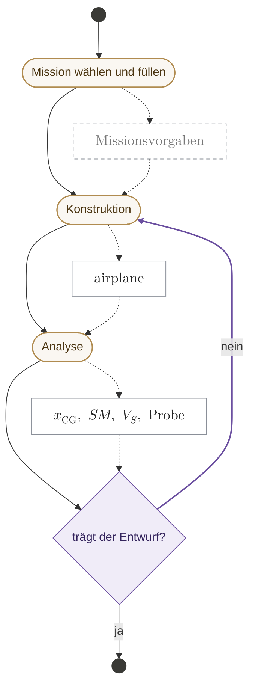
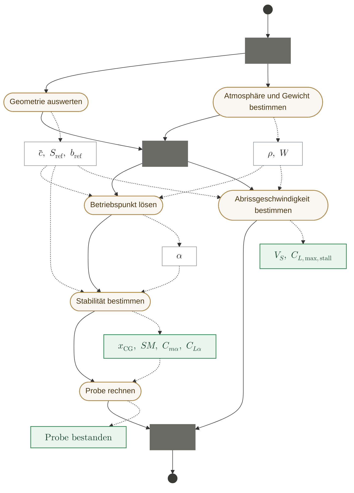
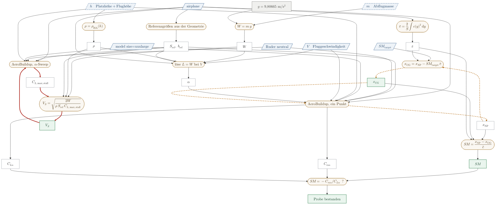

# Anforderungen an das Rechenwerk — der Sollzustand

*Was gerechnet werden soll, an welcher Stelle des Ablaufs, mit welcher Formel, unter
welchen Randbedingungen. Nicht, was der Code heute tut.*

**Dieses Dokument wird sukzessive befüllt**, von vorn nach hinten — dort beginnend, wo
der Anwender beginnt. Was hier steht, ist entschieden; was fehlt, fehlt sichtbar.

---

## 0. Wie dieses Dokument zu lesen ist

### 0.1 Drei Ebenen, und wer welche besitzt

Der Sollzustand zerfällt in drei Ebenen. Jede hat **genau eine** Autorität — sonst
entsteht auf der Dokumentebene derselbe Duplikatschaden, den wir im Code beschreiben.

| Ebene | was sie festlegt | Autorität |
|---|---|---|
| **Größe** | Name, Symbol, Einheit, Rolle | `quantities/<name>.md` |
| **Formel** | kanonische Form, Quelle, Gültigkeit bei 0,5–15 kg, Dimensionsprobe | `formulas/<name>.md` |
| **Anwendung** | welche Bindung, unter welcher Bedingung sie existiert | im Formeleintrag, Abschnitt *Applications* |
| **Ablauf · Rechengraph · Verfahren** | **wann gerechnet wird, in welcher Reihenfolge, mit welchen Bindungen** | **dieses Dokument** |

Dieses Dokument wiederholt nichts, was der Katalog trägt. Wo es eine Formel braucht, nennt
es den Eintrag.

**Eine Ausnahme, und sie ist gewollt:** Im Rechengraphen steht die Formel **im Kasten**,
nicht nur ihr Name. Das verlangt die Freigaberegel — an einem Graphen aus bloßen Namen
sieht man nicht, ob alle Eingänge belegt sind. Kasten und Katalogeintrag müssen deshalb
übereinstimmen, und diese Übereinstimmung ist maschinell prüfbar: Formel aus dem Kasten
lesen, gegen den Eintrag halten. Ein Duplikat ist unschädlich, solange es geprüft wird —
gefährlich wird es erst, wenn es unbemerkt auseinanderläuft.

### 0.2 Statusworte

Jeder Eintrag trägt genau eines:

| | |
|---|---|
| **entschieden** | der Maintainer hat es festgelegt; ab hier ist es die Vorgabe |
| **offen** | steht aus — **mit der konkreten Frage**, nicht als Platzhalter |
| **freigegeben** | entschieden *und* der Katalogeintrag hat alle Freigabetore passiert |

Die Vertrauensmarker der Spezifikation (🟢/🟡/🔴) gelten hier **nicht**. Sie sagen, wie
sicher eine Aussage über den Code ist. Dieses Dokument macht keine Aussagen über den Code.

### 0.3 Notation

**Formeln und Größen werden in LaTeX gesetzt.** Das gilt für den Fließtext, für
abgesetzte Formeln und für die Kästen der Rechengraphen: `mermaid-cli` 11 rendert KaTeX in
Knotenbeschriftungen — nachgeprüft —, es gibt also keinen Grund, dort auf ASCII
auszuweichen. Ob GitHubs eigener mermaid-Renderer dasselbe tut, ist **nicht** nachgeprüft;
maßgeblich ist das PDF.

$$V_S = \sqrt{\frac{2\,m\,g}{\rho\,S_\mathrm{ref}\,C_{L,\max,\mathrm{stall}}}}$$

**Eine Grenze des Graphenrenderers:** mermaids KaTeX kennt `\overset` und `\stackrel`
nicht und verwirft sie **still** — samt Argument. Im Fließtext (xelatex) funktionieren sie,
im Kasten nicht; dort steht deshalb $\text{Probe: } \ldots\ ?$ statt $\overset{?}{=}$.
Wer eine Formel in einen Knoten setzt, sieht sich das Ergebnis an.

Vier Festlegungen, damit es einheitlich bleibt:

| | |
|---|---|
| **Mehrbuchstabige Indizes aufrecht** | $S_\mathrm{ref}$, $x_\mathrm{NP}$, $\rho_\mathrm{ISA}$ — sie sind Namen, keine Produkte von Variablen |
| **Operatoren aufrecht** | $\max$, $\min$, $\mathrm{d}y$ |
| **Bedingung im Index, nicht im Text** | $C_{L,\max,\mathrm{stall}}$ — die Auswertebedingung gehört an die Größe (A2) |
| **Größe ≠ Bezeichner** | $SM_\mathrm{target}$ ist die *Größe*; `sm_target` ist das *Feld*, das sie trägt. Mathe kursiv, Code in Schreibmaschine. |

Die letzte Zeile ist die wichtigste. Ein Datenbankfeld, ein API-Name und ein
Dateipfad sind keine Mathematik und werden nie als solche gesetzt; eine physikalische
Größe wird nie in Schreibmaschine gesetzt. Wo beide im selben Satz vorkommen, sieht man
dann sofort, wovon die Rede ist.

**Der Katalog wird bei Berührung umgestellt.** Seine Einträge tragen die kanonische Form
heute in einem einfachen Codeblock, weil `scripts/check_canon.py` sie dort ausliest und
die Dimensionsprobe darauf rechnet. Das bleibt vorerst so: 43 der 46 Formeln stehen ohnehin
auf `draft` und werden bei der Freigabe entlang der Pfade angefasst — dann bekommt jeder
Eintrag seine LaTeX-Form. Ein Umschreiben aller Einträge auf einmal würde den Prüfer
brechen, ohne dass ein einziger Eintrag dadurch näher an der Freigabe wäre.

### 0.4 Drei Ebenen von Diagramm, und wo ein Zyklus hingehört

Ein Rechengraph und ein Aktivitätsdiagramm beantworten verschiedene Fragen. Werden sie in
ein Bild gelegt, beantwortet es keine von beiden: Ein Kasten ist dann mal ein Wert, mal
eine Handlung, ein Pfeil mal eine Abhängigkeit, mal eine Reihenfolge — und keine der
Prüfungen, für die wir die Bilder bauen, lässt sich noch darauf anwenden.

Es sind drei Ebenen, und **die entscheidende Unterscheidung liegt beim Zyklus: wer ihn
dreht.**

| Ebene | Diagramm | ein Zyklus darin heißt |
|---|---|---|
| **Ablauf** | Aktivitätsdiagramm | **der Anwender wiederholt etwas.** Er entscheidet, wann Schluss ist — es gibt kein rechenbares Abbruchkriterium |
| **Aktivität** | Rechengraph | eine **Abhängigkeit**, die im Kreis läuft. Eine Eigenschaft, keine Handlung — hier wird nichts wiederholt |
| **Rechnung** | Aktivitätsdiagramm | die **Iteration, die diesen Kreis auflöst** — mit Abbruchbedingungen: erfolgreich oder mit Fehler |

Daraus folgt die Regel, an der man beide Fehler erkennt:

> **Ein Zyklus, den wir rechnen, gehört in die Rechnung. Ein Zyklus im Ablauf ist einer,
> den der Anwender selbst dreht.**

Steht eine Konvergenzschleife im Ablauf, ist sie eine Ebene zu hoch. Steht ein
Entwurfszyklus in einer Rechnung, hat jemand das Urteil des Konstrukteurs automatisiert.

**Das schließt zugleich eine Lücke.** Ein Verfahren schuldet vier Angaben (§0.5), und drei
davon sind bisher überall offen. Das innere Aktivitätsdiagramm einer Rechnung **ist** diese
Spezifikation: Methode, Annahmen und das Verhalten bei Nichtkonvergenz werden dort
gezeichnet statt beschrieben. Ein Verfahren ohne inneres Diagramm ist ein Verfahren ohne
Abbruchbedingung — und liefert im Fehlerfall eine Zahl, die aussieht wie ein Ergebnis
(ADR 0020).

**Ein Solveraufruf ist im Rechengraphen keine Handlung**, sondern eine Beziehung, die aus
Eingängen Ausgänge macht — auf der `kind`-Achse ein `procedure`. Erst *wann* er läuft und
*wie oft*, ist Aktivität.

### 0.5 Eine Bildsprache für alle drei Ebenen

Damit man nicht umlernt, bedeuten die Formen überall dasselbe:

| Form | überall |
|---|---|
| **abgerundet, sandfarben** | etwas, das rechnet — eine Beziehung, eine Aktivität |
| **Rechteck** | ein Wert |
| Rechteck grün | ein Wert, der diesen Schritt verlässt |
| Parallelogramm blau | eine Eingabe; **gestrichelt**, wenn geschätzt |
| Rechteck grau | eine physikalische Konstante |
| **Raute** | eine Entscheidung, mit Wächtern an den Kanten |
| **Balken** | Gabelung oder Vereinigung nebenläufiger Zweige |
| durchgezogener Pfeil | Kontrollfluss — *danach* |
| **gestrichelter Pfeil** | Objektfluss — *dieser Wert geht dorthin* |

Objektknoten am Ablauf sind gültiges UML (Objektknoten bzw. Pins). Mitgeführt wird nur,
**was eine Aktivitätsgrenze überschreitet** — Zwischenwerte stehen im Rechengraphen der
jeweiligen Aktivität. Sonst hat man die Vermischung wieder, nur feiner.

### 0.6 Was ein Verfahren schuldet

Ein Gesetz (`law`) wird über Formel, Quelle und Maßstab freigegeben. Ein **Verfahren**
(`procedure`) schuldet vier Angaben — keine davon darf erfunden werden, beide Ursprünge
sind zitierbar:

1. **Welche Beziehung** es löst — das ist die Physik, und sie steht im Formelkatalog.
2. **Mit welcher Methode** — das ist Numerik, und sie hat eine eigene Quelle.
3. **Unter welchen Annahmen** die Methode gilt.
4. **Was es zurückgibt, wenn es nicht konvergiert.**

Punkt 4 ist kein Randfall: Ein Verfahren ohne erklärtes Verhalten bei Nichtkonvergenz
liefert im Fehlerfall eine Zahl, die aussieht wie ein Ergebnis (ADR 0020).

---

### 0.7 Die Form eines Aktivitätsabschnitts

Jede Aktivität aus §1 hat einen Abschnitt in §2, und jeder Abschnitt hat dieselben Teile:

| Teil | Inhalt |
|---|---|
| **Zweck** | wofür sie da ist, in einem Satz |
| **Eingaben** | was hineingeht, mit Herkunft — Anwender, Konstante, oder eine frühere Aktivität |
| **Ausgaben** | was herauskommt und weitergereicht wird |
| **Rechengraph** | Größen und Beziehungen, zweigeteilt, azyklisch gelesen |
| **Ablauf der Rechnung** | nur wenn iteriert wird: das innere Aktivitätsdiagramm mit den Abbruchbedingungen |
| **Offen** | was hier noch entschieden werden muss |

Eine Aktivität kann **zusammengesetzt** sein: Dann steht an dieser Stelle statt eines
Rechengraphen ein eigenes Aktivitätsdiagramm, und ihre Teilaktivitäten bekommen eigene
Abschnitte darunter.

---

## 1. Der Ablauf

**Status: im Aufbau.** Wir füllen ihn von vorn — dort, wo der Anwender anfängt.

Die Zyklen in diesem Bild sind **Anwenderzyklen**: Der Konstrukteur sieht sich das Ergebnis
an und geht zurück. Es gibt dafür kein rechenbares Abbruchkriterium, und es soll keines
geben — die Entscheidung, dass ein Entwurf trägt, ist seine.

Gestrichelte Pfeile sind **Objektfluss** — sie sagen, welcher Wert von wo nach wo geht, und
sind der Grund, warum man an diesem Bild überhaupt etwas prüfen kann. Ein Kasten mit
gestricheltem Rand ist ein Wert, dessen Inhalt noch nicht festgelegt ist.

**Der violette Rückweg ist der Entwurfszyklus.** Er hat keinen Wächter, der sich rechnen
ließe — dort steht das Urteil des Konstrukteurs.

### Was der Ablauf leisten soll

**Er wählt die Bindungen.** Dieselbe Formel, andere Klappenstellung, anderer Name des
Ergebnisses: $V_{S,\mathrm{clean}}$, $V_{S,\mathrm{launch}}$ und $V_{S,\mathrm{landing}}$
sind **eine** Formel mit drei Bindungen, nicht drei Formeln. Der Rechengraph zählt Formeln,
nicht Größen.

**Er macht Namen prüfbar.** Die Aktivität wählt die Bindung, die Bindung bestimmt den
Namen. Jeder benannte Ausgabewert muss sich auf ein Paar *(Formel, Bindung)* zurückführen
lassen. Ein Name, der das nicht kann, ist eine unerklärte Anwendung oder ein Duplikat.

**Er zeigt, was dirty wird** — siehe Anforderung A1.

### Was noch fehlt

Drei Aktivitäten sind zu wenig, und die Namen sind Platzhalter aus dem ersten Gespräch. Wir
verfeinern sie von vorn nach hinten; jede bekommt beim Verfeinern ihren Abschnitt in §2.
Solange eine Aktivität nicht aufgemacht ist, sind auch ihre Objektknoten gestrichelt.

---

## 2. Die Aktivitäten

### 2.1 Mission wählen und füllen

**Status: offen — hier arbeiten wir als Nächstes.**

**Zweck.** Festlegen, wofür das Flugzeug gebaut wird, und daraus die Vorgaben ableiten, an
denen der Entwurf später gemessen wird.

**Was hier schon entschieden ist**, weil es an anderer Stelle gebraucht wurde:

| Ausgabe | entschieden |
|---|---|
| $SM_\mathrm{target}$ | Die Mission **schlägt vor**, der Konstrukteur überschreibt. Also ist es eine Ausgabe dieser Aktivität und zugleich eine Entwurfswahl weiter unten. |

Mehr steht nicht fest. Was diese Aktivität sonst erzeugt, ist die nächste Frage — und sie
lässt sich nicht aus dem Code beantworten, weil dieses Dokument den Sollzustand führt.

### 2.2 Konstruktion

**Status: noch nicht aufgenommen.** Erzeugt `airplane`.

### 2.3 Analyse

**Status: zusammengesetzt; die Teilaktivitäten sind geschnitten, die Rechnungen sind
entschieden.**

**Zweck.** Aus Geometrie, Masse und Zielstabilität die beiden Größen ermitteln, an denen
der Entwurf zuerst scheitert: wo der Schwerpunkt liegen muss, und wie langsam das Modell
werden darf.

Dies ist eine **zusammengesetzte** Aktivität — statt eines Rechengraphen steht hier ein
eigener Ablauf. **Er enthält keine Konvergenzschleife mehr:** Die Iteration der Abrissgeschwindigkeit ist
eine Rechnung und gehört damit in den Abschnitt der Aktivität *Abrissgeschwindigkeit
bestimmen* — der steht noch aus.

**Die Gabelungen sind keine Entwurfsentscheidungen, sondern Ablesungen** — und der erste
Entwurf dieses Bildes hatte an zwei Stellen mehr behauptet, als die Kanten hergeben:

| behauptet war | tatsächlich |
|---|---|
| *Geometrie auswerten* **vor** *Atmosphäre und Gewicht* | beide brauchen nur Eingaben des Anwenders und sind **unabhängig** — die Reihenfolge war erfunden |
| *Abrissgeschwindigkeit* wird vor der Probe **vereinigt** | die Probe braucht nur $SM$, $C_{m\alpha}$, $C_{L\alpha}$. Der Abrisszweig läuft **bis zum Ende durch**, ohne dass jemand auf ihn wartet |

Beides fiel beim Nachzählen der Kanten auf, nicht beim Lesen — und das ist der Zweck der
Regel aus §0.4: Was der Ablauf über den Rechengraphen hinaus behauptet, muss jemand
entschieden haben. Hier hatte es niemand.

Übrig bleiben zwei echte Gabelungen: $\{$Geometrie, Umgebung$\}$ am Anfang, und danach
$\{$Betriebspunkt $\to$ Stabilität $\to$ Probe, Abrissgeschwindigkeit$\}$.

#### Was beim Verfeinern dieser sechs zu entscheiden ist

Das sind genau die Stellen, an denen eine Rechnung über ihren Rechengraphen hinausgeht —
und damit der Inhalt der inneren Aktivitätsdiagramme:

| bei | |
|---|---|
| *Abrissgeschwindigkeit bestimmen* | Woran wird Konvergenz gemessen, mit welcher Toleranz, und was geschieht nach $N$ erfolglosen Durchgängen? Mit welchem $V_S$ läuft der erste Sweep? → O2 |
| *Betriebspunkt lösen* | Was, wenn es keine Lösung gibt — oberhalb des Abrisses erfüllt **kein** $\alpha$ die Bedingung $L = W$? → O3 |
| *Probe rechnen* | Ist eine nicht bestandene Probe ein Ergebnis mit Warnung oder ein Abbruch? |

#### Eingaben des ganzen Schritts

| Größe | Art | Anmerkung |
|---|---|---|
| `airplane` | Eingabe | die Konstruktion; **Referenzgrößen und $\bar{c}$ folgen daraus** |
| $SM_\mathrm{target}$ | Entwurfswahl | die Mission schlägt vor, der Konstrukteur überschreibt |
| $m$ | Schätzung | der Komponentenbaum ist eine eigene Kette und liefert einen Kandidaten |
| $h$ | Schätzung | zerfällt in **bekannte** Platzhöhe und **geschätzte** Flughöhe $\leq 150\,\mathrm{m}$ |
| $V$ | Eingabe | die Fluggeschwindigkeit; $\alpha$ wird daraus gelöst |
| Ruderstellung | Eingabe | **neutral** — die Ableitungen sollen die des sauberen Flugzeugs sein |
| `model_size` | Eingabe | **`xxxlarge`**, siehe A3 |
| $g$ | phys. Konstante | keine Eingabe, keine Wahl — siehe A5 |

Sieben Positionen. Alles Weitere ist abgeleitet: $\rho$ aus der Höhe,
$C_{L,\max,\mathrm{stall}}$ aus dem Sweep, $x_\mathrm{CG}$ aus $SM_\mathrm{target}$, $W$ aus
$m$ und $g$.

#### Der Rechengraph des ganzen Schritts

Bis die sechs Teilaktivitäten je einen eigenen Abschnitt haben, steht hier der Graph des
ganzen Schritts. **Er wird beim Verfeinern zerschnitten**, nicht neu gezeichnet: Jede
Teilaktivität bekommt den Ausschnitt, den sie rechnet, und was heute eine Kante zwischen
zwei Beziehungen ist, wird dort zu einem Objektfluss zwischen zwei Aktivitäten.

Zweigeteilt: **Rechtecke sind Größen, abgerundete Kästen sind Beziehungen.** Eine Kante
heißt „ist Eingang von" oder „erzeugt", nie „danach". Es gibt keine Reihenfolge in diesem
Bild und keine Verzweigung — beides steht im Ablauf darunter.

Der Nutzen der Zweiteilung ist unmittelbar: Eine Größe mit **zwei** eingehenden
Beziehungen verletzt ADR 0022, und das sieht man jetzt, ohne etwas zu lesen.

Schräge blaue Kästen sind Eingaben, **gestrichelt wo geschätzt** — die Form trägt die
Rolle, der Strich die Sicherheit. Grau: physikalische Konstante. Sandfarben abgerundet:
eine Beziehung. Weiß: eine gerechnete Größe. Grün: ein Ergebnis dieses Schritts.

#### Der Graph hat zwei Zyklen, und nur einer ist echt

Das sieht man erst, seit Größen und Beziehungen getrennt sind — im vermischten Bild war der
eine ein Pfeil und der andere eine Bemerkung.

**Rot: $V_S \to$ Sweep $\to C_{L,\max,\mathrm{stall}} \to$ Abrissformel $\to V_S$.** Ein
echter Fixpunkt. $C_{L,\max}$ gilt bei der Reynoldszahl, die aus $V_S$ folgt, und bei
Modellgrößen hängt es stark davon ab. Er braucht ein Verfahren (§3.2.1) und ein
Abbruchkriterium.

**Bernstein gestrichelt: $x_\mathrm{CG} \to$ Punktlauf $\to x_\mathrm{NP} \to$ CG-Formel
$\to x_\mathrm{CG}$.** Formal derselbe Kreis, praktisch keiner — nachgemessen wandert
$x_\mathrm{NP}$ über 150 mm Bezugsverschiebung um 0,17 mm. Die Abhängigkeit steht im Graphen,
weil sie besteht; sie ist numerisch vernachlässigbar, und das ist eine **Aussage über die
Physik**, keine Vereinfachung der Zeichnung.

Wichtig ist die Einschränkung: Für $x_\mathrm{NP}$ ist der Zyklus entartet, für
$C_{m\alpha}$ **nicht** — dessen Vorzeichen wechselt genau bei
$\mathbf{x}_\mathrm{ref} = x_\mathrm{NP}$. $C_{m\alpha}$ speist nur die Probe, also hängt
genau die Probe am konvergierten $x_\mathrm{CG}$ und sonst nichts.

#### Die Rechnungen darin

| Knoten | Art | Katalogeintrag |
|---|---|---|
| $\bar{c} = \frac{2}{S}\int c(y)^2\,\mathrm{d}y$ | law | **fehlt** — nur `quantities/mean-aerodynamic-chord.md` |
| $S_\mathrm{ref},\ b_\mathrm{ref}$ | Geometrie | `quantities/wing-reference-area.md` · `quantities/wing-span.md` |
| $\rho = \rho_\mathrm{ISA}(h)$ | law | `formulas/air-density-isa.md` — **freigegeben** |
| $W = m\,g$ | law | `formulas/weight-from-mass.md` — **freigegeben** |
| $\alpha$ aus $L = W$ bei $V$ | **procedure** | §3.2.2 — Beziehung entschieden, drei Angaben offen |
| AeroBuildup, ein Punkt | Solveraufruf | $\mathbf{x}_\mathrm{ref} = x_\mathrm{CG}$; liefert $x_\mathrm{NP}$, $C_{m\alpha}$, $C_{L\alpha}$ |
| AeroBuildup, $\alpha$-Sweep | Solveraufruf | gebunden an $V_S$; liefert $C_{L,\max,\mathrm{stall}}$ |
| $x_\mathrm{CG} = x_\mathrm{NP} - SM_\mathrm{target}\,\bar{c}$ | law | **fehlt** — ADR 0011 |
| $SM = (x_\mathrm{NP} - x_\mathrm{CG})/\bar{c}$ | law | **fehlt** |
| Probe $SM \overset{?}{=} -C_{m\alpha}/C_{L\alpha}$ | Probe | **fehlt** — zwei Wege zu einer Größe sind ein *Test*, keine zweite Wahrheit |
| $V_S = \sqrt{2W/(\rho\,S_\mathrm{ref}\,C_{L,\max,\mathrm{stall}})}$ | law | `formulas/stall-speed.md` — **freigegeben** |

Der Stabilitätsteil des Katalogs existiert noch nicht: weder `static-margin` noch
`neutral-point`, `centre-of-gravity` oder `pitching-moment-slope` haben einen Eintrag. Das
ist die nächste Katalogarbeit.

#### Ausgaben des ganzen Schritts

$x_\mathrm{CG}$ · $SM$ · $V_S$ · das Ergebnis der Probe.

---

## 3. Formeln und Verfahren

### 3.1 Formeln

Der Katalog führt **46 Formeln und 65 Größen**; freigegeben sind bisher drei Formeln —
`air-density-isa`, `stall-speed`, `weight-from-mass`, also genau die Gesetze aus §2.1.
Die übrigen stehen auf `draft`, weil sie aus der Bestandsaufnahme stammen und die Freigabe
entlang der Pfade läuft, nicht Eintrag für Eintrag.

Dieses Dokument nennt Formeln nur dort, wo ein Prozessschritt sie verwendet.

### 3.2 Verfahren

Verfahren haben bisher **keinen** Platz im Katalog — sie stehen hier, bis genug davon
zusammenkommen, um `procedures/` zu rechtfertigen.

#### 3.2.1 Fixpunkt $V_S \leftrightarrow C_{L,\max,\mathrm{stall}}$

**Status: offen** — die Beziehung steht, die Methode nicht.

| | |
|---|---|
| **Beziehung** | ✅ entschieden. $V_S = \sqrt{2W/(\rho\,S_\mathrm{ref}\,C_{L,\max})}$ mit $C_{L,\max}$ ausgewertet bei $Re(V_S)$. Bei Modell-Reynoldszahlen ist $C_{L,\max}$ geschwindigkeitsabhängig, also ist die Gleichung **implizit**. |
| **Methode** | ⚪ offen. Fixpunktiteration, Sekante, Newton, oder eine feste Zahl von Durchgängen? |
| **Annahmen** | ⚪ offen. Monotonie von $C_{L,\max}(Re)$ im Modellbereich? Startwert? |
| **Nichtkonvergenz** | ⚪ offen. Was wird zurückgegeben — und mit welcher `DesignWarning`? |
| **Toleranz** | ⚪ offen. Woran wird Konvergenz gemessen: an $V_S$ oder an $C_{L,\max}$, absolut oder relativ? |

**Warum das Verfahren nötig ist, ist gemessen** — Flotte, 26 Flugzeuge: Median **+2,9 %**,
schlimmstenfalls **+33,2 %**, **jede** Abweichung in dieselbe Richtung. Die gemeldete
Abrissgeschwindigkeit ist immer die zu niedrige. Vorbedingung dokumentiert in
`formulas/stall-speed.md`, Bindung `cl_max`.

#### 3.2.2 Anstellwinkel aus $L = W$

**Status: offen** — die Beziehung steht, die Methode nicht.

| | |
|---|---|
| **Beziehung** | ✅ entschieden. Zu vorgegebenem $V$ den Anstellwinkel $\alpha$ finden, für den der Auftrieb das Gewicht trägt. |
| **Methode** | ⚪ offen. Eindimensionale Nullstelle — welche? |
| **Annahmen** | ⚠️ eine steht fest und wird leicht übersehen: **$L = W$ gilt nur im stationären Horizontalflug.** Im Steigflug, in der Kurve und beim Handstart ist $L = n\,W$. Der gelieferte Anstellwinkel — und damit alle Ableitungen — gelten für den geradeaus fliegenden Zustand. |
| **Nichtkonvergenz** | ⚪ offen. Der Fall existiert real: Oberhalb des Abrisses gibt es **kein** $\alpha$, das $L = W$ erfüllt. Was dann? |

---

## 4. Querschnittliche Anforderungen

Sie gelten für **jeden** Prozessschritt und werden nicht pro Schritt wiederholt.

### A1 — Invalidierung ist eine Traversierung, keine gepflegte Regel

**Status: entschieden.**

Was nach einer Änderung ungültig wird, ist die **transitive Hülle stromabwärts** im
Rechengraphen. Eine getrennt geführte Invalidierungsliste ist konstruktionsbedingt ein
Duplikat der Kanten — und Duplikate laufen auseinander.

Der Graph liefert zwei Dinge, die eine Liste nicht hat:

- **Granularität** — nicht alles wird ungültig, sondern das Erreichbare.
- **Reihenfolge** — topologisch, mit den Fixpunkten als markierten Zyklen.

Zwei Fehlerarten, die er verhindert: **Unterinvalidierung** (eine angezeigte Zahl passt
nicht mehr zur Geometrie — still und falsch) und **Überinvalidierung** (alles rechnet neu,
und die Anwender gewöhnen sich ab, auf den Zustand zu achten).

Am Graphen aus §2.1 sieht man, warum das keine Formsache ist:

| Änderung | wird ungültig |
|---|---|
| $h$ | $\rho$, $\alpha$, beide Solverläufe, und alles danach — **fast der ganze Schritt** |
| $V$ | $\alpha$, der Punktlauf, $x_\mathrm{NP}$, $C_{m\alpha}$, $C_{L\alpha}$, $x_\mathrm{CG}$, $SM$, die Probe — **$V_S$ aber nicht** |

Dass die Fluggeschwindigkeit die Abrissgeschwindigkeit *nicht* ungültig macht, folgt aus
den Kanten: $V_S$ hängt an $W$, $\rho$, $S_\mathrm{ref}$ und $C_{L,\max,\mathrm{stall}}$,
und der Sweep hängt an $V_S$ selbst, nicht an $V$. Genau solche Aussagen bekommt eine
handgepflegte Liste falsch.

### A2 — Benennung

**Status: entschieden.**

Schema `<größe>_<konfiguration>_<einheit>`, ausgeschrieben, keine Normkürzel.

> **Eine reynoldsabhängige Größe trägt die Bedingung, bei der sie ermittelt wurde, im
> Namen.** $C_{L,\max,\mathrm{stall}}$, nicht $C_{L,\max}$.

Die Regel ist das Gegenstück zur Vorbedingung: Was die Vorbedingung fordert, macht der Name
sichtbar. Sie hätte den Reynolds-Fehler allein aufgedeckt — heute wird das Maximum über das
ganze Geschwindigkeitsgitter gebildet, also $C_{L,\max,v_{\max}}$, und dort eingesetzt, wo
$C_{L,\max,\mathrm{stall}}$ stehen müsste. Unter zwei Namen fällt das beim Lesen auf, unter
einem nicht.

### A3 — Eine erklärte Genauigkeitsstufe je freigegebener Größe

**Status: entschieden — `xxxlarge` für den Analysepfad.**

`model_size` folgt nicht aus dem Flugzeug; es ist die Netzgröße von NeuralFoil, also ein
Regler zwischen Genauigkeit und Rechenzeit. Gemessen an einem SD7037 im Modellbereich:
`xxsmall` liefert bei $Re = 50\,000$ einen um **14–19 % zu niedrigen** $C_{L,\max}$, und
zwar dort, wo die laminare Ablöseblase sitzt. Ab `small` sind sich alle Stufen beim
Auftriebsbeiwert einig; die **Analysekonfidenz** trennt sie, und sie steigt mit der Größe.
`xxxlarge` erreicht 0,961 bei $Re = 100\,000$ für 5 ms.

> Nicht überall die höchste Stufe — aber **eine, die dasteht.** Sonst hängt eine
> freigegebene Zahl davon ab, über welchen Endpunkt man sie geholt hat.

### A4 — Einheiten

**Status: entschieden.**

Jede Größe trägt ihre Einheit im Katalogeintrag. Jede kanonische Formel muss die
Dimensionsprobe bestehen — mit **Längenmaßstab** (mm gegen m) und getrenntem Winkelfach,
weil beides in diesem Projekt real auseinanderläuft. Werkzeug: `scripts/check_canon.py`.

### A5 — Physikalische Konstanten genau einmal

**Status: entschieden.**

Bei einer Eingabe lautet die Freigabefrage *„ist der Wert richtig gewählt"*. Bei einer
physikalischen Konstante lautet sie **„ist sie genau einmal deklariert"** — es gibt keinen
Ermessensspielraum, also auch keine Diskussion über den Wert, nur über die Anzahl der
Stellen. Im Register steht $g$ **elfmal, in zwei verschiedenen Werten**.

Gezeichnet wird eine Konstante nur, wenn sie in einer kanonischen Formel vorkommt. Steckt
sie in einem zitierten Standard — Gaskonstante und Temperaturgradient in
$\rho_\mathrm{ISA}(h)$ —, gehört sie in die Quelle des Gesetzes und nicht in den Graphen.

### A6 — Keine stillen Ersatzwerte

**Status: entschieden (ADR 0020).**

Der Sollzustand hat weiterhin Schätzungen, und er hat sie absichtlich. Was er nicht hat,
sind **stille** Schätzungen. Jede Ersetzung, Klemmung, Wiederholung und Kürzung meldet eine
`DesignWarning`, deren `severity` sagt, ob es fachliche Praxis oder ein Defekt ist. Ein
Restanteil für alles, was man nicht einzeln wiegt, ist eine **erklärte Größe** — ein Loch in
der Summe ist unsichtbar, ein Restanteil nicht.

### A7 — Eine Autorität je nutzersichtbarer Größe

**Status: entschieden (ADR 0022).**

Zu jeder Größe, die ein Anwender sieht, gibt es genau **einen** Erzeuger. Wo zwei Wege zu
derselben Größe führen, ist der zweite eine **Probe** und kein zweiter Erzeuger — so wie
der Ableitungsweg zur Stabilitätsreserve in §2.1.

---

## 5. Offene Entscheidungen

Seit §0.4 haben O2 und O3 einen Ort: Sie werden im **inneren Aktivitätsdiagramm** der
jeweiligen Rechnung beantwortet, nicht in Prosa. Ein Verfahren ohne inneres Diagramm ist
eines ohne Abbruchbedingung.

| Nr | Frage | blockiert |
|---|---|---|
| **O1** | Gehört der **Korrekturzweig** — Flügelversatz, Leitwerksskalierung — überhaupt in den Rechengraphen? Fällt er weg, verschwinden $a_{VH}$, beide Empfindlichkeiten und die $5\,\bar{c}$-Klemme mit ihm. | Abschluss von §2.1 |
| **O2** | Die **drei fehlenden Angaben** zum Fixpunkt $V_S \leftrightarrow C_{L,\max,\mathrm{stall}}$. | Freigabe von `stall-speed` als Anwendung |
| **O3** | Die **drei fehlenden Angaben** zum Anstellwinkelverfahren, insbesondere das Verhalten oberhalb des Abrisses. | Freigabe von §2.1 |
| **O4** | Welche **Prozessschritte** es wirklich gibt und wo ihre Grenzen liegen. | §1, und damit die Struktur aller weiteren Schritte |
| **O5** | Welches **Atmosphärenmodell** kanonisch ist. `air-density-isa` ist freigegeben, aber die Implementierung kennt mehrere Verfahren, und **kein einziger** der 16 Aufrufer wählt eines. | Eindeutigkeit von $\rho$ |
| **O6** | Wie weit der **ASB-Sweep** Eingaben ersetzt. Der Solver kann über nahezu jeden Parameter fahren; jeder, den er sinnvoll durchfährt, ist einer, den niemand raten muss. | Umfang von Ebene 0 |

---

## Arbeitsregeln

**Keine Tickets, bis der Kanon steht.** Befunde werden dort festgehalten, wo sie die
Rechnung binden.

**Der Sollzustand wird erfragt, nicht aus dem Code abgeleitet.** Der Code ist die Quelle
für den Ist-Zustand. Für diesen hier ist es der Maintainer.

**Reproduktion vor Behauptung.** Jede Zahl in diesem Dokument ist nachgerechnet; wo sie es
nicht ist, steht es dabei.
