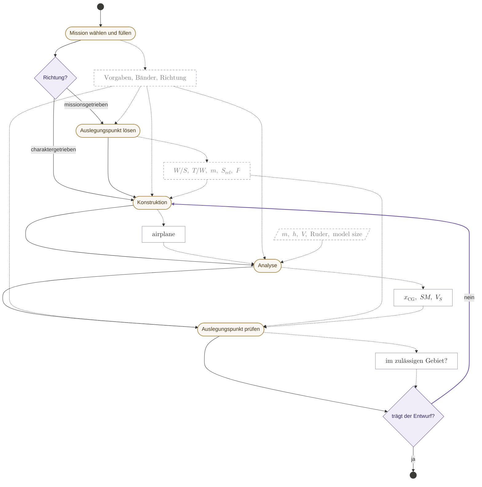
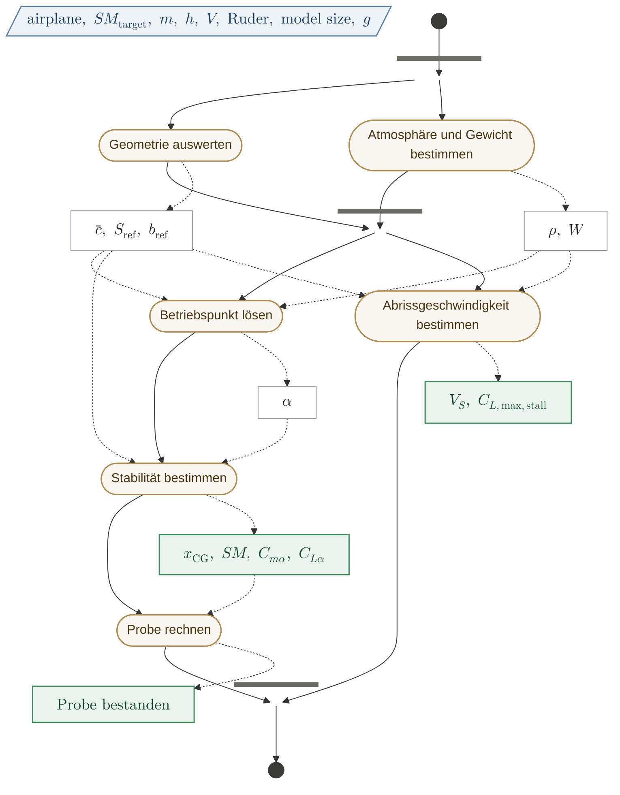
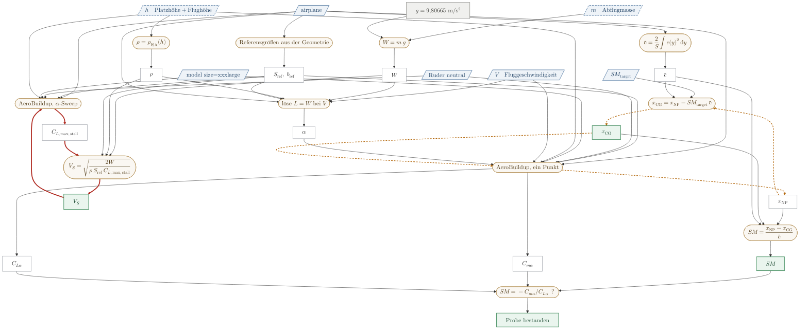
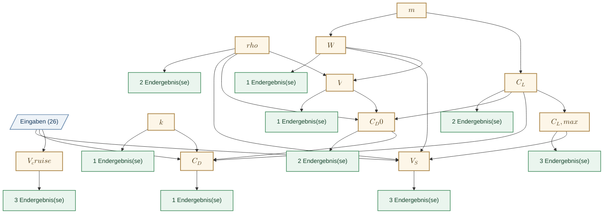

# Anforderungen an das Rechenwerk — der Sollzustand

*Was gerechnet werden soll, an welcher Stelle des Ablaufs, mit welcher Formel, unter
welchen Randbedingungen. Nicht, was der Code heute tut.*

**Dieses Dokument wird sukzessive befüllt**, von vorn nach hinten — dort beginnend, wo
der Anwender beginnt. Was hier steht, ist entschieden; was fehlt, fehlt sichtbar.

---

## 0. Wie dieses Dokument zu lesen ist

### 0.1 Drei Ebenen, und wer welche besitzt

Der Sollzustand zerfällt in drei Ebenen. Jede hat **genau eine** Autorität — sonst
entsteht auf der Dokumentebene derselbe Duplikatschaden, den wir im Code beschreiben.

| Ebene | was sie festlegt | Autorität |
|---|---|---|
| **Größe** | Name, Symbol, Einheit, Rolle | `quantities/<name>.md` |
| **Formel** | kanonische Form, Quelle, Gültigkeit bei 0,5–15 kg, Dimensionsprobe | `formulas/<name>.md` |
| **Anwendung** | welche Bindung, unter welcher Bedingung sie existiert | im Formeleintrag, Abschnitt *Applications* |
| **Ablauf · Rechengraph · Verfahren** | **wann gerechnet wird, in welcher Reihenfolge, mit welchen Bindungen** | **dieses Dokument** |

Dieses Dokument wiederholt nichts, was der Katalog trägt. Wo es eine Formel braucht, nennt
es den Eintrag.

**Eine Ausnahme, und sie ist gewollt:** Im Rechengraphen steht die Formel **im Kasten**,
nicht nur ihr Name. Das verlangt die Freigaberegel — an einem Graphen aus bloßen Namen
sieht man nicht, ob alle Eingänge belegt sind. Kasten und Katalogeintrag müssen deshalb
übereinstimmen, und diese Übereinstimmung ist maschinell prüfbar: Formel aus dem Kasten
lesen, gegen den Eintrag halten. Ein Duplikat ist unschädlich, solange es geprüft wird —
gefährlich wird es erst, wenn es unbemerkt auseinanderläuft.

### 0.2 Statusworte

Jeder Eintrag trägt genau eines:

| | |
|---|---|
| **entschieden** | der Maintainer hat es festgelegt; ab hier ist es die Vorgabe |
| **offen** | steht aus — **mit der konkreten Frage**, nicht als Platzhalter |
| **freigegeben** | entschieden *und* der Katalogeintrag hat alle Freigabetore passiert |

Die Vertrauensmarker der Spezifikation (🟢/🟡/🔴) gelten hier **nicht**. Sie sagen, wie
sicher eine Aussage über den Code ist. Dieses Dokument macht keine Aussagen über den Code.

### 0.3 Notation

**Formeln und Größen werden in LaTeX gesetzt.** Das gilt für den Fließtext, für
abgesetzte Formeln und für die Kästen der Rechengraphen: `mermaid-cli` 11 rendert KaTeX in
Knotenbeschriftungen — nachgeprüft —, es gibt also keinen Grund, dort auf ASCII
auszuweichen. Ob GitHubs eigener mermaid-Renderer dasselbe tut, ist **nicht** nachgeprüft;
maßgeblich ist das PDF.

$$V_S = \sqrt{\frac{2\,m\,g}{\rho\,S_\mathrm{ref}\,C_{L,\max,\mathrm{stall}}}}$$

**Eine Grenze des Graphenrenderers:** mermaids KaTeX kennt `\overset` und `\stackrel`
nicht und verwirft sie **still** — samt Argument. Im Fließtext (xelatex) funktionieren sie,
im Kasten nicht; dort steht deshalb $\text{Probe: } \ldots\ ?$ statt $\overset{?}{=}$.
Wer eine Formel in einen Knoten setzt, sieht sich das Ergebnis an.

Vier Festlegungen, damit es einheitlich bleibt:

| | |
|---|---|
| **Mehrbuchstabige Indizes aufrecht** | $S_\mathrm{ref}$, $x_\mathrm{NP}$, $\rho_\mathrm{ISA}$ — sie sind Namen, keine Produkte von Variablen |
| **Operatoren aufrecht** | $\max$, $\min$, $\mathrm{d}y$ |
| **Bedingung im Index, nicht im Text** | $C_{L,\max,\mathrm{stall}}$ — die Auswertebedingung gehört an die Größe (A2) |
| **Größe ≠ Bezeichner** | $SM_\mathrm{target}$ ist die *Größe*; `sm_target` ist das *Feld*, das sie trägt. Mathe kursiv, Code in Schreibmaschine. |

Die letzte Zeile ist die wichtigste. Ein Datenbankfeld, ein API-Name und ein
Dateipfad sind keine Mathematik und werden nie als solche gesetzt; eine physikalische
Größe wird nie in Schreibmaschine gesetzt. Wo beide im selben Satz vorkommen, sieht man
dann sofort, wovon die Rede ist.

**Der Katalog wird bei Berührung umgestellt.** Seine Einträge tragen die kanonische Form
heute in einem einfachen Codeblock, weil `scripts/check_canon.py` sie dort ausliest und
die Dimensionsprobe darauf rechnet. Das bleibt vorerst so: fast alle Formeln stehen ohnehin
auf `draft` und werden bei der Freigabe entlang der Pfade angefasst — dann bekommt jeder
Eintrag seine LaTeX-Form. Ein Umschreiben aller Einträge auf einmal würde den Prüfer
brechen, ohne dass ein einziger Eintrag dadurch näher an der Freigabe wäre.

### 0.4 Drei Ebenen von Diagramm, und wo ein Zyklus hingehört

Ein Rechengraph und ein Aktivitätsdiagramm beantworten verschiedene Fragen. Werden sie in
ein Bild gelegt, beantwortet es keine von beiden: Ein Kasten ist dann mal ein Wert, mal
eine Handlung, ein Pfeil mal eine Abhängigkeit, mal eine Reihenfolge — und keine der
Prüfungen, für die wir die Bilder bauen, lässt sich noch darauf anwenden.

Es sind drei Ebenen, und **die entscheidende Unterscheidung liegt beim Zyklus: wer ihn
dreht.**

| Ebene | Diagramm | ein Zyklus darin heißt |
|---|---|---|
| **Ablauf** | Aktivitätsdiagramm | **der Anwender wiederholt etwas.** Er entscheidet, wann Schluss ist — es gibt kein rechenbares Abbruchkriterium |
| **Aktivität** | Rechengraph | eine **Abhängigkeit**, die im Kreis läuft. Eine Eigenschaft, keine Handlung — hier wird nichts wiederholt |
| **Rechnung** | Aktivitätsdiagramm | die **Iteration, die diesen Kreis auflöst** — mit Abbruchbedingungen: erfolgreich oder mit Fehler |

Daraus folgt die Regel, an der man beide Fehler erkennt:

> **Ein Zyklus, den wir rechnen, gehört in die Rechnung. Ein Zyklus im Ablauf ist einer,
> den der Anwender selbst dreht.**

Steht eine Konvergenzschleife im Ablauf, ist sie eine Ebene zu hoch. Steht ein
Entwurfszyklus in einer Rechnung, hat jemand das Urteil des Konstrukteurs automatisiert.

**Das schließt zugleich eine Lücke.** Ein Verfahren schuldet vier Angaben (§0.6), und drei
davon sind bisher überall offen. Das innere Aktivitätsdiagramm einer Rechnung **ist** diese
Spezifikation: Methode, Annahmen und das Verhalten bei Nichtkonvergenz werden dort
gezeichnet statt beschrieben. Ein Verfahren ohne inneres Diagramm ist ein Verfahren ohne
Abbruchbedingung — und liefert im Fehlerfall eine Zahl, die aussieht wie ein Ergebnis
(ADR 0020).

**Die Trennung trägt mehr, als sie sollte.** Gebaut wurde sie für die Zyklen — wer sie
dreht. Sie beantwortet aber auch die Frage nach der **Richtung**: ob missionsgetrieben oder
charaktergetrieben gearbeitet wird (§2.1), ist eine Entscheidung des Konstrukteurs und
steht deshalb im Ablauf. Der Rechengraph sieht davon nichts — er sieht nur, welche Größen
gebunden sind. Ein Modell, das etwas erklärt, wofür es nicht gebaut wurde, ist
wahrscheinlich richtig geschnitten.

**Ein Solveraufruf ist im Rechengraphen keine Handlung**, sondern eine Beziehung, die aus
Eingängen Ausgänge macht — auf der `kind`-Achse ein `procedure`. Erst *wann* er läuft und
*wie oft*, ist Aktivität.

### 0.5 Eine Bildsprache für alle drei Ebenen

Damit man nicht umlernt, bedeuten die Formen überall dasselbe:

| Form | überall |
|---|---|
| **abgerundet, sandfarben** | etwas, das rechnet — eine Beziehung, eine Aktivität |
| **Rechteck** | ein Wert |
| Rechteck grün | ein Wert, der diesen Schritt verlässt |
| Parallelogramm blau | eine Eingabe; **gestrichelt**, wenn geschätzt |
| Rechteck grau | eine physikalische Konstante |
| **Raute** | eine Entscheidung, mit Wächtern an den Kanten |
| **Balken** | Gabelung oder Vereinigung nebenläufiger Zweige |
| durchgezogener Pfeil | Kontrollfluss — *danach* |
| **gestrichelter Pfeil** | Objektfluss — *dieser Wert geht dorthin* |

Objektknoten am Ablauf sind gültiges UML (Objektknoten bzw. Pins). Mitgeführt wird nur,
**was eine Aktivitätsgrenze überschreitet** — Zwischenwerte stehen im Rechengraphen der
jeweiligen Aktivität. Sonst hat man die Vermischung wieder, nur feiner.

### 0.6 Was ein Verfahren schuldet

Ein Gesetz (`law`) wird über Formel, Quelle und Maßstab freigegeben. Ein **Verfahren**
(`procedure`) schuldet vier Angaben — keine davon darf erfunden werden, beide Ursprünge
sind zitierbar:

1. **Welche Beziehung** es löst — das ist die Physik, und sie steht im Formelkatalog.
2. **Mit welcher Methode** — das ist Numerik, und sie hat eine eigene Quelle.
3. **Unter welchen Annahmen** die Methode gilt.
4. **Was es zurückgibt, wenn es nicht konvergiert.**

Punkt 4 ist kein Randfall: Ein Verfahren ohne erklärtes Verhalten bei Nichtkonvergenz
liefert im Fehlerfall eine Zahl, die aussieht wie ein Ergebnis (ADR 0020).

---


#### Was ein Optimierungsproblem schuldet

**Entschieden am 01.10.2026.** Werte, die auf eine Optimierung hinauslaufen, werden **als
Optimierungsproblem** dargestellt und nicht als geschlossene Formel. Ihre kanonische Form
nennt Entscheidungsvariablen, Ziel und Nebenbedingung:

$$V_S = \min_{V,\,\alpha}\; V \quad \text{u.d.N.}\quad L(V,\alpha) = n\,m\,g$$

Damit **entfällt der Verweis auf einen Zyklus**. Die Kopplung über die Reynoldszahl steht
nicht als Kreis im Graphen, sondern steckt in der Nebenbedingung — der Solver bildet bei
jedem $V$ die passende Polare. Das Problem *beschreibt* die Kopplung bereits vollständig.

Die vier Angaben eines Verfahrens (§0.6) werden dadurch konkret:

| | |
|---|---|
| **Beziehung** | Ziel und Nebenbedingung |
| **Methode** | IPOPT über `asb.Opti`, mit AeroBuildup in der Nebenbedingung — ein veröffentlichtes Verfahren mit eigenem Konvergenzstatus |
| **Annahmen** | **keine Schranke ist am Optimum aktiv**; das Modell ist differenzierbar (NeuralFoil ist es) |
| **Versagen** | Solverfehler oder aktive Schranke → `DesignWarning`, **kein Wert** |

Eine aktive Schranke ist kein Ergebnis, sondern ein Randwert — dieselbe Klammerbedingung
wie beim Sweep, nur vom Solver selbst gemeldet.

Die geschlossene Form bleibt, wo es sie gibt, als **Optimalitätsbedingung und Probe**: Am
Optimum eingesetzt muss sie den Wert des Solvers zurückgeben.

### 0.7 Die Form eines Aktivitätsabschnitts

Jede Aktivität aus §1 hat einen Abschnitt in §2, und jeder Abschnitt hat dieselben Teile:

| Teil | Inhalt |
|---|---|
| **Zweck** | wofür sie da ist, in einem Satz |
| **Eingaben** | was hineingeht, mit Herkunft — Anwender, Konstante, oder eine frühere Aktivität |
| **Ausgaben** | was herauskommt und weitergereicht wird |
| **Rechengraph** | Größen und Beziehungen, zweigeteilt, azyklisch gelesen |
| **Ablauf der Rechnung** | nur wenn iteriert wird: das innere Aktivitätsdiagramm mit den Abbruchbedingungen |
| **Offen** | was hier noch entschieden werden muss |

Eine Aktivität kann **zusammengesetzt** sein: Dann steht an dieser Stelle statt eines
Rechengraphen ein eigenes Aktivitätsdiagramm, und ihre Teilaktivitäten bekommen eigene
Abschnitte darunter.

---

## 1. Der Ablauf

**Status: im Aufbau.** Wir füllen ihn von vorn — dort, wo der Anwender anfängt.

Die Zyklen in diesem Bild sind **Anwenderzyklen**: Der Konstrukteur sieht sich das Ergebnis
an und geht zurück. Es gibt dafür kein rechenbares Abbruchkriterium, und es soll keines
geben — die Entscheidung, dass ein Entwurf trägt, ist seine.


```mermaid
flowchart TD
  classDef akt fill:#faf7f2,stroke:#b08b4f,stroke-width:1.5px,color:#4a3410
  classDef obj fill:#ffffff,stroke:#8a8f98,color:#222
  classDef ofn fill:#ffffff,stroke:#8a8f98,stroke-dasharray:5 4,color:#777
  classDef term fill:#3a3a36,stroke:#3a3a36,color:#fff
  classDef ent fill:#f0ecf8,stroke:#6b4fa0,color:#33235c

  S(("&nbsp;")):::term
  A1(["Mission wählen und füllen"]):::akt
  O1["$$\text{Vorgaben, Bänder, Richtung}$$"]:::ofn
  D0{"Richtung?"}:::ent
  A15(["Auslegungspunkt lösen"]):::akt
  O15["$$W/S,\ T/W,\ m,\ S_\mathrm{ref},\ P$$"]:::ofn
  A2(["Konstruktion"]):::akt
  O2["$$\text{airplane}$$"]:::obj
  A3(["Analyse"]):::akt
  O3["$$x_\mathrm{CG},\ SM,\ V_S$$"]:::obj
  A4(["Auslegungspunkt prüfen"]):::akt
  O4["$$\text{im zulässigen Gebiet?}$$"]:::obj
  OB3[/"$$m,\ h,\ V,\ \text{Ruder},\ \text{model size}$$"/]:::ofn
  D{"trägt der Entwurf?"}:::ent
  E(("&nbsp;")):::term

  S --> A1
  A1 --> D0
  D0 -->|"missionsgetrieben"| A15
  D0 -->|"charaktergetrieben"| A2
  A15 --> A2
  A2 --> A3
  A3 --> A4
  A4 --> D
  D -->|"nein"| A2
  D -->|"ja"| E

  A1 -.-> O1
  O1 -.-> A15
  O1 -.-> A2
  O1 -.-> A4
  A15 -.-> O15
  O15 -.-> A2
  O15 -.-> A4
  A2 -.-> O2
  O2 -.-> A3
  A3 -.-> O3
  O3 -.-> A4
  A4 -.-> O4
  O4 -.-> D
  O1 -.-> A3
  OB3 -.-> A3

  linkStyle 8 stroke:#6b4fa0,stroke-width:2px
```
*Abbildung — Der Ablauf, für beide Richtungen. Die Raute \emph{Richtung?} verzweigt sie; der violette Rückweg ist der Entwurfszyklus und hat bewusst keinen rechenbaren Wächter. Der Auslegungspunkt kommt zweimal vor: einmal gelöst, einmal geprüft. Auf dem missionsgetriebenen Weg ist die Prüfung die Probe der Lösung, auf dem charaktergetriebenen die einzige Stelle, an der der Beschränkungssatz überhaupt benutzt wird.*

Gestrichelte Pfeile sind **Objektfluss** — sie sagen, welcher Wert von wo nach wo geht, und
sind der Grund, warum man an diesem Bild überhaupt etwas prüfen kann. Ein Kasten mit
gestricheltem Rand ist ein Wert, dessen Inhalt noch nicht festgelegt ist.

**Die erste Raute ist die Richtungsentscheidung** aus §2.1. Sie verzweigt den Ablauf, nicht
die Rechnung — und genau das macht der zweifach auftretende Auslegungspunkt sichtbar:

| | missionsgetrieben | charaktergetrieben |
|---|---|---|
| *Auslegungspunkt lösen* | ja — aus den Forderungen | entfällt |
| *Auslegungspunkt prüfen* | **Probe** der Lösung | die einzige Benutzung des Beschränkungssatzes |

Es ist **eine** Beziehung mit zwei Bindungen, nicht zwei Verfahren (§2.1). Deshalb steht sie
auch zweimal im selben Ablauf und nicht je einmal in zwei Abläufen.

**Der violette Rückweg ist der Entwurfszyklus.** Er hat keinen Wächter, der sich rechnen
ließe — dort steht das Urteil des Konstrukteurs.

### Was der Ablauf leisten soll

**Er wählt die Bindungen.** Dieselbe Formel, andere Klappenstellung, anderer Name des
Ergebnisses: $V_{S,\mathrm{clean}}$, $V_{S,\mathrm{launch}}$ und $V_{S,\mathrm{landing}}$
sind **eine** Formel mit drei Bindungen, nicht drei Formeln. Der Rechengraph zählt Formeln,
nicht Größen.

**Er macht Namen prüfbar.** Die Aktivität wählt die Bindung, die Bindung bestimmt den
Namen. Jeder benannte Ausgabewert muss sich auf ein Paar *(Formel, Bindung)* zurückführen
lassen. Ein Name, der das nicht kann, ist eine unerklärte Anwendung oder ein Duplikat.

**Er zeigt, was dirty wird** — siehe Anforderung A1.

### Was noch fehlt

Drei Aktivitäten sind zu wenig, und die Namen sind Platzhalter aus dem ersten Gespräch. Wir
verfeinern sie von vorn nach hinten; jede bekommt beim Verfeinern ihren Abschnitt in §2.
Solange eine Aktivität nicht aufgemacht ist, sind auch ihre Objektknoten gestrichelt.

---

## 2. Die Aktivitäten

### 2.1 Mission wählen und füllen

**Status: die Richtung ist entschieden, der Inhalt ist offen.**

**Zweck.** Festlegen, wofür gebaut wird — und **in welcher Richtung** gearbeitet wird.

#### Zwei Richtungen, ein Auslegungspunkt

| | bekannt | gesucht |
|---|---|---|
| **missionsgetrieben** | Nutzlast, Flugdauer, Feldlänge … | Masse, Flügelfläche, Leistung |
| **charaktergetrieben** | Masse (geschätzt), Fläche (gezeichnet), Motor (gekauft) | welche Beschränkung bindet |

Entschieden:

1. **Beide Richtungen sind zulässig.** Für ein UAV ist die missionsgetriebene die richtige,
   für einen Trainer oder ein Kunstflugmodell die charaktergetriebene.
2. **Es gibt einen Beschränkungssatz und einen Auslegungspunkt**, nicht zwei Verfahren. Die
   Richtung entscheidet nur, welche Größen Eingabe sind und welche gerechnet werden — also
   die **Bindung**, nicht die Formel.
3. **Wo beide Richtungen dieselbe Größe erreichen, ist die zweite eine Probe** (A7). Wer nur
   von oben rechnet, hat Zahlen und kein Flugzeug; wer nur von unten baut, hat ein Flugzeug
   und keine Aussage darüber, ob es die Aufgabe erfüllt.
4. **Die Richtung ist eine Entwurfsentscheidung** und steht deshalb im Ablauf (§1), nicht im
   Rechengraphen. Sie ist orthogonal zum Missionstyp: Auch ein Buschflugzeug kann
   charaktergetrieben entstehen.

#### Warum RC nicht der kleine Bruder von UAV ist

Beim UAV ist das Flugzeug ein **Mittel**: Es existiert, um eine Nutzlast eine bestimmte Zeit
zu tragen. Nimm die Nutzlast weg, und es gibt keinen Grund, es zu bauen — deshalb trägt dort
die Kette *Forderung → Auslegungspunkt → Größe*.

Beim Modell ist das Flugzeug der **Zweck**. Es trägt nichts, es muss nirgendwohin, und die
Flugdauer ist, was der Akku hergibt. Gefordert wird, **wie es sich anfliegt** — eine
Flugeigenschaft, keine Einsatzforderung. Und der Entwurf ist häufig **von unten**
eingeschnürt: ein vorhandener Motor, eine Spannweite, die ins Auto passt, eine Fläche, die
sich drucken lässt.

Daraus folgt, was hier **nicht** erzwungen werden darf:

| | |
|---|---|
| nutzlastgetriebene Dimensionierung | es gibt beim Modell keine Nutzlast, um die herum ausgelegt würde |
| Akkumasse aus geforderter Flugdauer | beim Modell wird der Akku gewählt und die Flugdauer folgt — `endurance-from-battery` ist für diese Richtung **richtig herum** |

#### Was unabhängig von der Richtung gilt

- **Die Form einer Anforderung.** Auch beim Trainer ist *„soll sanft fliegen"* keine
  Anforderung, *„Abrissgeschwindigkeit unter 7 m/s bei 1,2 kg"* schon. Nur der **Inhalt**
  wechselt von Einsatz auf Flugeigenschaft.
- **Die drei Modelle** — Schub mit Abfall, Widerstandspolare, Massenabschätzung.
- **Die Iteration.** Frühe Annahmen sind falsch; ADR 0010 ist die gebaute Maschinerie dafür.

#### Der charaktergetriebene Einstieg: drei Fragen, in dieser Reihenfolge

**Status: entschieden.** Sie gelten für den **charaktergetriebenen** Weg — Modellbau. Der
missionsgetriebene Einstieg beginnt bei Nutzlast und Flugdauer und ist offen (siehe unten).

1. **Die RC-Mission des Modells** — wofür es gebaut wird.
2. **Der Typ** — Doppeldecker, Tiefdecker, Hochdecker, Ente, Nurflügel, inverser
   Nurflügel und was es sonst gibt.
3. **Die Spannweite** — sie muss **handhabbar** sein.

Aus diesen drei fallen bereits Konstruktionsvorgaben — und zwar als **Bänder**, nicht als
Zahlen.

#### Warum Bänder

Zu diesem Zeitpunkt ist nichts genau, und eine genaue Zahl wäre eine Behauptung. Ein Band
sagt, wo der Entwurf landen muss, damit er die Mission trifft — und es verschieben zu
müssen ist eine Entscheidung, die man begründen kann. Eine Punktvorgabe kann man nur
verfehlen.

Das ist zugleich die einzige Form, die zu einer Vorgabe passt, die aus einem **Missionstyp**
stammt: Ein Trainer hat keine Flächenbelastung, er hat eine, die zu Trainern passt.

#### Was aus welcher Angabe fällt

| Angabe | was daraus folgt |
|---|---|
| **RC-Mission** | Bänder für Flächenbelastung, Streckung, Stabilitätsreserve, Leitwerksvolumen, V-Form, Ruderflächenanteile |
| **Typ** | **welche Bänder überhaupt existieren** — siehe unten |
| **Spannweite** | mit dem Streckungsband: Flügelfläche und Flügeltiefe. Mit dem Flächenbelastungsband: **die Abflugmasse als Band** |

#### Der Typ ist ein Topologieschalter, kein Parameter

Er wählt nicht einen Wert aus einem Band, sondern entscheidet, **welche Bänder es gibt**.
Ein Nurflügel hat kein Höhenleitwerksvolumen — nicht ein kleines, sondern keines. Bei einer
Ente kehrt sich die Stabilitätslogik um. Ein Hoch- und ein Tiefdecker brauchen
unterschiedliche V-Form für dieselbe Querstabilität.

Deshalb steht der Typ **vor** der Spannweite und vor allem Übrigen außer der Mission: Er
bestimmt die Gestalt des Anforderungssatzes, nicht seinen Inhalt.

#### Die Abflugmasse wird ein Band — und das ist die zweite Gleichung

$$m = \frac{(W/S)\ b^2}{g\,A}$$

Spannweite ist gegeben, Streckung und Flächenbelastung kommen als Bänder aus der Mission —
also ist die Abflugmasse ein Band. **Das ist für die charaktergetriebene Richtung genau das,
was beim UAV die Missionsanalyse leistet:** die zusätzliche Gleichung, die aus Verhältnissen
absolute Größen macht.

Die Entsprechung ist strukturell, nicht nur begrifflich:

| | die feste äußere Größe | daraus |
|---|---|---|
| **UAV** | Nutzlast — das Einzige, wofür das Flugzeug existiert | Masse, Fläche, Leistung |
| **RC** | **Spannweite** — sie muss handhabbar sein, ins Auto und aufs Feld passen | Fläche, Flügeltiefe, **Massenband** |

Beide sind **äußere Beschränkungen**, keine Leistungsziele. Das ist die Stelle, an der die
beiden Richtungen dieselbe Form haben.

Und es beantwortet eine Frage, die bisher offen im Raum stand: Die Abflugmasse ist heute
bei 27 von 27 Flugzeugen eine Schätzung **ohne Band**. Ein Band sagt dagegen, was passiert,
wenn man sich verschätzt hat — und ab wann das Modell nicht mehr das ist, das man entworfen
hat.

#### Was hier schon entschieden ist

| Ausgabe | |
|---|---|
| Richtung | missionsgetrieben oder charaktergetrieben |
| RC-Mission · Typ · Spannweite | die drei Einstiegsangaben, in dieser Reihenfolge |
| Konstruktionsbänder | Flächenbelastung, Streckung, Stabilitätsreserve, Leitwerksvolumen, V-Form, Ruderanteile — als **Bänder** |
| Abflugmassenband | aus Spannweite, Streckungs- und Flächenbelastungsband |
| $SM_\mathrm{target}$ | die Mission **schlägt vor**, der Konstrukteur überschreibt |

#### Offen

| | |
|---|---|
| **Die Bandwerte** | Welche Bänder gehören zu welcher RC-Mission? Quelle: `/rc-aircraft-designer` für missionstypische RC-Bereiche, `/aircraft-design-scholz` für alles analytisch Ableitbare — **nicht** aus Transportflugzeugliteratur (ADR 0023). |
| **Die Typenliste** | Welche Typen unterstützt das System, und welche Bänder schaltet jeder ab? |
| **Inhalt der Vorgaben** | Welche Forderungen nimmt die **missionsgetriebene** Richtung auf — Nutzlast, Flugdauer, Reichweite? |
| **Die neun Presets** | Bleiben sie, und sind sie Vorschlag oder Vorgabe? Heute liegen alle neun am RC-Ende; für den missionsgetriebenen Weg gibt es keinen Einstieg. |
| **Zwei Missionsbegriffe** | Sind `mission_type` und `flight_profile` im Soll dasselbe? Heute sind es zwei Objekte ohne Verbindung — dieselbe Form, die wir im Kanon `duplicate` nennen, nur auf der Datenebene. |
| **Standschub** | `t_static_N` ist ein Prüfstandswert und gilt nur bei $V = 0$. Für den Startlauf ist er richtig; für die Reise- und Steigbeschränkung nicht. Woher kommt der Schub bei Fahrt? → O8 |

> **Ist-Zustand** dieser Aktivität, mit Zitaten:
> `_reversa_sdd/mission-and-sizing/mission-objectives-presets/requirements.md`.
> Er gehört nicht in dieses Dokument — hier steht, was gelten **soll**.

### 2.2 Konstruktion

**Status: noch nicht aufgenommen.** Erzeugt `airplane`. Eine erste Prüfung, die an die
Konstruktion zurückmeldet, steht schon (unten).

#### Rollwirkung gegen die gebauten Ruderausschläge (01.10.2026)

**Die Ausschläge sind Konstruktionsparameter.** Wie weit das Querruder auf und ab geht,
legt die Konstruktion fest — Freiraum am Ruder, Servokinematik, Lage des Ruderhorns — und
es steht im Flugzeug (`positive/negative_deflection_deg`). Der Kanon rechnet die
Ausschläge **nicht aus**, er prüft gegen sie.

**Eingabe** ist eine geforderte Rollrate, die ihre Geschwindigkeit im Namen trägt (A2):
bei der **Reisegeschwindigkeit als Zielwert** $V_{cruise,target}$ — nur wenn eine angegeben ist
(02.10.2026, §3.5) — und/oder im Anflug (die Steuerbarkeitsaussage; dort legt Sadraey §12.3.3
das Querruder aus). Ohne Reiseforderung ist die Charakteraussage für RC die dimensionslose
Rollrate $\hat p_{max} = p\,b/2V$ bei vollem Ausschlag, die kaum von der Geschwindigkeit
abhängt. Bei festem Ausschlag
ist $pb/2V$ nahezu geschwindigkeitsunabhängig, die Rollrate in °/s wächst also mit $V$ —
ohne Geschwindigkeit wäre die Forderung unbestimmt.

**Rechnung** — stationäres Rollen, Schließung durch einen vorgeschriebenen Wert
(Einträge `max-roll-rate` und `aileron-throw-fraction`):

$$
L(V,\alpha) = m\,g, \qquad C_l\big(V,\alpha,\,s\,\delta_{a,max},\,p\big) = 0
$$

$s$ skaliert die **gebauten** Ausschläge, auf und ab wie konstruiert, eine Differenzierung
eingeschlossen. Zwei Antworten je Betriebspunkt: die Rollrate $p_{max}$ bei vollem
Ausschlag ($s = 1$), und der Anteil $s_{req}$, den die Forderung braucht. $s_{req} \le 1$:
erreichbar, der Rest ist Reserve. $s_{req} > 1$ oder keine Lösung: **mit diesen
Ausschlägen nicht erreichbar** — ausgewiesen, nie abgeschnitten (ADR 0020).

**Werkzeug:** AeroBuildup reicht hier — Rollmoment aus dem Ausschlag und Rolldämpfung
hängen am Auftrieb, nicht am induzierten Widerstand (anders als beim Wendemoment, §3.1).
Ausgewiesene Grenze: NeuralFoils Klappenmodell bei großen Ausschlägen und kleiner
Reynoldszahl ist ungeprüft, und das Abreißen des Ruders jenseits etwa 25° ist nur so gut
wie dieses Modell.

**Zurück in die Konstruktion** führt das Ergebnis über den Ablauf (§0.4): Reicht der
Ausschlag nicht, ändert der Konstrukteur Ruderhorn, Servoweg oder Rudertiefe — die Rechnung
schlägt das nicht vor.

### 2.3 Analyse

**Status: zusammengesetzt; die Teilaktivitäten sind geschnitten. Entschieden sind die
Beziehungen; offen sind einzelne Angaben (siehe Tabelle unten) und der Stabilitätsteil.**

**Zweck.** Aus Geometrie, Masse und Zielstabilität die beiden Größen ermitteln, an denen
der Entwurf zuerst scheitert: wo der Schwerpunkt liegen muss, und wie langsam das Modell
werden darf.

Dies ist eine **zusammengesetzte** Aktivität — statt eines Rechengraphen steht hier ein
eigener Ablauf. **Er enthält keine Konvergenzschleife mehr:** Die Iteration der Abrissgeschwindigkeit ist
eine Rechnung und gehört damit in den Abschnitt der Aktivität *Abrissgeschwindigkeit
bestimmen* — der steht noch aus.


```mermaid
flowchart TD
  classDef akt fill:#faf7f2,stroke:#b08b4f,stroke-width:1.5px,color:#4a3410
  classDef obj fill:#ffffff,stroke:#8a8f98,color:#222
  classDef out fill:#eaf5ee,stroke:#3d8a5a,stroke-width:1.5px,color:#14432a
  classDef term fill:#3a3a36,stroke:#3a3a36,color:#fff
  classDef bar fill:#6b6b66,stroke:#6b6b66,color:#6b6b66,height:5px
  classDef inp fill:#eef3f8,stroke:#5a7fa6,stroke-width:1.5px,color:#173a5e

  IN[/"$$\text{airplane},\ SM_\mathrm{target},\ m,\ h,\ V,\ \text{Ruder},\ \text{model size},\ g$$"/]:::inp
  S(("&nbsp;")):::term
  B0["&nbsp;&nbsp;&nbsp;&nbsp;&nbsp;&nbsp;&nbsp;&nbsp;&nbsp;&nbsp;"]:::bar
  G(["Geometrie auswerten"]):::akt
  OG["$$\bar{c},\ S_\mathrm{ref},\ b_\mathrm{ref}$$"]:::obj
  U(["Atmosphäre und Gewicht bestimmen"]):::akt
  OU["$$\rho,\ W$$"]:::obj
  B1["&nbsp;&nbsp;&nbsp;&nbsp;&nbsp;&nbsp;&nbsp;&nbsp;&nbsp;&nbsp;"]:::bar
  B(["Betriebspunkt lösen"]):::akt
  OB["$$\alpha$$"]:::obj
  ST(["Stabilität bestimmen"]):::akt
  OS["$$x_\mathrm{CG},\ SM,\ C_{m\alpha},\ C_{L\alpha}$$"]:::out
  P(["Probe rechnen"]):::akt
  OP["$$\text{Probe bestanden}$$"]:::out
  AB(["Abrissgeschwindigkeit bestimmen"]):::akt
  OA["$$V_S,\ C_{L,\max,\mathrm{stall}}$$"]:::out
  B2["&nbsp;&nbsp;&nbsp;&nbsp;&nbsp;&nbsp;&nbsp;&nbsp;&nbsp;&nbsp;"]:::bar
  E(("&nbsp;")):::term

  S --> B0
  B0 --> G
  B0 --> U
  G --> B1
  U --> B1
  B1 --> B
  B1 --> AB
  B --> ST
  ST --> P
  P --> B2
  AB --> B2
  B2 --> E

  G -.-> OG
  U -.-> OU
  B -.-> OB
  ST -.-> OS
  AB -.-> OA
  P -.-> OP
  OG -.-> B
  OG -.-> ST
  OG -.-> AB
  OU -.-> B
  OU -.-> AB
  OB -.-> ST
  OS -.-> P
```
*Abbildung — Ablauf der Aktivität \emph{Analyse}. Balken sind Gabelung und Vereinigung nebenläufiger Zweige; sie folgen aus den Kanten des Rechengraphen und sind keine Entwurfsentscheidung. Eine Konvergenzschleife steht hier nicht — die gehört in die Rechnung.*

**Die Gabelungen sind keine Entwurfsentscheidungen, sondern Ablesungen** — und der erste
Entwurf dieses Bildes hatte an zwei Stellen mehr behauptet, als die Kanten hergeben:

| behauptet war | tatsächlich |
|---|---|
| *Geometrie auswerten* **vor** *Atmosphäre und Gewicht* | beide brauchen nur Eingaben des Anwenders und sind **unabhängig** — die Reihenfolge war erfunden |
| *Abrissgeschwindigkeit* wird vor der Probe **vereinigt** | die Probe braucht nur $SM$, $C_{m\alpha}$, $C_{L\alpha}$. Der Abrisszweig läuft **bis zum Ende durch**, ohne dass jemand auf ihn wartet |

Beides fiel beim Nachzählen der Kanten auf, nicht beim Lesen — und das ist der Zweck der
Regel aus §0.4: Was der Ablauf über den Rechengraphen hinaus behauptet, muss jemand
entschieden haben. Hier hatte es niemand.

Übrig bleiben zwei echte Gabelungen: $\{$Geometrie, Umgebung$\}$ am Anfang, und danach
$\{$Betriebspunkt $\to$ Stabilität $\to$ Probe, Abrissgeschwindigkeit$\}$.


#### Was beim Verfeinern dieser sechs zu entscheiden ist

Das sind genau die Stellen, an denen eine Rechnung über ihren Rechengraphen hinausgeht —
und damit der Inhalt der inneren Aktivitätsdiagramme:

| bei | |
|---|---|
| *Abrissgeschwindigkeit bestimmen* | Woran wird Konvergenz gemessen, mit welcher Toleranz, und was geschieht nach $N$ erfolglosen Durchgängen? Mit welchem $V_S$ läuft der erste Sweep? → O2 |
| *Betriebspunkt lösen* | Was, wenn es keine Lösung gibt — oberhalb des Abrisses erfüllt **kein** $\alpha$ die Bedingung $L = W$? → O3 |
| *Probe rechnen* | Ist eine nicht bestandene Probe ein Ergebnis mit Warnung oder ein Abbruch? |
| *Stabilität bestimmen* | Sie enthält den **entarteten** Zyklus. Dass er in einem Durchgang aufgeht, ist eine Annahme mit Messung (0,17 mm auf 150 mm) — sie gehört als solche in ihren Abschnitt, nicht in eine Fußnote. |

#### Eingaben des ganzen Schritts

| Größe | Art | Anmerkung |
|---|---|---|
| `airplane` | Eingabe | die Konstruktion; **Referenzgrößen und $\bar{c}$ folgen daraus** |
| $SM_\mathrm{target}$ | Entwurfswahl | die Mission schlägt vor, der Konstrukteur überschreibt |
| $m$ | Schätzung | der Komponentenbaum ist eine eigene Kette und liefert einen Kandidaten |
| $h$ | Schätzung | zerfällt in **bekannte** Platzhöhe und **geschätzte** Flughöhe $\leq 150\,\mathrm{m}$ |
| $V$ | Eingabe | die Fluggeschwindigkeit; $\alpha$ wird daraus gelöst |
| Ruderstellung | Eingabe | **neutral** — die Ableitungen sollen die des sauberen Flugzeugs sein |
| `model_size` | Eingabe | **`xxxlarge`**, siehe A3 |
| $g$ | phys. Konstante | keine Eingabe, keine Wahl — siehe A5 |

Sieben Positionen. Alles Weitere ist abgeleitet: $\rho$ aus der Höhe,
$C_{L,\max,\mathrm{stall}}$ aus dem Abrissproblem (seit 01.10.2026, §3.4.1; vorher aus dem Sweep), $x_\mathrm{CG}$ aus $SM_\mathrm{target}$, $W$ aus
$m$ und $g$.

#### Der Rechengraph des ganzen Schritts

Bis die sechs Teilaktivitäten je einen eigenen Abschnitt haben, steht hier der Graph des
ganzen Schritts. **Er wird beim Verfeinern zerschnitten**, nicht neu gezeichnet: Jede
Teilaktivität bekommt den Ausschnitt, den sie rechnet, und was heute eine Kante zwischen
zwei Beziehungen ist, wird dort zu einem Objektfluss zwischen zwei Aktivitäten.

Zweigeteilt: **Rechtecke sind Größen, abgerundete Kästen sind Beziehungen.** Eine Kante
heißt „ist Eingang von" oder „erzeugt", nie „danach". Es gibt keine Reihenfolge in diesem
Bild und keine Verzweigung — beides steht im Ablauf darunter.

Der Nutzen der Zweiteilung ist unmittelbar: Eine Größe mit **zwei** eingehenden
Beziehungen verletzt ADR 0022, und das sieht man jetzt, ohne etwas zu lesen.


```mermaid
flowchart TD
  classDef inp fill:#eef3f8,stroke:#5a7fa6,stroke-width:1.5px,color:#173a5e
  classDef est fill:#eef3f8,stroke:#5a7fa6,stroke-width:1.5px,stroke-dasharray:6 3,color:#173a5e
  classDef konst fill:#f0f0ee,stroke:#6b6b66,color:#3a3a36
  classDef qty fill:#ffffff,stroke:#8a8f98,color:#222
  classDef rel fill:#faf7f2,stroke:#b08b4f,color:#4a3410
  classDef out fill:#eaf5ee,stroke:#3d8a5a,stroke-width:1.5px,color:#14432a

  GEO[/"$$\text{airplane}$$"/]:::inp
  SMT[/"$$SM_\mathrm{target}$$"/]:::inp
  M[/"$$m \quad \text{Abflugmasse}$$"/]:::est
  H[/"$$h \quad \text{Platzhöhe} + \text{Flughöhe}$$"/]:::est
  V[/"$$V \quad \text{Fluggeschwindigkeit}$$"/]:::inp
  DEL[/"$$\text{Ruder neutral}$$"/]:::inp
  FID[/"$$\text{model size} = \text{xxxlarge}$$"/]:::inp
  G["$$g = 9{,}80665\ \mathrm{m/s^2}$$"]:::konst

  RMAC(["$$\bar{c} = \frac{2}{S}\int c(y)^2\,\mathrm{d}y$$"]):::rel
  RREF(["$$\text{Referenzgrößen aus der Geometrie}$$"]):::rel
  RISA(["$$\rho = \rho_\mathrm{ISA}(h)$$"]):::rel
  RW(["$$W = m\,g$$"]):::rel
  RAL(["$$\text{löse } L = W \text{ bei } V$$"]):::rel
  RAB1(["$$\text{AeroBuildup, ein Punkt}$$"]):::rel
  RAB2(["$$\text{AeroBuildup, } \alpha\text{-Sweep}$$"]):::rel
  RXCG(["$$x_\mathrm{CG} = x_\mathrm{NP} - SM_\mathrm{target}\,\bar{c}$$"]):::rel
  RSM(["$$SM = \frac{x_\mathrm{NP} - x_\mathrm{CG}}{\bar{c}}$$"]):::rel
  RVS(["$$V_S = \sqrt{\frac{2W}{\rho\,S_\mathrm{ref}\,C_{L,\max,\mathrm{stall}}}}$$"]):::rel
  RPR(["$$SM = -C_{m\alpha}/C_{L\alpha}\ ?$$"]):::rel

  CBAR["$$\bar{c}$$"]:::qty
  SREF["$$S_\mathrm{ref},\ b_\mathrm{ref}$$"]:::qty
  RHO["$$\rho$$"]:::qty
  W["$$W$$"]:::qty
  AL["$$\alpha$$"]:::qty
  XNP["$$x_\mathrm{NP}$$"]:::qty
  CMA["$$C_{m\alpha}$$"]:::qty
  CLA["$$C_{L\alpha}$$"]:::qty
  CLMAX["$$C_{L,\max,\mathrm{stall}}$$"]:::qty

  XCG["$$x_\mathrm{CG}$$"]:::out
  SM["$$SM$$"]:::out
  VS["$$V_S$$"]:::out
  PR["$$\text{Probe bestanden}$$"]:::out

  GEO --> RMAC
  RMAC --> CBAR
  GEO --> RREF
  RREF --> SREF
  H --> RISA
  RISA --> RHO
  M --> RW
  G --> RW
  RW --> W
  V --> RAL
  W --> RAL
  RHO --> RAL
  SREF --> RAL
  GEO --> RAL
  RAL --> AL
  GEO --> RAB1
  SREF --> RAB1
  DEL --> RAB1
  FID --> RAB1
  H --> RAB1
  V --> RAB1
  AL --> RAB1
  XCG --> RAB1
  RAB1 --> XNP
  RAB1 --> CMA
  RAB1 --> CLA
  GEO --> RAB2
  SREF --> RAB2
  DEL --> RAB2
  FID --> RAB2
  H --> RAB2
  VS --> RAB2
  RAB2 --> CLMAX
  XNP --> RXCG
  SMT --> RXCG
  CBAR --> RXCG
  RXCG --> XCG
  XNP --> RSM
  XCG --> RSM
  CBAR --> RSM
  RSM --> SM
  W --> RVS
  RHO --> RVS
  SREF --> RVS
  CLMAX --> RVS
  RVS --> VS
  SM --> RPR
  CMA --> RPR
  CLA --> RPR
  RPR --> PR

  linkStyle 31 stroke:#b02a21,stroke-width:3px
  linkStyle 32 stroke:#b02a21,stroke-width:3px
  linkStyle 44 stroke:#b02a21,stroke-width:3px
  linkStyle 45 stroke:#b02a21,stroke-width:3px
  linkStyle 22 stroke:#b4690e,stroke-width:2px,stroke-dasharray:5 4
  linkStyle 23 stroke:#b4690e,stroke-width:2px,stroke-dasharray:5 4
  linkStyle 33 stroke:#b4690e,stroke-width:2px,stroke-dasharray:5 4
  linkStyle 36 stroke:#b4690e,stroke-width:2px,stroke-dasharray:5 4
```
*Abbildung — Rechengraph des Analyseschritts, zweigeteilt: Rechtecke sind Größen, abgerundete Kästen Beziehungen. Rot der echte Fixpunkt zwischen Abrissgeschwindigkeit und maximalem Auftriebsbeiwert, bernsteinfarben gestrichelt der numerisch entartete Zyklus um den Schwerpunkt.*

Schräge blaue Kästen sind Eingaben, **gestrichelt wo geschätzt** — die Form trägt die
Rolle, der Strich die Sicherheit. Grau: physikalische Konstante. Sandfarben abgerundet:
eine Beziehung. Weiß: eine gerechnete Größe. Grün: ein Ergebnis dieses Schritts.

#### Der Graph hat zwei Zyklen, und nur einer ist echt

Das sieht man erst, seit Größen und Beziehungen getrennt sind — im vermischten Bild war der
eine ein Pfeil und der andere eine Bemerkung.

**Rot (überholt seit 01.10.2026 — heute ein Optimierungsproblem ohne Zyklus, §3.4.1): $V_S \to$ Sweep $\to C_{L,\max,\mathrm{stall}} \to$ Abrissformel $\to V_S$.** Ein
echter Fixpunkt. $C_{L,\max}$ gilt bei der Reynoldszahl, die aus $V_S$ folgt, und bei
Modellgrößen hängt es stark davon ab. Er braucht ein Verfahren (§3.4.1) und ein
Abbruchkriterium.

**Bernstein gestrichelt: $x_\mathrm{CG} \to$ Punktlauf $\to x_\mathrm{NP} \to$ CG-Formel
$\to x_\mathrm{CG}$.** Formal derselbe Kreis, praktisch keiner — nachgemessen wandert
$x_\mathrm{NP}$ über 150 mm Bezugsverschiebung um 0,17 mm. Die Abhängigkeit steht im Graphen,
weil sie besteht; sie ist numerisch vernachlässigbar, und das ist eine **Aussage über die
Physik**, keine Vereinfachung der Zeichnung.

Wichtig ist die Einschränkung: Für $x_\mathrm{NP}$ ist der Zyklus entartet, für
$C_{m\alpha}$ **nicht** — dessen Vorzeichen wechselt genau bei
$\mathbf{x}_\mathrm{ref} = x_\mathrm{NP}$. $C_{m\alpha}$ speist nur die Probe, also hängt
genau die Probe am konvergierten $x_\mathrm{CG}$ und sonst nichts.

#### Die Rechnungen darin

| Knoten | Art | Katalogeintrag |
|---|---|---|
| $\bar{c} = \frac{2}{S}\int c(y)^2\,\mathrm{d}y$ | procedure | `formulas/airplane-geometry.md` — aus dem Flugzeug (seit 01.10.2026) |
| $S_\mathrm{ref},\ b_\mathrm{ref}$ | Geometrie | `quantities/wing-reference-area.md` · `quantities/wing-span.md` |
| $\rho = \rho_\mathrm{ISA}(h)$ | law | `formulas/air-density-isa.md` — **freigegeben** |
| $W = m\,g$ | law | `formulas/weight-from-mass.md` — **freigegeben** |
| $\alpha$ aus $L = W$ bei $V$ | **procedure** | §3.4.2 — Beziehung entschieden, drei Angaben offen |
| AeroBuildup bei $V_{md}$ | Solveraufruf | `neutral-point`: liefert $x_\mathrm{NP}$ (ohne Rückbezug auf $x_\mathrm{CG}$); `static-margin-probe`: mit $\mathbf{x}_\mathrm{ref} = x_\mathrm{CG}$ $C_{m\alpha}$, $C_{L\alpha}$ |
| Abrissproblem (`asb.Opti` + AeroBuildup) | Optimierung | liefert $V_S$ **und** $C_{L,\max,\mathrm{stall}}$ (§3.4.1) |
| $x_\mathrm{CG} = x_\mathrm{NP} - SM_\mathrm{target}\,\bar{c}$ | law | `formulas/cg-for-target-margin.md` (02.10.2026) — ADR 0011 |
| $SM = (x_\mathrm{NP} - x_\mathrm{CG})/\bar{c}$ | law | `formulas/static-margin.md` (02.10.2026) |
| Probe $SM \overset{?}{=} -C_{m\alpha}/C_{L\alpha}$ | Probe | `formulas/static-margin-probe.md` (02.10.2026) — zwei Wege zu einer Größe sind ein *Test*, keine zweite Wahrheit |
| $V_S = \sqrt{2W/(\rho\,S_\mathrm{ref}\,C_{L,\max,\mathrm{stall}})}$ | optimization | `formulas/stall-speed.md` — Beziehung freigegeben, Methode wartet auf den Flottenvergleich |

**Angelegt am 02.10.2026 (Längsstabilität, statisch):** `neutral-point` (bei $V_{md}$, dem
benannten Punkt — der Neutralpunkt hängt kaum vom Anstellwinkel ab), `static-margin`,
`cg-for-target-margin` (Auslegungsrichtung), `static-margin-probe` mit
`pitching-moment-slope`. $x_\mathrm{CG}$ ist in der Analyse eine **Eingabe** wie die Masse
(A6); $SM_\mathrm{target}$ ein **Zielwert** (A9). Der Umfang ist mit dem Maintainer vereinbart:
statisch längs **und** seitlich, dazu die vordere Schwerpunktgrenze aus der
Höhenruderwirkung; Dynamik später.

**Ergänzt am 02.10.2026 — die Massenhüllkurve** (`mass-envelope`; ersetzt die Nutzlast, die
nur „wie viel Masse darf dazu“ fragt). Über der Abflugmasse: Geschwindigkeitsbereich $V_S(m)$,
$V_{max}(m)$; beste Steigrate $ROC_{max}(m)$; $m_{max,level}$, wo kein Horizontalflug mehr
geht; $m_{max,TO}$, wo das Flugzeug bei der Startgeschwindigkeit nicht mehr aus dem Abheben
herauskommt (das Bild des überladenen Bombers — es liegt vor $m_{max,level}$); der trimmbare
Schwerpunktbereich $[x_{fwd}(m), x_{aft}(m)]$ — volles Höhenruder nach oben beim Abriss in
Landekonfiguration, nach unten bei $V_{max}(m)$, wie gebaut (Sadraey Gl. 12.90); der Neutralpunkt
daneben als physikalische Grenze. Dazu `max-mass-structure`: $m_{max,struct} = n_{break,+}\,m$, ab der
der Holm nicht einmal 1 g hält. Alles physikalische Grenzen, keine Bewertung (A10). Wohin eine
Zuladung den Schwerpunkt schiebt, liest der Konstrukteur am Diagramm ab. Gültigkeitsbedingungen:
Leitwerk an den Trimmpunkten nicht abgerissen, Bodeneffekt nicht modelliert.
`lateral-static-stability-md` / `-app` — $C_{l\beta}$, $C_{n\beta}$ und das Spiralkriterium
$C_{l\beta} C_{nr} - C_{n\beta} C_{lr}$ bei $V_{md}$ und im Anflug; Werte, keine Urteile; vor
der Freigabe Gegenprüfung mit AVL am Bryan (Flügellage, Seitenleitwerk im Nachlauf).

#### Ausgaben des ganzen Schritts

$x_\mathrm{CG}$ · $SM$ · $V_S$ · das Ergebnis der Probe.


---

## 3. Das Leistungsmodell

Es ist die **Grundlage**: Erst wenn feststeht, welche Leistungswerte das Modell liefert und
an welchem Zustand sie gelten, lässt sich sagen, welche Eigenschaften eines Flugzeugs sich
daraus ableiten lassen — und welche ein aufwendigeres Analyseverfahren brauchen. Die
Reihenfolge ist bewusst: **erst rechnen können, dann bewerten.**

### 3.1 Zuschnitt — was dazugehört

Der Katalog führt **44 Formeln in sieben Familien**:

| Familie | Formeln | gehört zum Leistungsmodell |
|---|---|---|
| Atmosphäre und Grundgrößen | 6 | ja |
| Polare und Auftrieb | 8 | ja |
| Geschwindigkeiten | 10 | ja |
| Gleiten und Sinken | 3 | ja |
| Antrieb und Energie | 7 | ja, mit enger Arbeitsteilung |
| Hüllkurve und Lasten | 4 | ja, ohne den Böenteil |
| **Masse** | 2 | **nein — Eingabe** |

**Die Masse ist kein Leistungsmerkmal.** Sie ist Teil der **Iteration**: Man schätzt sie,
und verfeinert das Massebudget mit den Größen, die im Lauf des Entwurfs bekannt werden. Die
Leistungswerte **erben diese Genauigkeit** — wird die Masse präziser, werden sie es mit ihr.

Daraus folgt etwas, das eine offene Frage auflöst: Es gibt nicht ein *Zielband* und einen
davon getrennten *Punktwert*, zwischen denen umgerechnet werden müsste. Es ist **eine Größe
mit einer Genauigkeit, die sich über den Entwurf hinweg ändert**. Die Frage lautet nicht
„wie rechnet man um", sondern „wie genau ist das gerade, und was heißt das für die Zahlen
darunter" (vormals O9).

**Der Antrieb gehört dazu, aber die Arbeitsteilung ist eng:**

> Die Rechnung sagt, **was die Antriebskomponenten leisten müssen.** Die Masse der
> **gewählten** Komponenten sagt, ob das ins Budget passt.

Das System dimensioniert keinen Motor. Es stellt Anforderungen und bewertet eine Wahl.

**Die Hüllkurve ist ein Leistungsmerkmal über mehrere Betriebszustände.** Sie gehört hinein
und ist die einzige Größe dieser Sammlung, die nicht *an* einem Punkt gilt, sondern an
deren **Rand**.

#### Eine Autorität je Größe: die zwei Doppelerzeuger

**Status: entschieden am 30.09.2026.**

| Größe | Autorität | zweiter Weg |
|---|---|---|
| Geschwindigkeit geringsten Widerstands | **aus der Polare** | die geschlossene Form bleibt als **Probe** |
| Geschwindigkeit geringsten Sinkens | **aus der Polare** | keiner mehr |

**Die beiden Faustformeln sind gestrichen** — `1,4·V_S` und `1,2·V_S`. Ihr eigener
Katalogeintrag sagt den Grund: Sie tragen **keine Polareninformation**, kein
Nullauftriebswiderstand, kein Streckungsfaktor — und könnten „einen Segler nicht von einem
Kunstflugmodell unterscheiden". Eine Zahl, die zwei völlig verschiedene Modelle gleich
bewertet, trägt zu keiner Aussage über Fliegbarkeit bei.

**Die geschlossene Form bleibt, aber als Probe.** Sie setzt konstanten
Nullauftriebswiderstand und konstanten Streckungsfaktor voraus; bei unseren Reynoldszahlen
hängen beide von der Geschwindigkeit ab. Die Differenz beider Wege **misst genau diese
Abhängigkeit** — dieselbe Prüfung, die beim Abriss im Mittel 2,9 % und schlimmstenfalls
33 % ergeben hat. Zwei Wege zu einer Größe sind ein Test, keine zweite Wahrheit (A7).

Offen bleibt dabei eine Sache, die den Code betrifft und nicht den Kanon: Beide
Polaren-Einträge tragen einen 🔴-Vermerk, dass eine ihrer Annahmen **in der Implementierung
verletzt** ist. Die Autorität zu wählen heißt hier, die Arbeit zu benennen, nicht sie
erledigt zu haben (**`Soll · Kanon`**, Register §7).

#### Der negative Höchstauftrieb kommt aus der Polare

**Status: entschieden am 30.09.2026.**

Der Eintrag rechnete `C_L,min = −0,8 · C_L,max`. Gestrichen, aus zwei Gründen:

**Keine Quelle.** Nachweislich gesucht und nichts gefunden — 14 CFR 23.337 setzt ein
negatives *Lastvielfaches*, keinen negativen Auftriebsbeiwert.

**Keine Wölbungsabhängigkeit, und die ist das Ganze.** Ein symmetrisches Kunstflugprofil
fliegt auf dem Rücken mit nahezu demselben Höchstauftrieb, ein stark gewölbtes Trainerprofil
deutlich darunter. Beide liegen in unserer Klasse, also kann eine Konstante beide nicht
bedienen — dieselbe Fehlerklasse wie die gestrichenen Faustformeln.

Jetzt wird der Tiefpunkt der gerechneten Polare abgelesen, aus **demselben** Sweep wie der
positive Höchstauftrieb. Die Wölbung steckt damit automatisch drin. Eine Bedingung wird
dabei leicht übersehen: **Der Sweep muss über den Rückenabriss hinausreichen.** Er beginnt
heute bei −15°, und ein gewölbtes Profil reißt auf dem Rücken oft erst jenseits davon ab.
Liegt der Tiefpunkt auf dem Rand, ist es kein Minimum, sondern ein Randwert — und dann
meldet sich der negative Ast der Hüllkurve als Platzhalter, statt still eine Zahl zu
liefern.

#### Gestrichen: der Böenteil

**Status: entschieden am 30.09.2026.** Vier Formeln und vier Größen sind aus dem Kanon
entfernt — Böengeschwindigkeiten, Böenabminderungsfaktor, Böenlastzuwachs,
Böenmassenverhältnis.

Drei Gründe, jeder für sich ausreichend:

| | |
|---|---|
| **falsche Größenklasse** | die Böengeschwindigkeiten stammen aus 14 CFR 23.333 — Zulassungswerte für **bemannte** Leichtflugzeuge. ADR 0023 verlangt bei 0,5–15 kg validierte Konstanten. |
| **rechnerisch falsch** | Böenlastzuwachs und Böenmassenverhältnis bestehen die **Dimensionsprobe nicht** — ein ungeklärtes Winkelmaß auf der rechten Seite |
| **trägt zu keiner unserer Fragen bei** | Modellstrukturen werden aus dem **Manöverlastvielfachen** ausgelegt, nicht aus Böen. Der Manöverteil der Hüllkurve bleibt vollständig. |

Nebenbefund: `mean-geometric-chord` hatte das Böenmassenverhältnis als **einzigen**
Verbraucher und steht jetzt ohne. Nach ADR 0021 wäre es damit ein Streichkandidat — nicht
zu verwechseln mit der mittleren aerodynamischen Flügeltiefe, die weiter gebraucht wird.
Das ist noch nicht entschieden.

> **Dies ist eine Entscheidung über den Kanon, nicht über den Code.** Was im Code mit den
> Böenformeln geschieht, folgt später — **`Soll · Kanon`**, Register §7.

#### Masse und Antrieb sind ein Entwurfszyklus, kein Rechenzyklus

**Status: entschieden.**

Der Antrieb folgt aus Masse und Mission und wirkt auf die Masse zurück. Das sieht nach
einem Fixpunkt aus, ist aber keiner. Problematisch wird die Kopplung erst, wenn der Antrieb
durch seine Anforderungen **deutlich schwerer** wird, als Budget und Mission zulassen. Dann
ändert man konstruktiv etwas oder senkt die Forderung an Leistung und Mission — und das ist
das Urteil des Konstrukteurs.

Nach §0.4 heißt das: Die Schleife steht im **Ablauf**, nicht in der Rechnung. Sie hat kein
Konvergenzkriterium und schuldet nicht die vier Angaben eines Verfahrens.

Das verschiebt auch **O8**. Wenn das System keinen Antrieb dimensioniert, ist der Schub bei
Fahrt keine Größe, die der Kern aus erster Hand herleitet, sondern eine **Eigenschaft der
gewählten Komponente** — Propeller und Motor bringen ihre Kennlinie mit. Der Kern muss sie
gegen den geforderten Schub halten können, mehr nicht.

#### Nicht im MVP: die Querruderdifferenzierung (01.10.2026)

**Entscheidung des Maintainers:** Eine Empfehlung für die Querruderdifferenzierung gegen
das negative Wendemoment rechnet der Kern **nicht** — für ein MVP zu komplex und zu wenig
aussagekräftig. Untersucht am Bryan (Anflug $1{,}3\,V_S$, stationäres Rollen; Skripte
`bryan_aileron_differential.py`, `bryan_aileron_fixed_roll.py`), mit drei Befunden, die die
Entscheidung tragen:

- **Kein vorhandenes Werkzeug rechnet es vollständig.** AeroBuildup rechnet die Flügel
  ohne induzierten Widerstand und addiert ihn ohne Hebelarm (`aero_buildup.py:262`,
  `:279-298`) — das Giermoment aus der Widerstandsasymmetrie fehlt. AVL erfasst es, ist
  aber reibungsfrei und kennt den Profilwiderstand des ausgeschlagenen Ruders nicht —
  genau den Hebel, auf dem Differenzierung beruht.
- **Bei fester Rollrate verschieben die Ruder das Giermoment reibungsfrei kaum** (AVL,
  $pb/2V = 0{,}276$: $C_n$ zwischen $-0{,}0274$ und $-0{,}0285$ über jede Aufteilung). Es
  ist der Preis der Rollrate ($\approx -C_L/8$), nicht des Ausschlags.
- **Der Profilwiderstand der Ruder ist gleich groß** (NeuralFoil-Streifenschätzung
  $-0{,}015 \ldots +0{,}032$) — eine Antwort hinge an der Kopplung zweier Modelle und an
  NeuralFoil bei 15–25° Klappenausschlag und $Re \approx 60\,000$, beides ungeprüft.

Nebenbei gefunden, für die AVL-Anbindung relevant: Der AVL-Wrapper von AeroSandbox setzt
nur `d1 = 1°` und übergeht die Ruderausschläge (`avl.py:389`), und sein Profilexport
schrieb für das Bryan-Profil Punkte mit $x > 1$ ($C_L = -2{,}6$ bei $5^\circ$). Ob der
eigene AVL-Export der App betroffen ist, ist nicht geprüft.

### 3.2 Die Betriebspunkte

**Status: die Liste steht, ihre Form ist offen.**

Jeder Leistungswert bedeutet nur etwas zusammen mit dem Zustand, in dem er gilt (A2).

| Betriebspunkt | Anmerkung |
|---|---|
| **Start** | wie der Steigflug, nur mit anderem geforderten Auftrieb |
| **Steigflug** | |
| **Reiseflug** | |
| **Kurvenflug** | gehaltene Kurve: schnellste Drehrate, engster Radius (§3.10) — Querneigung ist Ergebnis |
| **Anflug** | |
| **Landung** | |
| **Sturzflug** | die obere Grenze |
| **motorloser Flug** | eine **Familie**, kein Punkt: bestes Gleiten, geringstes Sinken, Kurvenflug ohne Motor bei mehreren Querneigungen |

#### Die Startart ist kein Betriebspunkt, sondern ein Urteil

**Status: entschieden.**

*Start* ist ein Flugzustand. *Handstart, Piste oder Katapult* ist das Ergebnis einer
Prüfung: Liegt die zum sicheren Wegkommen nötige Geschwindigkeit über der, mit der sich ein
Modell werfen lässt, scheidet der Handstart aus; reicht die Piste nicht, um auf diese
Geschwindigkeit zu kommen, bleibt das Katapult. Die Startart **leitet sich aus den
Leistungswerten ab** und sagt, ob das Flugzeug zur Mission passt.

Das ist dieselbe Bewegung wie bei der Dichte und beim maximalen Auftriebsbeiwert: Was wie
eine Eingabe aussah, ist eine abgeleitete Aussage. Jedes Mal wird Ebene 0 kleiner und der
Graph ehrlicher.

#### Der Antriebszustand ist eine eigene Achse

Beim Modell ist er nicht nebensächlich: Ein **freilaufender** Propeller erzeugt erheblichen
Widerstand, ein **stehender** weniger, ein **geklappter** fast keinen. Dieselbe Zelle hat je
nach Propellerzustand deutlich verschiedene Gleitzahlen. Ob die Größenordnung dieses
Unterschieds belegbar ist, ist offen.

#### Woraus ein Betriebspunkt besteht

**Status: entschieden, nach KISS zugeschnitten.**

Ein Punkt nennt fünf Dinge — mehr nicht:

| | |
|---|---|
| **Höhe** | eine Höhe, keine Dichtehöhe mit Temperatur. Über das ganze erlaubte Flughöhenband bewegt sich die Abrissgeschwindigkeit um **0,7 %** — gemessen. Die Platzhöhe zählt, das Wetter nicht. |
| **Masse** | der aktuelle Stand des Budgets |
| **Konfiguration** | welche Polare gilt — Klappenstellung, Motor an oder aus. Beides wählt dieselbe Sache, also **eine** Angabe. |
| **Lastvielfaches** | Eingabe der Auftriebsbilanz, je Anwendung gebunden; im Kurvenflug Optimierungsvariable (die Querneigung ist gestrichen, §3.10) |
| **Schließungsbedingung** | siehe unten |

Geschwindigkeit, Anstellwinkel und Auftriebsbeiwert sind **ein** Freiheitsgrad, nicht drei:
Bei gegebener Höhe, Masse, Polare und Lastvielfachem folgt aus einem von ihnen der Rest.
Genannt wird einer. Die Ruderstellung ist eine **Ausgabe** — der Punkt wird eingetrimmt,
und das ist Teil der Rechnung.

**Draußen, weil sie zu keiner unserer beiden Fragen beitragen:** Temperatur, Rollreibung,
Pistenneigung, Bodeneffekt, Akkuladezustand, und der Zustand des Propellerblattes im
Segelflug. Für den letzten gibt es ohnehin keine belegte Zahl — der motorlose Flug rechnet
mit der sauberen Polare, und dass der Propeller darin nicht steckt, steht dabei.

#### Die Schließungsbedingung

**Status: entschieden.**

Stationärer Flug hat vier Unbekannte — Geschwindigkeit, Auftriebsbeiwert, Bahnneigung,
Schub — und zwei Kräftegleichungen. Es müssen also **genau zwei** Bedingungen geliefert
werden: der Antriebszustand, und eine Schließung. Die gibt es in zwei Sorten:

| Sorte | Beispiele |
|---|---|
| **vorgegebener Wert** | Höchstgeschwindigkeit, geforderte Steigrate, Manövergeschwindigkeit |
| **Extremalbedingung** | bestes Gleiten, geringstes Sinken, größte Reichweite — die Geschwindigkeit ist **Ergebnis** |

Deshalb wird die Geschwindigkeit an den meisten Punkten **nicht** vorgegeben. Die Gleitzahl
ist keine Konstante, sondern eine Funktion der Geschwindigkeit, und die Geschwindigkeit des
besten Gleitens **wandert mit dem Gewicht** — ein ballastiertes Modell gleitet am besten bei
höherer Fahrt. Ein Modell mit fest vorgegebener Geschwindigkeit wäre falsch, sobald jemand
Ballast einlegt.

> **Bei unserer Größe ist jede Extremalbedingung implizit.** Nullauftriebswiderstand und
> maximaler Auftriebsbeiwert hängen von der Reynoldszahl ab, und die hängt an der
> Geschwindigkeit. Unser Fixpunkt zwischen Abrissgeschwindigkeit und maximalem
> Auftriebsbeiwert ist damit kein Sonderfall, sondern die Regel. Beide Lehrbuchquellen
> behandeln die Polare als reynoldsunabhängig und tragen an dieser Stelle nicht.

#### Ein Typ, nicht zwei

**Status: entschieden.**

Start und Landung sind streng genommen keine Gleichgewichte, sondern beschleunigte
Bewegungen, die man integrieren müsste. Wir tun das **nicht**. Was wir vom Start brauchen,
ist die **Geschwindigkeit, mit der das Modell sicher wegkommt** — und die lässt sich gegen
das halten, was ein Wurf, ein Start im Laufen, eine Piste oder eine Flitsche hergibt. Das
ist ein Punkt und ein Vergleich, keine Integration.

Damit entfallen Rollreibung, Pistenneigung, Bodeneffekt und der Merker stationär gegen
instationär. Sie wären nur für eine Startstrecke nötig, und die beantwortet keine unserer
beiden Fragen.

### 3.3 Formeln

Freigegeben sind bisher zwei Formeln — `air-density-isa` und `weight-from-mass`; bei
`stall-speed` ist die Beziehung freigegeben, die Methode noch nicht (§3.4.1). Die Gesetze
stammen aus §2.3.
Die übrigen stehen auf `draft`, weil sie aus der Bestandsaufnahme stammen und die Freigabe
entlang der Pfade läuft, nicht Eintrag für Eintrag.

Dieses Dokument nennt Formeln nur dort, wo ein Prozessschritt sie verwendet.

### 3.4 Verfahren

Verfahren haben bisher **keinen** Platz im Katalog — sie stehen hier, bis genug davon
zusammenkommen, um `procedures/` zu rechtfertigen.

#### 3.4.1 Die drei Extremalbedingungen als Optimierungsprobleme

**Status: entschieden am 01.10.2026. Ersetzt den „Fixpunkt $V_S \leftrightarrow
C_{L,\max,\mathrm{stall}}$".**

| Größe | Ziel unter $L(V,\alpha) = n\,m\,g$ |
|---|---|
| Abrissgeschwindigkeit $V_S$ und $C_{L,\max,\mathrm{stall}}$ | minimiere $V$ |
| bestes Gleiten / größte Reichweite $V_{md}$ | minimiere $D$ |
| geringstes Sinken / größte Flugdauer $V_{mp}$ | minimiere $D\,V$ |

Nachgerechnet an einem 1,5-kg-Trainer (NACA 2412, 1,4 m): Der Optimierer liefert
$V_S = 8{,}4888$ m/s bei $\alpha = 15{,}8°$, die Fixpunktiteration $8{,}4891$ m/s —
**0,004 % Abstand**. $V_{md} = 15{,}86$ m/s und $V_{mp} = 11{,}13$ m/s konvergieren
ebenso; ein dichter Geschwindigkeitssweep trifft sie auf 1–2 %, der Rest liegt im
Rastern des Sweeps auf flachen Minima.

Und eine Beobachtung, die für den Weg spricht: $V_{mp}/V_{md} = 0{,}70$ statt der $0{,}76$
der parabolischen Polare. **Bei $Re \approx 100\,000$ ist die Polare nicht parabolisch**,
und eine geschlossene Form würde genau das wegrechnen.

$C_{L,\max,\mathrm{stall}}$ ist jetzt die **zweite Ausgabe** der Abrissoptimierung — der
Auftriebsbeiwert am Optimum. `clmax-from-polar` ist gestrichen: Es nahm das Maximum über ein
Geschwindigkeitsgitter und lieferte den Wert damit bei der falschen Geschwindigkeit. Eine
Autorität für den Höchstauftrieb.

**Offen vor der Freigabe:** ein Vergleich über eine **Referenzflotte**. Der Lauf über die
Datenbank (01.10.2026, `scripts/canon_checks/fleet_opti_vs_fixed_point.py`) ist **kein
Beleg**, weder für noch gegen die Methode: Die Flugzeuge sind zum Teil aus VSPaero
importiert und skaliert, Masse und Massenschätzung passen dann nicht zur Größe — bei
`cessna337` und `spitfire` mit 1,5 kg ergibt sich eine Abrissgeschwindigkeit um 1 m/s. Wo
beide Wege ohne Meldung durchliefen, lagen sie im Median 0,007 % auseinander; die
Auffälligkeiten gehören zu den Importen, nicht zur Methode, und es wird nichts daraus
geschlossen.

Die Referenzflotte entsteht aus **echten Bauplänen**, rekonstruiert mit dem Plugin des
Maintainers — mit Abflugmasse, Akku und den für das Modell passenden
Motor-Propeller-Kombinationen. Sie trägt drei Dinge zugleich: die Freigabe dieser Methode,
die Prüfung der Antriebs-Arbeitsteilung (§3.1) samt Schub bei Fahrt aus den
Propellertabellen, und die fachlichen Tests, für die der Kanon gebaut wird.

#### 3.4.2 Anstellwinkel aus $L = W$

**Status: offen** — die Beziehung steht, die Methode nicht.

| | |
|---|---|
| **Beziehung** | ✅ entschieden. Zu vorgegebenem $V$ den Anstellwinkel $\alpha$ finden, für den der Auftrieb das Gewicht trägt. |
| **Methode** | ⚪ offen. Eindimensionale Nullstelle — welche? |
| **Annahmen** | ⚠️ eine steht fest und wird leicht übersehen: **$L = W$ gilt nur im stationären Horizontalflug.** Im Steigflug, in der Kurve und beim Handstart ist $L = n\,W$. Der gelieferte Anstellwinkel — und damit alle Ableitungen — gelten für den geradeaus fliegenden Zustand. |
| **Nichtkonvergenz** | ⚪ offen. Der Fall existiert real: Oberhalb des Abrisses gibt es **kein** $\alpha$, das $L = W$ erfüllt. Was dann? |

---

### 3.5 Der erste Punkt: Reiseflug

**Status: die Schließungen sind entschieden, zwei Lücken sind geschlossen.**

Die Betriebspunkte werden einzeln aufgemacht. Der Reiseflug zuerst, weil an ihm die
UAV-Frage hängt.

#### Zwei Schließungen, nicht drei

| Schließung | liefert | Frage |
|---|---|---|
| **größte Reichweite** | Geschwindigkeit geringsten Widerstands | *wie weit* komme ich |
| **größte Flugdauer** | Geschwindigkeit geringster Leistung | *wie lange* bleibe ich oben |

Eine dritte — eine vom Piloten vorgegebene Geschwindigkeit — ist **ausgeschlossen**, und
der Grund verallgemeinert sich:

> **Eine Schließungsbedingung muss etwas über das Flugzeug aussagen, nicht über die Wahl
> des Piloten.** „Ich fliege das mit 20 m/s" bewertet nichts.

**Ein Duplikat in spe, bevor es jemand baut:** Die Geschwindigkeit geringsten Sinkens und
die der größten Flugdauer sind **physikalisch dieselbe** — beide minimieren die
erforderliche Leistung. Sie gehört an zwei Punkte **gebunden**, nicht zweimal angelegt.

#### Was am Reiseflug gilt

| Rolle | Formeln |
|---|---|
| **Maschinerie** | Dichte aus der Höhe · Staudruck · geforderter Auftriebsbeiwert bei Lastvielfachem 1 · reynoldsgeplante Polare · induzierter Widerstandsfaktor · **Widerstandspolare** |
| **schließt den Punkt** | Geschwindigkeit geringsten Widerstands · Geschwindigkeit geringster Leistung |
| **liefert die Antworten** | Leistungsbedarf · Flugdauer aus dem Akku · **Reichweite** · gefordertes Schub-Gewicht-Verhältnis |
| **Probe** | beste Gleitzahl in geschlossener Form (das Abstandsverhältnis zum Abriss ist gestrichen, §3.7) |

#### Zwei Lücken, geschlossen

**Die Widerstandspolare war nicht ausgeklammert.** Sie stand genau einmal im Kanon —
**innerhalb** von `power-required-electrical`, wo die drei Formeln, die einen
Widerstandsbeiwert brauchen, nicht an sie herankommen. Ein Erzeuger, der sich in einem
Verbraucher versteckt, ist kein fehlendes Gesetz, sondern ein unausgeklammertes. Jetzt ein
eigener Eintrag, mit der Einschränkung dabei: Die parabolische Form ist ein **Modell**, und
bei unseren Reynoldszahlen ist die Polare eine *Schar* von Kurven, keine Kurve.

**Die Reichweite gab es nicht.** Keine Größe, keine Formel — obwohl sie eine deiner drei
UAV-Antworten ist und einzeilig aus dem Vorhandenen folgt. Jetzt vorhanden, mit einer
Vorbedingung, die leicht zu übersehen ist: **Beide Faktoren müssen vom selben Betriebspunkt
kommen.** Eine Flugdauer bei geringster Leistung mit einer Geschwindigkeit geringsten
Widerstands zu multiplizieren ergäbe eine Zahl, die kein Flugzeug fliegen kann.

#### Offen an diesem Punkt

| | |
|---|---|
| ~~**Die Reisegeschwindigkeit ist eine Ersetzung**~~ | **Entschieden 02.10.2026:** `cruise-speed-resolution` und die allgemeine `cruise-speed` gestrichen (A2: allgemeine Größe als Ausgabe; ADR 0020: Ersetzung ohne Quelle). Die zwei Schließungen sind benannte Ergebnisse: **größte Flugdauer** $t_{max}$ bei $V_{mp}$, **größte Reichweite** $R_{max} = 3600\,\eta\,E_{bat}/D(V_{md})$ bei $V_{md}$ (`endurance-and-range`). Für UAV optional ein **Zielwert** $V_{cruise,target}$: Flugdauer und Reichweite bei dieser Geschwindigkeit (`cruise-target-performance`, zielwertgebunden). |
| ~~**Der Schubfaktor ist eine Zauberzahl**~~ | gestrichen am 02.10.2026, siehe §3.9 |


---

### 3.6 Der zweite Punkt: motorloser Flug

**Status: entschieden. Er war fast vollständig vorhanden.**

Eine Familie, kein Punkt: **bestes Gleiten · geringstes Sinken · Kurvengleitflug bei
mehreren Querneigungen.** Gemeinsam ist ihnen der Antriebszustand — kein Schub.

#### Er teilt seine Schließungen mit dem Reiseflug

| Schließung | heißt mit Motor | heißt ohne Motor |
|---|---|---|
| geringster Widerstand | größte Reichweite | **bestes Gleiten** |
| geringste Leistung | größte Flugdauer | **geringstes Sinken** |

Dieselbe Formel, dieselbe Zahl, zwei Namen — genau die Bindungsstruktur, für die dieses
Dokument gebaut ist. **Und damit eine Probe:** Weichen bestes Gleiten und die
Reichweitengeschwindigkeit voneinander ab, ist ein Fehler im Spiel.

Mit einer Einschränkung, die zählt, sobald wir die echten Propellerkennlinien benutzen: Die
Flugdauergeschwindigkeit minimiert die **aufgenommene** Leistung, das geringste Sinken die
**erforderliche**. Solange der Wirkungsgrad als Konstante geführt wird, sind beide gleich;
sobald er über der Geschwindigkeit variiert, laufen sie auseinander. Das ist keine
Unstimmigkeit, sondern eine Genauigkeitsstufe — sie gehört erklärt, nicht weggerechnet.

#### Der Kurvengleitflug braucht keine neue Formel

`lift-coefficient-required` nimmt das **Lastvielfache** bereits entgegen. Bei Querneigung
setzt man es ein, und Polare, Gleitzahl und Sinkgeschwindigkeit laufen unverändert durch.
Die bekannte Skalierung fällt dabei heraus, statt hineingeschrieben zu werden — ein
Betriebspunkt mit anderer Bindung, kein neues Gesetz.

#### Eine Lücke, geschlossen: die Gleitstrecke

Sie fehlte, und sie ist die Zahl, nach der dein Notfall fragt — *komme ich noch zum Platz*.
`R_glide = E · h`, einzeilig aus Vorhandenem. Mit zwei Vorbedingungen, die beide in die
unsichere Richtung zeigen:

**Die Gleitzahl muss zur tatsächlich geflogenen Geschwindigkeit gehören.** Die beste
erreicht man nur bei der Geschwindigkeit geringsten Widerstands; bei jeder anderen ist sie
kleiner und die Strecke auch.

**Der Propeller steckt nicht in der Polare.** Ein freilaufender Propeller erzeugt
erheblichen Widerstand, ein stehender weniger, ein geklappter fast keinen — die Reihenfolge
ist belegt, eine Zahl bei unserer Größe nicht. Also wird keine angesetzt, und die Strecke
ist eine **obere Schranke** für ein Modell, dessen Propeller weiterdreht. Das steht am
Eintrag, statt still eingerechnet zu werden.

#### Was dieser Punkt sonst benutzt

Gleitzahl · Sinkgeschwindigkeit · Geschwindigkeit geringsten Widerstands und geringster
Leistung · Abriss in der Kurve · Lastvielfaches aus Querneigung — *Befund vor dem 01.10.2026; die Querneigung ist inzwischen gestrichen (§3.10)* — alles vorhanden, und die
Gleitzahl und die Sinkgeschwindigkeit sind erst seit dem Ausklammern der Widerstandspolare
(§3.5) überhaupt rechenbar.


---

### 3.7 Der dritte Punkt: Anflug

**Status: entschieden. Er braucht keine einzige neue Formel — nur Bindungen.**

Der erste Punkt, an dem die **Konfiguration wirklich umschaltet**. Und das Ergebnis des
Durchgangs ist, dass alles Nötige schon dasteht: Was fehlt, sind die Bindungen an diesen
Punkt.

| Bindung | Formel | heute gebunden an |
|---|---|---|
| **Anfluggeschwindigkeit** | `V_app = k_S · V_S0` (Ist-Befund: damals `V_op = k · V_S,cfg`, an nichts gebunden) | Landekonfiguration — Klappen, wie gebaut (A3-Entscheidung 02.10.2026) |
| **Abstand zum Abriss** | `V / V_S` | den **Reiseflug** — siehe Defekt ① |
| **Ausschweben** | `R_glide = E · h` in Anflugkonfiguration | noch nicht gebunden |

#### Der Umkehrpunkt: hier ist eine hohe Gleitzahl schlecht

Beim Reiseflug und beim Gleiten will man sie groß. Beim Anflug will man sie **klein** —
eine flach gleitende Zelle trägt weit, und genau das macht sie für einen Anfänger
unzielbar. Er soll kurz einteilen und auf einen Punkt setzen können.

Dieselbe Größe, entgegengesetzte Richtung, je nach Betriebspunkt. Das ist der Grund, warum
Charaktereigenschaften **Bänder** brauchen und keine Ziele: Eine Größe, deren wünschenswerte
Richtung vom Punkt abhängt, lässt sich nur beidseitig begrenzen.

#### Zwei Defekte, beide im Kanon schon diagnostiziert

**① Der Abstand zum Abriss ist an den einzigen Punkt gebunden, für den es keine Quelle
gibt.** Der Eintrag trägt `source_status: PARTIAL` und sagt es selbst: Die Idee eines
Verhältnisses von Flug- zu Abrissgeschwindigkeit ist regulatorisch gut belegt — aber die
Vorschriften setzen Reserven auf **Anflug- und Startgeschwindigkeiten**, nicht auf die
Reisegeschwindigkeit. Gerechnet wird bei uns `V_cruise / V_S1`. Die Formel ist belegt, die
Bindung nicht. Sie gehört dorthin, wo ihre Quelle lebt: an den Anflug. — *Erledigt am
02.10.2026 durch Streichung:* Am Anflug ist das Verhältnis $V_{app}/V_{S0} = k_S$, also die
Eingabe selbst; eine Größe, die nur ihre Eingabe wiedergibt, wird nach ADR 0021 gestrichen
(`stall-margin-ratio`).

**② Die Klappenwirkung ist multiplikativ, beide Quellen sind additiv** — *erledigt am 02.10.2026: Die Klappe steckt in der Geometrie; hat das Flugzeug Klappen, rechnet das Abrissproblem mit dem konfigurierten Flugzeug, sonst gibt es keine Konfiguration. Faktor und `high-lift-clmax` sind gestrichen.* Der Kanon rechnet
`C_L,max,cfg = f · C_L,max,clean`; Scholz und Sadraey schreiben einen **Zuwachs**, keinen
Faktor. Der Eintrag nennt auch, warum das bei uns besonders weh tut: Ein Faktor macht den
Klappenzuwachs proportional zum sauberen Höchstauftrieb — und das ist verkehrt herum, denn
der Zuwachs ist eine Eigenschaft **der Klappe**, nicht des Flügels. Dazu kommt der
Flächenanteil, den die Faktorform ganz wegwirft und der bei Modellklappen kleiner ist als
bei Verkehrsflugzeugen.

Beides wirkt genau hier, weil die Abrissgeschwindigkeit in Landekonfiguration die Grundlage
der Anfluggeschwindigkeit ist.

#### Offen an diesem Punkt

| | |
|---|---|
| **Der Reservefaktor** | Die Quellen geben ein Band: 1,2 bis 1,25 aus der RC-Literatur als Faustwert für die Landung, 1,3 aus den Vorschriften für den Anflug. Welcher gilt bei uns, ist deine Entscheidung — ich setze keinen. |
| ~~**Krähenstellung als vierte Konfiguration**~~ | **Entschieden 02.10.2026:** `butterfly-approach` — das Abrissproblem in Butterfly-Stellung über dem Mischanteil $s$: Kurve $V_{S0}(s)$, daraus a) $V_{app}(s)$ und Gleitwinkel (der Pilot passt die Fahrt an), b) $s_{max}$ mit $V_{S0}(s_{max}) = V_{app}$ (der Pilot hält die Fahrt und mischt im Endanflug zu). Nur bei Wölbklappen und Querrudern. Vorbehalt: NeuralFoil bei 45–80° Klappenausschlag ungeprüft — Freigabe erst nach Abgleich an einem Segler der Referenzflotte. |


---

### 3.8 Der vierte Punkt: Landung

**Status: entschieden, und er ist fast leer. Das ist der Befund.**

Was die Landung gegenüber dem Anflug hinzufügt, ist **eine** Bindung: die
Aufsetzgeschwindigkeit, dieselbe Beziehung `V = k · V_S,cfg` wie am Anflug, nur mit
kleinerem Faktor. Sonst nichts.

**Das Abfangen wird nicht gerechnet.** Es ist ein Übergang — Verzögerung auf Mindestfahrt
im Bodeneffekt —, und Übergänge integrieren wir nicht (§3.2). Das ist eine erklärte
Auslassung, keine Lücke: Sie steht hier, damit niemand später eine Aufsetzgeschwindigkeit
für eine Flarehöhe hält.

#### Die Landestrecke gibt es im Kanon nicht

Weder eine Größe noch eine Formel — nicht für die Landestrecke, nicht für die Feldlänge.
Dabei ist **Feldtauglichkeit eine der sieben Missionsachsen**, die dem Anwender angezeigt
werden. Es gibt also eine nutzersichtbare Zahl, für die der Kanon keine Beziehung führt.

Und wo sie gerechnet wird, steht sie auf Konstanten, die wir bei unserer Größe nicht
übernehmen dürfen: Die Landebeschränkung des Auslegungsdiagramms benutzt Loftin-Faktoren
mit einer **Hindernishöhe von 50 Fuß**. Fünfzehn Meter Hindernisfreiheit sind für ein
Modell auf einem Vereinsgelände keine sinnvolle Größe, und ADR 0023 verlangt bei 0,5–15 kg
validierte Konstanten statt solcher, die in der Verkehrsflugzeugliteratur üblich sind.

Das ist dieselbe Form wie beim Böenteil: eine Rechnung, die es gibt, deren Zahlen aber aus
der falschen Größenklasse stammen. Der Unterschied ist, dass die Böe zu keiner unserer
Fragen beitrug — *passt es auf meinen Platz* schon.

#### Offen an diesem Punkt

| | |
|---|---|
| ~~**Wie beantworten wir „passt es auf meinen Platz"?**~~ | **Gestrichen 02.10.2026 (Maintainer):** Over-Engineering — ob es passt, merkt der Pilot sofort. Keine Pistenstufe für Landung und Start. |
| **Der Aufsetzfaktor** | wie am Anflug: die Quellen geben ein Band, die Wahl ist deine |


---

### 3.9 Der fünfte Punkt: Start

**Status: der Zustand ist entschieden, das Urteil ist zur Hälfte rechenbar.**

> **Stand 02.10.2026:** Das Starturteil ist gestrichen — Pistenstufe (Over-Engineering) und
> Handstart-Urteil (kein Mehrwert) hat der Maintainer beide herausgenommen. Was folgt, ist der
> Befund davor; vom Start bleibt im Kanon die Startgeschwindigkeit $V_{TO} = k_S \cdot V_{S,TO}$.

Der Start ist ein **Flugzustand**; *Handstart, Piste oder Katapult* ist das **Urteil**
daraus (§3.2). Der Zustand fügt eine Bindung hinzu — die Startgeschwindigkeit, wieder
`V = k · V_S,cfg`, jetzt in Startkonfiguration. Dieselbe Beziehung zum dritten Mal: Anflug,
Landung, Start. Sie ist die meistgebundene Formel des Kanons.

#### Das Urteil ist ein Vergleich, keine Strecke

Vier Stufen, und wir können zwei davon ohne Integration und ohne geborgte Konstanten
beantworten:

| Stufe | rechenbar? |
|---|---|
| **Wurf aus dem Stand** | ja, als Vergleich — aber die Wurfgeschwindigkeit hat **keine Quelle** |
| **Start im Laufen** | dieselbe Form, um die Laufgeschwindigkeit erhöht. Die RC-Quellen nennen diese Stufe ausdrücklich |
| **Katapult** | ja — die Abschussgeschwindigkeit folgt aus Zugkraft, Masse und Auszug; im Kern Energieerhaltung |
| **Piste** | **nein.** Ob die Bahn reicht, ist eine Beschleunigungsstrecke — also eine Integration, die wir nicht machen, oder eine Korrelation mit Zulassungskonstanten, die wir nicht borgen dürfen |

Dieselbe Lücke wie bei der Landung (§3.8), und aus demselben Grund. Die drei übrigen Stufen
sind aber genau das, was du beschrieben hast: **zwei Geschwindigkeiten gegeneinander
halten.**

Und das Katapult macht aus dem Urteil mehr als ein Ja oder Nein. Reicht der Wurf nicht,
lässt sich sagen, **welche Zugkraft** nötig wäre — aus einer Absage wird eine Anforderung.

#### Die letzte Zauberzahl sitzt hier — *gestrichen am 02.10.2026*

`mean-thrust-derate` rechnet `T_mean = f_T · T_static` — der Schubabfall als **Pauschalfaktor**,
und `f_T` ist die einzige Größe im Kanon, die die Dimensionsprüfung als unregistriert
meldet. Sie steht ohne Eintrag, ohne Einheit, ohne Quelle.

Sie sitzt ausgerechnet dort, wo der Start sie am meisten braucht: Ob ein Modell aus dem
Stand wegkommt, hängt am Schub **bei der Geschwindigkeit, die es gerade hat** — und
Propellerschub fällt mit der Fahrt, weil Motor und Propeller bei hohem Gas näherungsweise
Konstantleistungsmaschinen sind.

**Wir brauchen dafür keinen Faktor.** Die Datenbank führt zu jedem Propeller Messpunkte
über Drehzahl und Fortschrittsgrad — Schubbeiwert, Leistungsbeiwert, Wirkungsgrad. Der
Schub bei Fahrt ist daraus ablesbar, nicht zu schätzen. Das ist die Auflösung von **O8**:
keine neue Modellierung, sondern ein Zugriff auf Daten, die wir haben.

> **Gestrichen am 02.10.2026:** `f_T`, `mean-thrust-derate`, `mean-thrust` und der
> Typenschild-Standschub `T_static` (er nennt weder Spannung noch Propeller). Das
> Schub-Gewicht-Verhältnis ist jetzt eine Eigenschaft des Flugzeugs: der **berechnete**
> Standschub aus dem Motor–Propeller-Gleichgewicht bei $V = 0$ über dem Gewicht,
> $T_0/W$ (`static-thrust-to-weight`). Ob die Bahn reicht, rechnet der Kanon nicht (Pistenstufe
> gestrichen am 02.10.2026).

#### Offen an diesem Punkt

| | |
|---|---|
| ~~**Handstart oder Bodenstart**~~ | **Gestrichen 02.10.2026 (Maintainer):** kein Mehrwert — wer ein schweres Modell ohne Fahrwerk baut, merkt es selbst. Die Fachquellen haben ohnehin keine belastbaren Grenzen (Wurfmasse, Wurfgeschwindigkeit); der Kanon fällt kein Starturteil. |
| **Die Startreserve** | die Quellen geben 1,2 bis 1,25 für die **Landung**; auf den Start zu übertragen ist ein Schluss, keine Quelle. Beim Start spricht mehr für den oberen Rand: keine Bahn zum Beschleunigen, und das Modell ist im verletzlichsten Zustand |
| ~~**Die Pistenstufe**~~ | **gestrichen 02.10.2026** (Maintainer): Over-Engineering, der Pilot merkt es sofort |


---

### 3.10 Die letzten drei Punkte: Steigflug, Kurvenflug, Sturzflug

**Status: alle drei sind seit dem 01.10.2026 gerechnet (unten). Was hier zuerst steht,
ist der Befund davor.**

**Befund vor dem 01.10.2026 — der Steigflug war benannt, nicht gerechnet.** Im ganzen Kanon enthalten **fünf** Formeln
überhaupt Schub oder Leistung, und **keine einzige** bildet eine Differenz aus Schub und
Widerstand oder aus verfügbarer und erforderlicher Leistung. Ohne diese Differenz gibt es
keine Steigrate und keinen Steigwinkel.

Was es stattdessen gibt, sind zwei Vielfache der Abrissgeschwindigkeit:

```
V_climb = max(1.3 * V_S,target, 1 m/s)
```

Das hängt an einer **Ziel**-Abrissgeschwindigkeit — einer Eingabe — und trägt weder Polare
noch Schub. Der zweite Eintrag sagt es über sich selbst: Die Geschwindigkeiten sind als
bestes Steigen nach Winkel und nach Rate **beschriftet**, enthalten aber keine
Steigbeziehung, keinen Schub, keine Überschussleistung.

**Befund vor dem 01.10.2026 — der Sturzflug stand auf einer Zahl, die niemand erzeugt.** `V_D` folgt aus der
Höchstgeschwindigkeit im Horizontalflug — und die ist im Kanon eine **reine Eingabe**, von
keiner Formel produziert. Damit hängt die obere Grenze der Hüllkurve an einem Wert, der von
außen kommt. Berechenbar wäre er: Höchstgeschwindigkeit ist dort, wo der verfügbare Schub
dem Widerstand gleicht.

**Befund vor dem 01.10.2026 — der Kurvenflug hatte die Last, aber nicht die Kurve.** Lastvielfaches aus Querneigung und
Abriss in der Kurve sind da. Radius, Drehrate und die Frage, ob der Schub die Kurve
**hält**, sind es nicht.

#### Der gemeinsame Nenner

Alle drei brauchen dieselbe fehlende Größe: **den verfügbaren Schub bei der Geschwindigkeit,
die gerade geflogen wird.**

| Punkt | braucht |
|---|---|
| Steigflug | Überschuss von Schub über Widerstand |
| Sturzflug | Höchstgeschwindigkeit, also Schub gleich Widerstand |
| Kurvenflug | Schub, der die Kurve hält |

#### Berichtigung: die Rechnung gibt es schon, sie wird nur nicht benutzt

Ich hatte hier zunächst geschrieben, ein *Zugriff* auf die Propellerkennlinien müsse
gebaut werden. Nachgeprüft stimmt das nicht, und der wahre Befund ist schärfer.

Die Daten liegen wirklich in der Datenbank — **454 Propeller, 300 187 Messpunkte, kein
einziger fehlender Beiwert**, nachgezählt und nicht aus dem Schema geschlossen. Und die
App rechnet daraus bereits den Schub über der Geschwindigkeit: `powertrain_performance`
liefert `T(V)` und `P_shaft(V)` aus `T = C_T(J)·ρ·n²·D⁴`.

Nur benutzen die drei Dienste, die ihn brauchen, ihn nicht. Feldlänge, Auslegungsdiagramm
und Missions-KPIs greifen ausnahmslos auf `t_static_N` zu — eine handeingetragene
**Prüfstandszahl**, die nur bei stehendem Flugzeug gilt. Keiner von ihnen ruft den
Antriebsdienst.

> **Es fehlt kein Gesetz. Es gibt zwei Autoritäten für dieselbe Größe** — eine gemessen,
> eine geraten — und die drei Punkte hängen an der geratenen. Das ist ADR 0022, und es
> steht als Konflikt am Eintrag `thrust-at-airspeed-from-coefficient`.

Damit ändert sich auch die Art der Arbeit: nicht bauen, sondern **verbinden**.

#### Der Steigflug — gerechnet (01.10.2026)

**Der Schub bei Vollgas kommt aus dem Gleichgewicht von Motor und Propeller.** Bei jeder
Fluggeschwindigkeit dreht der Propeller dort, wo das Motordrehmoment das
Propellerdrehmoment trifft; belastet der Propeller den Motor, sinkt die Drehzahl:

$$
\frac{I(n) - I_0}{K_v'} = \frac{C_P(J)\,\rho\,n^2 D_{prop}^5}{2\pi},
\qquad I(n) = \frac{U_{bat} - 2\pi n / K_v'}{R_m},
\qquad J = \frac{V}{n\,D_{prop}}
$$

und daraus $T = C_T(J)\,\rho\,n^2 D_{prop}^4$ (Eintrag `motor-propeller-equilibrium`).
Das ist Drelas lineares Gleichstrommotor-Modell gegen die **gemessenen** Kennlinien des
eingebauten Propellers — es hat keine Singularität bei $V = 0$ und braucht nur Daten, die
es gibt.

**Konstante Leistung ist verworfen.** Sadraey rechnet mit $T = \eta_P P / V$ bei festem
$P$ (Gl. 8.2, 4.84; $\eta_P = 0{,}5\ldots0{,}6$ im Steigflug) und nennt das selbst
„ausreichend für die Vorauslegung“. Ein spannungsgespeister Motor an einem Festpropeller
liefert keine konstante Leistung, die Beziehung divergiert bei $V \to 0$, und $\eta_P(J)$
braucht trotzdem die Drehzahl. Ein Modell für Elektroantriebe enthalten Scholz und
Sadraey nicht.

**Zwei Routen, nach Datenlage — schon entschieden (`Q-PT-6`, 14.08.2026).**

| Route | wenn | Drehzahl | Zustand heute |
|---|---|---|---|
| B — Drehmomentgleichgewicht | $R_m$ bekannt | aus dem Gleichgewicht | Model B, gh-1006 |
| A — leistungsbegrenzt | $R_m$ fehlt | Leerlaufdrehzahl $K_v U_{bat}$, abgesenkt auf $C_P\rho n^3 D^5 = \eta_{mot} P_{mot,max}$ (O11) | Model A, gh-615 — **für alle Katalogmotoren**; die Begrenzung fehlt im Code (#1150) |

Das Ergebnis sagt, welche Route lief (ADR 0020). $R_m$ wird **nur** übernommen, wo ein
Hersteller ihn veröffentlicht, und **nie** aus $K_v$ und $I_0$ geschätzt — eine solche
Schätzung (die AeroSandbox mitbringt) war erwogen und ist durch `Q-PT-6` ausgeschlossen.
Gemeint ist der **Kreiswiderstand** aus Motor, Regler und Kabel, nicht die kalte
Wicklung des Datenblatts. Die Daten nachzutragen ist #1149.

**Was Route A kostet, ist gemessen.** Katalogmotor AL 28-13, APC 6x4E, 2S: belastet
8 973, im Leerlauf 10 064 U/min — Route A überschätzt den Schub um rund 25 %. Und
$R_m$ ist die dominante Unsicherheit: halbiert oder verdoppelt verschiebt er den Schub um
28 % im Stand und 40 % bei 10 m/s (`scripts/canon_checks/thrust_motor_resistance_sensitivity.py`).
Für die Steigrate wirkt das verstärkt, weil sie am Überschuss $T - D$ hängt.

**Bestes Steigen und steilstes Steigen sind Optimierungsprobleme** — dieselbe Form wie die
drei Extremalbedingungen in §3.4.1, mit dem Schub in der Bilanz:

$$
\begin{aligned}
\mathit{ROC}_{max} = \max_{V,\,\alpha,\,\gamma,\,n}\; & V \sin\gamma
&\qquad
\gamma_{max} = \max_{V,\,\alpha,\,\gamma,\,n}\; & \gamma \\
\text{u.d.N.}\; & L(V,\alpha) = m\,g\cos\gamma
& \text{u.d.N.}\; & \text{dieselben drei} \\
& T(V,n) - D(V,\alpha) \ge m\,g\sin\gamma \\
& Q_m(n) = Q_p(V,n)
\end{aligned}
$$

Sie liefern $V_y$ mit $\mathit{ROC}_{max}$ und $V_x$ mit $\gamma_{max}$ (Einträge
`best-rate-of-climb`, `best-angle-of-climb`).

**Beide Kräftegleichgewichte, nicht die Kleinwinkelform.** Sadraeys
$\mathit{ROC} = (T - D) V / W$ mit $L = W$ gilt nur für flaches Steigen. Ein Modell mit
viel Schub steigt steil, mit $T > W$ senkrecht. Die Bilanz längs und quer zur Bahn kostet
eine Variable und stimmt bei jedem Winkel; bei $\gamma = 90^\circ$ wird $L = 0$ — das ist
die Antwort, kein Versagen. Diese eine aktive Schranke ist deshalb **erlaubt** und wird
benannt; jede andere aktive Schranke und jeder Solverabbruch liefert keinen Wert.

**Der Strom ist ein Urteil, keine Nebenbedingung.** Das Optimum liefert den Motorstrom.
Liegt er über der Grenze von Motor, Regler oder Akku, ist der Antrieb bei Vollgas
überlastet — gemeldet, nicht wegoptimiert.

**Gestrichen:** `climb-speed-for-power-loading` ($V_{climb} = \max(1{,}3\,V_{S,target},
1\ \text{m/s})$) und die Größe $V_{climb}$.

**Die Akkuspannung ist nominell** ($3{,}7$ V je Zelle, BR-PM3); der Spannungseinbruch
unter Last ist nicht modelliert und wird ausgewiesen.

#### Der Kurvenflug — gerechnet (01.10.2026)

**Nur die gehaltene Kurve.** Höhe und Geschwindigkeit bleiben, der Schub hält dem
Widerstand die Waage — die Grenze setzt der Antrieb. Zwei Aussagen über das Flugzeug, beide
bei Vollgas: die **schnellste Drehrate** und der **engste Radius**. Für RC ist das die
Wendigkeit und ob das Modell eine steile Kurve hält, für UAV der kleinste Kreis über einem
Ziel.

$$
\begin{aligned}
\omega_{max} = \max_{V,\,\alpha,\,n,\,n_{prop}}\; & \frac{g\sqrt{n^2-1}}{V}
&\qquad
r_{min} = \min_{V,\,\alpha,\,n,\,n_{prop}}\; & \frac{V^2}{g\sqrt{n^2-1}} \\
\text{u.d.N.}\; & L(V,\alpha) = n\,m\,g
& \text{u.d.N.}\; & \text{dieselben vier} \\
& T(V,n_{prop}) \ge D(V,\alpha) \\
& Q_m(n_{prop}) = Q_p(V,n_{prop}) \\
& 1 \le n \le n_{lim}
\end{aligned}
$$

Einträge `max-sustained-turn-rate` ($\omega_{max}$, $V_\omega$) und
`min-sustained-turn-radius` ($r_{min}$, $V_r$). Der Widerstand kommt aus AeroBuildup beim
Anstellwinkel der Kurve — der höhere induzierte Widerstand ist darin. Schub und Drehzahl
wie im Steigflug.

**Welche Grenze greift, ist die Antwort.** Drei Dinge können die Kurve begrenzen, und das
Optimum sagt, welches: der **Schub** (keine Schranke aktiv), der **Flügel** (das Optimum
liegt am Auftriebsmaximum — die Kurve hält nur am Rand des Abrisses) oder die **Struktur**
($n = n_{lim}$ aktiv — die Vorgabe des Nutzers begrenzt, nicht die Aerodynamik). Die beiden
letzten sind benannte aktive Schranken wie $\gamma = 90^\circ$ im Steigflug.

**Die Querneigung ist Ergebnis, keine Eingabe.** Eine Kurve mit gewählter Querneigung sagt
etwas über die Wahl des Piloten, nicht über das Flugzeug. **Gestrichen:**
`turn-load-factor` ($n = 1/\cos\phi$) mit der Eingabe Querneigung, und
`stall-speed-in-turn` ($V_{S,turn} = V_S\sqrt{n}$) — eine zweite Autorität (ADR 0022):
Die Abkürzung nimmt das $C_{L,max}$ des Geradeausflugs, das Abrissproblem mit gebundenem
Lastvielfachen wertet es bei der Reynoldszahl der Kurve aus. Das Lastvielfache ist jetzt
eine Eingabe der Auftriebsbilanz, je Anwendung gebunden.

**Die momentane Kurve gehört zur Hüllkurve.** Ziehen über die gehaltene Grenze hinaus
tauscht Fahrt oder Höhe gegen eine engere Kurve, begrenzt durch Abriss und Struktur. Ihre
Kennzahl, die **Eckgeschwindigkeit** $V^* = V_S\sqrt{n_{lim}}$ (in der Zulassung die
Manövergeschwindigkeit $V_A$), ist eine **Sicherheitsaussage**: darunter reißt die Strömung
ab, bevor die Struktur überlastet wird; darüber kann ein voller Höhenruderausschlag den
Flügel brechen. Sie wird beim Sturzflug aufgenommen und taugt nur so viel wie $n_{lim}$.

#### Der Sturzflug und die Hüllkurve — gerechnet (01.10.2026)

**Vier Ecken, alle aus dem Flugzeug:** $V_S$, $V_A$, $V_{max}$, $V_D$.

**Höchstgeschwindigkeit** — die größte Geschwindigkeit im Horizontalflug, bei der der
Schub bei Vollgas den Widerstand noch hält (Sadraey §4.3.3), als Optimierungsproblem wie
Steig- und Kurvenflug:

$$
V_{max} = \max_{V,\,\alpha,\,n_{prop}} V
\quad\text{u.d.N.}\quad L = m\,g,\quad T(V,n_{prop}) \ge D(V,\alpha),\quad Q_m = Q_p
$$

Bis heute eine Eingabe mit dem Vorgabewert 28 m/s für jedes Flugzeug. Ein **Ziel** für die
Höchstgeschwindigkeit, wo eine Mission eines hat, wird in der Probe mit diesem Wert
verglichen — es ersetzt ihn nicht.

**Sturzfluggeschwindigkeit** — die **Endgeschwindigkeit im senkrechten Sturz**: Auftrieb
null, Widerstand gleich Gewicht plus Schub.

$$
L(V_D,\alpha) = 0, \qquad D(V_D,\alpha) = m\,g + T(V_D, n_{prop})
$$

Eine Schließung durch einen vorgeschriebenen Wert, kein Extremum — Eintrag `dive-speed`.
Sie ersetzt $V_D = 1{,}4\,V_{max}$: Der Faktor stammt aus FAR 23.335, wo er die
**Reisegeschwindigkeit** zugelassener Flugzeuge multipliziert; weder Scholz/Sadraey noch
die RC-Quellen kennen einen Faktor für Modelle (ADR 0023). Die Lesart als
Endgeschwindigkeit ist der Vorschlag der Experten für unregulierte Modelle — eigene
Überlegung, kein Lehrbuch — und **vom Maintainer übernommen**. Sie ist eine **obere
Schranke** auf der sicheren Seite: Der Widerstand des stehenden oder mitdrehenden
Propellers ist nicht modelliert (`Q-PT-10`), und das wird ausgewiesen. Mit und ohne Motor
ergibt sich dieselbe Zahl, weil der Schubbeiwert jenseits des Nullschub-Fortschrittsgrads
auf null steht.

Am Bryan, ohne Motor und Propellerwiderstand: **31,6 m/s** (114 km/h) bei
$\alpha = -5{,}9^\circ$. Voll gezogen könnte der Flügel dort $(V_D/V_S)^2 \approx 35\,g$
verlangen — ob das Modell das Abfangen übersteht, entscheidet der Pilot unterhalb von
$V_A$, nicht darüber.

**Manövergeschwindigkeit** — das Abrissproblem, gebunden bei $n = n_{lim}$:

$$
V_A = \min_{V,\,\alpha} V \quad\text{u.d.N.}\quad L(V,\alpha) = n_{lim}\,m\,g
$$

Darunter reißt die Strömung ab, bevor die Struktur $n_{lim}$ erreicht; darüber kann voller
Ausschlag das Flugzeug überlasten. Die Lehrbuchform $V_A = V_S\sqrt{n_{lim}}$ bleibt als
Probe — sie nimmt das $C_{L,max}$ des Geradeausflugs, das Problem wertet es bei der
Reynoldszahl von $V_A$ aus (derselbe Grund wie beim Kurvenflug). Die Aussage taugt nur so
viel wie $n_{lim}$, eine Nutzervorgabe (Vorgabewert 3; gemessen tragen Modelle 6–19 g).

#### Erster Lauf am Bryan — und was er am Kanon korrigiert hat (01.10.2026)

Variante A des Plans: Pichler Pulsar Micro 1510 (2000 KV, 45 W, in den Katalog
aufgenommen über `data/cots/pichler.json`), APC 6x4E für „6 × 4“, 2S nominell. Pichler
veröffentlicht weder Innenwiderstand noch Leerlaufstrom — **Route A**. Skript:
`scripts/canon_checks/reference_fleet/bryan_route_a.py`.

**Korrektur 1 — Vollgas ist eine Obergrenze.** Mit $T = D$ als Gleichung scheiterte die
Hälfte der Probleme, und die „engste Kurve“ lag bei 26 m/s: Bei zwei- bis dreifachem
Schubüberschuss gibt es bei kleiner Fahrt keinen stationären Flug mit Vollgas. Richtig ist
$T(V) \ge D$ (und $T - D \ge m\,g\sin\gamma$) — der Pilot kann Gas wegnehmen. Steigen,
Kurve und $V_{max}$ sind entsprechend berichtigt.

**Korrektur 2 — senkrecht heißt: kein eindeutiges $V_x$.** Mit $T > W$ erreicht der
Steigwinkel $90^\circ$ über einen ganzen Geschwindigkeitsbereich. Ergebnis ist dann
„steigt senkrecht“, kein einzelnes $V_x$.

**Korrektur 3 — $V_{max}$ braucht Mehrfachstart.** Ein Start lief auf einen Scheinast
unterhalb des Abrisses (5,9 m/s bei $\alpha = 16{,}7^\circ$).

**Befund — Route A, wie gebaut, ist nicht leistungsbegrenzt.** Der Code rechnet den Schub
bei Leerlaufdrehzahl (14 800 U/min); die Leistungsgrenze kappt nur die **ausgegebene**
Leistung, nicht den Schub. Der Propeller verlangt dort 75–82 W Wellenleistung von einem
45-W-Motor. Begrenzt man die Drehzahl so, dass er höchstens $45 \cdot 0{,}85$ W aufnimmt,
sinkt der Standschub von 489 g auf 307 g. Die 45 W kann der Antriebsdienst zudem gar nicht
lesen — er kennt nur Ströme. **Entschieden (O11, 01.10.2026): Route A ist leistungsbegrenzt** — die Drehzahl sinkt, bis
der Propeller höchstens $\eta_{mot}\,P_{mot,max}$ aufnimmt. Die Lesart „wie gebaut“ ist ein
Defekt im Code (#1150).

| Größe | A wie gebaut | A leistungsbegrenzt |
|---|---|---|
| Standschub, $T/W$ | 489 g, 3,24 | 307 g, 2,03 |
| bestes Steigen | senkrecht, 20,6 m/s | fast senkrecht ($84{,}9^\circ$), 13,8 m/s |
| steilstes Steigen | senkrecht ab ca. 3 m/s | senkrecht ab ca. 3 m/s |
| schnellste / engste Kurve | 181 °/s, $r = 2{,}8$ m bei 8,8 m/s — $n_{lim} = 3$ aktiv | gleich |
| $V_{max}$ | 26,0 m/s (94 km/h) | 25,4 m/s (91 km/h) |
| $V_D$ | 31,6 m/s (114 km/h) | gleich |

Die Kurve begrenzt beim Bryan nicht der Antrieb, sondern die Vorgabe $n_{lim} = 3$ — beide
Lesarten liefern dieselbe Kurve, am Rand des Abrisses ($\alpha = 13{,}4^\circ$). $V_{max}$
hängt kaum an der Lesart, weil der Propeller bei hoher Fahrt wenig Leistung aufnimmt.
Das Steigen hängt stark daran.

**Draußen bleiben** die Böenlinien (bereits gestrichen) und das Flattern — eine echte
Geschwindigkeitsgrenze, aber ohne Rechenweg in den Quellen.

**Das negative Lastvielfache ist gestrichen** ($n_{neg} = -0{,}4\,n_{lim}$, FAR 23.337 —
wie oft ein zugelassenes Flugzeug nach unten belastet wird, nicht was es hält). An seine
Stelle tritt, was das Flugzeug **hält**: das **Bruchlastvielfache des Holms**, nach oben und
nach unten getrennt,

$$
n_{break,\pm} = \min_y \frac{M_{cap,\pm}(y)}{\lvert M_{1g,\pm}(y)\rvert},
$$

aus dem tatsächlich eingebauten Holm (Eintrag `spar-break-load-factor`). Bei symmetrischem
Holm — Kohlerohr, I-Holm mit gleichen Gurten wie beim Bryan — gleich groß. **Befestigungen
bleiben außen vor** (Gummiringe, Flügelschrauben, Steckungen; Maintainer 01.10.2026), nur
Festigkeit, keine Steifigkeit (BR-W18). Welche Abwärtslasten ein Modell erfährt, ist eine
Frage seines Charakters und gehört in die Bewertung. Soll mit Ausführungsweg: #1139
(Tragfähigkeit je Station aus den eingebauten Holmen), #1106 (Rechteck- und Gurtholme
richtig gerechnet). Die untere Kante der Hüllkurve: links der negative Abriss
($C_{L,min}$), rechts $n_{break,-}$.

Offen bleibt `cruise-speed-resolution`: Es greift noch auf $V_{max}$ und $V_D$ zu (die
Kette $V_C = V_D/1{,}4$ mit $V_D = 1{,}4\,V_{max}$ hebt sich im Code auf); sie wird beim Reiseflug-Abgleich mitgezogen.

### 3.11 Was der Durchgang ergeben hat

Acht Betriebspunkte, einzeln aufgemacht. Die Bilanz:

| Punkt | Ergebnis |
|---|---|
| **Reiseflug** | zwei Lücken geschlossen: die Widerstandspolare ausgeklammert, die Reichweite angelegt |
| **motorloser Flug** | fast vollständig vorhanden; teilt beide Schließungen mit dem Reiseflug. Gleitstrecke ergänzt |
| **Anflug** | **keine neue Formel** — nur Bindungen. Zwei Defekte aufgedeckt |
| **Landung** | fast leer. Die Feldlänge ist eine nutzersichtbare Zahl ohne Grundlage im Kanon |
| **Start** | O8 geklärt, die letzte Zauberzahl lokalisiert |
| **Steigflug** | gerechnet (01.10.2026): Motor–Propeller-Gleichgewicht, $V_y$ und $V_x$ als Optimierungsprobleme; heute überall Route A, bis #1149 die Widerstände bringt |
| **Kurvenflug** | gerechnet (01.10.2026): gehaltene Kurve, $\omega_{max}$ und $r_{min}$ als Optimierungsprobleme; Querneigung und $\sqrt{n}$-Abkürzung gestrichen |
| **Sturzflug** | gerechnet (01.10.2026): $V_{max}$ als Optimierungsproblem, $V_D$ als Endgeschwindigkeit im senkrechten Sturz, $V_A$ als gebundenes Abrissproblem; Faktor 1,4 gestrichen |

**Der Kanon war vollständiger, als sein Zustand vermuten ließ.** Was fehlte, waren
überwiegend **Bindungen, keine Gesetze** — dieselbe Formel gilt an drei Punkten und war an
keinem festgemacht. `V = k · V_S,cfg` ist dafür das Musterbeispiel: Anflug, Landung, Start.

**Es fehlt kein Gesetz — es fehlt eine Verbindung, und sie fehlt dreifach.** Der Schub bei
Fahrt wird bereits aus gemessenen Kennlinien gerechnet, nur greifen Feldlänge,
Auslegungsdiagramm und Missions-KPIs stattdessen auf eine Standschubzahl zurück. Seit dem 01.10.2026 nehmen Steig-, Kurven- und Sturzflug den Schub aus dem
Motor–Propeller-Gleichgewicht.

**Zwei Lücken bleiben, und sie sind dieselbe Frage zweimal:** Ob die Bahn zum Starten und
zum Landen reicht. Beide brauchen entweder eine Integration, die wir nicht machen, oder
Zulassungskonstanten, die wir nicht borgen. Die Richtung steht: **vergleichen statt
integrieren** — welche Größen verglichen werden, ist offen.


---

### 3.12 Der Rechengraph im Ganzen

**Status: gerechnet, nicht vollständig zeichenbar.**

Was wir heute rechnen können, in drei Bändern:

| Band | Anzahl |
|---|---|
| **Eingaben** — von keiner Formel erzeugt | **26** |
| **Zwischenergebnisse** — erzeugt *und* weiterverwendet | **23** |
| **Endergebnisse** — erzeugt und von nichts verbraucht | **19** |

Zwölf Schichten von der ersten Eingabe bis zum tiefsten Ergebnis, 110 Kanten.

#### Das Rückgrat

Der vollständige Graph ist als **ein Bild nicht lesbar** — zwei Versuche, einmal mit allen
68 Größen, einmal mit gebündelten Eingaben, beide ein Knäuel bei einem Seitenverhältnis
über 3:1. Der Grund ist nicht die Knotenzahl, sondern dass viele Kanten mehrere Schichten
überspringen; dann hält keine Schichtung.

Was sich zeichnen lässt, ist das **Rückgrat**: die elf Größen, die mindestens dreifach
weiterverwendet werden, und die Kanten zwischen ihnen. Die Endergebnisse sind zu Zählern
zusammengefasst.


```mermaid
flowchart TD
  classDef inp fill:#eef3f8,stroke:#5a7fa6,stroke-width:1.5px,color:#173a5e
  classDef hub fill:#fdf6e8,stroke:#b08b4f,stroke-width:2px,color:#4a3410
  classDef out fill:#eaf5ee,stroke:#3d8a5a,stroke-width:1.5px,color:#14432a
  EIN[/"Eingaben (26)"/]:::inp
  h_air_density["$$rho$$"]:::hub
  h_induced_drag_factor["$$k$$"]:::hub
  h_aircraft_mass["$$m$$"]:::hub
  h_weight["$$W$$"]:::hub
  h_flight_speed["$$V$$"]:::hub
  h_zero_lift_drag_coefficient["$$C_D0$$"]:::hub
  h_lift_coefficient["$$C_L$$"]:::hub
  h_max_lift_coefficient["$$C_L,max$$"]:::hub
  h_cruise_speed["$$V_cruise$$"]:::hub
  h_drag_coefficient["$$C_D$$"]:::hub
  h_stall_speed["$$V_S$$"]:::hub
  h_lift_coefficient --> h_max_lift_coefficient
  h_zero_lift_drag_coefficient --> h_drag_coefficient
  h_lift_coefficient --> h_drag_coefficient
  h_induced_drag_factor --> h_drag_coefficient
  h_air_density --> h_flight_speed
  h_weight --> h_flight_speed
  h_aircraft_mass --> h_lift_coefficient
  h_air_density --> h_zero_lift_drag_coefficient
  h_flight_speed --> h_zero_lift_drag_coefficient
  h_air_density --> h_stall_speed
  h_weight --> h_stall_speed
  h_max_lift_coefficient --> h_stall_speed
  h_aircraft_mass --> h_weight
  h_lift_coefficient --> h_zero_lift_drag_coefficient
  EIN --> h_cruise_speed
  EIN --> h_drag_coefficient
  EIN --> h_stall_speed
  h_air_density --> o_air_density["2 Endergebnis(se)"]:::out
  h_induced_drag_factor --> o_induced_drag_factor["1 Endergebnis(se)"]:::out
  h_weight --> o_weight["1 Endergebnis(se)"]:::out
  h_flight_speed --> o_flight_speed["1 Endergebnis(se)"]:::out
  h_zero_lift_drag_coefficient --> o_zero_lift_drag_coefficient["2 Endergebnis(se)"]:::out
  h_lift_coefficient --> o_lift_coefficient["2 Endergebnis(se)"]:::out
  h_max_lift_coefficient --> o_max_lift_coefficient["3 Endergebnis(se)"]:::out
  h_cruise_speed --> o_cruise_speed["3 Endergebnis(se)"]:::out
  h_drag_coefficient --> o_drag_coefficient["1 Endergebnis(se)"]:::out
  h_stall_speed --> o_stall_speed["3 Endergebnis(se)"]:::out
```
*Abbildung — Das Rückgrat des Rechenwerks. Sandfarben die mehrfach wiederverwendeten Größen, grün die Zahl der Endergebnisse, die unmittelbar an ihnen hängen. Die vollständigen 68 Größen und 110 Kanten sind als ein Bild nicht lesbar; die Schichtung steht stattdessen in den Tabellen.*

#### Die tragenden Größen

| Größe | wird gebraucht von |
|---|---|
| `air-density` | **8×** |
| `lift-coefficient` | **7×** |
| `flight-speed` | **6×** |
| `zero-lift-drag-coefficient` | **5×** |
| `max-lift-coefficient` | **4×** |
| `induced-drag-factor` | **4×** |
| `aircraft-mass` | **4×** |

Sieben Größen tragen den halben Graphen. Wer eine davon ändert, ändert fast alles darunter
— das ist zugleich die Aussage, die Anforderung A1 über die Invalidierung macht, nur von
der anderen Seite gelesen.

#### Was die Schichtung sichtbar macht

**Siebzehn der 26 Eingaben werden genau einmal gebraucht:**

`advance-ratio`, `bank-angle`, `battery-mass`, `battery-specific-energy`, `component-mass`, `drag-force`, `flap-clmax-factor`, `lift-curve-slope`, `lift-force`, `limit-load-factor`, `mean-aerodynamic-chord`, `propeller-diameter`, `propeller-speed`, `propulsive-efficiency`, `static-thrust`, `thrust-coefficient`, `zero-lift-angle`

Das Modell ist oben **breit und flach**, nicht verzahnt. Zwei Drittel der Eingaben
beliefern je eine einzige Formel.

**Ein Endergebnis in einer niedrigen Schicht ist ein Verdachtsfall.** Es heißt: aus fast
nichts gerechnet, von niemandem gebraucht. Vier davon gibt es, und es sind genau die
Befunde der vorangegangenen Abschnitte:

| L1 | `climb-speed` |
| L1 | `mean-geometric-chord` |
| L1 | `negative-limit-load-factor` |
| L2 | `battery-mass-deviation` |
| L2 | `thrust-at-airspeed` |
| L3 | `thrust-to-weight` |

Die Steiggeschwindigkeit steht auf L1, weil sie nur an einer **Ziel**-Abrissgeschwindigkeit
hängt — die hohle Steigrechnung aus §3.10. Die mittlere geometrische Flügeltiefe ist der
Waise aus dem Böenschnitt. Das negative Lastvielfache ist das Verkehrsflugzeugverhältnis.
Und der Schub bei Fahrt steht dort, weil ihn **noch niemand verbraucht** — genau die zwei
Autoritäten aus §3.10.

> **Nachtrag 01.10.2026 — die Liste ist abgearbeitet bis auf zwei.** `climb-speed` und
> `negative-limit-load-factor` sind gestrichen (Steigflug als Optimierungsproblem; das
> Bruchlastvielfache des Holms statt des Zulassungsverhältnisses), der Schub bei Fahrt wird
> von Steigen, Kurve und $V_{max}$ verbraucht. Offen: `mean-geometric-chord` (Waise) und
> `battery-mass-deviation`. Die Zahlen dieses Abschnitts beschreiben den Stand davor.

#### Zwei Zyklen, und beide sind Namensprobleme

Die maschinelle Suche findet genau zwei Kreise. Keiner davon ist ein Fixpunkt:

| Kreis | was wirklich dahintersteckt |
|---|---|
| Widerstandsbeiwert ↔ Nullauftriebswiderstand | Der eine wird **aus dem Sweep abgelesen** (Messung), der andere **aus der Polare gerechnet** (Modell). Ein Name, zwei Bedeutungen. |
| Staudruck ↔ Fluggeschwindigkeit ↔ Auftriebsbeiwert | `flight-speed` ist ein **Sammelbegriff**. Eine Formel rechnet den Beiwert *bei gegebener* Geschwindigkeit, eine andere die Geschwindigkeit *bei gegebenem* Beiwert — Umkehrungen voneinander, beide in denselben Topf. |

Beides ist dieselbe Verletzung von A2: eine Größe ohne ihre Bedingung im Namen. Und beides
ist behebbar durch Benennen, nicht durch Rechnen.

Bemerkenswert ist, was **nicht** auftaucht: Die beiden echten Fixpunkte, die wir kennen —
Abrissgeschwindigkeit gegen maximalen Auftriebsbeiwert, und Schwerpunkt gegen Neutralpunkt
— stehen nicht im Graphen. Der erste, weil die Reynoldsabhängigkeit nirgends als Kante
ausgedrückt ist; der zweite, weil der Stabilitätspfad überhaupt keine Katalogeinträge hat.


---

## 4. Querschnittliche Anforderungen

Sie gelten für **jeden** Prozessschritt und werden nicht pro Schritt wiederholt.

### A1 — Invalidierung ist eine Traversierung, keine gepflegte Regel

**Status: entschieden.**

Was nach einer Änderung ungültig wird, ist die **transitive Hülle stromabwärts** im
Rechengraphen. Eine getrennt geführte Invalidierungsliste ist konstruktionsbedingt ein
Duplikat der Kanten — und Duplikate laufen auseinander.

Der Graph liefert zwei Dinge, die eine Liste nicht hat:

- **Granularität** — nicht alles wird ungültig, sondern das Erreichbare.
- **Reihenfolge** — topologisch, mit den Fixpunkten als markierten Zyklen.

Zwei Fehlerarten, die er verhindert: **Unterinvalidierung** (eine angezeigte Zahl passt
nicht mehr zur Geometrie — still und falsch) und **Überinvalidierung** (alles rechnet neu,
und die Anwender gewöhnen sich ab, auf den Zustand zu achten).

Am Graphen aus §2.3 sieht man, warum das keine Formsache ist:

| Änderung | wird ungültig |
|---|---|
| $h$ | $\rho$, $\alpha$, beide Solverläufe, und alles danach — **fast der ganze Schritt** |
| $V$ | $\alpha$, der Punktlauf, $x_\mathrm{NP}$, $C_{m\alpha}$, $C_{L\alpha}$, $x_\mathrm{CG}$, $SM$, die Probe — **$V_S$ aber nicht** |

Dass die Fluggeschwindigkeit die Abrissgeschwindigkeit *nicht* ungültig macht, folgt aus
den Kanten: $V_S$ hängt an $W$, $\rho$, $S_\mathrm{ref}$ und $C_{L,\max,\mathrm{stall}}$,
und der Sweep hängt an $V_S$ selbst, nicht an $V$. Genau solche Aussagen bekommt eine
handgepflegte Liste falsch.

### A2 — Benennung

**Status: entschieden.**

Schema `<größe>_<konfiguration>_<einheit>`, ausgeschrieben, keine Normkürzel.

> **Eine reynoldsabhängige Größe trägt die Bedingung, bei der sie ermittelt wurde, im
> Namen.** $C_{L,\max,\mathrm{stall}}$, nicht $C_{L,\max}$.

Die Regel ist das Gegenstück zur Vorbedingung: Was die Vorbedingung fordert, macht der Name
sichtbar. Sie hätte den Reynolds-Fehler allein aufgedeckt — heute wird das Maximum über das
ganze Geschwindigkeitsgitter gebildet, also $C_{L,\max,v_{\max}}$, und dort eingesetzt, wo
$C_{L,\max,\mathrm{stall}}$ stehen müsste. Unter zwei Namen fällt das beim Lesen auf, unter
einem nicht.

#### Es gibt keine generische Betriebspunktgeschwindigkeit

**Entschieden am 01.10.2026.** Jede Geschwindigkeit trägt ihren Betriebspunkt im Namen:
$V_\mathrm{app}$, $V_\mathrm{TD}$, $V_\mathrm{TO}$, $V_\mathrm{cruise}$, $V_S$. Ein
Sammelbegriff wie $V_\mathrm{op}$ sagt nichts darüber, wo er gilt — und er erzeugt falsche
Abhängigkeiten. `V_op` hing an der Reisegeschwindigkeit, obwohl drei seiner fünf Anwendungen
sie gar nicht benutzten; die Kante kam allein aus einer Untergrenze für die beiden
Steiggeschwindigkeiten, die nach eigenem Katalogeintrag keine regulatorische Entsprechung
hat.

Die Beziehung $V = k \cdot V_{S,\mathrm{cfg}}$ bleibt **eine** Formel. Sie erzeugt **drei
benannte Größen**, eine je Betriebspunkt, mit eigener Bindung von Faktor und Konfiguration.
Die Steiggeschwindigkeiten gehören nicht dazu — sie sind keine Abrissreserven, sondern
hängen an der Steigrechnung (§3.10).

**`flight-speed` ist reine Eingabe — entschieden am 01.10.2026, nach Prüfung durch
Scholz/Sadraey und AeroSandbox.** Die Geschwindigkeit ist die **freie Variable** der
Maschinerie: Staudruck, geforderter Auftriebsbeiwert, Widerstand, Leistungsbedarf und die
Polarenabfragen werden *bei* einem gegebenen $V$ ausgewertet. Keine Formel erzeugt sie.

`lift-balance-speed` ist gestrichen. Die Auftriebsbilanz
$n\,m\,g = \tfrac12\rho V^2 S_\mathrm{ref}\,C_L$ ist **eine** Beziehung, in zwei Richtungen
benutzt — nach $C_L$ aufgelöst in `lift-coefficient-required`, nach $V$ aufgelöst in
`stall-speed` bei $C_L = C_{L,\max}$. Die Quellen bestätigen das, und sie bestätigen den
entscheidenden Punkt: **Jedes Mal, wenn sie nach $V$ auflösen, gehört das $C_L$ zu einer
benannten Bedingung** — Höchstauftrieb, geringster Widerstand, geringste Leistung (Sadraey
Gl. 4.30, 4.55, 4.85; Scholz Gl. 5.30, 5.40). Eine generische Geschwindigkeit kommt in den
Quellen nicht vor.

**AeroSandbox behandelt $V$ genauso.** `velocity` ist in `asb.OperatingPoint` immer
Eingabe, und keiner der 3D-Solver löst nach ihr auf. Wer die Geschwindigkeit für $L = W$
will, macht sie zur Entscheidungsvariable eines `asb.Opti`-Problems.

**Bei unserer Größe spricht das zusätzlich für $V$ als freie Variable:** Die Reynoldszahl
folgt unmittelbar aus $V$, und AeroBuildup rechnet sie je Profilschnitt selbst aus der
lokalen Tiefe. Die impliziten Schließungen lassen sich so am einfachsten iterieren.

Zwei Vorbehalte stehen am Eintrag: Ein Punkt mit gefordertem $C_L > C_{L,\max}$ ist
unfliegbar und wird gemeldet, nicht durchgerechnet. Und $L = n\,W$ gilt nur bei kleiner
Bahnneigung. Eine Ausnahme ist festgehalten: Sollte eine Geschwindigkeit je aus einem
**gewählten** $C_L$ folgen — etwa dem Auslegungsauftrieb des Profils —, braucht sie eine
eigene benannte Schließung.

Damit ist der falsche Zyklus Staudruck–Geschwindigkeit–Auftriebsbeiwert aus §3.12
verschwunden. Übrig bleibt einer, der Widerstandsbeiwert.

> **Behoben am 02.10.2026.** Der Widerstandsbeiwert war ein Namensfehler nach A2: `C_D`
> hieß sowohl der gerechnete Wert als auch der Parabelwert. Der Parabelwert heißt jetzt
> `C_D,par`. `C_D0` und $e$ haben **einen** Erzeuger — die
> Ausgleichsparabel über den genutzten $C_L$-Bereich der Solver-Polare (`parabolic-polar-fit`,
> **ADR 0026**, das ADR 0004 in den Definitionen ablöst). Sie dient nur der Anzeige; die
> Analyse rechnet mit dem Solver-Widerstand. Die beiden abweichenden
> Erzeuger (`zero-lift-drag-from-sweep` am $C_L = 0$-Durchgang, `reynolds-scheduled-polar`
> mit sich selbst als Eingabe) sind gestrichen. Die geschlossene $V_{md}$-Formel ist nur
> noch Probe ($V_{md,probe}$) — als Erzeuger hätte sie über $V_{cruise}$ eine neue Schleife
> geschlossen. `BROKEN_EDGES` im Navigator ist leer, und ein Eintrag mit sich selbst als
> Eingabe bricht den Bau ab.

**Die Regel daraus: Eine generische Größe darf Eingang der Maschinerie sein, nie Ausgabe.**

#### Was AeroSandbox selbst liefert — und wir deshalb nicht nachrechnen sollten

Gegen den installierten Quelltext (AeroSandbox 4.2.9) geprüft, nicht nur gegen die
Dokumentation:

| liefert der Solver direkt | API |
|---|---|
| Dichte, Viskosität, Schallgeschwindigkeit | `Atmosphere.density()` u. a. |
| Staudruck | `OperatingPoint.dynamic_pressure()` |
| Reynoldszahl zu einer Bezugslänge | `OperatingPoint.reynolds(L)` |
| $C_L$, $C_D$ gesamt, $C_m$ | Schlüssel `CL`, `CD`, `Cm` |
| Auftrieb, Widerstand in N | `L`, `D` |
| induzierter Widerstand in N | `D_induced` (kein Beiwert) |
| Neutralpunkt, Stabilitätsableitungen | `run_with_stability_derivatives()` → `x_np`, `CLa`, `Cma` … je Radiant |

| liefert er **nicht** | |
|---|---|
| Nullauftriebswiderstand | muss aus der Polare abgelesen werden |
| Gleitzahl | `CL/CD` |

Jede Größe der ersten Tabelle, die die App **selbst** nachrechnet, ist ein zweiter
Erzeuger im Sinne von ADR 0022. Das ist eine Prüfliste für die Implementierung, keine
Kanonänderung — die Formeln bleiben als Definitionen stehen, aber die App soll lesen statt
rechnen (**`Soll · Kanon`**, Register §7).

Zwei Feinheiten aus der Prüfung: Die Stabilitätsableitungen entstehen durch **finite
Differenzen** (Schritt 0,001°), nicht durch automatisches Differenzieren, und die
Schlüssel heißen `CLa`/`Cma`, nicht `CLalpha`/`Cmalpha` — die Fachdokumentation hatte an
beiden Stellen unrecht, der Quelltext gewinnt. Und weil die Reynoldszahl aus der lokalen
Tiefe **in Metern** gebildet wird, verschiebt ein Millimeter-Meter-Fehler in der Tiefe sie
um den Faktor tausend.

### A3 — Eine erklärte Genauigkeitsstufe je freigegebener Größe

**Status: entschieden — `xxxlarge` für den Analysepfad.**

`model_size` folgt nicht aus dem Flugzeug; es ist die Netzgröße von NeuralFoil, also ein
Regler zwischen Genauigkeit und Rechenzeit. Gemessen an einem SD7037 im Modellbereich:
`xxsmall` liefert bei $Re = 50\,000$ einen um **14–19 % zu niedrigen** $C_{L,\max}$, und
zwar dort, wo die laminare Ablöseblase sitzt. Ab `small` sind sich alle Stufen beim
Auftriebsbeiwert einig; die **Analysekonfidenz** trennt sie, und sie steigt mit der Größe.
`xxxlarge` erreicht 0,961 bei $Re = 100\,000$ für 5 ms.

> Nicht überall die höchste Stufe — aber **eine, die dasteht.** Sonst hängt eine
> freigegebene Zahl davon ab, über welchen Endpunkt man sie geholt hat.

### A4 — Einheiten

**Status: entschieden.**

Jede Größe trägt ihre Einheit im Katalogeintrag. Jede kanonische Formel muss die
Dimensionsprobe bestehen — mit **Längenmaßstab** (mm gegen m) und getrenntem Winkelfach,
weil beides in diesem Projekt real auseinanderläuft. Werkzeuge: `scripts/canon_to_json.py` liest die Markdown-Einträge ein,
`scripts/check_canon.py` rechnet darauf. Stand 01.10.2026 (überholt, aktuelle Zahlen liefert `check_canon.py`): **30 von 44 Formeln balancieren**, zehn
sind Verfahren und damit nicht prüfbar, drei nicht parsbar, eine benutzt einen
unregistrierten Faktor.

### A5 — Physikalische Konstanten genau einmal

**Status: entschieden.**

Bei einer Eingabe lautet die Freigabefrage *„ist der Wert richtig gewählt"*. Bei einer
physikalischen Konstante lautet sie **„ist sie genau einmal deklariert"** — es gibt keinen
Ermessensspielraum, also auch keine Diskussion über den Wert, nur über die Anzahl der
Stellen. Im Register steht $g$ **elfmal, in zwei verschiedenen Werten**.

Gezeichnet wird eine Konstante nur, wenn sie in einer kanonischen Formel vorkommt. Steckt
sie in einem zitierten Standard — Gaskonstante und Temperaturgradient in
$\rho_\mathrm{ISA}(h)$ —, gehört sie in die Quelle des Gesetzes und nicht in den Graphen.

### A6 — Keine stillen Ersatzwerte

**Status: entschieden (ADR 0020).**

Der Sollzustand hat weiterhin Schätzungen, und er hat sie absichtlich. Was er nicht hat,
sind **stille** Schätzungen. Jede Ersetzung, Klemmung, Wiederholung und Kürzung meldet eine
`DesignWarning`, deren `severity` sagt, ob es fachliche Praxis oder ein Defekt ist. Ein
Restanteil für alles, was man nicht einzeln wiegt, ist eine **erklärte Größe** — ein Loch in
der Summe ist unsichtbar, ein Restanteil nicht.

### A8 — Symbole sind im Kanon eindeutig

**Status: entschieden.**

Zwei Größen dürfen nicht dasselbe Symbol tragen, auch nicht in verschiedener
Schreibweise — die Dimensionsprüfung faltet Groß- und Kleinschreibung, und dann gewinnt,
wer alphabetisch vorne steht.

Das ist keine Formsache. Es ist beim Aufbau des Leistungsmodells **dreimal** zugeschlagen:

| Kollision | Folge |
|---|---|
| `w` Sinkgeschwindigkeit ↔ `W` Gewicht | **drei korrekte Formeln** meldeten sich als Dimensionsfehler. Hätte man den Meldungen geglaubt, hätte man richtige Formeln „repariert" |
| `D` Widerstandskraft ↔ Propellerdurchmesser | der Durchmesser wäre still als Kraft gelesen worden — die Prüfung hätte aus dem falschen Grund balanciert |
| `n` Lastvielfaches ↔ Propellerdrehzahl | der Faktor $1/\mathrm{s}^2$ fiel weg, und der Schub kam als Masse mal Länge heraus |

Die Auflösung ist, das mehrdeutige Symbol zu **qualifizieren**, nicht die Prüfung
nachsichtiger zu machen: `D_prop`, `n_prop`. Dieselbe Bewegung wie bei A2, wo eine Größe
ihre Auswertebedingung im Namen trägt — hier trägt sie ihren Gegenstand.

**Die gefährlichere Richtung ist die stille.** Eine falsche Meldung fällt auf. Ein Symbol,
das zufällig zur richtigen Dimension aufgelöst wird, balanciert aus dem falschen Grund und
fällt nie auf.

### A9 — Zielwerte heißen `target` und sind als solche sichtbar

**Anforderung (Maintainer, 02.10.2026).** Vorgegebene Zielwerte gehören in den Kanon — über
sie tastet man sich an die Mission heran —, aber **einheitlich benannt**: Größe
`<name>-target`, Symbol mit Index `target` (z. B. $V_{S,target}$, $p_{target,cruise}$),
`role: target`. Der Index `req` bleibt dem **berechneten Bedarf** vorbehalten — was die
Physik verlangt ($P_{req}$, $(T/W)_{req,cruise}$, $s_{req}$), nicht was der Nutzer vorgibt.
Ausnahme mit Begründung: $n_{lim}$ behält sein Fachsymbol, ist aber `role: target`.

**Sichtbarkeit.** Der Navigator zeigt auf einen Blick, ob ein Wert **rein gerechnet** ist
oder **an einem Zielwert gemessen**: Zielwerte haben eine eigene Farbe; jede Größe, die
stromabwärts von einem Zielwert liegt, trägt einen gestrichelten Rand und nennt im
Seitenfeld, an welchen Zielwerten sie hängt. Das wird aus dem Graphen bestimmt, nicht von
Hand gepflegt — eine Größe, die rein aus dem Flugzeug folgt, darf deshalb nicht mit einer
zielwertgebundenen in **einem** Eintrag stehen (so wurde `roll-authority` in
`max-roll-rate` und `aileron-throw-fraction` geteilt).

**Prüfung.** Kein Eingabeknoten heißt `requirement`, `goal` oder `req`; jeder Zielwert hat
`role: target`.

### A10 — Der Kanon rechnet, er bewertet nicht

**Anforderung (Maintainer, 02.10.2026).** Der Kanon rechnet **das, womit man später bewerten
kann** — er bewertet selbst nicht. Grenzwerte zur Interpretation (eine Mindest-Stabilitätsreserve
$SM_{min}$, Bänder je Modellklasse, Bestanden/Nicht-bestanden) gehören in die Bewertung bzw. zum
Konstrukteur, nicht in den Kanon. Erlaubt bleiben **Zielwerte** (A9), weil sich der Entwurf über
sie an die Mission herantastet, und **Gültigkeitsbedingungen** einer Rechnung (etwa: das
Höhenleitwerk darf beim Trimmpunkt nicht selbst abgerissen sein) — die sagen, ob ein Wert gilt,
nicht, ob er gut ist.

**Anlass.** Beim Schwerpunktbereich: Der Kanon liefert den Neutralpunkt und die vordere Grenze aus
der Höhenruderwirkung; wie viel Abstand zum Neutralpunkt man hält, ist Bewertung.

### A11 — Unscharfe Größen: Intervall über Methodenwelten

**Anforderung (Maintainer, 03.10.2026).** Wo keine Theorie die Physik hinreichend genau trifft und
belegte Methoden voneinander abweichen, gibt der Kanon **keine Zahl als Wahrheit** aus, sondern ein
**Intervall**. Alles, was von einer unscharfen Größe abhängt, ist ebenfalls unscharf. Geprüft wurde das
Verfahren mit einem Rechentest und einer kritischen Literaturprüfung
(`scripts/canon_checks/reference_fleet/UNSCHAERFE_PRUEFUNG.md`).

**So wird gerechnet:**

1. **Möglichkeit, nicht Wahrscheinlichkeit.** Methodenunterschiede sind Modellunwissen, keine
   Zufallsstreuung (NASA Langley, Roy & Oberkampf 2011). Es gibt keine erfundenen Verteilungen und keine
   Wurzel aus der Quadratsumme. Ergebnis ist ein **Intervall [min, max] ohne Kern**. Einen Kern bekommt
   eine Größe erst, wenn eine Methode an Messungen kalibriert ist.
2. **Unscharf ist die Ursache, nicht das Ergebnis.** Die Ursache ist im Regelfall die **Methodenwahl**:
   Jede belegte Methode ist eine in sich stimmige *Welt*. Die Größe, die die Welten erzeugt, trägt im
   Katalog `uncertainty: interval`, und ihr Eintrag nennt die Welten mit Quelle. Stetige Ursachen
   (ein unsicherer Parameter mit belegten Grenzen) sind erlaubt und werden an ihren Grenzen ausgewertet.
3. **Je Welt durch die ganze Kette.** Jede Welt bzw. jede Grenze einer Ursache läuft durch die
   **vollständige** nachgelagerte Kette. Das Ergebnisintervall ist Minimum und Maximum über die Läufe.
   **Nie Intervall auf Intervall weiterrechnen:** Im Test machte das aus einem per Konstruktion exakten
   Stabilitätsmaß von 10 % das Band 6–14 %. Welten werden nicht gemischt. Treffen mehrere Ursachen
   zusammen, laufen alle Kombinationen.
4. **Monotonie prüfen.** Die Ränder an den Welten bzw. Grenzen sind nur exakt, wenn die Kette über die
   Ursache monoton ist. Optimierungsketten bekommen deshalb eine Prüfung auf einem Gitter; ist die Kette
   nicht monoton, wird innerhalb der Grenzen optimiert.
5. **Sparsam.** Unscharf wird eine Größe nur, wo belegte Methoden abweichen; je Größe höchstens zwei
   stetige Ursachen. Stimmen die Methoden überein, ist die Größe **nicht scharf, sondern nicht
   validiert**: Die Methodenstreuung ist immer nur eine **untere Schranke**, denn alle Methoden können
   denselben blinden Fleck haben (etwa den Rumpf).

**Was der Kanon nicht tut (A10).** Welcher Rand für eine Auslegung gilt, zum Beispiel ein
Erstflug-Schwerpunkt vom vorderen Rand des Neutralpunkts aus, ist ein **Zielwert** der Auslegung bzw.
der Bewertung. Der Kanon gibt beide Ränder aus.

**Im Navigator** tragen unscharfe Größen und alles, was von ihnen abhängt, eine eigene Kennzeichnung,
so wie die an Zielwerten gemessenen Größen (A9).

**Erster Fall:** der Neutralpunkt mit den Welten Lehrbuch, Pappas und AVL (`neutral-point.md`). Ihm
folgen Stabilitätsmaß, `cg-for-target-margin` und die hintere Kante der Massenhüllkurve.
Kandidaten mit belegter Streuung:
- die Rollrate (AeroBuildup gegen AVL, 23 %)
- die Richtungsstabilität mit Rumpf (Faktor 2)
- die vordere Trimmgrenze (ohne Abwind am Leitwerk überschätzt)

**Verhältnis zu A7 / ADR 0022.** Ein Eintrag, der ein Intervall liefert, ist **ein** Erzeuger. Die
Welten sind keine zweiten Autoritäten, sondern Teil seiner Definition (ADR 0027).

### A7 — Eine Autorität je nutzersichtbarer Größe

**Status: entschieden (ADR 0022).**

Zu jeder Größe, die ein Anwender sieht, gibt es genau **einen** Erzeuger. Wo zwei Wege zu
derselben Größe führen, ist der zweite eine **Probe** und kein zweiter Erzeuger — so wie
der Ableitungsweg zur Stabilitätsreserve in §2.3.

---

## 5. Offene Entscheidungen

Seit §0.4 haben O2 und O3 einen Ort: Sie werden im **inneren Aktivitätsdiagramm** der
jeweiligen Rechnung beantwortet, nicht in Prosa. Ein Verfahren ohne inneres Diagramm ist
eines ohne Abbruchbedingung.


| Nr | Frage | blockiert |
|---|---|---|
| **O1** | Gehört der **Korrekturzweig** — Flügelversatz, Leitwerksskalierung — überhaupt in den Rechengraphen? Fällt er weg, verschwinden $a_{VH}$, beide Empfindlichkeiten und die $5\,\bar{c}$-Klemme mit ihm. | Abschluss von §2.1 |
| **O2** | *Geklärt 01.10.2026, siehe §3.4.1 — als Optimierungsproblem, Methode IPOPT über `asb.Opti`.* Die **drei fehlenden Angaben** zum Fixpunkt $V_S \leftrightarrow C_{L,\max,\mathrm{stall}}$. | Freigabe von `stall-speed` als Anwendung |
| **O3** | Die **drei fehlenden Angaben** zum Anstellwinkelverfahren, insbesondere das Verhalten oberhalb des Abrisses. **Teilbefund BRYAN 03.10.2026:** Hinter dem ersten $C_L$-Maximum (1,26 bei 12°) liegt ein Plateau mit einem zweiten, kleineren lokalen Maximum (1,07 bei 23°). Zwei Kanon-Probleme fallen ohne aktive Schranke dorthin: `stall-speed` und `max-sustained-turn-rate`. Unauffällig sind `maneuvering-speed`, `min-sustained-turn-radius`, $V_y$, $V_{mp}$, $V_{md}$ und $V_{max}$ (`bryan_stall_branch_check.py`). **Freigabetor für jedes Problem nahe am Abriss:** Das Optimum muss auf dem Ast vor dem ersten $C_L$-Maximum liegen, geprüft gegen eine α-Abtastung. | Freigabe von §2.1 und aller Probleme nahe am Abriss |
| **O4** | Welche **Prozessschritte** es wirklich gibt und wo ihre Grenzen liegen. | §1, und damit die Struktur aller weiteren Schritte |
| **O5** | *Befund 01.10.2026:* AeroSandbox nutzt ohne `method=` eine C1-stetige Näherung an die ISA (mittlerer Druckfehler 0,02 % bis 100 km), mit `method="isa"` die exakte ISA; bei Modellflughöhen vernachlässigbar. Welches **Atmosphärenmodell** kanonisch ist. `air-density-isa` ist freigegeben, aber die Implementierung kennt mehrere Verfahren, und **kein einziger** der 16 Aufrufer wählt eines. | Eindeutigkeit von $\rho$ |
| **O7** | Wird **Finger, Bil & Braun, *Drag Estimation of Small Fixed-Wing UAVs*** (Aeronautical Journal 122/1248, 2018) die zitierte Quelle für $c_{D0}$ und $e$ **in unserer Größenklasse**? ADR 0023 verlangt bei 0,5–15 kg validierte Konstanten; `DEFAULT_E_OSWALD = 0.8` hat bis heute keine. | Freigabe von `induced-drag-factor`, `zero-lift-drag-from-sweep` |
| **O8** | *Geklärt, siehe §3.9 — aus den Propellerkennlinien der Datenbank.* Woher kommt der **Schub bei Fahrt**? Propellerschub fällt mit der Geschwindigkeit ($P = T\,V$ bei näherungsweise konstanter Leistung), und der Standschub gilt nur bei $V = 0$. | jede Beschränkung, die $T/W$ außerhalb des Standes benutzt |
| **O9** | *Geklärt, siehe §3.1 — eine Größe mit veränderlicher Genauigkeit.* §2.1 erzeugt ein **Massenband**, §2.3 verbraucht einen **Massenpunktwert**. Wie kommt man vom einen zum anderen — wählt der Konstrukteur einen Wert im Band, oder rechnet die Analyse über das ganze Band? | Anschluss von §2.1 an §2.3 |
| **O10** | Woher kommen $m$, $h$, $V$, Ruderstellung und Genauigkeitsstufe? Im Ablauf haben sie **keinen Ursprung**. Platzhöhe und Fluggeschwindigkeit sind plausibel Missionsangaben; Ruderstellung und Genauigkeitsstufe sind eher Analyseeinstellungen und gar keine Entwurfsgrößen. | Vollständigkeit von §1 |
| **O11** | ✅ **Entschieden 01.10.2026:** Route A ist **leistungsbegrenzt** — Drehzahl abgesenkt, bis der Propeller höchstens $\eta_{mot}\,P_{mot,max}$ aufnimmt. „Wie gebaut“ (Schub bei Leerlaufdrehzahl) ist ein Code-Defekt (#1150). | Steigen, Kurve, $V_{max}$ auf Route A |
| **O12** | ✅ **Entschieden 02.10.2026:** Die Auslegungsrichtung schätzt keine Beiwerte. Aus den geführten Fragen entsteht ein **Urmodell** — Flächenbelastung aus der Mission, bestes Profil aus der DB, Flügel mit so wenigen Segmenten, wie die Ruder brauchen, Schwerpunkt aus dem Neutralpunkt und $SM_{target}$, also stabil per Konstruktion — und der Kanon rechnet es wie jedes Flugzeug. Der Generator (mit Design-Agent, Epic #902) gehört zum Ablauf, nicht zum Rechenkern. `cruise-thrust-constraint` gestrichen; `stall-wing-loading-limit` bleibt nur als Hilfe bei vorgegebener Ziel-Abrissgeschwindigkeit, mit $C_{L,max}$ aus dem gewählten Profil. | Auslegungsrichtung |
| **O13** | ✅ **Entschieden 02.10.2026 — [ADR 0026](../../adrs/0026-aero-truth-from-the-solver-not-the-parabola.md):** Die Analyse rechnet mit dem Solver-Widerstand; $(L/D)_{max} = W/D(V_{md})$; die Parabelformel ist Probe. $C_{D0}$ und $e$ sind die Parabel-Anpassung über den genutzten $C_L$-Bereich, nur Anzeige und berechneter Wert der Entwurfsannahme (ADR 0010). Auslegung: Scholz-Kette mit $c_f$ bei Missions-Reynoldszahl. Vorbehalt: AeroBuildups $e$ zählt auftriebsabhängigen Profilwiderstand teils doppelt (Bryan: 9 % mehr induzierter Widerstand als AVL). | Flugdauer, Reichweite, $(L/D)_{max}$, Anzeige $C_{D0}$/$e$ |
| **O6** | Wie weit der **ASB-Sweep** Eingaben ersetzt. Der Solver kann über nahezu jeden Parameter fahren; jeder, den er sinnvoll durchfährt, ist einer, den niemand raten muss. | Umfang von Ebene 0 |

---

## 6. Ausblick — Maßnahmen und Zielkonflikte (Pareto)

**Richtung, vom Maintainer gesetzt (02.10.2026) — noch keine Entscheidung, deshalb ohne
Ticket.** Auf dem Kanon aufbauend soll später sichtbar werden, **welche Maßnahmen** einen
Wert näher an seinen Zielwert bringen und **wie das auf die anderen Zielwerte wirkt** — im
Sinne einer Pareto-Front. Ziel ist eine ehrliche Aussage wie: *Ein Flugzeug mit sehr gutem
Schnellflug und sehr gutem Langsamflug zugleich lässt sich nicht bauen.*

**Was der Kanon dafür schon trennt.**

| Rolle | im Kanon | Beispiel |
|---|---|---|
| Hebel | Konstruktionsparameter, alles was an `airplane` hängt | Flügelfläche, Streckung, Profil, Klappen, Masse, Antrieb, Ausschläge |
| Zielgröße | stromabwärts eines Zielwerts, im Navigator gestrichelt (A9) | $V_S$ gegen $V_{S,target}$, $s_{req}$, $(W/S)_{max,stall}$ |
| Zielwert | `role: target` | $V_{S,target}$, $p_{target}$, $n_{lim}$ |

**Wie es gerechnet würde.** Mit demselben Werkzeug wie Abriss, Steigen und Kurve
(`asb.Opti`): eine Zielgröße optimieren, die anderen als Nebenbedingung auf ein Niveau
binden, das Niveau verschieben — jeder Schritt ein Punkt der Front
($\varepsilon$-Constraint-Verfahren).

**Das Musterbeispiel.** $V_S$ und $V_{max}$ ziehen über die Flächenbelastung gegeneinander:
klein heißt langsam, groß heißt schnell. Was die Front **aufweitet**, sind Maßnahmen, die
die Geometrie je Flugzustand ändern — Wölb-, Lande- und Rennklappen. Damit kehrt die frühe
Frage zurück, ab wann solche Mittel einen Anfänger überfordern; sie gehört in die
Bewertung (Bänder), nicht in die Rechnung.

### 6.1 Ausblick — der geführte Konstruktionsprozess (RC)

**Erst nach dem Rechenkern** (Maintainer, 02.10.2026: „wir sind schon einen Schritt zu
weit“). Festgehalten, damit es nicht verloren geht: Ein geführter Prozess fragt so, dass
jede Antwort den Lösungsraum stark beschneidet **und** das Bild im Kopf schärft. Für RC,
aufbauend auf der früheren Festlegung *Mission → Typ → Spannweite*:

**Festgelegt am 02.10.2026 (Maintainer) — sieben Fragen bis zum Urmodell:**

1. **Motorisiert?** ja / nein — die erste Frage überhaupt; sie teilt Missionen, Bauarten und Bänder
2. **Mission** — Trainer, Sport, Kunstflug, 3D, Speed, Elektrosegler, Scale, Park; ohne Motor
   Segelflug-Trainer, Thermik, Hang, Wurf, Scale
3. **Tragflügel** — Eindecker, Doppeldecker, Tandem, Kastenflügel / Joined Wing
4. **Flügellage** (nur Eindecker) — Hoch-, Schulter-, Mittel-, Tiefdecker oder ohne Rumpf
5. **Leitwerk** — woher die Längsstabilität kommt: Höhenleitwerk hinten (Normal-, T-, Kreuz-, V-,
   Dach-, H-Leitwerk), vorn (Ente) oder keins (Nurflügel: Mittelflosse, Winglets, ohne
   Seitenfläche); Tandem und Kastenflügel je eigene
6. **Steuerachsen** — Höhe + Seite · Höhe + Quer · drei Achsen · drei Achsen + Klappen; beim
   Nurflügel Elevons (typisch, Horten-Art) oder Elevons + Seitenruder. Segelflug-Trainer haben
   zumeist nur Höhe und Seite; im Motorflug gibt es eigene Querruder-Trainer als Zwischenschritt.
   Bestimmt die Flügelsegmente und die nötige V-Form.
7. **Spannweite**

**Taxonomie (Maintainer 02.10.2026):** Ente und Nurflügel sind Leitwerkskonfigurationen — sie sagen,
wo die Längsstabilität herkommt —, keine Bauarten. Die Flügellage ist davon unabhängig und hängt nur
am Rumpf: eine Mitteldecker-Ente und ein Hochdecker-Nurflügel mit Rumpf sind beide möglich; ohne
Rumpf bleibt nur der Nurflügel.

Jede Kombination Motor × Mission × Tragflügel, Flügellage und Leitwerk ist bewertet (typisch / möglich / ungewöhnlich /
unsinnig, mit Begründung und Quelle: RC-Fachquellen, Modelltabelle mit 2 674 Modellen,
sonst als Praxis markiert). Unsinniges ist nicht wählbar — z. B. Doppeldecker-Segler: in der
Tabelle kein einziger. **»Unsinnig« nur mit schriftlicher Quelle oder Aussage des
Maintainers**; eine Einschätzung aus Praxis allein ergibt höchstens »ungewöhnlich«
(Kastenflügel-Wurfsegler startet wie ein Nurflügel-Segler, Maintainer 02.10.2026). Die Bewertung ist Auswahlhilfe, nicht Kanon (A10).

Daraus entsteht das **Urmodell** (O12): Flächenbelastung aus der Mission, bestes Profil aus der
DB, Flügel mit so wenigen Segmenten, wie die Ruder brauchen, Schwerpunkt aus Neutralpunkt und
$SM_{target}$ — ein gültiges, stabiles Flugzeug, das der Konstrukteur weiter formt. Alles
Weitere (Bauweise, Erfahrung, Ruderzahl) sind Vorgaben, die er ändert. Der Auswahlgraph liegt
parallel zum Kanon unter `_reversa_sdd/calculations/auswahl/`.

*Frühere Fassung (verworfen):* Wofür · Wer fliegt · Typ · Gelände · Spannweite · Bauweise ·
Anordnung · Ruderzahl.

Quer dazu die Abkürzung **„Hast du ein Vorbild?“** — die Referenzflotte (Bryan, SNACK)
liefert dafür die Anker. Prüfstein: Die Bänder, die der Prozess aus den Antworten eines
Referenzflugzeugs ableitet, müssen dessen echte Werte enthalten. Für UAV stehen andere
Fragen vorn (Nutzlast, Reichweite, Reisegeschwindigkeit).

## 7. Register `Soll · Kanon` — entschieden, noch nicht gebaut

**Was das ist.** Jede Kanon-Entscheidung, die der heutige Code noch nicht umsetzt, steht
hier einmal — mit dem Abschnitt, der sie trägt. Bei der Freigabe des Kanons wird jede Zeile
ein Unterticket des Epics „Rechenkanon umsetzen“ (`MARKERS.md`, Ausnahme `Soll · Kanon`).
Was schon ein Ticket hat, steht mit Nummer dabei und fällt dann nicht noch einmal an.

| # | Entscheidung | Abschnitt | heute im Code |
|---|---|---|---|
| K1 | Böen aus dem Kanon gestrichen — Böenformeln im Code entfernen bzw. nicht mehr anzeigen | §3.1 | Böenlinien in der V-n-Hüllkurve |
| K2 | $C_{L,min}$ aus dem Tiefpunkt der Polare; der Sweep muss über den Rückenabriss reichen | §3.1 | Sweep ab −15°, Randwert möglich |
| K3 | Abriss als Optimierungsproblem; `clmax-from-polar` gestrichen | §3.4.1 | Maximum über ein Geschwindigkeitsraster, Fixpunkt |
| K4 | $V_{md}$, $V_{mp}$ als Optimierungsprobleme; geschlossene Formen nur Probe | §3.4.1, ADR 0026 | Argmax über einen Sweep fester Reynoldszahl, drei Erzeuger |
| K5 | ADR 0026: Analyse mit Solver-Widerstand, $(L/D)_{max} = W/D(V_{md})$, $C_{D0}$/$e$ als Ausgleichsparabel nur zur Anzeige | §3.12 (A2), O13 | ADR-0004-Kontext mit Ein-Punkt-Zerlegung und Parabelformel |
| K6 | ~~Abstandsverhältnis zum Abriss an den Anflug binden~~ — gestrichen, siehe K19 | §3.7 | an den Reiseflug gebunden |
| K7 | Klappen in der Geometrie; $V_{S0}$, $V_{S,TO}$ aus dem Abrissproblem; Faktor $f_{cfg}$ gestrichen | §3.8, A3 | multiplikativer Klappenfaktor, Rückfall auf den reinen Abriss |
| K8 | Schub bei Fahrt aus dem Motor–Propeller-Gleichgewicht statt `t_static_N` in Feldlänge, Auslegungsdiagramm, Missions-KPIs; `f_T` und Typenschild-Standschub gestrichen, $T_0/W$ berechnet | §3.9, §3.10 | Standschub-Zahl, `f_T = 1,0` |
| K9 | Steigflug als Optimierungsproblem ($V_y$, $V_x$); `climb-speed-for-power-loading` gestrichen | §3.10 | $V_{climb} = \max(1{,}3\,V_{S,target}, 1)$ |
| K10 | Kurvenflug: gehaltene Kurve; Querneigung als Eingabe und $V_S\sqrt{n}$ gestrichen | §3.10 | $n = 1/\cos\phi$, $V_{S,turn} = V_S\sqrt{n}$ |
| K11 | $V_{max}$ berechnet; $V_D$ = Endgeschwindigkeit im senkrechten Sturz; $V_A$ = gebundenes Abrissproblem | §3.10 | $V_{max}$ = 28 m/s Vorgabe, $V_D = 1{,}4\,V_{max}$ |
| K12 | Route A leistungsbegrenzt | §3.10, O11 | **#1150** |
| K13 | $n_{neg}$ gestrichen; Bruchlastvielfaches $n_{break,\pm}$ des Holms | §3.10 | **#1139**, **#1106** |
| K14 | Rollwirkung gegen die gebauten Ausschläge | §2.2 | — |
| K15 | Was AeroSandbox liefert, liest die App, statt es nachzurechnen | A3-Umfeld, ADR 0022 | eigene Nachrechnungen |
| K16 | `xxxlarge` für den Analysepfad | A3 | kleinere Modellgröße |
| K17 | $g$ einmal, ein Wert | A5 | elfmal, zwei Werte |
| K18 | Zielwerte heißen `target`; zielwertgebundene Werte sind als solche erkennbar | A9 | `req`/`goal`/`target` gemischt |
| K19 | Reisegeschwindigkeit nicht ersetzen: $t_{max}$ bei $V_{mp}$, $R_{max}$ bei $V_{md}$; $V_{cruise,target}$ als Zielwert; Abstandsverhältnis zum Abriss gestrichen | §3.5, §3.7 | `V_cruise := V_md`, `V_C = V_D/1,4` mit `V_D = 1,4·V_max` |
| K20 | Pistenstufe/Feldlänge nicht im Kanon (Over-Engineering) — die Feldlängen-Funktion der App hat damit keine Kanon-Grundlage; Entfernen nach ADR 0021 bei der Freigabe entscheiden | §3.8, §3.9 | `field_length_service` |
| K21 | Butterfly im Anflug: $V_{S0}(s)$, $V_{app}(s)$, Gleitwinkel, $s_{max}$ | §3.7 | — |
| K22 | Längsstabilität statisch: $x_{NP}$ bei $V_{md}$, $SM$, $x_{CG}$ aus $SM_{target}$, Probe $-C_{m\alpha}/C_{L\alpha}$ | §2.3 | ADR-0004-Kontext (ein Wert am Reiseflugpunkt), eigene Neutralpunkt-Wege |
| K23 | Seitenstabilität statisch ($C_{l\beta}$, $C_{n\beta}$, Spiralkriterium) bei $V_{md}$ und im Anflug | §2.3 | — |
| K24 | Massenhüllkurve: $V_S(m)$, $V_{max}(m)$, $ROC_{max}(m)$, $m_{max,level}$, $m_{max,TO}$, trimmbarer Schwerpunktbereich über der Masse; $m_{max,struct}$ | §2.3 | `forward_cg`-Endpunkt, Nutzlast-/Missionsrechnungen |
| K25 | Unscharfe Größen nach A11: der Kanon rechnet je Methodenwelt durch die ganze Kette und gibt [min, max] aus; Kennzeichnung im Navigator und in der App | §4 A11 | Rechenkern, Ausgabeschemata |
| K26 | Neutralpunkt als Intervall über Lehrbuch / Pappas / AVL statt aus AeroBuildup; empfohlener Schwerpunkt und Stabilitätsmaß als Intervall | §2.3, A11 | `assumption_compute_service` (GH #1154) |

## Arbeitsregeln

**KISS — und der Zweck ist der Filter.** Wir bauen ein Werkzeug für Modellflugzeuge und
kleine UAVs, keine Zulassungsrechnung. Was es beantworten muss:

| | |
|---|---|
| **Modellflugzeug** | qualitative Aussagen zur **Fliegbarkeit** |
| **UAV** | **Reichweite, Nutzlast, Reisefluggeschwindigkeit** |

Alles, was zu keiner dieser Aussagen beiträgt, fliegt heraus — auch wenn es fachlich
richtig ist. Es gibt Modelle, die aus einem Brett und einem Motor bestehen und fliegen.
Eine Größe kommt hinzu, wenn sie eine dieser Fragen beantwortet **und** wir sie mit
unseren Werkzeugen rechnen können; fehlt eines von beiden, bleibt sie draußen, und das
steht dabei.

**Tickets (entschieden 02.10.2026, `MARKERS.md`):** Ein **Fehler im heutigen Code** —
Ist weicht von einer 🟢-Regel ab — bekommt **sofort** ein Bug-Ticket. Eine
**Kanon-Entscheidung, die noch nicht gebaut ist,** trägt bis zur Freigabe des Kanons den
Vermerk **`Soll · Kanon`** und steht im Register §7; bei der Freigabe wird daraus **ein**
Epic „Rechenkanon umsetzen“ mit einem Unterticket je Eintrag. Befunde werden dort
festgehalten, wo sie die Rechnung binden.

**Der Sollzustand wird erfragt, nicht aus dem Code abgeleitet.** Der Code ist die Quelle
für den Ist-Zustand. Für diesen hier ist es der Maintainer.

**Reproduktion vor Behauptung.** Jede Zahl in diesem Dokument ist nachgerechnet; wo sie es
nicht ist, steht es dabei.
