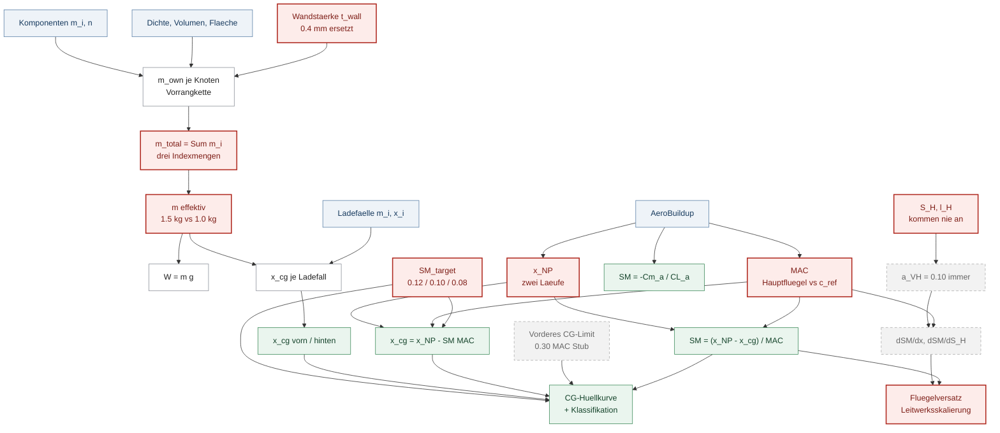
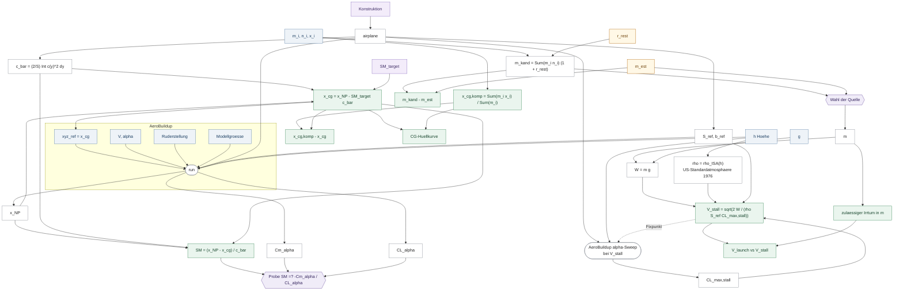

## 1. Warum dieser Pfad zuerst

Er liegt **stromaufwärts von allem anderen.** Die Masse geht in jede veröffentlichte
Geschwindigkeit ein, der Schwerpunkt in jede Stabilitätsaussage, und beide in die Frage,
wo der Flügel sitzen muss.

Bei der Freigabe von Pfad 1 habe ich `aircraft-mass` als Eingangsgröße abgehakt, ohne den
Erzeuger zu prüfen. Die eigene Regel des Kanons — *eine Formel ist erst freigebbar, wenn
ihre Eingänge freigegeben sind* — war damit verletzt. Dieses Dokument holt das nach.

**61 kanonische Größen, 46 Formeln**, aus 110 Registerknoten zusammengezogen. 18 Knoten
stehen ausdrücklich außerhalb des Gerüsts, jeder mit typisierter Begründung.

### Was hier nicht als Befund gilt

Nach **ADR 0011** ist der Schwerpunkt ein **Auslegungsziel von oben**, keine Summe von
unten: Der Konstrukteur wählt die Stabilitätsreserve, der Schwerpunkt folgt daraus. Kein
Flugzeug in der Datenbank ist detailliert genug für eine Komponenten-CG-Rechnung, und das
ist der normale Zustand eines iterativen Entwurfs.

*„Der Komponentenbaum hat keine Positionen"* ist deshalb **kein Fund**, sondern eine
Beschreibung, wo die Iteration gerade steht.

---

## 2. Der Pfad



\statusbad{} rot: eine Größe mit auseinandergelaufenen Kopien oder verletzter
Vorbedingung. Grau gestrichelt: erreicht die Physik nie.

Die Kette hat drei Stränge, die erst ganz rechts zusammenlaufen: **Masse** aus dem
Komponentenbaum, **Aerodynamik** aus dem Solver, **Ladefälle** aus den Gewichtsposten. Der
vierte Strang — die Korrekturvorschläge unten — hängt an Leitwerksgeometrie, die den
Dienst nie erreicht.

---

## 3. Die Kette im Einzelnen

### 3.1 Vom Bauteil zur Masse

**`node-own-weight-precedence`** · `rating` · Vorrangkette
`m_own = erster definierter Wert aus [ Handeingabe, Katalogmasse, CAD-Masse ]`

Kein Naturgesetz, sondern eine **Reihung nach Direktheit** — Sadraey §10.4 ordnet die
Gewichtsquellen so: gemessene und veröffentlichte Daten vor Volumen × Dichte. Die
Freigabefrage lautet hier nicht *„stimmt die Formel"*, sondern *„ist das deine Reihung"*.

**`cad-shape-mass-from-density`** · `law` · \statusmid{} PARTIAL
`m = ρ · V · k_scale`, mit `V = V_solid` oder `V = A · t_wall`

Sadraey §10.4, Quelle 1: Masse = Volumen × Dichte, mit dem dimensionslosen Dichtefaktor
`K_ρ` — hier `node-scale-factor` — der Infill, Stützen und Extrusionsfehler aufnimmt.

> \statusbad{} **`t_wall` wird still durch 0,4 mm ersetzt**, wenn der Materialdatensatz
> keine Druckauflösung führt. 0,4 mm ist **eine** Extrusionsbahn an einer 0,4-mm-Düse;
> reale Schalen auf diesem Projekt haben zwei bis drei Perimeter. Die Schalenmasse ist
> linear in `t_wall`, also ist die Masse um **Faktor 2 bis 3 zu niedrig** — und sie wandert
> in die `mass`-Annahme und von dort in jede Geschwindigkeit. Keine Quelle, keine
> Deklaration (ADR 0020).

**`mass-sum`** · `law` · \statusok{} SOURCED · `duplicate`, Kopien stimmen überein
`m_total = Σ m_i` über eine **erklärte Indexmenge**

Sadraey §11.2 Gl. (11.1)–(11.3): `ΣW_i = W_TO`, aufgeschlüsselt nach Baugruppen.
Maßstabsurteil: **validiert** — eine Summe ist skalenfrei.

> \statusbad{} **Drei Indexmengen, nie abgeglichen.** Der Komponentenbaum summiert alle
> Wurzelknoten und schreibt die `mass`-Annahme; der Ladefall-Dienst summiert die
> Gewichtsposten nach Schaltern und Übersteuerungen als CG-Nenner. Beide stehen für „die
> Masse des Flugzeugs" und können beliebig auseinanderliegen — nichts vergleicht sie.
>
> Und die eigentliche Gefahr ist nicht die Arithmetik, sondern die **Vollständigkeit**:
> `get_aircraft_total_weight_kg` liefert `None` nur für einen *leeren* Baum, nie für einen
> unvollständigen. Eine Summe über eine Teilmenge ist eine wohlgeformte Zahl. Sadraey §11.2
> und Scholz verlangen beide, eine noch nicht detaillierte Gruppe zu **schätzen, nie
> wegzulassen**. Das Vollständigkeitssignal existiert — und die Summe fragt es nicht ab.

**`weight-force`** · `law` · \statusok{} SOURCED · `W = m · g`

Newton, und Sadraey §11.2 behandelt `W` und `m·g` ausdrücklich als austauschbar.
Maßstab: **validiert**, `g` schwankt weltweit unter 0,3 %.

---

### 3.2 Vom Solver zur Stabilitätsreserve

**`static-margin`** · `law` · \statusok{} SOURCED · `duplicate`, **Kopien auseinander**
`SM = (x_NP − x_cg) / c̄`

Sadraey §11.6.2 Gl. (11.18). Maßstab: **validiert bei 0,5–15 kg** — die RC-Quellen
benutzen dieselbe Beziehung wörtlich, in derselben dimensionslosen Form. *Die Definition
importiert keinen Maßstab; jedes Maßstabsproblem dieser Kette sitzt in den Eingängen.*

> \statusbad{} **Vier lebende Erzeuger** derselben Zahl, mit verschiedenen Beziehungen und
> verschiedenen Eingängen. Dazu ein fünfter Anzeigepfad, der das **Ziel** als erreichten
> Wert beschriftet.

**`static-margin-from-derivatives`** · `law` · \statusok{} SOURCED
`SM = −C_mα / C_Lα`

Der Ableitungsweg. **Algebraisch äquivalent — aber nur**, wenn beide Ableitungen um
denselben Momentenbezugspunkt genommen werden und die Auftriebskurve dort linear ist. Hier
stammen sie aus einer Trimmlösung an einem beliebigen Betriebspunkt, während die
geometrische Form den Reiseflug-Neutralpunkt benutzt.

**`cg-from-static-margin`** · `law` · \statusok{} SOURCED
`x_cg = x_NP − SM · c̄`

Dieselbe Gleichung, invertiert — und **die eigentliche Konstruktion nach ADR 0011**: Erst
den Neutralpunkt schätzen, dann den Schwerpunkt um die gewählte Reserve davor legen. Genau
das schreiben die RC-Quellen vor. Maßstab: **validiert**.

**`mean-aerodynamic-chord`** · `law` · \statusok{} SOURCED · `duplicate`, **auseinander**
`c̄ = (2/S)·∫ c(y)² dy`

Scholz *07_WingDesign* §7.1. Maßstab: **vollständig validiert** — reine Geometrie, kein
Reynolds, keine Masse.

> \statusbad{} **Zwei mittlere aerodynamische Flügeltiefen**: die des Hauptflügels und die
> Referenzsehne des Solvers. Damit liegt jede mit der einen normierte Stabilitätsreserve
> auf **einer anderen Skala** als jede mit der anderen normierte.

**`neutral-point`** · `procedure` · \statusmid{} PARTIAL · `duplicate`, **auseinander**

Beziehung belegt (Sadraey §11.6.2 Gl. 11.17), **Methode nicht bei RC-Maßstab validiert**.
Zwei AeroBuildup-Läufe, zwei Neutralpunkte, beide veröffentlicht — und die Abweichung ist
**im Code selbst dokumentiert**.

---

### 3.3 Die Ziel-Stabilitätsreserve

**`target-static-margin`** · `rating` · \statusmid{} PARTIAL · `duplicate`, **auseinander**

Ein reiner Auslegungswert; wird nie berechnet. Der **Begriff** ist überall belegt — Sadraey
§11.6.2, Lennon Kap. 6, die RC-Missionstabelle.

> \statusbad{} **Vier Vorgabewerte für einen Parameter:** `0.12` in jedes neue Flugzeug
> gesät · `0.08` vom Ladefall-Dienst ersetzt, wenn die Zeile fehlt · `0.10` als
> Funktionsvorgabe der Korrekturvorschläge · `0.075` im Docstring. **Ein Flugzeug ohne
> gespeicherte Zeile bekommt ein anderes Auslegungsziel, je nachdem welcher Dienst fragt.**

> \statuswarn{} **Und der Wert selbst liegt außerhalb der RC-Bandbreite für jede Mission
> außer einer.** Die missionskonsistente Tabelle (% MAC): Trainer 5/10/15 · Sport 3/4/5 ·
> Kunstflug 0/1,5/3. Der gesäte Vorgabewert von **12 %** liegt am oberen Rand des Trainers
> und **über** allem, was für Sport und Kunstflug vorgesehen ist. ADR 0023.

---

### 3.4 Der Korrekturzweig — und warum er nichts misst

**`alpha-vh`**, **`dsm-dx-wing`**, **`dsm-dsh`** → **`wing-shift-lever`**,
**`htail-chord-scale`**

Aus diesen Formeln entsteht die Empfehlung *„verschiebe den Flügel 34 mm nach hinten"* oder
*„skaliere die Leitwerkstiefe um 12 %"*.

> \statusbad{} **Die Leitwerksgeometrie erreicht den Dienst nie.** `sm_sizing_service`
> liest `s_h_m2` und `l_h_m` aus dem Annahmenkontext; **niemand schreibt sie dorthin.** Die
> einzige Zuweisung steht in `tail_sizing_service`, in dessen eigenes Rückgabeobjekt.
>
> Folge auf jedem realen Flugzeug: `a_VH` liefert immer den Rückfallwert **0,10**, der
> Momentenarm ist immer **2,0 × MAC**, die Leitwerksfläche **0,08 m²**. Ein kompakter
> Pusher und ein Langrumpfsegler bekommen dieselben Annahmen — und daraus eine
> millimetergenaue Empfehlung.
>
> Die Tests setzen `ctx["s_h_m2"] = 0.08` **selbst** und prüfen damit genau den Zweig, den
> die Produktion nie erreicht. → **gh-1145**

Dazu die eigene Sicherung des Moduls: `_MAX_X_WING_SHIFT_MAC = 5.0`, ausdrücklich als
*safety clip* kommentiert — und **nirgends referenziert**. Die Inversion
`Δx = ΔSM / (∂SM/∂x)` ist erster Ordnung; die Klemme existiert, weil die Steigung über
einen beliebigen Versatz nicht konstant bleibt (ADR 0021).

---

### 3.5 Die CG-Hüllkurve

**`cg-envelope-containment`**, **`cg-envelope-classification`**

> \statusna{} **Das vordere Grenzlimit ist immer der 0,30·MAC-Ersatzwert.**
> `elevator_authority_service` liest Annahmezeilen namens `x_np`, `mac`, `v_cruise`,
> `stall_alpha` — die niemand schreibt. Jeder Aufruf wirft, bevor Physik läuft. Der Ersatz
> ist damit nicht der Rückfall, sondern der **einzige Erzeuger**. → **gh-1132**

---

## 4. Herkunftsbilanz

| | Formeln |
|---|---|
| \statusok{} **SOURCED** — spezifische Zitation | **13** |
| \statusmid{} **PARTIAL** — Methode belegt, Wert oder Maßstab nicht | **22** |
| \statusbad{} **NO SOURCE FOUND** | **11** |

Die elf ohne Quelle sind **fast durchweg Rückfallwerte und Schwellen**: 0,4 mm Wandstärke,
1,0 kg Ersatzmasse, 0,0 m Ersatz-Schwerpunkt, 0,08 m² Leitwerk, der 0,30-MAC-Ersatz, die
Klassifikationsgrenzen.

Das ist ein Muster und keine Nachlässigkeit: **Was hergeleitet ist, hat eine Quelle. Was
eingesprungen ist, hat keine.** Der Kanon macht genau diese Trennung sichtbar, weil er nach
der Quelle jeder einzelnen Größe fragt und nicht nach der des Verfahrens.

---

## 5. Die zehn Duplikate

| Größe | Kopien einig? | |
|---|---|---|
| `mass-sum` | ja | drei Indexmengen, gleiche Arithmetik |
| `cg-aggregate` | ja | |
| `sm-elevator-authority-limit` | ja | 0,30 ersetzt eine Physik, die nicht läuft |
| `base-mass-fallback` | **nein** | 1,5 kg gesät gegen 1,0 kg im Ladefall-Dienst |
| `base-cg-x-fallback` | **nein** | 0,15 m gegen **0,0 m** — der Nasenbezugspunkt |
| `target-static-margin` | **nein** | 0,12 / 0,10 / 0,08 |
| `static-margin` | **nein** | vier lebende Erzeuger |
| `neutral-point` | **nein** | zwei Solverläufe, beide veröffentlicht |
| `mean-aerodynamic-chord` | **nein** | zwei Sehnen, zwei Skalen |
| `predicted-sm-after-lever` | **nein** | die Vorderleitwerks-Variante widerspricht den anderen |

**Sechs von zehn sind auseinandergelaufen.** Ein Duplikat mit einigen Kopien ist
Wartungsschuld; eines mit auseinandergelaufenen ist ein Defekt mit wartender Reproduktion.

---

## 6. Verletzte Vorbedingungen

Aus einem **eigenen Durchgang** erhoben — sechs Agenten, je eine Quelldatei, mit der Regel
*„VERLETZT nur mit konkreter Reproduktion, sonst UNBEKANNT"*. Ergebnis: 18 Vorbedingungen,
**11 verletzt, alle 11 mit Reproduktion**, 3 unbekannt, 4 gehalten.

| Formel | Eingabe | bricht wann |
|---|---|---|
| `tail-efficiency-factor` | `S_H` | auf **jedem** realen Flugzeug — der Schlüssel wird nie geschrieben |
| `sm-sensitivity-htail-area` | `l_H` | ebenso; immer 2,0 × MAC |
| `lever-from-sm-shortfall` | `ΔSM` | Δx über der eigenen 5·MAC-Klemme, die nicht angeschlossen ist |
| `cg-from-static-margin` | `cg_stability_fwd_m` | der Ersatzwert überschreibt ein berechnetes Limit |
| `mass-weighted-cg` | Komponenten | leere Gewichtspostenliste bei aktiven Übersteuerungen |
| `sm-severity-classification` | `target_sm` | `target_sm > 0,20` — dann bewertet die Klassifikation den eigenen Zielpunkt als Fehler |
| `mass-sum` | `m_own` | CAD-Knoten ohne Material trägt still 0 g bei |
| `weight-force` | `m` | `m ≤ 0` ist über die Schema-Validierung erreichbar |
| `static-margin-percent` | `SM` | Momentenbezugspunkt ist nicht der Schwerpunkt |
| `stability-class` | `SM %` | dieselbe Ursache |
| `static-margin-from-derivatives` | `C_mα`, `C_Lα` | Betriebspunkt ohne `xyz_ref` |

Drei davon — die letzten drei — haben **eine gemeinsame Wurzel**: Der Momentenbezugspunkt
ist voreingestellt der Ursprung, nicht der Schwerpunkt. Gemessen: **27 von 29 Flugzeugen
tragen `xyz_ref = [0,0,0]`.**

---

## 7. Was das für die Freigabe heißt

**Freigebbar, sobald gelesen** — Beziehung exakt, Quelle spezifisch, Maßstab validiert:
`weight-force` · `static-margin` · `cg-from-static-margin` · `mean-aerodynamic-chord` ·
`mass-sum` · `scenario-cg` · `cg-envelope-containment` · `sm-shortfall`.

**Erst nach einer Entscheidung:** `target-static-margin` — der gesäte Vorgabewert von 12 %
liegt außerhalb der RC-Bandbreite für Sport und Kunstflug. Das ist deine Wahl, nicht meine.

**Nicht freigebbar, solange die Vorbedingung verletzt ist:** der gesamte Korrekturzweig.
Eine Formel, deren Eingänge den Dienst nie erreichen, kann kein Orakel sein.

Die Reihenfolge bleibt die des Kanons: **erst die Eingänge, dann die Formel.** In dieser
Kette heißt das — Massensumme und mittlere Flügeltiefe vor der Stabilitätsreserve, und die
Stabilitätsreserve vor allem, was daraus einen Schwerpunkt ableitet.

---

## 8. Wie der Pfad aussähe, wenn er stimmte

Derselbe Rechenweg **ohne verletzte Vorbedingung, ohne stille Ersatzwerte, ohne doppelte
Autorität** — und mit den beiden Dingen, die ein reiner Erzeugergraph nicht zeigen kann:
**wo der Konstrukteur entscheidet**, und **welche Kanten zu ihm zurücklaufen** statt weiter
zur nächsten Formel.

**Die Differenz zwischen Abschnitt 2 und diesem Graphen ist die Arbeitsliste.**

### Drei Quellenarten, nicht eine

| Art | wer setzt sie | Beispiel |
|---|---|---|
| **Entwurfswahl** | die Mission schlägt vor, du überschreibst | `SM_target`, `g_limit` |
| **zweiquellig** | Schätzung *und* Kandidat existieren, **du schaltest** | `mass` |
| **gerechnet** | ein Erzeuger, keine Wahl | `x_NP`, `MAC`, **`cg_x`** |

**`cg_x` ist keine Schätzung.** Du gibst die Stabilitätsreserve vor — über die Mission oder
durch Überschreiben in den Annahmen — und der Schwerpunkt folgt daraus:
`x_cg = x_NP − SM_target · MAC`. Das ist ADR 0011, und die Datenbank bestätigt es
ausnahmslos:

```
cg_x    CALCULATED   27 von 27      nie geschätzt
mass    ESTIMATE     27 von 27      nie aus dem Baum übernommen
```

Der aus Komponenten gerechnete Schwerpunkt ist deshalb **keine zweite Quelle**, sondern
eine **Vergleichsgröße**: Er sagt dir, wie weit deine Bauteilverteilung vom Auslegungsziel
abliegt — und ob du mit dem Akku oder mit Blei nachhelfen musst.

Die Asymmetrie hat eine Nebenwirkung: `estimate_value` ist im Schema nicht optional, also
trägt `cg_x` einen Schätzwert (0,15 m), der **nie aktiv wird**. Die Zweiquelligkeit ist auf
eine Größe angewandt, die in diesem Entwurfsverfahren keine ist.

### Eine Schätzung ist kein Fehlerzustand

Der Sollgraph hat weiterhin Schätzwerte, und er hat sie **absichtlich**. Was er nicht hat,
sind *stille* Schätzungen: Jeder eingesprungene Wert deklariert sich, und der Restanteil
für alles, was man nicht einzeln wiegt, ist eine **erklärte Größe** statt eines Lochs in
der Summe.



### Der Solver und seine Vorbedingungen

Der Neutralpunkt ist eine **Rechengröße, der du vertraust**. Damit dieses Vertrauen einen
Gegenstand hat, steht der Solver mit **allen seinen Eingaben** im Graphen: Was er liefert,
ist nur so gut wie das, was er bekommt — und das ist die einzige Stelle, an der diese
Anwendung an dieser Rechnung überhaupt etwas falsch machen kann.

**Die Referenzgrößen sind keine eigene Eingabe.** Sie folgen aus der Geometrie, und die
Geometrie folgt aus deiner Konstruktion. Die Kette lautet:

```
Konstruktion  →  Geometriemodell  →  S_ref, b_ref, c_ref  →  Solver
```

Daraus folgt etwas, das den Graphen vereinfacht: **`MAC` ist eine Geometriegröße, keine
Solver-Ausgabe.** Sie wird aus der Konstruktion gerechnet, als `c_ref` übergeben — und
zurückgelesen werden muss sie nie. Damit gibt es genau eine mittlere Flügeltiefe, und die
Frage „welche der beiden gilt" stellt sich im Soll gar nicht mehr.

Der Solver liefert entsprechend nur, was er wirklich erzeugt: `x_NP` und die Ableitungen.

Eine Eigenschaft davon ist wichtig und nicht offensichtlich: **`x_NP` ist unabhängig vom
Momentenbezugspunkt** — der Neutralpunkt ist eine Eigenschaft des Flugzeugs. `C_mα`
dagegen **ist** bezugsabhängig. Deshalb hängt die Stabilitätsreserve aus dem
Ableitungsweg an `xyz_ref`, die aus dem geometrischen Weg nicht. Genau das prüft die
Rechenwegprobe.

Lila: was du vorgibst. Gelb: ein deklarierter Schätzwert. Rauten: eine Wahl oder eine
Probe — beide erzeugen keinen Wert. Grün: was herauskommt.

**`CL_max,stall` ist keine Eingabe** — und der Zusatz gehört in den Namen. Bei niedriger
Reynoldszahl ist der maximale Auftriebsbeiwert **geschwindigkeitsabhängig**; ein blankes
`CL_max` verschweigt, bei welchem Zustand es gilt.

Daraus folgt eine Benennungsregel, die über diesen Knoten hinausgeht:

> **Eine reynoldsabhängige Größe trägt die Bedingung, bei der sie ermittelt wurde, im
> Namen.**

Sie ist das Gegenstück zur Vorbedingung: Was die Vorbedingung fordert, macht der Name
sichtbar. Und sie hätte den Fehler allein aufgedeckt — die App bildet heute das Maximum
über das ganze Geschwindigkeitsgitter, also `CL_max,v_max`, und setzt es dort ein, wo
`CL_max,stall` stehen müsste. Unter zwei verschiedenen Namen fällt das beim Lesen auf.
Unter einem nicht.

Es folgt aus dem Profil und dem Flügel — ein Anstellwinkel-Sweep durch den Solver, dessen
Spitzenwert. Damit steht im Graphen die Abhängigkeit, die Pfad 1 als Vorbedingung gefunden
hat:

```
V_stall braucht CL_max        CL_max gilt bei einer Reynoldszahl
CL_max muss bei V_stall gelten   Re folgt aus V_stall
```

**Ein Fixpunkt**, gestrichelt gezeichnet. Er ist der Grund, warum die heutige Rechnung um
den Faktor liegt, den wir über die Flotte gemessen haben: Median +2,9 %, im schlimmsten
Fall +33 %, und immer in die unsichere Richtung. Ein Graph, der `CL_max` als Eingabe
zeichnet, verbirgt genau das.

**`rho` ist keine Eingabe.** Sie folgt aus der Höhe über die Standardatmosphäre — du gibst
höchstens `h` an. Damit gibt es genau **eine** Höhe im Graphen, und sie speist beides: die
Atmosphäre des Solvers und die Dichte in der Abrissgeschwindigkeit.

Das ist im Soll eine Selbstverständlichkeit und im Ist nicht: Heute bekommt der Solver
seine Dichte aus der übergebenen Höhe, während die V-n-Kurve mit dem Literal 1,225 rechnet.
Zwei Dichten für einen Flugzustand.

### Was dieser Graph zeigt und was nicht

Er zeigt **Rechenwege**. Dass an einer Stelle gewählt wird, gehört dazu — die Wahl der
Massenquelle ist Teil der Rechnung, denn von ihr hängt jede Zahl danach ab.

Er zeigt **nicht**, wie du wählst. Baumstatus, Grün und Rot, was dir beim Nachschärfen
hilft: eine andere Ebene, und sie würde diesen Graphen unlesbar machen, ohne die Frage zu
beantworten, für die er da ist.

Was er dafür zeigen muss, sind die **Werte, die du für die Entscheidung brauchst** — und
die sind selbst Rechenergebnisse:

| Entscheidung | Werte, die sie stützen |
|---|---|
| Baumsumme oder Schätzung | `m_kand − m_est` |
| Akku verschieben oder Blei | `x_cg,komp − x_cg` |
| trägt der Entwurf | CG-Hüllkurve, `V_launch` gegen `V_stall` |
| rechnet der Solver richtig | die Probe |

Vier Größen, vier Kästen, alle grün. Der Weg von dort zu deiner Entscheidung steht
absichtlich nicht im Bild.

### Warum die Formeln in den Kästen stehen

Ein Gesetz wird über **Formel und Eingänge** freigegeben. Ein Graph, der nur Namen zeigt,
ist deshalb nicht freigebbar — man sieht nicht, ob alle Vorbedingungen da sind.

Daraus folgt eine Regel, die zugleich maschinell prüfbar ist:

> **Jedes Symbol in einer Formel hat eine eingehende Kante, und der Quellknoten trägt
> dasselbe Symbol.**

Ein Symbol ohne Kante ist ein unbelegter Eingang. Eine Kante auf ein Symbol, das in keiner
Formel vorkommt, ist eine Beziehung, die niemand nutzt. Beides fällt beim Zeichnen auf und
nicht erst beim Lesen des Codes — und beides lässt sich als Prüfung schreiben.

Der Graph wird dadurch größer. Er wird aber erst dadurch das, was er sein soll.

### Was die Rückkanten sagen

Sie sind der Grund, warum dieser Pfad keine Fließbandrechnung ist. Sechs Stück, und keine
davon speist eine Formel:

| Rückkante | beantwortet |
|---|---|
| Baumstatus | wo lohnt es sich, die Schätzung zu verfeinern |
| `divergence` Masse | wie weit liegt die Komponentensumme von meiner Schätzung |
| Abstand des Komponenten-Schwerpunkts | wie weit liegt meine Bauteilverteilung vom Auslegungsziel — Akku verschieben oder Blei |
| Hüllkurve | hält der Entwurf, wenn die Ladung wandert |
| Massenachse / Handstart | **wie weit darf ich mich verschätzt haben, bevor es am Boden bleibt** |
| Rechenwegprobe | rechnet der Solver um den richtigen Punkt |

Der Baumstatus ist dabei ausdrücklich **kein Tor**. Er verweigert keine Zahl — er zeigt,
wo die nächste Verfeinerung am meisten bringt. Ihn als Prüfregel zu lesen hieße, dem
Werkzeug zu erlauben, eine Zahl abzulehnen, die du bewusst als vorläufig annimmst.

### Was sich gegenüber heute strukturell ändert

| heute | im Soll | warum |
|---|---|---|
| `SM` aus vier Erzeugern | eine Formel, der Ableitungsweg wird **Probe** | zwei Wege zu einer Größe sind ein Test, keine zweite Wahrheit |
| `SM_target` und `SM` gleich benannt | **getrennte Größen** — Vorgabe gegen Nachprüfung | eine wird gesetzt, die andere gemessen |
| `x_NP` aus zwei Läufen | eine Autoritaet | ADR 0022 |
| `CL_max` ohne Bedingung im Namen | **`CL_max,stall`** | ein blanker Name lässt `CL_max,v_max` und `CL_max,stall` gleich aussehen |
| `CL_max` als Maximum über das ganze Geschwindigkeitsgitter | **bei `V_stall` ausgewertet**, iterativ | gemessen: Median +2,9 %, schlimmstenfalls +33 %, stets zu niedrige Abrissgeschwindigkeit |
| `rho` einmal aus der Höhe, einmal als Literal 1,225 | **eine** Atmosphäre aus **einer** Höhe | der Solver bekommt sie aus `h`, `V_stall` aus einer Konstanten — zwei Dichten für einen Flugzustand |
| MAC zweimal — gerechnet und aus dem Solver zurückgelesen | **eine** MAC aus der Geometrie, als `c_ref` übergeben, nie zurückgelesen | die Rückgabe ist die eigene Eingabe; zwei Werte kann es nur geben, wenn etwas Inkonsistentes hineingeht |
| `SM_target` viermal vorgegeben | einmal, **aus der Mission** | 12 % passt zum Trainer, nicht zu Sport oder Kunstflug |
| `m` mit 1,5 / 1,0 kg | ein Vorgabewert an einer Stelle | zwei Antworten auf eine fehlende Eingabe |
| `t_wall` still 0,4 mm | aus dem Materialsatz, sonst **Warnung** | Schalenmasse ist linear darin |
| unauflösbarer Knoten trägt 0 g | fällt in den **erklärten Restanteil** | ein Loch in der Summe ist unsichtbar, ein Restanteil nicht |
| Komponentensumme *ist* die Masse | Summe ist ein **Kandidat**, du schaltest | ADR 0010 |
| `cg_x` als zweiquellige Größe geführt | **gerechnet aus `SM_target`**, keine Schätzung | ADR 0011 — du gibst die Reserve vor, nicht die Lage |
| `S_H`, `l_H` erreichen den Dienst nie | echte Geometrie erreicht ihn | sonst misst der Korrekturzweig nichts |
| `a_VH` immer 0,10 | je Flugzeug gerechnet | 0,10 ist ein Platzhalter |
| vorderes CG-Limit = 0,30·MAC | aus der Ruderautorität | der Ersatz ist heute der einzige Erzeuger |
| `xyz_ref` = Ursprung | `xyz_ref := x_cg` | sonst ist die Reserve keine Reserve |
| **Hüllkurve nur über den Schwerpunkt** | **Massenachse dazu** | die Frage lautet *wie weit darf ich irren*, nicht *ist es exakt* |

### Was gleich bleibt

Der Schwerpunkt wird **von oben abgeleitet**, nicht von unten summiert. Die
Komponentensumme bleibt eine Vergleichsgröße. Der Ladefall bleibt ein eigener Strang mit
eigener Indexmenge — nur unter eigenem Namen, statt ebenfalls „die Masse des Flugzeugs" zu
heißen. Und das Blei wird weiterhin **gewogen, nicht gerechnet**.
