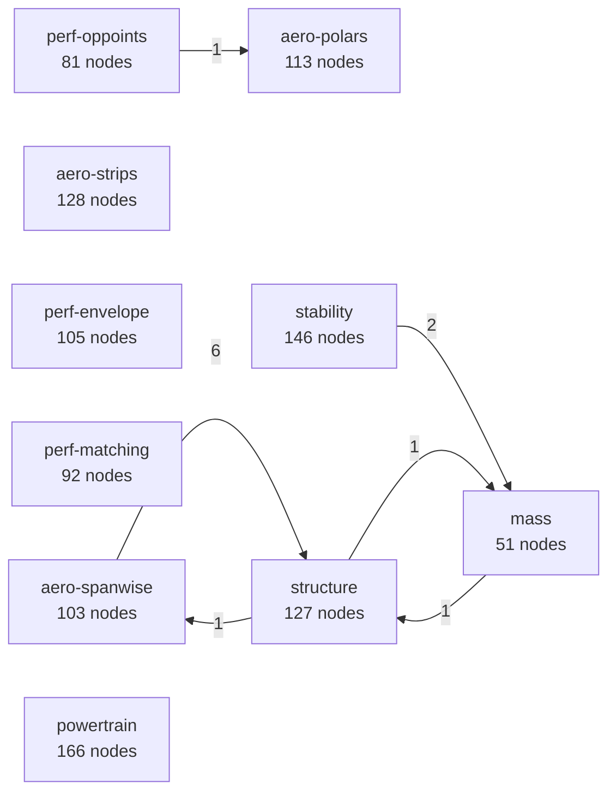

# The graph at cluster level

> Each box is a calculation domain; each arrow is *at least one quantity* computed in one
> domain and consumed in another. These crossings are where a defect travels furthest and
> where a fachlicher test has the most to say.

## Reading it

An arrow from **mass** to **performance** means a mass quantity feeds a performance one:
a wrong component-tree roll-up moves every published speed. That is the kind of statement
the graph is for — and the kind a unit test on either side alone cannot make.

Per-cluster detail: [[_index-aero-polars|aero-polars]] · [[_index-aero-spanwise|aero-spanwise]] · [[_index-aero-strips|aero-strips]] · [[_index-mass|mass]] · [[_index-perf-envelope|perf-envelope]] · [[_index-perf-matching|perf-matching]] · [[_index-perf-oppoints|perf-oppoints]] · [[_index-powertrain|powertrain]] · [[_index-stability|stability]] · [[_index-structure|structure]]

Mechanical observations across the whole corpus: [[findings]].
