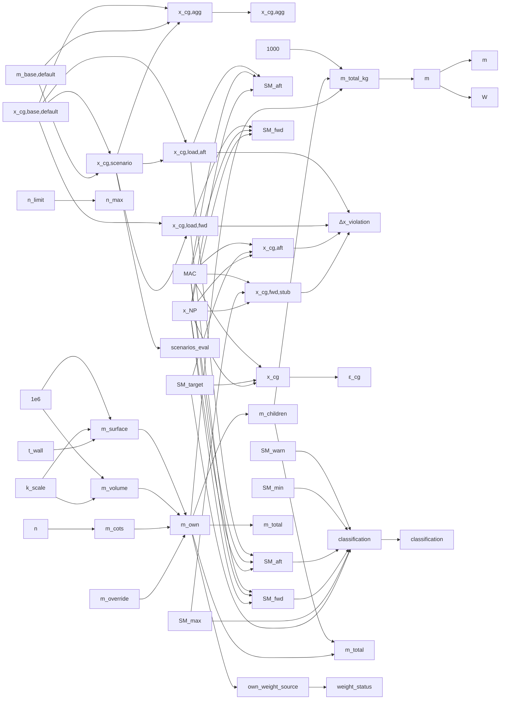

# mass

> 51 nodes · generated from the 2026-08-18 extraction. See [[README|the format and its rules]].

## Cross-cutting findings reported by the extraction

🟡 *Not independently verified — treat as leads, not verdicts.*

```text
REPO ROOT (all producer_file paths are relative to it): /Users/szymanski/Projects/da3Dalus/cad-modelling-service

SCOPE NOTE. The three files were read in full. This extraction covers the MASS & BALANCE cluster: component-tree weight roll-up, the mass design assumption, CG (design/aggregate/scenario), static margin, and the loading + stability CG envelopes. Deliberately excluded as belonging to other clusters (aero/performance/polar), even though they live in the same files: the AeroBuildup sweeps and CL_max/CD0 extraction (assumption_compute_service.py:1055-1210), the parabolic-polar fit and its rejection gates (:1417-1694), Oswald-e provenance chain (:240-262, :1390-1414), the V-speed set V_stall/V_md/V_min_sink/V_max/V_a/V_dive (:1758-2000, :924-956), the Reynolds-dependent polar table (:402-456), the Picard iteration (:2026-2085), the landing-field-length energy balance and LANDING_SURFACE_MU (:1778-1848), CL_alpha/alpha_0 extraction (:1213-1313), and the gh-935 turbulator ΔCD0 injection (:2099-2241). component_tree_service.py CRUD/tree-building/auto-sync functions are plumbing, not calculation, and were excluded except where they set a quantity that feeds a weight (servo quantity=2).

CROSS-CLUSTER COUPLING WORTH FLAGGING TO THE NEXT STAGE:
1. mass-effective feeds V_stall, V_md, V_min_sink, V_max and w_min — every published speed. A wrong component-tree roll-up silently moves the whole speed chip row.
2. The landing-field-length formula (assumption_compute_service.py:1812-1846) is documented as mass-independent ("The mass cancels"), but it calls _stall_speed(mass_kg, ...) at line 1833, so mass does enter through V_S0. The docstring's claim is about the ground-roll energy balance only. Not recorded as an anomaly because it is a docstring nuance, not a defect — but a reviewer reading only the docstring will get it wrong.

ADR 0023 (RC/UAV-scale validation) OBSERVATIONS, offered as context rather than as `anomaly` fields because a cited source is present:
- The SM classification band 0.02 / 0.20 / 0.30 cites "Scholz §4.2" and "Anderson §7.7". Both are transport/GA-category references. No RC/UAV (0.5-15 kg) validation is cited anywhere in loading_scenario_service.py, and CLAUDE.md's own authority table routes RC static-margin targets to /rc-aircraft-designer. Per ADR 0023 the constants need an RC-scale provenance note or an explicit "adopted from transport literature, unvalidated at RC scale" marker.
- PARAMETER_DEFAULTS['target_static_margin'] = 0.12 carries NO source comment at all (app/schemas/design_assumption.py:75), unlike its neighbours power_to_weight and battery_specific_energy_wh_per_kg which do cite ranges.
- print-resolution-default 0.4 mm and node-scale-factor ("empirical") are 3D-printing constants with no cited source.

SEARCHES THAT CAME BACK EMPTY (recorded so the next stage does not redo them):
- `_load_cg_agg` — definition only, zero call sites in app/, cad_designer/, scripts/ or tests.
- `scenarios_eval` — docstring + two assignments, zero readers.
- `compute_recommended_cg` — zero production callers; only app/tests/test_mass_cg_service.py:53/61/68.
- `/component-tree/{node_id}/weight` — no frontend fetch (grep for "/weight" in frontend/ excluding node_modules returned nothing) and no MCP tool; therefore WeightResponse.children_weight_g has no consumer.
- `ctx["sm_at_fwd"]` — no backend or frontend reader found; sm_sizing_service reads sm_at_aft / cg_forward_m / cg_stability_fwd_m only.

TYPE-CONTRACT MISMATCH (not a calculation, but it will bite): the backend CgEnvelopeRead declares cg_stability_fwd_m / cg_stability_aft_m / sm_at_fwd / sm_at_aft as `float | None` (app/schemas/loading_scenario.py:167-192) and get_cg_envelope really does return None before the first recompute, but frontend/hooks/useLoadingScenarios.ts:88-91 types all four as non-nullable `number` and LoadingScenariosCard.tsx:83-84 calls `.toFixed()` on them unconditionally. And frontend CgClassification (useLoadingScenarios.ts:83) omits the backend's "unknown" member.

THINGS I COULD NOT DETERMINE AND DID NOT GUESS:
- Where the value 0.4 mm print resolution originally came from: NO_SOURCE_FOUND (it appears in the alembic seed, component_type_service and component_tree_service independently, none with a citation).
- Whether node.scale_factor is intended to be applied before or after quantity: the code never combines them, so there is no observable intent. NO_SOURCE_FOUND.
- Whether the two mass writers (component_tree vs weight_items) are meant to be mutually exclusive per aeroplane: no code or comment states a precedence rule. NO_SOURCE_FOUND.
```

## Nodes

| node | kind | unit | user-visible | source | flags |
|---|---|---|---|---|---|
| [[base-cg-x-default\|Fallback base CG_x for scenario CG]] | constant | m | ✓ | 🟡 | anomaly, divergence |
| [[base-mass-default\|Fallback base mass for scenario CG]] | constant | kg |  | 🔴 | anomaly |
| [[cg-change-epsilon\|CG-change detection epsilon]] | constant | m |  | 🔴 | anomaly |
| [[grams-to-kg-divisor\|g → kg divisor]] | constant | dimensionless  |  | 🟡 |  |
| [[gravity-constant\|Gravitational acceleration]] | constant | m/s² |  | 🟢 | anomaly, divergence |
| [[mass--sm-heavy-nose-warn\|Static-margin heavy-nose warning limit]] | constant | fraction of MA | ✓ | 🟡 | anomaly, divergence, scale |
| [[mass--sm-unstable-limit\|Static-margin lower (unstable) limit]] | constant | fraction of MA | ✓ | 🟢 | anomaly, divergence, scale |
| [[mm3-density-to-grams-divisor\|mm³·(kg/m³) → g divisor]] | constant | dimensionless  |  | 🟡 |  |
| [[print-resolution-default\|Default print wall resolution]] | constant | mm |  | 🔴 | anomaly |
| [[servo-symmetric-quantity\|Symmetric servo quantity]] | constant | count | ✓ | 🟡 | divergence |
| [[sm-elevator-limit\|Static-margin elevator-authority limit]] | constant | fraction of MA | ✓ | 🟡 | anomaly, divergence, scale |
| [[target-sm-default-cg-envelope\|Target static margin fallback (CG envelope)]] | constant | fraction of MA | ✓ | 🟡 | anomaly, divergence |
| [[mass--g-limit\|Design load factor limit]] | parameter | g | ✓ | 🟢 | divergence, scale |
| [[node-quantity\|Node quantity]] | parameter | count | ✓ | 🟡 | anomaly, divergence |
| [[node-scale-factor\|Node weight scale factor]] | parameter | dimensionless | ✓ | 🟢 | anomaly, divergence, scale |
| [[target-static-margin\|Target static margin]] | parameter | fraction of MA | ✓ | 🟡 | anomaly, divergence |
| [[weight-override-g\|Manual node weight override]] | parameter | g | ✓ | 🟡 | anomaly, divergence |
| [[aircraft-total-weight-kg\|Aircraft total weight from component tree]] | quantity | kg | ✓ | 🟢 | anomaly, divergence |
| [[cad-shape-own-weight-surface\|CAD shape own weight — surface print]] | quantity | g | ✓ | 🟡 | anomaly, divergence |
| [[cad-shape-own-weight-volume\|CAD shape own weight — solid print]] | quantity | g | ✓ | 🟢 | anomaly, divergence |
| [[cg-agg\|Aggregate CG (default scenario)]] | quantity | m | ✓ | 🟢 |  |
| [[cg-agg-legacy-dead\|Legacy weight-item CG loader (dead)]] | quantity | m |  | 🟢 | anomaly, divergence |
| [[cg-agg-m-ctx\|Published aggregate CG (computation context)]] | quantity | m | ✓ | 🟢 |  |
| [[cg-classification-overall\|Overall CG-envelope classification]] | quantity | enum (dimensio | ✓ | 🟡 | anomaly, divergence |
| [[cg-envelope-violation-mm\|CG envelope violation distance]] | quantity | mm | ✓ | 🟡 | anomaly, divergence |
| [[cg-loading-aft\|Aft loading CG]] | quantity | m | ✓ | 🟢 | divergence |
| [[cg-loading-fwd\|Forward loading CG]] | quantity | m | ✓ | 🟢 | divergence |
| [[cg-stability-aft\|Aft CG stability limit]] | quantity | m | ✓ | 🟢 | anomaly, divergence |
| [[cg-stability-fwd-stub\|Forward CG stability limit (0.30·MAC stub)]] | quantity | m | ✓ | 🟡 | anomaly, divergence, scale |
| [[cg-x-design\|Design CG_x (aerodynamic CG target)]] | quantity | m | ✓ | 🟢 | anomaly, divergence |
| [[cots-node-own-weight\|COTS node own weight]] | quantity | g | ✓ | 🟢 | divergence |
| [[flight-envelope-n-max\|Design limit load factor (published)]] | quantity | g (dimensionle | ✓ | 🟢 | anomaly, divergence |
| [[mac\|Mean aerodynamic chord (main wing)]] | quantity | m | ✓ | 🟢 | divergence |
| [[mass-effective\|Effective aircraft mass]] | quantity | kg | ✓ | 🟢 | anomaly, divergence |
| [[mass-kg-ctx\|Published aircraft mass (computation context)]] | quantity | kg | ✓ | 🟢 |  |
| [[node-children-weight\|Node children weight (recursive)]] | quantity | g | ✓ | 🟢 | anomaly |
| [[node-own-weight\|Node own weight]] | quantity | g | ✓ | 🟡 | divergence |
| [[node-own-weight-source\|Own weight provenance]] | quantity | enum (dimensio | ✓ | 🔴 |  |
| [[node-total-weight-api\|Node total weight (single-node endpoint)]] | quantity | g | ✓ | 🟢 | anomaly, divergence |
| [[node-total-weight-rollup\|Node total weight (tree roll-up)]] | quantity | g | ✓ | 🟢 | anomaly, divergence |
| [[node-weight-status\|Node weight completeness status]] | quantity | enum (dimensio | ✓ | 🔴 |  |
| [[scenario-cg-x\|Loading-scenario CG_x]] | quantity | m | ✓ | 🟢 | anomaly, divergence |
| [[scenario-total-mass\|Loading-scenario total mass]] | quantity | kg |  | 🟢 | anomaly, divergence |
| [[scenarios-eval\|Per-scenario CG list]] | quantity | m (list) |  | 🟡 | anomaly, divergence |
| [[sm-at-aft-api\|Static margin at aft loading CG (API)]] | quantity | fraction of MA | ✓ | 🟢 | anomaly, divergence |
| [[sm-at-aft-ctx\|Static margin at aft loading CG (cached)]] | quantity | fraction of MA | ✓ | 🟢 | anomaly, divergence |
| [[sm-at-fwd-api\|Static margin at forward loading CG (API)]] | quantity | fraction of MA | ✓ | 🟢 | anomaly, divergence |
| [[sm-at-fwd-ctx\|Static margin at forward loading CG (cached)]] | quantity | fraction of MA | ✓ | 🟢 | anomaly, divergence |
| [[sm-classification\|Static-margin classification]] | quantity | enum (dimensio | ✓ | 🟡 | anomaly, divergence, scale |
| [[weight-force-n\|Weight force]] | quantity | N |  | 🟢 | anomaly, divergence |
| [[x-np\|Neutral point]] | quantity | m | ✓ | 🟢 | anomaly, divergence |

## Graph — user-visible quantities and what feeds them



