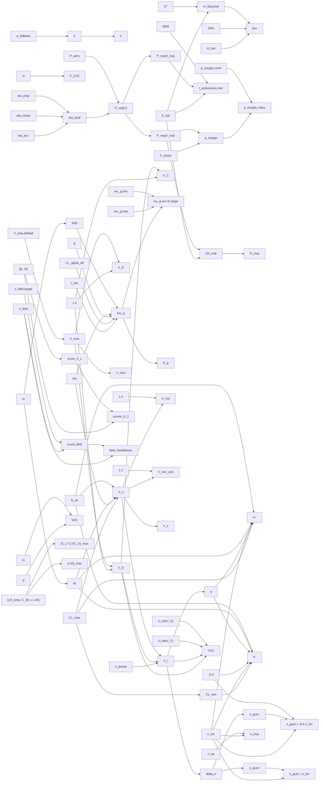

# perf-envelope

> 105 nodes · generated from the 2026-08-18 extraction. See [[README|the format and its rules]].

## Cross-cutting findings reported by the extraction

🟡 *Not independently verified — treat as leads, not verdicts.*

```text
Files: /Users/szymanski/Projects/da3Dalus/cad-modelling-service/app/services/{flight_envelope_service,endurance_service,mission_kpi_service}.py

Reach: all three reach the UI. flight_envelope -> app/api/v2/endpoints/aeroplane/flight_envelope.py + MCP tools (mcp_server.py:1247,1257) -> VnDiagram.tsx, PerformanceOverview.tsx, EnvelopePanel.tsx. endurance -> app/api/v2/endpoints/endurance.py -> EnduranceCard.tsx + lib/metricsAdapters.ts (toPowertrainItems, toPMarginGauge). mission_kpi -> app/api/v2/endpoints/aeroplane/mission_objectives.py:77 -> MissionRadarChart.tsx, AxisDrawer.tsx.

Cross-cutting findings, ranked:

1. Three gravity constants (9.81 fe:40, 9.80665 end:49, inline 9.81 mkpi:273) and three W/S producers. ADR 0022.
2. V_dive has three producers (fe:315, fe:523, assumption_compute_service:956); V_stall two (fe:314 vs assumption_compute_service._stall_speed -> ctx v_stall_mps/v_s1_mps). Both pairs are user-visible.
3. n_max has two producers: kpi_max_load_factor (fe:494) and mkpi_maneuver (mkpi:247 via ctx flight_envelope_n_max = g_limit). The mission axis ships the UI formula string "n_max from V-n diagram" which is false.
4. Dead branch: derive_performance_kpis looks up markers labelled "best_ld"/"min_sink"/"max_turn"; labels come from op.name and no code anywhere creates such names. The whole confidence="trimmed" tier is unreachable. Docstring also promises TRIMMED status filtering; marker.status is never read.
5. _load_operating_point_markers (fe:589) takes mass_kg and wing_area_m2 and uses neither; load factor is hardcoded 1.0.
6. Uncited magic numbers governing the envelope shape: 1.4 (V_D), -0.8 (CL_min), -0.4 (negative n), 28.0 (V_max default, declared twice). All NO_SOURCE_FOUND in-file.
7. CS-VLA/FAR-23 gust velocities (15.24 / 7.62 m/s) and the FAR-25 K_g regression are manned-aircraft constants applied unscaled to 0.5-15 kg. The code knows this - GustValidityWarning explicitly says RC/UAV commonly land at mu_g < 3 - but still emits gust lines. ADR 0023.
8. Undeclared fallbacks (ADR 0020): Helmbold CL_alpha substitution, bare `except Exception -> None` in _get_b_ref silently killing the gust envelope, scalar-cd0 fallback when the Re table is absent, 28.0 m/s V_max, 'trainer' preset substitution for an unknown mission id, cd0=0.03 inline default.
9. endurance warning text hardcodes "fallback e=0.8" even when a real fitted e was used and only the quality string was poor/unknown.
10. _check_battery_mass_consistency divides by a user-editable specific energy with no >0 guard -> ZeroDivisionError -> HTTP 500.
11. Endurance discharges 100 % of nameplate Wh (no DoD/reserve) and is sea-level only; neither is stated in the API description.
12. mkpi_context_hash is produced and typed on the client but read by nothing.
13. compute_endurance(db, aircraft) never uses db (end:208).

Citation quality: the gust block (NACA TN 2964 Pratt & Walker 1953, FAR-25.341(a)(2), CS-VLA.333(c)(1)/FAR-23.333(c)) is specific and checkable. _helmbold_cl_alpha cites two different Anderson books for one equation ("Anderson 6e Eq. 5.81" vs "Introduction to Flight, 6th ed., §5.3") - one is wrong. The efficiency defaults cite only names ("Drela/Hepperle", "Brushless outrunner", "Modern ESC") - not citations. P_MARGIN thresholds, 0.30 battery deviation, -0.8, -0.4, 1.4, 1.2, 28.0: NO_SOURCE_FOUND.
```

## Nodes

| node | kind | unit | user-visible | source | flags |
|---|---|---|---|---|---|
| [[end_battery_dev_threshold\|Battery-mass deviation threshold]] | constant | - | ✓ | 🔴 |  |
| [[end_cd0_inline_default\|Inline C_D0 default]] | constant | - |  | 🔴 | anomaly, divergence |
| [[end_eta_esc\|Default ESC efficiency]] | constant | - | ✓ | 🔴 |  |
| [[end_eta_motor\|Default motor efficiency]] | constant | - | ✓ | 🟡 | scale |
| [[end_eta_prop\|Default propeller efficiency]] | constant | - | ✓ | 🟡 | anomaly, divergence |
| [[end_fallback_e\|Oswald fallback]] | constant | - | ✓ | 🟡 | anomaly, scale |
| [[end_g\|Gravitational acceleration (endurance)]] | constant | m/s^2 |  | 🟢 | anomaly, divergence |
| [[end_p_margin_comfortable\|Comfortable power-margin threshold]] | constant | - | ✓ | 🔴 |  |
| [[end_rho\|Sea-level air density]] | constant | kg/m^3 |  | 🟢 | anomaly, scale |
| [[end_seconds_per_hour\|Wh-to-Ws conversion]] | constant | s/h |  | 🟢 |  |
| [[end_specific_energy\|Default pack specific energy]] | constant | Wh/kg | ✓ | 🟡 | anomaly, divergence |
| [[fe_cl_min_factor\|Negative CL_max ratio]] | constant | - |  | 🔴 | anomaly, divergence |
| [[fe_dive_factor\|Dive-speed factor]] | constant | - | ✓ | 🔴 | anomaly, divergence |
| [[fe_gravity\|Gravitational acceleration (flight envelope)]] | constant | m/s^2 |  | 🟡 | anomaly, divergence |
| [[fe_k_g_coeffs\|Pratt gust-alleviation coefficients]] | constant | - |  | 🟢 |  |
| [[fe_marker_load_factor\|Operating-point marker load factor]] | constant | g | ✓ | 🟢 | anomaly, divergence |
| [[fe_n_points\|V-n sampling resolution]] | constant | - |  | 🔴 | anomaly, divergence |
| [[fe_neg_g_factor\|Negative g-limit ratio]] | constant | - | ✓ | 🟡 | anomaly, scale |
| [[fe_rho_default\|Default air density (flight envelope)]] | constant | kg/m^3 |  | 🟢 | anomaly, divergence |
| [[fe_v_max_default\|Default maximum level speed]] | constant | m/s | ✓ | 🔴 | anomaly, divergence |
| [[gust_u_vc\|Design gust velocity at cruise speed]] | constant | m/s | ✓ | 🟢 | anomaly, scale |
| [[gust_u_vd\|Design gust velocity at dive speed]] | constant | m/s | ✓ | 🟢 | anomaly, scale |
| [[kpi_best_ld_heuristic\|Best-L/D heuristic factor]] | constant | - | ✓ | 🟡 | divergence |
| [[kpi_min_sink_heuristic\|Min-sink heuristic factor]] | constant | - | ✓ | 🟢 | scale |
| [[mkpi_gravity_inline\|Gravity (mission KPI, inline)]] | constant | m/s^2 | ✓ | 🟡 | anomaly, divergence |
| [[mkpi_soll_field_score\|Soll field-friendliness score]] | constant | - | ✓ | 🟢 | divergence |
| [[mu_g_max\|Pratt-Walker validity upper bound]] | constant | - | ✓ | 🔴 | divergence |
| [[mu_g_min\|Pratt-Walker validity lower bound]] | constant | - | ✓ | 🔴 | divergence |
| [[ctx_cl_alpha_per_rad\|Cached lift-curve slope]] | parameter | 1/rad |  | 🟢 |  |
| [[end_battery_component_mass\|Battery component mass]] | parameter | kg | ✓ | 🟢 | anomaly, divergence |
| [[end_capacity_wh\|Battery capacity]] | parameter | Wh | ✓ | 🟢 |  |
| [[end_mass\|Total aircraft mass (endurance)]] | parameter | kg | ✓ | 🟢 | divergence |
| [[end_motor_w\|Motor continuous power]] | parameter | W | ✓ | 🟢 | scale |
| [[fe_cl_max\|Maximum lift coefficient (envelope)]] | parameter | - | ✓ | 🟡 | scale |
| [[fe_g_limit\|Structural limit load factor]] | parameter | g | ✓ | 🟡 | divergence, scale |
| [[fe_mass\|Design mass (envelope)]] | parameter | kg | ✓ | 🔴 | scale |
| [[fe_v_max\|Maximum level speed]] | parameter | m/s | ✓ | 🟡 |  |
| [[mkpi_axis_ranges\|Mission axis ranges]] | parameter | varies | ✓ | 🟢 | anomaly, divergence |
| [[mkpi_mass\|Mass for wing loading]] | parameter | kg | ✓ | 🟢 | divergence |
| [[mkpi_target_field_length\|Target field length]] | parameter | m | ✓ | 🟢 |  |
| [[end_battery_deviation\|Battery-mass deviation]] | quantity | - | ✓ | 🔴 | divergence |
| [[end_battery_mass_predicted\|Capacity-implied battery mass]] | quantity | g | ✓ | 🟡 | anomaly, divergence |
| [[end_cd0_at_v\|Speed-specific C_D0]] | quantity | - |  | 🟢 | anomaly, divergence |
| [[end_cd_total\|Total drag coefficient]] | quantity | - |  | 🟢 | scale |
| [[end_cl\|Level-flight lift coefficient]] | quantity | - |  | 🟢 |  |
| [[end_confidence\|Endurance confidence]] | quantity | - | ✓ | 🟢 | anomaly, divergence |
| [[end_drag\|Drag force]] | quantity | N |  | 🟢 |  |
| [[end_e_at_v\|Speed-specific Oswald factor]] | quantity | - |  | 🟢 | divergence |
| [[end_e_oswald\|Resolved Oswald efficiency]] | quantity | - | ✓ | 🟡 |  |
| [[end_eta_total\|Total propulsion efficiency]] | quantity | - | ✓ | 🟡 | scale |
| [[end_k_induced\|Induced-drag factor]] | quantity | - |  | 🟢 |  |
| [[end_p_aero\|Aerodynamic power]] | quantity | W |  | 🟢 | divergence |
| [[end_p_margin\|Power margin]] | quantity | - | ✓ | 🟡 | anomaly, divergence |
| [[end_p_margin_class\|Power-margin classification]] | quantity | - | ✓ | 🔴 | divergence |
| [[end_p_req\|Battery power required]] | quantity | W | ✓ | 🟢 | anomaly, divergence |
| [[end_p_req_vmd\|Power required at V_md]] | quantity | W | ✓ | 🟢 |  |
| [[end_p_req_vmin\|Power required at V_min_sink]] | quantity | W | ✓ | 🟢 |  |
| [[end_q\|Dynamic pressure (endurance)]] | quantity | Pa |  | 🟢 |  |
| [[end_range_max\|Maximum range]] | quantity | m | ✓ | 🟡 | divergence |
| [[end_t_at_vmd\|Flight time at V_md]] | quantity | s |  | 🟡 | divergence |
| [[end_t_endurance_max\|Maximum endurance]] | quantity | s | ✓ | 🟡 | anomaly, divergence, scale |
| [[fe_aspect_ratio\|Aspect ratio (gust path)]] | quantity | - |  | 🟢 | anomaly, divergence |
| [[fe_b_ref\|Reference span]] | quantity | m |  | 🟢 | anomaly, divergence |
| [[fe_c_mgc\|Mean geometric chord]] | quantity | m |  | 🟢 | divergence |
| [[fe_cl_alpha_helmbold\|Finite-span lift-curve slope (Helmbold fallback)]] | quantity | 1/rad |  | 🟡 | anomaly, divergence |
| [[fe_cl_min\|Inverted maximum lift coefficient]] | quantity | - |  | 🔴 |  |
| [[fe_delta_n\|Gust load-factor increment]] | quantity | - |  | 🟢 | divergence |
| [[fe_effective_cl_alpha\|Effective lift-curve slope for gust]] | quantity | 1/rad |  | 🔴 | anomaly, divergence |
| [[fe_gust_critical_neg\|Negative gust-critical trigger]] | quantity | - | ✓ | 🟡 |  |
| [[fe_gust_critical_pos\|Positive gust-critical trigger]] | quantity | - | ✓ | 🟢 | scale |
| [[fe_gust_n_neg\|Negative gust load factor]] | quantity | g | ✓ | 🟢 | scale |
| [[fe_gust_n_pos\|Positive gust load factor]] | quantity | g | ✓ | 🟢 | scale |
| [[fe_gust_validity_warning\|Pratt validity warning]] | quantity | - | ✓ | 🟡 | divergence |
| [[fe_k_g\|Gust alleviation factor]] | quantity | - |  | 🟢 | scale |
| [[fe_mu_g\|Gust mass ratio]] | quantity | - | ✓ | 🟢 | scale |
| [[fe_n_neg_maneuver\|Negative maneuver load factor]] | quantity | g | ✓ | 🟡 | divergence |
| [[fe_n_pos_maneuver\|Positive maneuver load factor]] | quantity | g | ✓ | 🟢 | scale |
| [[fe_q\|Dynamic pressure]] | quantity | Pa |  | 🟢 |  |
| [[fe_u_gust_at_v\|Gust velocity schedule]] | quantity | m/s |  | 🟡 | divergence |
| [[fe_v_c\|Cruise speed (back-derived)]] | quantity | m/s |  | 🔴 | anomaly, divergence |
| [[fe_v_dive\|Dive speed]] | quantity | m/s | ✓ | 🔴 | anomaly, divergence |
| [[fe_v_stall\|Stall speed (1 g)]] | quantity | m/s | ✓ | 🟢 | anomaly, divergence |
| [[fe_v_sweep\|Velocity sweep points]] | quantity | m/s | ✓ | 🟢 |  |
| [[fe_weight\|Aircraft weight]] | quantity | N |  | 🟢 |  |
| [[fe_wing_area\|Reference wing area]] | quantity | m^2 |  | 🟢 | divergence |
| [[fe_wing_loading\|Wing loading (gust path)]] | quantity | N/m^2 |  | 🟢 | anomaly, divergence |
| [[kpi_best_ld_speed\|KPI: best L/D speed]] | quantity | m/s | ✓ | 🟡 | anomaly, divergence |
| [[kpi_dive_speed\|KPI: dive speed]] | quantity | m/s | ✓ | 🔴 | anomaly, divergence |
| [[kpi_max_load_factor\|KPI: max load factor]] | quantity | g | ✓ | 🟡 | anomaly, divergence |
| [[kpi_max_speed\|KPI: max speed]] | quantity | m/s | ✓ | 🟡 | divergence |
| [[kpi_min_sink_speed\|KPI: min sink speed]] | quantity | m/s | ✓ | 🟢 | anomaly, divergence |
| [[kpi_stall_speed\|KPI: stall speed]] | quantity | m/s | ✓ | 🟢 | divergence |
| [[mkpi_climb_energy\|KPI: climb-energy figure]] | quantity | - | ✓ | 🟢 | divergence |
| [[mkpi_context_hash\|Context hash]] | quantity | - |  | 🟢 | anomaly, divergence |
| [[mkpi_cruise\|KPI: cruise speed]] | quantity | m/s | ✓ | 🟢 | divergence |
| [[mkpi_effective_field_length\|Effective field length]] | quantity | m | ✓ | 🟢 | anomaly, scale |
| [[mkpi_field_friendliness\|KPI: field friendliness]] | quantity | m | ✓ | 🟡 | scale |
| [[mkpi_field_score\|Field-friendliness score]] | quantity | - | ✓ | 🔴 | anomaly, divergence |
| [[mkpi_glide\|KPI: maximum glide ratio]] | quantity | - | ✓ | 🟢 | anomaly, divergence |
| [[mkpi_maneuver\|KPI: maximum load factor]] | quantity | g | ✓ | 🟡 | anomaly, divergence |
| [[mkpi_normalise_score\|Axis normalisation]] | quantity | - | ✓ | 🟢 | anomaly, divergence |
| [[mkpi_resolve_polar\|Clean-polar provenance chain]] | quantity | - |  | 🟢 | divergence |
| [[mkpi_stall_safety\|KPI: stall safety]] | quantity | - | ✓ | 🟡 | scale |
| [[mkpi_target_scores\|Soll polygon scores]] | quantity | - | ✓ | 🟢 | anomaly, divergence |
| [[mkpi_wing_loading\|KPI: wing loading]] | quantity | N/m^2 | ✓ | 🟢 | anomaly, divergence |

## Graph — user-visible quantities and what feeds them



