# perf-matching

> 92 nodes · generated from the 2026-08-18 extraction. See [[README|the format and its rules]].

## Cross-cutting findings reported by the extraction

🟡 *Not independently verified — treat as leads, not verdicts.*

```text
Cross-cutting findings (all verified by reading the cited lines).

**Two authorities for landing distance (ADR 0022).** `field_length_service.compute_field_lengths` produces `s_ldg_50ft_m` (field_length_service.py:436), while `assumption_compute_service.py:787` independently writes `context["landing_field_length_m"]` from `_compute_landing_field_length` (gh-477, with its own surface table and safety factor). Both are user-visible: the first via `/field-lengths` and the mission `field_friendliness` KPI, the second via the frontend `GeometryChipRow` L_landing chip.

**Two policies for landing CL_max.** `field_length_service` uses the `_FLAP_FACTORS` table (1.3× for plain flaps); the matching-chart endpoint hardcodes `cl_max_landing = cl_max * 1.3` (matching_chart.py:100). Same aircraft, two paths, no shared source.

**Three producers of the 0.8 Oswald default.** `matching_chart_service.DEFAULT_E_OSWALD:77`, `powertrain_sizing_service._DEFAULT_E_OSWALD:45`, inline `0.8` at `assumption_compute_service.py:262` and `polar_re_table_service.py:191`.

**Transport/GA calibration for an RC/UAV product (ADR 0023).** The entire field-length constant set is anchored on a Cessna 172N: `_K_LDG_50FT = 2.73` (410 m/150 m POH), `_K_LDG_HARD = 0.5847` validated at 1088 kg / 16.17 m², `_T_STATIC_MEAN_FACTOR` forced to 1.0 to make that test pass despite the comment stating RC props need ≈0.75. No 0.5–15 kg validation is cited anywhere in either file. `_WS_MAX = 1500 N/m²` and the 500 N/m² cruise-estimate W/S are likewise GA-scale.

**Reachable-but-dead paths (ADR 0021).** `ga_runway` mode (matching_chart_service.py:233) is absent from the API `AircraftMode` Literal (schemas/matching_chart.py:9) — tests only. The polar Re-table branches `_cd0_at_v` / `_e_at_v` are never taken via the API because the endpoint never supplies `polar_re_table`/`mac_m`. `category="cs25_only"` exists in schema and frontend types with no producer. `binding_by_id` (line 1001) is built and explicitly discarded (line 1017). `_ = g` in `_wcl_constraint:527`. `g` unused in `_landing_constraint`.

**Two genuine logic defects.** (1) `effective_keys` (line 1074) is a list of *profile names* in the custom branch but is tested against a *constraint key* at line 1155, so Vertical-Climb is never emitted for custom profiles. (2) `hand_launch` appears in no `_PROFILE_CONSTRAINT_MAP` value, so the Hand-Launch limit is always tagged `applicable_for_profile=False` for any known profile.

**Numeric mismatch with its own documentation.** `_wcl_constraint` returns ≈71 N/m² (trainer) and ≈112 N/m² (sport) at AR=7, against the comment's stated intent of ~120 and ~250.

Excluded from the quantity list: the ten `_COLOR_*` hex strings and `_LOG_PROFILE_LABELS` (presentation/logging only, no numeric influence).
```

## Nodes

| node | kind | unit | user-visible | source | flags |
|---|---|---|---|---|---|
| [[c_to_roskam\|Roskam takeoff ground-roll coefficient]] | constant | dimensionless | ✓ | 🟡 | anomaly, divergence, scale |
| [[default_e_oswald_mc\|Default Oswald factor (matching chart)]] | constant | dimensionless | ✓ | 🟡 | anomaly, divergence, scale |
| [[flap_factors\|Flap CL_max multiplier table]] | constant | dimensionless | ✓ | 🔴 | anomaly, divergence |
| [[g_gravity\|Standard gravity]] | constant | m/s^2 |  | 🟢 |  |
| [[hand_launch_ws_max\|Hand-launch W/S ceiling]] | constant | N/m^2 | ✓ | 🔴 | anomaly, divergence |
| [[hand_throw_floor\|Hand-launch physics floor]] | constant | dimensionless | ✓ | 🔴 | anomaly, divergence |
| [[hand_throw_warn\|Hand-launch climb-out margin threshold]] | constant | dimensionless | ✓ | 🔴 | divergence |
| [[k_ldg_50ft\|Landing 50-ft obstacle factor]] | constant | dimensionless | ✓ | 🔴 | anomaly, divergence, scale |
| [[k_ldg_hard\|Landing ground-roll coefficient]] | constant | dimensionless | ✓ | 🔴 | anomaly, divergence, scale |
| [[k_to_50ft\|Takeoff 50-ft obstacle factor]] | constant | dimensionless | ✓ | 🟡 | anomaly, divergence, scale |
| [[lennon_lb_ft_to_si\|Lennon WCL conversion factor]] | constant | claimed N/m^4. | ✓ | 🔴 | anomaly, divergence |
| [[mission_min_tw_table\|Mission-min T/W table]] | constant | dimensionless | ✓ | 🟡 | anomaly, divergence, scale |
| [[mu_belly\|Belly-landing friction]] | constant | dimensionless |  | 🔴 | anomaly, divergence |
| [[mu_brake_hard\|Braking friction, hard runway]] | constant | dimensionless |  | 🟡 | divergence |
| [[power_loading_table\|Power-loading bands]] | constant | W/kg | ✓ | 🟡 | divergence, scale |
| [[profile_constraint_map\|Per-profile applicable constraints]] | constant | n/a | ✓ | 🔴 | anomaly, divergence |
| [[rho_sl\|Sea-level ISA density]] | constant | kg/m^3 |  | 🟢 | anomaly, divergence |
| [[t_static_mean_factor\|Static-thrust de-rate factor]] | constant | dimensionless |  | 🔴 | anomaly, divergence, scale |
| [[tol_line_binding\|Line-constraint binding tolerance]] | constant | fraction | ✓ | 🔴 | anomaly, divergence |
| [[tol_vert_binding\|Vertical-constraint binding tolerance]] | constant | fraction | ✓ | 🔴 | anomaly, divergence |
| [[v_app_factor\|Approach speed factor]] | constant | dimensionless | ✓ | 🟢 | scale |
| [[v_lof_factor\|Lift-off speed factor]] | constant | dimensionless | ✓ | 🟢 | scale |
| [[wcl_upper_table\|Lennon WCL upper bounds]] | constant | lb/ft^4.5 | ✓ | 🟡 | anomaly, divergence |
| [[ws_sweep_max\|W/S sweep upper bound]] | constant | N/m^2 | ✓ | 🔴 | anomaly, divergence, scale |
| [[ws_sweep_min\|W/S sweep lower bound]] | constant | N/m^2 | ✓ | 🔴 | divergence |
| [[ws_sweep_steps\|W/S sweep resolution]] | constant | count | ✓ | 🔴 |  |
| [[ar_resolved\|Resolved aspect ratio]] | parameter | dimensionless | ✓ | 🔴 | anomaly, divergence |
| [[cd0_resolved\|Resolved zero-lift drag]] | parameter | dimensionless | ✓ | 🟡 | anomaly, divergence, scale |
| [[cl_max_base_fallback_fl\|Base CL_max fallback (field length)]] | parameter | dimensionless | ✓ | 🟡 | anomaly, divergence, scale |
| [[cl_max_clean_mc\|Clean CL_max (matching chart)]] | parameter | dimensionless | ✓ | 🟡 | divergence, scale |
| [[cl_max_l_mc\|Landing CL_max (matching chart)]] | parameter | dimensionless |  | 🟡 | divergence, scale |
| [[cl_max_to_mc\|Takeoff CL_max (matching chart)]] | parameter | dimensionless |  | 🟡 | anomaly, divergence, scale |
| [[eta_prop_default\|Default propeller efficiency]] | parameter | dimensionless | ✓ | 🟢 | anomaly, divergence, scale |
| [[ga_runway_mode\|GA runway mode]] | parameter | n/a |  | 🟡 | anomaly, divergence, scale |
| [[hand_throw_default\|Default throw speed]] | parameter | m/s | ✓ | 🔴 | anomaly, divergence |
| [[mode_default_gamma_climb\|Mode default climb gradient]] | parameter | deg | ✓ | 🔴 | anomaly, divergence |
| [[mode_default_s_runway\|Mode default field length]] | parameter | m | ✓ | 🟡 | anomaly, divergence, scale |
| [[mode_default_v_s_target\|Mode default stall-speed target]] | parameter | m/s | ✓ | 🔴 | anomaly, divergence, scale |
| [[wcl_g_unused\|Unused gravity parameter in WCL]] | parameter | m/s^2 |  | 🔴 | anomaly, divergence |
| [[applicable_for_profile\|Profile applicability flag]] | quantity | bool | ✓ | 🔴 | divergence |
| [[binding_flag_propagation\|Binding-flag back-propagation]] | quantity | bool | ✓ | 🔴 | anomaly, divergence |
| [[binding_for_warning\|Warning-relevance flag]] | quantity | bool | ✓ | 🔴 |  |
| [[bungee_energy_stored\|Bungee stored energy]] | quantity | J |  | 🟡 | divergence |
| [[cd0_at_v\|Reynolds-dependent CD0]] | quantity | dimensionless | ✓ | 🟡 | anomaly, divergence, scale |
| [[chart_warnings\|Matching-chart design warnings]] | quantity | list[str] | ✓ | 🔴 | anomaly, divergence |
| [[cl_max_flap_factors_resolved\|Resolved flap factors]] | quantity | dimensionless |  | 🔴 | anomaly, divergence |
| [[cl_max_ldg_fl\|Landing CL_max (field length)]] | quantity | dimensionless |  | 🟡 | divergence, scale |
| [[cl_max_to_fl\|Takeoff CL_max (field length)]] | quantity | dimensionless |  | 🟡 | anomaly, divergence, scale |
| [[climb_tw_picard\|Re-refined climb T/W per W/S]] | quantity | dimensionless | ✓ | 🟡 | anomaly, divergence, scale |
| [[constraint_category\|Constraint category tag]] | quantity | enum | ✓ | 🔴 | anomaly, divergence |
| [[design_point_tw\|Design-point T/W]] | quantity | dimensionless | ✓ | 🟢 | divergence |
| [[design_point_ws\|Design-point W/S]] | quantity | N/m^2 | ✓ | 🟢 | anomaly, divergence |
| [[e_at_v\|Reynolds-dependent Oswald factor]] | quantity | dimensionless | ✓ | 🟡 | anomaly, divergence |
| [[e_resolved\|Resolved Oswald factor]] | quantity | dimensionless | ✓ | 🟡 | divergence, scale |
| [[effective_field_length\|Effective field length]] | quantity | m | ✓ | 🔴 | divergence |
| [[effective_keys_custom\|Effective constraint keys (custom fallback)]] | quantity | n/a | ✓ | 🔴 | anomaly, divergence |
| [[feasibility_verdict\|Feasibility verdict]] | quantity | enum | ✓ | 🟡 | anomaly, divergence |
| [[field_length_warnings\|Field-length warnings]] | quantity | list[str] | ✓ | 🔴 | anomaly, divergence |
| [[induced_drag_factor_k\|Induced-drag factor]] | quantity | dimensionless |  | 🟢 |  |
| [[k_ldg_adjusted\|Friction-adjusted landing coefficient]] | quantity | dimensionless |  | 🟡 | divergence |
| [[mu_brake_selected\|Selected braking friction]] | quantity | dimensionless |  | 🔴 | divergence |
| [[q_dynamic_pressure\|Dynamic pressure]] | quantity | Pa |  | 🟢 |  |
| [[s_ldg_50ft\|Landing distance from 50 ft]] | quantity | m | ✓ | 🟡 | anomaly, divergence, scale |
| [[s_ldg_ground\|Landing ground roll]] | quantity | m | ✓ | 🟡 | anomaly, divergence, scale |
| [[s_obstacle_factor_apply\|Obstacle-corrected distance]] | quantity | m | ✓ | 🟡 | divergence |
| [[s_to_50ft\|Takeoff distance over 50 ft]] | quantity | m | ✓ | 🟡 | scale |
| [[s_to_bungee_partial\|Bungee partial ground roll]] | quantity | m | ✓ | 🟡 | divergence |
| [[s_to_ground\|Takeoff ground roll]] | quantity | m | ✓ | 🟡 | divergence |
| [[t_mean_fl\|Effective mean thrust]] | quantity | N |  | 🔴 | divergence |
| [[t_over_w_fl\|Thrust-to-weight (field length)]] | quantity | dimensionless |  | 🟢 | anomaly, divergence |
| [[tw_climb_constraint\|Climb constraint T/W]] | quantity | dimensionless | ✓ | 🟢 | divergence |
| [[tw_cruise_constraint\|Cruise constraint T/W]] | quantity | dimensionless | ✓ | 🟢 | divergence |
| [[tw_mission_min\|Mission-min T/W floor]] | quantity | dimensionless | ✓ | 🟡 | anomaly, divergence |
| [[tw_power_loading\|Power-loading T/W floor]] | quantity | dimensionless | ✓ | 🟡 | divergence |
| [[tw_takeoff_constraint\|Takeoff constraint T/W]] | quantity | dimensionless | ✓ | 🟡 | anomaly, divergence, scale |
| [[tw_vertical_climb\|Vertical-climb T/W]] | quantity | dimensionless | ✓ | 🟡 | anomaly, divergence |
| [[v_app\|Approach speed]] | quantity | m/s | ✓ | 🟢 | anomaly, divergence |
| [[v_climb_power_loading\|Climb speed for power loading]] | quantity | m/s | ✓ | 🟡 | anomaly, divergence |
| [[v_climb_vertical\|Vertical-climb speed]] | quantity | m/s | ✓ | 🔴 | anomaly, divergence |
| [[v_cruise_resolved\|Resolved cruise speed]] | quantity | m/s | ✓ | 🟡 | anomaly, divergence, scale |
| [[v_lof\|Lift-off speed]] | quantity | m/s | ✓ | 🟢 |  |
| [[v_md\|Minimum-drag speed]] | quantity | m/s | ✓ | 🟢 | anomaly, divergence, scale |
| [[v_release_bungee\|Bungee release speed]] | quantity | m/s | ✓ | 🟡 | anomaly, divergence |
| [[v_stall_ldg\|Landing-configuration stall speed]] | quantity | m/s |  | 🟢 |  |
| [[v_stall_to\|Takeoff-configuration stall speed]] | quantity | m/s |  | 🟢 |  |
| [[v_throw_floor\|Hand-launch minimum throw speed]] | quantity | m/s | ✓ | 🔴 | anomaly, divergence |
| [[wcl_ws_max\|WCL-derived W/S ceiling]] | quantity | N/m^2 | ✓ | 🔴 | anomaly, divergence |
| [[weight_n_fl\|Aircraft weight]] | quantity | N |  | 🟢 |  |
| [[wing_loading_fl\|Wing loading (field length)]] | quantity | N/m^2 |  | 🟢 |  |
| [[ws_landing_constraint\|Landing constraint W/S_max]] | quantity | N/m^2 | ✓ | 🟡 | anomaly, divergence, scale |
| [[ws_range_mc\|W/S sweep vector]] | quantity | N/m^2 | ✓ | 🟡 | divergence, scale |
| [[ws_stall_constraint\|Stall constraint W/S_max]] | quantity | N/m^2 | ✓ | 🟢 | divergence |

## Graph — user-visible quantities and what feeds them

```mermaid
flowchart LR
  n0["AR"] --> n1["k"]
  n0["AR"] --> n2["(T/W)_climb"]
  n0["AR"] --> n3["(T/W)_cruise"]
  n0["AR"] --> n4["(T/W)_VC"]
  n0["AR"] --> n5["V_cruise"]
  n0["AR"] --> n6["V_md"]
  n0["AR"] --> n7["(W/S)_max,WCL"]
  n8["E_stored"] --> n9["v_release"]
  n10["C_TO"] --> n11["s_TO_ground"]
  n10["C_TO"] --> n12["(T/W)_TO"]
  n13["CD0"] --> n14["CD0(V)"]
  n13["CD0"] --> n4["(T/W)_VC"]
  n13["CD0"] --> n5["V_cruise"]
  n13["CD0"] --> n6["V_md"]
  n15["CL_max"] --> n16["CL_max_LDG"]
  n15["CL_max"] --> n17["CL_max_TO"]
  n18["CL_max_clean"] --> n19["CL_max_LDG"]
  n18["CL_max_clean"] --> n20["CL_max_TO"]
  n18["CL_max_clean"] --> n21["(W/S)_max,stall"]
  n19["CL_max_LDG"] --> n22["(W/S)_max,LDG"]
  n16["CL_max_LDG"] --> n23["s_LDG_ground"]
  n17["CL_max_TO"] --> n11["s_TO_ground"]
  n20["CL_max_TO"] --> n12["(T/W)_TO"]
  n24["e_default"] --> n25["e"]
  n26["(T/W)_dp"] --> n27["feasibility"]
  n28["(W/S)_dp"] --> n27["feasibility"]
  n25["e"] --> n29["warnings"]
  n25["e"] --> n30["e(V)"]
  n25["e"] --> n1["k"]
  n25["e"] --> n4["(T/W)_VC"]
  n25["e"] --> n5["V_cruise"]
  n25["e"] --> n6["V_md"]
  n31["η_prop"] --> n32["(T/W)_PL"]
  n27["feasibility"] --> n33["binding"]
  n34["(f_TO, f_LDG)"] --> n35["(f_TO, f_LDG)"]
  n36["g"] --> n26["(T/W)_dp"]
  n36["g"] --> n28["(W/S)_dp"]
  n36["g"] --> n11["s_TO_ground"]
  n36["g"] --> n32["(T/W)_PL"]
  n36["g"] --> n12["(T/W)_TO"]
  n37["k_throw_min"] --> n38["v_floor"]
  n39["k_throw_warn"] --> n40["warnings"]
  n41["k_LDG_50ft"] --> n42["s_LDG_50ft"]
  n41["k_LDG_50ft"] --> n43["s_obstacle"]
  n41["k_LDG_50ft"] --> n22["(W/S)_max,LDG"]
  n44["K_LDG_adj"] --> n23["s_LDG_ground"]
  n45["K_LDG"] --> n44["K_LDG_adj"]
  n45["K_LDG"] --> n22["(W/S)_max,LDG"]
  n46["k_TO_50ft"] --> n43["s_obstacle"]
  n46["k_TO_50ft"] --> n47["s_TO_50ft"]
  n46["k_TO_50ft"] --> n12["(T/W)_TO"]
  n48["c_WCL"] --> n7["(W/S)_max,WCL"]
  n49["(T/W)_mission"] --> n50["effective_keys"]
  n49["(T/W)_mission"] --> n51["(T/W)_min"]
  n52["γ"] --> n2["(T/W)_climb"]
  n53["s_runway"] --> n12["(T/W)_TO"]
  n53["s_runway"] --> n22["(W/S)_max,LDG"]
  n54["V_s_target"] --> n55["V_climb"]
  n54["V_s_target"] --> n21["(W/S)_max,stall"]
  n56["P/m"] --> n32["(T/W)_PL"]
  n57["—"] --> n58["applicable_for_profile"]
  n57["—"] --> n50["effective_keys"]
  n59["ρ"] --> n14["CD0(V)"]
  n59["ρ"] --> n23["s_LDG_ground"]
  n59["ρ"] --> n11["s_TO_ground"]
  n59["ρ"] --> n2["(T/W)_climb"]
  n59["ρ"] --> n3["(T/W)_cruise"]
  n59["ρ"] --> n12["(T/W)_TO"]
  n59["ρ"] --> n4["(T/W)_VC"]
  n59["ρ"] --> n6["V_md"]
  n59["ρ"] --> n22["(W/S)_max,LDG"]
  n59["ρ"] --> n21["(W/S)_max,stall"]
  n42["s_LDG_50ft"] --> n60["s_field_eff"]
  n23["s_LDG_ground"] --> n42["s_LDG_50ft"]
  n23["s_LDG_ground"] --> n43["s_obstacle"]
  n47["s_TO_50ft"] --> n60["s_field_eff"]
  n11["s_TO_ground"] --> n43["s_obstacle"]
  n11["s_TO_ground"] --> n47["s_TO_50ft"]
  n11["s_TO_ground"] --> n61["s_partial"]
  n62["T/W"] --> n11["s_TO_ground"]
  n63["TOL_LINE"] --> n27["feasibility"]
  n64["TOL_VERT"] --> n27["feasibility"]
  n2["(T/W)_climb"] --> n65["(T/W)_climb(W/S)"]
  n66["k_app"] --> n67["V_app"]
  n55["V_climb"] --> n32["(T/W)_PL"]
  n68["V_VC"] --> n4["(T/W)_VC"]
  n5["V_cruise"] --> n29["warnings"]
  n5["V_cruise"] --> n69["q"]
  n5["V_cruise"] --> n3["(T/W)_cruise"]
  n5["V_cruise"] --> n68["V_VC"]
  n70["V_LOF"] --> n61["s_partial"]
  n71["k_LOF"] --> n70["V_LOF"]
  n6["V_md"] --> n65["(T/W)_climb(W/S)"]
  n6["V_md"] --> n2["(T/W)_climb"]
  n6["V_md"] --> n5["V_cruise"]
  n9["v_release"] --> n61["s_partial"]
  n72["V_S0"] --> n67["V_app"]
  n73["V_S,TO"] --> n70["V_LOF"]
  n74["WCL_max"] --> n7["(W/S)_max,WCL"]
  n75["W/S"] --> n23["s_LDG_ground"]
  n75["W/S"] --> n11["s_TO_ground"]
  n76["W/S[i]"] --> n2["(T/W)_climb"]
  n76["W/S[i]"] --> n3["(T/W)_cruise"]
  n76["W/S[i]"] --> n12["(T/W)_TO"]
  n76["W/S[i]"] --> n4["(T/W)_VC"]
  n76["W/S[i]"] --> n6["V_md"]
  n77["W/S_max"] --> n76["W/S[i]"]
  n78["W/S_min"] --> n76["W/S[i]"]
  n79["n_WS"] --> n76["W/S[i]"]
```



