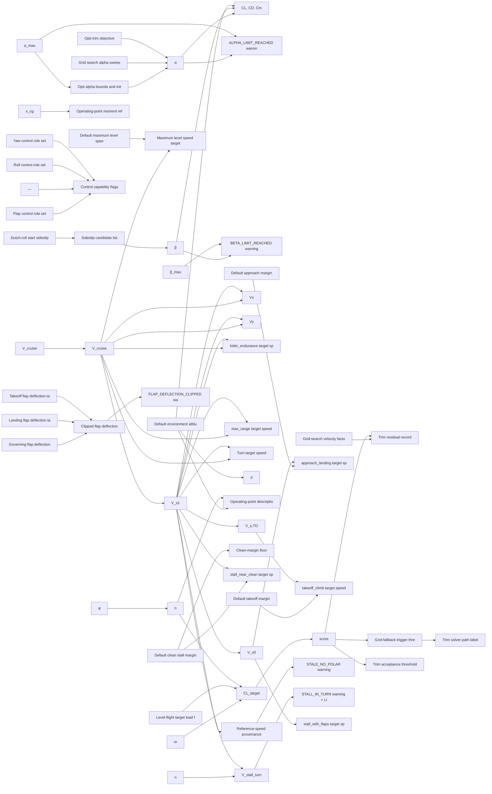

# perf-oppoints

> 81 nodes · generated from the 2026-08-18 extraction. See [[README|the format and its rules]].

## Cross-cutting findings reported by the extraction

🟡 *Not independently verified — treat as leads, not verdicts.*

```text
Cross-cutting findings (all file:line verified in app/services/operating_point_generator_service.py unless noted).

1. Two inconsistent trim-quality metrics. The Opti objective (L674-680) weights Cm²:CY²:ΔCL² as 50:3:15; the score that then judges the result (L193-195) weights |Cm|:|CY|:|ΔCL| as 1:0.5:0.3. The solver optimises one thing and is graded on another. Both sets of weights are unsourced.

2. Grid fallback discards controls. `_grid_search_trim` sets `best_controls = {}` (L840) and never passes `controls=` to `_evaluate_trim_candidate` (L823-830), so the grid path (a) evaluates the airplane with zero control deflection *and no flap*, and (b) overwrites the Opti-solved elevator deflection at L945-950. Points that fall back therefore report zero elevator deflection and a flap-configured "landing" target is evaluated clean.

3. Deflection limits are applied to flaps only. `_clip_flap_to_ted_limit` (L54-114) clips flaps to the real TED limits, while the pitch/roll/yaw Opti variables use hard-coded ±25/±20/±25 (L619, 623, 629) and never consult `deflection_limits`, which the same context already computed (L1113/L1123 — computed twice).

4. Speeds named for performance optima are magic multiples of V_s. Vx (L426), Vy (L434), loiter (L450) and max_range (L458) are `max(k·vs_clean, m·cruise)` with k ∈ {1.35, 1.50, 1.15, 1.25}. None derives from climb/glide performance, yet `assumption_computation_context` already caches physics-derived `v_md_mps` and min-sink alpha. max_range in particular is a second producer of a quantity V_md already owns (ADR 0022).

5. Dead profile parameters. `target_turn_n` (L209), `loiter_s` (L210) and `wind_mps` (L202) have no consumer anywhere in the repo, although app/schemas/flight_profile.py:128/137/70 documents each as driving operating points. Turn points instead use hard-coded banks (20, 40, 60) at L499.

6. Dead branch. `_required_capabilities_for_target`'s `turn_` branch (L558-559) is unreachable: `_validate_target_capability` returns at L571-574 first. Only app/tests/test_turn_default_targets.py:35 reaches it (ADR 0021).

7. Undeclared fallbacks (ADR 0020): `_safe_coeff` default 0.0 (L181) makes a missing Cm look trimmed; design_cg_x → 0.0 (L243); vs floors 3.0/2.5/2.0 (L360-362); solver `behavior_on_failure="return_last"` with `max_runtime=0.35` (L685-687) returns a non-converged iterate silently and makes results machine-dependent.

8. Duplicated definitions: `_G = 9.81` (app/services/turn_kinematics.py:14) vs the inline 9.81 (L797); `_PITCH_ROLES` diverges in app/services/elevator_authority_service.py:99; flap-role parsing re-implemented in app/services/assumption_compute_service.py:905; the turn n_target formula and 1.3·vs_clean turn speed are duplicated in app/services/add_turn_service.py:58,70.

9. Transport-category constant on an RC/UAV: approach margin 1.30 (L208) is the CS/FAR-25 V_REF rule, adopted with no source (ADR 0023). Defaults max_alpha 25° / max_beta 30° (L212) exceed the schema's own "typical 10-16 / 3-10 deg", so both limit checks are effectively inert.

10. `dutch_role_start` (L502) is a persisted, user-visible misspelling of "dutch roll", and it carries `NO_CONTROL_TRIM_MVP` (L508) although L625-630 does allocate a yaw variable for it.

11. `s_ref` is read from `asb_airplane.s_ref` (L885), which ASB defaults to the first wing — app/services/assumption_compute_service.py:1046 documents this exact trap and works around it with `_select_main_wing`. The OPG does not, so CL_target is wrong for tail-first geometries.
```

## Nodes

| node | kind | unit | user-visible | source | flags |
|---|---|---|---|---|---|
| [[cl_target_guards\|CL-target numerical guards]] | constant | m/s and Pa |  | 🔴 | divergence |
| [[default_altitude_m\|Default environment altitude]] | constant | m | ✓ | 🟡 | divergence |
| [[default_approach_speed_margin_vs_ldg\|Default approach margin]] | constant | dimensionless | ✓ | 🟢 | anomaly, divergence, scale |
| [[default_cruise_speed_mps\|Default cruise speed]] | constant | m/s | ✓ | 🔴 | anomaly, divergence |
| [[default_loiter_s\|Default loiter duration]] | constant | s |  | 🔴 | anomaly, divergence |
| [[default_max_alpha_deg\|Default maximum angle of attack]] | constant | deg | ✓ | 🔴 | anomaly, divergence |
| [[default_max_beta_deg\|Default maximum sideslip]] | constant | deg | ✓ | 🔴 | anomaly, divergence |
| [[default_max_level_speed_mps\|Default maximum level speed]] | constant | m/s | ✓ | 🔴 | divergence |
| [[default_min_speed_margin_vs_clean\|Default clean stall margin]] | constant | dimensionless | ✓ | 🟢 | anomaly, divergence |
| [[default_takeoff_speed_margin_vs_to\|Default takeoff margin]] | constant | dimensionless | ✓ | 🟡 | divergence |
| [[default_target_turn_n\|Default target turn load factor]] | constant | g |  | 🟡 | anomaly, divergence |
| [[default_wind_mps\|Default wind speed]] | constant | m/s |  | 🔴 | anomaly, divergence |
| [[dutch_roll_beta_deg\|Dutch-roll start sideslip]] | constant | deg | ✓ | 🔴 | anomaly, divergence |
| [[fallback_speed_factors\|Grid-search velocity factors]] | constant | dimensionless |  | 🔴 | anomaly, divergence |
| [[flap_clip_epsilon\|Flap-clip warning tolerance]] | constant | deg |  | 🔴 | divergence |
| [[flap_roles\|Flap control role set]] | constant | dimensionless |  | 🟡 | anomaly, divergence |
| [[gravity_g\|Gravitational acceleration]] | constant | m/s² |  | 🟢 | anomaly, divergence |
| [[grid_alpha_sweep\|Grid-search alpha sweep]] | constant | deg |  | 🔴 | anomaly, divergence |
| [[grid_fallback_trigger\|Grid-fallback trigger threshold]] | constant | dimensionless |  | 🔴 | divergence |
| [[min_margin_clean_floor\|Clean-margin floor]] | constant | dimensionless |  | 🔴 | divergence |
| [[n_target_level\|Level-flight target load factor]] | constant | g | ✓ | 🟢 | divergence |
| [[pitch_control_bounds\|Pitch control deflection bounds]] | constant | deg | ✓ | 🟡 | anomaly, divergence |
| [[pitch_roles\|Pitch control role set]] | constant | dimensionless |  | 🟢 | anomaly, divergence |
| [[roll_control_bounds\|Roll control deflection bounds]] | constant | deg | ✓ | 🟡 | anomaly, divergence |
| [[roll_roles\|Roll control role set]] | constant | dimensionless |  | 🟢 | divergence |
| [[safe_coeff_default\|Coefficient extraction default]] | constant | dimensionless |  | 🔴 | anomaly, divergence |
| [[target_flap_landing_deg\|Landing flap deflection target]] | constant | deg | ✓ | 🟡 | divergence |
| [[target_flap_takeoff_deg\|Takeoff flap deflection target]] | constant | deg | ✓ | 🟡 | divergence, scale |
| [[trim_status_threshold\|Trim acceptance threshold]] | constant | dimensionless | ✓ | 🔴 | anomaly, divergence |
| [[turn_bank_angles\|Default turn bank angles]] | constant | deg | ✓ | 🟡 | divergence |
| [[vs_floors\|Reference-speed floors]] | constant | m/s |  | 🔴 | anomaly, divergence |
| [[warn_no_control_trim_mvp\|NO_CONTROL_TRIM_MVP warning]] | constant | dimensionless | ✓ | 🔴 | anomaly, divergence |
| [[yaw_control_bounds\|Yaw control deflection bounds]] | constant | deg | ✓ | 🟡 | divergence |
| [[yaw_roles\|Yaw control role set]] | constant | dimensionless |  | 🟢 | divergence |
| [[alpha_bounds_opti\|Opti alpha bounds and initial guess]] | parameter | deg |  | 🔴 | anomaly, divergence |
| [[opg_worker_cap\|OP-generation worker cap]] | parameter | processes |  | 🔴 | divergence |
| [[opti_solver_budget\|Opti solver budget]] | parameter | iterations / s |  | 🔴 | anomaly, divergence |
| [[aero_coefficients_at_trim\|Aero coefficients at the trimmed point]] | quantity | dimensionless | ✓ | 🟢 | divergence |
| [[air_density_rho\|Air density at the operating altitude]] | quantity | kg/m³ |  | 🟢 | divergence |
| [[alpha_trimmed\|Trimmed angle of attack]] | quantity | rad (stored) / | ✓ | 🟢 | divergence |
| [[beta_candidates\|Sideslip candidate list]] | quantity | deg |  | 🔴 | divergence |
| [[beta_trimmed\|Trimmed sideslip angle]] | quantity | rad (stored) / | ✓ | 🟢 | divergence |
| [[cl_target\|Target lift coefficient]] | quantity | dimensionless |  | 🟢 | divergence |
| [[control_capabilities\|Control capability flags]] | quantity | dimensionless | ✓ | 🟡 | anomaly, divergence |
| [[cruise_speed_resolved\|Resolved cruise speed]] | quantity | m/s | ✓ | 🟡 | divergence |
| [[design_cg_x\|Design CG x-position]] | quantity | m | ✓ | 🟡 | anomaly, divergence |
| [[effective_mass_kg\|Effective aircraft mass]] | quantity | kg | ✓ | 🟡 | divergence |
| [[flap_deflection_clipped_value\|Clipped flap deflection]] | quantity | deg | ✓ | 🟡 | divergence |
| [[flap_limit_most_restrictive\|Governing flap deflection limit]] | quantity | deg |  | 🟡 | divergence |
| [[grid_best_controls\|Grid-search control result]] | quantity | deg | ✓ | 🔴 | anomaly, divergence |
| [[op_body_rates_pqr\|Operating-point body rates]] | quantity | rad/s | ✓ | 🟡 | anomaly, divergence |
| [[op_description_string\|Operating-point description]] | quantity | dimensionless | ✓ | 🔴 | divergence |
| [[op_xyz_ref\|Operating-point moment reference]] | quantity | m | ✓ | 🟡 | anomaly, divergence |
| [[refs_provenance\|Reference-speed provenance]] | quantity | dimensionless | ✓ | 🔴 | divergence |
| [[required_capabilities_for_target\|Required capabilities per target]] | quantity | dimensionless |  | 🟡 | anomaly, divergence |
| [[s_ref\|Reference wing area]] | quantity | m² |  | 🟢 | anomaly, divergence |
| [[trim_method\|Trim solver path label]] | quantity | dimensionless | ✓ | 🔴 | divergence |
| [[trim_objective\|Opti trim objective]] | quantity | dimensionless |  | 🔴 | anomaly, divergence |
| [[trim_residuals\|Trim residual record]] | quantity | mixed (dimensi | ✓ | 🔴 | anomaly, divergence |
| [[trim_score\|Trim score]] | quantity | dimensionless | ✓ | ⚪ | anomaly |
| [[turn_load_factor_n\|Turn load factor]] | quantity | g | ✓ | 🟢 | divergence |
| [[turn_n_target\|Turn target load factor]] | quantity | g | ✓ | 🟢 | anomaly, divergence |
| [[v_approach\|approach_landing target speed]] | quantity | m/s | ✓ | 🟢 | divergence, scale |
| [[v_best_angle_climb_vx\|Vx target speed]] | quantity | m/s | ✓ | 🔴 | anomaly, divergence |
| [[v_best_rate_climb_vy\|Vy target speed]] | quantity | m/s | ✓ | 🟡 | anomaly, divergence |
| [[v_loiter_endurance\|loiter_endurance target speed]] | quantity | m/s | ✓ | 🟡 | anomaly, divergence |
| [[v_max_level\|Maximum level speed target]] | quantity | m/s | ✓ | 🟡 | anomaly, divergence |
| [[v_max_range\|max_range target speed]] | quantity | m/s | ✓ | 🟡 | anomaly, divergence |
| [[v_stall_near_clean\|stall_near_clean target speed]] | quantity | m/s | ✓ | 🟢 | divergence |
| [[v_stall_turn\|Stall speed in the turn]] | quantity | m/s | ✓ | 🟢 | divergence |
| [[v_stall_with_flaps\|stall_with_flaps target speed]] | quantity | m/s | ✓ | 🔴 | divergence |
| [[v_takeoff\|takeoff_climb target speed]] | quantity | m/s | ✓ | 🟡 | divergence |
| [[v_turn\|Turn target speed]] | quantity | m/s | ✓ | 🟡 | anomaly, divergence |
| [[vs_clean\|Clean stall speed reference]] | quantity | m/s | ✓ | 🟡 | divergence |
| [[vs_ldg\|Landing-config stall speed reference]] | quantity | m/s | ✓ | 🟡 | divergence |
| [[vs_to\|Takeoff-config stall speed reference]] | quantity | m/s | ✓ | 🟡 | divergence |
| [[warn_alpha_limit_reached\|ALPHA_LIMIT_REACHED warning]] | quantity | dimensionless | ✓ | 🟡 | anomaly, divergence |
| [[warn_beta_limit_reached\|BETA_LIMIT_REACHED warning]] | quantity | dimensionless | ✓ | 🟡 | divergence |
| [[warn_flap_deflection_clipped\|FLAP_DEFLECTION_CLIPPED warning]] | quantity | dimensionless | ✓ | 🔴 | divergence |
| [[warn_stale_no_polar\|STALE_NO_POLAR warning]] | quantity | dimensionless | ✓ | 🔴 | divergence |
| [[warn_stall_in_turn\|STALL_IN_TURN warning + LIMIT_REACHED]] | quantity | dimensionless | ✓ | 🟡 | divergence |

## Graph — user-visible quantities and what feeds them



