# powertrain

> 166 nodes · generated from the 2026-08-18 extraction. See [[README|the format and its rules]].

## Cross-cutting findings reported by the extraction

🟡 *Not independently verified — treat as leads, not verdicts.*

```text
SCOPE READ IN FULL: app/services/powertrain_performance.py (804 lines), app/services/powertrain_sizing_service.py (319 lines), app/services/powertrain_solution_space_service.py (501 lines). Also read for consumer/producer tracing: app/schemas/powertrain_solution_space.py, app/schemas/powertrain_sizing.py, app/api/v2/endpoints/aeroplane/powertrain_performance.py, powertrain_sizing.py, powertrain_solution_space.py, app/services/powertrain_sizing_modal_service.py (partial, lines 1-80), app/services/endurance_service.py (lines 40-120 only), app/schemas/design_assumption.py (PARAMETER_DEFAULTS), frontend/components/workbench/PowertrainTab.tsx, frontend/hooks/usePowertrainSolutionSpace.ts, frontend/hooks/usePowertrainSizingModal.ts, frontend/components/workbench/PowertrainSizingModal.tsx.

THREE SEPARATE PIPELINES, NOT ONE. (a) powertrain_performance.py — T(V)/P(V)/eta(J) from a concrete motor+battery+APC-polar triple; reached only by POST /aeroplanes/{id}/powertrain/performance. (b) powertrain_sizing_service.py — catalog sweep motor x battery, reached by POST .../powertrain/sizing, rendered by PowertrainSizingModal. (c) powertrain_solution_space_service.py — required-spec envelope from mission+aero, reached by GET .../powertrain/solution-space, rendered by PowertrainTab. They share no code except the duplicated exponential atmosphere and duplicated efficiency literals.

CROSS-CUTTING FINDINGS (not attachable to a single node):
F1. NO FRONTEND CONSUMER FOR THE ENTIRE PERFORMANCE PIPELINE. grep over frontend/**/*.ts,tsx for "powertrain/performance", "p_available_w", "p_shaft_w", "thrust_n", "propeller_polar_id", "motor_component_id" returns zero non-test hits. The endpoint exists and is tested (app/tests/test_powertrain_performance_endpoint.py) but nothing in the UI calls it. Every quantity in powertrain_performance.py is therefore API-reachable but UI-unreachable. I marked user_visible=true for those that appear in the HTTP response body (that is still a user-facing surface via /docs and MCP) and recorded the UI gap here rather than repeating it 40 times.
F2. FOUR INDEPENDENT LITERALS FOR SEA-LEVEL AIR DENSITY 1.225: endurance_service.py:50 RHO_SEA_LEVEL (imported and re-aliased as AIR_DENSITY_SEA_LEVEL at powertrain_sizing_service.py:41), powertrain_performance.py:48 RHO_SEA_LEVEL (own literal), powertrain_solution_space_service.py:65 RHO_DEFAULT (own literal, DEAD), app/schemas/powertrain_solution_space.py:93 rho default (own literal, the one actually used by the solution space). ADR 0022 candidate.
F3. FOUR INDEPENDENT LITERALS FOR MOTOR EFFICIENCY 0.85: powertrain_performance.py:51 _DEFAULT_ETA_MOTOR, endurance_service.py:54 DEFAULT_ETA_MOTOR (used by sizing), powertrain_solution_space.py:44 eta_motor default, powertrain_sizing_modal_service.py:30 DEFAULT_MOTOR_ETA. Same for prop 0.65 (endurance_service.py:53, powertrain_solution_space.py:34 eta_prop_lo, powertrain_sizing_modal_service.py:31, design_assumption.py:88 prop_efficiency) and ESC 0.94 (endurance_service.py:55, powertrain_solution_space.py:51).
F4. THE EXPONENTIAL ATMOSPHERE rho = 1.225*exp(-h/8500) is written twice verbatim (powertrain_performance.py:348, powertrain_sizing_service.py:52). 8500 m carries no citation in either place. The solution space ignores altitude entirely — it has no altitude input at all, so every solution-space number is a sea-level number with no warning saying so.
F5. SECOND PRODUCER OF A USER-VISIBLE NUMBER (ADR 0022). Required motor shaft power is produced by the backend as motor_peak_w = p_aero_top / eta_mid (powertrain_solution_space_service.py:421) AND independently recomputed by the frontend as ceil(p_aero_top_w / eta_prop_lo) (frontend/components/workbench/PowertrainTab.tsx:110, conservativeMotorW). The frontend value is the one rendered in the table (PowertrainTab.tsx:571) and in the shopping-spec line (PowertrainTab.tsx:464); the backend's motor_peak_w and ShoppingSpec.motor_min_peak_w / motor_cont_w are typed in the hook but never rendered. For eta_prop_lo=0.65 / eta_mid=0.715 the two differ by ~10 %.
F6. SOLUTIONROW FIELDS SHIPPED BUT NEVER RENDERED: motor_peak_w, motor_cont_w, p_cruise_w, p_top_w, p_cruise_lo_w, p_cruise_hi_w, p_top_lo_w, p_top_hi_w, v_sag_v, i_peak_lo_a, c_min_lo, capacity_mah_min_lo, esc_min_lo_a, and ShoppingSpec.motor_min_peak_w / motor_cont_w. Verified by per-field grep over frontend excluding __tests__ and the type-declaration hook: all zero hits.
F7. NO SOURCE IS CITED ANYWHERE FOR ANY MARGIN OR BAND. esc_margin 1.4, c_margin 1.25, load_rpm_factor 0.85, prop_pd 0.65, dod 0.80, eta_prop band 0.65-0.78, v_top = 1.4 x v_cruise — all are bare Field defaults with a one-line description and no reference. The module docstring says "All equations from the spec doc (2026-06-13-powertrain-solution-space-design.md)" which covers the equations, not the numbers. ADR 0023 exposure.
F8. THE ONLY REAL LITERATURE ATTRIBUTIONS FOUND IN THE WHOLE CLUSTER are (a) "APC/Folding RC-Scale, Drela/Hepperle" on endurance_service.py:53 (imported by the sizing service) and (b) "Solve Drela's QPROP 3-parameter torque balance" in the solve_qprop_operating_point docstring (powertrain_performance.py:483). Neither is a page/equation citation. Everything else is NO_SOURCE_FOUND.
F9. app/tests/test_endurance_service.py:851-859 asserts by source inspection that powertrain_sizing_service must NOT contain hardcoded DRAG_COEFF_ESTIMATE / WING_AREA_ESTIMATE_M2 — but _DEFAULT_CD0=0.03 and _DEFAULT_S_REF_M2=0.5 at lines 44 and 47 are exactly those constants under different names. The guard test is name-based and does not bite.
F10. The docstring of powertrain_solution_space_service.py:29 documents "I_peak = P_top / (V_sag . eta_motor . eta_esc)" but the implementation at line 140 is i_peak = p_top_elec_w / v_sag with no efficiency division. The code comment at lines 130-132 says the docstring form would double-count (gh-978 BLOCKER). The module docstring was never corrected — it still states the wrong formula.

```

## Nodes

| node | kind | unit | user-visible | source | flags |
|---|---|---|---|---|---|
| [[air-density-sea-level-alias\|Sea-level density alias (sizing)]] | constant | kg/m^3 |  | 🟢 | anomaly |
| [[atmosphere-scale-height-perf\|Isothermal atmosphere scale height (performance)]] | constant | m | ✓ | 🔴 | anomaly, divergence |
| [[battery-current-fallback-100a\|Unknown-battery current fallback]] | constant | A | ✓ | 🔴 | anomaly, scale |
| [[candidate-cutoff\|Recommendation list cut-off]] | constant | count | ✓ | 🔴 | anomaly, divergence |
| [[cell-v-nom\|Nominal cell voltage (solution space)]] | constant | V/cell | ✓ | 🟢 |  |
| [[cell-v-sag\|Cell voltage under load]] | constant | V/cell | ✓ | 🔴 | anomaly, divergence |
| [[default-ar-sizing\|Default aspect ratio (sizing)]] | constant | dimensionless | ✓ | 🟢 | anomaly, divergence |
| [[default-cd0-sizing\|Default zero-lift drag coefficient (sizing)]] | constant | dimensionless | ✓ | 🟢 | anomaly, divergence, scale |
| [[default-e-oswald-sizing\|Default Oswald efficiency (sizing)]] | constant | dimensionless | ✓ | 🟢 | anomaly, divergence, scale |
| [[default-eta-esc-endurance\|Default ESC efficiency]] | constant | dimensionless  | ✓ | 🔴 | anomaly, divergence |
| [[default-eta-motor-endurance\|Default motor efficiency (sizing path)]] | constant | dimensionless  | ✓ | 🟢 | anomaly, divergence |
| [[default-eta-motor-perf\|Default motor efficiency (performance module)]] | constant | dimensionless  | ✓ | 🟢 | anomaly, divergence |
| [[default-eta-prop-endurance\|Default propeller efficiency]] | constant | dimensionless  | ✓ | 🟢 | anomaly, divergence |
| [[default-pack-voltage-11v1\|Default pack voltage]] | constant | V | ✓ | 🟡 | anomaly, divergence |
| [[default-s-ref-sizing\|Default wing reference area (sizing)]] | constant | m^2 | ✓ | 🔴 | anomaly, divergence |
| [[g-default-ss-dead\|Gravity default (solution space)]] | constant | m/s^2 |  | 🟡 | anomaly |
| [[g-perf-dead\|Gravitational acceleration (performance module)]] | constant | m/s^2 |  | 🟡 | anomaly, divergence |
| [[hyperbola-plot-span\|Hyperbola plot span multiplier]] | constant | dimensionless | ✓ | 🔴 | divergence |
| [[hyperbola-samples\|C-rate hyperbola sample count]] | constant | count | ✓ | 🔴 | divergence |
| [[inch-to-metre\|Inch-to-metre conversion factor]] | constant | m/in |  | 🟡 |  |
| [[infeasibility-threshold-w\|Infeasible-powertrain warning threshold]] | constant | W | ✓ | 🔴 | anomaly, scale |
| [[phase1-prop-diameter\|Phase-1 propeller diameter estimate]] | constant | m | ✓ | 🔴 | anomaly, divergence |
| [[qprop-bisection-iterations\|Bisection iteration count]] | constant | iterations |  | 🔴 | anomaly, divergence |
| [[rho-default-ss-dead\|Air density default (solution space)]] | constant | kg/m^3 |  | 🟢 | anomaly |
| [[rho-sea-level-perf\|Sea-level air density (performance module)]] | constant | kg/m^3 | ✓ | 🟢 | anomaly |
| [[ss-v-top-factor\|Top-speed derivation factor]] | constant | dimensionless | ✓ | 🟢 | anomaly, divergence, scale |
| [[usable-capacity-fraction-sizing\|Usable capacity fraction (sizing)]] | constant | dimensionless | ✓ | 🔴 | anomaly, divergence |
| [[volts-per-cell-sizing\|Volts per cell (sizing)]] | constant | V/cell |  | 🟢 | anomaly |
| [[volts-per-lipo-cell\|Loaded LiPo cell voltage]] | constant | V/cell | ✓ | 🟢 |  |
| [[battery-c-rate-input\|Battery C-rate]] | parameter | 1/h (C) | ✓ | 🟡 |  |
| [[battery-capacity-mah-input\|Battery capacity]] | parameter | mAh | ✓ | 🟡 |  |
| [[battery-cells-input\|Battery cell count]] | parameter | cells (S) | ✓ | 🟢 |  |
| [[motor-cells-lipo-max-input\|Maximum LiPo cell count]] | parameter | cells (S) | ✓ | 🟢 | divergence |
| [[motor-continuous-current-input\|Motor continuous current rating]] | parameter | A | ✓ | 🟢 | anomaly, divergence |
| [[motor-efficiency-pct-input\|Datasheet motor efficiency]] | parameter | % | ✓ | 🟢 | divergence |
| [[motor-gear-ratio-input\|Gearbox reduction ratio]] | parameter | dimensionless | ✓ | 🟢 | divergence |
| [[motor-io-input\|No-load current]] | parameter | A | ✓ | 🟢 | anomaly, divergence |
| [[motor-kv-rpm-per-volt-input\|Raw motor KV]] | parameter | rpm/V | ✓ | 🟢 |  |
| [[motor-max-current-input\|Motor burst current limit]] | parameter | A | ✓ | 🟢 | anomaly, divergence |
| [[motor-rm-ohm-input\|Winding resistance]] | parameter | ohm | ✓ | 🟢 |  |
| [[polar-samples-input\|Propeller polar rows]] | parameter | mixed |  | 🟢 | anomaly, divergence |
| [[request-altitude-m\|Operating altitude (performance)]] | parameter | m | ✓ | 🟢 | divergence |
| [[request-propeller-diameter-in\|Propeller diameter input]] | parameter | in | ✓ | 🟢 |  |
| [[request-throttle\|Throttle fraction]] | parameter | dimensionless  | ✓ | 🟢 |  |
| [[request-velocity-sweep\|Velocity sweep range and resolution]] | parameter | m/s, count | ✓ | 🔴 | anomaly, divergence |
| [[ss-c-margin\|Battery C-rate margin]] | parameter | dimensionless | ✓ | 🔴 | anomaly, divergence |
| [[ss-cell-counts\|Evaluated cell counts]] | parameter | cells (S) | ✓ | 🟡 | anomaly, divergence |
| [[ss-dod\|Depth of discharge]] | parameter | dimensionless  | ✓ | 🔴 | anomaly, divergence |
| [[ss-esc-margin\|ESC current margin]] | parameter | dimensionless | ✓ | 🔴 | anomaly, divergence |
| [[ss-eta-esc\|ESC efficiency (solution space)]] | parameter | dimensionless  | ✓ | 🔴 | divergence |
| [[ss-eta-motor\|Motor efficiency (solution space)]] | parameter | dimensionless  | ✓ | 🟢 | anomaly, divergence |
| [[ss-eta-prop-hi\|Propeller efficiency band upper bound]] | parameter | dimensionless  | ✓ | 🟢 | anomaly, divergence, scale |
| [[ss-eta-prop-lo\|Propeller efficiency band lower bound]] | parameter | dimensionless  | ✓ | 🟢 | anomaly, divergence |
| [[ss-g-param\|Gravitational acceleration (solution space input)]] | parameter | m/s^2 | ✓ | 🟡 | anomaly, divergence |
| [[ss-load-rpm-factor\|Under-load RPM factor]] | parameter | dimensionless | ✓ | 🔴 | anomaly, divergence |
| [[ss-prop-pd\|Propeller pitch-to-diameter ratio]] | parameter | dimensionless | ✓ | 🟢 | anomaly, divergence |
| [[ss-rho-param\|Air density (solution space input)]] | parameter | kg/m^3 | ✓ | 🟢 | anomaly, divergence |
| [[ss-t-target-min\|Target flight time]] | parameter | min | ✓ | 🟡 | anomaly, divergence |
| [[air-density-perf\|Air density at altitude (performance)]] | quantity | kg/m^3 | ✓ | 🔴 | anomaly, divergence |
| [[air-density-sizing\|Air density at altitude (sizing)]] | quantity | kg/m^3 | ✓ | 🔴 | anomaly, divergence |
| [[battery-max-continuous-discharge\|Battery maximum continuous discharge power]] | quantity | W | ✓ | 🟡 |  |
| [[battery-max-current\|Battery maximum continuous discharge current]] | quantity | A | ✓ | 🟡 |  |
| [[battery-nominal-voltage\|Nominal pack voltage]] | quantity | V | ✓ | 🟢 | anomaly |
| [[combo-battery-mass\|Battery mass]] | quantity | kg |  | 🟡 | anomaly, divergence |
| [[combo-battery-voltage\|Resolved battery voltage (sizing)]] | quantity | V | ✓ | 🟢 | anomaly, divergence |
| [[combo-capacity-ah\|Battery capacity in amp-hours]] | quantity | Ah |  | 🟡 |  |
| [[combo-confidence\|Combo confidence]] | quantity | dimensionless  | ✓ | 🔴 | anomaly, divergence |
| [[combo-cruise-current\|Cruise current draw]] | quantity | A |  | 🟡 | anomaly, divergence |
| [[combo-cruise-power\|Estimated cruise power]] | quantity | W | ✓ | 🟢 |  |
| [[combo-estimated-top-speed\|Estimated top speed]] | quantity | m/s | ✓ | 🔴 | anomaly, divergence |
| [[combo-eta-total\|Combo total propulsive efficiency]] | quantity | dimensionless  | ✓ | 🟢 | anomaly, divergence |
| [[combo-flight-time-h\|Estimated flight time (hours)]] | quantity | h |  | 🟡 | anomaly, divergence |
| [[combo-flight-time-min\|Estimated flight time]] | quantity | min | ✓ | 🟡 |  |
| [[combo-motor-mass\|Motor mass]] | quantity | kg |  | 🟡 | anomaly, divergence |
| [[combo-required-power\|Power required for a motor+battery combo]] | quantity | W | ✓ | 🟢 | anomaly, divergence |
| [[combo-total-mass\|Combo total mass]] | quantity | kg |  | 🔴 | anomaly, divergence |
| [[curve-advance-ratio\|Advance ratio per velocity sample]] | quantity | dimensionless | ✓ | 🟢 |  |
| [[curve-diameter-m\|Propeller diameter in metres]] | quantity | m |  | 🟡 |  |
| [[curve-estimated-flag\|Estimated-power flag]] | quantity | boolean | ✓ | 🔴 | anomaly, divergence |
| [[curve-eta-prop\|Propeller efficiency per velocity sample]] | quantity | dimensionless  | ✓ | 🟢 | anomaly |
| [[curve-p-available-elec\|Electrical power ceiling]] | quantity | W | ✓ | 🟡 | anomaly, divergence |
| [[curve-p-available-w\|Reported power ceiling]] | quantity | W | ✓ | 🟡 | anomaly |
| [[curve-p-shaft\|Shaft power per velocity sample]] | quantity | W | ✓ | 🟢 | anomaly, divergence |
| [[curve-p-shaft-max\|Shaft power ceiling]] | quantity | W |  | 🟢 | anomaly |
| [[curve-prop-rpm\|Fixed operating RPM (non-QPROP branch)]] | quantity | rpm | ✓ | 🟢 | anomaly, divergence |
| [[curve-thrust\|Thrust per velocity sample]] | quantity | N | ✓ | 🟢 | anomaly |
| [[curve-v-bat\|Battery voltage used for the curve]] | quantity | V |  | 🟢 |  |
| [[curve-v-terminal\|Motor terminal voltage]] | quantity | V |  | 🟢 | anomaly, divergence |
| [[esc-continuous-current-lookup\|ESC continuous current rating]] | quantity | A | ✓ | 🟢 | anomaly, divergence |
| [[hyperbola-c-rate-samples\|Hyperbola C-rate samples]] | quantity | 1/h (C) | ✓ | 🟡 | anomaly, divergence |
| [[hyperbola-capacity-samples\|Hyperbola capacity samples]] | quantity | mAh | ✓ | 🔴 | anomaly, divergence |
| [[motor-continuous-electrical-power\|Motor continuous electrical input power (estimated)]] | quantity | W |  | 🟡 | anomaly, divergence |
| [[motor-eta\|Motor + gearbox efficiency]] | quantity | dimensionless  | ✓ | 🟢 | divergence |
| [[motor-kv-si\|Motor speed constant in SI]] | quantity | rad/(s.V) |  | 🟢 |  |
| [[motor-max-electrical-power\|Motor maximum electrical input power (estimated)]] | quantity | W | ✓ | 🟡 | anomaly, divergence |
| [[motor-output-kv\|Output-shaft KV]] | quantity | rpm/V | ✓ | 🟢 | divergence |
| [[motor-uses-qprop-model\|QPROP model availability flag]] | quantity | boolean | ✓ | 🟢 | anomaly, divergence |
| [[nearest-rpm-row-selection\|Nearest-RPM polar row group]] | quantity | rpm |  | 🔴 | anomaly, divergence |
| [[polar-cp\|Propeller power coefficient]] | quantity | dimensionless | ✓ | 🟢 |  |
| [[polar-ct\|Propeller thrust coefficient]] | quantity | dimensionless | ✓ | 🟢 | anomaly, divergence |
| [[polar-extrapolation-warning\|Advance-ratio extrapolation flag]] | quantity | boolean | ✓ | 🔴 |  |
| [[polar-j-clamp\|Clamped advance ratio for interpolation]] | quantity | dimensionless |  | 🟡 | anomaly, divergence |
| [[polar-pe\|Propeller efficiency from polar]] | quantity | dimensionless  | ✓ | 🟢 | anomaly, divergence |
| [[prop-torque-demand\|Propeller absorbed torque]] | quantity | Nm |  | 🟢 |  |
| [[propop-advance-ratio\|Advance ratio (operating point)]] | quantity | dimensionless |  | 🟢 |  |
| [[propop-eta-prop\|Propeller efficiency (operating-point helper)]] | quantity | dimensionless  |  | 🟢 | anomaly |
| [[propop-n-rps\|Propeller rotational speed (operating point)]] | quantity | 1/s |  | 🟢 |  |
| [[propop-p-shaft\|Propeller shaft power (operating-point helper)]] | quantity | W |  | 🟢 | anomaly, divergence |
| [[propop-thrust\|Propeller thrust (operating-point helper)]] | quantity | N |  | 🟢 | anomaly |
| [[qprop-back-emf\|Motor back-EMF]] | quantity | V |  | 🟢 |  |
| [[qprop-back-emf-floor\|Back-EMF floor at the current ceiling]] | quantity | V |  | 🟢 |  |
| [[qprop-current\|Solved terminal current]] | quantity | A |  | 🟢 | anomaly |
| [[qprop-current-for-rpm\|Terminal current at a candidate RPM]] | quantity | A |  | 🟢 |  |
| [[qprop-eta-motor\|QPROP motor efficiency]] | quantity | dimensionless  |  | 🟢 | anomaly, divergence |
| [[qprop-motor-torque\|Motor-produced torque]] | quantity | Nm |  | 🟢 | divergence |
| [[qprop-p-shaft\|Solved shaft power (QPROP)]] | quantity | W | ✓ | 🟢 | anomaly |
| [[qprop-residual\|Torque-balance residual]] | quantity | Nm |  | 🟢 |  |
| [[qprop-rpm-at-imax\|RPM at the current ceiling]] | quantity | rpm |  | 🟢 |  |
| [[qprop-rpm-free\|Free-running RPM]] | quantity | rpm |  | 🟢 |  |
| [[qprop-rpm-solution\|Solved operating RPM]] | quantity | rpm | ✓ | 🟢 | anomaly, divergence |
| [[qprop-torque\|Solved shaft torque]] | quantity | Nm |  | 🟢 | anomaly |
| [[required-power-w-shim\|Legacy power-required shim]] | quantity | W (never retur |  | 🔴 | anomaly, divergence |
| [[resolved-ar\|Resolved aspect ratio]] | quantity | dimensionless | ✓ | 🟢 | divergence |
| [[resolved-cd0\|Resolved zero-lift drag coefficient]] | quantity | dimensionless | ✓ | 🟢 | divergence, scale |
| [[resolved-e-oswald\|Resolved Oswald efficiency]] | quantity | dimensionless | ✓ | 🟢 | scale |
| [[resolved-s-ref\|Resolved wing reference area]] | quantity | m^2 | ✓ | 🔴 | divergence |
| [[ss-ar\|Aspect ratio (solution space)]] | quantity | dimensionless | ✓ | 🟢 | anomaly, divergence |
| [[ss-band-energy-hi\|Mission energy at high prop efficiency]] | quantity | Wh | ✓ | 🟡 | anomaly, divergence |
| [[ss-band-energy-lo\|Mission energy at low prop efficiency]] | quantity | Wh | ✓ | 🟡 | anomaly, divergence |
| [[ss-c-min\|Required battery C-rate]] | quantity | 1/h (C) | ✓ | 🔴 | anomaly, divergence |
| [[ss-cap-mah\|Minimum battery capacity]] | quantity | mAh | ✓ | 🟡 | anomaly, divergence |
| [[ss-catalog-battery-match\|Catalog battery match flag]] | quantity | boolean | ✓ | 🟡 | anomaly |
| [[ss-catalog-esc-match\|Catalog ESC match flag]] | quantity | boolean | ✓ | 🟢 | anomaly, divergence |
| [[ss-catalog-motor-match\|Catalog motor match flag]] | quantity | boolean | ✓ | 🟢 | anomaly, divergence |
| [[ss-cd0\|Zero-lift drag coefficient (solution space)]] | quantity | dimensionless | ✓ | 🟢 | anomaly, divergence, scale |
| [[ss-drag-coefficient\|Total drag coefficient]] | quantity | dimensionless |  | 🟢 |  |
| [[ss-dynamic-pressure\|Dynamic pressure]] | quantity | Pa |  | 🟢 |  |
| [[ss-e-oswald\|Oswald efficiency (solution space)]] | quantity | dimensionless | ✓ | 🟢 | anomaly, divergence, scale |
| [[ss-energy-wh\|Required mission energy]] | quantity | Wh | ✓ | 🟡 | anomaly, divergence |
| [[ss-esc-min\|Minimum ESC current rating]] | quantity | A | ✓ | 🟡 | divergence |
| [[ss-eta-mid\|Mid-band propeller efficiency]] | quantity | dimensionless  | ✓ | 🔴 | anomaly, divergence |
| [[ss-i-peak\|Peak battery current]] | quantity | A | ✓ | 🟡 | anomaly, divergence |
| [[ss-induced-drag-factor\|Induced-drag factor]] | quantity | dimensionless |  | 🟢 |  |
| [[ss-kv-approx\|Approximate required motor KV]] | quantity | rpm/V | ✓ | 🟡 | anomaly, divergence |
| [[ss-lift-coefficient\|Level-flight lift coefficient]] | quantity | dimensionless |  | 🟢 | anomaly, divergence |
| [[ss-mass\|All-up mass (solution space)]] | quantity | kg | ✓ | 🔴 | anomaly, divergence |
| [[ss-motor-cont-shaft\|Required motor continuous shaft power]] | quantity | W | ✓ | 🟢 | anomaly, divergence |
| [[ss-motor-peak-shaft\|Required motor peak shaft power]] | quantity | W | ✓ | 🟢 | anomaly, divergence, scale |
| [[ss-p-aero\|Aerodynamic power]] | quantity | W | ✓ | 🟢 | anomaly, divergence |
| [[ss-p-aero-cruise\|Aerodynamic power at cruise]] | quantity | W | ✓ | 🟢 |  |
| [[ss-p-aero-top\|Aerodynamic power at top speed]] | quantity | W | ✓ | 🟢 | scale |
| [[ss-p-cruise-hi-e\|Electrical cruise power at high prop efficiency]] | quantity | W | ✓ | 🟢 | divergence |
| [[ss-p-cruise-lo-e\|Electrical cruise power at low prop efficiency]] | quantity | W | ✓ | 🟢 | anomaly |
| [[ss-p-cruise-mid\|Electrical cruise power (mid band)]] | quantity | W | ✓ | 🟢 | anomaly |
| [[ss-p-elec\|Electrical power required]] | quantity | W | ✓ | 🟢 |  |
| [[ss-p-top-hi-e\|Electrical peak power at high prop efficiency]] | quantity | W | ✓ | 🟢 | divergence, scale |
| [[ss-p-top-lo-e\|Electrical peak power at low prop efficiency]] | quantity | W | ✓ | 🟢 | scale |
| [[ss-p-top-mid\|Electrical peak power (mid band)]] | quantity | W | ✓ | 🟢 | anomaly, scale |
| [[ss-raw-c\|Raw required C-rate]] | quantity | 1/h (C) |  | 🟡 |  |
| [[ss-rpm-target\|Target propeller RPM]] | quantity | rpm |  | 🟡 | anomaly, divergence |
| [[ss-s-ref\|Wing reference area (solution space)]] | quantity | m^2 | ✓ | 🔴 | anomaly, divergence |
| [[ss-t-target-h\|Target flight time in hours]] | quantity | h |  | 🟡 |  |
| [[ss-v-cruise\|Cruise speed (solution space)]] | quantity | m/s | ✓ | 🔴 | anomaly, divergence |
| [[ss-v-nom\|Pack nominal voltage (solution space)]] | quantity | V | ✓ | 🟢 |  |
| [[ss-v-sag\|Pack voltage under load]] | quantity | V | ✓ | 🔴 | anomaly, divergence |
| [[ss-v-top\|Top speed used for peak sizing]] | quantity | m/s | ✓ | 🟢 | divergence, scale |

## Graph — user-visible quantities and what feeds them

```mermaid
flowchart LR
  n0["rho"] --> n1["P_shaft(V)"]
  n0["rho"] --> n2["T(V)"]
  n0["rho"] --> n3["Q_prop"]
  n0["rho"] --> n4["P_shaft"]
  n0["rho"] --> n5["T"]
  n6["AIR_DENSITY_SEA_LEVEL"] --> n7["rho"]
  n7["rho"] --> n8["P_req"]
  n9["8500.0"] --> n0["rho"]
  n10["c_rate"] --> n11["P_battery_max"]
  n10["c_rate"] --> n12["I_bat_max"]
  n13["capacity_mah"] --> n11["P_battery_max"]
  n13["capacity_mah"] --> n12["I_bat_max"]
  n14["cells (S)"] --> n15["V_bat"]
  n16["100.0"] --> n17["P_available_elec"]
  n11["P_battery_max"] --> n17["P_available_elec"]
  n12["I_bat_max"] --> n17["P_available_elec"]
  n15["V_bat"] --> n11["P_battery_max"]
  n15["V_bat"] --> n18["V_bat"]
  n19["CELL_V_NOM"] --> n20["V_nom"]
  n21["CELL_V_SAG"] --> n22["V_sag"]
  n23["voltage"] --> n24["cruise_current_a"]
  n25["confidence"] --> n26["10"]
  n27["actual_cruise_power"] --> n24["cruise_current_a"]
  n28["eta_total"] --> n27["actual_cruise_power"]
  n28["eta_total"] --> n8["P_req"]
  n29["flight_time_h"] --> n30["estimated_flight_time_min"]
  n30["estimated_flight_time_min"] --> n25["confidence"]
  n8["P_req"] --> n27["actual_cruise_power"]
  n31["total_mass"] --> n27["actual_cruise_power"]
  n31["total_mass"] --> n8["P_req"]
  n32["J"] --> n33["extrapolation_warning"]
  n32["J"] --> n34["J_clamp"]
  n35["D_m"] --> n32["J"]
  n35["D_m"] --> n1["P_shaft(V)"]
  n35["D_m"] --> n2["T(V)"]
  n17["P_available_elec"] --> n36["p_available_w"]
  n17["P_available_elec"] --> n37["P_shaft_max"]
  n37["P_shaft_max"] --> n1["P_shaft(V)"]
  n37["P_shaft_max"] --> n38["0.1"]
  n39["prop_rpm"] --> n32["J"]
  n39["prop_rpm"] --> n1["P_shaft(V)"]
  n39["prop_rpm"] --> n2["T(V)"]
  n39["prop_rpm"] --> n40["nearest_rpm"]
  n18["V_bat"] --> n17["P_available_elec"]
  n18["V_bat"] --> n39["prop_rpm"]
  n41["_DEFAULT_AR"] --> n42["AR"]
  n43["_DEFAULT_CD0"] --> n44["cd0"]
  n45["_DEFAULT_E_OSWALD"] --> n46["e"]
  n47["DEFAULT_ETA_ESC"] --> n28["eta_total"]
  n48["DEFAULT_ETA_MOTOR"] --> n28["eta_total"]
  n49["_DEFAULT_ETA_MOTOR"] --> n50["eta_motor"]
  n51["DEFAULT_ETA_PROP"] --> n28["eta_total"]
  n52["11.1"] --> n23["voltage"]
  n53["_DEFAULT_S_REF_M2"] --> n54["S_ref"]
  n55["capacity_curve_mah"] --> n56["c_rate_curve"]
  n57["4.0"] --> n55["capacity_curve_mah"]
  n58["_HYPERBOLA_SAMPLES"] --> n55["capacity_curve_mah"]
  n59["cells_lipo_max"] --> n60["P_motor_cont_elec"]
  n59["cells_lipo_max"] --> n61["P_motor_max_elec"]
  n62["continuous_current_a"] --> n60["P_motor_cont_elec"]
  n63["efficiency_pct"] --> n50["eta_motor"]
  n50["eta_motor"] --> n37["P_shaft_max"]
  n64["gear_ratio"] --> n65["output_kv"]
  n66["I0"] --> n67["eta_motor (QPROP)"]
  n66["I0"] --> n68["Q_motor"]
  n66["I0"] --> n69["Q"]
  n70["kv_rpm_per_volt"] --> n65["output_kv"]
  n71["max_current_a"] --> n60["P_motor_cont_elec"]
  n71["max_current_a"] --> n61["P_motor_max_elec"]
  n71["max_current_a"] --> n72["back_emf_floor"]
  n61["P_motor_max_elec"] --> n17["P_available_elec"]
  n65["output_kv"] --> n39["prop_rpm"]
  n65["output_kv"] --> n73["Kv_si"]
  n74["Rm"] --> n75["uses_qprop_model"]
  n74["Rm"] --> n72["back_emf_floor"]
  n74["Rm"] --> n76["I(n)"]
  n74["Rm"] --> n67["eta_motor (QPROP)"]
  n75["uses_qprop_model"] --> n77["estimated"]
  n78["_PHASE1_PROP_DIAMETER_M"] --> n79["RPM_target"]
  n80["Cp"] --> n1["P_shaft(V)"]
  n80["Cp"] --> n81["Pe"]
  n80["Cp"] --> n3["Q_prop"]
  n80["Cp"] --> n4["P_shaft"]
  n82["Ct"] --> n2["T(V)"]
  n82["Ct"] --> n81["Pe"]
  n82["Ct"] --> n5["T"]
  n34["J_clamp"] --> n80["Cp"]
  n34["J_clamp"] --> n82["Ct"]
  n34["J_clamp"] --> n81["Pe"]
  n81["Pe"] --> n83["eta_prop(J)"]
  n81["Pe"] --> n84["eta_prop"]
  n85["polar_samples"] --> n80["Cp"]
  n85["polar_samples"] --> n82["Ct"]
  n86["80"] --> n87["rpm_sol"]
  n88["P_shaft"] --> n1["P_shaft(V)"]
  n89["residual"] --> n87["rpm_sol"]
  n90["rpm_at_imax"] --> n87["rpm_sol"]
  n91["rpm_free"] --> n87["rpm_sol"]
  n87["rpm_sol"] --> n32["J"]
  n87["rpm_sol"] --> n2["T(V)"]
  n87["rpm_sol"] --> n40["nearest_rpm"]
  n87["rpm_sol"] --> n92["I"]
  n87["rpm_sol"] --> n88["P_shaft"]
  n69["Q"] --> n88["P_shaft"]
  n93["altitude_m"] --> n0["rho"]
  n94["propeller_diameter_in"] --> n35["D_m"]
  n95["throttle"] --> n39["prop_rpm"]
  n95["throttle"] --> n96["V_terminal"]
  n42["AR"] --> n27["actual_cruise_power"]
  n42["AR"] --> n8["P_req"]
  n44["cd0"] --> n27["actual_cruise_power"]
  n44["cd0"] --> n8["P_req"]
  n46["e"] --> n27["actual_cruise_power"]
  n46["e"] --> n8["P_req"]
  n54["S_ref"] --> n27["actual_cruise_power"]
  n54["S_ref"] --> n8["P_req"]
  n97["RHO_SEA_LEVEL"] --> n0["rho"]
  n98["AR"] --> n99["k"]
  n98["AR"] --> n100["p_aero_cruise_w"]
  n98["AR"] --> n101["p_aero_top_w"]
  n102["c_margin"] --> n103["C_min"]
  n103["C_min"] --> n104["has_battery_match"]
  n105["cap_mAh"] --> n55["capacity_curve_mah"]
  n105["cap_mAh"] --> n57["4.0"]
  n105["cap_mAh"] --> n104["has_battery_match"]
  n105["cap_mAh"] --> n106["raw_c"]
  n107["cd0"] --> n108["C_D"]
  n107["cd0"] --> n100["p_aero_cruise_w"]
  n107["cd0"] --> n101["p_aero_top_w"]
  n109["cell_counts"] --> n20["V_nom"]
  n109["cell_counts"] --> n22["V_sag"]
  n110["dod"] --> n111["energy_wh (hi band)"]
  n110["dod"] --> n112["energy_wh (lo band)"]
  n110["dod"] --> n113["energy_wh"]
  n108["C_D"] --> n114["P_aero"]
  n115["q"] --> n114["P_aero"]
  n116["e"] --> n99["k"]
  n116["e"] --> n100["p_aero_cruise_w"]
  n116["e"] --> n101["p_aero_top_w"]
  n113["energy_wh"] --> n105["cap_mAh"]
  n117["esc_margin"] --> n118["ESC_min"]
  n118["ESC_min"] --> n119["has_esc_match"]
  n120["eta_esc"] --> n121["p_cruise_hi_e"]
  n120["eta_esc"] --> n122["p_cruise_lo_e"]
  n120["eta_esc"] --> n123["p_cruise_w"]
  n120["eta_esc"] --> n124["P_elec"]
  n120["eta_esc"] --> n125["p_top_hi_e"]
  n120["eta_esc"] --> n126["p_top_lo_e"]
  n120["eta_esc"] --> n127["p_top_w"]
  n128["eta_mid"] --> n129["motor_cont_w"]
  n128["eta_mid"] --> n130["motor_peak_w"]
  n128["eta_mid"] --> n123["p_cruise_w"]
  n128["eta_mid"] --> n127["p_top_w"]
  n131["eta_motor"] --> n121["p_cruise_hi_e"]
  n131["eta_motor"] --> n122["p_cruise_lo_e"]
  n131["eta_motor"] --> n123["p_cruise_w"]
  n131["eta_motor"] --> n124["P_elec"]
  n131["eta_motor"] --> n125["p_top_hi_e"]
  n131["eta_motor"] --> n126["p_top_lo_e"]
  n131["eta_motor"] --> n127["p_top_w"]
  n132["eta_prop_hi"] --> n128["eta_mid"]
  n132["eta_prop_hi"] --> n121["p_cruise_hi_e"]
  n132["eta_prop_hi"] --> n124["P_elec"]
  n132["eta_prop_hi"] --> n125["p_top_hi_e"]
  n133["eta_prop_lo"] --> n128["eta_mid"]
  n133["eta_prop_lo"] --> n122["p_cruise_lo_e"]
  n133["eta_prop_lo"] --> n124["P_elec"]
  n133["eta_prop_lo"] --> n126["p_top_lo_e"]
  n134["g"] --> n135["C_L"]
  n134["g"] --> n100["p_aero_cruise_w"]
  n134["g"] --> n101["p_aero_top_w"]
  n136["I_peak"] --> n56["c_rate_curve"]
  n136["I_peak"] --> n118["ESC_min"]
  n136["I_peak"] --> n106["raw_c"]
  n137["load_rpm_factor"] --> n138["kv_approx"]
  n139["m"] --> n135["C_L"]
  n139["m"] --> n100["p_aero_cruise_w"]
  n139["m"] --> n101["p_aero_top_w"]
  n130["motor_peak_w"] --> n140["has_motor_match"]
  n114["P_aero"] --> n100["p_aero_cruise_w"]
  n114["P_aero"] --> n101["p_aero_top_w"]
  n114["P_aero"] --> n124["P_elec"]
  n100["p_aero_cruise_w"] --> n129["motor_cont_w"]
  n100["p_aero_cruise_w"] --> n121["p_cruise_hi_e"]
  n100["p_aero_cruise_w"] --> n122["p_cruise_lo_e"]
  n100["p_aero_cruise_w"] --> n123["p_cruise_w"]
  n101["p_aero_top_w"] --> n130["motor_peak_w"]
  n101["p_aero_top_w"] --> n125["p_top_hi_e"]
  n101["p_aero_top_w"] --> n126["p_top_lo_e"]
  n101["p_aero_top_w"] --> n127["p_top_w"]
  n121["p_cruise_hi_e"] --> n111["energy_wh (hi band)"]
  n122["p_cruise_lo_e"] --> n112["energy_wh (lo band)"]
  n123["p_cruise_w"] --> n113["energy_wh"]
  n124["P_elec"] --> n136["I_peak"]
  n124["P_elec"] --> n121["p_cruise_hi_e"]
  n124["P_elec"] --> n122["p_cruise_lo_e"]
  n124["P_elec"] --> n123["p_cruise_w"]
  n124["P_elec"] --> n125["p_top_hi_e"]
  n124["P_elec"] --> n126["p_top_lo_e"]
  n124["P_elec"] --> n127["p_top_w"]
  n141["prop_pd"] --> n79["RPM_target"]
  n106["raw_c"] --> n103["C_min"]
  n142["rho"] --> n115["q"]
  n142["rho"] --> n100["p_aero_cruise_w"]
  n142["rho"] --> n101["p_aero_top_w"]
  n79["RPM_target"] --> n138["kv_approx"]
  n143["S_ref"] --> n135["C_L"]
  n143["S_ref"] --> n114["P_aero"]
  n143["S_ref"] --> n100["p_aero_cruise_w"]
  n143["S_ref"] --> n101["p_aero_top_w"]
  n144["t_target_h"] --> n111["energy_wh (hi band)"]
  n144["t_target_h"] --> n112["energy_wh (lo band)"]
  n144["t_target_h"] --> n113["energy_wh"]
  n145["t_target_min"] --> n144["t_target_h"]
  n146["V_cruise"] --> n100["p_aero_cruise_w"]
  n146["V_cruise"] --> n147["V_top"]
  n20["V_nom"] --> n105["cap_mAh"]
  n20["V_nom"] --> n138["kv_approx"]
  n22["V_sag"] --> n136["I_peak"]
  n147["V_top"] --> n101["p_aero_top_w"]
  n147["V_top"] --> n79["RPM_target"]
  n148["1.4"] --> n147["V_top"]
  n149["0.8"] --> n29["flight_time_h"]
  n150["3.7"] --> n23["voltage"]
  n151["_VOLTS_PER_LIPO_CELL"] --> n15["V_bat"]
  n151["_VOLTS_PER_LIPO_CELL"] --> n60["P_motor_cont_elec"]
  n151["_VOLTS_PER_LIPO_CELL"] --> n61["P_motor_max_elec"]
```



