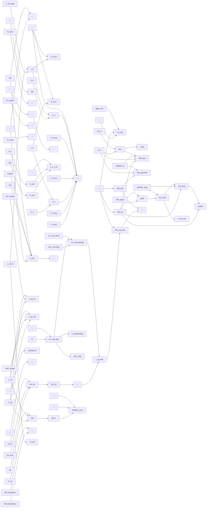

# stability

> 146 nodes · generated from the 2026-08-18 extraction. See [[README|the format and its rules]].

## Cross-cutting findings reported by the extraction

🟡 *Not independently verified — treat as leads, not verdicts.*

```text
SCOPE COVERED: the six named files, read in full. Consumers found via grep over app/, cad_designer/, frontend/ and the live db/test.db.

CROSS-CUTTING FINDINGS (too large for a single per-item `anomaly` field):

F1 — elevator_authority_service is INERT IN PRODUCTION (ADR 0021).
It reads DesignAssumption rows named "x_np", "mac", "v_cruise", "stall_alpha" via `_load_assumption_value` (app/services/elevator_authority_service.py:456-480). None of those parameter names is ever written:
  - the only row creators are `design_assumptions_service.seed_defaults` (app/services/design_assumptions_service.py:103-111, iterating `PARAMETER_DEFAULTS`), `mission_objective_service._apply_preset_estimates` (app/services/mission_objective_service.py:91-100, iterating `preset.suggested_estimates`), and `aeroplane_clone_service` (copies existing rows).
  - `PARAMETER_DEFAULTS` (app/schemas/design_assumption.py:72-96) contains mass, cg_x, target_static_margin, cd0, cl_max, g_limit, power_to_weight, prop_efficiency, battery_*, propulsion_*, motor_continuous_power_w, t_static_N, design_speed_mps. No x_np / mac / v_cruise / stall_alpha.
  - all 9 mission presets' `suggested_estimates` (queried from db/test.db) contain only g_limit, target_static_margin, cl_max, power_to_weight, prop_efficiency.
  - `select parameter_name, count(*) from design_assumptions group by 1` on db/test.db returns exactly the 15 seeded names — no x_np, no mac.
  x_np and MAC ARE computed, but they are written to the JSON column `assumption_computation_context` as `x_np_m` / `mac_m` (app/services/assumption_compute_service.py:706, 725), not as assumption rows.
  Consequence: `_compute_forward_cg_limit_asb` raises at line 580-583 on every call; `compute_forward_cg_limit`'s except-handler then calls `_load_stability_assumptions`, which raises the same ValueError at line 502-506 and is re-raised (line 447). So NEITHER the physics path NOR `_build_stub_result` can ever return. The POST /aeroplanes/{id}/forward-cg/recompute endpoint 500s; inside `recompute_assumptions` the ValueError is swallowed at app/services/assumption_compute_service.py:501-516 and logged as INFO "deferred", so the 0.30·MAC stub from `loading_scenario_service.compute_stability_envelope` always wins. Everything downstream of gh-500/gh-516 (Cm_δe, ΔCm_flap, CL_max_landing, confidence tiers, both guards, the AVL path) is unreachable code.

F2 — THREE independent producers of static margin (ADR 0022):
  a. `stability_service._compute_static_margin` → (Xnp_solver − xyz_ref[0]) / Cref_solver  (app/services/stability_service.py:52)
  b. `copilot_tools._run_stability_async` overrides (a) with (ctx["x_np_m"] − summary.cg_x) / summary.mac × 100 (app/services/copilot_tools.py:446-447)
  c. `trim_enrichment_service.classify_stability` → −Cm_a / CL_a (app/services/trim_enrichment_service.py:146) — a completely different formula, surfaced per operating point in the UI.
Plus a 4th display path: the SM chip in the UI shows `ctx.target_static_margin` (the design *target*), labelled "Static margin = (NP − CG) / MAC" (frontend/components/workbench/StabilityChipRow.tsx:56-60).

F3 — FOUR independent copies of the SM=0.30 forward/elevator limit: `sm_sizing_service._SM_FORWARD_CLIP_LIMIT` (:78), `elevator_authority_service._STUB_FORWARD_SM` (:93), `loading_scenario_service._SM_ELEVATOR_LIMIT` (:53), `trim_enrichment_service.margin_high_threshold` default (:394). Also TWO copies each of SM=0.02 (sm_sizing:53 / loading_scenario:51) and SM=0.20 (sm_sizing:54 / loading_scenario:52).

F4 — deflection-limit key mismatch (CONFIRMED against db/test.db, matches known bug #955).
`build_deflection_limits_from_schema` keys the dict by the RAW TED name (app/services/trim_enrichment_service.py:105-116, `limits[name] = ...`) although its own docstring says "control surface name (with [role] tag)" (:77-78). `compute_enrichment` looks up `limits.get(surface_name, (25.0, 25.0))` where surface_name is the tagged `[role]axis_suffix` name (:413). DB check: TEDs are named "elevator"/"rudder"/"aileron" with real limits (35/35, 28/23, 30/30), while a stored `deflection_reserves` key is "[elevator]elevator" with max_pos_deg=25.0, max_neg_deg=25.0 — i.e. the hardcoded fallback. Real mechanical limits never reach `usage_fraction`, and the 0.80/0.95 authority warnings therefore fire on wrong numbers. Additionally `dict.fromkeys(limits, 0.0)` at :410 (gh-863) seeds untagged names, so every physical surface is reported twice — once untagged at 0° full reserve, once tagged.

F5 — `stability_service._auto_populate_cd0` is unreachable AND would be a second cd0 producer.
Guard: `if str(analysis_tool).lower() in ("aerobuildup",)` (app/services/stability_service.py:359). `AnalysisToolUrlType` is `class(str, Enum)` (app/schemas/AeroplaneRequest.py:49), so on Python 3.11 `str(T.AEROBUILDUP)` == "AnalysisToolUrlType.AEROBUILDUP" (verified by running it) → `.lower()` == "analysistoolurltype.aerobuildup" → never matches. All three callers (aeroanalysis endpoint :203, copilot_tools :435, retrim_service :143) pass the enum member. If it ever fired it would write AeroBuildup's TOTAL CD into the cd0 assumption, contradicting gh-924's parasite-only definition (`assumption_compute_service._parasite_cd0`, :1098-1112) — a second, wrong producer. Same bug affects the `solver` column written at :357 (`str(analysis_tool)` stores "AnalysisToolUrlType.AEROBUILDUP").

F6 — sm_sizing_service reaches the API but not the UI. `GET /aeroplanes/{id}/sm-suggestion` and `POST .../sm-suggestions/apply` exist (app/api/v2/endpoints/aeroplane/sm_suggestions.py) but a grep of frontend/ for "sm-suggestion", "predicted_sm", "wing_shift", "htail_scale", "sm_forward_cg" returns nothing. Same for "forward-cg". Same for the whole StabilitySummaryResponse: only `MarkerDetailBox.tsx` declares its fields, and MarkerDetailBox is imported by nothing except its own test.

F7 — ADR 0023 (RC/UAV-scale validation of constants): several constants are transport-category or GA r
```

## Nodes

| node | kind | unit | user-visible | source | flags |
|---|---|---|---|---|---|
| [[aero-coefficient-keys\|Reported aero coefficient whitelist]] | constant | – (set of stri | ✓ | 🟢 |  |
| [[aircraft-class-default\|Default aircraft class]] | constant | – (string) | ✓ | 🔴 | anomaly, divergence |
| [[aircraft-class-tail-targets\|Tail-volume target ranges by aircraft class]] | constant | – (dimensionle | ✓ | 🟡 | anomaly, divergence, scale |
| [[alpha-vh-clamp-max\|alpha_VH upper clamp]] | constant | – (dimensionle |  | 🔴 | anomaly, divergence |
| [[alpha-vh-clamp-min\|alpha_VH lower clamp]] | constant | – (dimensionle |  | 🔴 | anomaly, divergence |
| [[alpha-vh-fallback\|alpha_VH fallback]] | constant | – (dimensionle |  | 🔴 | anomaly, divergence |
| [[analysis-goals\|Operating-point analysis goals]] | constant | – (mapping) | ✓ | 🟡 | anomaly, divergence |
| [[at-over-a-ratio\|Tail-to-wing lift-curve-slope ratio]] | constant | – (dimensionle |  | 🟡 | anomaly, divergence |
| [[avl-runner-timeout\|AVL run timeout]] | constant | s |  | 🔴 | anomaly, divergence |
| [[brentq-maxiter\|Brent root-finder iteration cap]] | constant | – (count) |  | 🟡 | anomaly, divergence |
| [[brentq-xtol\|Brent root-finder tolerance]] | constant | deg |  | 🟡 | anomaly, divergence |
| [[cl-a-guard-epsilon\|CL_alpha division guard]] | constant | 1/rad |  | 🔴 | anomaly, divergence |
| [[cl-max-clean-fallback\|Clean CL_max fallback]] | constant | – (dimensionle |  | 🟡 | anomaly, divergence, scale |
| [[cm-delta-e-threshold\|Elevator authority conditioning threshold]] | constant | 1/rad | ✓ | 🟡 | anomaly, divergence, scale |
| [[de-da-factor\|Downwash factor (1 − de/dalpha)]] | constant | – (dimensionle |  | 🟡 | anomaly, divergence, scale |
| [[default-delta-e-deg\|Default maximum elevator deflection]] | constant | deg |  | 🟢 | anomaly, divergence, scale |
| [[deflection-limit-default\|Default control-surface deflection limit]] | constant | deg | ✓ | 🟢 | anomaly, divergence, scale |
| [[dual-roles-set\|Dual-role surface set]] | constant | – (set of stri |  | 🟢 | anomaly, divergence |
| [[flap-alpha-sweep\|Flap CL_max alpha sweep]] | constant | deg |  | 🔴 | anomaly, divergence |
| [[flap-default-deflection\|Default flap deflection]] | constant | deg |  | 🟢 | anomaly, divergence, scale |
| [[htail-scale-min-guard\|Minimum htail scale]] | constant | – (dimensionle | ✓ | 🔴 | anomaly, divergence |
| [[is-v-tail-flag\|V-tail configuration flag]] | constant | – (bool) |  | 🔴 | anomaly, divergence |
| [[mac-m-fallback\|MAC fallback]] | constant | m |  | 🔴 | anomaly, divergence |
| [[max-x-wing-shift-mac\|Maximum wing shift clip]] | constant | – (multiples o |  | 🔴 | anomaly, divergence |
| [[near-stall-velocity-factor\|Near-stall approach speed factor]] | constant | – (dimensionle |  | 🔴 | anomaly, divergence |
| [[pitch-roles\|Pitch-control roles]] | constant | – (set of stri |  | 🟡 | anomaly, divergence |
| [[role-coefficient-map\|Role → primary coefficient map]] | constant | – (mapping) |  | 🟢 | anomaly, divergence |
| [[roskam-flap-cl-bonus\|Flap CL_max increment]] | constant | – (dimensionle | ✓ | 🟡 | anomaly, divergence, scale |
| [[s-h-m2-fallback\|Horizontal tail area fallback]] | constant | m² |  | 🔴 | anomaly, divergence |
| [[s-ref-m2-fallback\|Reference area fallback]] | constant | m² |  | 🔴 | anomaly, divergence |
| [[sm-apply-max-iters\|Apply-loop iteration cap]] | constant | – (count) | ✓ | 🔴 | divergence |
| [[sm-classify-neutral-threshold-pct\|Neutral/unstable boundary]] | constant | % MAC | ✓ | 🟢 |  |
| [[sm-classify-stable-threshold-pct\|Stable/neutral boundary]] | constant | % MAC | ✓ | 🟢 | anomaly |
| [[sm-convergence-threshold\|Apply-loop convergence threshold]] | constant | – (fraction of | ✓ | 🔴 | divergence |
| [[sm-forward-clip-limit\|Forward-CG SM clip limit]] | constant | – (fraction of | ✓ | 🔴 | anomaly, divergence |
| [[sm-tailless-aft-cg\|Tailless aft CG limit (SM)]] | constant | – (fraction of | ✓ | 🟢 |  |
| [[sm-tailless-fwd-cg\|Tailless forward CG limit (SM)]] | constant | – (fraction of | ✓ | 🟢 |  |
| [[sm-tailless-min-envelope\|Minimum usable CG envelope]] | constant | m |  | 🔴 | divergence |
| [[sm-tailless-target\|Tailless SM target]] | constant | – (fraction of | ✓ | 🟢 | anomaly, divergence |
| [[stability--sm-heavy-nose-warn\|SM heavy-nose warning threshold]] | constant | – (fraction of | ✓ | 🟡 | anomaly, divergence |
| [[stability--sm-unstable-limit\|SM instability threshold]] | constant | – (fraction of | ✓ | 🟡 | anomaly, divergence |
| [[stability-deriv-keys\|Reported stability derivative whitelist]] | constant | – (set of stri | ✓ | 🟢 | anomaly, divergence |
| [[stall-alpha-fallback\|Stall alpha fallback]] | constant | deg |  | 🔴 | anomaly, divergence |
| [[stub-forward-sm\|Stub forward static margin]] | constant | – (fraction of | ✓ | 🔴 | anomaly, divergence |
| [[tail-classification-rank\|Classification severity ranking]] | constant | – (rank) | ✓ | 🔴 | anomaly, divergence |
| [[trim-score-critical-threshold\|Trim divergence critical threshold]] | constant | – (dimensionle | ✓ | 🔴 | anomaly, divergence |
| [[trim-score-warning-threshold\|Trim quality warning threshold]] | constant | – (dimensionle | ✓ | 🔴 | anomaly, divergence |
| [[v-cruise-fallback\|Cruise speed fallback]] | constant | m/s |  | 🔴 | anomaly, divergence |
| [[v-h-physical-max\|V_H physical maximum]] | constant | – (dimensionle | ✓ | 🟡 | anomaly, divergence, scale |
| [[v-h-physical-min\|V_H physical minimum]] | constant | – (dimensionle | ✓ | 🔴 | anomaly, divergence |
| [[v-v-physical-max\|V_V physical maximum]] | constant | – (dimensionle | ✓ | 🟢 | anomaly, divergence, scale |
| [[v-v-physical-min\|V_V physical minimum]] | constant | – (dimensionle | ✓ | 🟡 | anomaly, divergence, scale |
| [[deflection-bounds\|Trim search bounds]] | parameter | deg | ✓ | 🟢 | anomaly, divergence, scale |
| [[differential-ratio\|Aileron differential ratio]] | parameter | – (ratio) | ✓ | 🟢 | anomaly, divergence |
| [[margin-high-threshold\|Nose-heavy static margin threshold]] | parameter | – (fraction of | ✓ | 🔴 | anomaly, divergence |
| [[margin-low-threshold\|Marginal static margin threshold]] | parameter | – (fraction of | ✓ | 🟢 | anomaly, divergence |
| [[max-static-margin-pct-default\|Maximum static margin (CG-range default)]] | parameter | % MAC | ✓ | 🟡 | anomaly, divergence, scale |
| [[min-static-margin-pct-default\|Minimum static margin (CG-range default)]] | parameter | % MAC | ✓ | 🟢 | anomaly |
| [[mix-gain-primary\|Primary mix gain]] | parameter | – (dimensionle | ✓ | 🟡 | anomaly, divergence |
| [[mix-gain-secondary\|Secondary mix gain]] | parameter | – (dimensionle | ✓ | 🟡 | anomaly, divergence |
| [[reserve-critical-threshold\|Deflection reserve critical threshold]] | parameter | – (fraction) | ✓ | 🔴 | anomaly, divergence |
| [[reserve-warning-threshold\|Deflection reserve warning threshold]] | parameter | – (fraction) | ✓ | 🔴 | anomaly, divergence |
| [[target-static-margin-input\|Target static margin]] | parameter | – (fraction of | ✓ | 🟢 | anomaly, divergence |
| [[achieved-coefficient\|Achieved target coefficient]] | quantity | – (coefficient | ✓ | 🟢 | anomaly, divergence |
| [[aerobuildup-trim-residual\|AeroBuildup trim residual]] | quantity | – (coefficient |  | 🟢 | divergence |
| [[alpha-stall-landing\|Landing stall alpha]] | quantity | deg |  | 🟢 | divergence |
| [[alpha-vh\|Tail efficiency factor]] | quantity | – (dimensionle |  | 🟡 | anomaly, divergence |
| [[cd0-from-stability-run\|cd0 auto-populated from stability run]] | quantity | – (dimensionle | ✓ | 🔴 | anomaly, divergence |
| [[cg-range-aft\|Aft CG limit from margin bounds]] | quantity | m | ✓ | 🟢 | anomaly |
| [[cg-range-forward\|Forward CG limit from margin bounds]] | quantity | m | ✓ | 🟡 | anomaly, divergence |
| [[cg-x-from-xyz-ref\|CG x used for static margin]] | quantity | m | ✓ | 🟢 | divergence |
| [[cl-max-landing\|Landing CL_max]] | quantity | – (dimensionle | ✓ | 🟢 | anomaly, divergence, scale |
| [[cl-max-landing-flap\|Swept flapped CL_max]] | quantity | – (dimensionle | ✓ | 🟢 | anomaly, divergence |
| [[clb\|Rolling moment derivative w.r.t. beta]] | quantity | 1/rad | ✓ | 🟢 |  |
| [[cm-ac\|Aerodynamic-centre pitching moment]] | quantity | – (dimensionle |  | 🟢 | anomaly, divergence |
| [[cm-baseline\|Baseline pitching moment (zero deflection)]] | quantity | – (dimensionle |  | 🟢 | anomaly, divergence |
| [[cm-delta-e\|Elevator authority (sign-enforced)]] | quantity | 1/rad | ✓ | 🟢 | anomaly, divergence |
| [[cm-delta-e-raw\|Elevator authority (finite difference)]] | quantity | 1/rad | ✓ | 🟢 | anomaly, divergence, scale |
| [[cma\|Pitching moment derivative w.r.t. alpha]] | quantity | 1/rad | ✓ | 🟢 |  |
| [[cnb\|Yawing moment derivative w.r.t. beta]] | quantity | 1/rad | ✓ | 🟢 |  |
| [[control-effectiveness-derivative\|Control effectiveness (state-derivative proxy)]] | quantity | 1/rad | ✓ | 🟢 | anomaly, divergence |
| [[deflection-usage-fraction\|Deflection usage fraction]] | quantity | – (fraction) | ✓ | 🟢 | anomaly, divergence |
| [[delta-cm-flap\|Flap-induced pitching moment]] | quantity | – (dimensionle |  | 🟢 | anomaly, divergence |
| [[delta-e-max-rad\|Maximum elevator deflection (radians)]] | quantity | rad |  | 🟢 |  |
| [[delta-e-neg-deg\|TE-UP deflection command]] | quantity | deg |  | 🟢 | anomaly, divergence |
| [[delta-pct-htail\|Horizontal tail chord-scale fraction]] | quantity | – (fraction) | ✓ | 🟡 | divergence |
| [[delta-sh-m2\|Required horizontal tail area change]] | quantity | m² |  | 🟢 | divergence |
| [[delta-sm-apply\|Predicted SM change per apply]] | quantity | – (fraction of |  | 🔴 | anomaly, divergence |
| [[delta-x-clipped\|Clipped wing shift]] | quantity | m | ✓ | 🟡 | anomaly, divergence |
| [[delta-x-wing-shift\|Required wing longitudinal shift]] | quantity | m | ✓ | 🟡 | anomaly, divergence |
| [[dsm-dsh\|SM sensitivity to horizontal tail area]] | quantity | 1/m² |  | 🟡 | divergence |
| [[dsm-dx-wing\|SM sensitivity to wing longitudinal shift]] | quantity | 1/m |  | 🟡 | anomaly, divergence |
| [[forward-cg-confidence\|Forward CG confidence tier]] | quantity | – (enum) | ✓ | 🔴 | anomaly, divergence |
| [[htail-chord-scale-factor\|Horizontal tail chord scale factor]] | quantity | – (dimensionle |  | 🟢 | divergence |
| [[htail-mac-approx\|Horizontal tail MAC (mean chord approximation)]] | quantity | m |  | 🟢 | anomaly, divergence |
| [[is-directionally-stable\|Directional stability flag]] | quantity | – (bool) | ✓ | 🟢 | anomaly |
| [[is-laterally-stable\|Lateral stability flag]] | quantity | – (bool) | ✓ | 🟢 | anomaly |
| [[is-statically-stable\|Static stability flag]] | quantity | – (bool) | ✓ | 🟢 | anomaly |
| [[is-tailless-flag\|Tailless configuration flag]] | quantity | – (bool) |  | 🟢 | anomaly, divergence |
| [[l-h-eff-from-aft-cg\|Effective tail arm from aft CG]] | quantity | m | ✓ | 🟢 | divergence |
| [[l-h-m\|Horizontal tail moment arm]] | quantity | m | ✓ | 🟢 | anomaly, divergence |
| [[l-h-m-fallback\|Tail arm fallback]] | quantity | m |  | 🟢 | anomaly, divergence |
| [[l-v-m\|Vertical tail moment arm]] | quantity | m |  | 🟢 | anomaly, divergence |
| [[mac-solver-cref\|MAC (solver reference chord)]] | quantity | m | ✓ | 🟢 | anomaly, divergence |
| [[main-wing-approx-area\|Approximate wing area (main-wing selection)]] | quantity | m² |  | 🟢 | anomaly, divergence |
| [[mixer-antisymmetric\|Mixer antisymmetric component]] | quantity | deg | ✓ | 🟢 |  |
| [[mixer-left-right-deflection\|Mixer left/right physical deflections]] | quantity | deg | ✓ | 🟢 | anomaly, divergence |
| [[mixer-symmetric-offset\|Mixer symmetric offset]] | quantity | deg | ✓ | 🟢 |  |
| [[net-pitch-up\|Net nose-up moment coefficient]] | quantity | – (dimensionle |  | 🟡 | anomaly, divergence |
| [[neutral-point-x-solver\|Neutral point (solver)]] | quantity | m | ✓ | 🟢 | anomaly, divergence |
| [[pitch-reserve-pct\|Elevator reserve percentage (summary text)]] | quantity | % | ✓ | 🟢 | anomaly, divergence |
| [[predicted-sm-fwd-htail\|Predicted forward SM after htail scale]] | quantity | – (fraction of | ✓ | 🔴 | anomaly, divergence |
| [[predicted-sm-htail-scale\|Predicted SM after htail chord-scale]] | quantity | – (fraction of | ✓ | 🟡 | anomaly, divergence |
| [[predicted-sm-wing-shift\|Predicted SM after wing shift]] | quantity | – (fraction of | ✓ | 🟡 | anomaly, divergence |
| [[s-h-area-approx\|Horizontal tail area (trapezoidal approximation)]] | quantity | m² |  | 🟢 | anomaly, divergence |
| [[s-h-recommended-mm2\|Recommended horizontal tail area]] | quantity | mm² | ✓ | 🟢 | anomaly, divergence |
| [[s-v-area-approx\|Vertical tail area (trapezoidal approximation)]] | quantity | m² |  | 🟢 | anomaly, divergence |
| [[s-v-recommended-mm2\|Recommended vertical tail area]] | quantity | mm² | ✓ | 🟢 | anomaly, divergence |
| [[sm-apply-count\|Apply-loop counter]] | quantity | – (count) |  | 🔴 | anomaly, divergence |
| [[sm-at-aft\|Static margin at aft CG]] | quantity | – (fraction of | ✓ | 🟢 | anomaly, divergence |
| [[sm-at-fwd-after-shift\|Forward-CG SM after wing shift]] | quantity | – (fraction of |  | 🟢 |  |
| [[sm-deficit-fwd\|Forward-CG SM excess]] | quantity | – (fraction of |  | 🔴 | anomaly, divergence |
| [[sm-delta-needed\|SM shortfall to target]] | quantity | – (fraction of |  | 🟢 |  |
| [[sm-fwd\|Static margin at forward CG]] | quantity | – (fraction of | ✓ | 🟢 | anomaly |
| [[sm-max-fwd\|Maximum forward-CG static margin]] | quantity | – (fraction of | ✓ | 🟢 | anomaly, divergence |
| [[sm-tailless-cg-envelope\|Tailless absolute CG envelope width]] | quantity | m |  | 🟢 | anomaly |
| [[stability-class\|Stability classification (static margin band)]] | quantity | – (enum string | ✓ | 🟡 | anomaly, divergence |
| [[stability-geometry-hash\|Stability geometry hash]] | quantity | – (hex string) |  | 🔴 | anomaly, divergence |
| [[stability-solver-key\|Stability result solver key]] | quantity | – (string) |  | 🔴 | anomaly, divergence |
| [[static-margin-fraction\|Static margin (fraction of MAC)]] | quantity | – (fraction of | ✓ | 🟢 | anomaly, divergence |
| [[static-margin-pct\|Static margin percent]] | quantity | % MAC | ✓ | 🟢 | anomaly |
| [[tail-volume-classification\|Tail volume classification]] | quantity | – (enum string | ✓ | 🟡 | divergence |
| [[trim-alpha-deg\|Trim angle of attack]] | quantity | deg | ✓ | 🔴 | anomaly, divergence |
| [[trim-bracket-test\|Root bracketing test]] | quantity | – (dimensionle | ✓ | 🟢 | anomaly, divergence |
| [[trim-elevator-deg\|Trim elevator deflection (from result)]] | quantity | deg | ✓ | 🟢 | anomaly, divergence |
| [[trim-overall-stability-class\|Overall stability class (trim point)]] | quantity | – (enum string | ✓ | 🟡 | anomaly, divergence |
| [[trim-static-margin-derivative\|Static margin from derivatives]] | quantity | – (fraction of | ✓ | 🟢 | anomaly, divergence |
| [[trimmed-deflection\|Trimmed control deflection]] | quantity | deg | ✓ | 🟢 | anomaly, divergence |
| [[v-h-current\|Horizontal tail volume coefficient]] | quantity | – (dimensionle | ✓ | 🟢 | divergence |
| [[v-v-current\|Vertical tail volume coefficient]] | quantity | – (dimensionle | ✓ | 🟢 | anomaly, divergence |
| [[vtail-cos-square-correction\|V-tail cos² correction]] | quantity | – (dimensionle |  | 🟡 | anomaly, divergence |
| [[vtail-mac-approx\|Vertical tail MAC (mean chord approximation)]] | quantity | m |  | 🟢 | anomaly, divergence |
| [[x-cg-fwd-trim-inversion\|Forward CG limit (trim inversion)]] | quantity | m | ✓ | 🟡 | anomaly, divergence |
| [[x-htail-ac-m\|Horizontal tail aerodynamic centre x]] | quantity | m |  | 🟢 | divergence |
| [[x-np-after-shift\|Neutral point after wing shift]] | quantity | m |  | 🟡 | divergence |
| [[x-wing-ac-m\|Wing aerodynamic centre x]] | quantity | m |  | 🟢 | anomaly, divergence |

## Graph — user-visible quantities and what feeds them



