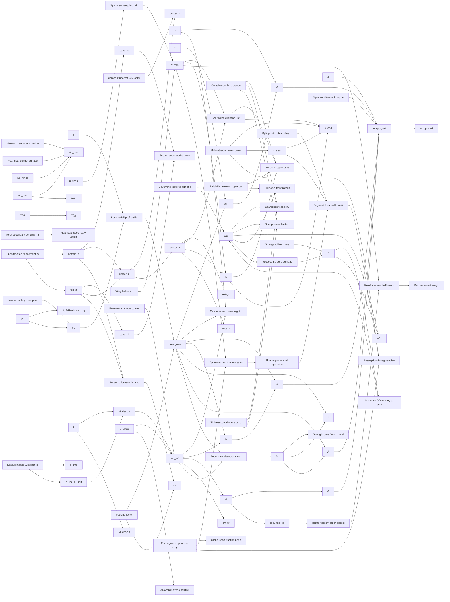

# structure

> 127 nodes · generated from the 2026-08-18 extraction. See [[README|the format and its rules]].

## Cross-cutting findings reported by the extraction

🟡 *Not independently verified — treat as leads, not verdicts.*

```text
SCOPE COVERED: app/services/spar_sizing.py, app/services/spar_plan_service.py, app/services/spar_insert_service.py, cad_designer/airplane/geometry/spar_solver.py, cad_designer/airplane/geometry/section_geometry.py, app/schemas/spar_plan.py, app/schemas/spar_sizing.py — all read in full. Consumer search done with grep across *.py/*.ts/*.tsx (node_modules excluded).

TWO PARALLEL PIPELINES, ONE DOMAIN. There are two independent spar-sizing paths and they do NOT share their orchestrator:
  (A) SIZING path — POST /aeroplanes/{id}/spanwise_loads_with_sizing → analysis_service._compute_spar_sizing_for_surfaces (app/services/analysis_service.py:2104) → spar_sizing.compute_spar_sizing. Produces per-station outer_mm / erf_W / solved_mm / mass. UI: frontend/components/workbench/SparSizingPanel.tsx.
  (B) PLAN path — POST /aeroplanes/{id}/spar-plan (+ /insert) → spar_plan_service.compute_spar_plan_object → spar_solver.build_stations_from_geometry + solve_spar_plan. Produces buildable pieces.
Both compute M_design = |M|·g_limit·j and erf_W independently (spar_sizing.py:315/318 vs spar_solver.py:764/765), both resolve sigma_allow independently (spar_sizing.py:294 vs spar_plan_service.py:309), both resolve g_limit independently (analysis_service.py:2153 vs spar_plan_service.py:351), each with its OWN _G_LIMIT_DEFAULT = 3.0 literal. Path (A) sizes the outer dimension from chord·(t/c)·packing; path (B) sizes it from the real lofted section band. They will disagree for the same aircraft. This is an ADR 0022 "one authority per user-facing quantity" question, but I am reporting it as an observation, not a verdict.

THE d³/10 LITERAL USED IN OPPOSITE DIRECTIONS. W_rod = d³/10 (spar_sizing.py:62) is an approximation of the exact solid-circular W = π·d³/32 = 0.09817·d³. d³/10 = 0.1·d³ overstates by ~1.9 %.
  - As a REQUIREMENT (spar_solver.required_section_modulus_from_od:521, spar_plan_service._erf_w_for_piece:218) overstating is conservative — the docstring at spar_plan_service.py:216 says exactly that ("~1.8 % conservative").
  - As a SUPPLY (spar_plan_service._w_stock:74, the section modulus a real rod stock item PROVIDES) overstating is UN-conservative: solid-rod stock is credited with 1.9 % more bending capacity than it physically has, and that value is compared against erf_w at spar_plan_service.py:159 to accept the stock.
Same literal, same file, opposite sign of error. Reported as an anomaly on `stock-section-modulus`.

SHAPE IS PARTIALLY WIRED IN THE PLAN PATH. SparPlanRequest.shape (tube|rod|rectangular|capped, app/schemas/spar_plan.py:166) reaches SparSpec (spar_plan_service.py:600-601), where it controls only (a) bore propagation (spar_solver.py:416) and (b) joint type telescoping-vs-joiner (spar_solver.py:439). The strength sizing itself is ALWAYS solve_dimension(shape="rod", …) at spar_solver.py:767 — `shape` is not in the `common` dict at spar_plan_service.py:567-573. Consequently a "rectangular" or "capped" request is sized as a round rod and SparPiece.width / .height / .cap_width are never assigned by any production code (only by test fixtures app/tests/test_spar_plan_rod_shape.py:252-274), so SparPieceOut.width/height/cap_width are always null on the wire and the frontend's shape-branching label (frontend/lib/sparPlanHelpers.ts pieceDimsLabel) always takes its "Ø <od> mm" fallback for those two shapes.

FOUR SECTION-MODULUS FORMULAS ARE DEAD IN PRODUCTION. section_modulus_rectangular / _capped / _rod / _tube (spar_sizing.py:40/48/57/65) have no production caller anywhere — only app/tests/test_spar_sizing_service.py:33-67. The real sizing path uses the algebraically inverted forms inlined in _solve_* instead. They are the documented definition of the inverted solvers, so they are not obviously deletable, but nothing reads them.

UI CANNOT REACH THE TORSION INPUTS. torsion_moments / rear_secondary_bending_fraction / pitching_moment_proxy_ratio (app/schemas/spar_plan.py:135/144/154) are never written by frontend/hooks/useSparPlan.ts buildPlanBody (which sends only material_id, moments, wing_name, front_x_over_chord, rear_x_over_chord, n_span, packing_factor, safety_factor_j, sigma_allow_mpa_override, shape). Every rear spar produced through the UI is therefore sized on the undocumented-in-UI proxy T(y) = 0.10·M(y) with zero secondary bending. The code itself flags this as a temporary proxy pending a #1002 extension (spar_plan_service.py:434-435).

ADR 0023 (RC/UAV-scale constants) OBSERVATIONS — reported, not adjudicated:
  - safety_factor_j = 1.5 (both schemas) carries no source in code. 1.5 is the CS-25/FAR-25 ultimate-to-limit factor; there is no RC/UAV-scale validation note anywhere in these files.
  - g_limit default 3.0 has no source in code, in any of its THREE definitions.
  - packing_factor 0.8, t/c fallback 0.12, wall_factor 0.6, telescope clearance 0.5 mm, rear clearance 0.03c, min rear x/c 0.05, front x/c 0.30, rear x/c 0.65, proxy ratio 0.10, negligible-OD floor 1.0 mm, collinearity tolerance 5.0 mm, stock density fallback 1550 kg/m³ — none carries a citation.
  - The ONLY real literature citation in the whole cluster is the module docstring at spar_sizing.py:6: "Reference: kirch Hauptholm (https://www.flugmodellbau-kirch.de/Hauptholm.htm) and the user's section-modulus scan." That is a German RC model-building source — scale-appropriate.
  - The other citation, spar_plan_service.py:62 "[Sadraey eq. 10.x / Anderson ch.5]", is not usable: "eq. 10.x" is a placeholder, and Anderson's *Fundamentals of Aerodynamics* ch.5 is finite-wing aerodynamics, not beam section modulus. Recorded verbatim on `stock-section-modulus` and flagged.

NOT FOUND / NO_SOURCE_FOUND: I found no derivation, no ADR reference and no external citation for any numeric constant in this cluster other than the two strings quoted above. I did not search _reversa_sdd/ (out of the stated file scope) — a spec anchor may exist there.

DUAL-MODE SECTION GEOMETRY: SectionPoint.thickness/top_z/bottom_z/center_z each have tw
```

## Nodes

| node | kind | unit | user-visible | source | flags |
|---|---|---|---|---|---|
| [[center-z-nearest-key-tolerance\|center_z nearest-key lookup tolerance]] | constant | m |  | 🔴 |  |
| [[default-front-x-c\|Assumed front-spar chord fraction]] | constant | dimensionless  |  | 🟢 | anomaly, divergence, scale |
| [[fit-tol-mm\|Containment fit tolerance]] | constant | mm |  | 🔴 | anomaly |
| [[fraction-tol\|Split-position boundary tolerance]] | constant | dimensionless  |  | 🔴 | anomaly |
| [[has-cadquery\|CadQuery availability flag]] | constant | boolean | ✓ | 🔴 |  |
| [[inboard-collinear-tolerance\|Root collinearity tolerance]] | constant | mm | ✓ | 🔴 | anomaly |
| [[max-thickness-chord-scan\|Max-thickness chord search grid]] | constant | dimensionless  | ✓ | 🟡 | anomaly, divergence |
| [[min-rear-x-c\|Minimum rear-spar chord location]] | constant | dimensionless  | ✓ | 🔴 | anomaly |
| [[min-spar-spacing\|Minimum front–rear spar spacing fraction]] | constant | dimensionless  |  | 🔴 | anomaly |
| [[mm-per-metre-factor\|Metre-to-millimetre conversion factor]] | constant | mm/m |  | 🟢 |  |
| [[mm-to-m-factor\|Millimetre-to-metre conversion factor]] | constant | m/mm |  | 🟢 | anomaly |
| [[mm2-to-m2-factor\|Square-millimetre to square-metre factor]] | constant | m²/mm² |  | 🟢 |  |
| [[negligible-od-floor-mm\|Buildable-minimum spar outer diameter]] | constant | mm | ✓ | 🔴 | anomaly |
| [[per-segment-chord-grid\|Per-segment chord sampling grid]] | constant | dimensionless  | ✓ | 🔴 | anomaly |
| [[points-per-edge\|Slice outline sampling density]] | constant | count |  | 🔴 | anomaly |
| [[rear-clearance-fraction\|Rear-spar control-surface clearance]] | constant | dimensionless  |  | 🟡 | anomaly, divergence, scale |
| [[reinforcement-utilisation\|Reinforcement utilisation (hardcoded)]] | constant | dimensionless | ✓ | 🔴 | anomaly |
| [[rod-fit-tolerance\|Rod fit tolerance]] | constant | mm |  | 🔴 |  |
| [[rod-outer-fallback-1mm\|Rod sizing outer-dimension floor]] | constant | mm |  | 🔴 | anomaly |
| [[root-eps\|Root sampling epsilon]] | constant | dimensionless  |  | 🔴 |  |
| [[spar-index-invariant\|Spar index assignment (hard invariant)]] | constant | index | ✓ | 🟡 | divergence |
| [[stock-density-fallback\|Stock density fallback]] | constant | kg/m³ |  | 🔴 | anomaly |
| [[structure--g-limit-default\|Default manoeuvre limit load factor]] | constant | g | ✓ | 🟡 | anomaly, divergence |
| [[structure--sigma-allow-positivity-guard\|Allowable-stress positivity guard]] | constant | MPa | ✓ | 🟡 | divergence |
| [[tc-fallback-ratio\|Thickness-to-chord fallback ratio]] | constant | dimensionless | ✓ | 🟡 | anomaly, divergence, scale |
| [[tc-nearest-key-tolerance\|t/c nearest-key lookup tolerance]] | constant | m |  | 🔴 |  |
| [[telescope-clearance-mm\|Telescoping radial clearance]] | constant | mm |  | 🟡 | anomaly, divergence |
| [[w-eq-tol\|Section-modulus float-equality tolerance]] | constant | mm³ (also reus |  | 🔴 | anomaly |
| [[wall-factor\|Tube wall fraction fallback]] | constant | dimensionless |  | 🔴 | anomaly |
| [[cap-width-mm\|Cap/flange width]] | parameter | mm | ✓ | 🟢 | anomaly, divergence |
| [[material-density\|Material density]] | parameter | kg/m³ | ✓ | 🔴 |  |
| [[n-span\|Number of spanwise stations]] | parameter | count | ✓ | 🔴 | anomaly |
| [[pitching-moment-proxy-ratio\|Pitching-moment proxy ratio]] | parameter | dimensionless | ✓ | 🔴 | anomaly |
| [[rear-secondary-bending-fraction\|Rear secondary bending fraction]] | parameter | dimensionless | ✓ | 🔴 | anomaly |
| [[rear-x-over-chord\|Rear-spar chord fraction (requested)]] | parameter | dimensionless  | ✓ | 🟢 | anomaly, divergence, scale |
| [[resolved-g-limit-plan\|Limit load factor (plan path)]] | parameter | g |  | 🟡 | anomaly, divergence |
| [[resolved-sigma-allow-plan\|Allowable bending stress (plan path)]] | parameter | MPa (N/mm²) |  | 🟡 | anomaly, divergence |
| [[sigma-allow-mpa\|Allowable bending stress (sizing path)]] | parameter | MPa (N/mm²) | ✓ | 🟡 | anomaly, divergence |
| [[spar-shape\|Spar cross-section shape]] | parameter | - | ✓ | 🟢 | anomaly, divergence |
| [[structure--g-limit\|Manoeuvre limit load factor]] | parameter | g | ✓ | 🟢 | anomaly, divergence, scale |
| [[structure--packing-factor\|Packing factor]] | parameter | dimensionless | ✓ | 🔴 | anomaly |
| [[structure--safety-factor-j\|Safety factor j]] | parameter | dimensionless | ✓ | 🟢 | anomaly, divergence, scale |
| [[axis-z-at\|Straight-piece axis height at a station]] | quantity | mm |  | 🟡 |  |
| [[band-hi\|Contained band upper bound]] | quantity | mm |  | 🟡 |  |
| [[band-lo\|Contained band lower bound]] | quantity | mm |  | 🟡 |  |
| [[bore-for\|Strength bore from tube sizing]] | quantity | mm |  | 🟡 | anomaly, divergence |
| [[capped-cross-section-area\|Capped-spar cross-section area]] | quantity | mm² | ✓ | 🟢 | anomaly, divergence |
| [[capped-gurt-thickness\|Capped-spar flange (gurt) thickness]] | quantity | mm | ✓ | 🟢 |  |
| [[capped-inner-cube\|Capped-spar inner-height cube]] | quantity | mm³ |  | 🟢 |  |
| [[capped-inner-height\|Capped-spar inner gap height]] | quantity | mm |  | 🟢 |  |
| [[center-z-mm\|Section mid-height (spar placement reference)]] | quantity | mm | ✓ | 🟡 | anomaly, divergence |
| [[chord-mm\|Local chord in millimetres]] | quantity | mm |  | 🟢 |  |
| [[design-bending-moment\|Design bending moment]] | quantity | N·m | ✓ | 🟡 | anomaly, divergence, scale |
| [[erf-w-for-piece\|Reconstructed required section modulus for a piece]] | quantity | mm³ |  | 🟡 | anomaly, divergence |
| [[front-moment-fn\|Front-spar bending moment interpolator]] | quantity | N·m |  | 🟢 | anomaly, divergence |
| [[governing-od\|Governing required OD of a piece]] | quantity | mm |  | 🟢 | divergence |
| [[half-span-mm\|Wing half-span]] | quantity | mm |  | 🔴 | anomaly |
| [[host-root-y\|Host segment root spanwise position]] | quantity | mm |  | 🔴 | anomaly |
| [[max-od-for-run\|Largest containable OD for a run]] | quantity | mm |  | 🟡 |  |
| [[max-od-from-stations\|Containment-band OD limit at governing station]] | quantity | mm |  | 🟡 | anomaly, divergence |
| [[min-od-for-bore\|Minimum OD to carry a bore]] | quantity | mm |  | 🔴 | anomaly |
| [[no-spar-from-y\|No-spar region start]] | quantity | mm (m in the A | ✓ | 🔴 |  |
| [[per-segment-y-global\|Global span fraction per segment station]] | quantity | dimensionless  | ✓ | 🔴 |  |
| [[piece-bore\|Spar piece inner diameter]] | quantity | mm | ✓ | 🟡 | anomaly, divergence |
| [[piece-direction-vector\|Spar piece direction unit vector]] | quantity | dimensionless  | ✓ | 🟡 | anomaly |
| [[piece-feasible\|Spar piece feasibility]] | quantity | boolean | ✓ | 🟡 | anomaly, divergence |
| [[piece-length\|Spar piece length]] | quantity | mm | ✓ | 🟡 |  |
| [[piece-outer-diameter\|Spar piece outer diameter]] | quantity | mm | ✓ | 🟡 | anomaly, divergence |
| [[piece-utilisation\|Spar piece utilisation]] | quantity | dimensionless | ✓ | 🔴 | anomaly |
| [[piece-wall\|Spar piece wall thickness]] | quantity | mm | ✓ | 🟡 | anomaly, divergence |
| [[piece-y-end\|Spar piece tip spanwise position]] | quantity | m | ✓ | 🔴 |  |
| [[piece-y-start\|Spar piece root spanwise position]] | quantity | m | ✓ | 🔴 |  |
| [[profile-thickness-mm\|Local airfoil profile thickness]] | quantity | mm | ✓ | 🟢 | divergence |
| [[real-front-pieces\|Buildable front pieces]] | quantity | - |  | 🔴 | anomaly |
| [[rear-moment-fn\|Rear-spar sizing moment]] | quantity | N·m |  | 🟡 | divergence, scale |
| [[rear-secondary-bending\|Rear-spar secondary bending share]] | quantity | N·m |  | 🟡 | divergence |
| [[rear-spar-x-c-clamped\|Clamped rear-spar chord location]] | quantity | dimensionless  | ✓ | 🟡 | anomaly, divergence, scale |
| [[rear-torsion-reaction\|Rear-spar torsion reaction]] | quantity | N·m (see anoma |  | 🟡 | anomaly, divergence |
| [[rectangular-cross-section-area\|Rectangular cross-section area]] | quantity | mm² | ✓ | 🟡 |  |
| [[reinforcement-length\|Reinforcement length]] | quantity | mm | ✓ | 🔴 |  |
| [[reinforcement-reach\|Reinforcement half-reach]] | quantity | mm |  | 🔴 | anomaly |
| [[reinforcement-root-od\|Reinforcement outer diameter]] | quantity | mm | ✓ | 🟡 | anomaly, divergence |
| [[required-section-modulus\|Required section modulus]] | quantity | mm³ | ✓ | 🟢 | divergence |
| [[required-section-modulus-from-od\|Section modulus provided by a solid rod]] | quantity | mm³ |  | 🟡 | anomaly, divergence |
| [[rod-cross-section-area\|Rod cross-section area]] | quantity | mm² | ✓ | 🟡 | anomaly |
| [[root-centreline-z\|Root centreline height]] | quantity | mm |  | 🟡 | anomaly |
| [[root-station\|Root sizing station]] | quantity | - | ✓ | 🟢 | anomaly, divergence |
| [[section-bottom-z-analytic\|Section lower surface height (analytic)]] | quantity | mm | ✓ | 🟡 |  |
| [[section-center-z-analytic\|Section mid-height (analytic)]] | quantity | mm | ✓ | 🟡 | divergence |
| [[section-depth-at-governing\|Section depth at the governing station]] | quantity | mm | ✓ | 🟡 | divergence |
| [[section-modulus-capped\|Section modulus, capped (I/C-beam)]] | quantity | mm³ |  | 🟢 | anomaly, divergence |
| [[section-modulus-rectangular\|Section modulus, solid rectangle]] | quantity | mm³ |  | 🟡 | anomaly |
| [[section-modulus-rod\|Section modulus, solid round rod]] | quantity | mm³ |  | 🟡 | anomaly, divergence |
| [[section-modulus-tube\|Section modulus, circular tube]] | quantity | mm³ |  | 🟡 | anomaly |
| [[section-thickness-analytic\|Section thickness (analytic)]] | quantity | mm | ✓ | 🟢 | divergence |
| [[section-top-z-analytic\|Section upper surface height (analytic)]] | quantity | mm | ✓ | 🟡 | divergence |
| [[segment-for-y\|Spanwise position to segment index]] | quantity | index | ✓ | 🔴 | anomaly |
| [[segment-lengths\|Per-segment spanwise lengths]] | quantity | mm |  | 🔴 | anomaly |
| [[solved-rectangular-width\|Solved rectangular width]] | quantity | mm | ✓ | 🟡 | anomaly, divergence |
| [[solved-rod-diameter\|Solved rod diameter]] | quantity | mm | ✓ | 🟡 | divergence |
| [[solved-tube-inner-diameter\|Solved tube inner diameter]] | quantity | mm | ✓ | 🟡 |  |
| [[solved-tube-wall\|Solved tube wall thickness]] | quantity | mm | ✓ | 🟡 |  |
| [[spar-mass-full\|Full-span spar mass]] | quantity | kg | ✓ | 🔴 | anomaly |
| [[spar-mass-half\|Half-span spar mass]] | quantity | kg | ✓ | 🟡 | anomaly, divergence, scale |
| [[spar-outer-dimension\|Spar outer dimension]] | quantity | mm | ✓ | 🟡 | anomaly, divergence |
| [[spar-spacing-fraction\|Front–rear spar chordwise spacing]] | quantity | dimensionless  |  | 🟡 | anomaly, divergence, scale |
| [[split-local-length\|Segment-local split position]] | quantity | mm | ✓ | 🟡 | divergence |
| [[station-center-z\|Station centre height]] | quantity | mm | ✓ | 🟡 |  |
| [[station-clearance\|Station packing clearance]] | quantity | mm |  | 🔴 |  |
| [[station-design-moment\|Station design moment (plan path)]] | quantity | N·m |  | 🟡 | anomaly, divergence, scale |
| [[station-erf-w\|Station required section modulus (plan path)]] | quantity | mm³ |  | 🟢 | anomaly, divergence |
| [[station-required-od\|Station strength-required OD]] | quantity | mm |  | 🟡 | anomaly, divergence |
| [[station-y-mm\|Station spanwise position]] | quantity | mm | ✓ | 🔴 |  |
| [[stock-linear-mass\|Linear mass of a stock cross-section]] | quantity | kg/m |  | 🟡 | anomaly |
| [[stock-section-modulus\|Section modulus of a real stock item]] | quantity | mm³ |  | 🟡 | anomaly, divergence |
| [[strength-bore\|Strength-driven bore]] | quantity | mm |  | 🟡 |  |
| [[subsegment-lengths-m\|Post-split sub-segment lengths]] | quantity | m | ✓ | 🔴 | anomaly |
| [[tc-fallback-warning\|t/c fallback warning]] | quantity | - | ✓ | 🔴 |  |
| [[tc-ratio\|Thickness-to-chord ratio at station]] | quantity | dimensionless | ✓ | 🟢 | divergence |
| [[telescope-bore\|Telescoping bore demand]] | quantity | mm |  | 🟡 | divergence |
| [[tightest-band\|Tightest containment band for a piece]] | quantity | mm |  | 🟡 |  |
| [[torsion-proxy\|Torsion proxy from bending moment]] | quantity | N·m |  | 🔴 | anomaly |
| [[tube-cross-section-area\|Tube cross-section area]] | quantity | mm² | ✓ | 🟡 |  |
| [[tube-solve-discriminant\|Tube inner-diameter discriminant]] | quantity | mm⁴ |  | 🟡 |  |
| [[wing-hinge-x-c\|Most-forward control-surface hinge]] | quantity | dimensionless  |  | 🟢 | anomaly, divergence, scale |
| [[y-span-to-segment\|Span fraction to segment mapping]] | quantity | (index, dimens |  | 🔴 | anomaly |
| [[y-spans-grid\|Spanwise sampling grid]] | quantity | dimensionless  |  | 🔴 |  |

## Graph — user-visible quantities and what feeds them



