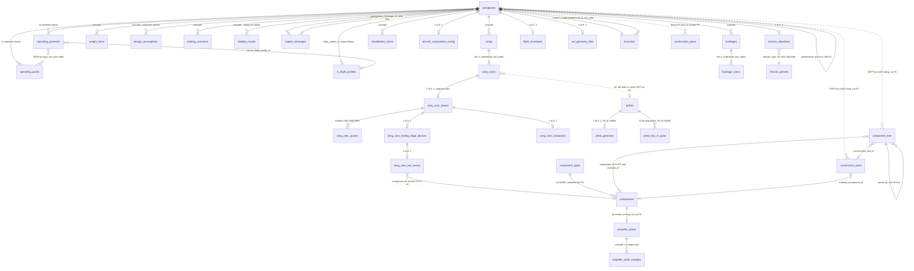
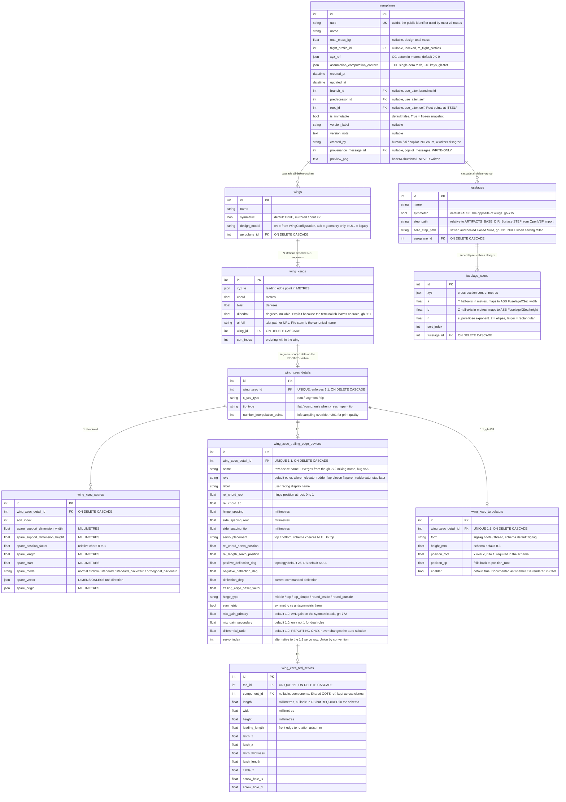
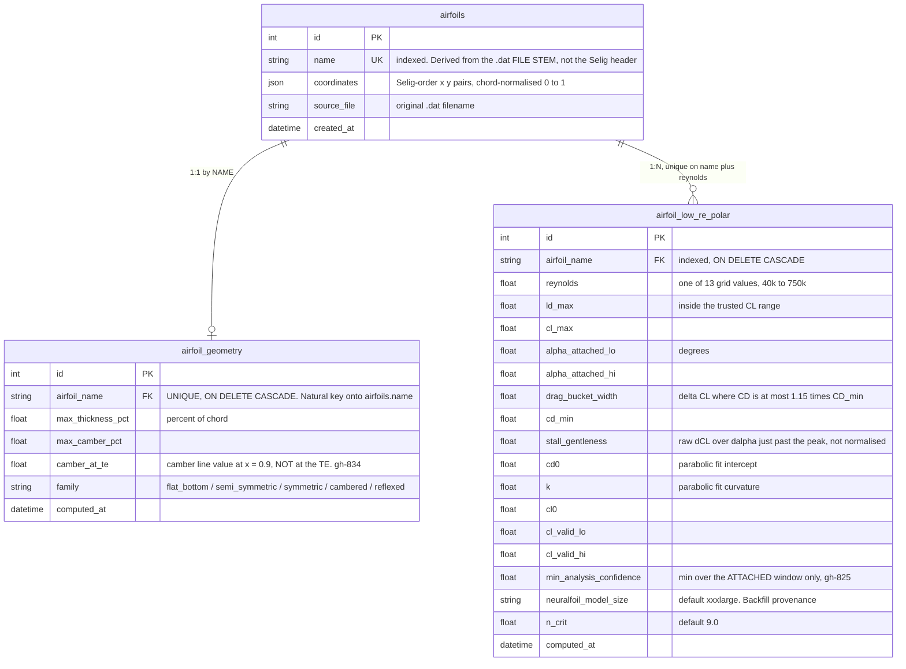
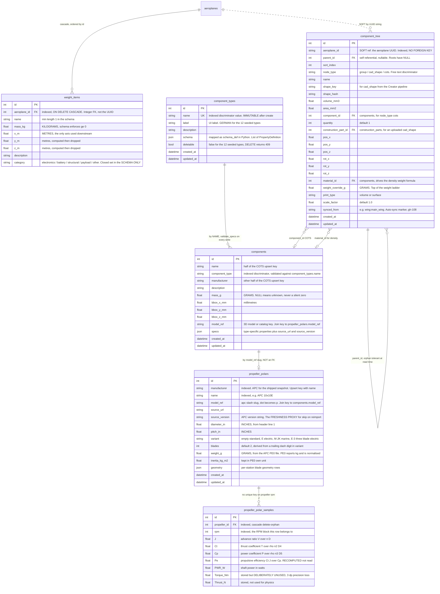
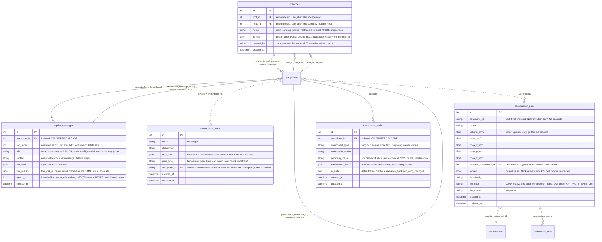

# Complete ERD — 35 tables

> Produced by the **Reversa Architect** (`doc_level = completo`).
> Authoritative field source: [`data-dictionary.md`](data-dictionary.md).
> Confidence: 🟢 CONFIRMED · 🟡 INFERRED · 🔴 GAP.

---

## 0. Reading rules

* **Implicit PK.** Every model inherits `app/db/base.py::Base`, which declares
  `id = Column(Integer, primary_key=True, index=True)`. It is shown explicitly
  in the diagrams below for clarity. 🟢
* **Units.** The database is **metres** except where noted. Two documented
  exceptions: all six dimensional columns of `wing_xsec_spares` are
  **millimetres** (gh-402), and `components.mass_g` /
  `propeller_polars.weight_g` / `component_tree.weight_override_g` are
  **grams**. `propeller_polars.diameter_in` / `pitch_in` are **inches** (the APC
  source unit). `operating_points.alpha` / `.beta` are **radians** while every
  schema and ASB consumer uses degrees. ADR 0001. 🟢
* **Relationship notation.** `--` is an enforced FK; `..` is a **soft
  reference** — a plain `String`/`Integer` column that carries a foreign key by
  convention only, with no DDL constraint and therefore no cascade and no
  reflection.
* **Angles** are degrees everywhere in the persisted model except the two
  operating-point columns above.

### The soft references — the ERD's most important caveat 🔴

Three tables reference an aeroplane by a plain column instead of a declared FK.
They are **invisible to SQLAlchemy `ForeignKey` reflection**, which is exactly
what `test_aeroplane_clone_coverage.py` uses to discover related tables — so
they must be registered in the clone registry by hand, and a missed entry would
be silently uncovered.

| Table | Column | Type | Holds | Consequence |
|---|---|---|---|---|
| `component_tree` | `aeroplane_id` | `String`, indexed, **no FK** | the aeroplane **UUID** | no cascade on aeroplane delete; hand-registered in `CLONED_TABLES` |
| `construction_parts` | `aeroplane_id` | `String`, indexed, **no FK** | the aeroplane UUID | no cascade; hand-registered in `EXCLUDED_TABLES` (file-backed, stale paths) |
| `construction_plans` | `aeroplane_id` | `String` **with** an FK to `aeroplanes.id` (an `Integer` PK) | 🔴 **type mismatch** | SQLite's dynamic typing tolerates it; **PostgreSQL would reject the constraint**. No `ON DELETE`. |

A fourth is conceptual only: `mission_objectives.mission_type` is logically a FK
to `mission_presets.id` (a `String` PK) but is **not declared** — an unknown
`mission_type` is a silent no-op in `_apply_preset_estimates`. 🔴

---

## 1. Master relationship map (all 35 tables)

Attributes omitted for legibility; see §2–§6.



---

## 2. Cluster A — the aircraft aggregate (wings, fuselages)



**Structural rules carried by this cluster** 🟢

* **N stations ⇒ N−1 segments.** All segment-scoped data (spars, TED,
  turbulator, `x_sec_type`, `tip_type`, `number_interpolation_points`) hangs off
  the **inboard** station via the 1:1 `wing_xsec_details` side table.
* **The terminal station carries geometry only** — enforced in three independent
  layers (the Pydantic validator `validate_last_xsec_has_no_segment_details`,
  `WingModel.from_dict` blanking six fields, and the service guard
  `_assert_non_terminal_xsec_or_raise`).
* **`wing_xsecs.airfoil` is a path/name, not an FK.** There is no referential
  link to `airfoils`; resolution is by file stem against
  `components/airfoils/`. 🟡
* 🔴 `WingModel.units` and `WingUnitsSchema` both advertise
  `detail_length: "m"` while `wing_xsec_spares` stores millimetres — the
  self-describing units block cannot express the exception.

---

## 3. Cluster B — airfoil catalogue



* 🔴 Both child tables FK onto `airfoils.name` (a natural key) with
  `ON DELETE CASCADE` but **no `ON UPDATE CASCADE`** — renaming an airfoil
  breaks the relation.
* 🟡 `AirfoilModel` has **no ORM relationship** to either child; joins are done
  by name in the services. Deliberate (avoids loading 1 665 × 13 rows) but
  undocumented.

---

## 4. Cluster C — analysis, sizing and design intent

```mermaid
erDiagram
    operating_points {
        int id PK
        string name "cruise, turn_40, best_rate_climb_vy, ..."
        string description "generated: config, target_n, V, altitude"
        int aircraft_id FK "indexed, aeroplanes. NO ondelete clause"
        string config "clean / takeoff / landing, default clean"
        string status "NOT_TRIMMED / COMPUTING / TRIMMED / LIMIT_REACHED / DIRTY / INVALID"
        json warnings "STALE_NO_POLAR, FLAP_DEFLECTION_CLIPPED, ALPHA_LIMIT_REACHED, ..."
        json controls "trim solver output, control name to degrees"
        float velocity "metres per second"
        float alpha "RADIANS in the DB, degrees in every schema"
        float beta "RADIANS"
        float p "body roll rate, rad per s"
        float q "body pitch rate"
        float r "body yaw rate"
        json xyz_ref "moment reference = design CG, written as design_cg_x 0 0"
        float altitude "metres"
        json control_deflections "MANUAL override. Wins over controls when non-empty"
        json trim_enrichment "serialised TrimEnrichment"
    }
    operating_pointsets {
        int id PK
        string name "generated set is default_operating_point_set"
        string description
        int aircraft_id FK "indexed"
        int source_flight_profile_id FK "indexed, rc_flight_profiles"
        json operating_points "ARRAY OF operating_points.id. Not an association table"
    }
    stability_results {
        int id PK
        int aeroplane_id FK "indexed, ON DELETE CASCADE. Unique together with solver"
        string solver "avl / aerobuildup / vortex_lattice"
        float neutral_point_x "metres, from result.reference.Xnp"
        float mac "metres, result.reference.Cref"
        float cg_x_used "operating_point.xyz_ref index 0"
        float static_margin_pct "100 times Xnp minus Xcg over MAC"
        string stability_class "stable above 5 pct / neutral 0 to 5 / unstable below 0"
        float cg_range_forward "Xnp minus 0.25 MAC"
        float cg_range_aft "Xnp minus 0.05 MAC"
        float Cma "stable when negative"
        float Cnb "stable when positive"
        float Clb "stable when negative"
        float trim_alpha_deg
        float trim_elevator_deg "first deflection whose name contains elevator. Misses gh-772 names"
        bool is_statically_stable
        bool is_directionally_stable
        bool is_laterally_stable
        datetime computed_at
        string status "CURRENT / DIRTY. Read order is status ASC then computed_at DESC"
        string geometry_hash "sha256 of stability-relevant geometry, first 16 hex"
    }
    aircraft_computation_config {
        int id PK
        int aeroplane_id FK "UNIQUE per aeroplane"
        float coarse_alpha_min_deg "default -5"
        float coarse_alpha_max_deg "default 25"
        float coarse_alpha_step_deg "default 1"
        float fine_alpha_margin_deg "default 5, fine sweep spans stall alpha plus or minus"
        float fine_alpha_step_deg "default 0.5"
        int fine_velocity_count "default 8"
        float debounce_seconds "default 2.0"
    }
    avl_geometry_files {
        int id PK
        int aeroplane_id FK "UNIQUE, indexed, ON DELETE CASCADE"
        text content "the full .avl file"
        bool is_dirty "set by geometry listeners, NEVER auto-cleared"
        bool is_user_edited "content is returned only when user_edited AND NOT dirty"
        datetime created_at
        datetime updated_at
    }
    design_assumptions {
        int id PK
        int aeroplane_id FK "indexed, ON DELETE CASCADE. Unique with parameter_name"
        string parameter_name "one of 15 VALID_PARAMETERS"
        float estimate_value "the designer manual value"
        float calculated_value "written by recompute and the mass syncs"
        string calculated_source "aerobuildup / best_glide_v_md / stability_analysis / weight_items / component_tree"
        string active_source "ESTIMATE or CALCULATED, default ESTIMATE"
        float divergence_pct "abs est minus calc over abs calc times 100"
        datetime updated_at
    }
    mission_objectives {
        int id PK
        int aeroplane_id FK "UNIQUE, indexed, ON DELETE CASCADE"
        string mission_type "default trainer. Conceptually FK to mission_presets, NOT declared"
        float target_cruise_mps "default 18"
        float target_stall_safety "default 1.8, V_cruise over V_s1"
        float target_maneuver_n "default 3.0 g"
        float target_glide_ld "default 12"
        float target_climb_energy "default 22, CL to the 1.5 over CD"
        float target_wing_loading_n_m2 "default 412"
        float target_field_length_m "default 50"
        float available_runway_m "default 50, migrated out of assumptions"
        string runway_type "grass / asphalt / belly"
        float t_static_N "default 18, static thrust at V zero"
        string takeoff_mode "runway / hand_launch / bungee / catapult"
        string landing_surface "grass_short / grass_long / hard_paved / soft_soil / belly_grass / net_recovery"
        float landing_safety_factor "1.0 to 3.0, unset means 1.5"
        float available_field_length_m "unset means no sufficiency check"
    }
    mission_presets {
        string id PK "STRING primary key: trainer, sport, sailplane, wing_racer, acro_3d, ..."
        string label
        string description
        json target_polygon "axis to 0..1 score, the target polygon"
        json axis_ranges "axis to min max, normalisation ranges"
        json suggested_estimates "g_limit, target_static_margin, cl_max, power_to_weight, prop_efficiency"
    }
    loading_scenarios {
        int id PK
        int aeroplane_id FK "indexed, ON DELETE CASCADE"
        string name "e.g. Full tank plus pilot"
        string aircraft_class "default rc_trainer, drives the template library"
        json component_overrides "toggles, mass_overrides, position_overrides, adhoc_items"
        bool is_default "the default scenario supplies cg_agg_m"
        datetime created_at
    }
    flight_envelopes {
        int id PK
        int aeroplane_id FK "UNIQUE, indexed, ON DELETE CASCADE. Upserted per recompute"
        json vn_curve_json "60 points each side, gust lines, gust warnings"
        json kpis_json "exactly 6 PerformanceKPI with a confidence tier"
        json markers_json "VnMarker per OP. load_factor is ALWAYS 1.0 today"
        json assumptions_snapshot "mass, cl_max, g_limit effective at compute time"
        datetime computed_at
    }
    rc_flight_profiles {
        int id PK
        string name UK "indexed, e.g. rc_trainer_balanced. GLOBAL library, not per aeroplane"
        string type "FlightProfileType category"
        json environment "altitude_m, wind_mps"
        json goals "cruise_speed_mps, max_level_speed_mps, margins, target_turn_n, loiter_s"
        json handling "desired handling qualities"
        json constraints "max_alpha_deg, max_beta_deg"
        datetime created_at
        datetime updated_at
    }

    aeroplanes ||--o{ operating_points : "no ondelete"
    aeroplanes ||--o{ operating_pointsets : "no ondelete"
    aeroplanes ||--o{ stability_results : "unique per solver"
    aeroplanes ||--o| aircraft_computation_config : "1 to 0..1"
    aeroplanes ||--o| avl_geometry_files : "1 to 0..1"
    aeroplanes ||--o{ design_assumptions : "unique per parameter_name"
    aeroplanes ||--o| mission_objectives : "1 to 0..1"
    aeroplanes ||--o{ loading_scenarios : "1:N"
    aeroplanes ||--o| flight_envelopes : "1 to 0..1"
    aeroplanes }o--o| rc_flight_profiles : "flight_profile_id, delete refused with 409"
    operating_pointsets }o--o| rc_flight_profiles : "source_flight_profile_id"
    operating_pointsets }o..o{ operating_points : "JSON id array"
    mission_objectives }o..|| mission_presets : "mission_type, FK NOT DECLARED"
```



* 🔴 `operating_points.aircraft_id` and `operating_pointsets.aircraft_id` carry
  **no `ondelete` clause** — unlike every other aeroplane child.
* 🔴 `operating_pointsets.operating_points` is a **JSON array of ids**, not an
  association table: nothing enforces that the referenced OPs still exist.
* 🔴 `stability_results.trim_elevator_deg` matches on the substring `"elevator"`
  and therefore never matches a gh-772 mixing name such as
  `[ruddervator]pitch_htail_1` (bug 955).

---

## 5. Cluster D — mass, components and powertrain



* 🔴 **Two independent mass producers write the same
  `design_assumptions.calculated_value`** — `weight_items` and the component
  tree — last write wins. `calculated_source` records who won; nothing warns
  that the other estimate was discarded.
* 🔴 `weight_items` has **no `component_id`**: a battery entered as a weight
  item and the same battery placed in the component tree are unrelated rows, so
  double-counting is possible and undetected.
* 🔴 `propeller_polar_samples` has **no unique constraint** on
  `(propeller_id, rpm, J)`; duplicate protection comes only from
  `_upsert_samples` deleting all rows before re-inserting.
* 🔴 `component_types.schema` is mapped as `schema_def` in Python because the
  attribute name `schema` collides with Pydantic — a recurring trap for
  implementer agents writing migrations.

---

## 6. Cluster E — versioning, conversation and CAD artefacts



**The circular FK** 🟢 — `aeroplanes.branch_id → branches.id` and
`branches.root_id/head_id → aeroplanes.id` form a genuine cycle. All four
constraints carry `use_alter=True` so Alembic emits them as separate
`ALTER TABLE` statements. SQLite ignores FK deferral, which is why
`discard_branch` explicitly NULLs inbound `predecessor_id` values before
deleting, and why `create_aeroplane` needs a three-step flush dance.

**The partial unique index** 🟢 — declared identically in the model and the
migration so `create_all` (tests) and a migrated DB match:

```sql
CREATE UNIQUE INDEX uq_branches_one_main_per_root ON branches (root_id)
  WHERE is_main = 1        -- postgresql_where: is_main = true
```

🔴 `tessellation_cache` has **no unique constraint** on its logical key
`(aeroplane_id, component_type, component_name)` even though `get_cached(...)
.first()` treats it as one — two concurrent inserts produce duplicate rows and
`.first()` silently picks one (**TD-09**).

---

## 7. Clone coverage — which tables travel with a version

`aeroplane_clone_service` deep-copies **17 tables** in a fixed order, flushing
between groups so generated PKs are available for FK re-keying. It never
commits — `get_db()` owns the boundary. ADR 0006. 🟢

| Cloned (17) | Excluded (18) + reason |
|---|---|
| `aeroplanes`, `wings`, `wing_xsecs`, `wing_xsec_details`, `wing_xsec_spares`, `wing_xsec_trailing_edge_devices`, `wing_xsec_turbulators`, `wing_xsec_ted_servos`, `fuselages`, `fuselage_xsecs`, `weight_items`, `mission_objectives`, `design_assumptions`, `aircraft_computation_config`, `stability_results`, `loading_scenarios`, `component_tree` | **shared library**: `rc_flight_profiles`, `components`, `component_types`, `airfoils`, `airfoil_low_re`, `rc_flight_profile_entries`, `mission_presets` · **transient**: `operating_points`, `operating_pointsets`, `flight_envelopes` · **conversation**: `copilot_messages` · **versioning meta**: `branches` · **construction**: `construction_plans`, `construction_parts` (soft string FK, file-backed) · **caches**: `tessellation_cache`, `avl_geometry_files` · **non-tables**: `avl_geometry_events`, `stability_events`, `alembic_version` |

Re-keyed on clone: `loading_scenarios.component_overrides[*].component_uuid`
via `weight_id_map`, and `component_tree.parent_id` via a two-pass `id_map`.
Kept as **shared references**: `aeroplanes.flight_profile_id`,
`wing_xsec_ted_servos.component_id`, `component_tree.component_id` /
`construction_part_id` / `material_id`. Reset to NULL: `fuselages.step_path`,
`solid_step_path`, and all five version-metadata columns.

🔴 **Coverage blind spot** — the invariant test discovers related tables by
introspecting SQLAlchemy `ForeignKey` objects, so the three soft-reference
tables of §0 are invisible to it and must be maintained by hand.

---

## 8. Indexes, constraints and unique keys — consolidated

| Constraint | Table | Kind |
|---|---|---|
| `uq_branches_one_main_per_root` | `branches` | partial unique index on `root_id WHERE is_main` |
| `uq_stability_aeroplane_solver` | `stability_results` | unique `(aeroplane_id, solver)` |
| `uq_computation_config_aeroplane` | `aircraft_computation_config` | unique `(aeroplane_id)` |
| `uq_avl_geometry_files_aeroplane_id` | `avl_geometry_files` | unique `(aeroplane_id)` |
| `uq_assumption_aeroplane_param` | `design_assumptions` | unique `(aeroplane_id, parameter_name)` |
| unique FK | `mission_objectives`, `flight_envelopes` | one row per aeroplane |
| unique FK | `wing_xsec_details`, `wing_xsec_trailing_edge_devices`, `wing_xsec_turbulators`, `wing_xsec_ted_servos` | enforce the 1:1 side tables |
| unique | `airfoils.name`, `airfoil_geometry.airfoil_name`, `component_types.name`, `rc_flight_profiles.name`, `aeroplanes.uuid` | natural / public keys |
| unique | `airfoil_low_re_polar (airfoil_name, reynolds)` | makes the backfill idempotent |
| 🔴 **missing** | `tessellation_cache (aeroplane_id, component_type, component_name)` | treated as unique by the code |
| 🔴 **missing** | `propeller_polar_samples (propeller_id, rpm, J)` | protected only by delete-then-insert |
| 🔴 **missing** | `branches (root_id, name)` | uniqueness checked only on *rename*, not on create |

---

*Related: [`data-dictionary.md`](data-dictionary.md) (authoritative fields) ·
[`architecture.md`](architecture.md) (technical-debt register) ·
[`adrs/0006`](adrs/0006-versioning-by-row-copy-not-json-snapshots.md) ·
[`adrs/0013`](adrs/0013-one-components-table-with-a-data-driven-type-schema.md)*
