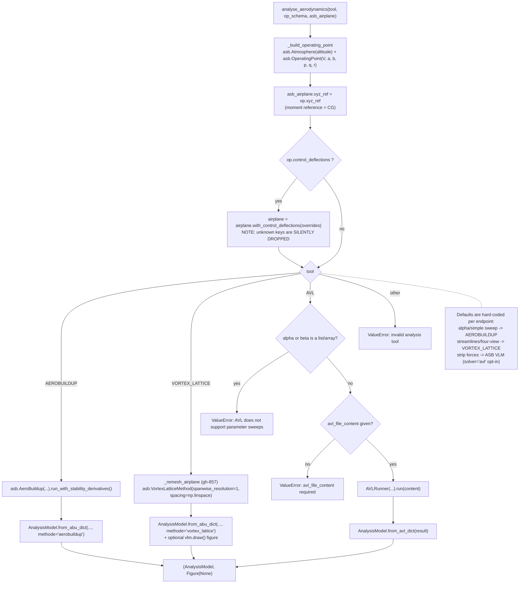
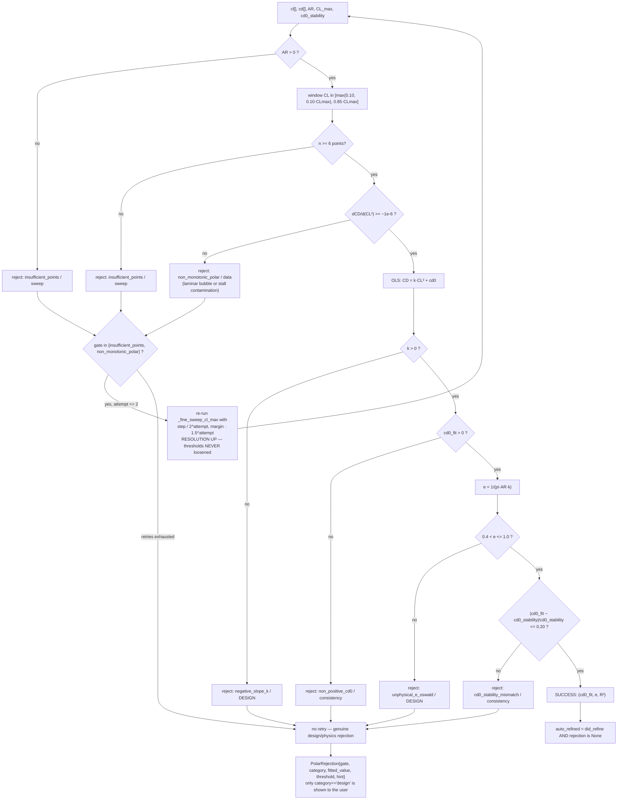
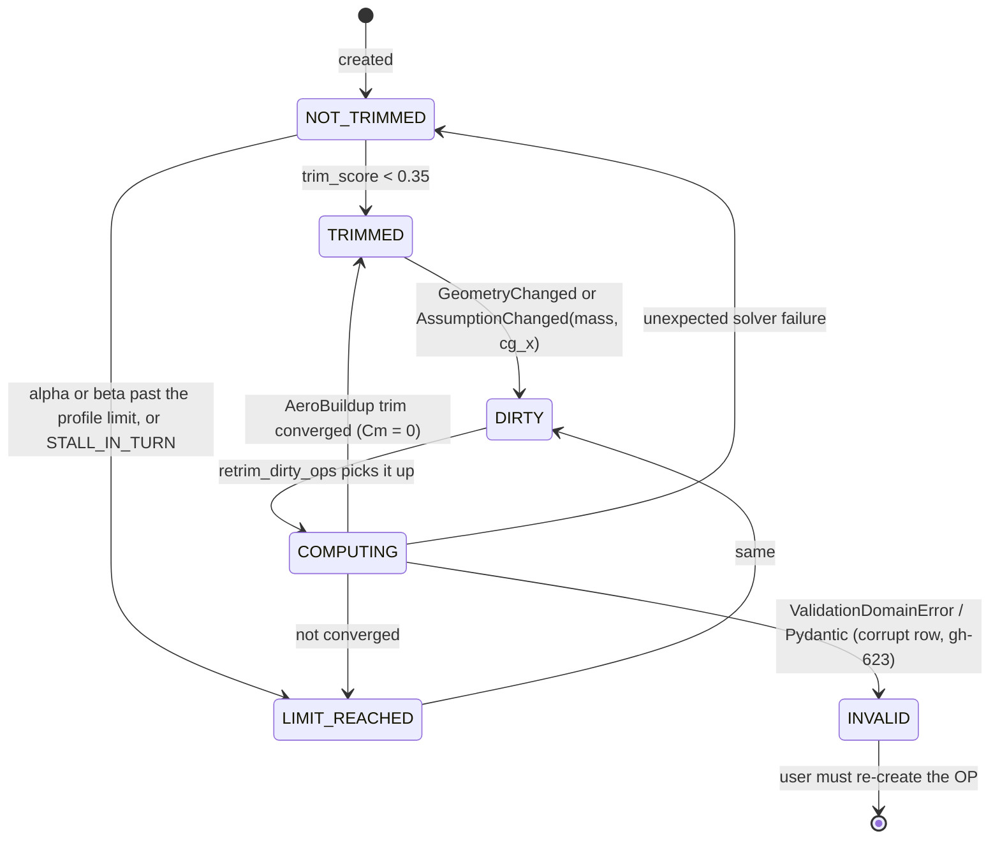
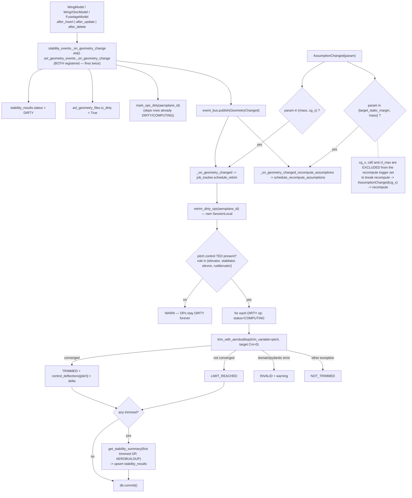
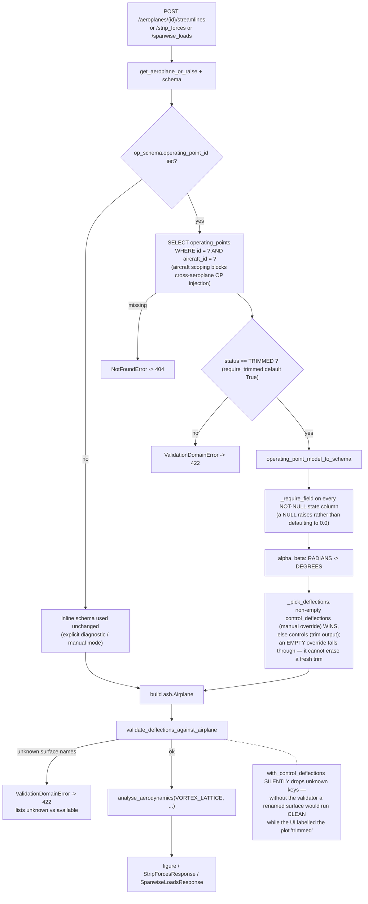
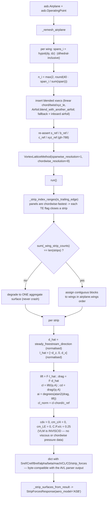
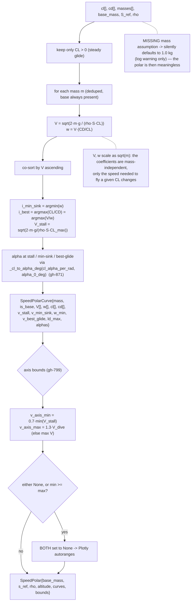

# Flowcharts — aero-analysis

## 1. The solver dispatcher — one door, three solvers

## 2. The single-source-of-truth aero context (gh-924)

```mermaid
flowchart TD
    A["recompute_assumptions(db, uuid)<br/>SYNC — callers must asyncio.to_thread"] --> B["build ASB airplane"]
    B --> C{"any wings?"}
    C -->|no| C0["log info, return (no-op)"]
    C -->|yes| D["main_wing = argmax(wing.area())<br/>OVERRIDE s_ref / c_ref / b_ref<br/>(ASB defaults to wings[0] — the F1/gh-788 bug class)"]
    D --> E["seed_defaults() + _load_or_create_config()  (idempotent)"]
    E --> F["_load_flight_profile_speeds -> V_cruise, V_max, user_set_cruise"]

    F --> G["_stability_run_at_cruise (AeroBuildup, alpha=0)"]
    G --> G1["CD0 = CD_total − CL²/(pi·AR·e)<br/>PARASITE, not total drag"]
    G1 --> H["_coarse_alpha_sweep -> stall_alpha = argmax(CL)"]
    H --> I["_fine_sweep_cl_max (V x alpha grid, ONE vectorised run)<br/>-> CL_max, cl[], cd[], v[], cdi[]"]

    I --> J{"main-wing turbulator enabled? (gh-935)"}
    J -->|yes| J1["cd0 += ΔCD0(xtr_root, xtr_tip)<br/>raw_cd0 PRESERVED for the fit gate"]
    J -->|no| K
    J1 --> K["write CALCULATED: cl_max, cd0, cg_x = x_np − target_SM·MAC"]

    K --> L["_fit_parabolic_polar_with_refinement(cd0_stability = raw_cd0)"]
    L --> M["_e_oswald_from_sweep: e = CL²/(pi·AR·CDi) at (L/D)max"]
    M --> N{"e provenance"}
    N -->|Trefftz ok| N1["aerobuildup_trefftz"]
    N -->|else fit ok| N2["fit"]
    N -->|else| N3["fallback (e_eff = 0.8)"]

    N1 --> O["PUBLISH self-consistent scalars<br/>E_max = ½·sqrt(pi·AR·e/CD0)<br/>CL@E_max = sqrt(CD0·pi·AR·e)"]
    N2 --> O
    N3 --> O

    O --> P["per-config polars: clean / takeoff (min(15°,TED)) / landing (full TED)"]
    P --> Q["build_re_table (rebin fine sweep — NO extra AB calls)"]
    Q --> Q1["gh-924 backfill: rows with fallback_used/cd0=None<br/>get the cruise cd0 + Trefftz e"]
    Q1 --> R["V-speeds + Picard refine (1 pass) + clamp to V_stall"]
    R --> S["CG: loading envelope, stability envelope,<br/>forward CG from elevator authority (gh-500)"]
    S --> T["landing field length (gh-477)"]
    T --> U["_cache_context -> aeroplanes.assumption_computation_context"]
    U --> V{"cg_x changed?"}
    V -->|yes| V1["mark_ops_dirty + publish AssumptionChanged(cg_x)"]
    V -->|no| W["done"]
    V1 --> W

    err["FATAL: any AeroBuildup failure in steps G/H/I<br/>-> log + RETURN, previous context stays valid"]
    G -.- err
```

## 3. Parabolic-polar fit — six gates, resolution goes up only

## 4. Operating-point lifecycle: invalidate → retrim → stability

## 5. Trim-consistent run (gh-577) — resolve, validate, solve

## 6. VLM strip forces without AVL (gh-674 / gh-855)

## 7. Speed polar from a drag polar (pure function)

