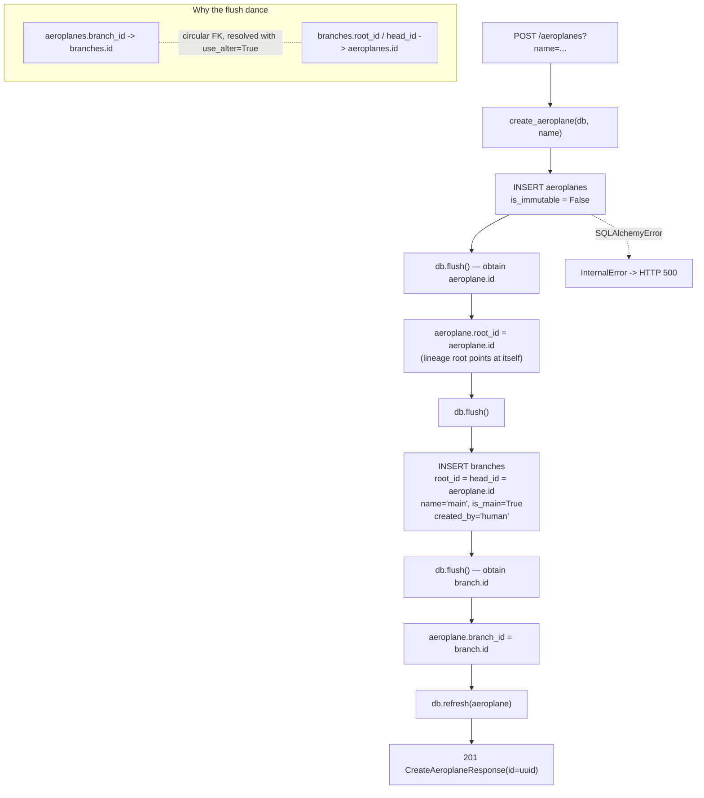
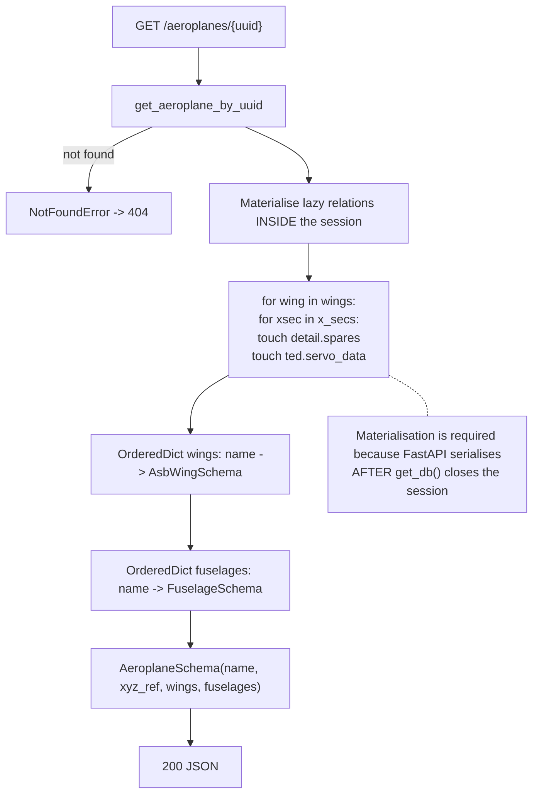
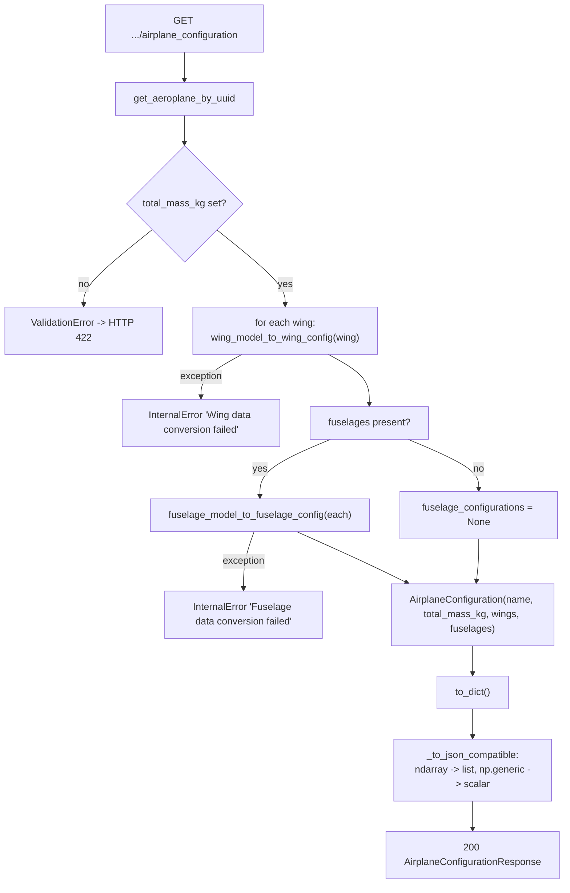
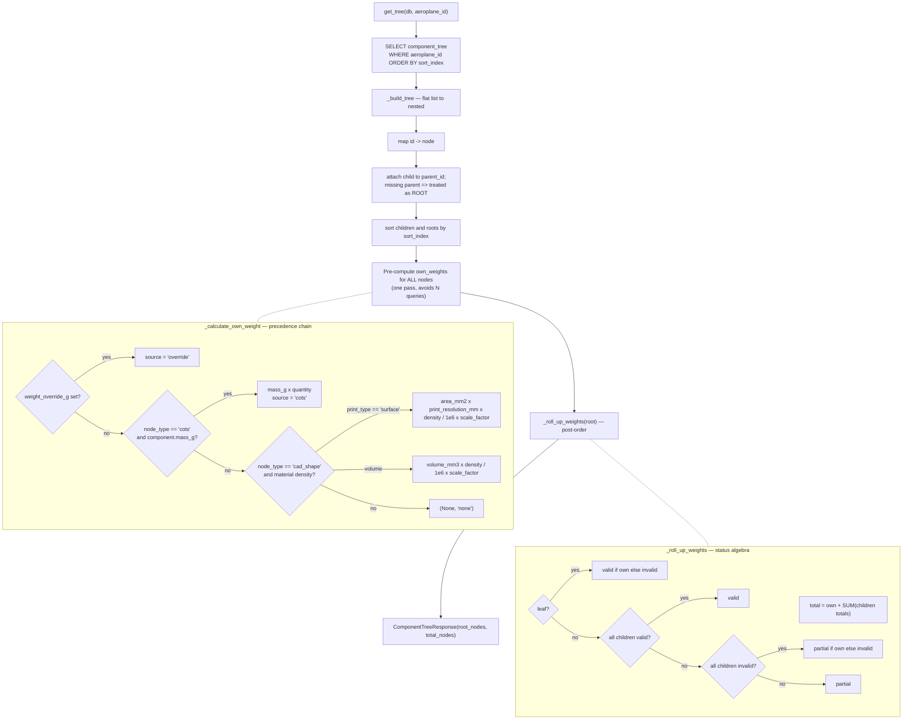
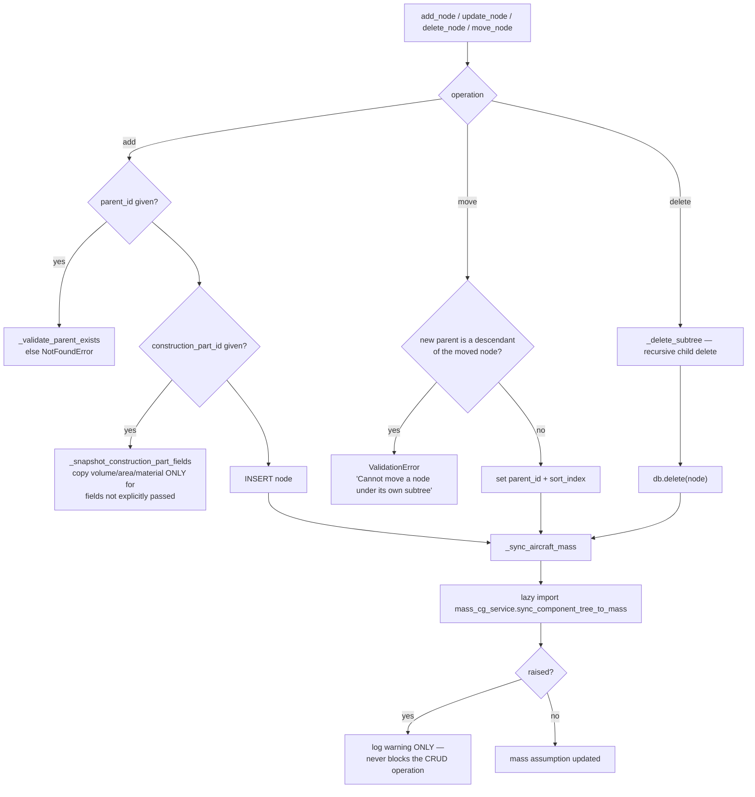
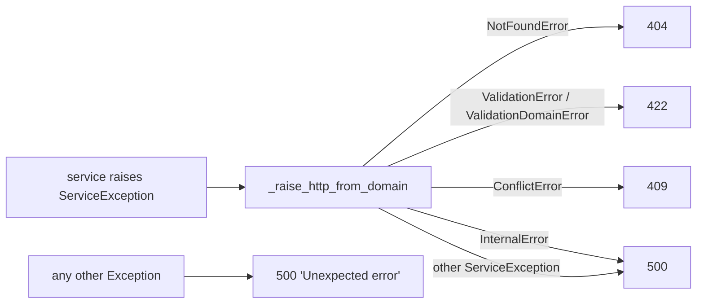

# Flowcharts — aeroplane-core

## 1. Aeroplane creation (with versioning lineage)

`POST /aeroplanes` → `aeroplane_service.create_aeroplane`

## 2. Full aeroplane read

`GET /aeroplanes/{id}` → `aeroplane_service.get_aeroplane_schema`

## 3. AirplaneConfiguration export (CAD assembly)

`GET /aeroplanes/{id}/airplane_configuration`

## 4. Component-tree weight roll-up

`GET /aeroplanes/{id}/component-tree` → `component_tree_service.get_tree`

## 5. Component-tree mutation and its side effects

## 6. Domain-error to HTTP mapping

