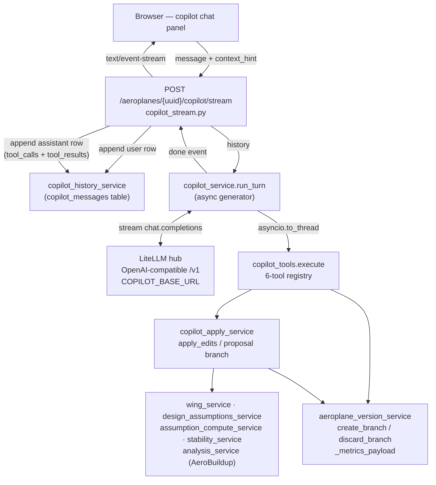
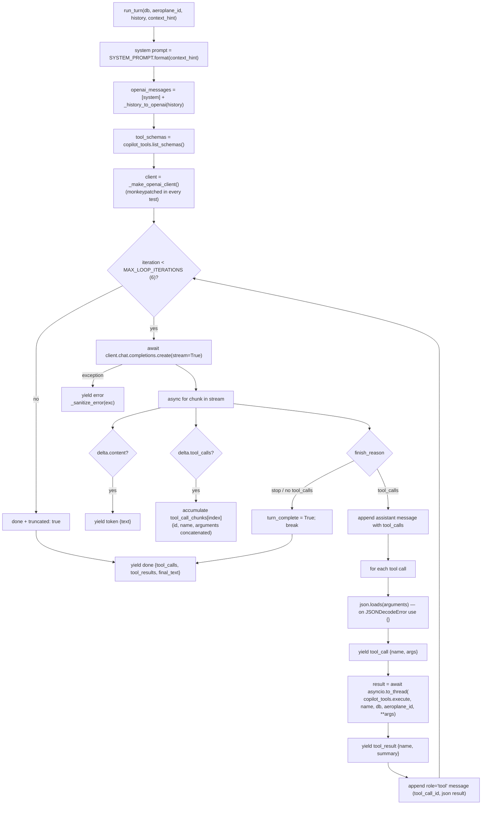
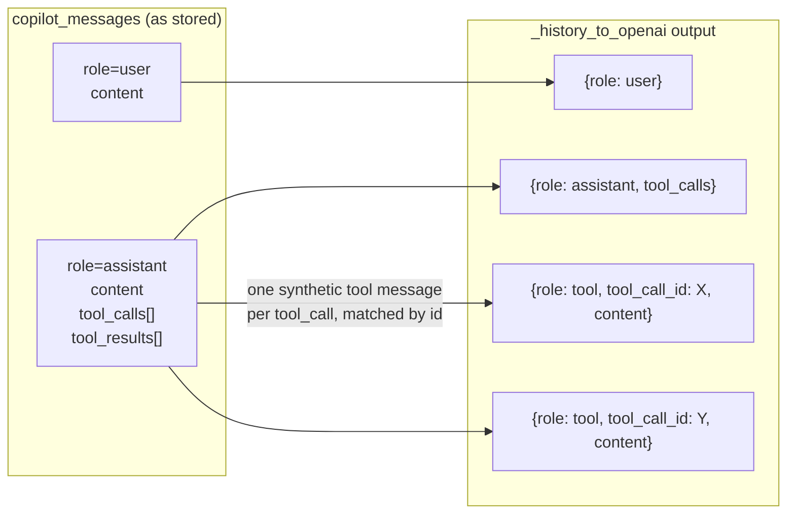
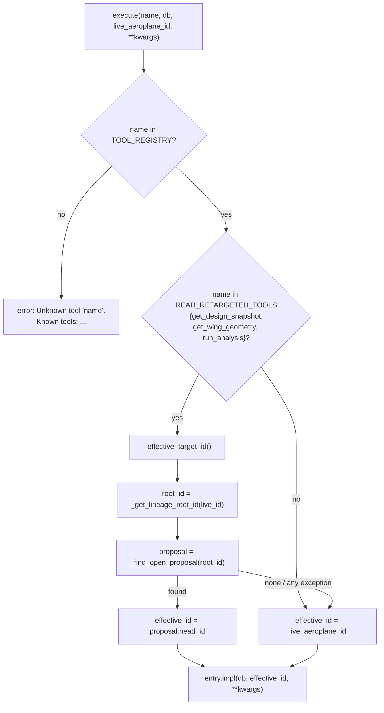
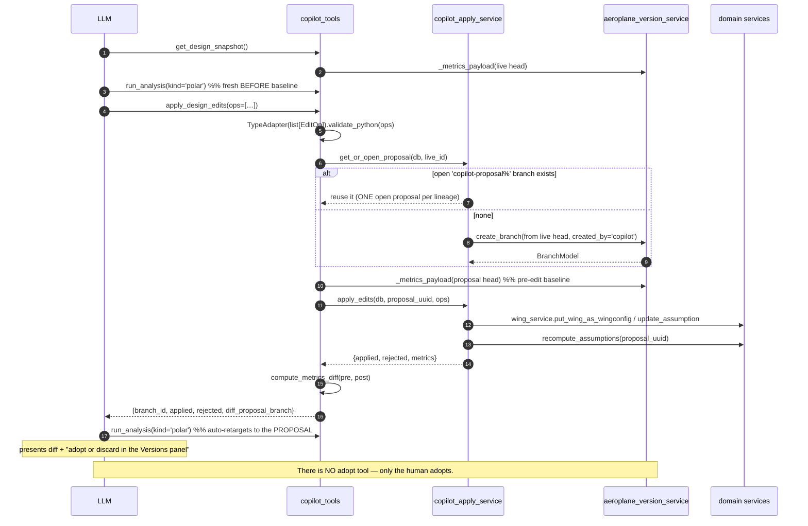
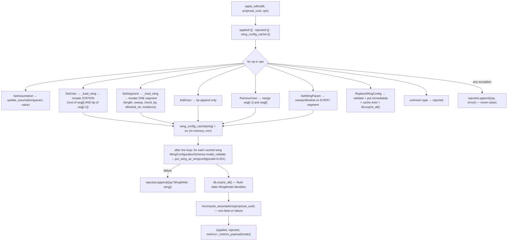
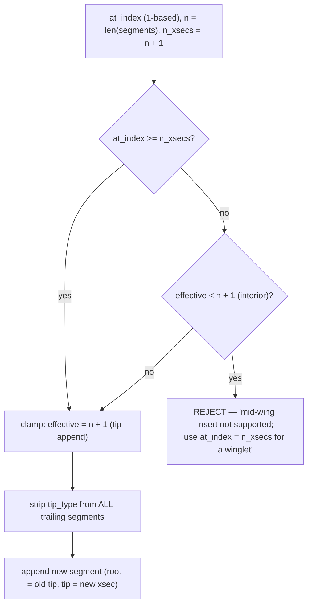
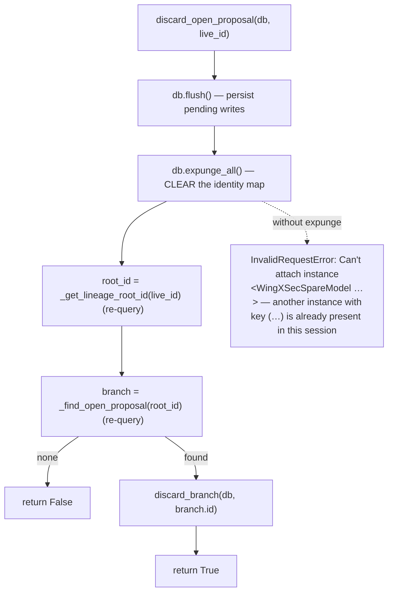
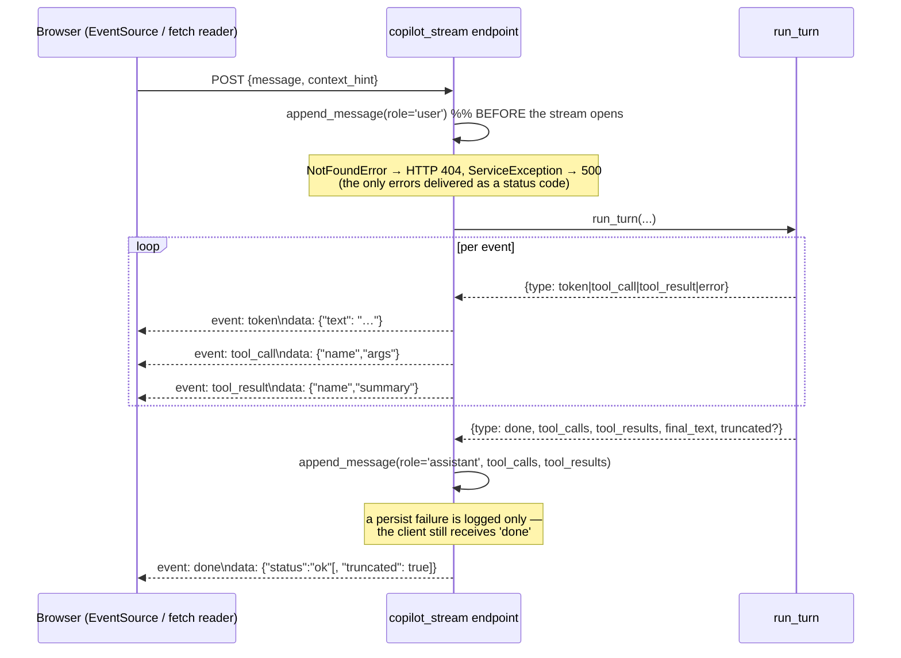
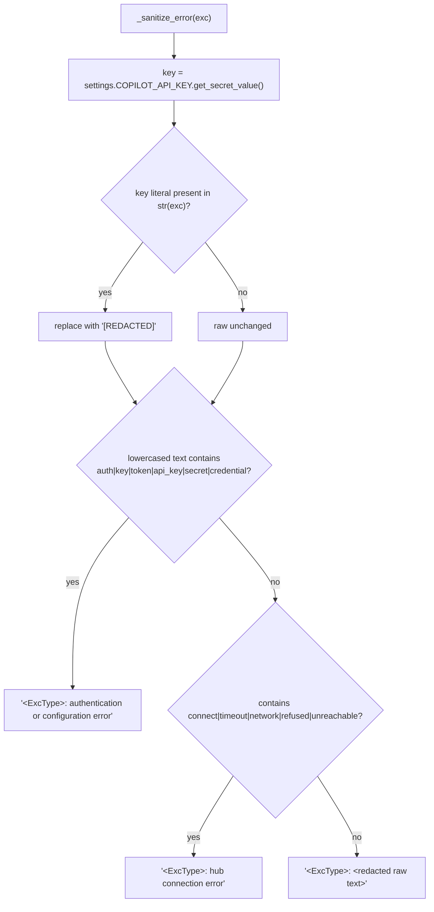

# Flowcharts — ai-copilot

## 1. Layer map — who calls whom

The copilot **never** goes through the REST API of its own service: it calls
the service layer directly, in-process, on the request's own `Session`.
That is the opposite of the MCP server, which re-enters through the FastAPI
endpoint functions.

## 2. The turn loop (`run_turn`, `copilot_service.py:446`)

Two non-obvious points:

* Tool execution runs in a **worker thread** (`asyncio.to_thread`). Inside that
  thread there is no running event loop, which is exactly what lets
  `copilot_tools._run_analysis` call `asyncio.run(...)` for the async
  AeroSandbox path.
* A failed `json.loads` of the streamed arguments silently degrades to `{}` —
  the tool is still called, just without arguments.

## 3. History replay — the gh-922 orphaned-`tool_use` fix

One DB row carries *both* the tool calls and their results. The strict
OpenAI/Anthropic tool protocol requires each `tool_call` to be followed by a
matching `tool` message, so `_history_to_openai` **reconstructs** them. A
tool call whose result is missing gets the literal
`{"error": "tool result unavailable"}` placeholder rather than being dropped —
dropping it would 400 the hub on every subsequent turn.

## 4. Tool dispatch and read-retargeting (`copilot_tools.execute`)

`get_version_tree` is deliberately **not** retargeted (it must show the live
lineage), and the write tools always receive the live id so they can find or
open the proposal branch. Any exception inside `_effective_target_id` is
swallowed and falls back to the live id.

## 5. The agentic apply cycle — propose, never mutate

## 6. `apply_edits` — op dispatch and the deferred wing write

The per-wing cache is what makes multiple ops on one wing **composable**: they
all mutate the same in-memory dict and are written exactly once at the end.
`ReplaceWingConfig` is the exception — it writes immediately and then evicts
the cache so later ops re-read the new state.

### `AddXsec` index handling (gh-938 Bug B)

The `tip_type` stripping is load-bearing: `create_wing_configuration()`
processes segments in two passes (middle = `tip_type is None`, then tip), so
leaving `tip_type='flat'` on the old last segment would make the new winglet
be processed **before** it and physically reorder the cross-sections.

## 7. `discard_open_proposal` — why `expunge_all()` is mandatory

`apply_edits` → `put_wing_as_wingconfig` does delete-then-reinsert inside the
same session, leaving deleted-but-tracked `WingXSecSpareModel` instances in the
identity map. The subsequent cascade delete of the proposal node then collides
with them.

## 8. SSE event contract

Response headers: `Cache-Control: no-cache`, `X-Accel-Buffering: no` (so an
nginx/Caddy hop in front does not buffer the stream).

## 9. Error sanitisation before anything reaches the browser

