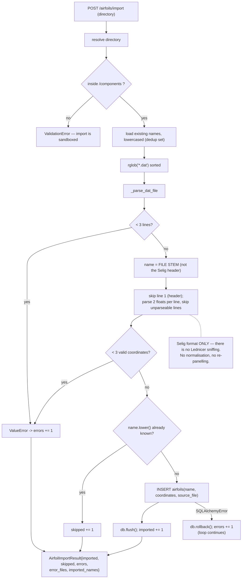
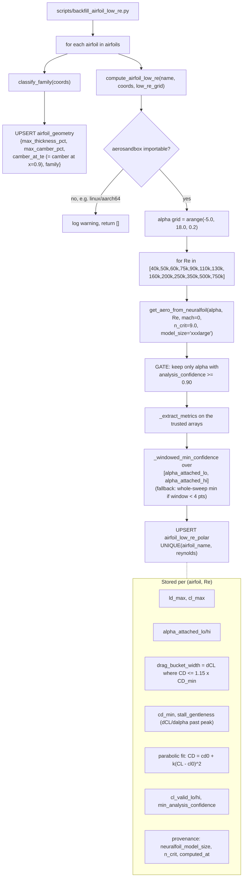
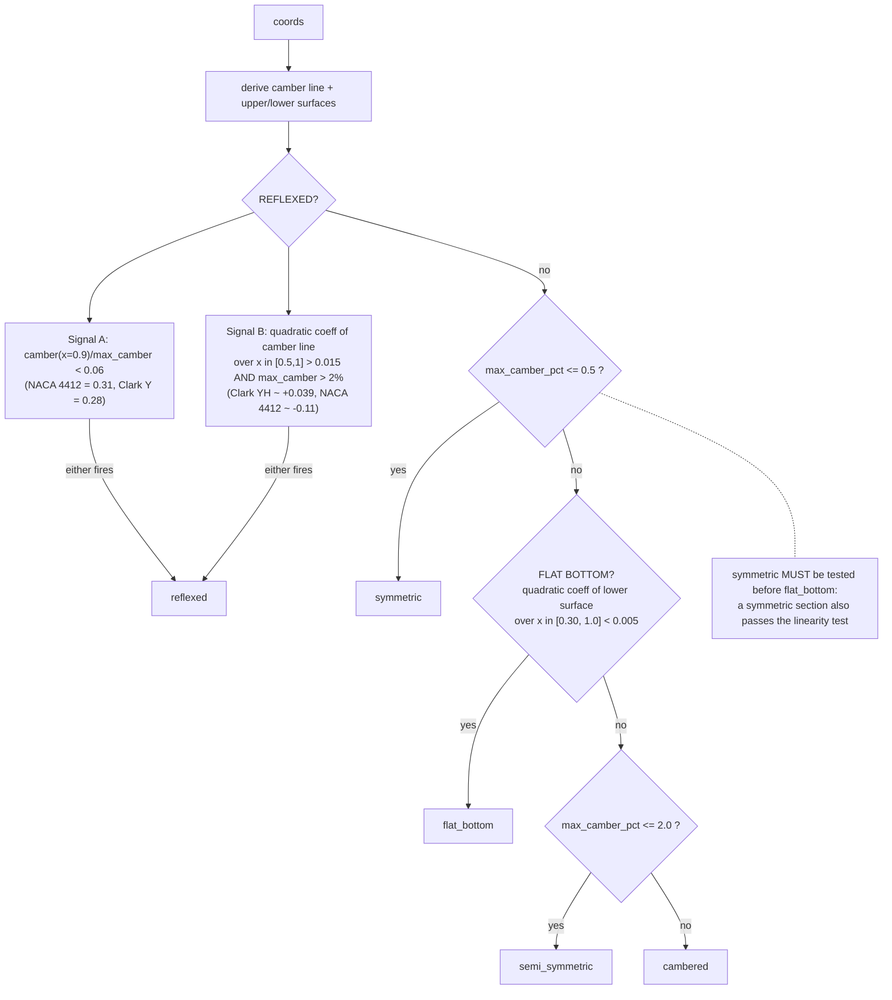
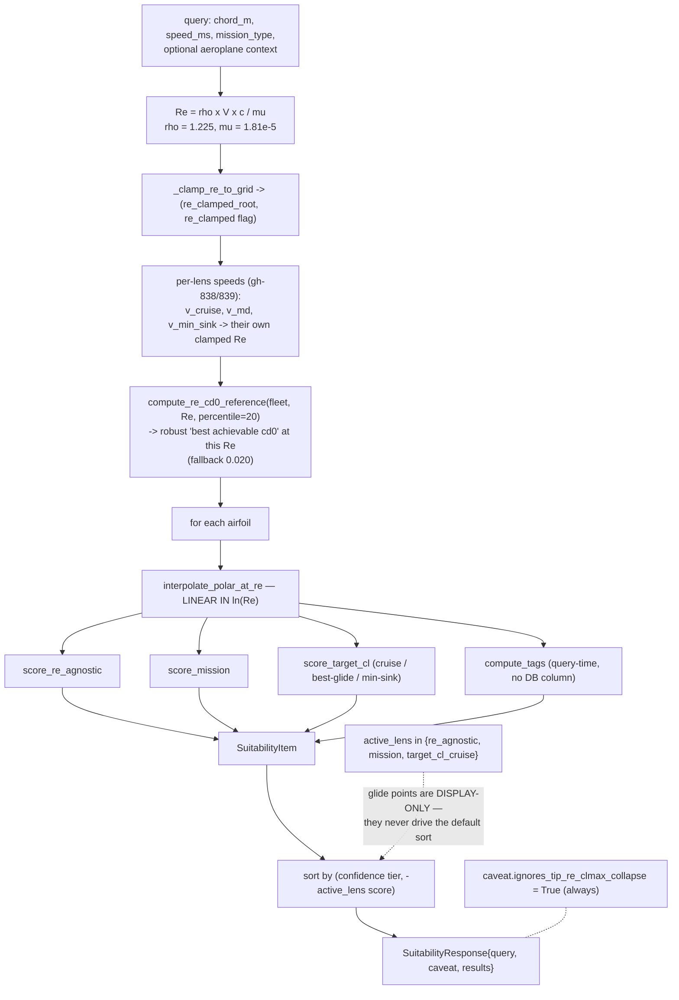
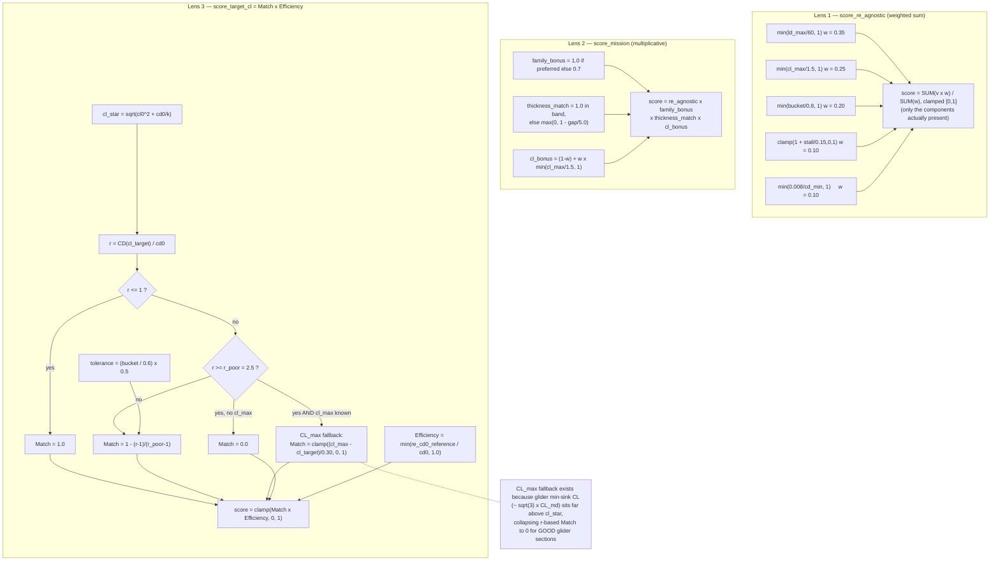
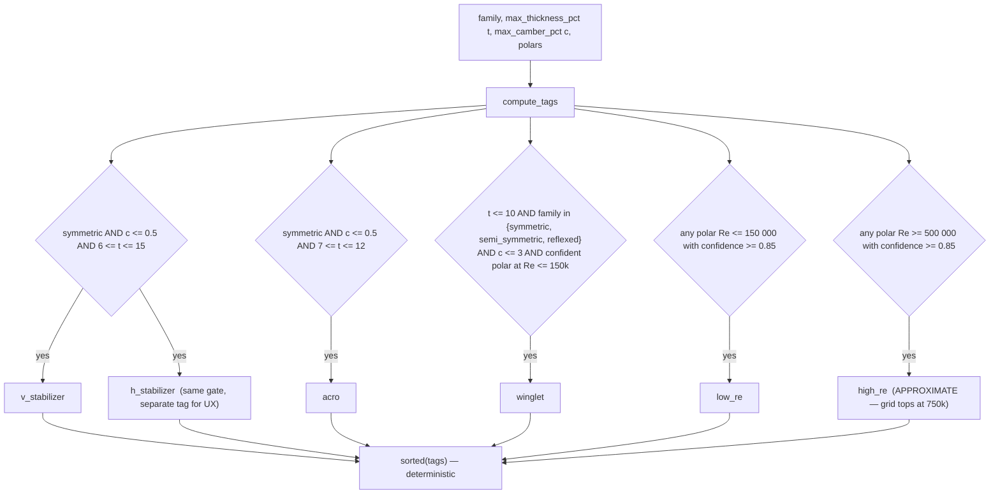
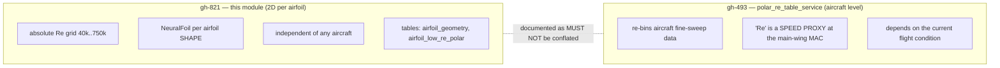

# Flowcharts — airfoil-catalog

## 1. Ingestion — `.dat` files into the catalogue

## 2. Low-Re backfill (gh-821) — geometry + polars

## 3. Family classifier — evaluation order matters

## 4. Suitability query — the ranking pipeline

`GET /airfoils/db/suitability`

## 5. The three scoring lenses

## 6. Role tags (gh-835) — computed at query time

## 7. The two Reynolds concepts — never conflate

