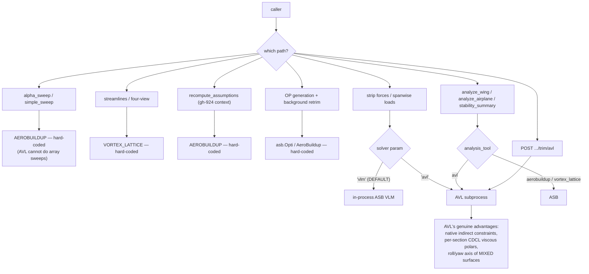
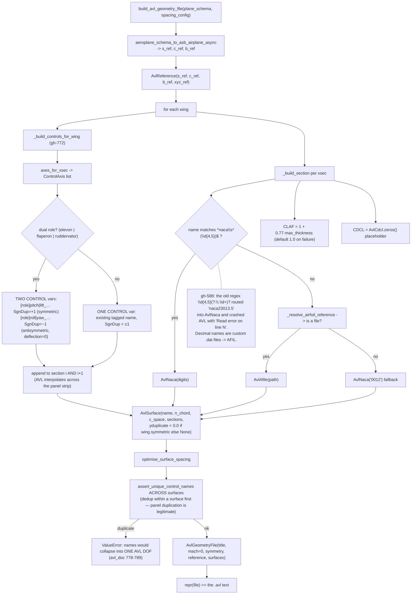
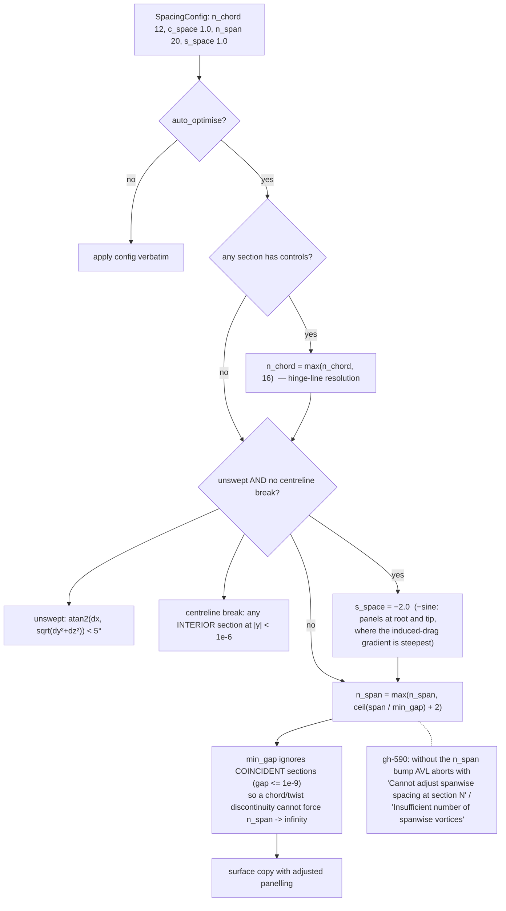
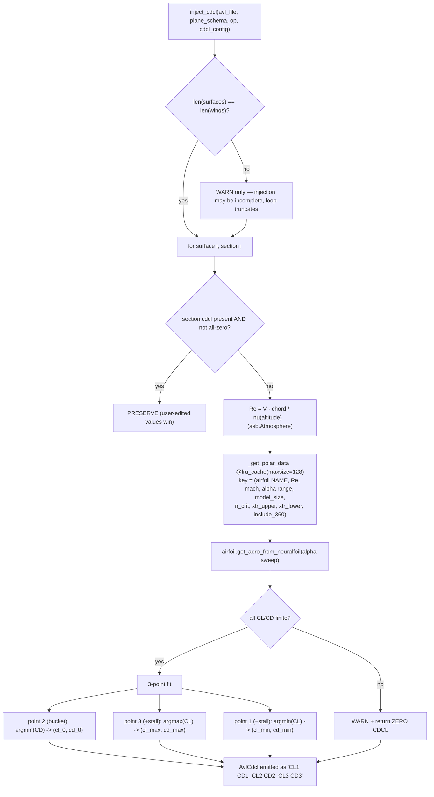
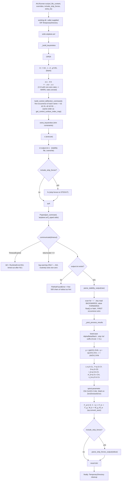
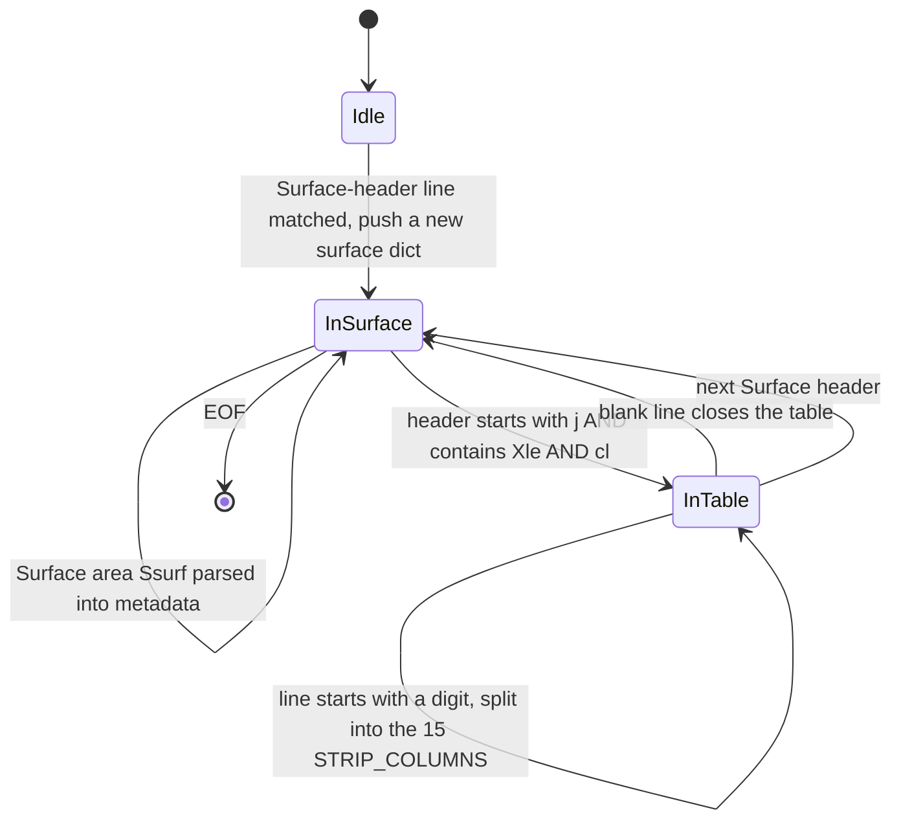
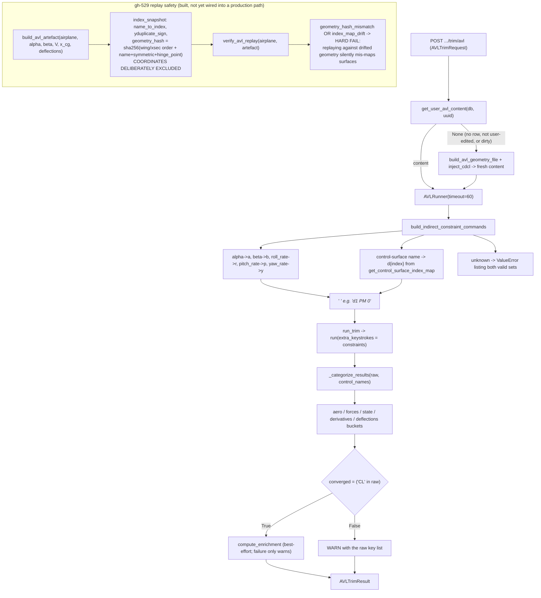
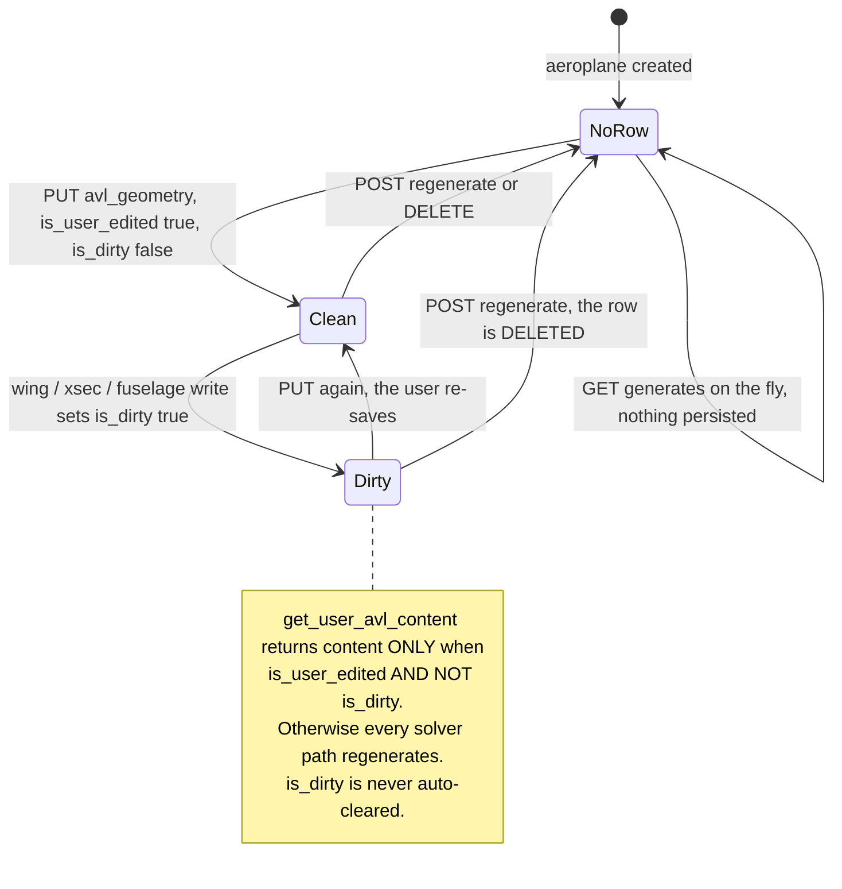

# Flowcharts — avl-integration

## 1. When AVL runs at all (project rule: prefer AeroSandbox)

## 2. Building the `.avl` file

## 3. Panel-spacing rules (`optimise_surface_spacing`)

## 4. CDCL injection via NeuralFoil

## 5. AVLRunner — keystrokes, subprocess, parsing

## 6. Strip-forces stdout parser (line state machine)

## 7. Indirect-constraint trim and replay safety

## 8. Stored geometry file lifecycle

