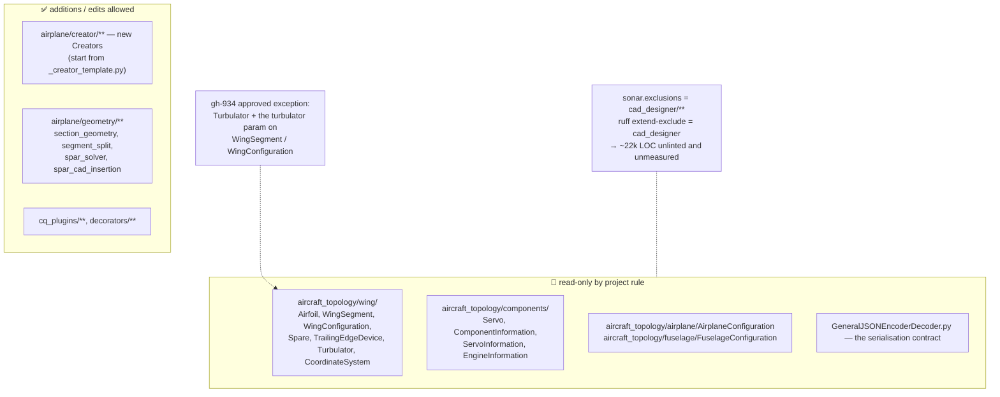
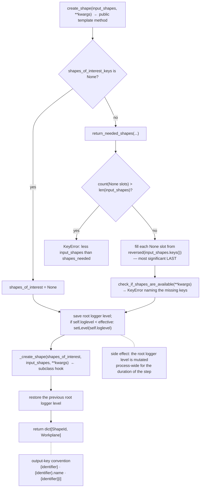
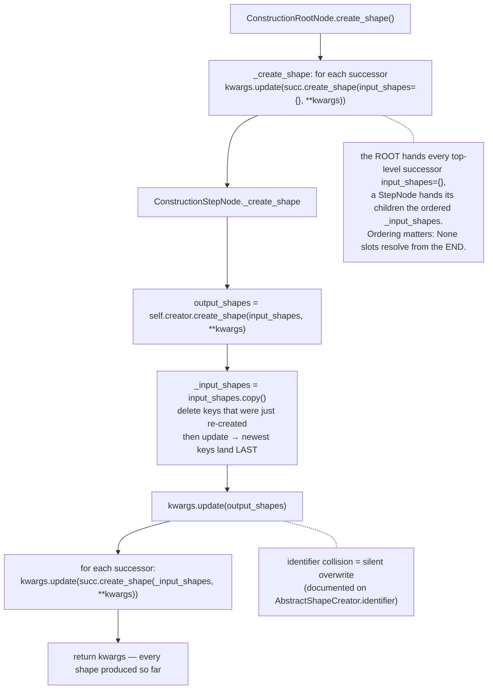
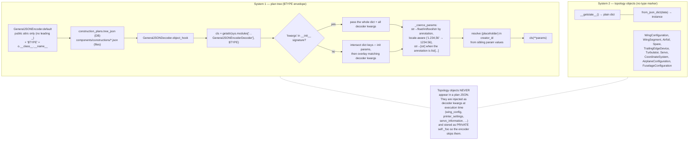
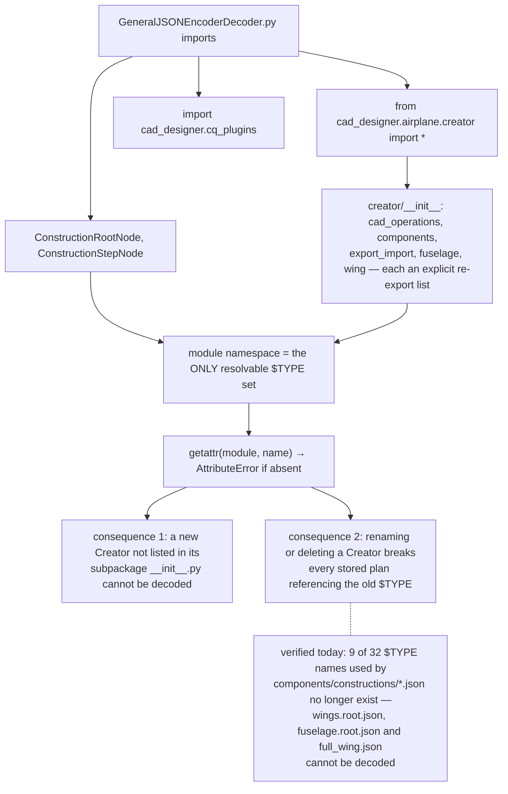
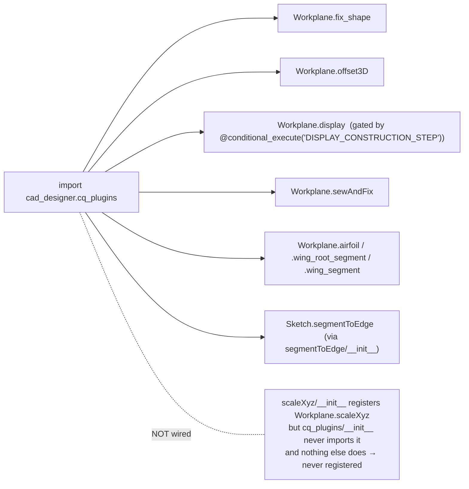
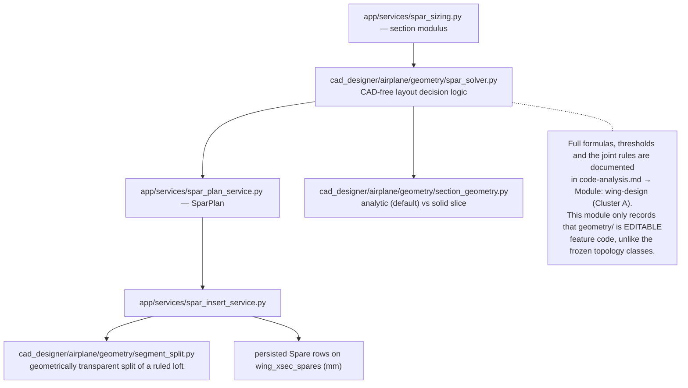

# Flowcharts — cad-designer-topology

## 1. Package map — what is frozen and what is not

## 2. The Creator contract — `AbstractShapeCreator`

## 3. Plan tree execution — depth-first with a growing kwargs registry

## 4. Two independent serialisation systems

## 5. Class resolution — why a new Creator must be exported

## 6. `cq_plugins` — what gets monkey-patched onto CadQuery

## 7. Where the spar/geometry pipeline sits

