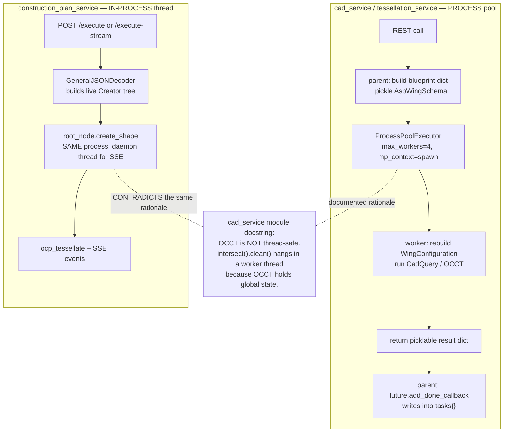
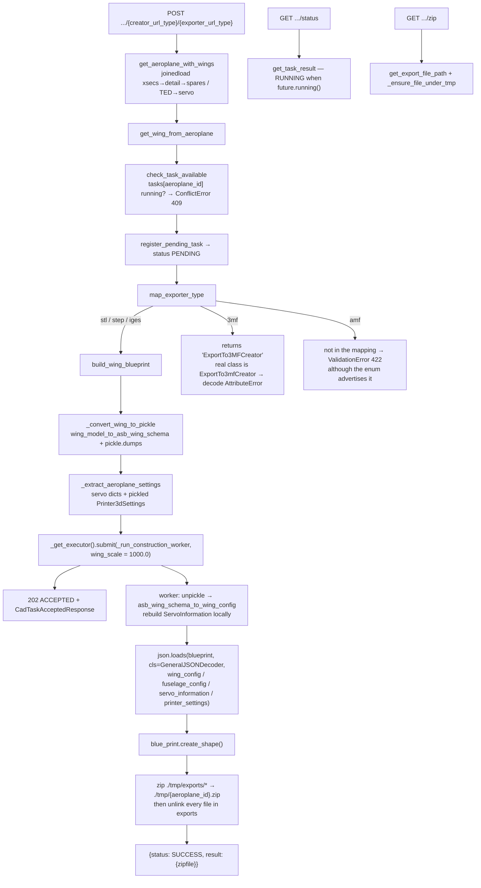
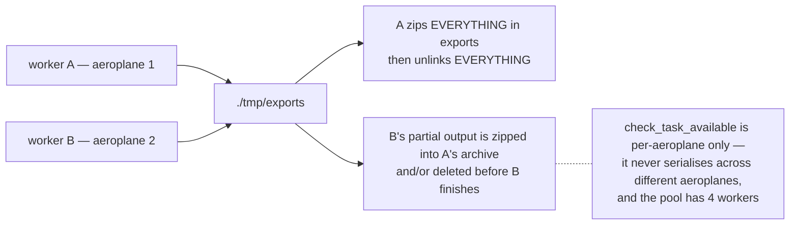
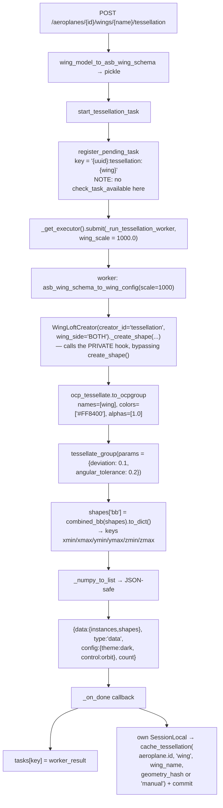
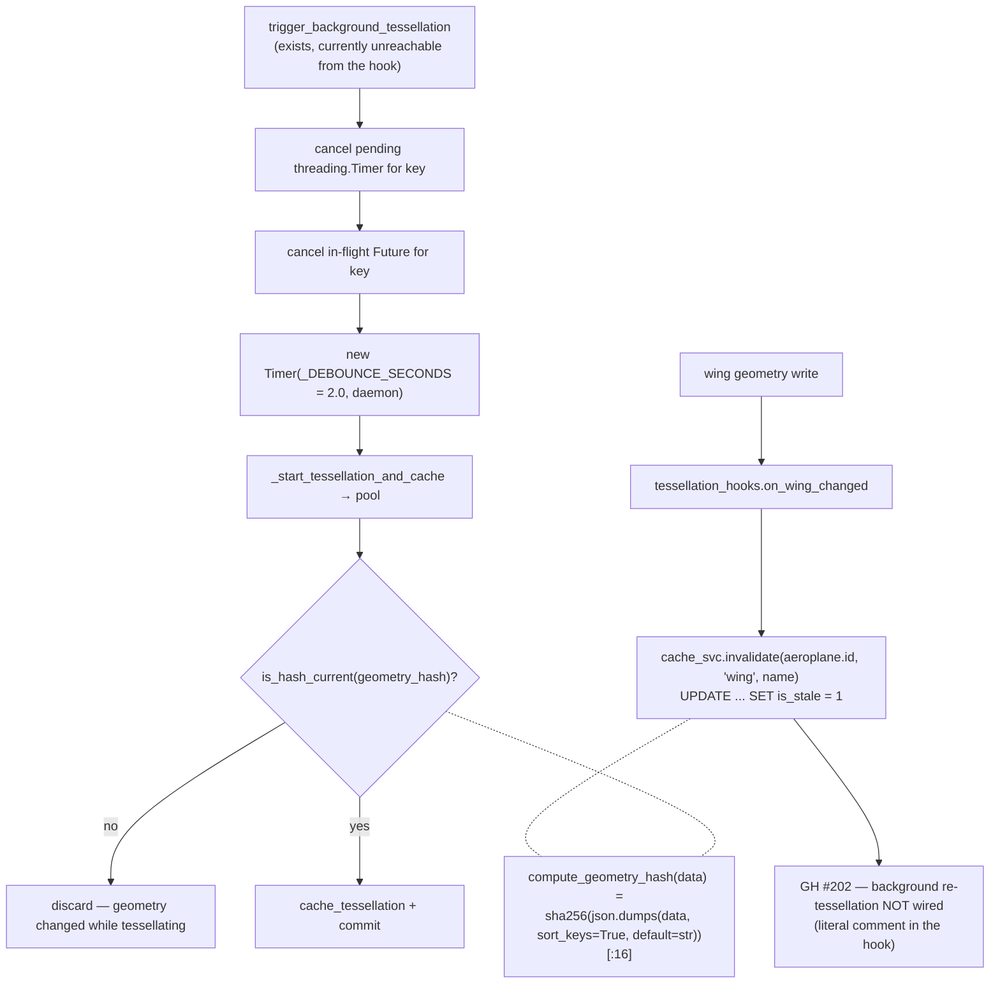
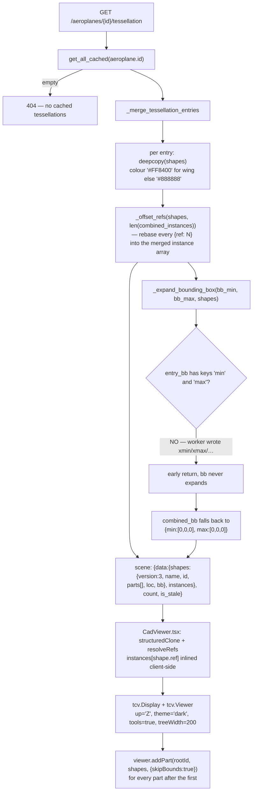
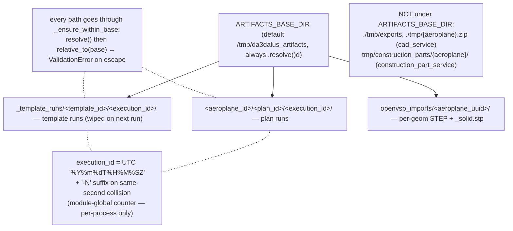

# Flowcharts — cad-generation

## 1. The two CAD execution models — and why they differ

## 2. Wing export — `POST /aeroplanes/{id}/wings/{name}/{creator}/{exporter}`

## 3. `./tmp/exports` is a shared mutable directory

## 4. Tessellation — request path and cache

## 5. Cache lifecycle and the debounce

## 6. Scene assembly — `GET /aeroplanes/{id}/tessellation`

## 7. Artifact directory layout

