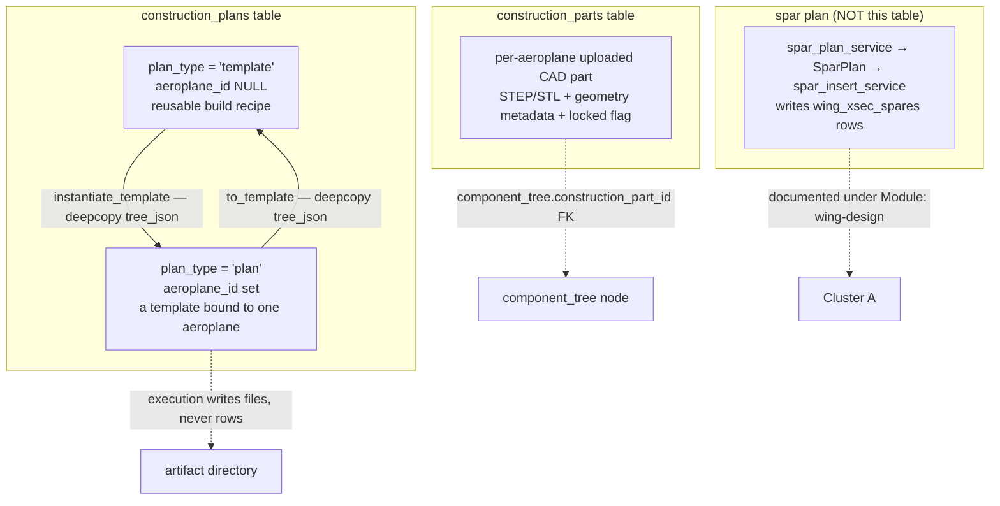
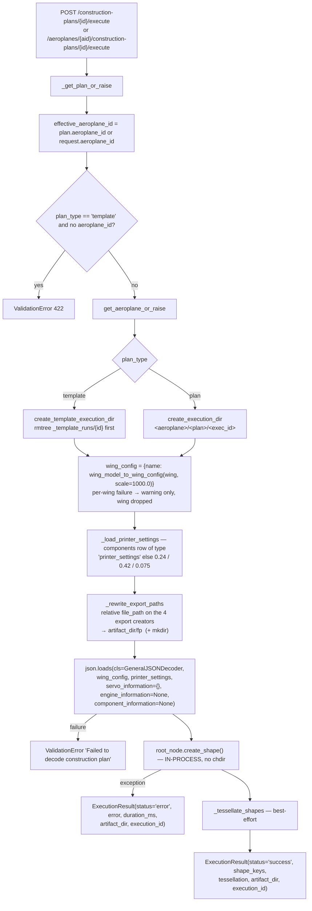
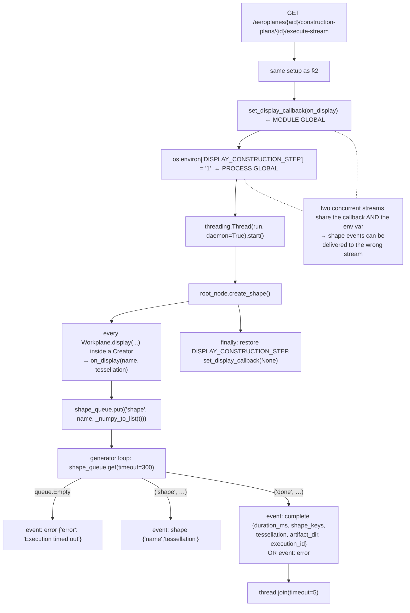
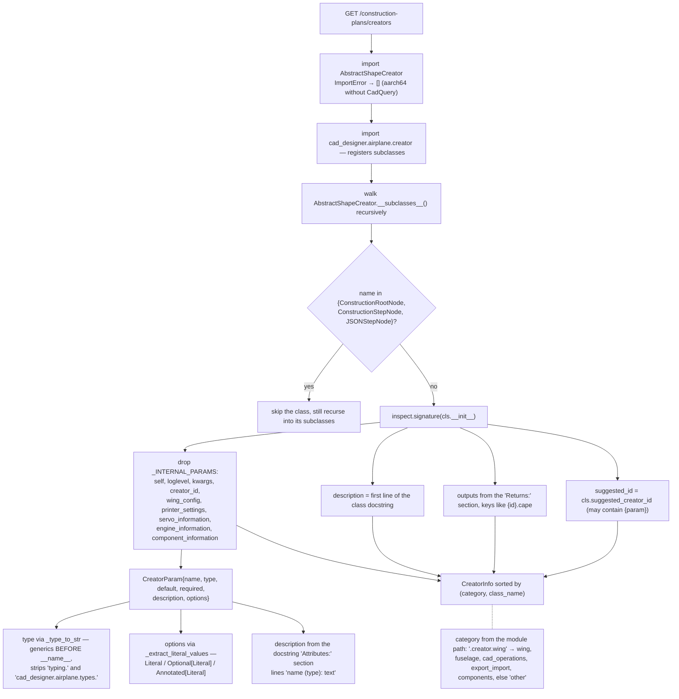
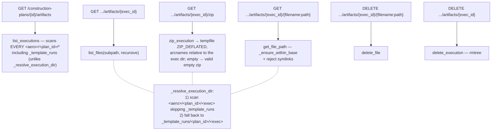
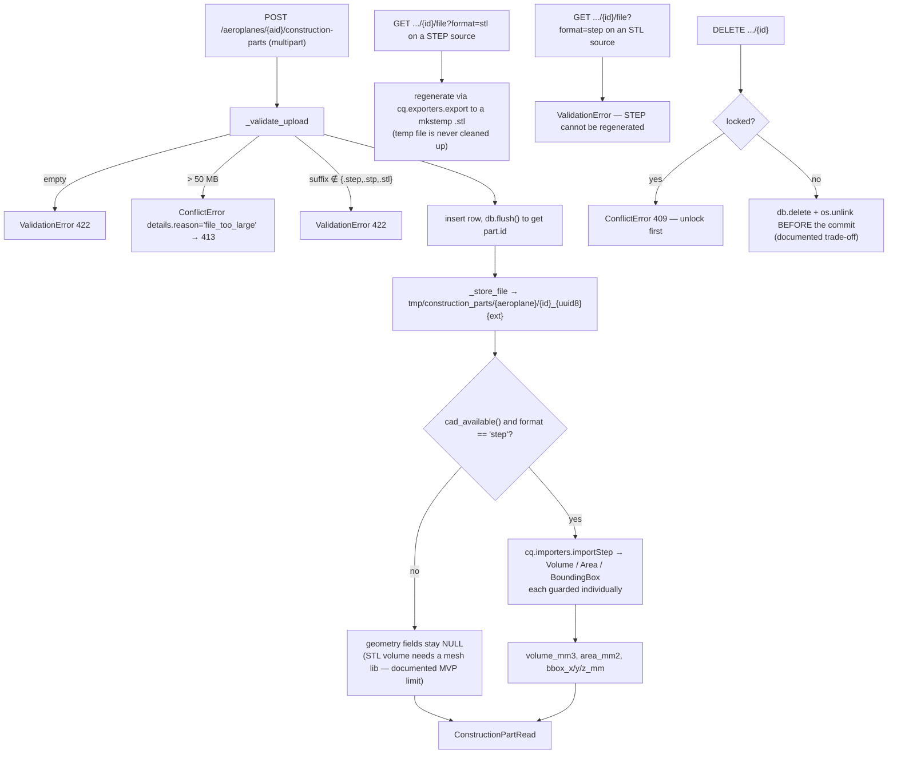
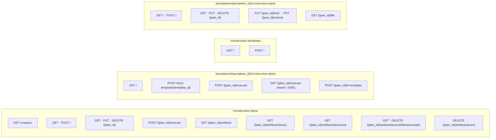

# Flowcharts — construction-plans

## 1. The domain — three different things called "construction"

## 2. Plan execution — non-streaming

## 3. Streaming execution — SSE and its global side effects

## 4. Creator Catalog — reflection into the frontend gallery

## 5. Artifact browsing and download

## 6. Construction parts — upload lifecycle

## 7. REST surface

