# Flowcharts — frontend-workbench

## 1. Layer map and the enforced dependency direction

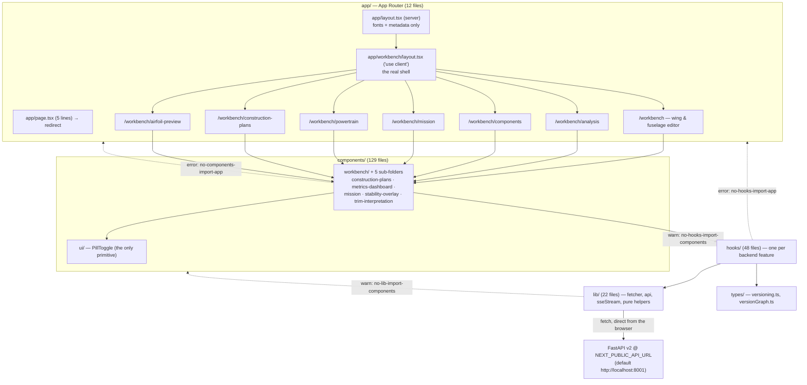

Dotted arrows are the `dependency-cruiser` rules (`.dependency-cruiser.cjs`),
checked by `npm run deps:check`: `no-circular` (**error**),
`no-components-import-app` / `no-hooks-import-app` (**error**),
`no-hooks-import-components` / `no-lib-import-components` (**warn**),
`no-orphans` (info, with `page.tsx` / `layout.tsx` / `.d.ts` / tests excluded).

## 2. Route tree — one shell, seven tabs

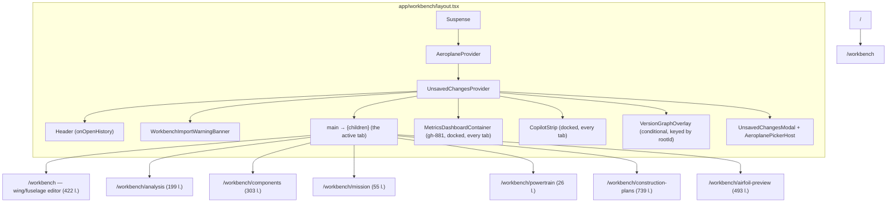

`app/layout.tsx` is the only server component of consequence — it loads
`Geist`, `Geist_Mono` and `JetBrains_Mono` via `next/font/google`, sets the
metadata and applies the CSS variables. **Everything below `/workbench` is
`"use client"`**: there are no route handlers (`app/**/route.ts` does not
exist), no server actions and no server-side data fetching.

## 3. Data flow — browser talks to FastAPI directly

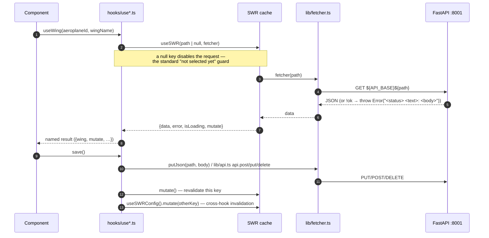

`API_BASE = process.env.NEXT_PUBLIC_API_URL ?? "http://localhost:8001"`
(`lib/fetcher.ts:1`), also pinned in `next.config.ts` via the `env` block.
**Every call is a cross-origin browser fetch**, which is precisely why the
backend runs `allow_origins=["*"]`.

Two parallel clients coexist:

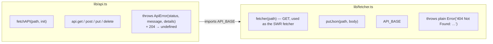

`lib/api.ts` is the richer client (typed `ApiError`, 204 handling) but the SWR
hooks use `lib/fetcher.ts`, so error shape depends on which client a given call
path went through. `lib/parseApiError.ts` exists to normalise the difference.

## 4. Selection state — URL is the source of truth

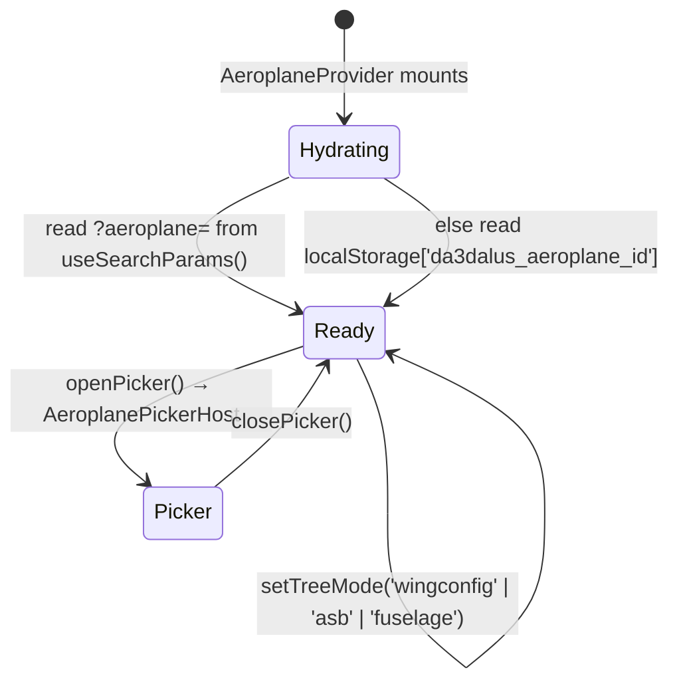

`hydrated` is exposed so children can avoid rendering "no aircraft selected"
during the first client pass. There is **no** Redux / Zustand / Jotai — state
is React context (`AeroplaneContext`, `UnsavedChangesContext`) + SWR cache +
URL search params + a handful of `localStorage` keys
(`AeroplaneContext`, `CopilotStrip`, `WorkbenchImportWarningBanner`,
`ImportWarningBanner`, `StabilityOverlay`, `lib/versionGraphViewState.ts`).

## 5. Wing editor — the main tab

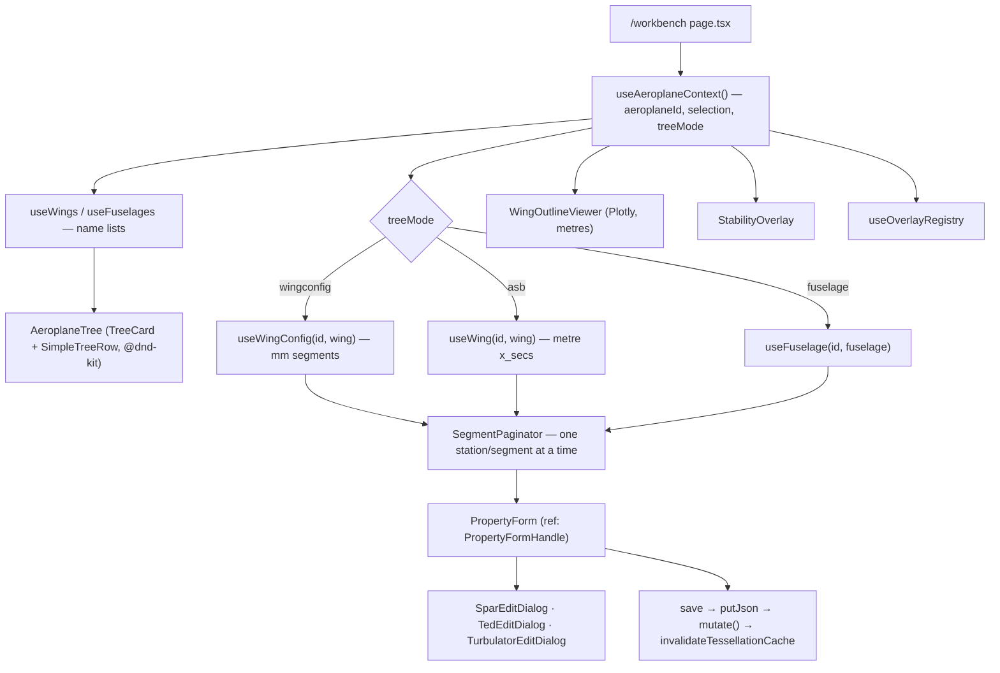

The `treeMode` switch is the frontend face of the backend's unit duality:
`wingconfig` shows the **mm** `WingConfig` view, `asb` shows the **metre**
cross-section view, and the two are separate hooks over separate endpoints.

## 6. 3D CAD viewer — tessellation pipeline

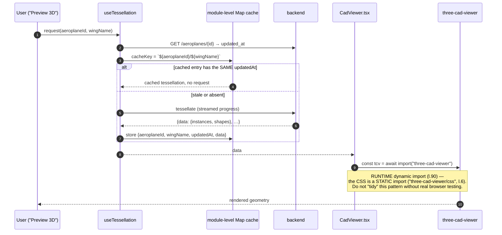

`three` is aliased to a single resolved path in **both** the webpack and the
turbopack config (`next.config.ts`) — without it the app and
`three-cad-viewer` would each load their own copy of three.js.
`invalidateTessellationCache(aeroplaneId, wingName)` is exported so a geometry
save can force the "Preview 3D" affordance back.

## 7. Charts — Plotly is always lazily imported

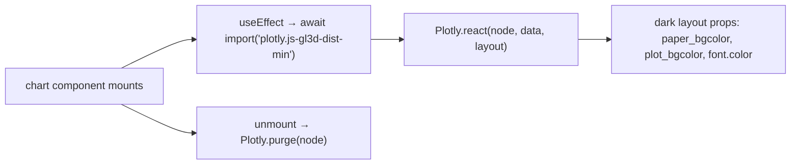

Eight components chart with Plotly: `AnalysisViewerPanel` (5 separate
imports), `WingOutlineViewer`, `StreamlinesViewer`, `VnDiagram`,
`MatchingChartTab`, `PowertrainTab`, `ImportFuselageDialog`,
`trim-interpretation/ControlAuthorityChart`. `StreamlinesViewer` carries the
rule in a comment: *"DO NOT import react-plotly.js or plotly.js at top level —
it is 1.5 MB."* `react-plotly.js` is a declared dependency but is **not**
imported anywhere.

Adding an analysis type follows a fixed four-step recipe (`frontend/CLAUDE.md`):
tab entry in `AnalysisViewerPanel.TABS` → config section in
`AnalysisConfigPanel` keyed by `activeTab` → a hook in `hooks/` → Plotly charts.

## 8. Copilot strip — SSE consumed by hand

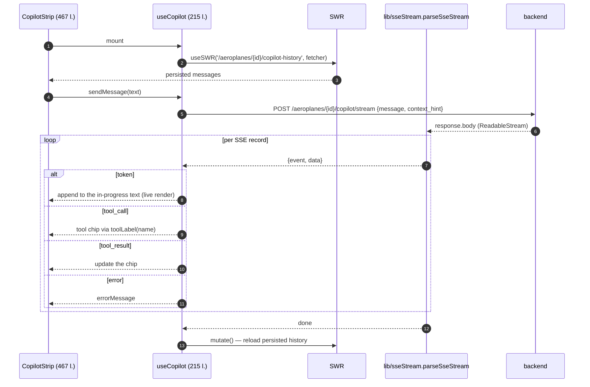

`lib/sseStream.ts` exists because *"the browser's built-in `EventSource` only
works with GET requests"* — the backend streams are POST. The parser buffers a
trailing incomplete block across chunk boundaries and falls back to the raw
string when a `data:` payload is not JSON. The same helper serves the OpenVSP
import progress stream (gh-737).

`useCopilotProposal` (111 l.) is the second half: it surfaces the open
`copilot-proposal` branch so the user can adopt or discard it — the human side
of the backend's "propose, never mutate" rule.

`TOOL_LABEL_MAP` in `useCopilot.ts` labels only three of the six copilot tools
(`get_design_snapshot`, `run_analysis`, `get_version_tree`); the other three
fall through to the generic `Calling <name>…`.

## 9. Versioning UI

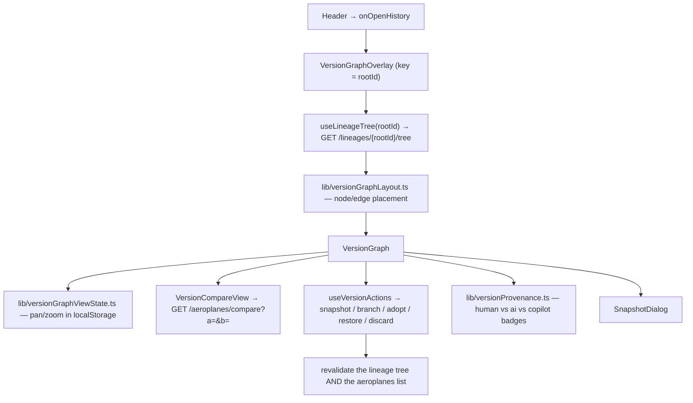

Note the **id duality** crossing the boundary: the aeroplane list is addressed
by UUID (`aeroplaneId`), while every versioning route takes the integer PK —
so the layout resolves `int_id` and `root_id` off the aeroplane record before
handing them to the overlay.

## 10. Test topology

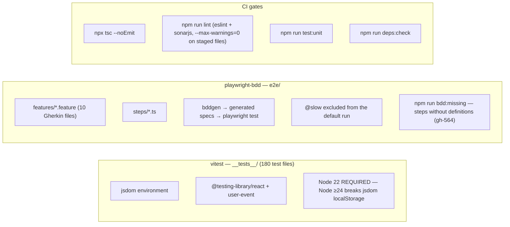

Feature files: `airfoil-suitability`, `analysis-status`, `component-types`,
`ehawk-construction`, `navigation`, `operating-points`,
`polar-design-warning`, `ted-role-ui`, `trim-interpretation`, `turbulator-ui`.
`polar-design-warning` has its own Playwright config.
