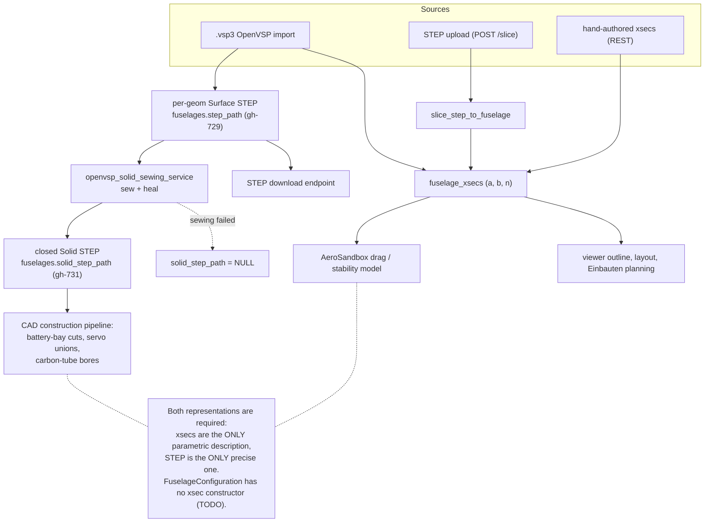
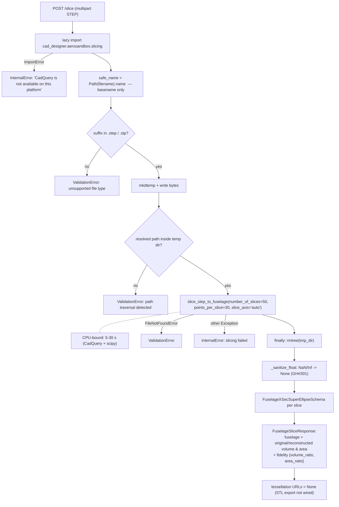
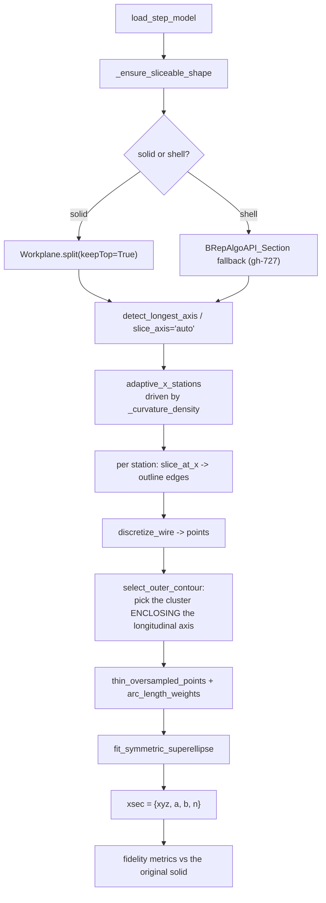
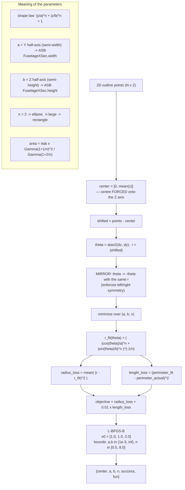
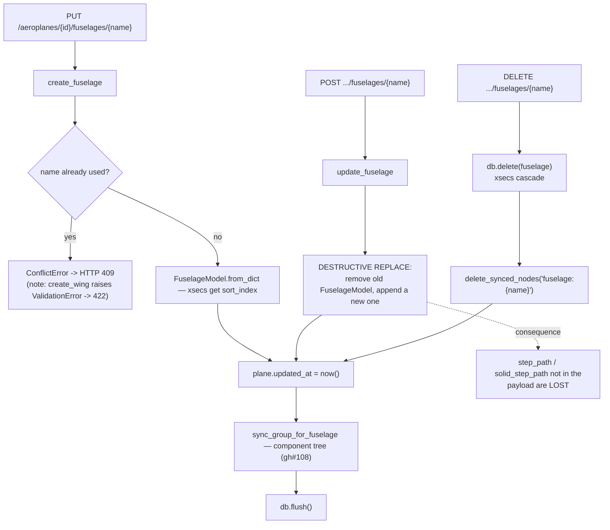
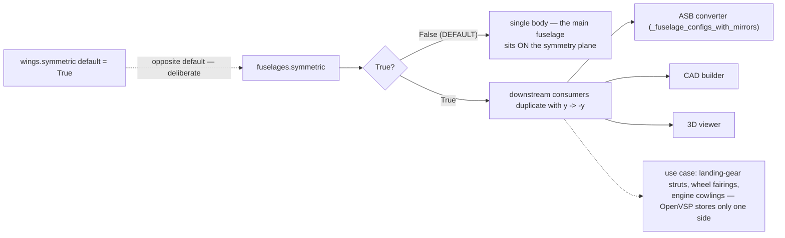

# Flowcharts — fuselage-design

## 1. The two fuselage representations and who consumes them

## 2. STEP → superellipse slicing

`POST /slice` → `fuselage_slice_service.slice_step_file`

## 3. Inside `slice_step_to_fuselage`

## 4. Superellipse fitting (the maths)

## 5. Fuselage CRUD and its side effects

## 6. `symmetric` — the XZ-mirror flag (gh-715)

