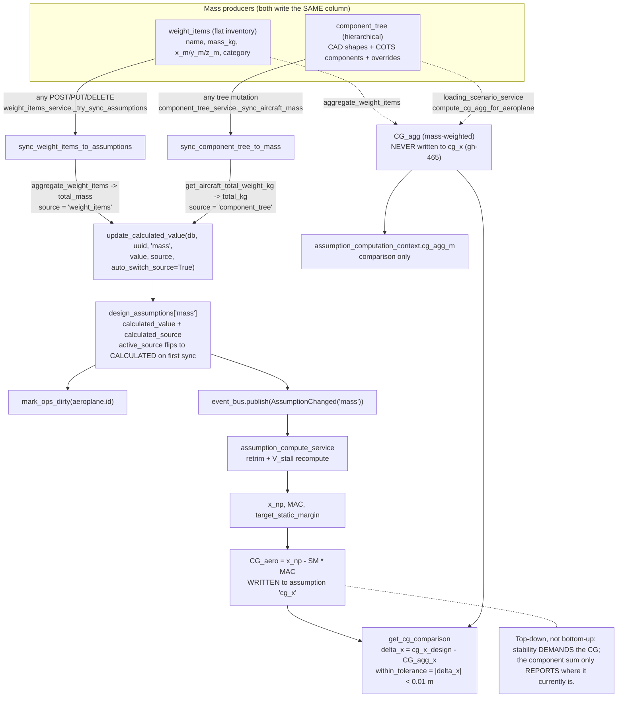
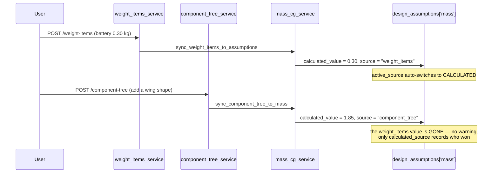
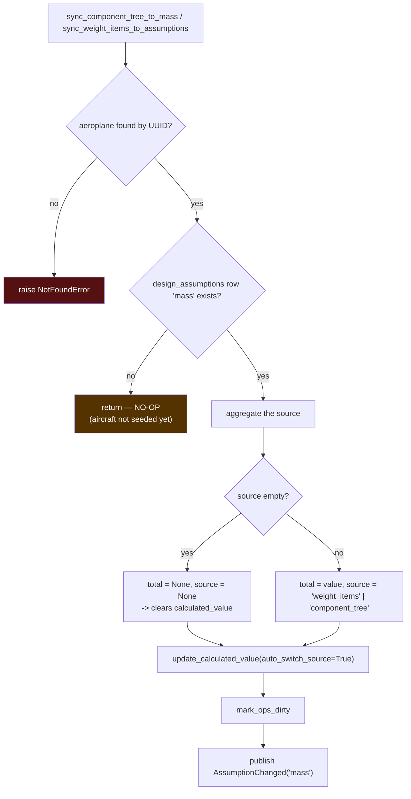
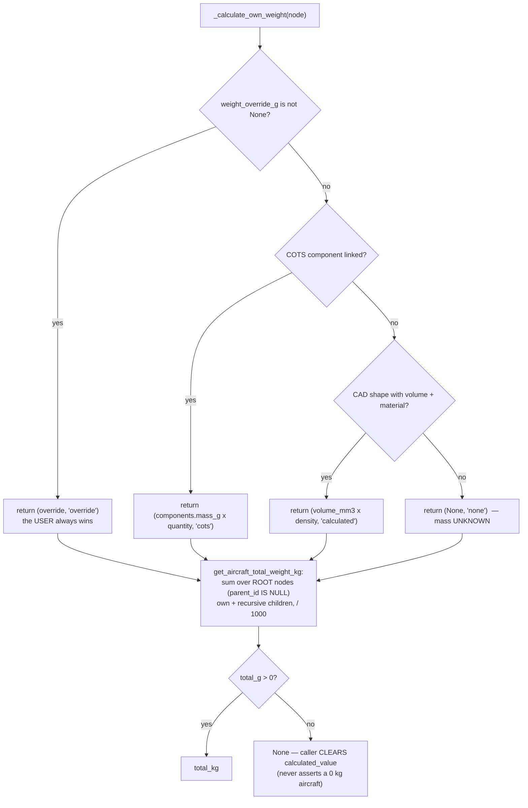
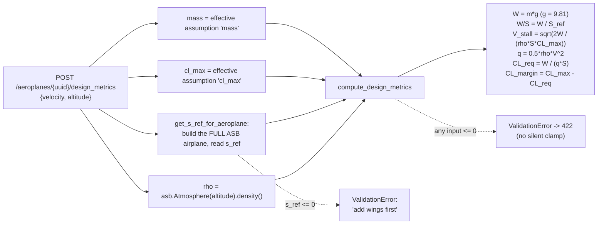

# Flowcharts — mass-and-balance

## 1. The two mass producers and the one CG rule

## 2. Last-write-wins between the two producers

## 3. `sync_*` — the shared five-step shape

Both call sites swallow their exceptions on purpose — `_try_sync_assumptions`
catches `NotFoundError`/`SQLAlchemyError`, `_sync_aircraft_mass` catches
`Exception` — so a failed sync never blocks the CRUD operation that triggered
it. A persistently failing sync is visible only in the log. 🔴

## 4. Component-tree weight ladder (per node)

## 5. `design_metrics` — the only ASB-touching route

