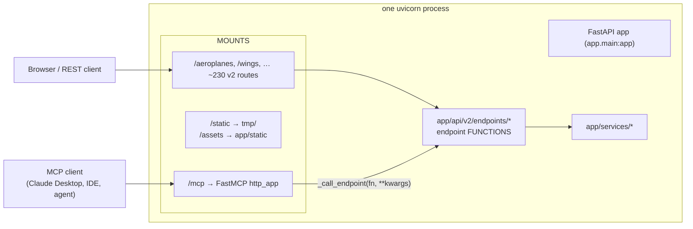
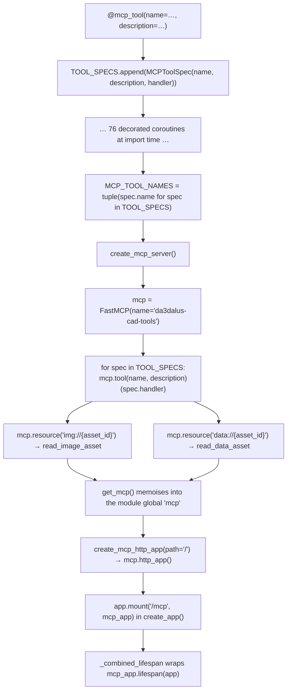
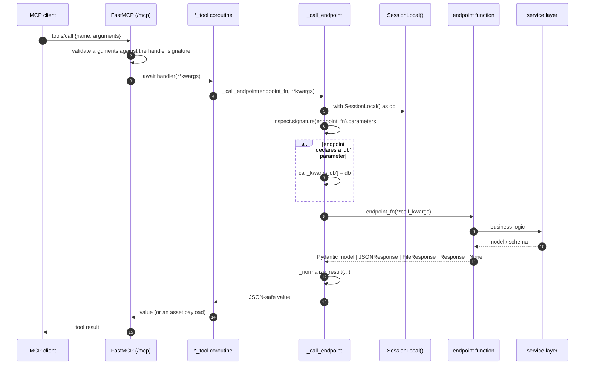
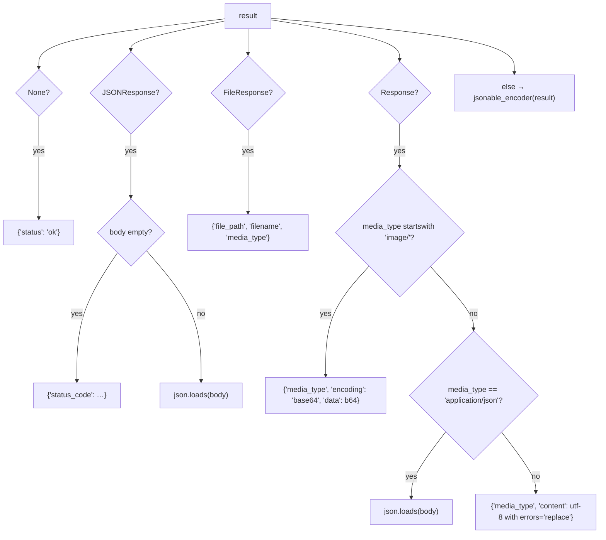
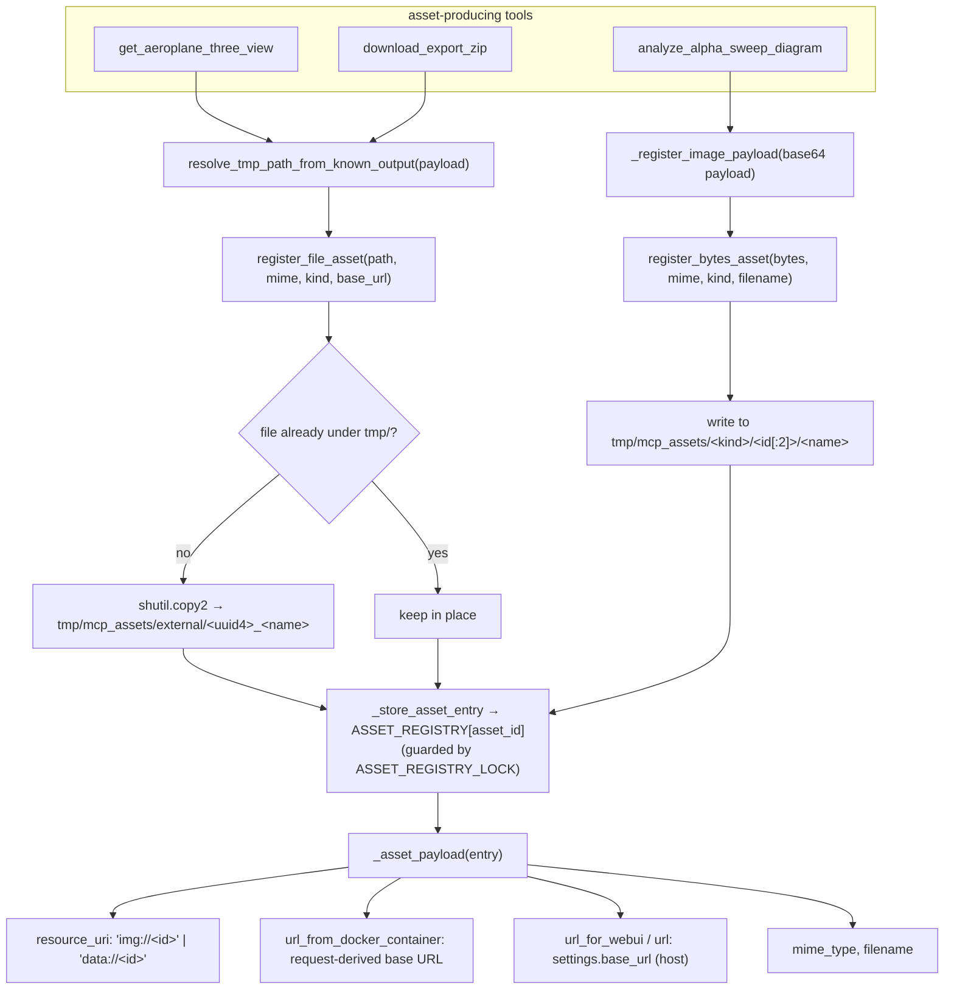
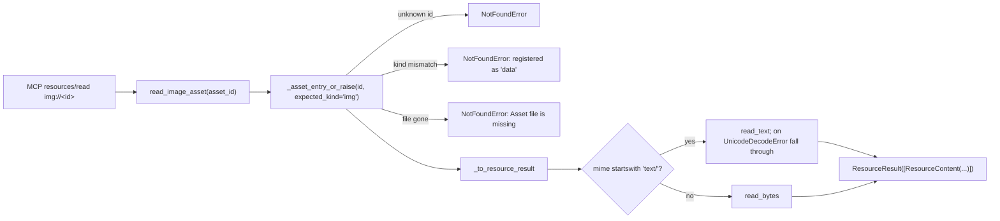
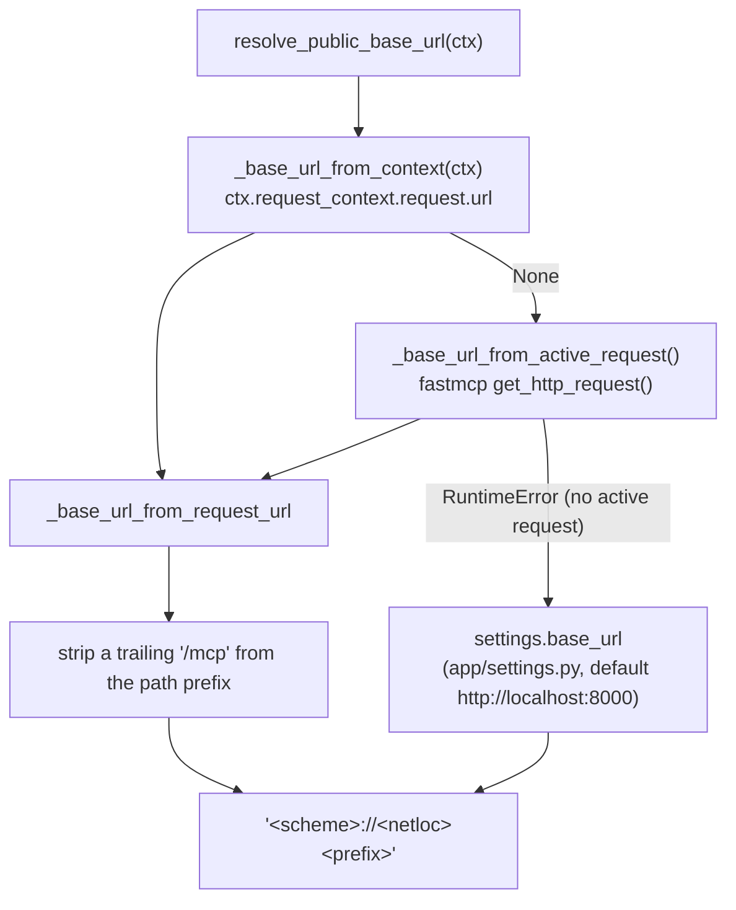
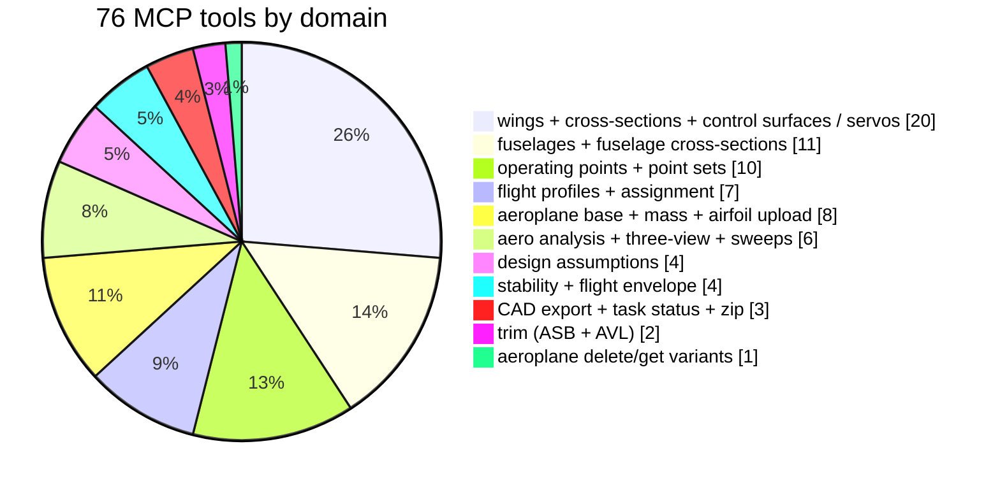

# Flowcharts — mcp-server

## 1. Where the MCP server sits

The MCP surface is a **second front door onto the same endpoint functions** —
not a second implementation. `_call_endpoint` imports the FastAPI handler and
calls it as a plain Python callable, bypassing routing, dependency injection
and middleware.

## 2. Registration — decorator collects, factory installs

The decorator only *records* metadata; the signature of the decorated
coroutine is what FastMCP introspects for the tool's input schema, so the
Pydantic types in the handler signature (`UUID4`, `OperatingPointSchema`,
`AlphaSweepRequest`, …) become the MCP JSON schema.

## 3. One tool invocation, end to end

**Transaction semantics differ from REST.** `get_db()` commits on success;
`_call_endpoint` uses a bare `with SessionLocal() as db:` which **never
commits**. Any MCP tool whose endpoint relies on the dependency's commit
persists nothing unless the service itself commits.

## 4. `_normalize_result` — FastAPI return types → MCP JSON

## 5. The asset registry — binary results become URLs + resources

### Reading an asset back

`ASSET_REGISTRY` is a **process-local dict**. It does not survive a restart and
is not shared across workers, so an `img://…` URI issued by one process is a
404 in any other.

## 6. Public base-URL resolution (the dual-URL problem)

Both URLs are then emitted side by side, because the caller's network view and
the browser's view differ when the service runs in a container:
`url_from_docker_container` (request-derived) vs `url_for_webui` /
`url` (from `settings.base_url`).

## 7. Tool coverage vs the REST surface

Domains **absent** from MCP although they exist in REST: versioning
(`/branches`, `/lineages`), copilot history and stream, component tree,
components / component types (COTS), construction plans and parts,
construction templates, mass & CG, loading scenarios, mission objectives,
weight items, endurance, matching chart, tail sizing, field lengths, forward
CG, speed polar, turbulator optimizer, powertrain (all five routers),
OpenVSP import, fuselage slice, health.
