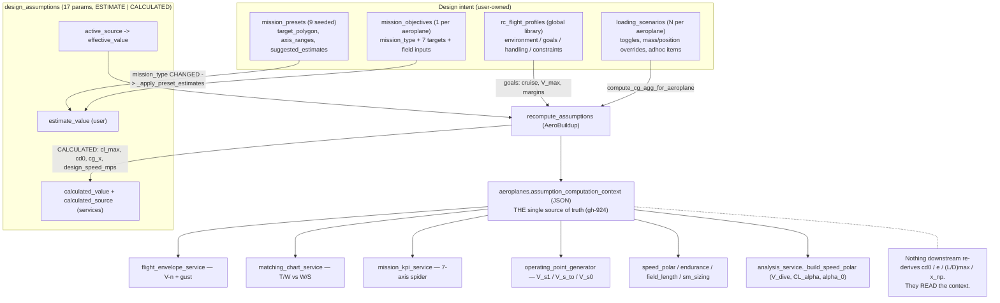
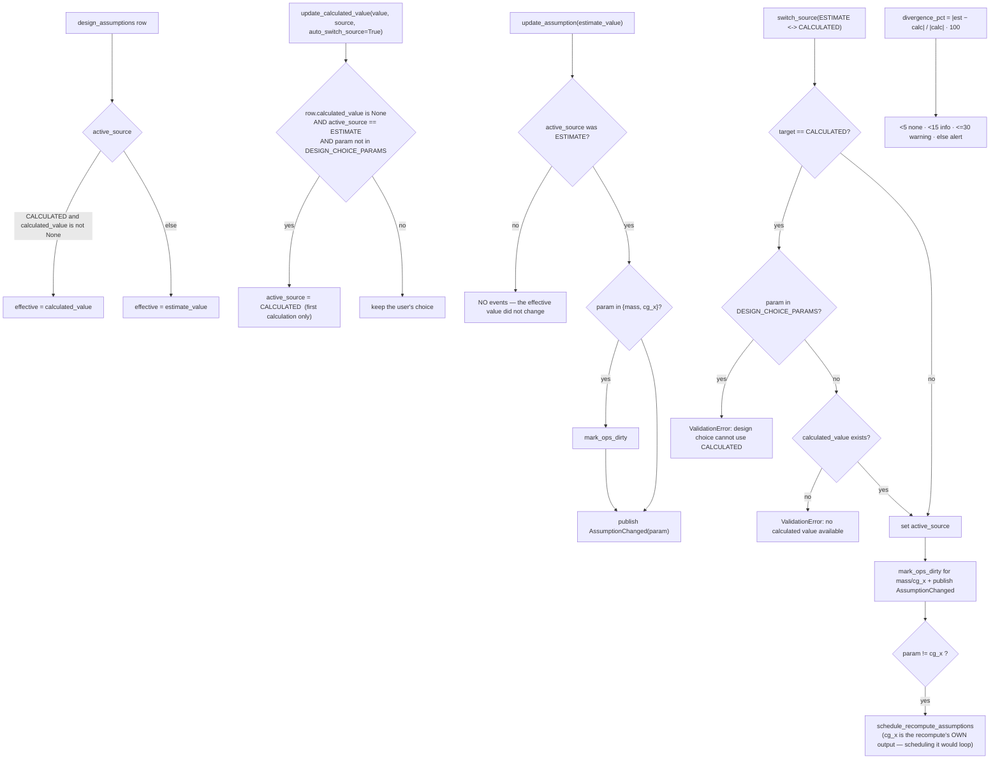
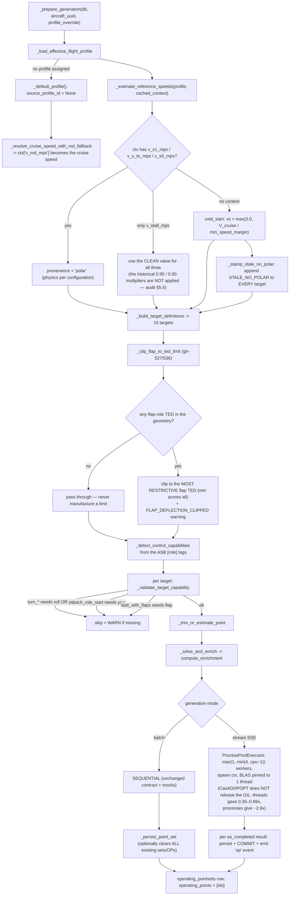
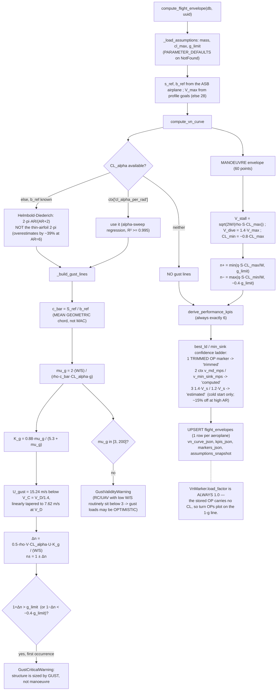
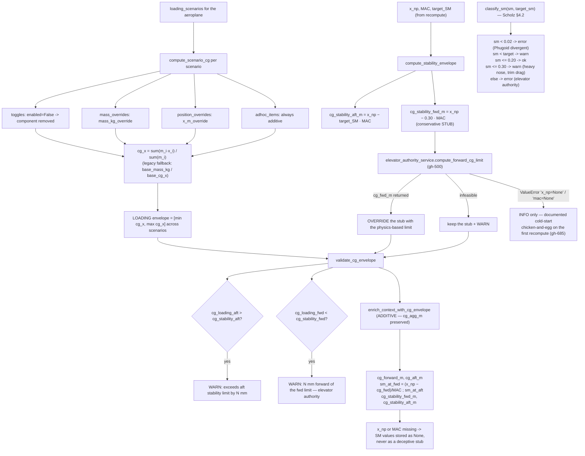
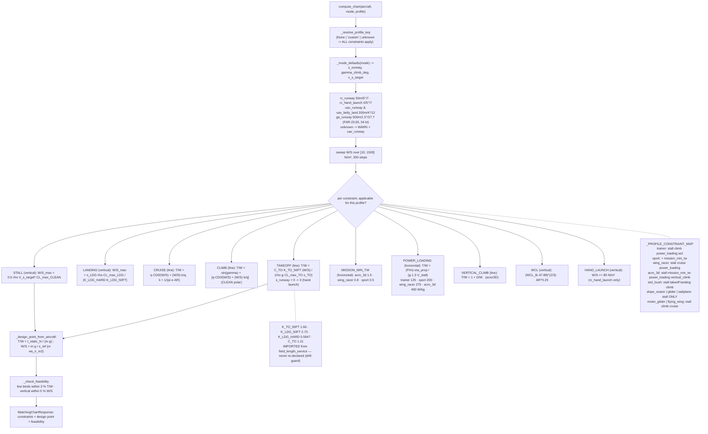
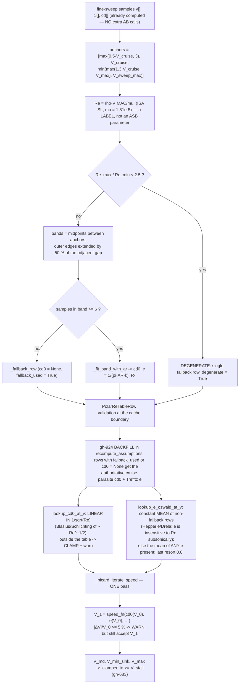

# Flowcharts — mission-and-sizing

## 1. Design intent → assumptions → aero context → consumers

## 2. The ESTIMATE ↔ CALCULATED duality

## 3. Operating-point generation — the sizing sweep

## 4. Two-stage trim solve per target

```mermaid
flowchart TD
    A["target: name, config, velocity, altitude, beta, n_target, flap"] --> B["rho = Atmosphere(altitude).density()<br/>CL_target(V) = m·g·n / (0.5·rho·V²·S_ref)"]
    B --> C["STAGE 1 — asb.Opti (IPOPT)"]
    C --> C1["variables: alpha in [−8°, max_alpha_deg]<br/>pitch δ in [−25, 25]<br/>(turn) roll δ in [−20, 20]<br/>(turn|dutch) yaw δ in [−25, 25]<br/>flap δ is FIXED, not an optimiser variable"]
    C1 --> C2["objective = 50·Cm² + 3·CY²<br/>[+ 15·(CL − CL_target)²]<br/>[+ 2·Cl² + 2·Cn² for turns]<br/>+ 0.001·sum(δ²)"]
    C2 --> C3["solve(max_iter=120, max_runtime=0.35 s,<br/>behavior_on_failure='return_last')"]
    C3 --> D["trim_score = |Cm| + 0.5·|CY| [+ 0.3·|CL − CL_target|]"]

    D --> E{"score > 0.35 ?"}
    E -->|no| H
    E -->|yes| F["STAGE 2 — grid search"]
    F --> F1["velocity factors [1.0, 1.05, 1.10, 1.15]<br/>(descending for max_level_speed)<br/>x alpha = linspace(−4°, 20°, 13) x beta candidates"]
    F1 --> F2{"gs_score < best_score ?"}
    F2 -->|yes| F3["adopt alpha, beta, AND velocity (gh-528)<br/>trim_method = 'grid_fallback'<br/>NOTE: the grid never varies control surfaces"]
    F2 -->|no| H
    F3 --> H["_apply_limit_warnings"]

    H --> H1{"score < 0.35 ?"}
    H1 -->|yes| H2["TRIMMED"]
    H1 -->|no| H3["NOT_TRIMMED + warning"]
    H2 --> H4{"|alpha| > max_alpha_deg or |beta| > max_beta_deg ?"}
    H3 --> H4
    H4 -->|yes| H5["LIMIT_REACHED + ALPHA_/BETA_LIMIT_REACHED"]
    H4 -->|no| I

    H5 --> I{"bank target?"}
    I -->|yes| I1["n = 1/cos(phi) ; V_stall_turn = V_s1·sqrt(n)"]
    I1 --> I2{"V < V_stall_turn ?"}
    I2 -->|yes| I3["LIMIT_REACHED + STALL_IN_TURN"]
    I2 -->|no| J
    I -->|no| J["surface the fixed flap δ into controls (gh-527)"]
    I3 --> J
    J --> K["_aero_coefficients_at -> CL/CD/Cm at the trimmed state (gh-861)"]
    K --> L["TrimmedPoint(alpha_rad, beta_rad, p, q, r, status, warnings,<br/>controls, trim_score, trim_residuals, trim_method)"]

    warn["gh-627: the solver-path label lives on trim_method.<br/>trim_residuals is typed dict[str, float] and Pydantic-REJECTS strings —<br/>a stray residuals['solver_path']='opti' once broke every OP enrichment."]
    L -.- warn
```

## 5. Flight envelope — manoeuvre + Pratt-Walker gust

## 6. CG envelope — loading inside stability

## 7. Matching chart — T/W vs W/S with per-profile constraints

## 8. Reynolds-banded polar table (gh-493) and its lookups

