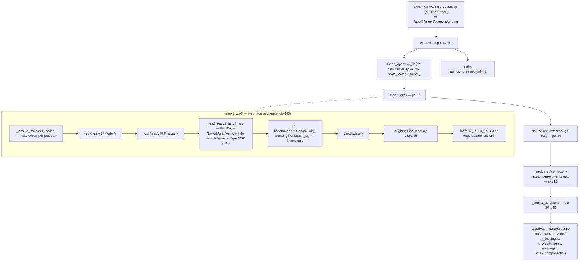
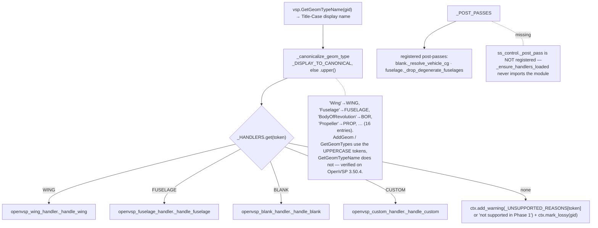
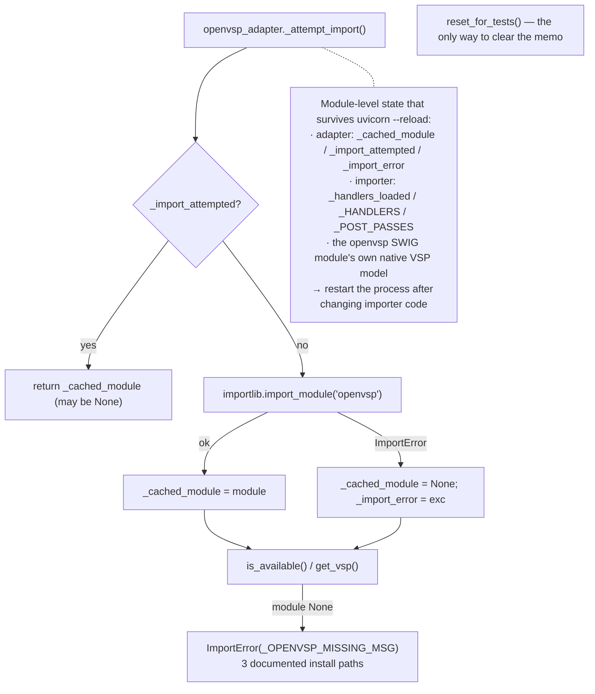
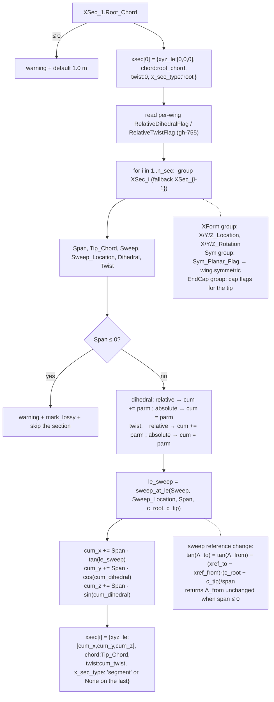
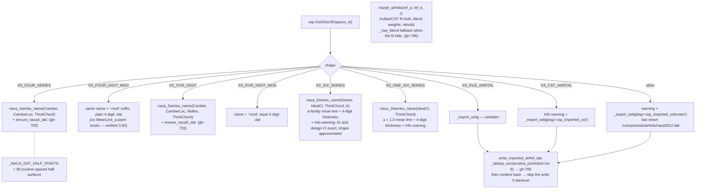
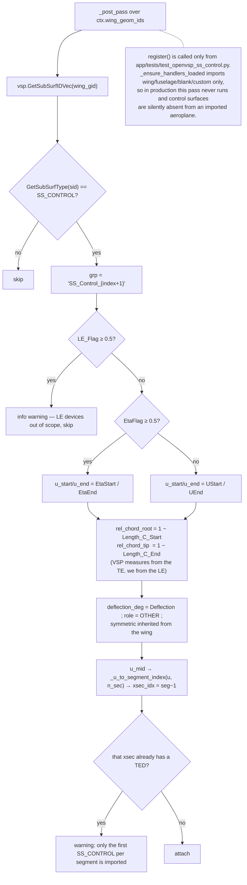
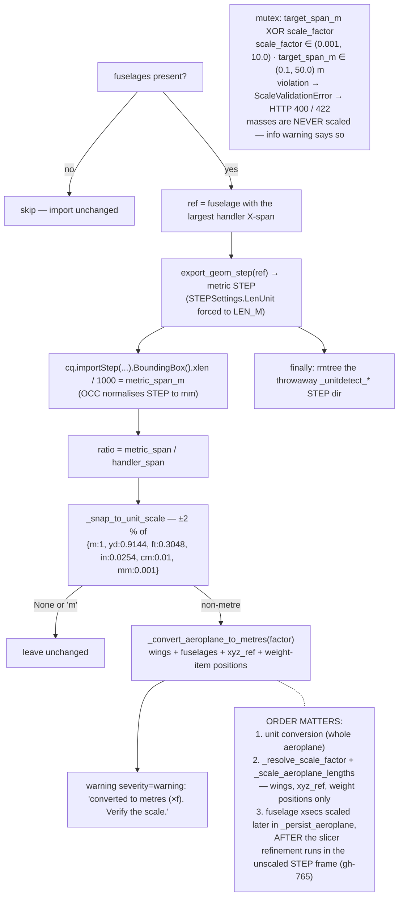
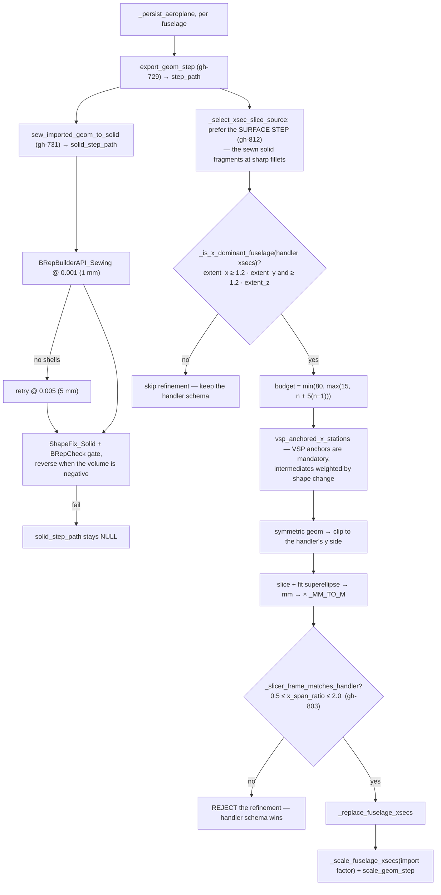
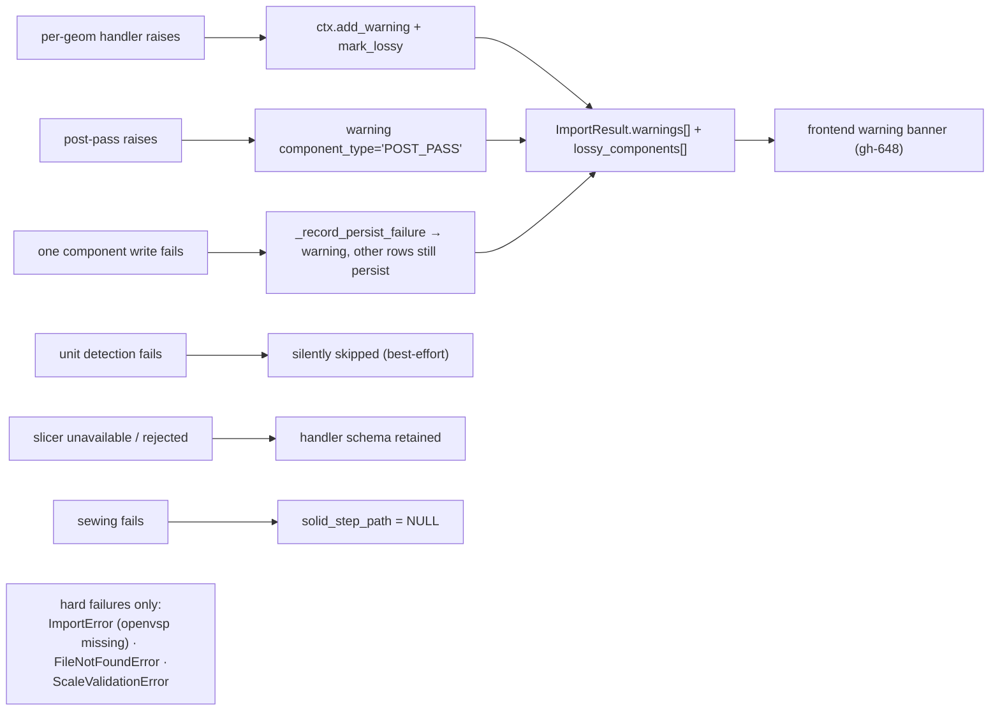
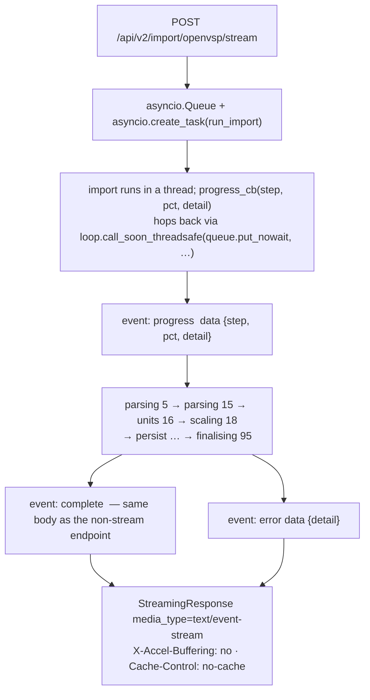

# Flowcharts — openvsp-import

## 1. End-to-end pipeline

## 2. Geom dispatch and the canonical type token

## 3. The adapter and its module-level state

## 4. Wing handler — planform derivation

## 5. Airfoil resolution — `import_airfoil_from_xsec`

## 6. SS_CONTROL → TrailingEdgeDevice (registered nowhere)

## 7. Source-unit detection (gh-808) and the scaling order

## 8. Fuselage refinement gates and STEP artefacts

## 9. Error policy — nothing aborts the import

## 10. Streaming progress (gh-737)

