# Flowcharts — platform-core

## 1. Application composition (`create_app`, `app/main.py:94`)

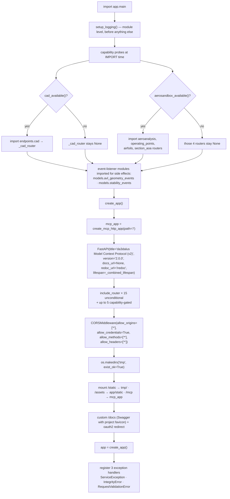

Router order matters once: `versioning_v2.router` is included **before**
`aeroplane_v2.router` so the static path `/aeroplanes/compare` wins over the
dynamic `/aeroplanes/{aeroplane_id}` (gh-914).

## 2. Lifespan — startup and shutdown

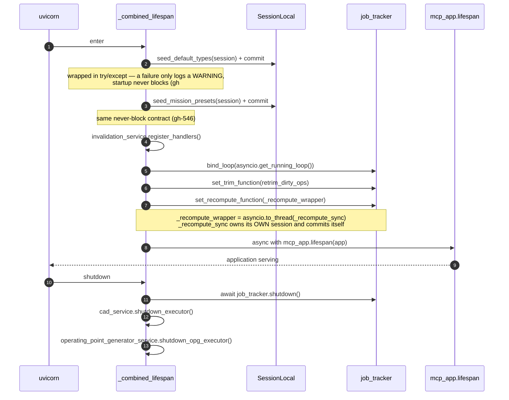

## 3. Transaction ownership — the single most repeated invariant

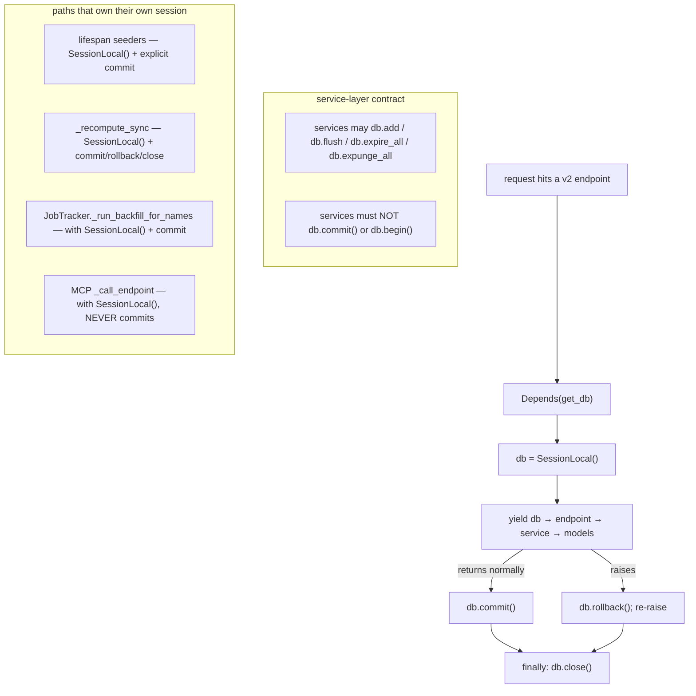

## 4. Error translation

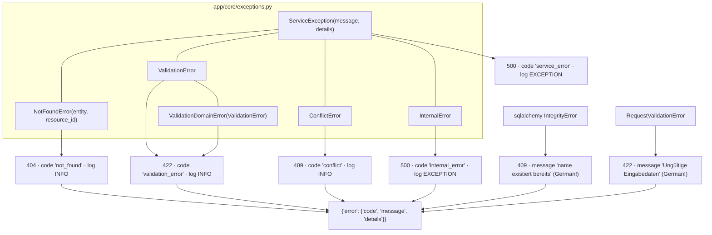

`details` is passed through `jsonable_encoder(..., custom_encoder={BaseException: str})`
so an exception stored in `details` serialises instead of crashing the handler.

## 5. Configuration — two independent Settings classes

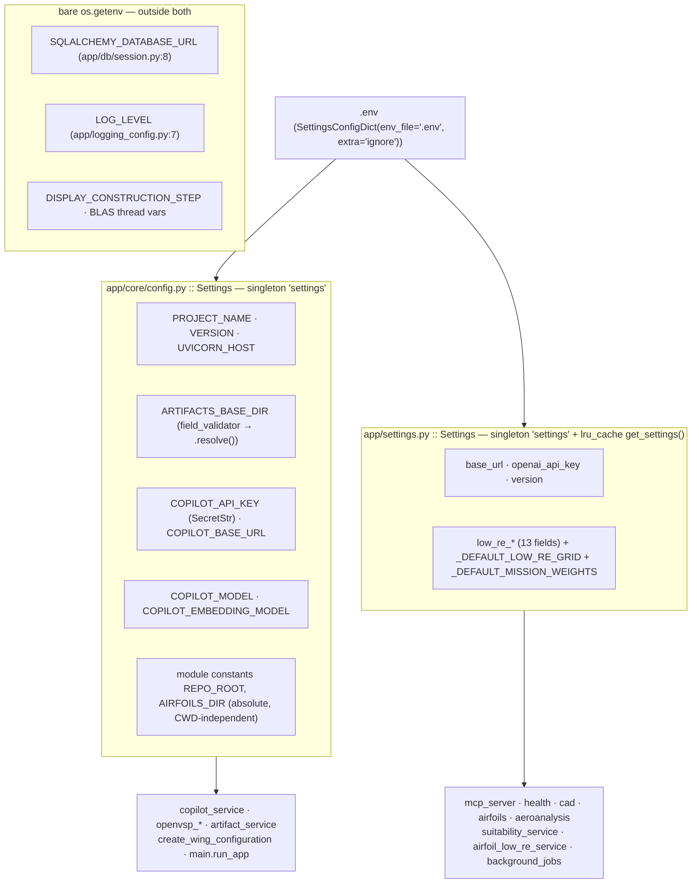

Two classes both named `Settings`, both exporting a module-level `settings`,
both reading the same `.env`, with **disjoint fields** and different version
strings (`VERSION = "1.0.0"` vs `version = "0.1.0"`; `/health` reports the
latter). See `questions.md` — platform-core.

## 6. Platform capability guard

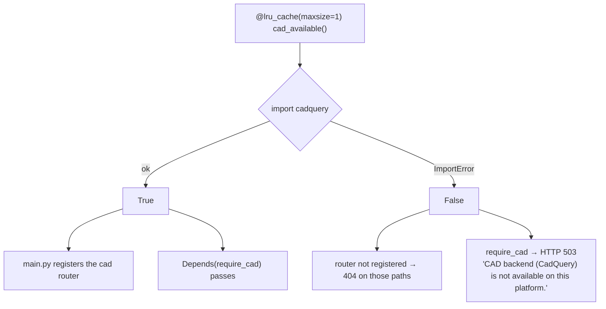

Identical shape for `aerosandbox_available()` / `require_aerosandbox()`. The
probes are cached for the life of the process — a broken install detected once
stays broken.

## 7. Invalidation and background jobs

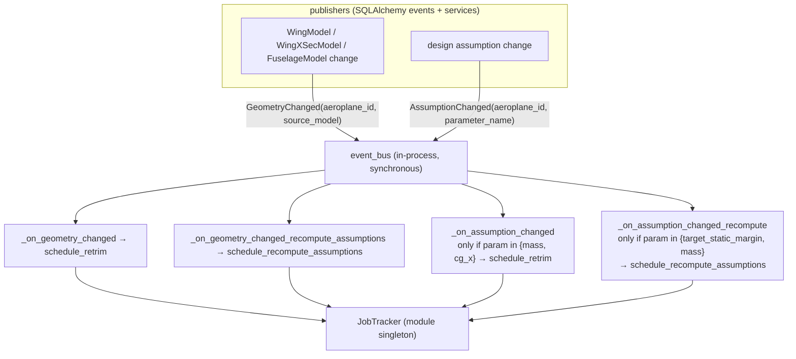

`EventBus.publish` wraps every handler in try/except and only logs on failure —
a broken subscriber can never break the publishing request.

### Debounce state machine

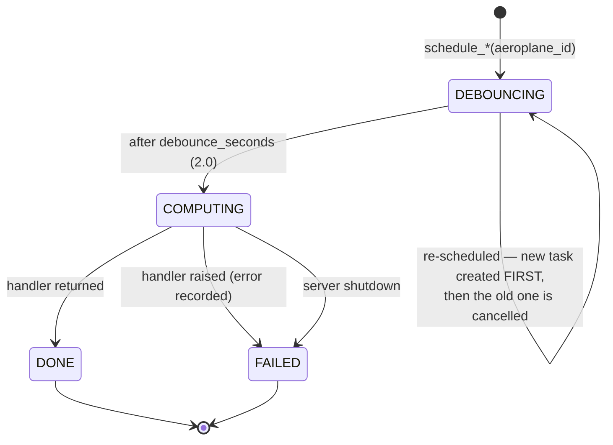

`schedule_retrim` additionally short-circuits while a job is already
`COMPUTING`. `schedule_recompute_assumptions` does **not** — it cancels and
re-debounces regardless.

### Cross-thread scheduling (`_create_task_safe`)

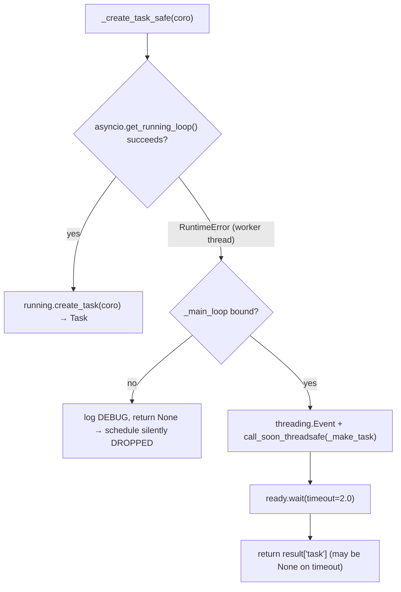

The create-before-cancel ordering in both `schedule_*` methods exists precisely
because this can return `None`: cancelling first would strand the job in
`DEBOUNCING` with no task to fire it.

## 8. Non-finite float safety on the JSON boundary

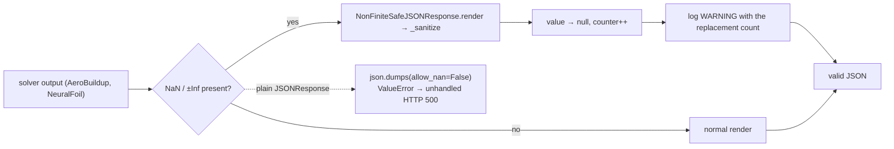

`null` is chosen deliberately as an honest "no value" — never a fabricated
fallback number that would hide the degenerate geometry upstream.

## 9. Database engine bootstrap

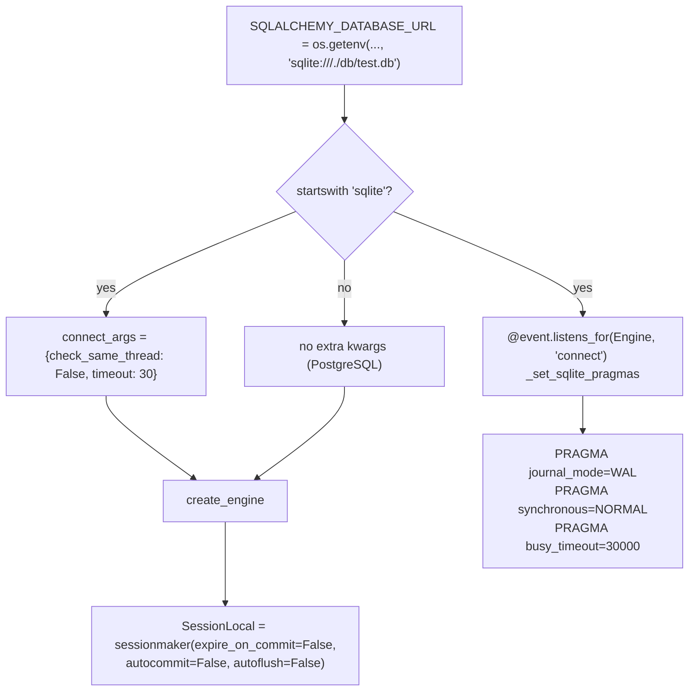

`check_same_thread=False` is required because `asyncio.to_thread` workers use
the session across threads; WAL + `busy_timeout` exist because the assumption
recompute holds a write transaction open for several seconds while AeroBuildup
runs.

`Base` (`app/db/base.py`) is 11 lines: a declarative base with an implicit
`id = Column(Integer, primary_key=True, index=True)` and a `__tablename__`
derived from `cls.__name__.lower()` — which is why almost every model
overrides `__tablename__` explicitly.
