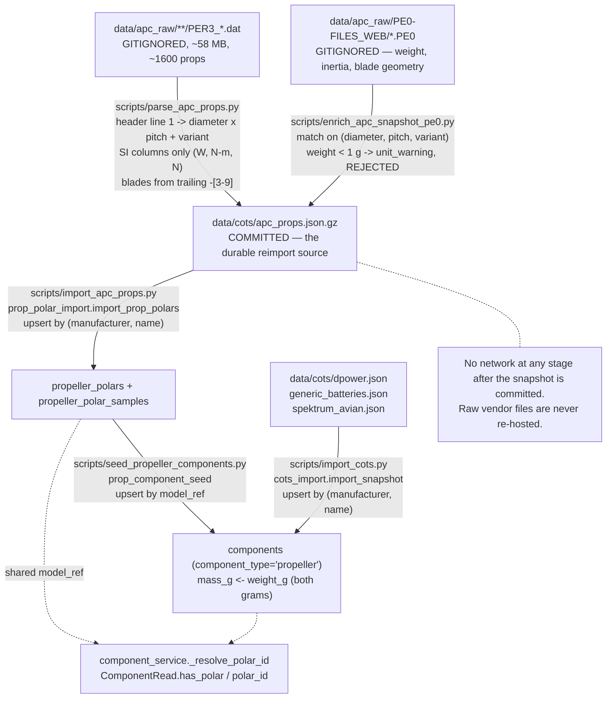
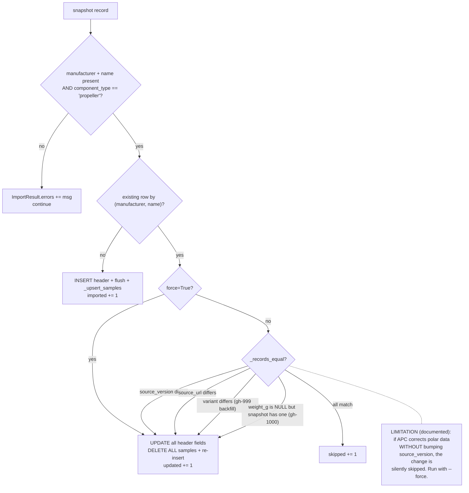
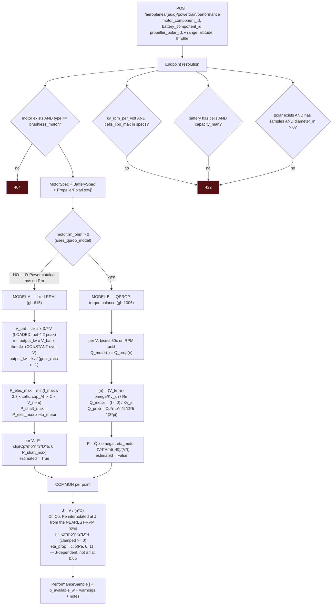
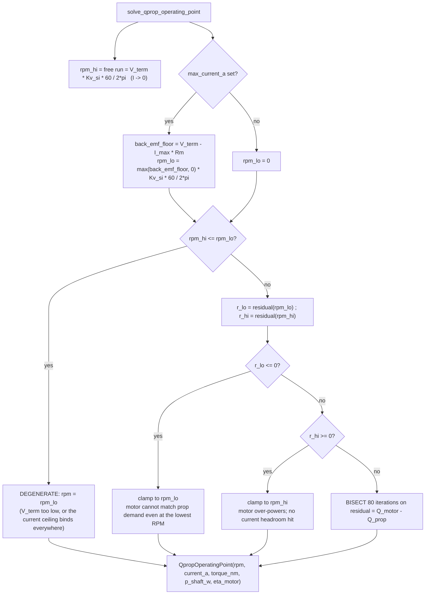
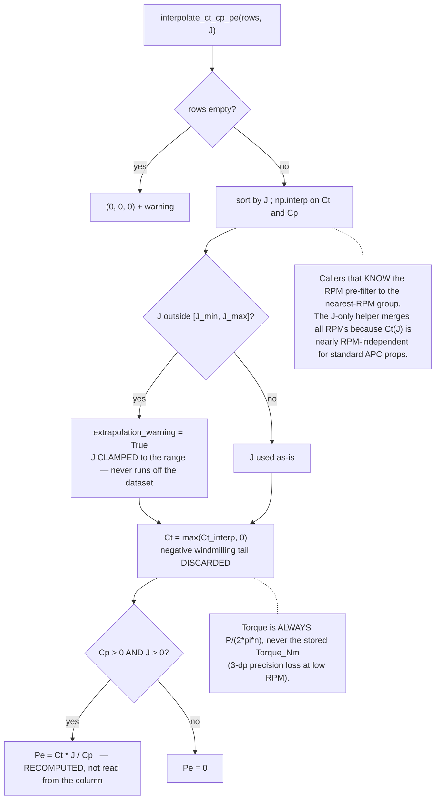
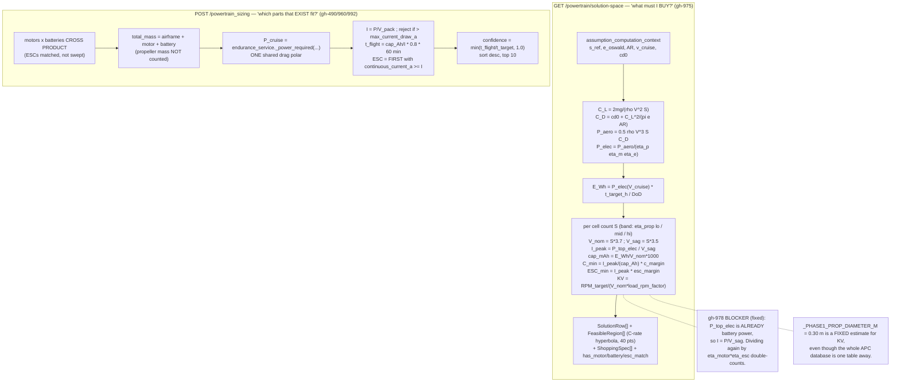
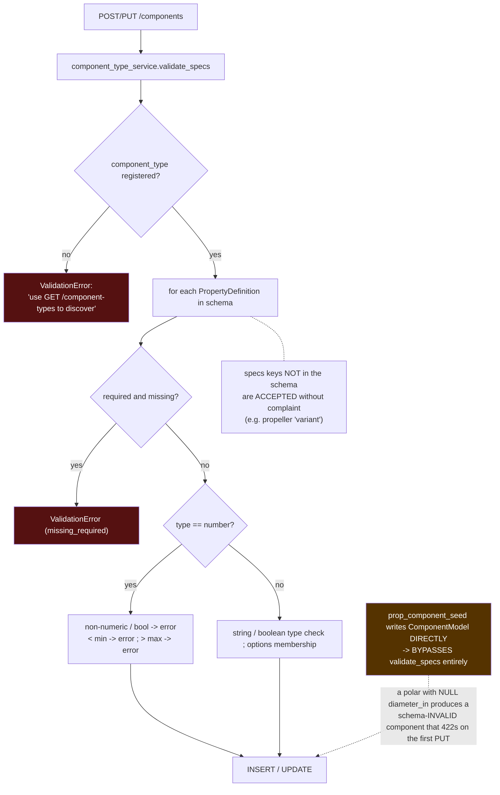

# Flowcharts — powertrain

## 1. Data pipeline — raw vendor files to a selectable component

## 2. Reimport decision — when is a row rewritten?

## 3. Performance model — two motor models under one API

## 4. QPROP bisection — the bracket

## 5. Interpolation guards

## 6. Solution space vs catalog sweep — two opposite questions

## 7. Component-type validation

