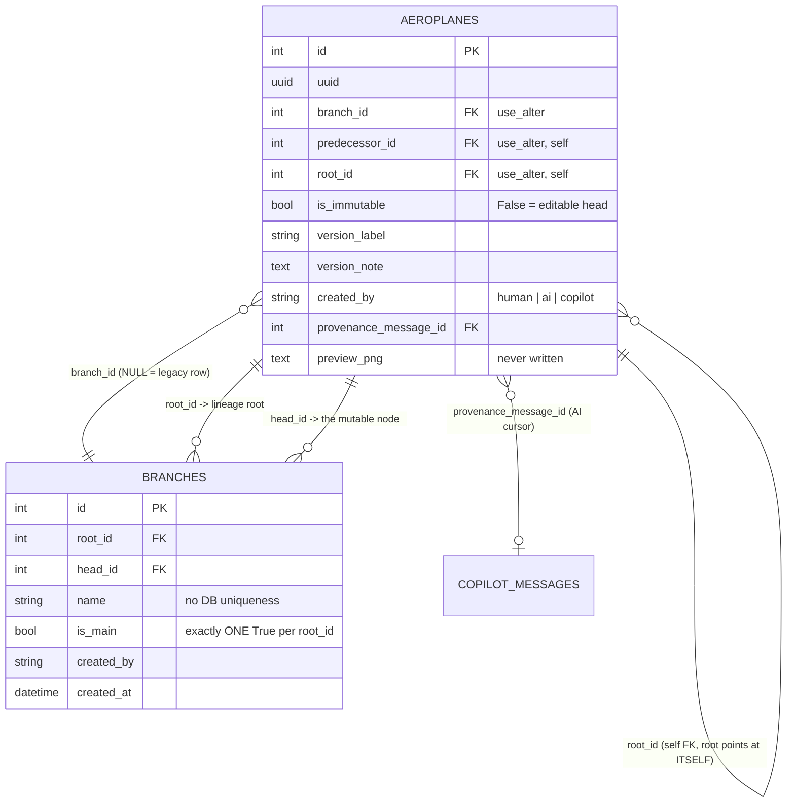
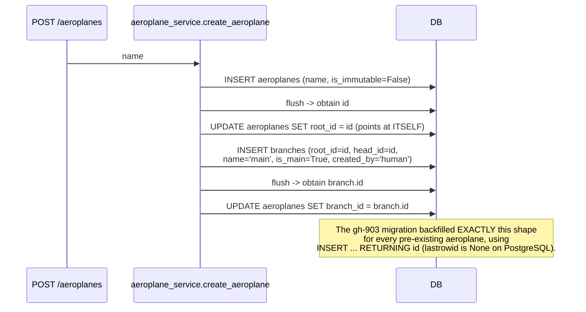
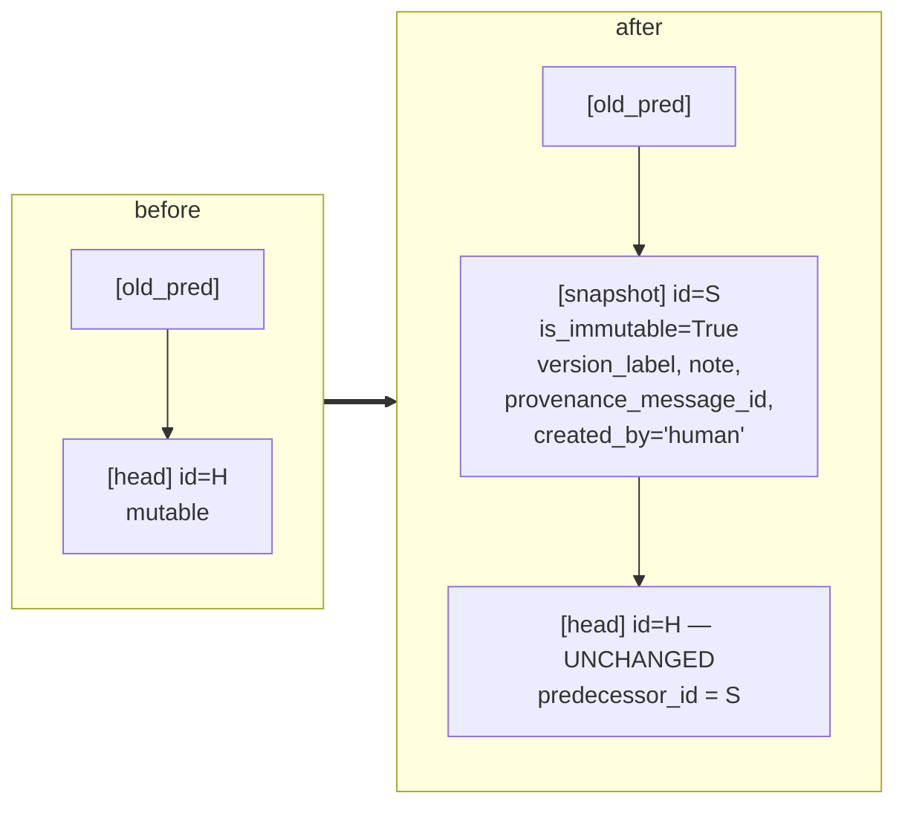
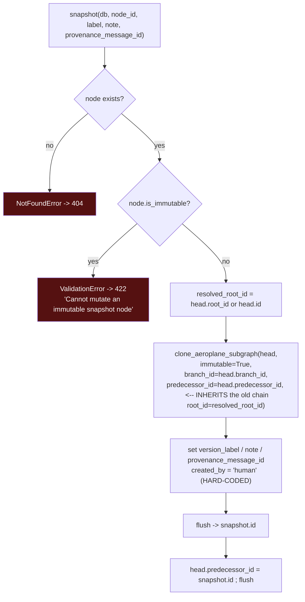
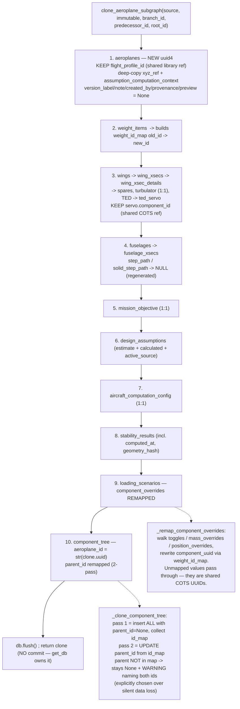
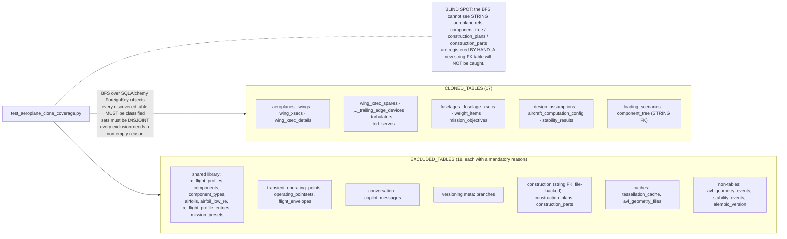
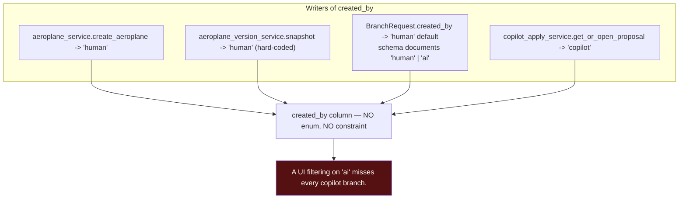
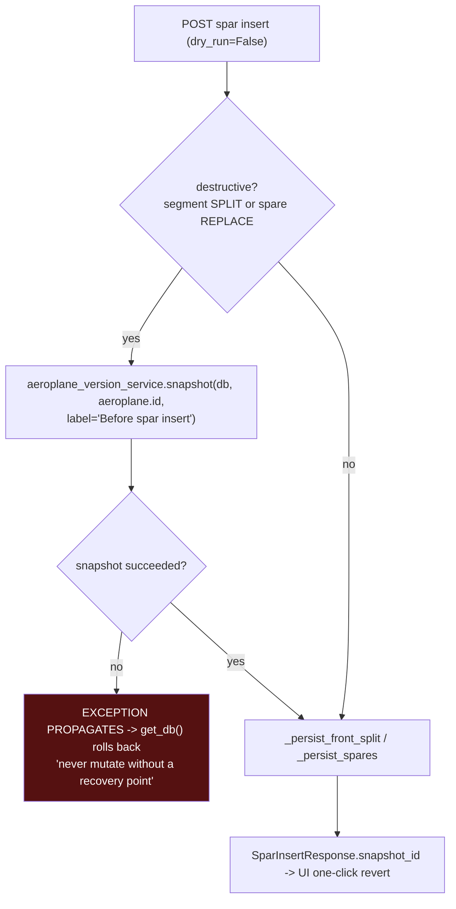
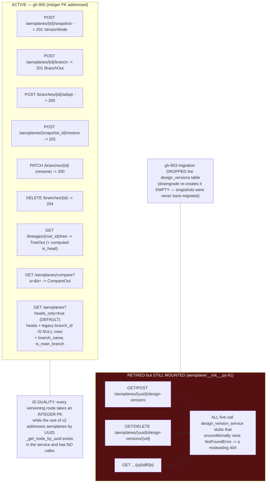

# Flowcharts — versioning

## 1. The data model — a DAG of real aeroplane rows



The four FKs between `aeroplanes` and `branches` form a **cycle**, which is why
all of them are declared `use_alter=True` (emitted as separate `ALTER TABLE`
statements). SQLite has no deferrable FKs, so `discard_branch` must NULL
inbound `predecessor_id` references by hand.

## 2. Lineage bootstrap — every aeroplane is a node



## 3. `snapshot` — the counter-intuitive one



The frozen copy is inserted **behind** the head, so the head keeps its `id`,
`uuid` and every inbound reference — the UI never has to re-point after a
snapshot.



## 4. Branch / adopt / restore / discard

```mermaid
flowchart TD
    subgraph CB["create_branch(from_node_id, name, created_by)"]
        C1["root_id = source.root_id or source.id"] --> C2["clone(immutable=False,<br/>branch_id=None,<br/>predecessor_id=source.id, root_id)"]
        C2 --> C3["new_head.created_by = created_by ; flush"]
        C3 --> C4["INSERT branches(root_id, head_id=new_head.id,<br/>name, is_main=False, created_by)"]
        C4 --> C5["back-fill new_head.branch_id = branch.id"]
    end

    subgraph AD["adopt_branch(branch_id)"]
        A1{"branch.is_main?"} -->|yes| A2["ConflictError -> 409<br/>'already the main branch'"]
        A1 -->|no| A3["find current main WHERE root_id = ? AND is_main"]
        A3 --> A4["current_main.is_main = False ; FLUSH"]
        A4 --> A5["branch.is_main = True ; flush"]
        A6["DEMOTE FIRST so the partial unique index<br/>uq_branches_one_main_per_root never sees two True"]
        A4 -.- A6
    end

    subgraph RS["restore(snapshot_node_id, name, created_by)"]
        R1{"node.is_immutable?"} -->|no| R2["ValidationError -> 422<br/>'restore() requires an immutable snapshot'"]
        R1 -->|yes| R3["create_branch(from snapshot)<br/>default name = 'restore/&lt;version_label&gt;'"]
    end

    subgraph DC["discard_branch(branch_id)"]
        D1{"is_main?"} -->|yes| D2["ConflictError -> 409"]
        D1 -->|no| D3{"sibling branch count <= 1?"}
        D3 -->|yes| D4["ConflictError -> 409<br/>'only branch of a lineage root'"]
        D3 -->|no| D5["collect nodes WHERE branch_id = ?"]
        D5 --> D6["UPDATE aeroplanes SET predecessor_id = NULL<br/>WHERE predecessor_id IN (those ids)"]
        D6 --> D7["db.delete(branch) FIRST<br/>else SQLAlchemy nulls branches.head_id (NOT NULL) via the relationship"]
        D7 --> D8["db.delete(node) for each — ORM cascade removes the subgraph"]
    end

    style A2 fill:#511,color:#fff
    style R2 fill:#511,color:#fff
    style D2 fill:#511,color:#fff
    style D4 fill:#511,color:#fff
```



## 5. The clone engine — 17 tables, ordered and re-keyed



## 6. Clone coverage registry



## 7. Provenance — who created this node



### The AI proposal-branch lifecycle (detail belongs to Cluster E)

```mermaid
sequenceDiagram
    participant U as User
    participant CP as copilot_apply_service
    participant VS as aeroplane_version_service
    participant DB as DB

    U->>CP: copilot proposes an edit
    CP->>CP: root_id = node.root_id or node.id
    CP->>DB: SELECT branches WHERE root_id=? AND NOT is_main<br/>AND created_by='copilot' AND name LIKE 'copilot-proposal%'
    alt an open proposal exists
        DB-->>CP: reuse it (ONE open proposal per lineage)
    else none
        CP->>VS: create_branch(live_head, 'copilot-proposal-<msg_id>', created_by='copilot')
        VS->>DB: clone subgraph + INSERT branches
    end
    CP->>CP: apply_edits(proposal_uuid, ops) -> recompute_assumptions
    CP->>CP: _metrics_payload(after) for the before/after diff

    alt user rejects
        CP->>CP: db.flush() ; db.expunge_all()
        Note over CP: expunge is REQUIRED — put_wing_as_wingconfig does<br/>delete-then-reinsert in the same session; the stale<br/>WingXSecSpareModel instances break the cascade delete with<br/>"Can't attach instance ... already present in this session"
        CP->>VS: discard_branch(proposal_branch_id)
    else user accepts
        CP->>VS: adopt_branch(proposal_branch_id) — old main demoted
    end
```

## 8. Auto-snapshot before a destructive edit (gh-1058)



## 9. REST surface + the retired parallel system


