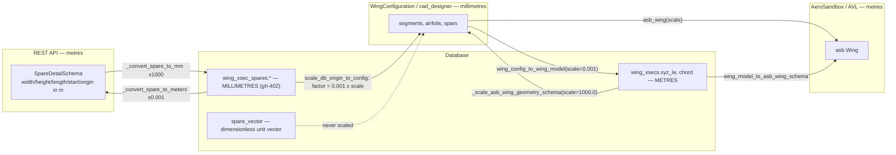
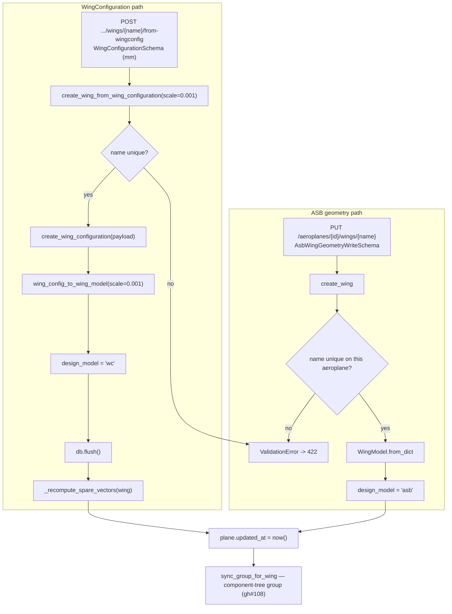
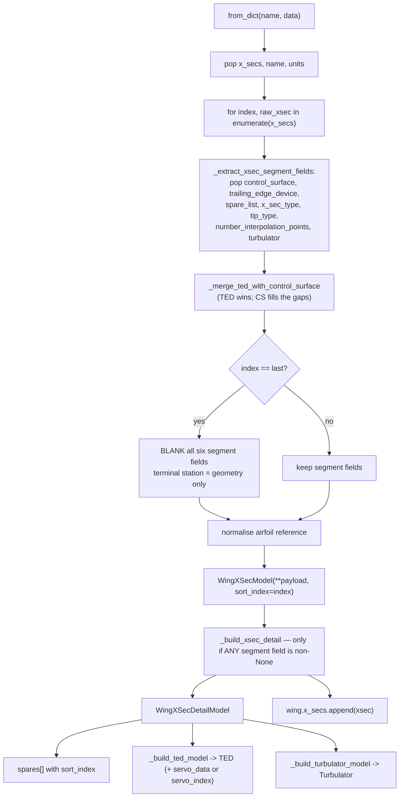
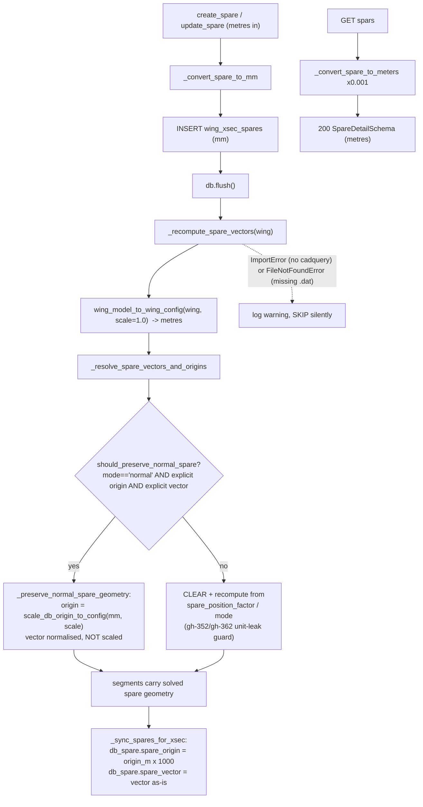
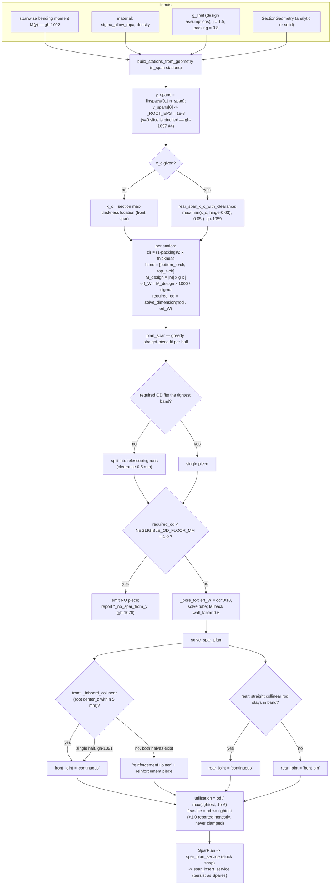
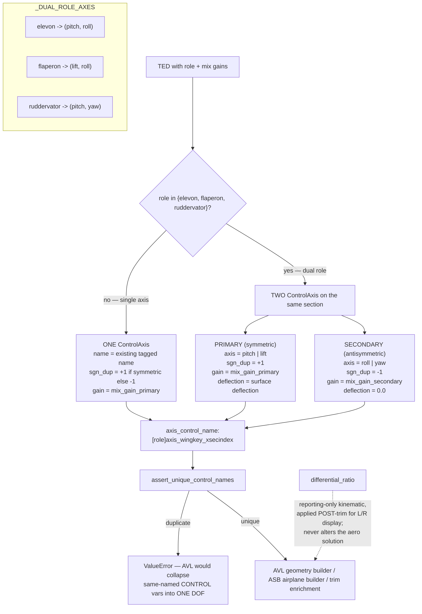
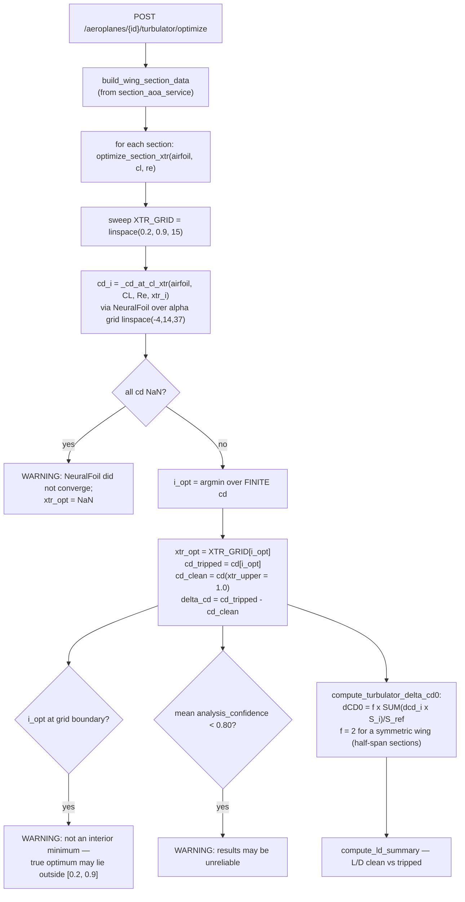

# Flowcharts — wing-design

## 1. The unit boundary (mm ↔ m)

## 2. Wing create — two entry paths

## 3. `WingModel.from_dict` — station vs segment split

## 4. Spar geometry round-trip (gh-402 / gh-1053)

## 5. Structural spar pipeline (gh-1008 → gh-1030 → gh-1032)

## 6. Control-surface mixing (gh-772)

## 7. Turbulator optimiser (gh-934)

