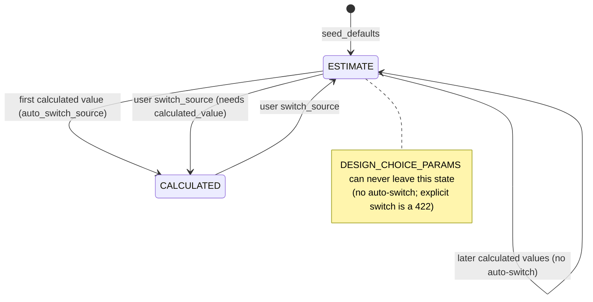

# design-assumptions — Technical Design

> Use-case design, nested under the module
> [`mission-and-sizing`](../design.md).
> Focuses on HOW this use case is built, read from the legacy code.
> Confidence markers: 🟢 CONFIRMED · 🟡 INFERRED · 🔴 GAP.
> Companion documents: [`requirements.md`](requirements.md),
> [`tasks.md`](tasks.md), [`../contracts.md`](../contracts.md) §A.

## Interface

| Symbol | Signature | Returns | Note |
|---|---|---|---|
| `get_effective_assumption` | `(db, aeroplane_id: int, param_name: str)` | `float \| None` | the read every consumer should use; `PARAMETER_DEFAULTS` fallback on a missing row 🟢 |
| `seed_defaults` | `(db, aeroplane_uuid)` | `AssumptionsSummary` | idempotent; also seeds the computation config 🟢 |
| `list_assumptions` | `(db, aeroplane_uuid)` | `AssumptionsSummary` | computes `warnings_count` 🟢 |
| `update_assumption` | `(db, aeroplane_uuid, param_name, data: AssumptionWrite)` | `AssumptionRead` | publishes **only** when `active_source == ESTIMATE` 🟢 |
| `switch_source` | `(db, aeroplane_uuid, param_name, data: AssumptionSourceSwitch)` | `AssumptionRead` | always publishes; schedules a recompute except for `cg_x` 🟢 |
| `update_calculated_value` | `(db, aeroplane_uuid, param_name, value, source, auto_switch_source=False)` | `AssumptionRead` | writes only; never publishes 🟢 |
| `compute_divergence_pct` | `(estimate: float, calculated: float \| None)` | `float \| None` | `None` when `calculated` is `None` **or** `0` 🟢 |
| `divergence_level` | `(pct: float \| None)` | `"none" \| "info" \| "warning" \| "alert"` | pure 🟢 |
| `_assumption_to_read` | `(model)` | `AssumptionRead` | the only place the effective value is materialised for the API 🟢 |
| `mass_cg_service.get_effective_assumption_value` | `(db, aeroplane_uuid, param_name)` | `float` | 🔴 a **second** reader: UUID-keyed, raises `NotFoundError` |

HTTP surface: see [`../contracts.md`](../contracts.md) §A — nine routes on
`app/api/v2/endpoints/aeroplane/design_assumptions.py`.

## Main Flow

```
1. Aeroplane created / recompute starts
       seed_defaults(db, uuid)
         · insert the missing rows out of PARAMETER_DEFAULTS (15)
           estimate_value = default, active_source = "ESTIMATE"
         · insert aircraft_computation_config from COMPUTATION_CONFIG_DEFAULTS
           when absent
         · db.flush(); return list_assumptions(...)

2. User edits an estimate
       PUT /aeroplanes/{uuid}/assumptions/{param}     body {estimate_value}
         · path regex rejects an unknown {param} with 422    (BR-MS31)
         · active_was_estimate = (row.active_source == "ESTIMATE")   ← captured
           BEFORE the write
         · row.estimate_value = new
         · row.divergence_pct = compute_divergence_pct(new, row.calculated_value)
         · flush + refresh
         · if active_was_estimate:
               if param in {mass, cg_x}:  mark_ops_dirty(db, aeroplane.id)
               event_bus.publish(AssumptionChanged(aeroplane_id, param))
         · return _assumption_to_read(row)

3. User toggles the source
       PATCH /aeroplanes/{uuid}/assumptions/{param}/source   body {active_source}
         · CALCULATED and param in DESIGN_CHOICE_PARAMS   → ValidationError → 422
         · CALCULATED and calculated_value is None        → ValidationError → 422
         · row.active_source = requested; flush + refresh
         · if param in {mass, cg_x}:  mark_ops_dirty(...)
         · event_bus.publish(AssumptionChanged(...))            ← ALWAYS
         · if param != "cg_x":  job_tracker.schedule_recompute_assumptions(...)

4. A compute/aggregation service reports a calculated value
       update_calculated_value(db, uuid, param, value, source, auto_switch_source)
         · should_switch = auto_switch_source
                           and row.calculated_value is None
                           and row.active_source == "ESTIMATE"
                           and param not in DESIGN_CHOICE_PARAMS
         · row.calculated_value = value; row.calculated_source = source
         · row.divergence_pct = compute_divergence_pct(row.estimate_value, value)
         · if should_switch: row.active_source = "CALCULATED"
         · NO event is published — the caller owns the fan-out

5. Consumers read
       get_effective_assumption(db, aeroplane_id, param)
       GET /aeroplanes/{uuid}/assumptions/computation-context   (the cache)
       GET /aeroplanes/{uuid}/assumptions/recompute-status      (the job)
```

## State machine 🟢

(`../../state-machines.md` §5)



The auto-switch guard is deliberately **four-fold** — the caller's intent, a
null calculated value, the current source, and design-choice membership. Any
one of them false leaves the source alone. 🟢

## Divergence 🟢

```python
compute_divergence_pct(estimate, calculated):
    if calculated is None or calculated == 0:   return None
    return round(abs(estimate - calculated) / abs(calculated) * 100, 1)

divergence_level(pct):
    None or pct < 5   -> "none"
    pct < 15          -> "info"
    pct <= 30         -> "warning"
    else              -> "alert"
```

The denominator is the **calculated** value, so the percentage answers *"how far
is my guess from physics"*, not the reverse. 🟢
`warnings_count` in `AssumptionsSummary` counts `warning` **and** `alert`. 🟢
🔴 `calculated == 0` collapses to `None`. `t_static_N` (glider default `0.0`)
and the `power_to_weight` a sailplane preset writes are exactly the cases where
a zero is legitimate, so a large estimate against a zero calculation reports
nothing.

## The event fan-out 🟢

```
update_assumption (ESTIMATE active)
    ├─ mark_ops_dirty            iff param ∈ {mass, cg_x}     (_OP_AFFECTING_PARAMS)
    └─ AssumptionChanged ──► invalidation_service routing
                               ├─ schedule_retrim              for {mass, cg_x}
                               └─ schedule_recompute_assumptions
                                     for _RECOMPUTE_TRIGGERING_PARAMS
                                        = {target_static_margin, mass}

switch_source (any direction)
    ├─ mark_ops_dirty            iff param ∈ {mass, cg_x}
    ├─ AssumptionChanged         ALWAYS
    └─ schedule_recompute_assumptions   DIRECTLY, iff param != "cg_x"
```

Two deliberate asymmetries 🟢:

1. `update_assumption` routes its recompute **through** the event bus and is
   therefore limited to `{target_static_margin, mass}`; `switch_source` calls
   the job tracker **directly** and covers *every* parameter but `cg_x`. A
   source toggle changes the effective value by definition, so the wider net is
   intentional.
2. `cg_x` is excluded from the direct path because it is the recompute's own
   output — `recompute → update_calculated_value(cg_x) → …` would re-enter
   (BR-83). `update_calculated_value` publishing nothing is the other half of
   that guard.

🟡 The two paths mean a recompute can be scheduled by two mechanisms with
different parameter sets; the debounce (`debounce_seconds = 2.0`) collapses the
duplicate.

## The catalogue 🟢

Fifteen entries in `PARAMETER_DEFAULTS`, with `PARAMETER_UNITS` and the
seven-member `DESIGN_CHOICE_PARAMS` frozenset alongside. The full table lives in
[`../contracts.md`](../contracts.md) §A. Design notes recorded **in the code**:

- `power_to_weight = 220.0 W/kg` sits in the "sport aerobatic / scale" band of
  the RC P/W chart (160–200 trainer · 200–240 sport · 240–290 advanced ·
  290–330 light 3D · 330–440 unlimited 3D · `0` = glider). 🟢
- `prop_efficiency = 0.65` is the middle of the typical 0.55–0.75 RC band. 🟢
- `battery_specific_energy_wh_per_kg = 180.0` is **pack-level** LiPo
  (Hepperle 2012; cell level ≈ 220). 🟢
- `battery_capacity_wh = 0.0` and `motor_continuous_power_w = 0.0` mean
  **"not yet set"**, not "zero" — the endurance computation returns `None`
  values with a warning rather than dividing. 🟡 A sentinel-by-zero convention.
- `t_static_N = 0.0` means glider/unknown; the user **must** override it for a
  powered runway takeoff. 🟢
- `design_speed_mps = 15.0` is overwritten by `V_md` through the `CALCULATED`
  path (gh-935); the user regains control by switching back to `ESTIMATE`. 🟢
- `power_to_weight` and `prop_efficiency` are deliberately **not** design
  choices: user-set initially, to be replaced by a powertrain computation
  later. 🟢

## Computation config 🟢

| Field | Default | Write bound |
|---|---|---|
| `coarse_alpha_min_deg` | `−5.0` | — |
| `coarse_alpha_max_deg` | `25.0` | — |
| `coarse_alpha_step_deg` | `1.0` | `> 0` |
| `fine_alpha_margin_deg` | `5.0` | `> 0` |
| `fine_alpha_step_deg` | `0.5` | `> 0` |
| `fine_velocity_count` | `8` | `2 … 50` |
| `debounce_seconds` | `2.0` | `0.5 … 30.0` |

Stored in its own table rather than as columns on `aeroplanes` **so the
configuration surface can grow without churning the aeroplanes schema** — the
rationale is in the model docstring. 🟢
The GET and the PUT both materialise the row on demand
(`db.add` + `flush` + `refresh`) and the PUT merges with
`model_dump(exclude_none=True)`. 🟢
🔴 No validator relates `coarse_alpha_min_deg` to `coarse_alpha_max_deg`, nor
`fine_alpha_step_deg` to `fine_alpha_margin_deg`.

## Alternative Flows

- **Aeroplane not found.** `_get_aeroplane` raises `NotFoundError` → **404** on
  every service entry point. 🟢
- **Assumption row not found** (seeded catalogue drifted, or the row was
  deleted). `update_assumption` / `switch_source` / `update_calculated_value`
  raise `NotFoundError(entity="DesignAssumption", resource_id=param)` → **404**;
  `get_effective_assumption` instead returns the catalogue default. 🟡 The same
  condition is a 404 on write and a silent default on read.
- **Unknown parameter name.** Never reaches the service — the path regex 422s
  first (BR-MS31). 🟢
- **`SQLAlchemyError` anywhere.** Logged and re-raised as
  `InternalError(f"Database error: {exc}")` → **500** with the driver message in
  the body. 🟡
- **`switch_source` to the value it already has.** Accepted; still publishes and
  still schedules a recompute. 🟡 An idempotent request is not a no-op here.
- **Preset application** writes `estimate_value` directly on the ORM row
  (`mission_objective_service._apply_preset_estimates`), **bypassing**
  `update_assumption` — so it publishes no event and creates the row when
  missing. 🔴 A second writer of `estimate_value` with different semantics; see
  [`../mission-objectives-presets/design.md`](../mission-objectives-presets/design.md).

## Dependencies

- **`platform-core`** — `get_db()` owning the transaction boundary (BR-78 /
  ADR 0009: the service never calls `db.begin()` or `db.commit()`), the
  `event_bus`, and `job_tracker` for the debounced recompute.
- **`aero-analysis`** — `assumption_compute_service` is the principal caller of
  `update_calculated_value` and the writer of
  `aeroplanes.assumption_computation_context`; `invalidation_service` routes
  `AssumptionChanged` onward.
- **`mass-and-balance`** — `sync_component_tree_to_mass` is the other
  `update_calculated_value` caller (for `mass`), and hosts the second effective
  value reader.
- **`mission-and-sizing` / mission presets** — writes `estimate_value` for five
  parameters on a mission change.

## Identified Design Decisions

| Decision | Evidence in code | Confidence |
|---|---|---|
| Two values plus a selector, per parameter (ADR 0010) | `design_assumptions` columns | 🟢 |
| The effective value is derived, never stored | `_assumption_to_read`, `get_effective_assumption` | 🟢 |
| Events fire on an **effective** change only | `active_was_estimate` captured before the write | 🟢 |
| `update_calculated_value` publishes nothing — the caller owns the fan-out | the function body | 🟢 |
| Auto-switch is guarded four ways and fires once | `should_switch` | 🟢 |
| Seven parameters are pure design choices | `DESIGN_CHOICE_PARAMS` | 🟢 |
| `cg_x` is excluded from the recompute shortcut to break the loop | `switch_source` `if param_name != "cg_x"` | 🟢 |
| The URL space is generated from the catalogue | `_PARAM_NAME_PATTERN` | 🟢 |
| The computation config lives in its own table to avoid churning `aeroplanes` | model docstring | 🟢 |
| A config row is materialised on read | GET handler | 🟡 |
| `0.0` is the "not set" sentinel for three parameters | `PARAMETER_DEFAULTS` comments | 🟡 |
| The divergence denominator is the calculated value | `compute_divergence_pct` | 🟢 |

## Internal State

| Table | Cardinality | Note |
|---|---|---|
| `design_assumptions` | one row per `(aeroplane, parameter_name)` | `uq_assumption_aeroplane_param`; FK `ON DELETE CASCADE` |
| `aircraft_computation_config` | one per aeroplane | `uq_computation_config_aeroplane`; created on demand |
| `aeroplanes.assumption_computation_context` | one JSON blob per aeroplane | **read** here, written by `aero-analysis` |
| `job_tracker` recompute jobs | in-memory, per aeroplane id | not persisted; `"idle"` after a restart |

## Observability

- `calculated_source` names the producer of every calculated value
  (`aerobuildup`, `best_glide_v_md`, `stability_analysis`, weight sync, …). 🟢
- `divergence_pct` is persisted, so a stale estimate is visible without
  recomputing. 🟢
- `updated_at` carries `onupdate`. 🟢
- The recompute job exposes `status` / `started_at` / `finished_at` / `error`
  so the UI can show "Recomputing…" regardless of which event triggered it. 🟢
- Every service function logs `SQLAlchemyError` before converting it. 🟢
- 🟡 Nothing records **when** a divergence first appeared, so "the estimate has
  been stale for a week" is not expressible.
- 🔴 Nothing logs the *suppressed* fan-out. An estimate edit under an active
  `CALCULATED` is intentionally silent — including in the logs — so "why did my
  change do nothing?" has no server-side trace.

## Constants 🟢

| Constant | Value | Where |
|---|---|---|
| `PARAMETER_DEFAULTS` | 15 entries, see [`../contracts.md`](../contracts.md) §A | `app/schemas/design_assumption.py:72-108` |
| `DESIGN_CHOICE_PARAMS` | 7 names | `:39-49` |
| divergence thresholds | `5` / `15` / `30` % | `divergence_level` |
| divergence rounding | 1 decimal | `compute_divergence_pct` |
| `_OP_AFFECTING_PARAMS` | `{mass, cg_x}` | `update_assumption`, `switch_source` |
| `_RECOMPUTE_TRIGGERING_PARAMS` | `{target_static_margin, mass}` | `invalidation_service` |
| `COMPUTATION_CONFIG_DEFAULTS` | α −5…25 °, step 1 °; fine margin 5 °, step 0.5 °; 8 velocities; debounce 2 s | `app/models/computation_config.py:8-16` |

## Risks and Gaps

- 🔴 **Two effective-value readers.**
  `design_assumptions_service.get_effective_assumption` (int id, `float | None`,
  catalogue fallback) versus
  `mass_cg_service.get_effective_assumption_value` (UUID, `float`, raises).
  `flight_envelope_service` uses the second and re-implements the first's
  fallback with a `try/except NotFoundError`.
- 🔴 **`min_static_margin` / `max_static_margin` are read but never seeded**, so
  the 5 % / 25 % CG-range bounds in `stability_service` are unreachable
  configuration.
- 🔴 **A zero calculated value hides the divergence entirely** (BR-MS30).
- 🔴 **The preset writer bypasses `update_assumption`**, so a mission change
  rewrites five estimates with no `AssumptionChanged` and no dirty marking —
  even when those estimates are the effective values.
- 🔴 **No cross-field validation on the computation config** — an inverted α
  range is accepted and yields an empty sweep.
- 🟡 **`update_calculated_value` can write onto a design choice.** Only the
  *switch* is guarded, so a design choice can display a `calculated_value` and a
  divergence it can never activate.
- 🟡 **A no-op `switch_source` still fans out** — publishing and scheduling a
  recompute for a request that changed nothing.
- 🟡 **`0.0` as a "not set" sentinel** for `battery_capacity_wh`,
  `motor_continuous_power_w` and `t_static_N` is indistinguishable from a
  deliberate zero.
- 🟡 **The job tracker is in-memory**, so `recompute-status` reports `"idle"`
  after a process restart even if work was in flight.
