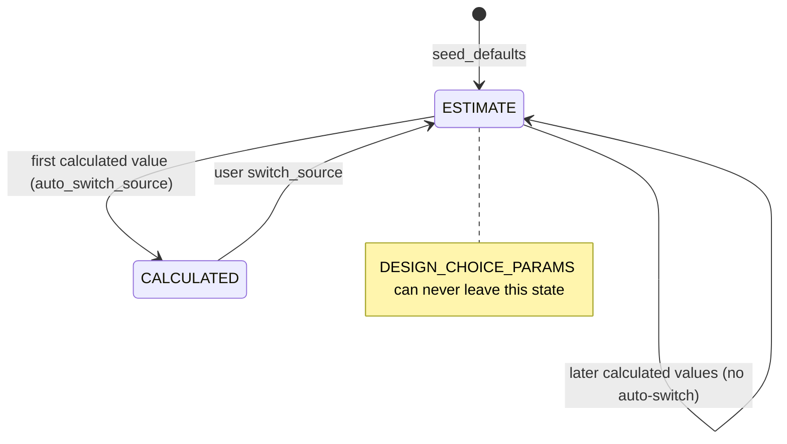

# mission-and-sizing — Technical Design

> Focuses on HOW the module is built, read from the legacy code.
> Confidence markers: 🟢 CONFIRMED · 🟡 INFERRED · 🔴 GAP.
> Companion documents: [`requirements.md`](requirements.md),
> [`contracts.md`](contracts.md), [`tasks.md`](tasks.md).

## Interface

| Symbol | Signature | Returns | Note |
|---|---|---|---|
| `seed_defaults` | `(db, aeroplane_id)` | `None` | idempotent; also seeds the computation config 🟢 |
| `update_assumption` | `(db, aeroplane_id, param, estimate)` | `AssumptionRead` | publishes only when effective (BR-27) 🟢 |
| `update_calculated_value` | `(db, aeroplane_id, param, value, source, auto_switch_source=True)` | `AssumptionRead` | auto-switch once (BR-25) 🟢 |
| `switch_source` | `(db, aeroplane_id, param, source)` | `AssumptionRead` | always publishes; schedules a recompute except for `cg_x` 🟢 |
| `get_effective_assumption_value` | `(db, aeroplane_id, param)` | `float \| None` | the read every consumer uses 🟢 |
| `upsert_mission_objective` | `(db, uuid, payload)` | `MissionObjective` | → `_apply_preset_estimates` 🟢 |
| `seed_mission_presets` | `(db)` | `None` | idempotent, nine entries 🟢 |
| `compute_mission_kpis` | `(db, uuid, missions)` | `MissionKpiSet` | 7 axes vs the target polygon 🟢 |
| `_load_effective_flight_profile` | `(db, aeroplane)` | `(dict, int \| None)` | `None` id is load-bearing 🟢 |
| `generate_default_operating_point_set` | `(db, uuid, request)` | `GeneratedOperatingPointSetRead` | sequential 🟢 |
| `generate_..._stream` | `(db, uuid, request)` | SSE | process pool (gh-867) 🟢 |
| `compute_vn_curve` | `(…)` | `VnCurve` | 60 points + gust lines 🟢 |
| `derive_performance_kpis` | `(…)` | `list[PerformanceKPI]` | exactly six, with confidence 🟢 |
| `compute_scenario_cg` | `(db, scenario)` | CG result | four override types 🟢 |
| `compute_stability_envelope` | `(x_np, mac, target_sm)` | `(fwd, aft)` | forward is a stub, overridden 🟢 |
| `enrich_context_with_cg_envelope` | `(context, …)` | `dict` | additive only 🟢 |
| `_compute_landing_field_length` | `(…)` | `(length, surface, sufficient)` | tri-state 🟢 |
| `compute_matching_chart` | `(db, uuid, mode, profile)` | `MatchingChartResponse` | 200 W/S steps 🟢 |

HTTP surface: see [`contracts.md`](contracts.md) — 26 routes across nine
endpoint modules, all at the application root (`prefix=""`).

## Main Flow — from design intent to a sized aircraft

```
1. seed_defaults(db, aeroplane)                       # 15 assumptions + config
2. PUT mission-objectives {mission_type: "sailplane", …}
       → _apply_preset_estimates writes ESTIMATE values only
3. PUT flight-profile/{id}       (optional)
       → no assignment ⇒ V_md substitution later
4. AssumptionChanged / GeometryChanged
       → schedule_recompute_assumptions (debounced 2 s)
       → recompute_assumptions  (→ aero-analysis)
            writes assumption_computation_context
            writes cg_x = x_np − target_SM · MAC        (CALCULATED, BR-28)
            writes the flight_envelopes row
5. POST operating-pointsets/generate-default[/stream]
       → 15 targets → capability gating → flap clipping → two-stage trim
       → operating_points + operating_pointsets rows
6. reads: GET flight-envelope · matching-chart · field-lengths · cg-envelope
          · mission-kpis · speed-polar
       ALL of these READ the cached context — none re-derives cd0/e/L-D/x_np
```

## Design assumptions 🟢

```
effective_value = calculated_value  if active_source == "CALCULATED" and it exists
                  else estimate_value
divergence_pct  = |estimate − calculated| / |calculated| · 100
divergence_level: < 5 none · < 15 info · ≤ 30 warning · else alert
```

State machine (`state-machines.md` §5):



Event rules:

| Action | Publishes | Marks OPs dirty | Schedules a recompute |
|---|---|---|---|
| `update_assumption` while `active_source == ESTIMATE` | `AssumptionChanged` | for `{mass, cg_x}` | for `{target_static_margin, mass}` |
| `update_assumption` while `active_source == CALCULATED` | — | — | — |
| `switch_source` | always | for `{mass, cg_x}` | for every parameter **except `cg_x`** |

`cg_x` is excluded because it is the recompute's own output — including it would
loop (BR-83).

## Operating-point generation 🟢

### The 15 targets

| Target | config | velocity | note |
|---|---|---|---|
| `stall_near_clean` | clean | `min_speed_margin_vs_clean (1.20) · V_s1` | |
| `takeoff_climb` | takeoff | `takeoff_speed_margin_vs_to (1.25) · V_s_to` | flap 15° |
| `best_angle_climb_vx` | clean | `max(1.35·V_s1, 0.85·V_cruise)` | read back as `v_x_mps` |
| `best_rate_climb_vy` | clean | `max(1.50·V_s1, 0.95·V_cruise)` | read back as `v_y_mps` |
| `cruise` | clean | `V_cruise` | |
| `loiter_endurance` | clean | `max(1.15·V_s1, 0.80·V_cruise)` | |
| `max_range` | clean | `max(1.25·V_s1, 0.95·V_cruise)` | |
| `max_level_speed` | clean | `V_max` | descending velocity factors in the fallback |
| `approach_landing` | landing | `approach_speed_margin_vs_ldg (1.30) · V_s0` | flap 30° |
| `stall_with_flaps` | landing | `max(2.0, 1.05·V_s0)` | flap 30°; needs a flap |
| `turn_20 / 40 / 60` | clean | `max(V_cruise, 1.3·V_s1)` | `n = 1/cos φ`; needs roll **or** yaw |
| `dutch_role_start` | clean | `max(V_cruise, 1.3·V_s1)` | β = 2°; needs yaw |

### Reference speeds

```
prefer context: v_s1_mps / v_s_to_mps / v_s0_mps        provenance = "polar"
else legacy v_stall_mps: the CLEAN value for ALL THREE configurations
     (the historical 0.95 / 0.90 multipliers are DELIBERATELY not applied, audit §5.5)
else: max(3.0, V_cruise / min_speed_margin_vs_clean)    provenance = "cold_start"
      → _stamp_stale_no_polar appends STALE_NO_POLAR to EVERY target
floors: vs_clean ≥ 3.0 · vs_to ≥ 2.5 · vs_ldg ≥ 2.0
```

### The two-stage trim

```
stage 1 — asb.Opti (IPOPT)
    max_iter = 120, max_runtime = 0.35 s, behavior_on_failure = "return_last"
    variables: α ∈ [−8°, max_alpha_deg]
               pitch δ ∈ [−25, 25]
               (turn)       roll δ ∈ [−20, 20]
               (turn/dutch) yaw  δ ∈ [−25, 25]
    objective: 50·Cm² + 3·CY²
               [+ 15·(CL − CL_target)²]
               [+ 2·Cl² + 2·Cn²  for turns]
               + 0.001·Σδ²

stage 2 — grid search, only when score > 0.35
    velocities × α = linspace(−4°, 20°, 13) × β candidates
    velocity factors [1.0, 1.05, 1.10, 1.15]   (descending for max_level_speed)
    → updates BOTH α and the velocity                              (gh-528)
    🟢 no deflection grid; the defect is elsewhere (Q-MS-5)

trim_score = |Cm| + 0.5·|CY| [+ 0.3·|CL − CL_target|]
CL_target  = m·g·n / (q·S_ref)
status     = TRIMMED        if score < 0.35
             NOT_TRIMMED    otherwise
             LIMIT_REACHED  when |α| > max_alpha_deg or |β| > max_beta_deg
trim_method ∈ {"opti", "grid_fallback"}      # NEVER inside trim_residuals (gh-627)
```

### Turn kinematics and feasibility

```
n = 1 / cos φ
(p, q, r) derived from turn_kinematics for a bank_deg target
_apply_turn_feasibility: V < V_s1 · sqrt(n)  →  LIMIT_REACHED + STALL_IN_TURN
```

Without the check the trimmer returns a perfectly converged solution at the
wrong load factor.

### Parallelism (gh-867)

```
CasADi/IPOPT does NOT release the GIL → a thread pool benchmarked 0.35–0.89×

streaming path:
    ProcessPoolExecutor(spawn), max_workers = max(1, min(4, cpu − 1))
    BLAS pinned to one thread per worker:
        OMP_NUM_THREADS = OPENBLAS_NUM_THREADS = MKL_NUM_THREADS
      = VECLIB_MAXIMUM_THREADS = NUMEXPR_NUM_THREADS = 1
        applied to the PARENT env at spawn AND in the initializer, then restored
    → ≈ 2.9× at 4 workers
    workers receive a picklable _WorkerSolveCtx
        (asb.Airplane pickles cleanly; the SQLAlchemy model does not,
         so only total_mass_kg crosses, via _AircraftMassOnly)
    workers NEVER touch the database
    the main thread owns persistence and streams in as_completed order

non-streaming batch path: SEQUENTIAL on purpose — contract and mocks unchanged
```

### SSE contract (gh-865)

```
event: targets   → the resolved target list
event: skip      → a capability-gated target (with the reason)
event: op        → one solved point, COMMITTED before the event is emitted
event: error     → a setup failure
event: done      → the point-set summary
```

Committing per point means a dropped connection still leaves a valid partial
set.

### Persistence

`_persist_point_set` optionally clears **all** existing OP sets and OPs for the
aircraft, inserts one `operating_points` row per solved point with
`xyz_ref = [design_cg_x, 0, 0]`, then one `operating_pointsets` row named
`default_operating_point_set` whose `operating_points` JSON column holds the id
list. 🟡 A JSON id list, not an association table.

## Flight envelope 🟢

### Manoeuvre (V-n), 60 points

```
V_stall = sqrt(2·W / (ρ·S·CL_max))
V_dive  = 1.4 · V_max
CL_min  = −0.8 · CL_max
n⁺(V) = min(q·S·CL_max / W,  g_limit)
n⁻(V) = max(q·S·CL_min / W, −0.4·g_limit)
```

### Gust (Pratt-Walker, NACA TN 2964)

```
c̄    = S_ref / b_ref          # MEAN GEOMETRIC chord — NOT the MAC
μ_g  = 2·(W/S) / (ρ · c̄ · CL_α · g)
K_g  = 0.88·μ_g / (5.3 + μ_g)          # FAR-25.341(a)(2) / CS-VLA.333
Δn   = ½·ρ·V·CL_α·U_gust·K_g / (W/S)
n±   = 1 ± Δn                          over 60 points from V_stall to V_dive

U_gust: 15.24 m/s (50 ft/s) at V ≤ V_C = V_D/1.4
        linearly tapered to 7.62 m/s (25 ft/s) at V_D
CL_α  : context["cl_alpha_per_rad"]
        → else Helmbold-Diederich  2π·AR/(AR+2)
        NEVER the thin-airfoil 2π (39 % high at AR = 6 — it inflates gust loads)
```

Two **structured** warnings reach the API, not just the log:

| Warning | Condition | Meaning |
|---|---|---|
| `GustCriticalWarning{velocity_mps, n_gust, g_limit, message}` | first `V` where `1+Δn > g_limit` or `1−Δn < −0.4·g_limit` | the structure is **gust-sized**, not manoeuvre-sized |
| `GustValidityWarning{mu_g_value, validity_min=3.0, validity_max=200.0, message}` | `μ_g ∉ [3, 200]` | the **normal** case for low-W/S RC models (gh-497) — gust loads may be optimistic |

### KPIs

```
best_ld_speed / min_sink_speed:
  1. a TRIMMED operating-point marker           confidence "trimmed"
  2. ctx["v_md_mps"] / ctx["v_min_sink_mps"]    confidence "computed"
  3. 1.4·V_s / 1.2·V_s                          confidence "estimated"  ← cold start only
stall_speed, max_speed, dive_speed (= 1.4·V_max), max_load_factor → "limit"
```

Exactly six KPIs, always. The heuristic tier is documented as wrong by up to
15 % for high-AR airframes (gh-475 audit §4.1) and exists only for the pre-polar
case — which is why the confidence label is part of the contract.

`flight_envelopes` is upserted (one row per aeroplane) with `vn_curve_json`,
`kpis_json`, `markers_json` and an `assumptions_snapshot` (`mass`, `cl_max`,
`g_limit`). 🟢 `VnMarker.load_factor` comes from the persisted `n_target` / `cl_trimmed` (`Q-MS-6`). Previously always 1.0, because the stored OP
carries no CL — turn OPs therefore plot on the 1-g line.

## Loading, CG and field length 🟢

```
SM classification (Scholz §4.2), loading_scenario_service.py:51-53
  sm < 0.02          → "error"  (Phugoid divergent)
  sm < target_sm     → "warn"
  sm ≤ 0.20          → "ok"
  sm ≤ 0.30          → "warn"   (heavy nose, trim drag)
  else               → "error"  (elevator authority)

compute_stability_envelope(x_np, mac, target_sm):
  cg_stability_aft_m = x_np − target_sm · MAC
  cg_stability_fwd_m = x_np − 0.30 · MAC          ← conservative STUB
        overridden by elevator_authority_service.compute_forward_cg_limit (gh-500);
        on failure the stub is kept and forward_cg_result is stored either way.
        A ValueError mentioning x_np=None / mac=None is demoted to INFO —
        the documented cold-start chicken-and-egg (gh-685).

enrich_context_with_cg_envelope adds, ADDITIVELY (never disturbing cg_agg_m):
  cg_forward_m, cg_aft_m,
  sm_at_fwd = (x_np − cg_fwd)/MAC, sm_at_aft,
  cg_stability_fwd_m, cg_stability_aft_m
  — when x_np/MAC are absent the SM values are None, not deceptive stubs.
```

`compute_scenario_cg` supports four override types over a per-component list —
toggles (`enabled=False` removes the component), mass overrides, position
overrides and additive adhoc items — falling back to a
`base_mass_kg / base_cg_x` aggregation for pre-migration aeroplanes.

### Landing field length (gh-477)

```
V_S0      = sqrt(2·m·g / (ρ·S·CL_max_landing))
V_TD      = 1.15 · V_S0                        # RC rule of thumb
s_ground  = V_TD² / (2·g·μ_eff)                # energy balance; mass cancels
L_landing = safety · (15 m flare + s_ground)
net_recovery → s_ground = 0 (catch/arrester); L collapses to the padded flare

LANDING_SURFACE_MU = grass_short 0.15 · grass_long 0.22 · hard_paved 0.07
                     soft_soil 0.30 · belly_grass 0.40 · net_recovery 0.0
defaults: surface grass_short, safety 1.5 (rejected below 1.0)
```

Compared against `available_field_length_m` into a **tri-state**
`landing_field_sufficient` (`True`/`False`/`None`) so the UI renders
green/red/neutral. Provenance recorded in code: the μ values come from
operational RC/UAV practice (Raymer ch. 17 / Roskam P.7 territory), **not** from
Anderson.

## Matching chart 🟢

Loftin / Scholz §5.2–5.4 over `W/S ∈ [10, 1500] N/m²` in 200 steps, with
`T/W = T_static_SL / W_MTOW`. The constants `_K_TO_50FT = 1.66`,
`_K_LDG_50FT = 2.73`, `_K_LDG_HARD = 0.5847`, `_C_TO = 1.21` are **imported**
from `field_length_service` rather than re-declared, explicitly to prevent
drift.

```
takeoff (line)      T/W = C_TO·K_TO_50FT·(W/S) / (ρ·g·CL_max_TO·s_TO_50ft)
                    s_runway = 0 → 0   (hand launch: no constraint)
landing (vertical)  W/S_max = s_LDG_50ft·ρ·CL_max_LDG / (K_LDG_HARD·K_LDG_50FT)
cruise  (line)      T/W = q·CD0/(W/S) + (W/S)·k/q          k = 1/(π·e·AR)
climb   (line)      T/W = sin γ + [q·CD0/(W/S) + (W/S)·k/q]   (clean polar)
stall   (vertical)  W/S_max = ½·ρ·V_s_target²·CL_max_clean    (CLEAN, not landing)
V_md                = sqrt(2·(W/S) / (ρ·sqrt(CD0/k)))
```

### RC-additive constraints (gh-613 Phase B)

```
mission_min_tw   acro_3d 1.5 (hover) · wing_racer 0.8 · sport 0.5
power_loading    T/W ≥ (P/m)·η_prop / (g·V_climb),  V_climb = 1.3·V_stall
                 P/m: trainer 125 · sport 200 · wing_racer 275 · acro_3d 400 W/kg
vertical_climb   T/W ≥ 1 + D/W                       (acro / 3D)
wcl (vertical)   Lennon wing-cube-loading upper bound, lb/ft^4.5 → SI ×47.88
                 W/S_max = (WCL·47.88)^(2/3) · AR^0.25
                 WCL upper: trainer 6.0 · sport 12.0
hand_launch      W/S ≤ 80 N/m²    (only when mode == rc_hand_launch)
```

### Applicability (`_PROFILE_CONSTRAINT_MAP`)

| Profile | Applicable constraints |
|---|---|
| `trainer` | stall, climb, power_loading, wcl |
| `sport` | stall, climb, mission_min_tw, power_loading, wcl |
| `wing_racer` | stall, cruise, power_loading |
| `acro_3d` | stall, mission_min_tw, power_loading, vertical_climb |
| `stol_bush` | stall, takeoff, landing, climb |
| `slope_soarer` / `glider` / `sailplane` | stall |
| `motor_glider` / `flying_wing` | stall, climb, cruise |
| `custom` / unknown | **all** (back-compat) |

Mode defaults (`s_runway`, `γ_climb`, `V_s_target`): `rc_runway` 50 m / 5° /
7 m/s · `rc_hand_launch` 0 / 5° / 7 · `uav_runway` and `uav_belly_land`
200 m / 4° / 12 · `ga_runway` 500 m / 1.5° / 27.7 (FAR-23.65 / 54 kt). An
unknown mode logs a warning and falls back to `uav_runway`.

Feasibility: a **line** constraint binds within **3 %** in T/W; a **vertical**
constraint within **5 %** in W/S. `DEFAULT_E_OSWALD = 0.8` exists, but the module
documents that consumers should surface a **design warning** rather than
silently using it (gh-956 / ADR 0012). Log-forging safety (Sonar S5145): the
user-controlled `flight_profile` string is never logged directly —
`_sanitize_profile_for_log` maps it through the constant `_LOG_PROFILE_LABELS`
table.

## Alternative Flows

- **No flight profile assigned.** `_default_profile()` with
  `source_profile_id = None` ⇒ `user_set_cruise = False` ⇒ the cruise speed
  becomes `V_md` and `v_cruise_auto = True`. 🟢
- **No `max_level_speed_mps`.** `v_max = max(1.35·V_cruise, V_cruise + 8)`. 🟢
- **No computation context (cold start).** Reference speeds fall back to
  `max(3.0, V_cruise / min_speed_margin_vs_clean)` with
  `provenance = "cold_start"`, and every target is stamped `STALE_NO_POLAR`. 🟢
- **No flap-role TED.** No flap limit is manufactured; the target passes through
  and the trim solver no-ops the missing surface. 🟢
- **Missing roll/yaw/flap capability.** The dependent targets are **skipped**
  with a `skip` SSE event, not failed. 🟢
- **`Opti` fails to converge.** `behavior_on_failure = "return_last"`, then the
  grid fallback; `trim_method = "grid_fallback"`. 🟢
- **A turn below the stall speed for its load factor.** `LIMIT_REACHED` +
  `STALL_IN_TURN`. 🟢
- **An unknown `mission_type`.** `_apply_preset_estimates` is a **silent
  no-op**. 🟢 An unknown `mission_type` fails visibly and the column gains a real reference constraint (`Q-MS-10` / `P-WARN-0`, `Q-CC-7`).
- **An unknown matching-chart mode.** A warning is logged and `uav_runway` is
  used. 🟢
- **Elevator-authority computation fails.** The conservative `0.30·MAC` forward
  stub is kept, and `forward_cg_result` records the failure. 🟢
- **A profile assigned to an aircraft is deleted.** **409**. 🟢

## Dependencies

- **`aero-analysis`** — `recompute_assumptions` writes the context this module
  reads everywhere (BR-14); `analyse_aerodynamics` is used only inside the OP
  generator's trim solve; the OP status machine is shared.
- **`mass-and-balance`** — `get_effective_assumption_value("mass")`,
  `compute_cg_agg_for_aeroplane`, `aggregate_weight_items`.
- **`wing-design`** — TED roles and hinge limits for flap clipping, the ASB
  airplane for capability detection.
- **`powertrain`** — `t_static_N`, `power_to_weight`, `prop_efficiency` feed the
  matching chart.
- **AeroSandbox** — `asb.Opti` (IPOPT/CasADi) for the trim solve,
  `asb.Airplane` pickled into worker processes.
- **`platform-core`** — `get_db()` (BR-78), the event bus, the debounced job
  tracker, SSE plumbing.

## Identified Design Decisions

| Decision | Evidence in code | Confidence |
|---|---|---|
| Every parameter carries both an estimate and a calculation (ADR 0010) | `design_assumptions` columns | 🟢 |
| Auto-switch fires exactly once, then the user owns it | `update_calculated_value` | 🟢 |
| Seven parameters are pure design choices | `DESIGN_CHOICE_PARAMS` | 🟢 |
| Events fire only on an effective change | `update_assumption` (BR-27) | 🟢 |
| `cg_x` is excluded from recompute triggers to break the loop | `_RECOMPUTE_TRIGGERING_PARAMS` (BR-83) | 🟢 |
| CG is top-down (ADR 0011); `CG_agg` is comparison-only | `enrich_context_with_cg_envelope` | 🟢 |
| Presets rewrite estimates only | `_apply_preset_estimates` | 🟢 |
| "No profile" means best-glide cruise | `_load_effective_flight_profile` | 🟢 |
| Stall speeds come from the polar, not from fixed multipliers (audit §5.5) | `_estimate_reference_speeds` | 🟢 |
| Capability gating skips rather than fails | `_detect_control_capabilities` (BR-21) | 🟢 |
| Flap targets clip to the most restrictive surface (gh-527/gh-536) | `_clip_flap_to_ted_limit` | 🟢 |
| Two-stage trim, with the grid fallback moving velocity too (gh-528) | `_grid_search_trim` | 🟢 |
| The solver path lives on `trim_method`, never in the residuals (gh-627) | `TrimEnrichment` typing | 🟢 |
| Processes, not threads, because CasADi holds the GIL (gh-867) | `ProcessPoolExecutor(spawn)` | 🟢 |
| Workers never touch the DB; only `total_mass_kg` crosses | `_WorkerSolveCtx`, `_AircraftMassOnly` | 🟢 |
| The batch path stays sequential to preserve its contract | same | 🟢 |
| Each SSE point is committed before it is emitted (gh-865) | streaming generator | 🟢 |
| Gust uses the mean geometric chord, not the MAC | `flight_envelope_service` | 🟢 |
| `CL_α` from Helmbold-Diederich, never thin-airfoil `2π` | same | 🟢 |
| Gust warnings are structured API objects, not log lines | `GustCriticalWarning` / `GustValidityWarning` | 🟢 |
| KPIs carry an explicit confidence tier | `derive_performance_kpis` | 🟢 |
| The forward CG stub is overridden by elevator authority (gh-500) | `recompute_assumptions` | 🟢 |
| Loftin/Roskam constants declared once and imported | `field_length_service` → `matching_chart_service` | 🟢 |
| Per-profile constraint applicability (gh-613) | `_PROFILE_CONSTRAINT_MAP` | 🟢 |
| The user-controlled profile string is never logged raw (Sonar S5145) | `_sanitize_profile_for_log` | 🟢 |

## Internal State

| Table | Cardinality | Note |
|---|---|---|
| `design_assumptions` | one row per `(aeroplane, parameter)` | `uq_assumption_aeroplane_param` |
| `aircraft_computation_config` | one per aeroplane | `uq_computation_config_aeroplane` |
| `mission_objectives` | **one per aeroplane** (unique FK) | |
| `mission_presets` | global library, **String PK** | 🟢 FK from `mission_type` (`Q-CC-7`) |
| `rc_flight_profiles` | global library, unique `name` | referenced by `aeroplanes.flight_profile_id` and `operating_pointsets.source_flight_profile_id` |
| `loading_scenarios` | many per aeroplane | `is_default` supplies `cg_agg_m` |
| `flight_envelopes` | **one per aeroplane** (unique FK), upserted | carries `assumptions_snapshot` |
| `operating_points` / `operating_pointsets` | written here, owned by `aero-analysis` | |
| `aeroplanes.assumption_computation_context` | read everywhere, written by `aero-analysis` | |

## Observability

- Every generated OP carries `warnings[]` (`STALE_NO_POLAR`,
  `FLAP_DEFLECTION_CLIPPED`, `ALPHA_LIMIT_REACHED`, `BETA_LIMIT_REACHED`,
  `STALL_IN_TURN`, `NOT_TRIMMED`, `NO_CONTROL_TRIM_MVP`) and a
  `provenance` for its reference speeds. 🟢
- `trim_method` and `trim_score` make the solver path auditable. 🟢
- Gust warnings are **structured API objects**, so the UI can render them —
  deliberately not log-only. 🟢
- KPI `confidence` distinguishes a measured value from a 15 %-wrong heuristic. 🟢
- `flight_envelopes.assumptions_snapshot` records the inputs at compute time. 🟢
- SSE emits `skip` with a reason for every capability-gated target. 🟢
- 🟢 **An unknown `mission_type` fails visibly** (`Q-MS-10`/`P-WARN-0`) and `mission_type` gains a real reference constraint to `mission_presets.id` (`Q-CC-7`/`Q-CC-9`). Previously a silent no-op:
- 🟡 `divergence_level` is computed but nothing records **when** the divergence
  first appeared.

## Constants 🟢

| Constant | Value | Where |
|---|---|---|
| `LANDING_SURFACE_MU` | grass_short `0.15` · grass_long `0.22` · hard_paved `0.07` · soft_soil `0.30` · belly_grass `0.40` · net_recovery `0.0` | `assumption_compute_service.py:1782` |
| `_LANDING_FLARE_M` / `_LANDING_SAFETY_DEFAULT` / `_V_TD_OVER_V_S0` | `15.0 m` / `1.5` / `1.15` | `:1791-1794` |
| `GUST_U_VC_MPS` / `GUST_U_VD_MPS` | `15.24` / `7.62` m/s (50 / 25 ft/s) | `flight_envelope_service.py:43-44` |
| `_MU_G_MIN` / `_MU_G_MAX` | `3.0` / `200.0` | `:47-48` |
| V-n resolution | 60 points; `CL_min = −0.8·CL_max`; `n⁻ ≥ −0.4·g_limit` | `:316-331` |
| SM thresholds | `0.02` error · `0.20` warn · `0.30` error | `loading_scenario_service.py:51-53` |
| Loftin/Roskam | `_K_TO_50FT 1.66` · `_K_LDG_50FT 2.73` · `_K_LDG_HARD 0.5847` · `_C_TO 1.21` | `field_length_service.py` (imported, never re-declared) |
| W/S sweep | `10 … 1500 N/m²`, 200 steps | `matching_chart_service.py:71-73` |
| `DEFAULT_E_OSWALD` | `0.8` (should raise a design warning, gh-956) | `:77` |
| Mission-min T/W | acro_3d `1.5` · wing_racer `0.8` · sport `0.5` | `:448-452` |
| Power loading [W/kg] | trainer `125` · sport `200` · wing_racer `275` · acro_3d `400` | `:466-471` |
| WCL upper [lb/ft^4.5] | trainer `6.0` · sport `12.0`; `_LENNON_LB_FT_TO_SI = 47.88` | `:456-479` |
| `_HAND_LAUNCH_WS_MAX` | `80.0 N/m²` | `:589` |
| Feasibility tolerances | line `3 %` T/W · vertical `5 %` W/S | `:656-657` |
| OP trim | `trim_score < 0.35` ⇒ TRIMMED; α ∈ [−8°, max_alpha]; δ_pitch/yaw ∈ [−25, 25]; δ_roll ∈ [−20, 20]; Opti `max_iter 120`, `max_runtime 0.35 s` | `operating_point_generator_service.py:853` |
| OPG pool | `max_workers = max(1, min(4, cpu − 1))`, spawn, BLAS pinned to 1 | `:1188-1252` |
| Computation config | α −5…25 °, step 1 °; fine margin 5 °, step 0.5 °; 8 velocities; debounce 2 s | `app/models/computation_config.py:8-16` |
| Profile defaults | altitude 0 m, wind 0, cruise 18 m/s, V_max 28 m/s, margins 1.20/1.25/1.30, `target_turn_n` 2.0, loiter 600 s, `max_alpha` 25°, `max_beta` 30° | `_default_profile()` |

## Risks and Gaps

- 🟢 **Persist both `n_target` and `cl_trimmed`; the marker is placed at the real load factor** (`Q-MS-6`, expert consensus endorsed by the maintainer). In a steady coordinated turn `n = 1/cos φ` exactly, so plotting `turn_60` at n = 1.0 is a **factor-of-two error in the plotted quantity**, not an approximation — and the generator already computes `n_target` before discarding it. Previously hard-coded because the stored OP
  carries no CL — turn operating points plot on the 1-g line, which is exactly
  where they are *not*.
- 🟢 **No deflection grid — the defect is elsewhere** (`Q-MS-5`, expert consensus endorsed by the maintainer). Previously `_grid_search_trim` never varied the control surfaces:
  (`best_controls = {}`), so the fallback can only trim by α/β/V. A target that
  needs a different deflection cannot be reached by the fallback at all.
- 🟢 **An unknown `mission_type` fails visibly** (`Q-MS-10`/`P-WARN-0`) and `mission_type` gains a real reference constraint to `mission_presets.id` (`Q-CC-7`/`Q-CC-9`). Previously a silent no-op: Previously `_apply_preset_estimates` silently no-opped on an unknown
  `mission_type`** — a typo produces no error, no warning and no change.
- 🟢 **A real reference constraint is added** (`Q-CC-7`/`Q-CC-9`). Previously a free-text String PK with no FK from
  `mission_objectives.mission_type`, so the two can drift apart.
- 🟡 **`_wcl_constraint` carries an in-code admission** that the Lennon
  lb/ft^4.5 → SI conversion is "pragmatic" and awaits calibration (`g` is
  accepted but unused).
- 🟡 **`min_static_margin` / `max_static_margin`** are read by
  `stability_service` but are not in this module's parameter catalogue and are
  never seeded.
- 🟡 **`_load_cg_agg` in `assumption_compute_service` is dead** (`P-DEAD-0` disposes of it) — the pipeline
  calls `loading_scenario_service.compute_cg_agg_for_aeroplane`.
- 🟡 **`DEFAULT_E_OSWALD = 0.8` still exists** in the matching chart; gh-956 says
  it should surface a design warning rather than be used silently.
- 🟡 **`operating_pointsets.operating_points` is a JSON id list** with no
  referential integrity.
- 🟡 **The heuristic KPI tier is up to 15 % wrong** for high-AR airframes and is
  distinguished only by the `confidence` label — a consumer that ignores the
  label gets a plausible wrong number.
- 🟡 **The gust envelope is routinely outside Pratt-Walker validity** for RC
  models (`μ_g < 3`); the warning is emitted, but the numbers are still
  published.
