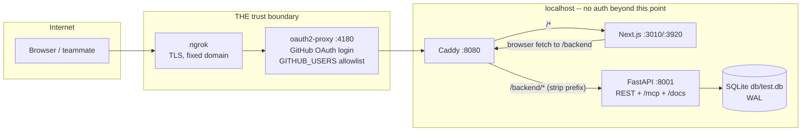

# Access Control and Trust Boundaries — da3Dalus / cad-modelling-service

> Produced by the **Reversa Detective** (`doc_level = completo`).
> 🟢 CONFIRMED · 🟡 INFERRED · 🔴 GAP.

---

## 0. The headline finding

**This application has no authentication and no authorisation.** 🟢

There is no login, no session, no token, no API key, no user table, no role, no
tenant and no per-object ownership check. The word "user" does not appear as a
persisted concept anywhere in the schema — 35 tables, none of them about people.

The single artefact that *looks* like auth is dead:

```python
# app/core/security.py — the entire file
def verify_token(token: str):
    # Example security function to verify a token
    return token == "valid_token"
```

It has **no callers** anywhere in the repository. 🟢

Every REST route, the Swagger UI at `/docs`, ReDoc at `/redoc`, the OpenAPI
document, the `/static` and `/assets` mounts, and the full 76-tool **MCP server
at `/mcp`** are reachable by anyone who can reach the port. CORS is
`allow_origins=["*"]` with `allow_credentials=True`. 🟢

This is not an oversight that snuck in — the Git history shows it was a
deliberate infrastructure decision, twice:

| Commit | Date | Message |
|---|---|---|
| `d4e111ae` | 2024-12-09 | `bug(documentation): resolved cors origin for frontend` |
| `efa4f553` | 2025-01-29 | `Merged PR 749: Removed CORS origin policy` — *"Each available service can communicate now with cad-service. The CORS origin policy was removed between the current infrastructure"* |
| `90886197` | 2025-01-31 | `Merged PR 754: Removed CORS Origin Policy` |

and the code carries the admission inline: *"copied from other python backends
to resolve the cors origin problem"* (`app/main.py`). 🟢

So the honest description is: **da3Dalus is a single-maintainer design tool
whose security model is network placement, not application logic.** The
remainder of this document says where that boundary actually is, what the
"roles" really are, and what *is* enforced.

See [ADR 0016](adrs/0016-no-application-auth-the-tunnel-is-the-boundary.md).

---

## 1. Where the real trust boundary lives

The backend is designed to run on `localhost` (dev port 8001, container port
8000 mapped to host 8086). When it is exposed to anyone else, the boundary is a
**reverse-proxy chain terminating in a GitHub login**, not the application.

That chain lives in `deploy/`, which is **gitignored** (`.gitignore:296-297`:
*"local ngrok/Caddy/oauth2-proxy deployment (infra + secrets — never commit)"*)
— so it is not part of the delivered artefact and cannot be audited from a fresh
clone. It exists in the working tree and is documented in `deploy/README.md`. 🟢



Facts about that boundary, read from `deploy/README.md` and `deploy/Caddyfile`
🟢:

* **Authentication** = a GitHub OAuth App; **authorisation** = a comma-separated
  `GITHUB_USERS` allowlist in `deploy/.env`. That is the *entire* access-control
  policy of the system.
* Once past the login there is **no per-user isolation**. The README says it
  outright: *"Behind the login this is your **real dev backend + real DB, with
  no per-user isolation** — anyone you let in can read and change everything.
  Only share with people you'd give your laptop to."*
* The per-PR staging mode (`stages.sh`) serves every stage under sub-paths
  behind the *same* login — one OAuth callback at the domain root protects all
  stages. Each stage gets its own worktree, uvicorn and **isolated DB copy**;
  the `main` stage does not.
* The proxy is what makes the frontend same-origin: it is built with
  `NEXT_PUBLIC_API_URL=/backend`, so the browser never sees a cross-origin
  request and the wildcard CORS on the backend is not exercised in that
  deployment. In plain local development it *is* exercised — the frontend on
  `:3000` fetches `http://localhost:8001` directly.

> 🔴 **Nothing enforces that the boundary is present.** The application starts,
> serves and mutates identically whether it sits behind oauth2-proxy or on a
> public interface. There is no `TRUSTED_PROXY`, no forwarded-identity header
> read, no bind-address restriction (`UVICORN_HOST` defaults are used as-is,
> and `run_mcp_server()` hard-codes `0.0.0.0:8001`).

---

## 2. The actors that actually exist

Since there are no roles in the classic sense, the meaningful decomposition is
**by call path**, because each path has different reach, different provenance
and different failure modes.

| # | Actor | How it reaches the system | Identity carried | Distinguishable afterwards? |
|---|---|---|---|---|
| A1 | **Human designer** (browser) | direct `fetch` from the Next.js workbench to the v2 REST API | none | only indirectly, via `created_by="human"` on nodes/branches they cause |
| A2 | **AI copilot** (in-app) | server-side: `/copilot/stream` → tool registry → the *same* services the UI uses | none at the HTTP layer | yes — `branches.created_by = "copilot"` and a `copilot-proposal` branch name |
| A3 | **External MCP agent** | `/mcp` → FastMCP → `_call_endpoint` → v2 endpoint functions in-process | none | **no** — leaves no trace |
| A4 | **Operator / CLI** | `scripts/*.py` and `alembic` against the DB directly | n/a (shell access) | no |
| A5 | **CI** | GitHub Actions running pytest/vitest against throwaway DBs | n/a | n/a |
| A6 | **The LLM hub** | outbound only: `AsyncOpenAI` → `COPILOT_BASE_URL` | `COPILOT_API_KEY` (a `SecretStr`) | outbound credential, not an inbound identity |

Two of these deserve emphasis:

**A2 — the copilot is not a privileged actor; it is a *restricted* one.** 🟢
It is the only actor in the system that is deliberately **less** capable than
the human sitting next to it, and the restriction is structural rather than
policy-based:

* Its tool registry has **6 tools**, not the 230-route REST surface and not the
  76-tool MCP surface. The module header states the rule: *"only the tools that
  are safe, fast, and meaningful for an advisory interaction"*.
* Its **only** write surface is a disposable `copilot-proposal` branch. It
  cannot touch the live design.
* There is **deliberately no adopt tool**. Promoting a proposal to `main` is a
  human-only action in the Versions panel.
* Its errors are sanitised before reaching the browser: the configured API key
  is literally redacted, and auth/connectivity failures are replaced with a
  *category* message.

**A3 — the MCP agent has the widest reach and the least accountability.** 🔴
It can call `delete_aeroplane` and `delete_all_wing_cross_sections`. It carries
no identity, is not rate-limited, and leaves no `created_by` trace. Its one
accidental mitigation is a bug: `_call_endpoint` opens a bare `SessionLocal()`
and **never commits**, so `Session.__exit__` rolls the transaction back and most
mutations silently do nothing (see §5).

---

## 3. Capability matrix

Rows are capabilities; columns are actors. **"yes" means the system permits it,
not that it is a good idea** — with no authn/authz, permission is determined
entirely by which port the caller can reach.

| Capability | A1 Human (browser) | A2 AI copilot | A3 MCP agent | A4 Operator/CLI |
|---|---|---|---|---|
| List / read aeroplanes | yes | yes (retargeted to the proposal head) | yes | yes |
| Create aeroplane | yes | **no** (no tool) | tool exists — **write lost** 🔴 | yes |
| Delete aeroplane | yes | **no** | yes (`delete_aeroplane` tool) — write lost 🔴 | yes |
| Edit wing geometry (live) | yes | **no** — branch only | yes (20 wing tools) — write lost 🔴 | yes |
| Edit wing geometry (proposal branch) | yes | **yes** (7-op edit DSL) | no | yes |
| Edit design assumptions | yes | yes (`SetAssumption`, branch only) | yes — write lost 🔴 | yes |
| Snapshot / branch / rename | yes | branch only, via `apply_design_edits` | **not exposed** | yes |
| **Adopt a branch to `main`** | **yes** | **no — structurally forbidden** | **not exposed** | yes |
| Discard a branch | yes | own proposal only | not exposed | yes |
| Run analysis (AeroBuildup / VLM / AVL) | yes | yes (`run_analysis`, 60 s cap) | yes | yes |
| Generate operating points | yes | **no** | yes | yes |
| Execute a construction plan (runs OCCT in-process) | yes | **no** | **no** | yes |
| Upload files (STEP/STL parts, `.dat` airfoils, `.vsp3`) | yes | **no** | airfoil upload only | yes |
| Download artefacts / exports | yes | **no** | yes (asset registry) | yes |
| Import COTS snapshots | **no** (no endpoint) | no | no | **yes** (CLI only) |
| Run Alembic migrations | no | no | no | **yes** |
| Read/modify the DB directly | no | no | no | **yes** |

### What the copilot cannot do, itemised 🟢

No adopt. No delete of an aeroplane or a wing. No file upload or download. No
construction-plan execution. No operating-point generation. No component/COTS
CRUD. No access to another aeroplane — every tool is invoked as
`fn(db, aeroplane_id, **kwargs)` with the id fixed by the endpoint, not chosen
by the model.

---

## 4. What *is* enforced

The absence of authn/authz does not mean nothing is checked. The codebase has a
consistent, deliberate set of **integrity and safety** controls. They protect
against accident and malformed input, not against a hostile authenticated user
(there being no such concept).

### 4.1 Scoping and ownership-by-containment 🟢

| Control | Where |
|---|---|
| Every nested resource is resolved **through** its aeroplane, so a part/xsec/spar id from another aircraft cannot be reached by guessing | `_get_part_or_404`, `get_wing_or_raise`, `get_aeroplane_or_raise` |
| An operating point loaded by id is constrained to `aircraft_pk` — explicitly to prevent cross-aeroplane OP injection into a Trefftz/streamline run | `operating_point_resolver.resolve_operating_point` (gh-577) |
| Copilot tools receive a fixed `aeroplane_id` from the endpoint; the model never supplies one | `copilot_tools.execute` |

### 4.2 Immutability and destructive-action guards 🟢

| Control | Effect |
|---|---|
| `_guard_immutable` on `snapshot` | mutating a frozen node → 422 |
| `restore` requires `is_immutable = True` | restoring from a live head is a different operation |
| `adopt_branch` 409 when already main; `discard_branch` 409 on `is_main` or the lineage's only branch | the lineage can never be left without a main |
| Partial unique index `uq_branches_one_main_per_root` | two mains are impossible at DB level |
| Auto-snapshot before a destructive spar commit, **aborting the commit if the snapshot fails** (gh-1058) | "never mutate without a recovery point" |
| `construction_parts.locked` → 409 on delete | |
| `component_types.deletable = False` → 409; any type still referenced → 409 with the count | the seeded taxonomy cannot be dismantled |
| `rc_flight_profiles` deletion refused (409) while any aircraft references it | |

### 4.3 Input and path safety 🟢

| Control | Where |
|---|---|
| Path-traversal guard: `resolve()` then `relative_to(base)`, raising on escape | `artifact_service._ensure_within_base` |
| Symlink rejection on artefact reads | `artifact_service.get_file_path` |
| Upload filename reduced to basename + `is_relative_to` check before write (Sonar S2083) | `fuselage_slice_service` |
| Airfoil import directory must resolve **inside** `<project_root>/components` | `airfoil_service.import_directory` |
| Upload allow-lists and size cap: `{.step,.stp,.stl}`, 50 MB → 413 | `construction_part_service` |
| STEP export filenames sanitised `[^A-Za-z0-9._-]+` and truncated to 64 chars | `openvsp_step_export_service` |
| Scale bounds `SCALE_FACTOR ∈ (0.001, 10.0)`, `TARGET_SPAN ∈ (0.1, 50) m`, mutually exclusive | `openvsp_import_service` |
| Every `specs` write validated against the component type's declared schema | `component_type_service.validate_specs` |

### 4.4 Log and error hygiene 🟢

| Control | Where |
|---|---|
| Log-injection guard: wing names sanitised before logging | `tessellation_hooks` |
| Log-forging guard (Sonar S5145): the user-controlled `flight_profile` string is mapped through a constant label table, never logged raw | `matching_chart_service._sanitize_profile_for_log` |
| API-key redaction + error **categorisation** before anything reaches the browser | `copilot_service._sanitize_error` |
| SSE endpoint catch-all emits the flat string `"Internal server error"` | `copilot_stream.py` |
| Tessellation worker failures report the exception **type only** — no detail leakage | `tessellation_service` |
| `COPILOT_API_KEY` is a `SecretStr` requiring `.get_secret_value()` | `app/core/config.py` |
| Uniform error envelope `{"error": {code, message, details}}` with `details` encoded through `jsonable_encoder(custom_encoder={BaseException: str})` | `app/main.py` |

### 4.5 Resource bounds 🟢

| Control | Value |
|---|---|
| Copilot turn loop | `MAX_LOOP_ITERATIONS = 6`, then `truncated: true` |
| Copilot analysis tool | `asyncio.wait_for(..., 60.0)` → `{"status": "timeout"}`, not an error |
| CAD process pool | `max_workers = 4`, `spawn` context |
| OP generation pool | `max_workers = max(1, min(4, cpu − 1))`, BLAS pinned to 1 thread |
| AVL subprocess | 30 s default, callers pass 60 s; timeout kills the process |
| Streaming plan execution | 300 s queue starvation timeout |
| Job debounce | 2.0 s |
| SQLite | `busy_timeout = 30000`, connection `timeout = 30` |

---

## 5. What is *not* enforced — the honest gap list

| # | Gap | Severity in the intended (localhost + tunnel) deployment | Severity if ever exposed |
|---|---|---|---|
| P-1 | **No authentication of any kind.** `verify_token` is dead code comparing against the literal `"valid_token"`. | acceptable by design | critical |
| P-2 | **No authorisation, no roles, no ownership.** Any caller may read, mutate or delete any aeroplane. | acceptable (single maintainer) | critical |
| P-3 | **CORS `allow_origins=["*"]` with `allow_credentials=True`.** Browsers reject that combination for credentialed requests anyway, so the setting is simultaneously too permissive and internally inconsistent. | low | high |
| P-4 | **`/mcp` is unauthenticated** and exposes 76 tools including `delete_aeroplane` and `delete_all_wing_cross_sections`. | medium (loopback) | critical |
| P-5 | **`/docs`, `/redoc`, `/openapi.json` are public** and fully describe the mutation surface. | low | medium |
| P-6 | **`/static` is mounted on `tmp/`** — every generated PNG, ZIP, export and MCP asset is world-readable by URL, with unguessable-but-not-secret names. | low | medium |
| P-7 | **No rate limiting, quota or cost accounting** anywhere — including the LLM hub call, which is the only path that costs real money per request. | medium | high |
| P-8 | **No audit log.** There is no record of who changed what. The nearest thing is `created_by` on version nodes/branches, which has no enum and four writers using three different values (`human` / `ai` / `copilot`) 🔴. | medium | high |
| P-9 | **`provenance_message_id` is write-only** — the FK linking a version back to the conversation turn that produced it exists in the migration, is accepted by `SnapshotRequest`, is written by `snapshot()`, and is **read by nothing**. The AI accountability trail is designed but inert. | medium | medium |
| P-10 | **A live SQLite database is committed** (`db/test.db` plus dated backups and WAL files) and copied into the Docker image. Anything ever entered into it ships with the repository and the container. | **high** | high |
| P-11 | **The MCP asset registry is unbounded and never evicted**; files under `tmp/mcp_assets/` are never cleaned up; `register_file_asset` copies without a size cap; `_normalize_result` base64-encodes image bodies fully in memory. | medium | high |
| P-12 | **Two error contracts.** Global handlers emit `{"error": {…}}`; per-module `_raise_http` helpers emit FastAPI's `{"detail": …}`. Some error text is **German** in an otherwise English API (`"name existiert bereits"`, `"Ungültige Eingabedaten"`), and the `IntegrityError` handler assumes *every* integrity violation is a duplicate name — hiding FK, NOT NULL and CHECK violations. | low | medium |
| P-13 | **No TLS, no security headers, no CSRF consideration** in the application. All of that is delegated to the (gitignored, unversioned) proxy chain. | acceptable by design | high |
| P-14 | **The deployment boundary is not reproducible from the repository.** `deploy/` is gitignored; a fresh clone cannot recreate the only access control the system has. | **high** | high |
| P-15 | **MCP writes are silently discarded.** `_call_endpoint` never commits and `Session.__exit__` rolls back, so ~40 mutation tools return a success payload while persisting nothing. Accidentally a mitigation for P-4; unambiguously a correctness bug. | medium | medium |
| P-16 | **No readiness or capability reporting.** `/health` always returns HTTP 200 by design (so a load balancer can distinguish "down" from "degraded"), but reports no Alembic head, no `cad_available`/`aerosandbox_available` flags, and a version string (`0.1.0`) that matches neither `core.config.VERSION` (`1.0.0`) nor the FastAPI app (`2.0.0`). | low | medium |

---

## 6. If authentication is ever added

Not a recommendation to add it — a note on what the current design already
implies, so the decision is made with the constraints visible. 🟡

1. **The identity model is already half-written.** `created_by` on
   `aeroplanes` and `branches`, and `provenance_message_id`, are the seams. They
   need an enum (`human | ai | copilot | system`) and a reader before they can
   carry weight.
2. **The natural authorisation grain is the lineage, not the row.** Ownership
   would attach to `root_id`; every existing scoping check already resolves
   through the aeroplane, so a lineage-level filter would compose with them.
3. **The MCP surface must be gated separately.** It bypasses FastAPI routing,
   `Depends`, middleware and the exception handlers entirely — a
   `Depends`-based auth dependency on the REST routes would **not** protect
   `/mcp`.
4. **The frontend has no auth plumbing at all** — no `Authorization` header, no
   `credentials:` option, no token store. Adding auth means touching both HTTP
   clients (`lib/fetcher.ts` and `lib/api.ts`) and the hand-rolled SSE reader in
   `lib/sseStream.ts`.
5. **Fixing CORS is a prerequisite, and belongs to the frontend.**
   `frontend/CLAUDE.md` already claims *"All API calls go through server-side
   route handlers or server actions to avoid CORS"* — there are none 🔴. The
   wildcard CORS is the **consequence** of that missing proxy layer, not an
   independent choice. Implementing the documented proxy would let
   `allow_origins` be closed without touching any hook.

---

*See `domain.md` for the invariants these controls protect,
`state-machines.md` for the lifecycles each actor may drive, and
[ADR 0016](adrs/0016-no-application-auth-the-tunnel-is-the-boundary.md) for the
decision record.*
