# State Machines — da3Dalus / cad-modelling-service

> Produced by the **Reversa Detective** (`doc_level = completo`).
> 🟢 CONFIRMED (states and transitions read from code/migrations) ·
> 🟡 INFERRED (state is implied by a flag combination, not by an explicit column)
> · 🔴 GAP.
>
> Only entities with a genuine lifecycle are listed. Where a "state machine"
> exists only as a combination of boolean flags, that is said explicitly —
> conflating the two would misrepresent the system.

**Index**

| # | Entity | State carrier | Explicit? |
|---|---|---|---|
| 1 | Operating point | `operating_points.status` | 🟢 explicit enum-as-string |
| 2 | Aeroplane version node | `is_immutable` + `branches.head_id` | 🟡 derived |
| 3 | Branch | `is_main` + existence | 🟡 derived |
| 4 | Copilot proposal | branch name + `created_by` | 🟡 derived |
| 5 | Design assumption | `active_source` + `calculated_value` | 🟢 explicit |
| 6 | Construction plan | `plan_type` | 🟢 explicit (duality, not a lifecycle) |
| 7 | Background job (retrim / recompute) | `JobTracker` in-memory `Job.status` | 🟢 explicit, **not persisted** |
| 8 | Stability result | `stability_results.status` | 🟢 explicit |
| 9 | AVL geometry file | `is_user_edited` + `is_dirty` | 🟡 derived |
| 10 | Tessellation cache entry | `is_stale` + `geometry_hash` | 🟡 derived |
| 11 | CAD task | in-memory `tasks[id]["status"]` | 🟢 explicit, **not persisted** |
| 12 | Copilot turn | `MAX_LOOP_ITERATIONS` loop | 🟢 explicit |

---

## 1. Operating point — the one true status machine 🟢

The only entity in the system with a persisted, multi-valued status column and a
real invalidation loop. Values:
`NOT_TRIMMED | COMPUTING | TRIMMED | LIMIT_REACHED | DIRTY | INVALID`
(`app/models/analysismodels.py:20`, default `NOT_TRIMMED`).

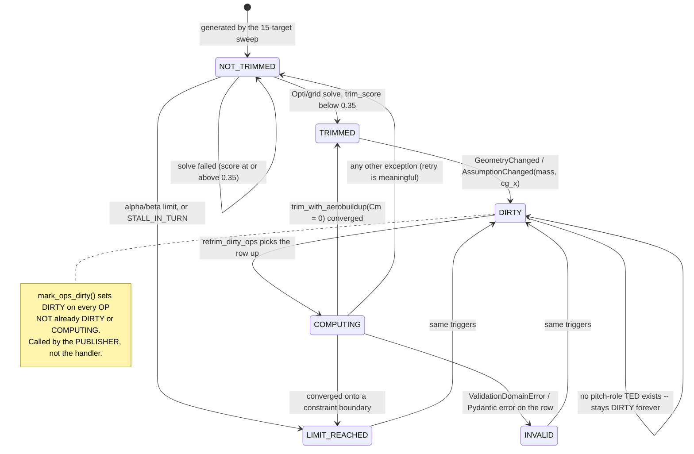

### Transitions

| From | To | Trigger | Guard / note |
|---|---|---|---|
| — | `NOT_TRIMMED` | OP row inserted by `_persist_point_set` | default column value |
| `NOT_TRIMMED` | `TRIMMED` | two-stage trim (asb.Opti → grid fallback) | `trim_score < 0.35` |
| `NOT_TRIMMED` | `LIMIT_REACHED` | trim solve | `\|α\| > max_alpha_deg`, `\|β\| > max_beta_deg`, or `V < V_s1·√n` in a turn (`STALL_IN_TURN`) |
| any except `DIRTY`/`COMPUTING` | `DIRTY` | `mark_ops_dirty(session, aeroplane_id)` | bulk `UPDATE`; called by 7 publishers **before** `event_bus.publish` |
| `DIRTY` | `COMPUTING` | `retrim_dirty_ops` claims the row | runs in its own `SessionLocal` outside a request |
| `COMPUTING` | `TRIMMED` | `trim_with_aerobuildup(Cm=0)` converged | writes the deflection into `control_deflections` |
| `COMPUTING` | `LIMIT_REACHED` | solver hit a bound | |
| `COMPUTING` | `INVALID` | `ValidationDomainError` / Pydantic error | **terminal for retry** — "retrying cannot fix a corrupt row" |
| `COMPUTING` | `NOT_TRIMMED` | any other exception | deliberately retryable |
| `DIRTY` | `DIRTY` | retrim runs but no TED has a role in `{elevator, stabilator, elevon, ruddervator}` | **absorbing state**, logged as a warning only 🔴 |

### Invalidation fan-in

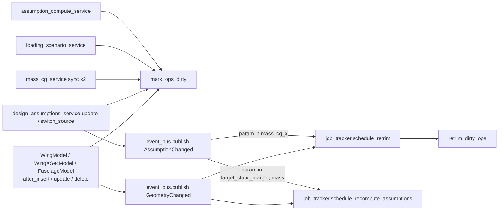

> 🔴 The SQLAlchemy listeners are registered **twice** — once in
> `stability_events.py`, once in `avl_geometry_events.py` — so every geometry
> write publishes `GeometryChanged` twice and calls `mark_ops_dirty` twice.
>
> 🟡 `mark_ops_dirty` is never called by an event *handler*; the handlers only
> schedule jobs, while logging "OPs marked DIRTY". Marking and notifying are two
> responsibilities every publisher must pair by hand (BR-82).

### Warning vocabulary (orthogonal to status)

`STALE_NO_POLAR` · `FLAP_DEFLECTION_CLIPPED` · `ALPHA_LIMIT_REACHED` ·
`BETA_LIMIT_REACHED` · `STALL_IN_TURN` · `NOT_TRIMMED` · `NO_CONTROL_TRIM_MVP`.
Warnings accumulate on the row and are **not** cleared by a successful retrim.
🟡

---

## 2. Aeroplane version node 🟡

There is no `status` column. A node's state is the pair
`(is_immutable, is this node any branch's head?)`.

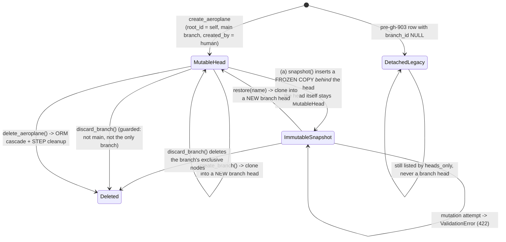

### The counter-intuitive snapshot 🟢

```
before:   [old_pred] <- [head (mutable, id = H)]
after:    [old_pred] <- [snapshot (immutable, id = S)] <- [head (id = H, unchanged)]
```

`snapshot()` does **not** freeze the head and create a new editable copy. It
inserts the frozen copy *behind* the head, so the head keeps its id, UUID and
every inbound reference — the UI never has to re-point after a snapshot.
`resolved_root_id = head.root_id or head.id` handles the root-snapshots-itself
case; the snapshot inherits the head's *old* `predecessor_id` before the head is
re-pointed at it.

| From | To | Operation | Guard |
|---|---|---|---|
| — | mutable head | `create_aeroplane` | bootstraps `root_id = self`, a `main` branch and `branch_id` in one flush dance |
| mutable head | + immutable snapshot behind it | `snapshot(node, label, note, provenance_message_id)` | `_guard_immutable` → 422 if the node is already immutable; `created_by` hard-coded `"human"` |
| mutable head **or** immutable snapshot | new mutable head on a new branch | `create_branch(from_node_id, name, created_by)` | no name-collision check 🔴 |
| immutable snapshot | new mutable head on a new branch | `restore(snapshot_id, name)` | **requires** `is_immutable = True`; default name `restore/<label>` |
| any node on a branch | deleted | `discard_branch(branch_id)` | 409 if `is_main` or the lineage's only branch |
| mutable head | deleted | `delete_aeroplane(uuid)` | ORM cascade; STEP cleanup is best-effort |

### `discard_branch` ordering is load-bearing 🟢

```
1. guards          is_main -> 409 ; only branch of the lineage -> 409
2. collect nodes   WHERE branch_id = ?
3. NULL out every predecessor_id pointing INTO that set
                   (SQLite has no deferrable FKs)
4. db.delete(branch) FIRST
                   (otherwise SQLAlchemy NULLs branches.head_id and violates NOT NULL)
5. db.delete(node) for each node -> ORM cascade removes the owned subgraph
```

> 🔴 Step 3 silently truncates the lineage of *surviving* nodes: a node whose
> `predecessor_id` pointed into the discarded branch keeps existing with a NULL
> predecessor. Nothing checks whether another timeline still needed it.

---

## 3. Branch 🟡

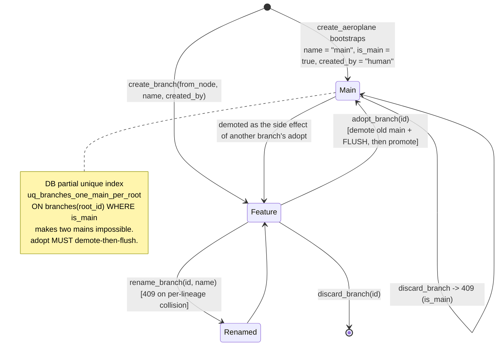

| From | To | Operation | Guard |
|---|---|---|---|
| — | `main` | `create_aeroplane` | one per lineage, DB-enforced |
| — | feature | `create_branch` | **no** name-collision check 🔴 |
| feature | `main` | `adopt_branch` | 409 if already main; **demote-first-then-flush** or the partial index rejects the write |
| feature | renamed feature | `rename_branch` | strips whitespace; 409 on same-`root_id` name collision |
| feature | deleted | `discard_branch` | 409 if main or the lineage's only branch |

`created_by` vocabulary — four writers, three values 🔴:
`aeroplane_service.create_aeroplane` → `"human"`;
`aeroplane_version_service.snapshot` → `"human"` (hard-coded);
`versioning.py` REST default → `"human"`, schema documents `'human' | 'ai'`;
`copilot_apply_service.get_or_open_proposal` → **`"copilot"`**.

---

## 4. Copilot proposal 🟡

The proposal is not a status — it is "a branch exists matching
`root_id = ? AND is_main = false AND created_by = 'copilot' AND name LIKE
'copilot-proposal%'`".

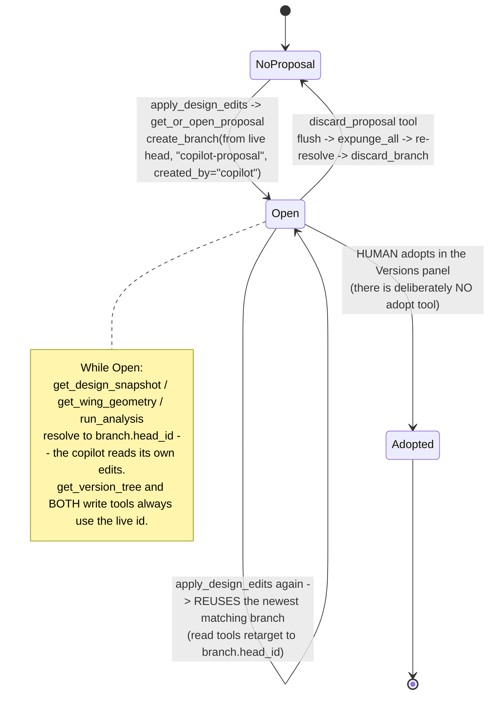

| From | To | Trigger | Actor | Note |
|---|---|---|---|---|
| none | open | `apply_design_edits` | AI copilot | at most one open per aeroplane |
| open | open | further `apply_design_edits` | AI copilot | branch reused; ops rejected individually, never raised |
| open | none | `discard_proposal` | AI copilot (or user asking it to) | `expunge_all()` is required or the cascade delete raises `InvalidRequestError` |
| open | adopted (becomes `main`) | `adopt_branch` via the Versions panel | **human only** | the structural enforcement of "propose, never mutate" |

> 🔴 `_find_open_proposal` orders by `BranchModel.id.desc()` and takes the first;
> nothing prevents duplicates, so older ones would be silently orphaned.
> 🔴 `get_or_open_proposal(message_id=…)` is never called with a message id, so
> the branch is always plainly named `"copilot-proposal"` and the
> `provenance_message_id` link is never populated from this path.

### The turn loop that drives it 🟢

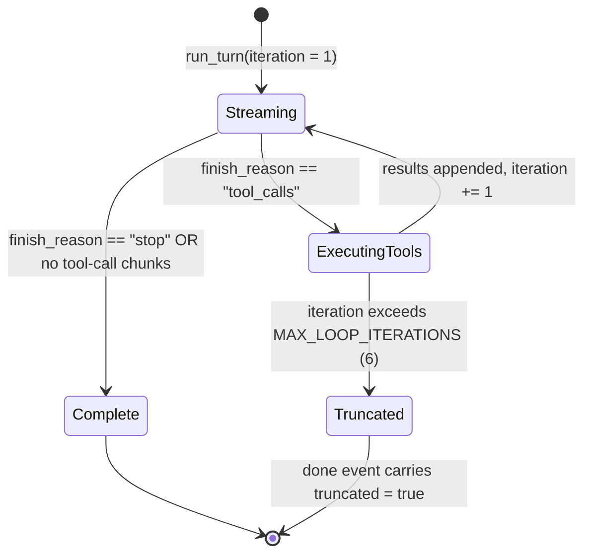

Tool execution is off-loop (`asyncio.to_thread`) precisely so a tool may call
`asyncio.run(...)` for the async AeroSandbox coroutine. Any tool exception
becomes `{"error": …}` and the loop continues.
🔴 A `json.JSONDecodeError` on the accumulated arguments string sets `args = {}`
and the tool is **still invoked** — a truncated stream can call a write tool with
no ops.

---

## 5. Design assumption source 🟢

```mermaid
stateDiagram-v2
    [*] --> Estimate : seed_defaults (idempotent, 15 parameters)

    Estimate --> Calculated : update_calculated_value(auto_switch_source = true)<br/>[calculated_value was NULL] and [not a DESIGN_CHOICE_PARAM]
    Calculated --> Estimate : switch_source("ESTIMATE") -- explicit user action
    Estimate --> Calculated : switch_source("CALCULATED") -- explicit user action

    Estimate --> Estimate : update_calculated_value on a later run<br/>(auto-switch fires ONCE only; the user's choice sticks)

    state DesignChoice
    [*] --> DesignChoice : 7 parameters that can NEVER be calculated
    DesignChoice --> DesignChoice : estimate edits only
```

| From | To | Trigger | Guard |
|---|---|---|---|
| `ESTIMATE` | `CALCULATED` | first ever `update_calculated_value(..., auto_switch_source=True)` | `calculated_value is None` **and** not a design choice |
| `ESTIMATE` ↔ `CALCULATED` | either | `switch_source` | rejected for a design choice; **always** publishes `AssumptionChanged` and schedules a recompute for every parameter except `cg_x` |
| `ESTIMATE` | `ESTIMATE` | `update_assumption` (estimate edit) | publishes `AssumptionChanged` **only** when `active_source == "ESTIMATE"` — editing an estimate while CALCULATED is active changes nothing effective |
| `CALCULATED` | `CALCULATED` | later recompute | value replaced; no event unless effective value changed |

`DESIGN_CHOICE_PARAMS` = `target_static_margin`, `g_limit`,
`battery_capacity_wh`, `battery_specific_energy_wh_per_kg`,
`propulsion_eta_motor`, `propulsion_eta_esc`, `motor_continuous_power_w`.

Divergence banding (a derived display state, not a stored one):
`< 5 %` none · `< 15 %` info · `≤ 30 %` warning · else alert.

---

## 6. Construction plan — a duality, not a lifecycle 🟢

There is no status column. `plan_type` discriminates two *kinds* of row, and the
only observable "lifecycle" is the artefact directories an execution leaves
behind.

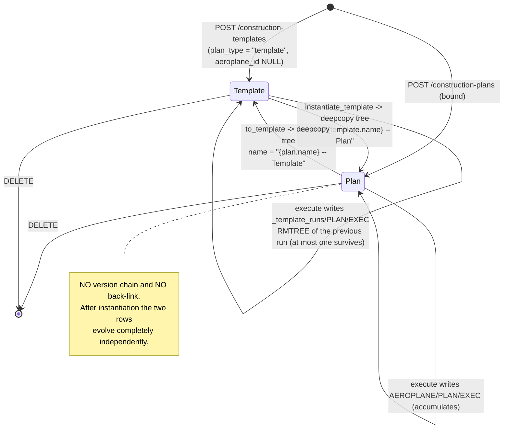

| From | To | Operation | Note |
|---|---|---|---|
| template | plan | `instantiate_template(template_id, aeroplane_id)` | validates `plan_type == "template"` and that the aeroplane exists |
| plan | template | `to_template(plan_id)` | reverse deep copy |
| either | either (self) | `execute_plan` / `execute_plan_streaming` | **not idempotent** for plans; **destructive** for templates |
| `ConstructionStepNode` root | `ConstructionRootNode` root | `_migrate_tree_json` | silent legacy migration performed on **every read** via `get_plan` |

Execution itself has an ephemeral, unpersisted state carried only by the SSE
stream: `shape*` → (`complete` | `error`), with a 300 s queue starvation timeout.

---

## 7. Background job (retrim / recompute) 🟢 — in-memory only

`JobTracker` (`app/core/background_jobs.py`) is a module singleton with two
parallel job families, each `dict[aeroplane_id → Job]`.

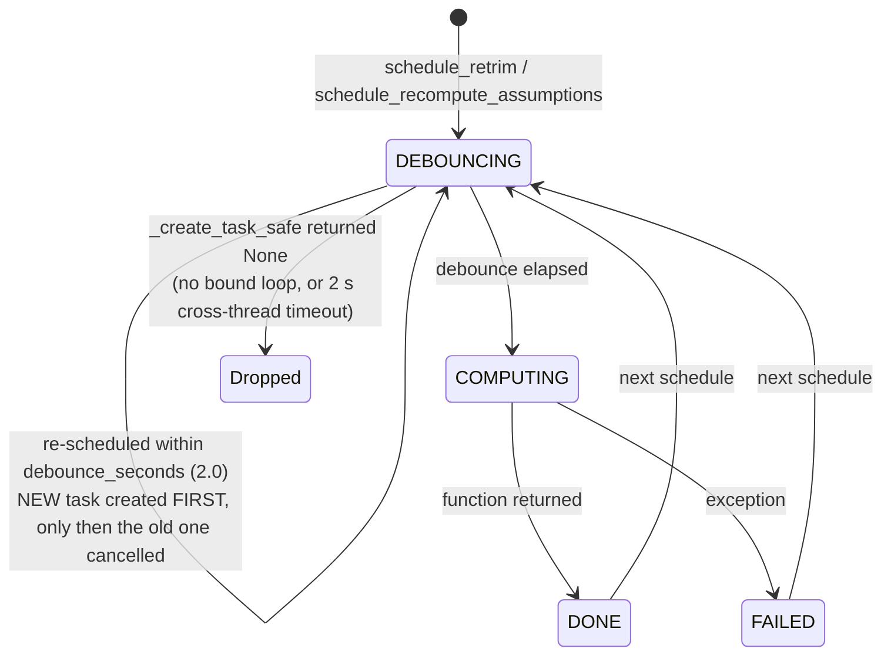

| From | To | Trigger | Guard |
|---|---|---|---|
| — | `DEBOUNCING` | `schedule_*` | `schedule_retrim` **short-circuits** while a job is already `COMPUTING`; `schedule_recompute_assumptions` does **not** |
| `DEBOUNCING` | `COMPUTING` | 2.0 s debounce elapsed | |
| `COMPUTING` | `DONE` / `FAILED` | function return / exception | |
| `DEBOUNCING` | dropped | `_create_task_safe` returns `None` | no bound event loop, or `call_soon_threadsafe` + `threading.Event` timed out after 2.0 s 🔴 **silent** |

Ordering note 🟢: the code deliberately **creates the new task first and only
then cancels the old one**, because `_create_task_safe` can legitimately return
`None` and cancelling first would strand the job in `DEBOUNCING` with no task to
fire it.

> 🔴 State is per-process and in-memory: it does not survive a restart, is not
> shared across workers, and there is no persistence, retry or dead-letter path.
> A third family, `schedule_airfoil_low_re_compute(names)`, is fire-and-forget
> and **untracked** entirely.

---

## 8. Stability result 🟢

One row per `(aeroplane_id, solver)`, upserted.

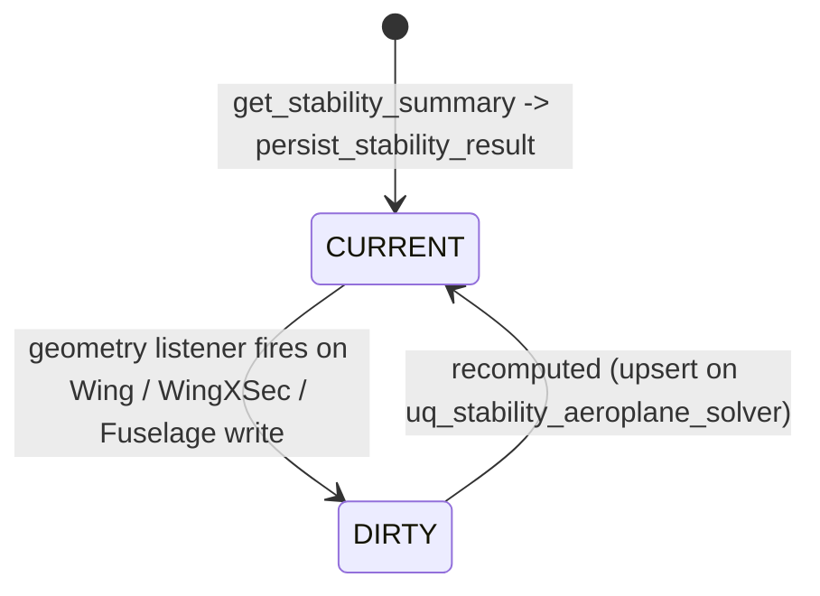

Reads order by `status ASC, computed_at DESC`, which alphabetically prefers
`CURRENT` over `DIRTY`. 🟡 Correct today, but it relies on string ordering rather
than an explicit rank — adding a third status (e.g. `COMPUTING`) would silently
change the preference.

`geometry_hash` (`sha256[:16]` over per-wing `x_le/y_le/z_le/chord/twist` and
per-fuselage `x_c/width/height`) is stored on the row so a reader can tell
whether the cached result still matches the geometry, independently of `status`.

---

## 9. AVL geometry file 🟡

Flag pair `(is_user_edited, is_dirty)` on the single row per aeroplane
(`uq_avl_geometry_files_aeroplane_id`).

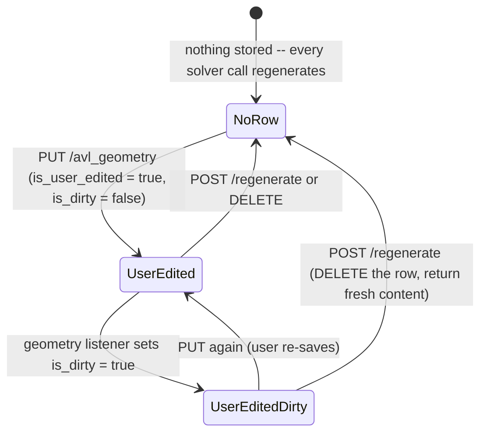

`get_user_avl_content` — the function every solver path calls — returns the
stored content **only** when the row exists **and** `is_user_edited` **and not**
`is_dirty`. Otherwise the caller regenerates.

> 🔴 `is_dirty` is set by the geometry listeners but **nothing ever clears it**
> except a user PUT or a regenerate. A stale user-edited file therefore stays
> permanently bypassed until the user acts.
> 🟡 Asymmetry: `analyze_wing` and the single-wing strip-force path **never**
> consult the stored file (they prune the airplane to one wing), while
> `analyze_airplane`, `trim_with_avl` and the full-airplane strip-force path do.

---

## 10. Tessellation cache entry 🟡

```mermaid
stateDiagram-v2
    [*] --> Missing
    Missing --> Fresh : worker finishes AND is_hash_current(geometry_hash)
    Missing --> Discarded : worker finishes but the geometry changed meanwhile
    Fresh --> Stale : tessellation_hooks.on_wing_changed -> invalidate(...)
    Stale --> Fresh : a new POST .../tessellation completes
    Fresh --> Fresh : re-tessellation debounced 2.0 s;<br/>a new request cancels the pending Timer AND the in-flight Future
```

| From | To | Trigger | Note |
|---|---|---|---|
| missing | fresh | worker completes | result discarded if `geometry_hash` changed while it ran |
| fresh | stale | `on_wing_changed` | bulk `UPDATE ... SET is_stale = True` |
| stale | fresh | explicit re-tessellation | **there is no automatic producer** — the background re-tessellation is an open TODO referencing GH #202 🔴 |

> 🔴 Invalidation is wired **for wings only**. There is no
> `on_fuselage_changed`, and `component_type = "fuselage"` is modelled but has
> no producer at all.
> 🔴 There is no unique constraint backing the logical key
> `(aeroplane_id, component_type, component_name)`, so two concurrent inserts
> can produce duplicate rows and `.first()` silently picks one.

---

## 11. CAD task 🟢 — in-memory, parent-process only

`cad_service.tasks: Dict[str, Dict[str, Any]]` guarded by `tasks_lock`. Keys are
the aeroplane UUID for exports and `f"{uuid}:tessellation:{wing_name}"` for
tessellation.

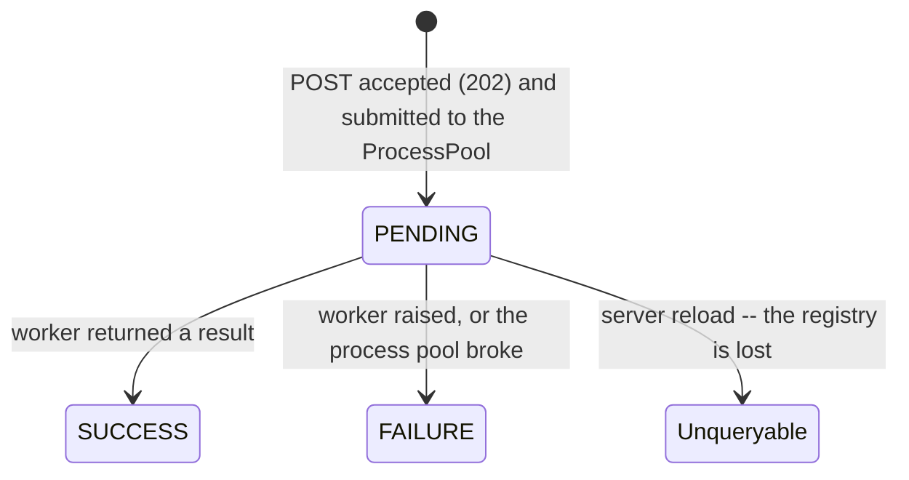

| From | To | Trigger | Note |
|---|---|---|---|
| — | `PENDING` | export or tessellation POST | `check_task_available` serialises **per aeroplane** for exports; it is **not** called on the tessellation path, so a second POST for the same wing silently overwrites the entry 🔴 |
| `PENDING` | `SUCCESS` / `FAILURE` | `future.add_done_callback` | failure text is deliberately type-only (`f"Tessellation failed: {type(err).__name__}"`) — no detail leakage |
| `PENDING` | unqueryable | process restart | `GET /status` → 404 even though the worker may still be running 🟡 |

---

## 12. Non-machines worth recording explicitly

Entities an architect might *expect* to have a lifecycle, and which deliberately
do not:

| Entity | Why it has no state machine |
|---|---|
| **Weight item** | pure CRUD; its only lifecycle effect is triggering the mass sync |
| **Component / component type** | CRUD plus two delete guards (`deletable=False`, referenced-by-count); no status |
| **Construction part** | one boolean `locked` that blocks deletion; no workflow |
| **Airfoil / low-Re polar** | append-only catalogue; a re-backfill replaces rows wholesale (`--force`) |
| **Mission objective / preset** | one row per aeroplane / a seeded library; changing `mission_type` rewrites *estimates* only |
| **Copilot message** | append-only thread ordered by `sort_index = COUNT(*)` — 🔴 not concurrency- or delete-safe; `parent_id` exists for branching but is never written or read |
| **Flight envelope** | recomputed and upserted wholesale; no status |
| **OpenVSP import** | a single request with an SSE progress stream (`parsing → units → scaling → persistence → finalising → complete/error`); no persisted state |

---

*See `domain.md` for the rules these lifecycles enforce and `permissions.md` for
who is allowed to drive them.*
