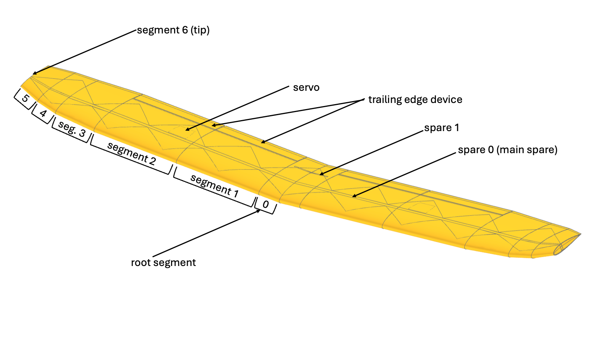
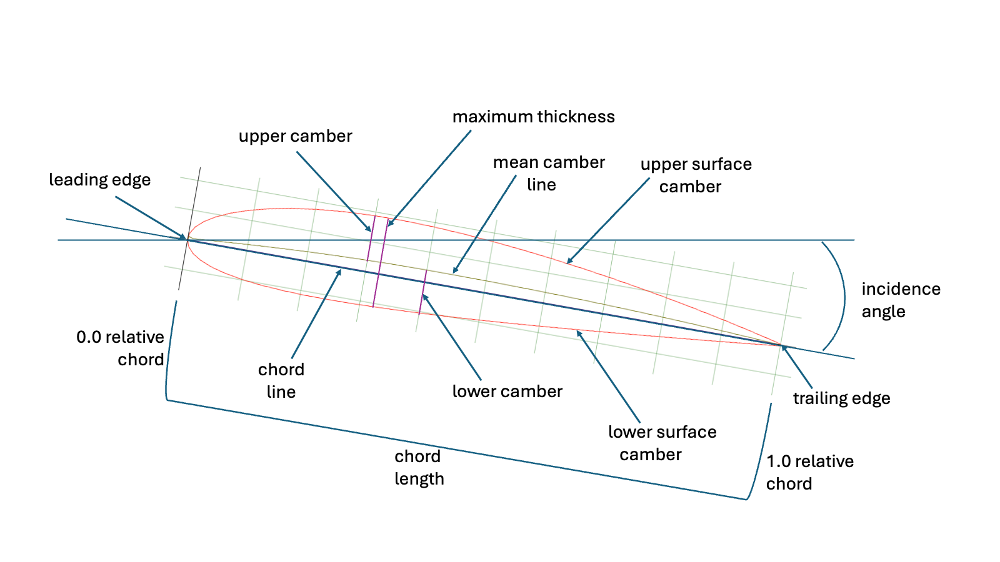
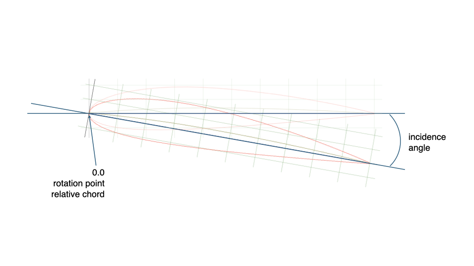
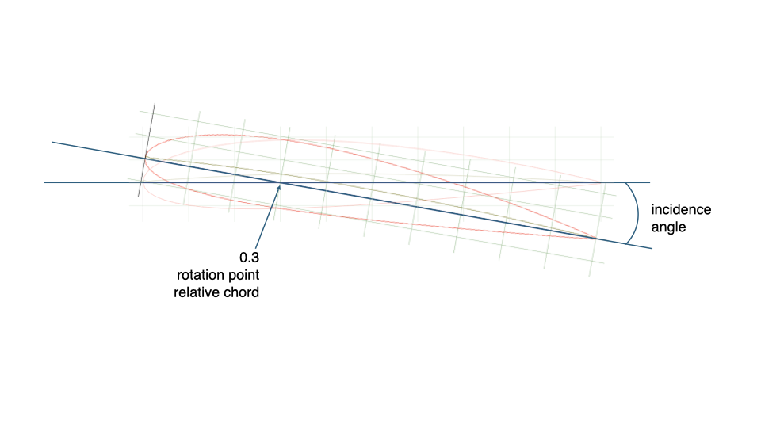
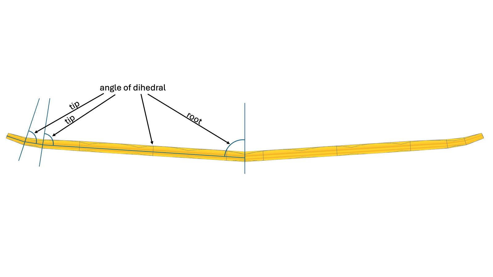
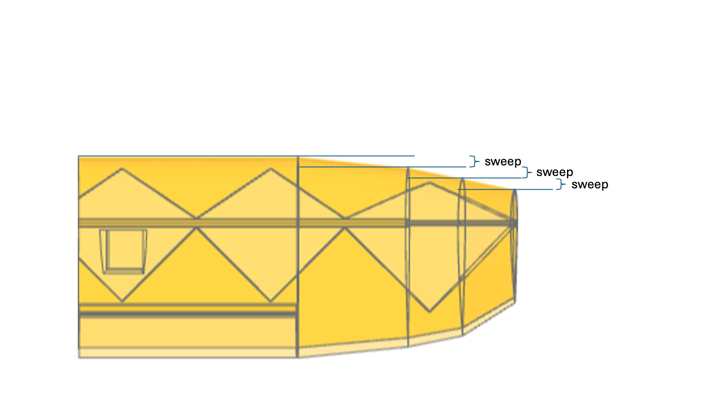
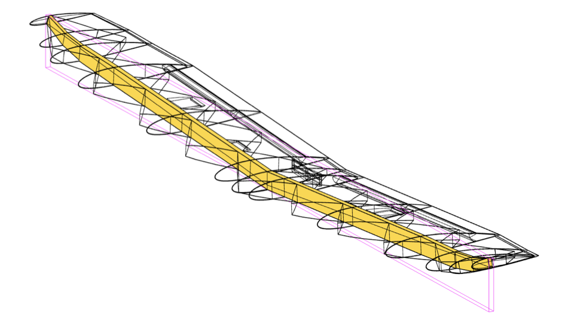
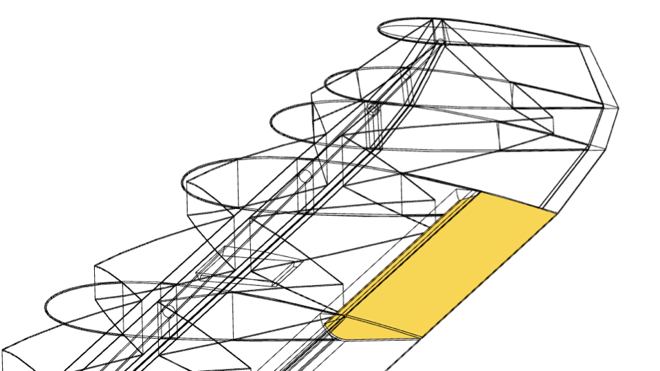
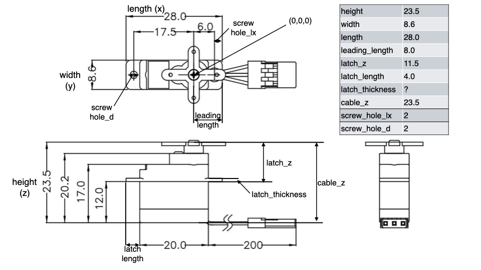

== Wing Configuration
:stem: latexmath

NOTE: can be found in module _airplane.aircraft_topology.wing_

The +WingConfiguration+ is important for the generation of an aeroplane. As it defines the shape and function of the wing, rudder, elevator or other wing like shapes (e.g. streamers, or wind fences).

In general it consists of an ordered list of segments. The list always starts with one _root_-segment, followed by a number of _segments_ which are followed by a number of _tip_-segments.

For segments of type _segment_ or _tip_ the root airfoil is equal to the previous segment's tip airfoil.

[plantuml,"wing_setup",svg]
.A wing consists of segments of +WingSegmentType+ _root_, _segment_ and _tip_.
----
@startebnf
WingConfiguration = root, {segment}, {tip};
@endebnf
----

The following class diagram shows the data structure that describes a wing configuration.

[plantuml, "WingConfiguration_class_diagram", svg]
.The WingConfiguration data structure.
----
@startuml
class WingConfiguration {
    segments: list[WingSegment]
    nose_pnt: Tuple[float, float, float]
    parameters: Literal["relative", "aerosandbox"]
    symmetric: bool

    + def __init__( self: T, // initializes the root segment
      nose_pnt: tuple[float, float, float],
      root_airfoil: Airfoil,
      length: float,
      sweep: float = 0,
      sweep_is_angle: bool = False,
      tip_airfoil: Airfoil = None,
      number_interpolation_points: int = None,
      spare_list: List[Spare] = None,
      trailing_edge_device: TrailingEdgeDevice = None,
      symmetric: bool = True,
      parameters: Literal["relative", "aerosandbox"] = "relative") -> T

    + def add_segment(self: T,\n\t\t length: float,\n\t\t sweep: float = 0,\n\t\t sweep_is_angle: bool = False,\n\t\t tip_airfoil: Airfoil = None,\n\t\t number_interpolation_points: int = None,\n\t\t spare_list: List[Spare] = None,\n\t\t trailing_edge_device: TrailingEdgeDevice = None) -> T

    + def add_tip_segment(self: T,\n\t\t tip_type: TipType,\n\t\t length: float,\n\t\t sweep: float = 0,\n\t\t tip_airfoil: Airfoil = None,\n\t\t number_interpolation_points: int = None) -> T
    + def get_wing_workplane(self: T,\n\t\t segment: int = 0,\n\t\t ignore_nose_point: bool = False) -> Workplane
    + def asb_wing(self, scale: float = 1.0) -> asb.Wing
    + def __getstate__(self) -> dict
    + def from_json_dict(data: dict) -> WingConfiguration
    + def from_json(file_path: str) -> WingConfiguration
    + def save_to_json(self, file_path: str) -> None

}

class Airfoil {
    airfoil: str
    chord: float
    dihedral_as_rotation_in_degrees: DihedralInDegrees,
    dihedral_as_translation: float,
    incidence: float
    rotation_point_rel_chord: float
    coordinate_system: CoordinateSystem|None
}

class WingSegment {
    root_airfoil: Airfoil
    length: float
    sweep: float
    sweep_angle: float
    tip_airfoil: Airfoil
    tip_type: TipType|None
    number_interpolation_points: int|None
    spare_list: list[Spare]|None
    trailing_edge_device: TrailingEdgeDevice|None
    wing_segment_type: WingSegmentType

    + def __init__(self,\n\t\t root_airfoil: Airfoil,\n\t\t length: float,\n\t\t sweep: float = 0,\n\t\t sweep_is_angle: bool = False,\n\t\t tip_airfoil: Airfoil = None,\n\t\t spare_list: List[Spare] = None,\n\t\t trailing_edge_device: TrailingEdgeDevice = None,\n\t\t number_interpolation_points: int = None,\n\t\t tip_type: TipType = None,\n\t\t wing_segment_type: WingSegmentType = 'segment')

}

enum SpareMode {
Literal["normal","follow","standard","standard_backward", "orthogonal_backward"]
}

SpareMode "1" <--* Spare

class Spare {
    spare_vector: Vector|None
    spare_origin: Vector|None
    spare_mode: SpareMode
    spare_position_factor: float|None
    spare_support_dimension_height: float
    spare_support_dimension_width: float
    spare_start: float
    spare_length: float|None
}

class TrailingEdgeDevice {
    name: str
    hinge_spacing: float|None
    negative_deflection_deg: float
    positive_deflection_deg: float
    rel_chord_root: float
    rel_chord_servo_position: float|None
    rel_chord_tip: float
    rel_length_servo_position: float|None
    side_spacing_root: float|None
    side_spacing_tip: float|None
    _servo: Servo|int|None
    servo_placement: Literal["bottom", "top"]
    hinge_type: Literal["middle", "top", "top_simple", "round_inside", "round_outside"]
    trailing_edge_offset_factor: float
    symmetric: bool
}

class Servo {
    length: float
    width: float
    height: float
    leading_length: float
    latch_z: float
    latch_x: float
    latch_thickness: float
    latch_length: float
    cable_z: float
    screw_hole_lx: float
    screw_hole_d: float
    trailing_length: float
}

enum ServoPlacement {
Literal["top", "bottom"]
}

enum HingeType {
Literal["middle", "top", "top_simple", "round_inside", "round_outside"]
}

enum WingSegmentType {
Literal['root','segment','tip']
}
enum TipType {
Literal["flat", "round"]
}

WingConfiguration *--> "1..*" WingSegment
WingSegment *--> "0..*" Spare
WingSegment *--> "2" Airfoil
WingSegment *--> "0..1" TrailingEdgeDevice
TrailingEdgeDevice *--> "1" HingeType
TrailingEdgeDevice *--> "0..1" Servo
WingSegment *--> "0..1" TipType
WingSegment *--> "1" WingSegmentType
TrailingEdgeDevice *--> "1" ServoPlacement

@enduml
----

=== Airfoil
[quote, Wikipedia]
____
An airfoil (American English) or aerofoil (British English) is a streamlined body that is capable of generating significantly more lift than drag.
____

==== Airfoil Parameter

The _airfoil_ (path to file) we use are in Selig-file format which describes a curve as a list of points (x,y) running from the _trailing edge_ (x=1.0) over the _upper surface_ to the _nose point_ (x=0.0) at the _leading edge_ back to the _trailing edges_ via the _lower surface_. Which is then interpolated by cadquery's https://cadquery.readthedocs.io/en/latest/classreference.html?highlight=interpolate#cadquery.Workplane.splineApprox[+splineApprox+]-function. To support cadquery in performing the loft in a ruled way, we have to make sure that the _number of interpolation points_ is equal in both airfoils that are used for the loft.

// A single segment describes a part of a wing that is constructed by lofting the root airfoil of this segment to the tip airfoil of the segment. Segments can be of type _root_, _segment_ or _tip_.
[.clearfix]
--
.Airfoil parameter description

--

#### dihedral
Before lofting the segments airfoils they can be rotated around the _chord line_ which leads to a dihedral of the wing (_dihedral_as_rotation_in_degrees_ latexmath:[\delta_{i}]).

A dihedral can also be obtained by translating the tip airfoil by _dihedral_as_translation_ latexmath:[D_{i}]). We bound this parameter to the root airfoil, which is not correct, as it does not change the segments root airfoil. However, we did it in alignment  to the _dihedral_as_rotation_in_degrees_ parameter.

For some we put some constraints on those two parameters. We can only use one at a time. If we use _dihedral_as_translation_ then latexmath:[rc_{i} = 0.25].

_Why do we constrain them?_ As we use CPACS we need to be able to recalculate the set of parameters from a transformation matrix. They are only unique if we constrain them like this.

_Why do we need both?_ The rotational dihedral rotates the airfoils plane. This is very useful to design winglets. The translational dihedral keeps the airfoil plane unrotated. This keeps the airfoil as a true cut through the wing parallel to the xz-plane, which is needed for some aerodynamic calculations (e.g. as in aerosandbox).

#### incidence angle or twist
It can be rotated around a _rotation point (defined) relative (to the) chord (length)_, which is called the _angle of incidence (AoI)_ denoted with latexmath:[\iota_{i}]. We denote the chord length with latexmath:[C_{i}] and the relative chord factor with latexmath:[rc_{i} \in (0,1)]. In some applications this also called twist.

See figures xref:airfoil_parameter[xrefstyle=short], xref:airfoil_rot0[xrefstyle=short] and xref:airfoil_rot03[xrefstyle=short].

[.clearfix]
--
[.left]
.Rotation point at 0.0 relative chord.

[.left]
.Rotation point at 0.3 relative chord (same AoI)

--

An other parameter wich belongs to the airfoil is the _angle of dihedral_ latexmath:[\delta_{i}], which defines a rotation around the chord line as shown in figure xref:airfoil_parameter_dihedral[xrefstyle=short].

.Dihedral definition

=== Wing Segment

==== Segment Parameters

A segment is defined by two airfoils the segments _root airfoil_ and the segments _tip airfoil_. Both airfoils have two defined offsets to each other:

* the _length_ latexmath:[L_i] of a segment, which is the length of the loft along the y-axis (normal to the airfoil),
* the _sweep_ latexmath:[S_{i}] of a segment, which defines x-offset between a segments _root airfoil_ and it's _tip airfoil_, the sweep can also be given as an angle, which will be internally converted to an x-offset.

The offset along the z-axis is implicitly defined by the _angle of dihedral_.

For ruled lofting we also definded the _number of interpolation points_ parameter, which helps to loft airfoils with different number of interpolation points. This is not a regular segment parameter as it only tries to overcome short comings from the underlying CAD-kernel implementation.

.Sweep definition

==== Wing Segment Types

===== Root
There is only one root segment. It is parametrized during the instantiation of a _WingConfiguration_. This segment is initialized as a complete segment and needs a root airfoil and a tip airfoil.

===== Segment
A segment follows an other segment or the root segment. Hence, the previous tip airfoil is equal to the root airfoil of this segment. Therefore we only need the length, sweep and tip airfoil.

===== Tip
The tip is a special segment, which is also defined like the previous segment, but it also take the parameter _tip type_, which defines how the tip will be designed. Currently we only support 'flat' and 'round'. 'flat' is just like a flat wall attached wing tip. 'round' tries to use a chamfer to round the outlines of the airfoil. A tip does not have a spar nor a trailing edge device.

==== Segment Coordinate Systems
The coordinate system for a segment is defined by the previously defined parameters. By default, it is located at the nose point (`nose_pnt`). With the optional parameter `ignore_nose_point`, the coordinate system can also be calculated without reference to the nose point. The x-axis runs from the nose point to the trailing edge, the y-axis along the wing direction, and the z-axis points upwards along the lift vector of the segment.
// Note: The documentation follows the Python implementation as the single point of truth. In case of discrepancies, the code is authoritative. All parameter names and options (e.g. `nose_pnt`, `number_interpolation_points`, `ignore_nose_point`) are aligned with the current implementation.

The coordinate system latexmath:[H^N] for a segments N is calculated with the homogeneous transformation matrixes described below. We reference the root airfoil of the root segment with i=0 and the following segments with i=1 and so on.

NOTE: Be aware that the tip aifoil of segment i is equal to the root airfoil of segment i+1. That is why the the length and sweep are denoted with latexmath:[L_{i-i}] and latexmath:[S_{i-i}] as they belong to the segment before. If you want to calculate the coordinate system for the tip of a segment you need to calculate latexmath:[H^{N+1}].

latexmath:[H_0 = T(C_{0} rc_{0}, 0,0)\cdot T(0,0,0) \cdot R_x(\delta_{0})\cdot R_y(\iota_{0}) \cdot T(-C_{0} r_{0}, 0,0)]

latexmath:[H_i = T(C_{i} rc_{i}, 0, 0)\cdot T(S_{i-1}, L_{i-1}, D_{i-1}) \cdot R_x(\delta_i) \cdot R_y(\iota_i) \cdot T(-C_{i} rc_{i}, 0,0)]

latexmath:[C_N = H_0\cdot\prod^N_{n=1}H_n],

where
latexmath:[
T(x,y,z)=
  \begin{bmatrix}
    1 & 0 & 0 & x \\
    0 & 1 & 0 & y \\
    0 & 0 & 1 & z \\
    0 & 0 & 0 & 1 \\
  \end{bmatrix} ],
latexmath:[
R_x(\delta_i)=
  \begin{bmatrix}
    1 & 0 & 0 & 0 \\
    0 & \cos(\delta_i) & -\sin(\delta_i) & 0 \\
    0 & \sin(\delta_i) & \cos(\delta_i) & 0 \\
    0 & 0 & 0 & 1 \\
  \end{bmatrix} ],

and
latexmath:[
R_y(\iota_i)=
  \begin{bmatrix}
    \cos(\iota_i) & 0 & \sin(\iota_i) & 0\\
    0 & 1 & 0 & 0 \\
    -\sin(\iota_i) & 0 & \cos(\iota_i) & 0 \\
    0 & 0 & 0 & 1 \\
  \end{bmatrix} ]

==== How calculate the Parameters from given global Coordinate Systems

If we perform the calculation of a single local coordinate system, we get the following homogeneours Transformation Matrix:

latexmath:[C_N = \left[
\begin{matrix}
\cos{\left(\iota_i \right)} & 0 &\sin{\left(\iota_i \right)}  & - c_i \tau_i \cos{\left(\iota_i \right)} + c_i \tau_i + S_{i-1}\\
\sin{\left(\delta_i \right)} \sin{\left(\iota_i \right)} & \cos{\left(\delta_i \right)} & - \sin{\left(\delta_i \right)} \cos{\left(\iota_i \right)} & - c_i \tau_i \sin{\left(\delta_i \right)} \sin{\left(\iota_i \right)} + L_{i-1}\\
- \sin{\left(\iota_i \right)} \cos{\left(\delta_i \right)} & \sin{\left(\delta_i \right)} & \cos{\left(\delta_i \right)} \cos{\left(\iota_i \right)} & c_i \tau_i \sin{\left(\iota_i \right)} \cos{\left(\delta_i \right) + D_{i-1}}\\
0 & 0 & 0 & 1
\end{matrix}
\right\]]

Usually we only have the global coordinate systems, which we get from CPACS-files for instance. To transform the globale coordinate
systems to local We can do the following. If we have the current global coordinate system latexmath:[C_N] and the previous global coordinate system latexmath:[C_{N-1}] we can derive:

latexmath:[C_N = (H_0\cdot\prod^{N-1}_{n=1}H_n)\cdot H_N]

latexmath:[H_N = (H_0\cdot\prod^{N-1}_{n=1}H_n)^-\cdot C_N]

latexmath:[H_N = C_{N-1}^-\cdot C_N ]

From this we can calculate the parameters, by utilizing matrix latexmath:[H_i].

Incident angle in radians:

latexmath:[ \iota_i = \operatorname{atan2}(\sin(\iota_i), \cos(\iota_i)) = \operatorname{atan2}(H_i[0,2\], H_i[0,0\])]

The _dihedral_ can be given as a rotation around the x-axis latexmath:[\delta_i] or (exclusive or) a translation along the z-axis latexmath:[D_i]  (aerosandbox style)

Case A: dihedral in radians as rotation around the x-axis latexmath:[D_{i-1}=0 \wedge \delta_i \neq 0]:

latexmath:[ \delta_i = \operatorname{atan2}(\sin(\delta_i), \cos(\delta_i)) = \operatorname{atan2}(H_i[2,1\], H_i[1,1\])]

From this we can derive the relative chord rotation point of incidence angle:
latexmath:[ \tau_i = H_i[2,3\]/\left(c_i \sin{\left(\iota_i \right)} \cos{\left(\delta_i \right)}\right)]

Case B: dihedral in length as translation along the z-axis latexmath:[D_{i-1} \neq 0 \wedge \delta_i = 0 \wedge \tau_i=0.25] (quater chord)

_We need to set the incidence rotation point to a fixed value as it is not distinguishable if the z translation of the final transformation comes from the dihedral rotation around the x axis or  a dihedral translation._

latexmath:[D_{i-1} = H_i[2,3\] - 0.25 \cdot c_i \sin{\left(\iota_i \right)}]

latexmath:[ \tau_i = 0.25]

Segment length in length units:

latexmath:[ L_{i-1}  = H_i[1,3\] + c_i \tau_i \sin{\left(\delta_i \right)} \sin{\left(\iota_i \right)} = H_i[1,3\] + c_i \tau_i H_i[1,0\]]

Sweep in length units:

latexmath:[ S_{i-1} = H_i[0,3\] + c_i \tau_i \left(\cos{\left(\iota_i \right)} - 1\right) =  H_i[0,3\] + c_i \tau_i \left(H_i[0,0\] - 1\right)]

And from this the sweep in radians:

latexmath:[s_{i-1} = \operatorname{atan2}\left({S_{i-1}, L_{i-1}}\right)]

==== How to calculate the WingSegment and Airfoil Parameters from aerosandbox

aerosandbox defines a Wing by defining the crossections as WingXSec objects. The WingXSec class has as attributes:

xyz_le:: the origin vector latexmath:[o_{i}] of the trailing edge point (nose point of the airfoil) in the standard global coordinate system (x-axis pointing to the tail, z-axis up and y-axis along the right wing).

twist :: the twist angle latexmath:[\theta_i] also globally defined as angle between center chord line to the x-axis, with a fixed rotation point  latexmath:[\tau_i = 0.25].

chord :: the chord length latexmath:[c_i]

latexmath:[R_N] :: aerosandbox provides the rotation matrix for the leading edge of a cross section which gives together with latexmath:[o_{i}] the homogeneous transformation matrix latexmath:[C_N].

The global homogeneous transformation matrix latexmath:[C_N] for aerosandbox is:

latexmath:[C_N =  T(S_{i-1}, L_{i-1}, D_{i-1}) \cdot T(C_{i} rc_{i}, 0, 0)\cdot R^-_y(\iota_i) \cdot T(-C_{i} rc_{i}, 0,0) \cdot R_x(\delta_i) ]

with latexmath:[
R^-_y(\iota_i)=
  \begin{bmatrix}
    \cos(\iota_i) & 0 & -\sin(\iota_i) & 0\\
    0 & 1 & 0 & 0 \\
    \sin(\iota_i) & 0 & \cos(\iota_i) & 0 \\
    0 & 0 & 0 & 1 \\
  \end{bmatrix} ],

as aerosandbox seems to rotate in the wrong direction.

latexmath:[C_N = \left[
\begin{matrix}
\cos{\left(\iota_{i} \right)} & \sin{\left(\delta_{i} \right)} \sin{\left(\iota_{i} \right)} & \sin{\left(\iota_{i} \right)} \cos{\left(\delta_{i} \right)} & - Ci rc_{i} \cos{\left(\iota_{i} \right)} + Ci rc_{i} + S_{prev}\\
0 & \cos{\left(\delta_{i} \right)} & - \sin{\left(\delta_{i} \right)} & L_{prev}\\
\sin{\left(\iota_{i} \right)} & \sin{\left(\delta_{i} \right)} \cos{\left(\iota_{i} \right)} & \cos{\left(\delta_{i} \right)} \cos{\left(\iota_{i} \right)} & -Ci rc_{i} \sin{\left(\iota_{i} \right)} + D_{prev}
\\0 & 0 & 0 & 1
\end{matrix}
\right \] ]

From this we can derive:

latexmath:[\iota_i = \operatorname{atan2}(C_N[2,0\], C_N[0,0\])]

latexmath:[\delta_i = \operatorname{atan2}(-C_N[1,2\], C_N[1,1\])]

latexmath:[S_i = C_N[0,3\]+c_i\tau_iC_N[0,0\] - c_i\tau_i]

latexmath:[L_i=C_N[1,3\]]

latexmath:[D_i=C_N[2,3\]-c_i\tau_i + C_N[2,0\]]

To enable the aerosandbox mode we need to set WingConfiguration.parameters = "aerosandbox".

==== Spar
.The main spar.

A spar is a construction that runs lengthwise through the wing. We can add arbitrary spars to a wing. However, the spar with index 0, will always be treated as the main spar and has a major impact on the construction of the wing. In general this spar takes all the load of the wing and to reduce wing twist it should be placed in the area of the largest lift, which is in normal flight around the point of the maximum thickness, which is in most cases between 25%-30% of the chord length. You can define this placement via the _spar position factor_, the default value is 0.25.

Another way to overwrite this setting is to use the _spar origin_. This is a vector given in the segments coordinate system which defines the spar's placement.

An other important vector is the _spar vector_ it is also given in the segment's coordinate system and defines in which direction the spar will be lofted.

The _spar length_ of spar tells us how far the spar will be lofted along the _spar vector_ and the _spar start_ states at which point on the _spar vector_ the loft will start.

In general our spars will have some kind of support structure, which is not printed. This usually is a carbon rod round or rectangular formed. You can give the dimension of the rod by the _spar support dimension height_ and _spar support dimension width_ if height is equal width we will interpret this as a round rod. Otherwise it is rectangular.

NOTE: You can create a squared rod by adding latexmath:[1e^{-10}] on one of the dimensions.

===== spar Mode
The most important parameter is the _spar mode_ as it helps you to define some standard spars, which will calculate the _spar vector_ and the _spar origin_ for you if you set them to 'None'. If one of the following modes is effected by a previous spar or effects previous spars, than it will only effect spars with the same index.

====== normal
The *normal* _spar vector_ will be set to be normal to the xz-plane of the segment's coordinate system. It is equal to the segment's coordinate systems y-axis vector.

====== follow
The _spar vector_ will *follow* the direction of the previous one, so the _spar vector_ will be the previous _spar vector_ expressed in the current segment's coordinate system.

====== standard
The *standar* _spar vector_ is calculated in that way, that the spar vector will point from the mean camber point at the given relative chord (_spar position factor_) of the _root airfoil_ to the corresponding point of the _tip airfoil_. The start point also defines the _spar origin_ if it is not overwritten.

====== standard backward
This mode is similar to the previous one. But it differs in the way, how the _root airfoil_ is selected. If we come to a spar in 'standard_backward' mode, we backtrace through the previous spars and select the first spar, that is not in 'follow' mode. We use this segments _root airfoil_ in the same manner as in the 'standard' case. After calculation of the origin and the spar vector we adjust the other segments in between.

NOTE: We also use (_spar position factor_) of the spar we found during backtracking.

====== orthogonal backward
This mode is similar to the previous one. However, the spar will be orthogonal to the XZ-plane.

==== Trailing Edge Device
.A trailing edge device, here an aileron.

A _trailing edge device (ted)_ is usually used for flaps, rudder, elevators or ailerons. It is used to control the planes lift (flaps) or rotations (yaw, pitch, role), depending on the wing's function. Usually we give a ted a unique _name_, which in best practice also tells us it's function.

We define that a segment, that defines a ted will always cutoff a part of the trailing edge of this wing. The cutoff starts at the root airfoils _rel(ative) chord (root)_ and goes in a straight line to the tip airfoils _rel(ative) chord (tip)_.

We can define a spacing for ted that will reduce the size of the ted by the amount of mm accordingly. This given by the _side spacing tip_ and _side spacing root_ parameter.

The _hinge spacing_ tells us, how much space we will leave between the wing and the ted.

The _negative deflection_ and the _positive deflection_ angle state how much the ted should be deflected in extreme.

The _hinge type_ defines, how the connection between the wing an the ted is constructed. Currently we support the following hinge types:

* 'middle' - the hing is placed in the middle at the mean camber, the ted is shaped in a way that it will reach the defined deflection
* 'top' - the hinge is place at the upper surface camber, the ted is shape in a way that it will reach the defined deflection and it the ted will reach into the wing an will always give a close surface on the upper and bottom surface of the wing.
* 'top simple' - the hinge is place at the upper surface camber, the ted is shape in a way that it will reach the defined _negative deflection_
* 'round inside' - the hinge is in the middle and the ted is round where it reaches into the wing.
* 'round outside' - the hinge is in the middle and the ted is round to the inside where the wing reaches into the ted.

The _name_ is used to collect all TEDs with the same name. The first TED will define all parameters. Than this TED is used to generate the TEDs of all segments with the same name. TEDs with same names should be in consecutive segments.

==== Servo
.A parameterized servo.

The servo is defined in conjunction of a trailing edged device as you usually need an actuator to make it move. The placement of the servo an the length and placement of the horns/levers can be crucial for the performance of the ted.

The position inside of the wing is determined by it's _rel(ative) chord servo position_ and _rel(ative wing) length servo position_. This gives the position of the servo's zero coordinates within the wing. The _servo placement_ 'top' defines that the servo lays on the upper camber surface and 'bottom' on the lower camber surface.

The dimensions of the servo are defined in figure xref:servo[xrefstyle=short]

NOTE: (to be implemented) If the servo position given as 'None' the system itself will place the servo in an optimal position for printing and for forces on the trailing edge device.

=== Mapping between WingConfiguration and aerosandbox

|===
|aerosandbox |WingConfiguration |Header 3

|Wing.name | --  |
|Wing.color | --  |
|Wing.analysis_specific_options| --  |
|Wing.symmetric | WingConfiguration.symmetric  |
|Wing.translate | WingConfiguration.nose_point |
|Wing.xsecs | WingSegment + Airfoil |
|Wing.xsecs[0].xyz_le |  |
|Wing.xsecs[0].chord | WingConfiguration.segments[0].root_airfoil.chord |
|Wing.xsecs[0].twist | WingConfiguration.segments[0].root_airfoil.incidence |
|Wing.xsecs[0].airfoil | WingConfiguration.segments[0].root_airfoil.airfoil |
| fixed = 0.25| WingConfiguration.segments[0].root_airfoil.rotation_point_rel_chord |

|Wing.xsecs[0].control_surfaces.name |  WingConfiguration.segments[0].trailing_edge_device.name |
|Wing.xsecs[0].control_surfaces.symmetric |WingConfiguration.segments[0].trailing_edge_device.symmetrix  |
|Wing.xsecs[0].control_surfaces.deflection | -- |
|Wing.xsecs[0].control_surfaces.hinge_point | WingConfiguration.segments[0].trailing_edge_device.rel_chord_root |
|tip == root | WingConfiguration.segments[0].trailing_edge_device.rel_chord_tip |
|Wing.xsecs[0].control_surfaces.trailing_edge | fixed = True  | only trailing edge devices

|===

|===
|WingConfiguration |asb.Wing |Remarks / Logic

| .symmetric
| .symmetric
| the same

|.nose_pnt
|.translate(...)
|The translation is performed on the whole wing at the end. Otherwise rotations like dihedral would be wrong.

|.segments[0].root_airfoil
|.xsecs[0]
|The root airfoil of segment 0 corresponds to the first cross-section in asb.

|.segments[i].tip_airfoil (for all i)
|.xsecs[i+1]
|The following cross-section coresponds to the tip airfoil of the previous segment.

|.get_wing_workplane(i).origin
|.xsecs[i].translate([x, y, z]) for all i
|The origin of the segments plane is the origin of the trailing edge. xyz_le is deprecated, so we use translate(...).

|segment[0].root_airfoil.incidence + Summe(segment[i].tip_airfoil.incidence) for i > 0 else
segment[0].root_airfoil.incidence for i = 0
|xsecs[i].twist
|Our incidence angle is relative to the local x-axis of the previous cross-section. The twist is relative to the global x-axis. The point of rotation is fixed at 0.25 chord.

|airfoil.airfoil (Path)
|asb.Airfoil(name=os.path.abspath(...))
|Must be absolute path to the airfoil file.

|trailing_edge_device (optional)
|asb.ControlSurface(...)
|TED must hold rel_chord_root == rel_chord_tip as asb  defines only one hinge point.

|trailing_edge_device.name
|ControlSurface.name
|

|trailing_edge_device.symmetric
|ControlSurface.symmetric
|

|trailing_edge_device.rel_chord_root
|ControlSurface.hinge_point
|We take the rel_chord_root parameter as the hinge point. Both must be equal.

|–
|ControlSurface.trailing_edge = True
|Always true as we support only trailing edge devices.

|===
