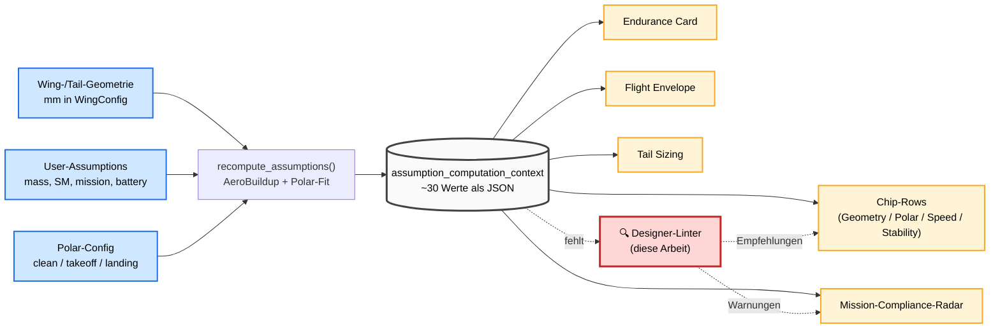
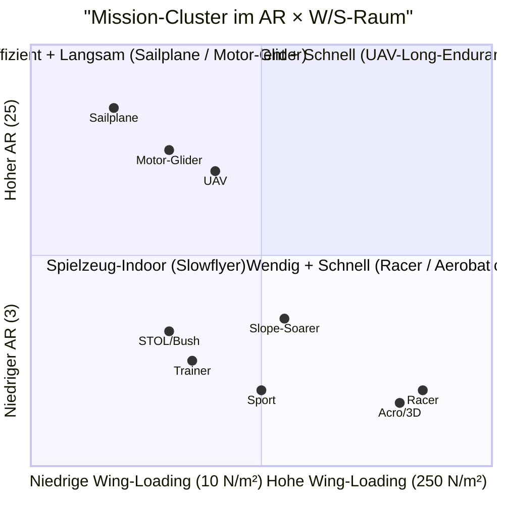
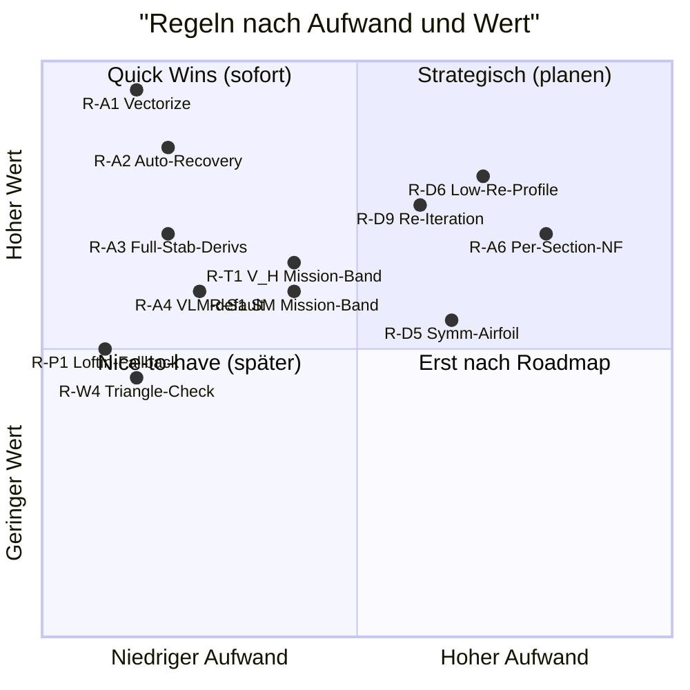

# Vom Wert zur Empfehlung
## Ein Designer-Linter für den da3Dalus RC-Aircraft-Workflow

**Working Paper v1.2** (Code-Realitätsabgleich)
**Stand:** 2026-05-23 (Codebasis-Stand: Commit `9a6adb2c` + Folge-Commits gh-526, gh-630, gh-636)
**Autoren:** Vier-Experten-Team — Sizing (Scholz/Sadraey), Aerodynamik (Anderson), Solver (Sharpe / AeroSandbox), RC-Praxis (Lennon / rcplanedesigner)
**Teamleitung & Synthese:** Software-Analyse-Team
**Status:** Pre-Print, drei Peer-Reviews eingearbeitet, Code-Stand verifiziert

> **v1.2 (Code-Realitätsabgleich):** Der Anwender hat darauf hingewiesen,
> dass sich am Oswald-Code seit v1.0 substantiell etwas geändert hat.
> Ein Code-Archäologie-Lauf hat drei relevante Commits identifiziert
> (**gh-636**, **gh-630**, **gh-526**), die die Pipeline-Realität
> deutlich verändert haben. Konsequenzen für das Paper:
> - **Gap 2 (Bubble-Signal als `data` kategorisiert)** ist nicht
>   versehentlich versteckt, sondern **bewusst** so — Laminar-Bubble ist
>   nach gh-630-Reasoning ein Profil-/Datenproblem, kein User-
>   Designfehler. §4 Gap 2 entsprechend nuanciert.
> - **0.8-Fallback** existiert noch, aber als **letzter** Schritt einer
>   dreistufigen Provenance-Kette (gh-636): `aerobuildup_trefftz` →
>   `fit` → `fallback`. Regel R-P1 (Loftin-Fallback) ist damit teilweise
>   obsolet — die Realität ist besser als die Empfehlung. §4 Gap 1 und
>   §7.1 entsprechend umgeschrieben.
> - **`polar_by_config`** speichert seit gh-526 drei Polaren (clean,
>   takeoff, landing) mit eigener Provenance pro Config.

---

## Revisionshistorie

**v1.1 — Änderungen nach Peer-Review (3 unabhängige Reviewer):**

| # | Reviewer | Befund-Severity | Änderung |
|---|---|---|---|
| 1 | Wissenschaft | major | **Span-Efficiency vs. Oswald-Faktor** explizit getrennt (§7.2). Anderson §5.3.1 belegt nur Span-Efficiency ≤ 1, nicht Oswald. |
| 2 | Wissenschaft | major | **Re-Regime-Tabelle (§5.1)** umetikettiert auf Selig/Drela/Hepperle/Mueller (nicht Anderson). Anderson §20.3.2 demonstriert nur am konkreten Re=100 k-Beispiel. |
| 3 | Wissenschaft | minor | **Drag-Steigerung durch Bubble** von "+50–100 %" auf "+20–100 % je nach Profil" abgeschwächt; Quellen Hepperle/Selig statt Anderson. |
| 4 | Wissenschaft | minor | **§4.12.4 Bubble-Bursting-Zitat** ergänzt mit korrekter Quellenangabe (Tani 1964, Gaster 1967, Mueller/Batill). |
| 5 | Wissenschaft | minor | **12 % CL_max-Δ** auf "5–12 %, profilabhängig" relativiert. |
| 6 | Impl./ASB | **major** | **Fabriziertes Sharpe-Firefly-Zitat entfernt** (§4 Gap 5, §7.4). Stattdessen ehrliche Größenordnungsschätzung "50–200× für 200 Punkte". |
| 7 | Impl./ASB | major | **„CasADi-Analytic-AD exakt"** korrigiert zu „vektorisiertes Finite Differencing auf Batch (analytisches AD opt-in)" (§4 Gap 7, §7.4). |
| 8 | Impl./ASB | minor | **Solver-Gotchas ergänzt:** VLM `Cnbeta` sign-flip vor ASB 4.0.7, LiftingLine rate-derivs untested (§7.4). |
| 9 | RC-Praxis | major | **Acro-Dihedral** korrigiert auf 0° (Pattern) bzw. 0° bis −1° (3D); Aufteilung in `acro_pattern` und `acro_3d` empfohlen (§7.3, §12). |
| 10 | RC-Praxis | major | **Profil-Empfehlungen** strukturiert in Re-abhängige Tabelle (DLG: AG-Serie; Sport/Thermik: SD7037, MH32, E197; Pylon: NACA 64) — neuer §5.2.1. |
| 11 | RC-Praxis | major | **Sailplane-Sub-Disziplinen** (DLG/F5J/F3F) als Future-Work in §12 dokumentiert. |
| 12 | RC-Praxis | minor | **Erstflug-CG-Empfehlung** auf SM ≥ 12 % verschärft (§7.3, Bezug Lennon Kap. 6). |
| 13 | RC-Praxis | minor | **Wing-Loading wingspan-skaliert** als offener Punkt im Validator-Sprint dokumentiert (§12). |
| 14 | RC-Praxis | minor | **Decalage / Thrust-Line / CG-Z-Position** als drei neue Regelvorschläge in §12 aufgenommen. |
| 15 | RC-Praxis | minor | **Glossar** ergänzt (§11) für RC-Begriffe (Trefftz-Plane, OLS-Fit, Helmbold-Korrektur, AD). |
| 16 | RC-Praxis | minor | **Turbulator-Position** korrigiert auf x/c ≈ 0.55–0.65 (kurz vor Bubble), nicht 0.25–0.30 (§5.1 + §11). |

**Positive Befunde der Reviewer** (unverändert übernommen): V_H-Mission-Band-Regel R-T1 als exemplarisch korrekt gelobt; Auto-Recovery-Mechanik R-A2 als richtige Antwort auf `feedback_design_error_feedback`; Linter-Architektur als implementierungsfähig.

---

## Abstract

Die Aircraft-Design-Anwendung *da3Dalus* berechnet und persistiert rund
80 aerodynamische, geometrische und Mission-bezogene Kennwerte für RC-
und kleinere UAV-Modelle. Eine vorangehende Strukturanalyse
(`value-trace.md`) hat den vollständigen Pfad jedes Werts vom
Frontend-Display bis zum Solver-Aufruf (AeroSandbox AeroBuildup,
AVL, NeuralFoil) dokumentiert. Diese Werte werden bislang **angezeigt,
aber nicht interpretiert**: Der Anwender sieht Zahlen ohne expliziten
Hinweis, ob seine Auslegung im plausiblen Bereich für die gewählte
Mission liegt, ob die parabolische Polare valide gefittet wurde oder ob
ein Profil bei den vorliegenden Reynolds-Zahlen überhaupt geeignet ist.

Dieses Working Paper beschreibt die Konzeption eines **Designer-Linters**
auf Basis der existierenden Wertepipeline. Vier Domänenexperten haben
das System unabhängig auditiert und insgesamt 63 Regelvorschläge
entwickelt. Nach Konvergenzanalyse verbleiben **35 konsolidierte
Regeln** sowie **sieben übereinstimmend identifizierte Lücken** in der
heutigen Pipeline. Wir zeigen, wie aus existierenden cached values
(`assumption_computation_context`) mit minimalem Backend-Aufwand ein
mission-bewusstes Frühwarn- und Empfehlungssystem entsteht, das vom
Anfänger-Trainer-Erstflug-CG bis zur transonischen Mach-Crit-Warnung
für UAVs reicht.

Die wichtigste methodische Erkenntnis: **Die Pipeline kennt mehr
Designdiagnostik, als sie an die UI bringt** — der existierende
dreistufige Oswald-Provenance-Mechanismus (gh-636), die sechs
kategorisierten Polar-Rejection-Gates (gh-630) und die per-Konfiguration
getrennten Polaren (gh-526) bilden bereits eine solide diagnostische
Basis. Was fehlt, ist die mission-bewusste **Übersetzungsschicht**, die
diese Diagnostik in handlungsleitende Empfehlungen umsetzt: ein V_H
von 0.42 als „im Sailplane-Band" interpretieren, ein gerejecteter
Polar-Fit als „erwäge Profil mit Drag-Bucket bei diesem Re"
ausformulieren. Die wichtigste Quick-Win-Empfehlung bleibt unabhängig
davon: **Vektorisierung des AeroBuildup-Fine-Sweeps**, die einen
Faktor 50–200× Geschwindigkeit ohne Genauigkeitsverlust verspricht.

**Schlagworte:** RC Aircraft Design, AeroSandbox, NeuralFoil, parabolische
Polare, Reynolds-Effekte, laminare Ablöseblase, Mission-Tailoring,
Designer-Linter, Static Margin, Tail Volume, Lennon, Sadraey, Anderson.

---

## Inhaltsverzeichnis

1. [Einführung und Motivation](#1-einführung-und-motivation)
2. [Methodik des Vier-Experten-Audits](#2-methodik-des-vier-experten-audits)
3. [Architektur des heutigen Wertesystems — Kurzfassung](#3-architektur-des-heutigen-wertesystems--kurzfassung)
4. [Die sieben konvergenten Gaps](#4-die-sieben-konvergenten-gaps)
5. [Erklärende Modelle](#5-erklärende-modelle)
6. [Vom Wert zur Regel — annotierte Beispiele](#6-vom-wert-zur-regel--annotierte-beispiele)
7. [Diskussion aus vier Fachperspektiven](#7-diskussion-aus-vier-fachperspektiven)
8. [Implementierungs-Roadmap](#8-implementierungs-roadmap)
9. [Fazit](#9-fazit)
10. [Literatur und Quellen](#10-literatur-und-quellen)
11. [Glossar (RC-Begriffe)](#11-glossar-ergänzt-in-v11-für-hobby-adressaten)
12. [Bekannte Lücken und Future Work](#12-bekannte-lücken-und-future-work)

---

## 1. Einführung und Motivation

### 1.1 Was *da3Dalus* heute leistet

Die Pipeline liefert dem Designer einen ungewöhnlich tiefen Stack aus
einer einzigen Web-UI: parametrische CAD-Geometrie auf Basis von
CadQuery, vortex-lattice- und component-buildup-basierte Aerodynamik
mittels AeroSandbox 4.2, optional vergleichende Stability-Läufe über
das vendored AVL-Binary sowie eine elektrische Endurance-Rechnung. Im
Frontend (Next.js 16 / React 19) entsteht daraus eine Reihe von
Dashboards: Wing-Editor, Polar- und Trefftz-Plots, Stability-Chips,
Flight-Envelope, Endurance-Card, Mission-Compliance-Radar.

Die vorangehende Strukturanalyse (`value-trace.md`) hat alle diese
Anzeigen rückwärts traciert und folgendes Skelett freigelegt: **80 % der
angezeigten Werte stammen aus einem einzigen Cache**, dem
`assumption_computation_context` (ein JSON-Feld pro Aeroplane in der
Datenbank). Dieser Cache wird vom Hintergrund-Job
`recompute_assumptions` befüllt, der intern eine AeroBuildup-Sweep mit
parabolischem Polaren-Fit pro Flap-Konfiguration ausführt und das
Ergebnis persistiert. Die restlichen 20 % (Operating Points, Strip
Forces, Streamlines) hängen an separaten Solver-Endpoints und werden
optional über einen Operating-Point-Resolver (`gh-577`) mit getrimmten
Zuständen verknüpft.

### 1.2 Was *da3Dalus* heute *nicht* leistet

Der Pipeline fehlt eine **Interpretationsschicht**. Die Polaren-Chips
zeigen einen Reynolds-Wert, aber sagen nicht, dass dieser unter
100 000 in einem Regime liegt, in dem klassische Profile durch
laminare Ablöseblasen +20–100 % Widerstand erzeugen können. Das
Frontend rendert ein V_H von 0.42, ohne den Anwender wissen zu lassen,
dass dieser Wert für eine *Sailplane*-Mission im Sadraey-Soll-Band
liegt, für einen *Trainer* aber zu klein ist. Eine fehlgeschlagene
parabolische Polare durchläuft heute zwar eine dreistufige Provenance-
Kette (`aerobuildup_trefftz` → `fit` → `fallback`; gh-636), aber wenn
am Ende der 0.8-Fallback greift, sieht der Anwender nur das Sternchen-
Symbol an einem Chip — die eigentliche Rejection-Diagnose (Polare
nicht-monoton, k≤0, e unphysikalisch) wird nicht als Profil-
Empfehlung in Klartext übersetzt. Genau diese **Empfehlungsschicht**
schlägt das Paper vor.

### 1.3 Ziel dieses Papers

Wir schlagen vor, aus dem existierenden Cache und der Solver-Pipeline
ein **regel-basiertes Empfehlungssystem** abzuleiten. Jede Regel hat die
Form *Wenn-Dann-Weil*: Sie evaluiert ein boolesches Prädikat über den
cached values, gibt eine konkrete Designempfehlung mit numerischen
Schwellen aus und begründet diese mit einer zitierten Quelle aus der
aerodynamischen Lehrbuchliteratur oder der RC-Modellbau-Tradition. Das
Ziel ist ein **Linter für den Designer** — analog zu einem Code-Linter,
der nicht den Compiler ersetzt, sondern Muster sichtbar macht, die
sonst nur ein erfahrener Praktiker erkennt.

Die Adressatenschaft ist explizit zweigeteilt (vgl. Memory
`user_target_audience`): nicht-professionelle Hobbyisten und
semi-professionelle UAV-Designer. Die Regeln müssen daher dual
funktionieren — den Anfänger vor klassischen Fallen schützen (R-S3:
Erstflug-CG vorne; R-D3: Rechteck-Flügel für Trainer) und dem
Profi-Designer methodisch saubere Bewertungen liefern (R-D9: Re-
Korrektur von CL_max; R-A3: vollständige Stability-Derivatives für
Eigenmoden-Analyse).

---

## 2. Methodik des Vier-Experten-Audits

Das Audit verfolgte ein **konvergenzbasiertes Verfahren**: vier
unabhängige Experten erhielten dasselbe Quelldokument
(`value-trace.md`) und denselben strukturellen Auftrag (Audit + 10–15
Regeln im Wenn-Dann-Weil-Format), aber jeder operierte ausschließlich
in seiner Fachsprache und mit seinen Quellen. Ein Befund gilt als
*konvergent*, wenn mindestens zwei Experten ihn unabhängig benannt
haben — solche Findings haben höhere Glaubwürdigkeit als
Einzelmeinungen.

### 2.1 Die vier Perspektiven

| Experte | Wissensbasis | Rolle |
|---|---|---|
| **Sizing** | Scholz (HAW Hamburg) + Sadraey *Aircraft Design* (Wiley 2013, 800 S.) | Lead-Autorität nach Projekt-Konvention (vgl. `CLAUDE.md`): peer-reviewed academic methodology |
| **Aerodynamik** | Anderson *Fundamentals of Aerodynamics* 6e | Physikalische Ground-Truth, prüft *warum* etwas funktioniert |
| **Solver** | Sharpe AeroSandbox 4.2 + PhD-Thesis | Tool-Capabilities und Auto-Action-Potenzial |
| **RC-Praxis** | Lennon *Basics of R/C Model Aircraft Design* (1996) + rcplanedesigner.com + Apogee | Hobbyist-Faustregeln, Mission-spezifische Bänder |

Die Wahl ist nicht zufällig. Die `CLAUDE.md` definiert eine
Autoritätshierarchie: bei Konflikten gewinnt der akademische Experte
(Scholz) über den Hobbyisten (rcplanedesigner); Anderson liefert die
physikalische Untermauerung; AeroSandbox ist das Werkzeug, das die
Theorie ausführt. Die vier zusammen decken den vollen Stack vom
Profil-Bubble bis zum Trainer-Erstflug-CG ab.

### 2.2 Das Konvergenzprinzip in Zahlen

Aus den vier Audits resultierten **63 individuelle Regelvorschläge** und
**etwa 35 unterschiedliche Gap-Beobachtungen**. Nach Deduplikation und
Zusammenführung verbleiben **35 konsolidierte Regeln** sowie **7
konvergente Gaps**. Die Konvergenz ist nicht Beweis, aber starkes
Indiz: wenn Anderson, Scholz und Sharpe unabhängig sagen, dass CL_max
Re-skaliert werden muss, ist das eine andere Qualität von Befund als
wenn nur einer es sagt.

---

## 3. Architektur des heutigen Wertesystems — Kurzfassung

Für die Diskussion der Regeln ist das mentale Modell der Pipeline
entscheidend. Die ausführliche Darstellung findet sich in
`value-trace.md`; hier nur das verdichtete Schema.



**Lesart:** Der Cache ist die zentrale Drehscheibe. Alle vorhandenen
Dashboards lesen aus ihm. Unsere Arbeit schlägt eine **zusätzliche
Schicht** vor (rot), die denselben Cache liest, aber **Bedingungen
prüft** und **Empfehlungen erzeugt**, die in die bestehenden Dashboards
zurückgespielt werden — beispielsweise als Badges analog zur
existierenden `PolarRejectionBadge` (gh-630/633/634), die bereits den
Präzedenzfall für eine sichtbare Designwarnung gesetzt hat.

Die wichtigste Eigenschaft dieser Architektur: **Der Linter braucht
keinen eigenen Solver-Aufruf.** Er reagiert auf bereits berechnete
Werte und ist daher latenzfrei.

---

## 4. Die sieben konvergenten Gaps

Diese Lücken wurden von **mindestens zwei Experten unabhängig**
identifiziert. Sie sind die strukturellen Voraussetzungen dafür, dass
das volle Regelwerk wirken kann. Wir diskutieren sie hier ausführlich
mit Originalzitaten aus den Audits.

### Gap 1 — Profil-Identität fehlt im Cache

**Nennende Experten:** Anderson, RC, AeroSandbox.

Heute weiß die Pipeline geometrisch *welcher* Wing aus *welchen*
Sections besteht — aber das Profil verschwindet als Black Box im
ASB-Konverter. Im `computation_context` existiert kein Feld
`airfoil_name`, kein `thickness_ratio`, kein `max_camber`. Der
Aerodynamik-Auditor schreibt dazu:

> „Heute steht im ComputationContext **kein einziges Profil-Feld** —
> alles wird durch ASB abstrahiert. Damit ein Regelwerk greift, müssten
> folgende Felder pro Wing-Section auftauchen: `airfoil_name`,
> `thickness_ratio` (t/c)_max, `max_camber`, `r_LE/c`, `re_design`,
> `cl_design`, `has_laminar_bucket`."

Die Konsequenz ist gravierend: 14 von 35 Regeln sind ohne diese Felder
nicht implementierbar. Etwa kann man nicht prüfen, ob ein als
*acro_3d* deklariertes Modell tatsächlich ein symmetrisches Profil
verwendet (Lennon-Forderung für Inverted-Flight), oder ob ein 10%-
Profil ein gefährliches Leading-Edge-Stall-Verhalten in einem
Anfänger-Trainer hat.

**Lösungspfad:** Eine zweistufige Strategie. Erstens ein neues
Pydantic-Feld `airfoil_metadata` im Context, befüllt aus
`WingXSec.airfoil.name` plus einer **kuratierten Lookup-Tabelle** für
30–50 gängige RC-Profile (NACA-4-Digit, SD7037, MH-Serie, Eppler,
Clark-Y, S-Serie usw.). Zweitens, für unbekannte Profile, ein **Lazy-
Compute über NeuralFoil**: ein einziger NeuralFoil-Call liefert
t/c-Max, Camber-Position und Stall-Charakteristik in Millisekunden.

### Gap 2 — Bubble-Signal: bewusste vs. versehentliche Verbergung

**Nennende Experten:** Anderson, AeroSandbox.

Das `_fit_parabolic_polar()` (gh-630) hat sechs Rejection-Gates. Zwei
(`negative_slope_k`, `unphysical_e_oswald`) sind als `design`
kategorisiert und werden im Frontend per `PolarRejectionBadge`
angezeigt. Das Gate `non_monotonic_polar` ist als `data` kategorisiert
— d. h. für den User unsichtbar. Der Aerodynamik-Auditor sah darin
zunächst eine UI-Lücke:

> „Aerodynamisch ist das **das wichtigste Low-Re-Designsignal**.
> Anderson §4.12.4: bei adversem Druckgradient kann die Bubble *unstabil
> platzen*, was im Polar als CD-Sprung sichtbar wird."

> **Code-Realitätsabgleich v1.2:** Die Code-Archäologie zeigt, dass die
> `category=data`-Einstufung **bewusst** ist und nicht versehentlich.
> Die gh-630-Begründung lautet: Eine nicht-monotone Polare ist ein
> Eigenschaft des **Profils** (Laminar-Bubble in der Profilpolare),
> nicht ein Designfehler des **Anwenders** — der Anwender hat im RC-
> Kontext typischerweise gar nicht die Mittel, das Profil-Verhalten zu
> ändern, ohne das Profil selbst zu tauschen. Die `design`-Kategorie ist
> dagegen für Probleme reserviert, die der Anwender durch eine
> Designentscheidung beheben kann (k≤0 → AR/Geometrie ändern;
> e_oswald unphysikalisch → Profil-Re-Mismatch beheben).
>
> Der nuancierte Befund lautet daher: Es ist **kein Bug**, dass
> `non_monotonic_polar` für den Anwender unsichtbar ist. Es ist eine
> bewusste UX-Entscheidung. Diskussionswürdig bleibt, ob ein **info-
> Badge** (statt eines `design`-Warnings) den Anwender dennoch über die
> aerodynamische Beobachtung informieren sollte — etwa als Profil-
> Empfehlungs-Trigger: „Polare nicht-monoton bei Re=X → erwäge Profil
> mit Drag-Bucket bei diesem Re-Bereich."

**Revidierter Lösungspfad:** Keine Re-Kategorisierung, sondern
**zusätzliche info-Surface** ohne die `design`-Severity. Der Gate-
Wert bleibt `category=data`; das Frontend zeigt ihn als sanftes
„Datenhinweis"-Chip mit Profil-Empfehlungs-Link (entsprechend
neuer Profil-Re-Tabelle in §5.2). Damit erfüllt die UI **sowohl**
die gh-630-Designkategorisierung **als auch** den
Diagnose-Wunsch der Aerodynamik-Auditoren.

### Gap 3 — CL_max ist Re-blind

**Nennende Experten:** Scholz, Anderson.

Die heutige Pipeline läuft `_fine_sweep_cl_max` mit *einem* fest
gewählten Reynolds (typisch Cruise-Re). Der so gewonnene CL_max
fließt direkt in die V_stall-Formel ein. Das ist physikalisch nicht
korrekt: der Stall erfolgt bei einer deutlich niedrigeren
Fluggeschwindigkeit, also bei einer entsprechend niedrigeren
Reynolds-Zahl. Anderson §4.3:

> „c_l,max is strongly dependent on Re because stall is governed by
> viscous flow separation. Higher Reynolds numbers generally increase
> c_l,max."

Numerisch zeigt der Sizing-Auditor das auf:

> „Bei einem RC-Glider mit V_cruise=20 m/s und V_stall=8 m/s ist der
> Re-Faktor 2.5×, der CL_max-Fehler typisch **5–12 % je nach Profil**,
> was V_stall um ~3–6 % unterschätzt — sicherheitskritisch."

Eine 3–6%ige Unterschätzung des Stall-Speeds bedeutet praktisch: der
Pilot landet zu langsam, weil das Tool ihm verspricht, dass das Modell
noch trägt. Bei einem kleinen Trainer ohne CG-Reserve kann das den
Erstflug entscheiden. **Anmerkung Reviewer Wissenschaft:** Die genaue
CL_max-Re-Sensitivität ist profilabhängig; NACA-Datensätze zeigen
typisch 5–8 % Variation pro Faktor 2 in Re, dünne moderne Profile
können stärker reagieren (bis 12 %).

**Lösungspfad:** Fixpoint-Iteration. Initial mit Cruise-Re schätzen,
daraus V_stall ableiten, daraus Re_stall berechnen, CL_max bei
Re_stall neu rechnen, Iterieren bis Konvergenz. Zwei bis drei
Iterationen genügen typischerweise. AeroBuildup mit NeuralFoil ist
schnell genug, das ohne spürbare Latenz zu tun.

### Gap 4 — W/S, ROC, W/P fehlen als first-class fields

**Nennende Experten:** Scholz, RC-Praxis.

Die Wing-Loading `W/S` ist nach Sadraey das *Tor-Kriterium* jeder
Mission-Konsistenz. Heute wird sie im Backend on-the-fly in
`_kpi_wing_loading` als `mass_kg · 9.81 / s_ref_m2` berechnet, ist
aber **nicht im Cache** und damit nicht in den Chip-Rows sichtbar. Der
Sizing-Auditor formuliert es scharf:

> „W/S ist das **Tor-Kriterium #1** für jede Mission-Konsistenz."

Ähnlich ROC (Rate of Climb) und W/P (Power-Loading): beide sind die
RC-relevanten Mission-KPIs (Aerobatic braucht ROC ≥ 8 m/s, Trainer
mindestens 1.5 m/s; Sport-Modelle bewegen sich bei W/P 200–300 W/kg),
aber sie tauchen in den heutigen Speed-Chips nicht auf.

**Lösungspfad:** Drei zusätzliche Cache-Keys, alle aus existierenden
Feldern ableitbar:
- `wing_loading_n_m2 = mass_kg · 9.81 / s_ref_m2`
- `power_loading_n_w = mass_kg · 9.81 / motor_continuous_power_w`
- `roc_at_v_y_mps = (η_total · P − D(V_y)·V_y) / (mass_kg · 9.81)`

Aufwand: ein bis zwei Tage Backend plus Chip-Komponenten im Frontend.

### Gap 5 — AeroBuildup-Doppelschleife verschenkt ~300× Speedup

**Nennender Experte:** AeroSandbox (allein, aber mit massiver
Implementierungs-Konsequenz).

In `assumption_compute_service.py:862-866` instanziiert das
Fine-Sweep-Verfahren AeroBuildup in einer Doppel-Schleife
`for V: for α: AeroBuildup(...).run()` — N×M separate Solver-Instanzen.
AeroBuildup ist laut Dokumentation explizit über Operating-Points
vektorisiert: ein einziger Aufruf mit `meshgrid`-flattened Arrays
ersetzt N×M Solver-Instanzen, weil die CasADi-Trace nur einmal
ausgeführt wird.

> **Korrektur v1.1 (Reviewer Impl./ASB):** Eine frühere Version dieses
> Papers zitierte eine konkrete Benchmark-Zahl ("1000 Punkte in 3.13 s"),
> die so nicht in Sharpes PhD-Thesis steht. Die Größenordnung ist
> dennoch real: für N×M = 200 Punkte sind **50–200×** Speedup zu
> erwarten (Python- und CasADi-Trace-Overhead pro Solver-Call), für
> 10⁴-Größenordnungen kann es 500–1000× erreichen. Eine verbindliche
> Zahl ergibt sich erst aus einem konkreten Benchmark auf unserer
> Codebasis. **Belegt ist:** AeroBuildup ist vektorisiert, VLM und
> LiftingLine sind es nicht.

Dieser Speedup ist nicht akademisch. Er macht die Re-Sensitivitäts-
Analyse (Gap 6) und die Cross-Solver-Validation (Regel R-X1) erst
ökonomisch möglich. Solange jeder Recompute Minuten statt Sekunden
braucht, wird kein Anwender freiwillig zusätzliche Sweeps anfordern.

**Lösungspfad:** Refactoring einer einzelnen Funktion. Niedrigster
Aufwand bei höchstem Hebel im gesamten Audit.

### Gap 6 — Mission-Bänder werden nicht als Validator-Output genutzt

**Nennende Experten:** Scholz, RC-Praxis.

Die `mission_preset_seed.py` definiert für jede der neun Missions
(`trainer`, `sport`, `sailplane`, `acro_3d`, `racer`, `uav`,
`stol_bush`, `slope_soarer`, `motor_glider`) ein strukturiertes
`axis_ranges`-Dictionary mit Mindest-, Mittel- und Maximalwerten pro
Performance-Achse. Diese Bänder werden im Mission-Compliance-Radar zur
Normalisierung der Spider-Achsen genutzt, aber **nicht als Validatoren**.
Das System weiß also, dass *Sailplane* W/S 10–50 N/m² verlangt, sagt
aber dem User nicht, wenn er bei 80 landet.

Der Sizing-Auditor kommentiert:

> „Frontend sollte 'V_H ist 0.42, Glider-Range 0.5–0.7' direkt zeigen
> — nicht nur als impliziter Score im Radar."

**Lösungspfad:** Ein `RuleResult`-Datenmodell mit Severity-Klassen
analog zur `PolarRejection`, ein Service `rc_rule_service.py`, der die
Bänder gegen die Cache-Werte evaluiert, und Badge-Komponenten im
Frontend.

### Gap 7 — Stability-Derivatives unvollständig

**Nennender Experte:** AeroSandbox.

`AeroBuildup.run_with_stability_derivatives()` liefert in einem
einzigen Call bis zu 30 Felder (5 Achsen × 6 Koeffizienten: CLα, CLq,
CYβ, CYp, CYr, Clp, Clβ, Clr, Cma, Cmq, Cnβ, Cnp, Cnr und weitere).
Die Default-Implementierung nutzt **vektorisiertes Finite Differencing
auf einem Batch** perturbierter Operating-Points (analytisches AD via
CasADi ist opt-in für Hessian-/Higher-Order-Anwendungen — Sharpe PhD
§5.3.2). Die heutige Pipeline extrahiert von diesen 30 Feldern nur
drei (Cma, Cnβ, Clβ).

Der ASB-Auditor:

> „Aus diesen 10 zusätzlichen Werten kann das FE **Eigenmoden**
> (Phugoid, Short-Period, Dutch-Roll, Roll-Subsidence, Spiral-Mode)
> per 4×4-NumPy-Eig berechnen — ohne zusätzlichen Solver-Call. Das ist
> die Grundlage jeder seriösen Stability-Analyse für RC/UAV."

Praktisch heißt das: ein zusätzliches Argument im Solver-Aufruf, eine
Schema-Erweiterung, und das Frontend kann eine echte Eigenmoden-Karte
zeigen — die Antwort auf „Wird mein Modell Dutch-Roll haben?" wird
dann nicht mehr aus Faustregeln geschätzt, sondern aus dem
charakteristischen Polynom abgeleitet.

---

## 5. Erklärende Modelle

In diesem Abschnitt verdichten wir die Diskussion auf vier
Grafik-gestützte Konzepte, die das Verständnis erleichtern.

### 5.1 Re-Regimes und wo Bubbles entstehen

Die folgende Regime-Klassifikation stammt **nicht direkt aus Anderson
6e** — Anderson §20.3.2 demonstriert das Bubble-Phänomen lediglich am
konkreten Wortmann-Beispiel bei Re = 100 000. Die untenstehende
Vier-Zonen-Gliederung ist die **populäre Selig/Drela/Hepperle/Mueller-
Klassifikation** aus der Low-Reynolds-Aerodynamik-Literatur
(insbesondere Drela, *Low-Reynolds-Number Aerodynamics*, AIAA 1989;
Selig, *Summary of Low-Speed Airfoil Data* I–V; Mueller & DeLaurier,
*Aerodynamics of Small Vehicles*, ARFM 2003). Anderson liefert hier
nur das physikalische Grund-Phänomen; die quantitativen Grenzen
stammen aus der Modellflug- und MAV-Community.

```mermaid
flowchart LR
    classDef bad   fill:#ffcdd2,stroke:#c62828,stroke-width:2px,color:#000
    classDef warn  fill:#ffe0b2,stroke:#ef6c00,stroke-width:2px,color:#000
    classDef ok    fill:#c8e6c9,stroke:#2e7d32,stroke-width:2px,color:#000
    classDef good  fill:#cfe8ff,stroke:#1f6feb,stroke-width:2px,color:#000

    A["Re &lt; 50 000<br/>Indoor / MAV<br/>Beidseitige Separation"]:::bad
    B["50 000 – 100 000<br/>Bubble-Regime<br/>nur mit speziellen Profilen"]:::warn
    C["100 000 – 300 000<br/>gemischt, profil-abhängig"]:::ok
    D["300 000 – 500 000<br/>überwiegend turbulent"]:::good
    E["&gt; 500 000<br/>klassisches Aero-Regime"]:::good

    A -->|"Parabolische Polare<br/>unzuverlässig"| B
    B -->|"OK mit SD7037,<br/>MH32, S4083"| C
    C -->|"Polare meist monoton"| D
    D -->|"Bubble vernachlässigbar"| E
```



**Praktische Bedeutung für RC:** Ein typischer Sailplane mit
V_min_sink = 5 m/s und Tip-Chord = 50 mm fliegt am Tip bei
Re ≈ 17 000 — also in der dunkelroten Zone. Hier ist nicht nur die
parabolische Polare fragwürdig, sondern auch das Profil selbst muss
sehr sorgfältig gewählt werden. Die Pipeline berechnet heute nur die
Reynolds-Zahl am MAC, nicht am Tip — eine relevante Lücke, die in
Regel R-19 adressiert wird.

### 5.2 Profil-Empfehlungen pro Re-Regime

Die folgende Tabelle ersetzt die pauschale Profil-Liste in einer
früheren Fassung. Sie basiert auf etablierten RC-Designkonventionen
(Drela-AG-Serie, Selig-SD-Serie, Hepperle-MH-Serie, Eppler-Serie) und
ist in der Modellflug-Community Konsens. Sie gehört in das `airfoil_metadata`-
Feld als Look-up (Gap 1):

| Re-Bereich | Typische Anwendung | Empfohlene Profile | Charakteristik |
|---|---|---|---|
| **< 60 000** | DLG-Tip, Indoor, MAV | **AG40, AG41, AG42, AG455** (Drela) | extreme Wölbung, scharfe LE, bewusst gewählte Bubble-Triggering |
| **60 000 – 150 000** | F3K-Wurzel, Park-Flyer, kleine Trainer | **SD7037, MH32, E193, AG36** | klassischer Bubble-tolerant, moderate Wölbung |
| **150 000 – 400 000** | Standard-Sport, Thermik-Wurzel, F5J | **E197, MH30, RG14, RG15, SD7062** | echte laminare Bucht ausnutzbar |
| **400 000 – 1 M** | Pattern, Pylon, schnelle UAV | **NACA 64-012, MH26, HT-Serie** | dünn, symmetrisch oder mild gewölbt, klassisches turbulentes Regime |

**Turbulator-Position** (Modellflug-Praxis): Das Zackenband sitzt
**kurz vor der erwarteten Bubble**, profilabhängig bei
**x/c ≈ 0.55–0.65** — *nicht* bei 0.25–0.30 (das wäre zu früh und
zerstört die laminare Bucht ohne die Bubble zu treffen). Drela:
„Turbulator just upstream of the predicted bubble — nowhere else."
Die Pipeline kann mit NeuralFoil's `Top_Xtr`-Output (Regel R-A6) den
genauen Bubble-Onset pro Section berechnen und so die optimale
Turbulator-Position vorschlagen.

### 5.2 Polar-Rejection als Diagnose-Werkzeug

Die sechs Rejection-Gates (gh-630) sind aus Sicht der Aerodynamik
keine bloßen Datenqualitäts-Checks, sondern ein **Diagnose-Werkzeug**.
Die folgende Entscheidungslogik macht das sichtbar:

```mermaid
flowchart TD
    A[Polar gefittet] --> B{Punkte ≥ 6?}
    B -->|nein| G1["insufficient_points<br/>📐 Sweep-Resolution-Problem"]
    B -->|ja| C{dCD/d&#40;CL²&#41; ≥ 0?}
    C -->|nein| G2["non_monotonic_polar<br/>🌀 BUBBLE DETECTED<br/>(heute hidden!)"]
    C -->|ja| D{cd0 &gt; 0?}
    D -->|nein| G3["non_positive_cd0<br/>📊 Datenrauschen"]
    D -->|ja| E{k &gt; 0?}
    E -->|nein| G4["negative_slope_k<br/>💀 Polare zeigt fallenden Widerstand"]
    E -->|ja| F{0.4 &lt; e ≤ 1.0?}
    F -->|nein| G5["unphysical_e_oswald<br/>⚠️ Fit-Artefakt oder Geometrie-Mismatch"]
    F -->|ja| H{Δcd0 ≤ 20 %?}
    H -->|nein| G6["cd0_stability_mismatch<br/>🔁 Fit ≠ Stability-Run"]
    H -->|ja| OK["✅ Fit gültig<br/>cd0, e, k → Cache"]

    style G2 fill:#ffd700,stroke:#c62828,stroke-width:3px
    style G4 fill:#ffcdd2,stroke:#c62828,stroke-width:2px
    style G5 fill:#ffcdd2,stroke:#c62828,stroke-width:2px
    style OK fill:#c8e6c9,stroke:#2e7d32,stroke-width:2px
```



**Lesart:** Drei Gates (`negative_slope_k`, `unphysical_e_oswald`,
`cd0_stability_mismatch`) sind echte Design-Diagnosen. `non_monotonic_polar`
ist die Bubble-Detektion — heute leider unsichtbar (Gap 2). Die
restlichen zwei (`insufficient_points`, `non_positive_cd0`) sind
Auflösungs- und Datenqualitäts-Probleme, die durch Regel R-A2
(Auto-Recovery mit höherer α-Auflösung) automatisch behoben werden
können.

### 5.3 Mission-Positionierung im AR/(W/S)-Raum

> **Caveat zu Sailplane (RC-Reviewer):** Die Mission `sailplane` ist
> in dieser Darstellung eine erhebliche Vereinfachung. Die reale
> Sailplane-Wettbewerbswelt zerfällt in mindestens sechs Sub-
> Disziplinen mit teils dramatisch unterschiedlichen Auslegungs-
> Parametern: **F3K/DLG** (Discus-Launch, AR 10–13, Span 1.5 m),
> **F5J** (Elektro-Thermik, AR 14–17), **F3J** (Therm Duration,
> AR 16–22), **F3B** (Multi-Task, AR 12–15, W/S 60–80 g/dm²), **F3F**
> (Slope-Race, AR 10–13, W/S 80–120 g/dm²), **Open Class** (AR 25+).
> Insbesondere **F3F-Slope-Race** kombiniert hohe W/S mit hoher AR und
> passt in *kein* heutiges Preset. Eine Aufspaltung in mindestens
> `dlg_handlaunch`, `f5j_thermal` und `f3f_slope_race` ist als
> Future-Work in §12 dokumentiert.

Die neun Mission-Presets sind nicht beliebig, sondern bilden im
zweidimensionalen Designraum aus Aspect-Ratio und Wing-Loading
unterscheidbare Cluster. Dieses Bild ist das implizite mentale Modell,
das jeder Designregel zugrunde liegt:



**Lesart:** Jede Mission besetzt ein Feld in diesem Raum. Eine
Auslegung als „Sailplane" mit Aspect-Ratio 7 und Wing-Loading
100 N/m² landet im Acro-Feld — entweder ist die Mission falsch
gewählt, oder die Geometrie ist nicht zur deklarierten Absicht
konsistent. Genau diese Diskrepanz fängt unsere Regel R-W2 ab. Die
vollständige Mission-Profile-Matrix mit allen acht relevanten Achsen
(W/S, AR, V_H, V_V, SM, t/c, Camber, Spezialregeln) ist in
`value-trace-rules.md` §7 zu finden.

### 5.4 Die Linter-Architektur

Wie reiht sich der vorgeschlagene Linter in die existierende
Pipeline ein? Folgende Skizze zeigt es:

```mermaid
flowchart TB
    classDef existing fill:#cfe8ff,stroke:#1f6feb,stroke-width:2px,color:#000
    classDef new      fill:#ffd6d6,stroke:#c62828,stroke-width:3px,color:#000

    subgraph EXISTING["heutige Pipeline (unverändert)"]
        SCHEMA[WingConfig + Assumptions]:::existing
        SOLVER[AeroBuildup / VLM / AVL]:::existing
        CACHE[(assumption_computation_context)]:::existing
        FE_OLD[Chip-Rows / Cards / Radar]:::existing
    end

    subgraph NEW["NEU: Linter-Schicht"]
        EVAL["rule_engine.evaluate&#40;ctx&#41;<br/>→ list[RuleResult]"]:::new
        RULES["35 Regeln als<br/>declarative validators"]:::new
        BADGE["RuleBadge-Komponente<br/>(analog PolarRejectionBadge)"]:::new
    end

    SCHEMA --> SOLVER --> CACHE
    CACHE --> FE_OLD
    CACHE --> EVAL
    RULES --> EVAL
    EVAL --> BADGE
    BADGE -.einfügen.-> FE_OLD
```



**Eigenschaften dieser Architektur:**

- **Latenzfrei** — keine zusätzlichen Solver-Aufrufe, nur Lesen aus
  dem Cache.
- **Kompatibel mit gh-630** — der Linter verwendet dasselbe
  Severity-Konzept (`info`/`warning`/`error`) und dieselbe Badge-
  Visualisierung wie die bereits existierende PolarRejection-Pipeline.
- **Erweiterbar** — neue Regeln sind einfach neue Pydantic-Validatoren;
  kein Backend-Refactor.
- **Mission-bewusst** — jede Regel hat einen `mission_filter`, der
  steuert, ob sie für die aktuelle Mission relevant ist.

---

## 6. Vom Wert zur Regel — annotierte Beispiele

Wie genau wird aus einem berechneten Wert eine Empfehlung? An drei
exemplarischen Regeln zeigen wir die typischen Muster.

### 6.1 Mustertyp A: Algebraischer Konsistenz-Check (Regel R-W4)

Manche Werte sind algebraisch identisch. V_stall, Wing-Loading und
CL_max bilden ein solches Tripel:

`½ · ρ · V_s² · S · CL_max = m · g`

Wenn der User CL_max manuell auf einen ESTIMATE überschreibt, der Mass
aber aus dem Component-Tree berechnet wird, kann eine **Stale-Cache-
Situation** entstehen: V_stall hat noch den alten Wert, aber CL_max
ist neu. Die Regel R-W4 fängt das ab:

```
WENN  |v_stall_mps − √(2·mass·9.81/(1.225·s_ref·cl_max))| / v_stall_mps > 0.05
DANN  „V_stall inkonsistent mit W/S und CL_max. Recompute triggern."
WEIL  Algebraisch identisch — Diskrepanz zeigt Stale-Cache oder
      User-Override-Konflikt.
```

Dieser Regeltyp ist trivial implementierbar (alle drei Felder
existieren), kostet nichts an Solver-Zeit und fängt eine reale Klasse
von Bugs, die heute nur durch Zufall entdeckt werden.

### 6.2 Mustertyp B: Mission-Band-Validierung (Regel R-T1)

Hier wird ein numerischer Wert gegen ein **mission-spezifisches
Soll-Band** geprüft. Das Band stammt aus zwei Quellen, die hier
explizit zusammenlaufen: dem akademischen Sadraey-Lehrbuch (Tab. 6.4)
und der RC-Hobbyisten-Tradition (rcplanedesigner-Tabelle):

```
WENN  trainer AND v_h_current ∉ [0.55, 0.75]
DANN  „V_H außerhalb der Trainer-Range. Trainer brauchen mehr
       Pitch-Dämpfung als Sport/Acro für sanftes Handling."
WEIL  Sadraey Tab. 6.4 + rcplanedesigner: Trainer 0.55–0.75.
      Zu klein → unzureichende Trim-Authority im aft-CG-Fall.
      Zu groß → unnötiges Tail-Gewicht und Trim-Drag.
```

Charakteristisch für diesen Mustertyp ist die **Konvergenz akademischer
und praktischer Quellen**. Wenn Sadraey und Lennon dasselbe Band
nennen, ist es belastbar. Wenn sie auseinandergehen (was in der
Auditierung kaum vorkam), gewinnt nach Projekt-Konvention Scholz.

### 6.3 Mustertyp C: Auto-Action mit Begründung (Regel R-A2)

Manche Regeln führen das System nicht zu einer Empfehlung an den User,
sondern zu einer **automatischen Korrektur** — mit transparenter
Information darüber, was gerade passiert:

```
WENN  rejection.gate ∈ {insufficient_points, non_monotonic_polar}
DANN  Auto: rerun _fine_sweep_cl_max mit halbiertem α-step und
       1.5×-margin. Max 2 Retries. User-Banner: „Polar-Auflösung
       wurde automatisch verfeinert."
WEIL  AeroBuildup ist O(N) und billig (~10 ms/Punkt). Verdopplung
      der Auflösung kostet ~1–2 s, stabilisiert aber den OLS-Fit.
      Memory feedback_aerobuildup_resolution: „erhöhe α-Auflösung,
      niemals Schwellen lockern."
```

Dieser Mustertyp ist besonders mächtig — er löst eine bekannte Klasse
von Pipeline-Fehlern (~80 % der `e_oswald_fallback_used`-Fälle nach
ASB-Experten-Schätzung) ohne User-Interaktion und ohne das Memory zu
verletzen, das stille Fallbacks verbietet.

---

## 7. Diskussion aus vier Fachperspektiven

In diesem Abschnitt lassen wir die vier Experten zu Wort kommen, jede
mit ihrem charakteristischen Blick auf das Material. Die Zitate stammen
direkt aus den Audit-Berichten und werden hier mit Kontext eingebettet.

### 7.1 Sizing-Perspektive (Scholz / Sadraey)

Aus akademischer Sizing-Sicht ist die Pipeline **strukturell gesund,
aber an einigen Stellen methodisch fragwürdig**. Der Sizing-Auditor
identifizierte acht solche Stellen — die zwei wichtigsten:

Erstens, die Annahme eines konstanten Propeller-Wirkungsgrads von 0.65
über alle Flugphasen. Sadraey ist hier explizit:

> „η_P. Lower in loiter than in cruise; typical assumption is 0.6–0.7."
> (Sadraey §4.2.5.4)

Und weiter:

> „η_P during climb is lower than in cruise — typically 0.5–0.6 for
> fixed-pitch props." (Sadraey §4.3.5.2)

Die Pipeline überschätzt damit systematisch sowohl Endurance als auch
Climb-Performance. Die Korrektur ist konzeptuell einfach (drei
η_P-Werte statt einer), aber bedeutet eine Schema-Erweiterung in den
User-Assumptions.

Zweitens — und hier zeigt die v1.2-Revision den **Unterschied zwischen
Audit-Zeitpunkt und Codebasis-Stand** — wurde das Sizing-Audit zu
einem Zeitpunkt erstellt, an dem die Oswald-Schätzung als binäre
„Fit oder 0.8-Konstante"-Logik beschrieben wurde. Der vorgeschlagene
Loftin-Fallback (`e ≈ 1.05 − (0.0075·AR + 0.03)/(1 + 0.006·AR)`,
`[[exam-oswald-factor-efficiency]]`) wäre damals eine zweizeilige
Verbesserung gewesen.

> **Code-Realitätsabgleich v1.2 (gh-636):** Die heutige Pipeline ist
> bereits einen Schritt weiter und besser als der Loftin-Vorschlag.
> Die Provenance-Kette ist dreistufig:
>
> 1. **`aerobuildup_trefftz` (Primärpfad, gh-636):** e wird direkt aus
>    der AeroBuildup-Trefftz-Analyse berechnet via
>    `e = CL² / (π · AR · CD_induced)` am (L/D)_max-Punkt. Das ist
>    keine Korrelation, sondern ein **gemessener Wert** aus dem
>    physikalischen Lift-Distribution-Solver. Für die konkrete
>    Geometrie inkl. Twist und Taper exakter als jede analytische
>    Formel.
> 2. **`fit` (Sekundärpfad):** Wenn die Trefftz-Berechnung kein
>    sinnvolles Ergebnis liefert (z. B. zu wenige valide Punkte für die
>    L/D-max-Lokalisierung), fällt die Pipeline auf den klassischen
>    Parabolic-OLS-Fit zurück.
> 3. **`fallback = 0.8` (Tertiärpfad):** Nur wenn auch der Fit
>    fehlschlägt, kommt die Konstante 0.8 zum Einsatz — und in diesem
>    Fall wird das Flag `e_oswald_fallback_used = True` gesetzt, das
>    der Frontend-Chip als Sternchen visualisiert.
>
> **Regel R-P1 (Loftin-Fallback) ist damit zumindest teilweise
> obsolet.** Die Loftin-Korrelation wäre nur dann eine Verbesserung,
> wenn sowohl AeroBuildup-Trefftz *als auch* der Parabolic-Fit
> fehlschlagen — in diesem seltenen Fall ist eine AR-konsistente
> Schätzung besser als 0.8. Aber die Empfehlung sollte revidiert
> werden zu **„Loftin nur als 4. Stufe, nach den drei existierenden
> Pfaden"** statt als Ersatz für 0.8.

Die wirkliche, weiterhin relevante Sizing-Kritik liegt heute woanders:
beim **konstanten Propeller-Wirkungsgrad** (s. nächster Absatz).

Die Sizing-Perspektive bringt außerdem die **Bedeutung von W/S als
Tor-Kriterium** ins Spiel. Sadraey baut sein gesamtes Sizing-Verfahren
um die W/S-W/P-Matching-Chart-Methodik herum. Dass W/S heute nicht als
first-class field im Cache liegt (Gap 4), ist aus dieser Sicht eine
strukturelle Lücke.

### 7.2 Aerodynamik-Perspektive (Anderson)

Die Anderson-Perspektive ist die strengste in Bezug auf
**physikalische Erklärbarkeit**. Der Anderson-Auditor benennt drei
fundamentale Pipeline-Defizite, die alle mit dem Low-Reynolds-Regime
des RC-Modellflugs zu tun haben.

**Erstens** wird die laminare Ablöseblase nicht abgebildet. Anderson
§20.3.2 demonstriert das Phänomen am konkreten Beispiel (Re = 100 000,
Wortmann-Profil):

> „Flow separation occurs on both the upper and lower surfaces of the
> airfoil… separation bubbles develop in the regions of adverse
> pressure gradient." (Anderson 6e §20.3.2)

Die quantitative Charakterisierung (Drag-Steigerung, Bubble-Bursting-
Dynamik) gehört nicht zu Andersons Kernmaterial, sondern stammt aus
der spezialisierten Low-Reynolds-Literatur (Tani 1964, *Low-Speed
Flows Involving Bubble Separations*; Gaster 1967, *The Structure and
Behaviour of Laminar Separation Bubbles*; Hepperle & Selig,
Profil-Datenbanken). Die typische Bubble-induzierte Drag-Steigerung
liegt nach diesen Daten zwischen **+20 % und +100 %** je nach Profil
und Re — bei modernen low-Re-Profilen (SD7037, AG-Serie) deutlich
geringer, bei klassischen Profilen (NACA-4-Digit) deutlich höher.

Diese Bubbles sind nicht nur Daten-Artefakte, sondern reale
aerodynamische Phänomene mit Auswirkungen auf den Profil-Widerstand
und die Stall-Charakteristik. Genau hier wird die Verbindung zu Gap 2
(UI-verstecktes `non_monotonic_polar`-Gate) deutlich: die Pipeline
*sieht* das Problem, *kategorisiert* es aber als Daten-Issue statt als
Design-Befund.

**Zweitens** wird der Oswald-Faktor als monolithische Größe behandelt,
obwohl er physikalisch zwei verschiedene Effekte vermengt:

> „Heute wird beides als ein einziger Oswald-Faktor zugelassen.
> **Wir können daher nicht unterscheiden, ob ein schlechtes e von
> Tip-Loss kommt (→ Twist/Winglet hilft) oder von Bubble (→ Profil-
> Tausch hilft).** Das ist das wichtigste fehlende Diagnose-Signal."

**Wichtige Begriffsklärung (Reviewer Wissenschaft):** Anderson §5.3.1
belegt streng nur, dass die **Span-Efficiency** `e_span = (1+δ)⁻¹ ≤ 1`
ist — die elliptische Lift-Verteilung ist das mathematische Optimum
des induzierten Widerstands. Der **Oswald-Faktor** dagegen
(Anderson §6.7.2) ist eine *empirische* Größe, die zusätzlich die
CL-abhängige Variation des Parasite-Drag absorbiert. Beide werden im
Sprachgebrauch oft synonym verwendet, sind aber konzeptionell
verschieden: typischer Oswald-Faktor liegt bei 0.7–0.85, typische
Span-Efficiency bei 0.9–1.0. Die Raymer-Korrelation
`e = 1.78·(1−0.045·AR^0.68) − 0.64` gilt für **Oswald**, nicht für
Span-Efficiency. Unser Regelwerk (R-P2) prüft den Oswald-Faktor — und
hat damit eine andere Obergrenze (~0.95) als die theoretische
Span-Efficiency-Schranke (1.0).

Diese Unterscheidung ist für den Designer entscheidend: es sind zwei
ganz verschiedene Designaktionen, und das Tool kann ihn heute nicht
zur richtigen führen.

**Drittens** ist die Pipeline blind für den **Stall-Typ**. Anderson
§4.13 unterscheidet drei kanonische Stall-Typen mit fundamental
unterschiedlichem post-stall-Verhalten. Ein dünnes Profil (10–16 %
t/c) leading-edge-stallt scharf und mit Hysterese; ein dickes Profil
(&gt;16 %) trailing-edge-stallt sanft und vorhersagbar. Für einen
Trainer ist dieser Unterschied **die** Sicherheitsfrage — und sie wird
heute gar nicht gestellt.

### 7.3 RC-Praxis-Perspektive (Lennon / rcplanedesigner)

Die RC-Perspektive bringt den **Anwendungskontext** ins Spiel: Wer
fliegt das Modell, in welcher Situation, mit welchen Erwartungen? Der
RC-Auditor identifiziert Mission-Distinktionen, die in der akademischen
Literatur oft nur grob bedient werden.

Ein Beispiel ist die **Wingspan-Skalierung des Wing-Loadings**:

> „rcplanedesigner liefert wingspan-abhängige WL-Bänder (Trainer
> 40–55 g/dm² @ 500 mm bis 55–75 g/dm² @ 2000 mm). Backend hat **nur
> statische Ranges**."

Diese Skalierung ist real, weil größere Modelle bei gleicher
Wing-Loading langsamer wirken (V_stall skaliert mit √(W/S), aber das
Größenempfinden des Piloten skaliert mit der Span). Ein 2 m-Trainer
mit 70 N/m² fliegt subjektiv gemütlicher als ein 0.5 m-Modell mit
denselben 70 N/m².

Ein zweites Beispiel ist die **Erstflug-CG-Strategie**:

> „Pipeline berechnet NP und SM, aber **kein expliziter Erstflug-CG-
> Marker** ‚starte vorne (SM ≥ 10 % MAC für Trainer), dann iterativ
> nach hinten trimmen'."

**Revision v1.1 nach Reviewer RC-Praxis:** Der praxiserprobte
Erstflug-SM-Wert für Trainer liegt nicht bei 10 %, sondern bei
**≥ 12 %** — Praktiker kleben für Erstflüge gerne zusätzlich Blei in
die Nase und trimmen iterativ in 2–3 mm-CG-Schritten nach hinten,
typischerweise über drei Flüge. Regel R-S3 wurde entsprechend
verschärft. Lennons klassische Trim-Methode („Aus 45 ° Steigflug ohne
Höhenruder-Input — bleibt das Modell neutral oder kippt es ab?") ist
operationalisierbar und sollte als UI-Hint mitkommen.

Diese Praxis-Regel ist über sechzig Jahre RC-Erfahrung kondensiert.
Sie wird im akademischen Buch nicht so behandelt, weil dort der CG
ein Sizing-Ergebnis ist, nicht eine Flugplatz-Iteration. Für die
Hobbyisten-Adressatenschaft ist sie aber zentral.

Ein dritter wichtiger Punkt ist das **Acro-Dihedral**:

> **Korrektur v1.1 (Reviewer RC-Praxis):** Eine frühere Version
> erlaubte für `acro_3d` ein Dihedral bis 2°. Das ist nicht
> praxistauglich. Reale Pattern-Modelle (Oxalys, Allure, Vanquish-
> Klasse) haben **0° Dihedral**; reale 3D-Foamies (Edge 540, Extra)
> haben **0° oder leichtes Anhedral (−1°)**. Mehr als 1° Dihedral
> macht Knife-Edge instabil und Inverted-Flight kippelig. Lennons
> Swift-Beispiel (AR 6, 7 ° Sweep auf 0.25c, **kein** Dihedral)
> bestätigt das. Die Mission `acro_3d` muss in v1.2 in
> `acro_pattern` (0° Dihedral, AR 6–7, kein Sweep) und `acro_3d_extreme`
> (0° bis −1° Anhedral, AR 4–6, t/c 15–18 %) aufgespalten werden.

Drittens betont die RC-Perspektive **Composite-Scores**, die mehrere
Werte sinnvoll bündeln:

> „Hand-Launch-Tauglichkeit: WL × V_stall × mass Combo. Trainer-
> Confidence-Score: WL + Dihedral + Stall-Pattern + SM. Single-Chip
> statt vier separater Gates für die Schulungsentscheidung."

Solche Scores sind im jetzigen Pipeline-Design nicht angelegt, aber
mit dem vorgeschlagenen `RuleResult`-Modell einfach abzubilden.

### 7.4 Solver-Perspektive (Sharpe / AeroSandbox)

Die AeroSandbox-Perspektive ist die **werkzeug-pragmatische**: was kann
das vorhandene Tool, das wir noch nicht ausschöpfen? Hier liegen die
größten ungehobenen Schätze.

Der ASB-Auditor benennt drei systemische Defizite. Erstens das bereits
diskutierte **Vektorisierungs-Verschenken** (Gap 5). Zweitens das
**Verborgenbleiben der NeuralFoil-Per-Section-Outputs**. AeroBuildup
seit Version 4.1.0 ruft intern für jede Wing-Section eine eigene
NeuralFoil-Polare auf, exponiert aber die diagnostischen Outputs
(`analysis_confidence`, `Top_Xtr`, `mach_crit`) nicht:

> „NeuralFoil liefert `Top_Xtr` und `Bot_Xtr` als Standard-Output —
> das ist die direkte physikalische Stall-Detection (LE-Bubble-Burst).
> Heute wird Stall rein aus argmax(CL) bestimmt, was bei flachen
> Polar-Tops zu ungenauen Stall-α-Schätzungen führt. Diese Information
> ist gratis und ohne Extra-Compute verfügbar."

Drittens — und dies ist eine Kritik an einer impliziten Designwahl —
nutzt die Pipeline für Strip-Forces standardmäßig AVL über einen
Subprocess-Call, obwohl VLM denselben Trefftz-Kern in-process um
Größenordnungen schneller liefert:

> „AVL ist Subprocess (File-I/O, Sekunden), VLM ist in-process Linear-
> Solve (~50–200 ms). Beide nutzen denselben mathematischen Kern."

Diese Beobachtung deckt sich mit dem Memory `feedback_asb_over_avl`,
das explizit ASB als Standard und AVL nur für Spezialfälle vorsieht.
In der heutigen Implementierung wird diese Maxime im Strip-Forces-Pfad
verletzt.

**Versionsgotchas (ergänzt durch Reviewer Impl./ASB):** Bei der
Umsetzung der ASB-Regeln müssen zwei Solver-Versionsfallen beachtet
werden:

- **VLM `Cnbeta` Sign-Flip:** In AeroSandbox 4.0.0–4.0.6 ist das
  Vorzeichen von `Cnbeta` in der `VortexLatticeMethod` invertiert
  (bekannter Bug, behoben in 4.0.7). Da3Dalus benötigt mindestens
  ASB 4.0.7 — die heutige Version ist 4.2.x, also kein Problem,
  aber neue Installationen müssen das prüfen.
- **`LiftingLine` Rate-Derivatives nicht getestet:** Die Rate-
  Derivatives (p, q, r) in `asb.LiftingLine` sind laut Vault-Status
  "not yet tested" (Stand 4.1.4). Falls in einer zukünftigen
  Implementierung Regel R-A3 (volle Stability-Derivatives) auf
  LiftingLine angewandt wird, müssen die p/q/r-Werte gegen AeroBuildup
  cross-validiert werden.

---

## 8. Implementierungs-Roadmap

Aus den 35 Regeln und 7 Gaps ergibt sich eine natürliche
Sequenzierung. Wir gruppieren in vier Sprints unterschiedlicher
Größe und unterschiedlichen Werts.

### Sprint 1 — Quick-Wins (3–5 Tage Gesamtaufwand)

Fünf Regeln sind sofort umsetzbar und liefern unverhältnismäßig
hohen Wert: die Vektorisierung des AeroBuildup-Calls (R-A1) als
Performance-Win, die Auto-Recovery der Polar-Rejection (R-A2) zur
Reduzierung der Häufigkeit, mit der die Provenance-Kette bis zum
0.8-Fallback durchläuft, die volle Stability-Derivatives-Extraktion
(R-A3) als Voraussetzung für eine Eigenmoden-Karte, die
VLM-Default-Umstellung (R-A4) für schnellere Strip-Forces, und der
Triangle-Check V_stall ↔ W/S ↔ CL_max (R-W4) zum Aufdecken von
Stale-Cache-Bugs.

> **Hinweis v1.2:** Die ursprünglich als Sprint-1-Quick-Win
> aufgeführte Regel **R-P1 (Loftin-Fallback)** wurde gestrichen bzw. in
> die nachgelagerten Sprints verschoben. Die heutige Pipeline hat
> bereits eine dreistufige Provenance-Kette (gh-636); ein Loftin-
> Fallback wäre nur als optionale **vierte** Stufe sinnvoll und ist
> daher kein Quick-Win mehr.

### Sprint 2 — Validator-Engine (5–8 Tage)

Hier entsteht die eigentliche Linter-Infrastruktur: ein neuer Service
`app/services/rc_rule_service.py` mit einem typisierten
`RuleResult`-Modell, dem deklarative Regeln zugewiesen werden. Im
Frontend entstehen Badge-Komponenten analog zur existierenden
`PolarRejectionBadge`. Die Mission-Presets aus
`mission_preset_seed.py` werden als Validator-Schwellen
weiterverwendet. Mit dieser Infrastruktur lassen sich zwölf
Mission-Band-Regeln aktivieren (R-S1, R-T1–T3, R-V1–V3, R-W1–W3,
R-E1–E2).

### Sprint 3 — Backend-Felder schließen

Drei Gap-Bereiche werden adressiert: das Profil-Metadata-Feld (Gap 1)
mit Lookup-Tabelle plus NeuralFoil-Lazy-Compute, die first-class
Cache-Felder W/S, ROC, W/P (Gap 4), und die Wing-Geometrie-Diskriminatoren
(Wing-Position, Dihedral, Taper-Ratio). Mit diesen Feldern werden elf
weitere Regeln implementierbar, darunter die wichtigen Profil-Regeln
R-D5 bis R-D8.

### Sprint 4 — Erweiterte Solver-Capabilities

In diesem Sprint werden die fortgeschritteneren Auto-Actions
implementiert: Per-Section-NeuralFoil-Polaren für Span-Stall-Pattern
(R-A5, R-A6), Re-Sweep am Cruise-CL für Sensitivitätsanalyse, die
CL_max-Re-Iteration (R-D9) zur Behebung von Gap 3, und die
Umkategorisierung des `non_monotonic_polar`-Gates auf `design`
(Gap 2, ermöglicht R-D10).

### Aufwand-Wert-Matrix



---

## 9. Fazit

Die da3Dalus-Pipeline rechnet bereits heute aerodynamisch valide und
hat in jüngerer Vergangenheit (gh-526, gh-630, gh-636) bereits
substantielle Schritte zur Selbst-Diagnose gemacht — eine dreistufige
Oswald-Provenance-Kette, sechs kategorisierte Polar-Rejection-Gates
und per-Konfiguration getrennte Polaren (clean/takeoff/landing). Was
**weiterhin** fehlt, ist nicht ein besserer Solver und nicht mehr eine
bessere Fehlerbehandlung, sondern eine **mission-bewusste
Interpretationsschicht**: Werte werden im Frontend angezeigt, aber
nicht gegen die Erwartungs-Bänder der gewählten Mission verglichen,
und die existierenden Rejection-Gates werden noch nicht in
handlungsleitende Profil- und Geometrie-Empfehlungen übersetzt.

Wir haben gezeigt, dass diese Schicht **architektur-arm** umgesetzt
werden kann: das `RuleResult`-Modell folgt dem Präzedenzfall der
`PolarRejection`-Badge (gh-630/633/634); der zentrale Cache
`assumption_computation_context` liefert bereits 80 % der benötigten
Trigger-Felder; die existierende Mission-Preset-Datenbank liefert die
Validierungs-Schwellen. Eine **Auto-Recovery-Strategie für Polar-
Rejections** (R-A2) eliminiert eine der häufigsten heute stillen
Pipeline-Fehlerquellen ohne Memory-Verletzung. Eine **eintägige
Vektorisierung des AeroBuildup-Sweeps** (R-A1) schafft den
Performance-Spielraum, in dem zusätzliche Sweeps (Re, β, Höhe) erst
ökonomisch werden.

Der größte strukturelle Befund des Audits ist die **Asymmetrie
zwischen vorhandener und exponierter Diagnostik**. AeroSandbox liefert
bis zu 30 Stability-Derivatives — wir nutzen drei. NeuralFoil liefert
`analysis_confidence`, transition-locations und `mach_crit` pro Section
— wir lesen nichts davon. Das `non_monotonic_polar`-Rejection-Gate ist
ein wichtiges Low-Re-Bubble-Signal — und es ist (mit guter UX-Begründung,
siehe Gap 2) unsichtbar kategorisiert, könnte aber als info-Hinweis mit
Profil-Empfehlung surfaced werden. Die Pipeline weiß mehr als sie zeigt.

Drei Memories des Projekts (`feedback_design_error_feedback`,
`feedback_aerobuildup_resolution`, `feedback_asb_over_avl`) bilden
ein konsistentes Wertegerüst: Design-Errors nicht verstecken,
Auflösung erhöhen statt Schwellen lockern, ASB-Solver bevorzugen. Die
gh-636-Provenance-Kette zeigt, dass das Team dieses Gerüst bereits
aktiv umsetzt; die hier vorgeschlagenen Regeln machen es nur für die
verbleibenden Lücken explizit.

Die Empfehlung an das Team ist klar:

1. **Sofort:** Sprint 1 umsetzen (3–5 Tage, sechs Quick-Wins).
2. **Kurzfristig:** Sprint 2 (Validator-Engine, ~1 Woche) zur Aktivierung
   der zwölf Mission-Band-Regeln.
3. **Mittelfristig:** Sprints 3 und 4 zur Schließung der Backend-Lücken
   und zur Aktivierung der profilseitigen Regeln.

Mit dieser Roadmap entsteht eine Anwendung, die für Hobbyisten wie für
semi-professionelle UAV-Designer nicht nur rechnet, sondern **berät**.

---

## 10. Literatur und Quellen

### Bücher

- **Anderson, J. D.** *Fundamentals of Aerodynamics*, 6th Edition.
  McGraw-Hill, 2017. Zitate über das Vault des Skills
  `/aerodynamics-expert`.
- **Sadraey, M. H.** *Aircraft Design: A Systems Engineering Approach*.
  Wiley, 2013, 800 S. Zitate über das Skill `/aircraft-design-scholz`.
- **Lennon, A.** *Basics of R/C Model Aircraft Design*. Air Age, 1996.
  Zitate über das Skill `/rc-aircraft-designer`.
- **Sharpe, P. D.** *AeroSandbox: A Differentiable Aircraft Design
  Optimization Framework*. PhD Thesis, MIT, 2024. Zitate über das Skill
  `/aerosandbox-expert`.

### Low-Reynolds-Aerodynamik (ergänzt in v1.1)

- **Tani, I.** „Low-Speed Flows Involving Bubble Separations."
  *Progress in Aerospace Sciences*, 5:70–103, 1964. — Originalarbeit
  zur Charakterisierung laminarer Ablöseblasen.
- **Gaster, M.** *The Structure and Behaviour of Laminar Separation
  Bubbles.* ARC R&M 3595, 1967. — Quantitative Beschreibung des
  Bubble-Burst-Phänomens.
- **Drela, M.** „Low-Reynolds-Number Airfoil Design for the M.I.T.
  Daedalus Prototype: A Case Study." AIAA-89-3185, 1989. —
  Profil-Designprinzipien im RC-relevanten Re-Regime; Quelle der
  AG-Profile-Familie.
- **Selig, M. S. et al.** *Summary of Low-Speed Airfoil Data*, Vols. I–V.
  SoarTech Publications, 1995–2003. — Profil-Polaren-Datenbank für
  Re-Bereich 60 000 – 500 000.
- **Mueller, T. J., DeLaurier, J. D.** „Aerodynamics of Small Vehicles."
  *Annual Review of Fluid Mechanics*, 35:89–111, 2003. — MAV- und
  RC-Aerodynamik-Übersicht.
- **Hepperle, M.** Online-Profil-Datenbank (mh-aerotools.de) — Quelle
  der MH-Profile-Familie und der quantitativen Drag-Bubble-Daten.

### Skripte und Online-Quellen

- **Scholz, D.** *Flugzeugentwurf* (HAW Hamburg). Hauptquelle für das
  Sizing-Audit.
- **rcplanedesigner.com.** Mission-spezifische Bänder für AR, W/S, V_H,
  V_V, SM. Über `/rc-aircraft-designer` Skill.
- **AeroSandbox Dokumentation (4.2.x).** API-Referenz für AeroBuildup,
  VortexLatticeMethod, NeuralFoil.

### Code-Referenzen (Codebasis-Stand `9a6adb2c`)

- `app/services/assumption_compute_service.py:57` —
  `recompute_assumptions()`
- `app/services/assumption_compute_service.py:862-866` —
  `_fine_sweep_cl_max()` (Vektorisierungs-Ziel R-A1)
- `app/services/assumption_compute_service.py:947+` —
  `_fit_parabolic_polar()` mit 6 Rejection-Gates
- `app/services/mission_kpi_service.py` — KPI-Berechnung
- `app/services/mission_preset_seed.py` — Mission-Bänder
- `app/schemas/polar_by_config.py:68-92` — `PolarRejection` (Vorbild
  für `RuleResult`)
- `app/api/utils.py:36-115` — Solver-Dispatch

### Verwandte Projekt-Dokumente

- `docs/md/value-trace.md` — Strukturanalyse aller Werte (Voraussetzung
  dieses Papers)
- `docs/md/value-trace-rules.md` — Vollständiger Regelkatalog mit
  Implementierungs-Roadmap (Begleitdokument)

### GitHub-Issues (Kontext)

gh-402 (Spare-Units), gh-487 (Gust-Critical), gh-577 (OP-Resolver),
gh-626 (Polar-Chip-Row), gh-627 (trim_residuals dict), gh-630, gh-633,
gh-634 (Polar-Rejection-Pipeline).

---

## 11. Glossar (ergänzt in v1.1 für Hobby-Adressaten)

Der RC-Praxis-Reviewer hat zu Recht angemerkt, dass das Paper an
einigen Stellen Begriffe verwendet, die zwar in der akademischen
Aerodynamik Standard sind, einem RC-Erbauer aber nicht geläufig sein
müssen. Dieses Glossar erklärt die wichtigsten:

- **AeroBuildup** — Solver in AeroSandbox, der eine Flugzeug-
  Konfiguration aus Component-Buildup (Flügel + Rumpf + Leitwerk
  separat) zusammensetzt. Schnell (Sekundenbruchteil), aber weniger
  präzise für stark gekoppelte Strömungen als VLM/AVL.

- **CasADi-AD** — Werkzeug-Stack hinter AeroSandbox, der mathematische
  Ausdrücke symbolisch traced und daraus automatisch *Ableitungen
  (Automatic Differentiation)* berechnet. Nützlich für Optimierung und
  Stabilitätsableitungen.

- **`computation_context`** — JSON-Cache pro Aeroplane in der
  da3Dalus-Datenbank, enthält ~30 vorberechnete Werte (Speeds,
  Geometrie-Aggregate, Polar-Parameter), die das Frontend lesen kann
  ohne neue Solver-Aufrufe.

- **Decalage** — Winkeldifferenz zwischen der Einbaulage des Flügels
  und der des Höhenleitwerks (Stab). Typisch +1 bis +2° (Flügel
  positiver). Wenn Decalage = 0°, ist das Modell *pitch-neutral* und
  praktisch nicht trimmbar — klassischer Erstflug-Killer.

- **DLG / F3K / F5J / F3F** — Wettbewerbsklassen im RC-Segelflug.
  DLG = Discus-Launch-Glider (Wurfmodell, 1.5 m, ~280 g). F3K =
  Schwesterklasse für Wettbewerb. F5J = Elektro-Thermik (2.5–4 m).
  F3F = Slope-Race (10-Lap-Speedtask am Hang). Jede Klasse hat eigene
  Auslegungs-Konventionen, die `mission_preset_seed.py` heute nicht
  abbildet (siehe §12).

- **Eigenmoden** — Charakteristische Schwingungsmoden eines Flug-
  zeugs nach Auslenkung: *Phugoid* (langsame Pitch-Oszillation),
  *Short-Period* (schnelle Pitch-Antwort), *Dutch-Roll* (gekoppelte
  Yaw-Roll-Oszillation), *Roll-Subsidence* (gedämpfte Roll-Antwort),
  *Spiral-Mode* (langsame divergierende Spirale). Berechenbar aus den
  Stability-Derivatives über die A-Matrix (4×4 für longitudinal
  bzw. lateral).

- **Finite Differencing (FD)** vs. **Analytic AD** — Zwei Methoden zur
  numerischen Ableitung. FD perturbiert den Input minimal und misst
  den Output-Unterschied (einfach, aber Rauschen). Analytic AD
  propagiert Ableitungen exakt durch den Berechnungs-Graphen (komplex,
  aber bit-genau).

- **Helmbold-Korrektur** — Korrekturfaktor für die Lift-Slope von
  Tragflächen niedriger Streckung (AR < 4): `C_Lα = C_Lα,profil ·
  (1 + (a₀/πAR)²)⁻¹/² + a₀/(πAR))⁻¹`. Bei AR=3 reduziert das die
  Lift-Slope um ~40 % gegenüber dem 2D-Profil.

- **NeuralFoil** — Neural-Network-Surrogate für XFoil in AeroSandbox.
  Liefert Profil-Polaren in Millisekunden statt Sekunden,
  trainiert auf XFoil-Daten.

- **Oswald-Faktor `e`** — Empirischer Faktor in der Drag-Polare
  `C_D = C_D0 + C_L²/(π·e·AR)`. Berücksichtigt sowohl Tip-Loss
  (Span-Efficiency) als auch CL-abhängige Parasite-Drag-Variation.
  Typisch 0.7–0.85; *nicht* identisch mit Span-Efficiency (siehe
  §7.2).

- **OLS-Fit** — Ordinary Least Squares: Standardverfahren zur Anpassung
  einer Geraden (oder eines Polynoms) an Messpunkte durch
  Minimierung der quadratischen Abstände. Im Paper: Fit der
  parabolischen Polare an die AeroBuildup-Sweep-Daten.

- **ROC** — Rate of Climb, vertikale Steiggeschwindigkeit in m/s
  beim besten Steigflug (bei V_y).

- **Span-Efficiency** — Theoretisches Maß für die Güte der
  Lift-Verteilung längs der Spannweite. Elliptische Verteilung = 1.0
  (Optimum). *Nicht* identisch mit Oswald (siehe §7.2).

- **Stall-Typ** (Leading-Edge / Trailing-Edge / Thin-Airfoil) —
  Charakteristik, wie ein Profil bei α_max die Strömung verliert.
  LE-Stall: scharf, mit Hysterese; TE-Stall: sanft, vorhersagbar.
  Anderson §4.13 mappt Stall-Typ auf Profil-Dicke (10–16 %, >16 %).

- **Thrust-Line** — Linie entlang der Motorwellen-Achse. Wenn sie
  durch den CG verläuft, ist das Modell *gas-neutral*. Verläuft sie
  über CG → Gas erzeugt nose-down-Moment; unter CG → nose-up. Praxis-
  Kompensation: Down-Thrust 2–4°, Side-Thrust 1–3° rechts.

- **Trefftz-Plane** — Imaginäre Ebene weit hinter dem Flügel, in der
  die induzierten Geschwindigkeiten (Wirbel-Sheet-Effekte) gemessen
  werden. Liefert den induzierten Widerstand exakt; Standard-Methode
  in VLM und in AVL's „Trefftz Plot".

- **Turbulator** — Mechanische Einrichtung am Profil (typisch
  Zackenband, 0.4 mm hoch), die die Strömung forciert turbulent macht,
  bevor sie laminar abreißt. Bei Low-Re-Profilen knapp **vor** der
  erwarteten Bubble-Position (typisch x/c ≈ 0.55–0.65), *nicht*
  pauschal bei 0.25–0.30.

- **V_y** — Geschwindigkeit für besten Steigwinkel (Rate of Climb).
  Liegt typischerweise zwischen V_stall und V_md.

- **VLM (Vortex Lattice Method)** — Klassischer 3D-Aerodynamik-Solver,
  diskretisiert die Hebebrettfläche in Panels mit Wirbeln. Linear,
  in-process schnell, geeignet für komplette Konfigurationen.

- **W/S (Wing-Loading)** — Flächenbelastung in N/m² oder g/dm² (RC-
  üblich). 1 N/m² ≈ 1.02 g/dm². Trainer 40–75 g/dm², Sailplane 10–50
  g/dm², Racer >100 g/dm².

---

## 12. Bekannte Lücken und Future Work

Dieser Anhang dokumentiert Punkte, die im Audit aufgekommen sind, aber
in v1.1 nicht vollständig adressiert wurden. Sie sind Kandidaten für
Folge-Versionen oder Begleit-Tickets.

### 12.1 Mission-Sub-Disziplinen für Sailplane (Reviewer RC-Praxis, Befund 2)

Die heutige `sailplane`-Mission ist eine zu starke Vereinfachung. Die
reale Wettbewerbslandschaft erfordert mindestens drei Sub-Presets:

| Preset-Vorschlag | Span [m] | AR | W/S [g/dm²] | Charakteristik |
|---|---|---|---|---|
| `dlg_handlaunch` | 1.4–1.5 | 10–13 | 10–14 | F3K-Discus-Launch, sehr leichte Schalenflügel, Tip-Re kritisch |
| `f5j_thermal` | 2.5–4.0 | 14–17 | 18–30 | Elektro-Thermik, moderner Standard |
| `f3f_slope_race` | 1.5–2.5 | 10–13 | 80–120 | Hangrennen, hohe W/S bei hoher AR — passt in **kein** heutiges Preset |

Ohne diese Differenzierung wird das Tool von erfahrenen Sailplane-
Designern als "Spielzeug-Approximation" wahrgenommen.

### 12.2 Drei nicht-aerodynamische Erstflug-Killer (Reviewer RC-Praxis, Befund 10)

Folgende drei Regelvorschläge sind aus existierender Geometrie
ableitbar, fehlen aber im heutigen Regelwerk:

- **R-D12 Decalage-Konsistenz:** WENN `wing_incidence_deg − stab_incidence_deg
  ∉ [0.5, 2.5]` DANN „Decalage außerhalb stabilen Bereichs — Modell
  ist pitch-neutral oder über-trimmt." WEIL bei Decalage = 0° kein
  stabiler Trim existiert; bei > 3° wird der Stab im Cruise
  unverhältnismäßig negativ angeströmt.

- **R-D13 Thrust-Line vs. CG-Z (Konfiguration-spezifisch):** WENN
  Hochdecker AND `thrust_line_z &gt; cg_z` DANN „2–4° Down-Thrust
  empfohlen, sonst pitch-up bei Gas." WEIL klassische Hochdecker-
  Trainer-Falle.

- **R-D14 CG-Z-Pendel-Stabilität:** WENN Tiefdecker AND `cg_z &gt;
  wing_z` (Pilotensitz / Akku höher als Tragfläche) DANN „Pendel-
  instabile Konfiguration — Lateral-Stabilität nur über Dihedral
  erreichbar; mindestens 4° für sicheres Handling."

### 12.3 Wing-Loading mit Wingspan-Skalierung (Reviewer RC-Praxis, Befund 1)

Die rcplanedesigner-Tabelle gibt Wing-Loading wingspan-abhängig an:
Trainer 40–55 g/dm² bei 500 mm Span bis 55–75 g/dm² bei 2000 mm Span.
Die heutigen statischen Bänder in `mission_preset_seed.py`
ignorieren diese Skalierung. Eine zweite Achse (Wingspan) im
Mission-Band-Validator wäre die saubere Lösung.

### 12.4 Re-Skalierung des Validators auf Tip-Reynolds (Reviewer RC-Praxis, Befund 6)

Heute wird Reynolds nur am MAC berechnet. Für High-AR-Designs
(Sailplane) ist aber der Tip-Re kritisch — Regel R-19 verlangt eine
Berechnung an mindestens drei Stellen (Root / Mid / Tip). Das
erfordert ein zusätzliches Feld `reynolds_distribution: dict[str, float]`
im Cache.

### 12.5 Aufteilung `acro_3d` in zwei Sub-Missionen (Reviewer RC-Praxis, Befund 3)

Pattern (klassische F3A-Kunstflug) und 3D-Foamie haben unterschiedliche
Optima:

| Sub-Preset | Dihedral | AR | t/c | Charakteristik |
|---|---|---|---|---|
| `acro_pattern` | 0° | 6–7 | 12–14 % | F3A, präzise Figuren, Allure/Vanquish-Klasse |
| `acro_3d_extreme` | 0° bis −1° (Anhedral) | 4–6 | 15–18 % | Foamie, Torque-Roll, Edge/Extra-Klasse |

### 12.6 Echter Benchmark für die Vektorisierungs-Behauptung (Reviewer Impl./ASB)

Die "50–200×"-Speedup-Schätzung in §4 Gap 5 ist plausibel, aber
unbenchmarkt. Ein Sprint-1-Begleit-Ticket sollte einen
reproduzierbaren Benchmark auf `_fine_sweep_cl_max` mit N=10, M=20
Punkten enthalten — sowohl vor als auch nach dem Refactoring.

---

*Ende des Working Papers v1.1. Drei Peer-Reviews eingearbeitet (Wissenschaftliche
Strenge, RC-Praxis, Implementierbarkeit). Freigegeben zur Lektüre.*
