# Value-Trace: Wie Frontend-Werte berechnet werden

> **Zweck:** Vollständige Nachverfolgung **jedes berechneten Werts**, der im
> da3Dalus-Frontend angezeigt wird, vom Display-Element über die API bis zur
> Quelle der Berechnung (Solver oder Formel). Alle Pfade sind mit
> `file:line`-Links zum aktuellen `main`-Stand verlinkt.
>
> **Erstellt:** 2026-05-23 — Stand: Commit `9a6adb2c`
> **Methodik:** Vier parallele `code-base-explorer`-Agents
> (Frontend-Kartograph, Analytics-Tracer, Geometrie-Tracer, Mission-Tracer).

---

## 0. TL;DR — Die Architektur in einem Satz

> **80 % aller im Frontend angezeigten berechneten Werte fließen durch
> einen einzigen Cache:** das `assumption_computation_context`-JSON, das von
> `recompute_assumptions()` befüllt wird. Der Cache wird vom Frontend über
> `useComputationContext()` → `GET /aeroplanes/{id}/assumptions/computation-context`
> gelesen. Davon zweigen analytische Formeln (V-Speeds, L/D, Mission-KPIs)
> sowie persistierte Aero/Trim-Resultate (Operating Points, Strip-Forces,
> Flight-Envelope) ab.

**Inventar:** ~80 distinkte Werte, 26 API-Endpoints, 6 unterschiedliche
Parametersätze, 2 alternative Solver-Backends (AeroSandbox / AVL).

---

## 1. Parametersätze (zentrale Definition)

Damit ein Diagramm-Pfad einen anderen Pfad **kreuzt oder verlässt**, muss
ein **anderer Parametersatz** ins Spiel kommen. Die folgenden 6 Sätze sind
in allen Diagrammen einheitlich farbcodiert:

| # | Set | Farbe | Inhalt | Quelle im Code |
|---|-----|-------|--------|----------------|
| **G** | **Geometry-Set** | 🟦 blau | Wing-Sections (`xyz_le`, `chord`, `twist`), Symmetrie, Tail-Geometrie. Einheit: **mm** im `WingConfig`, **m** in DB/ASB. | `app/converters/model_schema_converters.py` |
| **M** | **Mass-Set** | 🟩 grün | Total Mass (kg), CG (m), Component-Masses, Loading-Scenarios | `app/services/mass_cg_service.py` |
| **P** | **Polar-Config-Set** | 🟧 orange | Flap-Konfiguration: `clean` / `takeoff` / `landing` (mit zugehörigem `flap_deflection_deg`) | `app/services/assumption_compute_service.py` (`_run_polar_for_deflection`) |
| **O** | **Operating-Point-Set** | 🟪 lila | `velocity`, `altitude` (→ ρ via Atmosphere), `alpha`, `beta`, `p/q/r`, `xyz_ref` | `app/schemas/aeroanalysisschema.py:219` (`OperatingPointSchema`) |
| **S** | **Sweep-Set** | 🟥 rot | α-Range: `alpha_start`, `alpha_end`, `alpha_num` (für Polar-Sweeps) | `app/services/analysis_service.py:429` |
| **U** | **User-Assumption-Set** | 🟨 gelb | Design-Annahmen: `target_static_margin`, `cd0` (manual), `cl_max` (manual), Battery, Motor, Mission-Type | `app/api/v2/endpoints/aeroplane/assumptions.py` |

**Lese-Hinweis:** In den Mermaid-Diagrammen erkennst du den Übergang
zwischen Parametersätzen an **Farbwechsel der Linie** (Solid →
Dashed/Dotted) und am `[Set:X]`-Label am Knoten.

---

## 2. Architekturüberblick — das große Bild

```mermaid
flowchart TB
    classDef geom    fill:#cfe8ff,stroke:#1f6feb,stroke-width:2px,color:#000
    classDef mass    fill:#c8e6c9,stroke:#2e7d32,stroke-width:2px,color:#000
    classDef polar   fill:#ffe0b2,stroke:#ef6c00,stroke-width:2px,color:#000
    classDef op      fill:#e1bee7,stroke:#6a1b9a,stroke-width:2px,color:#000
    classDef sweep   fill:#ffcdd2,stroke:#c62828,stroke-width:2px,color:#000
    classDef user    fill:#fff59d,stroke:#f9a825,stroke-width:2px,color:#000
    classDef cache   fill:#fafafa,stroke:#424242,stroke-width:3px,color:#000
    classDef solver  fill:#d1c4e9,stroke:#4527a0,stroke-width:3px,color:#000

    subgraph FE["🖥️  Frontend (Next.js 16 / React 19)"]
        UI_Chips[Polar/Speed/Stability/Geometry Chip-Rows]
        UI_Mission[Mission Compliance Radar]
        UI_OP[Operating Points Panel]
        UI_Polar[Polar Charts / Trefftz / Streamlines]
        UI_Env[Flight Envelope V-n]
        UI_End[Endurance Card]
        UI_Tail[Tail Sizing Card]
        UI_Bad[PolarRejectionBadge]
    end

    subgraph HOOKS["SWR Hooks"]
        H_ctx[useComputationContext]
        H_op[useOperatingPoints]
        H_ana[useAnalysis / useStripForces / useStreamlines]
        H_env[useFlightEnvelope]
        H_end[useEndurance]
        H_tail[useTailSizing]
        H_mis[useMissionKpis]
        H_mass[useMassSweep]
    end

    subgraph API["FastAPI v2"]
        E_ctx["GET /assumptions/computation-context"]
        E_alpha["POST /alpha_sweep"]
        E_strip["POST /strip_forces"]
        E_stream["POST /streamlines"]
        E_stab["POST /stability_summary/{tool}"]
        E_env["GET /flight-envelope"]
        E_end["GET /endurance"]
        E_tail["GET /tail-sizing"]
        E_mis["GET /mission-kpis"]
        E_op["GET/POST /operating_points"]
        E_trim["POST /operating-points/avl-trim<br/>POST /operating-points/aerobuildup-trim"]
        E_mass["POST /mass_sweep"]
    end

    subgraph SVC["Service-Layer"]
        S_recompute[recompute_assumptions]
        S_polar[_fit_parabolic_polar]
        S_stab[stability_service]
        S_trim_abu[aerobuildup_trim_service]
        S_trim_avl[avl_trim_service]
        S_mission[mission_kpi_service]
        S_end[endurance_service]
        S_tail[tail_sizing_service]
        S_env[flight_envelope_service]
        S_strip[strip_forces_service]
    end

    subgraph CACHE["💾 Persistierter Cache"]
        C_ctx[(assumption_computation_context<br/>JSON in aeroplane row)]
        C_op[(operating_points<br/>+ trim_enrichment)]
    end

    subgraph SOLVERS["Solver-Backends"]
        SLV_ABU[AeroSandbox<br/>AeroBuildup / VLM]
        SLV_AVL[AVL Subprocess]
        SLV_OLS[NumPy polyfit<br/>OLS Fit]
        SLV_BRENT[scipy.optimize.brentq]
    end

    UI_Chips --> H_ctx --> E_ctx --> C_ctx
    UI_Bad   --> H_ctx
    UI_Tail  --> H_tail --> E_tail --> S_tail --> C_ctx
    UI_End   --> H_end  --> E_end  --> S_end  --> C_ctx
    UI_Env   --> H_env  --> E_env  --> S_env  --> C_ctx
    UI_Mission --> H_mis --> E_mis --> S_mission --> C_ctx
    UI_OP    --> H_op   --> E_op   --> C_op
    UI_OP    -.trim trigger.-> E_trim --> S_trim_abu & S_trim_avl
    UI_Polar --> H_ana  --> E_alpha & E_strip & E_stream
    UI_Mass  --> H_mass --> E_mass

    C_ctx --populated by--> S_recompute --> S_polar
    S_recompute --> SLV_ABU
    S_polar --> SLV_OLS
    S_trim_abu --> SLV_BRENT --> SLV_ABU
    S_trim_avl --> SLV_AVL
    S_stab --> SLV_ABU
    S_stab --> SLV_AVL
    S_strip --> SLV_AVL
    E_alpha --> SLV_ABU

    class UI_Chips,UI_Mission,UI_OP,UI_Polar,UI_Env,UI_End,UI_Tail,UI_Bad geom
    class C_ctx,C_op cache
    class SLV_ABU,SLV_AVL,SLV_OLS,SLV_BRENT solver
```

**Lesart:**
- **Solid Pfeil** = Daten-Flow (Frontend liest)
- **Gestrichelter Pfeil** = Trigger / asynchroner Recompute
- Der **graue Cache-Block** ist die *zentrale Drehscheibe* — fast alle
  Chip-Werte stammen daraus.

---

## 3. Kernpfad: ComputationContext (~30 Werte)

Das ist der wichtigste einzelne Pfad. Er bedient die vier **Chip-Rows**
(Geometry, Polar, Speed, Stability) und den **PolarRejectionBadge**.

```mermaid
flowchart LR
    classDef geom    fill:#cfe8ff,stroke:#1f6feb,stroke-width:2px
    classDef polar   fill:#ffe0b2,stroke:#ef6c00,stroke-width:2px
    classDef user    fill:#fff59d,stroke:#f9a825,stroke-width:2px
    classDef cache   fill:#fafafa,stroke:#424242,stroke-width:3px

    subgraph IN["Eingangs-Sets"]
        G["🟦 Geometry-Set<br/>WingConfig (mm)"]:::geom
        U["🟨 User-Assumption-Set<br/>SM, mass, mission_type"]:::user
        P["🟧 Polar-Config-Set<br/>clean / takeoff / landing"]:::polar
    end

    G --> Conv["aeroplane_schema_to_asb_airplane_async<br/>scale=0.001 (mm→m)<br/><br/>app/converters/model_schema_converters.py:484"]:::geom
    Conv --> ASB["asb.Airplane<br/>span, area, MAC via<br/>asb.Wing.mean_aerodynamic_chord"]:::geom

    ASB --> RC["recompute_assumptions<br/>app/services/assumption_compute_service.py:57"]
    U   --> RC
    P   --> RC

    RC --> StabRun["_stability_run_at_cruise<br/>→ AeroBuildup.run_with_stability_derivatives<br/>liefert x_NP, Cma, cd0_stability"]
    RC --> FineSweep["_fine_sweep_cl_max<br/>→ AeroBuildup α-Sweep bis Stall<br/>liefert CL_max pro config"]
    RC --> Fit["_fit_parabolic_polar<br/>(je Polar-Config)<br/>app/services/assumption_compute_service.py:947"]:::polar
    FineSweep --> Fit

    Fit --> Gate6{"6 Rejection-Gates<br/>insufficient_points<br/>non_monotonic_polar<br/>negative_slope_k 🟧<br/>non_positive_cd0<br/>unphysical_e_oswald 🟧<br/>cd0_stability_mismatch"}
    Gate6 -- OK --> Para["ParabolicPolar<br/>cd0, e_oswald, cl_max<br/>app/schemas/polar_by_config.py:94"]:::polar
    Gate6 -- Reject --> Rej["PolarRejection<br/>gate, category, hint<br/>app/schemas/polar_by_config.py:68"]:::polar

    StabRun & Para & Rej --> Cache[("assumption_computation_context<br/>JSON in aeroplane row")]:::cache

    Cache --> EP["GET /aeroplanes/{id}/assumptions/computation-context"]
    EP --> Hook["useComputationContext()<br/>SWR Hook"]
    Hook --> Chips["Chip-Rows + Badge:<br/>• GeometryChipRow.tsx<br/>• PolarChipRow.tsx<br/>• SpeedChipRow.tsx<br/>• StabilityChipRow.tsx<br/>• PolarRejectionBadge.tsx"]
```

### 3.1 Werte aus dem ComputationContext

| Display | Komponente | Backend-Feld | Berechnung | Param-Set |
|---|---|---|---|---|
| **S_ref** | `GeometryChipRow.tsx:18` | `s_ref_m2` | `asb.Wing.area()` numerisch | 🟦 G |
| **MAC** | `GeometryChipRow.tsx:28` | `mac_m` | `asb.Wing.mean_aerodynamic_chord()` | 🟦 G |
| **B_ref** | `GeometryChipRow.tsx:38` | `b_ref_m` | `asb.Wing.span()` | 🟦 G |
| **AR** | `GeometryChipRow.tsx:48` | `aspect_ratio` | `b² / S_ref` | 🟦 G |
| **Re** | `PolarChipRow.tsx:66` | `reynolds` | `ρ·V·MAC/μ` bei Cruise | 🟦 G + 🟪 O |
| **C_D0** | `PolarChipRow.tsx:77` | `cd0` | `_stability_run_at_cruise` (AeroBuildup) | 🟦 G + 🟪 O |
| **e (Oswald)** | `PolarChipRow.tsx:88` | `e_oswald` (oder Fallback 0.8) | `1/(π·AR·k)` aus OLS-Fit | 🟧 P |
| **k** | `PolarChipRow.tsx:99` | derived (FE) | `1/(π·e·AR)` in `lib/polar.ts` | 🟧 P + 🟦 G |
| **C_L_md** | `PolarChipRow.tsx:112` | derived (FE) | `√(π·e·AR·C_D0)` | 🟧 P + 🟦 G |
| **C_L_max** | `PolarChipRow.tsx:126` | `polar_by_config.clean.cl_max` | `_fine_sweep_cl_max` (AeroBuildup) | 🟧 P |
| **(L/D)_max** | `PolarChipRow.tsx:138` | derived (FE) | `½·√(π·e·AR / C_D0)` | 🟧 P + 🟦 G |
| **ρ (Glider-Ratio)** | `PolarChipRow.tsx:151` | derived (FE) | `(C_L_md / C_L_max)²` | 🟧 P |
| **V_stall** | `SpeedChipRow.tsx:28` | `v_stall_mps` | `√(2·m·g / (ρ·S·CL_max))` | 🟦 G + 🟩 M + 🟧 P |
| **V_min_sink** | `SpeedChipRow.tsx:39` | `v_min_sink_mps` | Endurance-Optimum, parabolische Polare | 🟧 P + 🟩 M |
| **V_md** | `SpeedChipRow.tsx:50` | `v_md_mps` | Best-Glide (L/D-max) | 🟧 P + 🟩 M |
| **V_cruise** | `SpeedChipRow.tsx:61` | `v_cruise_mps` (+ `v_cruise_auto` Flag) | Cruise-Sizing oder User | 🟨 U |
| **V_x** | `SpeedChipRow.tsx:77` | `v_x_mps` | Best Angle of Climb | 🟧 P + 🟩 M |
| **V_y** | `SpeedChipRow.tsx:88` | `v_y_mps` | Best Rate of Climb | 🟧 P + 🟩 M |
| **V_a** | `SpeedChipRow.tsx:100` | `v_a_mps` | Strukturlimit `√n_max · V_s` | 🟨 U + 🟧 P |
| **V_max** | `SpeedChipRow.tsx:111` | `v_max_mps` | Cruise-Limit | 🟨 U |
| **V_dive** | `SpeedChipRow.tsx:122` | `v_dive_mps` | Heuristik `1.4 · V_max` | 🟨 U |
| **NP** | `StabilityChipRow.tsx:25` | `x_np_m` | AeroBuildup `result.reference.Xnp` | 🟦 G + 🟩 M |
| **SM (%)** | `StabilityChipRow.tsx:37` | `target_static_margin · 100` | User-Design-Target | 🟨 U |
| **CG** | `StabilityChipRow.tsx:51` | `cg_x` / `cg_agg_m` | `NP − SM·MAC` ODER mass-weighted | 🟩 M / 🟨 U |
| **Polar Rejection** | `PolarRejectionBadge.tsx:16` | `polar_by_config.clean.rejection` | 6-Gate-Validation (gh-630) | 🟧 P |

### 3.2 Polar-Fit-Rejection-Gates (gh-630/633/634)

`_fit_parabolic_polar()` passt `C_D = C_D0 + C_L²/(π·e·AR)` an Rohdaten an
und liefert eine `PolarRejection` falls eines der 6 Gates feuert. Nur Gates
der **Category `design`** werden im Frontend als Badge angezeigt — die
anderen sind interne Daten-/Konsistenz-Checks.

| Gate | Category | Schwelle | UI-Sichtbar | Quelle |
|---|---|---|---|---|
| `insufficient_points` | sweep | < 6 Punkte | ❌ | `app/services/assumption_compute_service.py:947+` |
| `non_monotonic_polar` | data | `dCD/d(CL²) < 0` | ❌ | dito |
| `negative_slope_k` | **design** | `k ≤ 0` | ✅ | dito |
| `non_positive_cd0` | consistency | `cd0_fit ≤ 0` | ❌ | dito |
| `unphysical_e_oswald` | **design** | `e ∉ (0.4, 1.0]` | ✅ | dito |
| `cd0_stability_mismatch` | consistency | `\|Δcd0\| > 20 %` | ❌ | dito |

Frontend-Hinweis (Memory `feedback_design_error_feedback`): **Design-Gates
NIE still per Fallback 0.8 verstecken** — sie sind echte Designwarnungen.
Frontend-Hinweis (Memory `feedback_aerobuildup_resolution`): Wenn
`insufficient_points` feuert, **α-Auflösung erhöhen, nicht Schwellen
lockern**.

---

## 4. Pfad: Aerodynamische Analyse (Alpha-Sweep / Strip-Forces / Streamlines)

Dieser Pfad bedient die **Analysis-Tab**-Charts (Polar-Kurven, Trefftz-Plot,
3D-Streamlines). Er nutzt einen **separaten Sweep-Set** und kann den
trimmed-Zustand eines persistierten Operating-Points verwenden (gh-577).

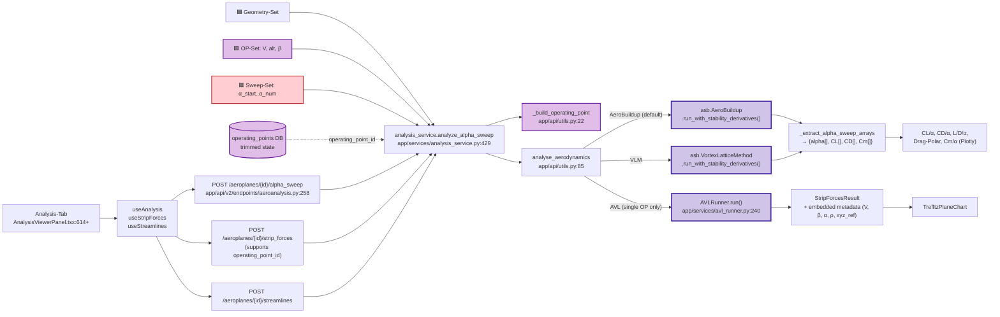

### 4.1 Analyse-Werte

| Display | Komponente | Endpoint | Solver | Quelle |
|---|---|---|---|---|
| **CL vs α** | `AnalysisViewerPanel.tsx:614` | `POST /alpha_sweep` | AeroBuildup (default) | `app/api/utils.py:59-66` |
| **CD vs α** | `AnalysisViewerPanel.tsx:625` | `POST /alpha_sweep` | AeroBuildup | dito |
| **L/D vs α** | `AnalysisViewerPanel.tsx:636` | derived `CL/CD` | — | FE-derived |
| **Drag Polar** | `AnalysisViewerPanel.tsx:647` | `POST /alpha_sweep` | AeroBuildup | dito |
| **Cm vs α** | `AnalysisViewerPanel.tsx:657` | `POST /alpha_sweep` | AeroBuildup | dito |
| **Strip Forces** | `AnalysisViewerPanel.tsx:704` | `POST /strip_forces` | AVL (`include_strip_forces=True`) | `app/services/avl_runner.py:355` |
| **Streamlines** | `AnalysisViewerPanel.tsx:795` | `POST /streamlines` | VLM `draw(backend="plotly")` | `app/api/utils.py:69-82` |

**Memory-Hinweis** (`feedback_asb_over_avl`): AeroSandbox wird bevorzugt;
AVL nur für Spezialfälle (z. B. Strip-Forces). **Memory** `feedback_plotly_inline_metadata`:
Compute-Parameter (V, β, α, ρ, xyz_ref) gehen direkt in die Plotly-Figur,
nicht in umgebende Chrome.

---

## 5. Pfad: Stability & Trim

Dieser Pfad bedient den **Operating-Points-Panel** sowie das Stability-Chip
in der Analysis-Tab. **Zwei alternative Trim-Solver** (`AeroBuildup` via
Brent / native `AVL`-Constraints) liefern strukturell unterschiedliche
Resultate — daher zwei separate Endpoints.

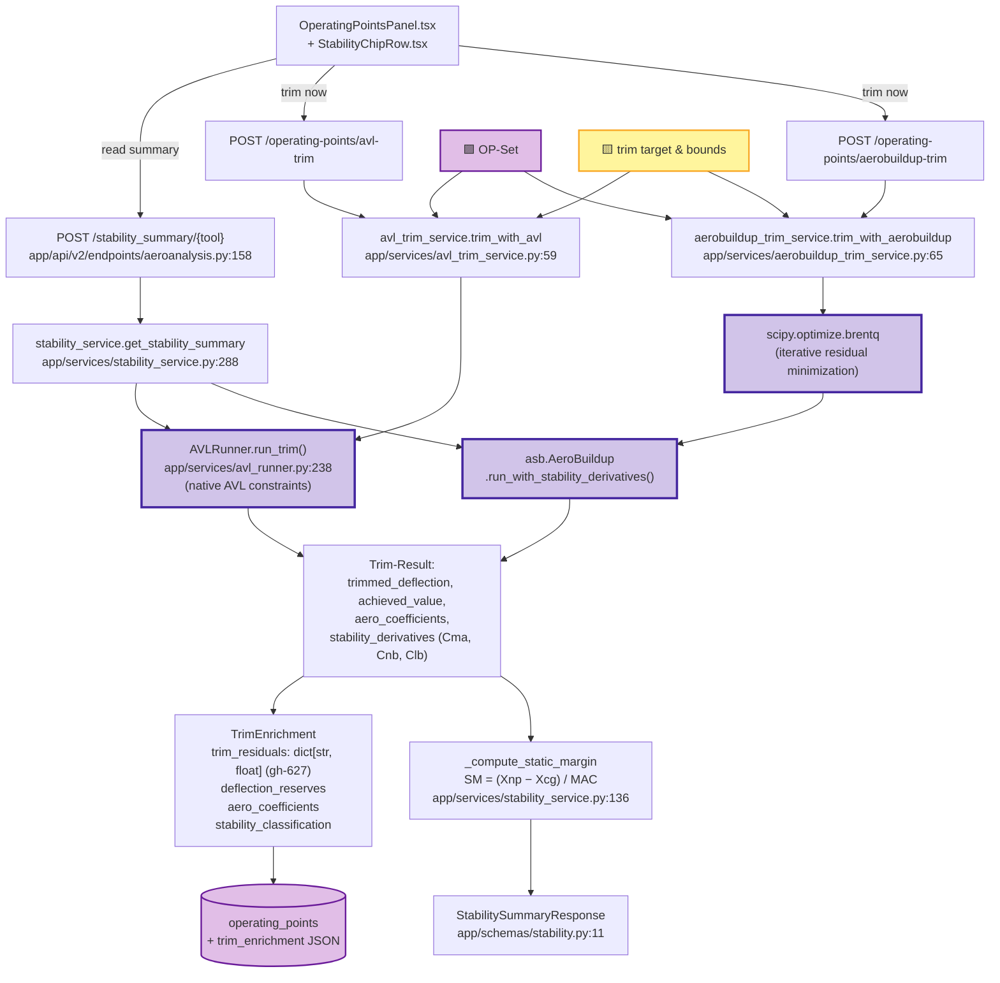

### 5.1 Stability- und Trim-Werte

| Display | Komponente | Endpoint | Berechnung | Quelle |
|---|---|---|---|---|
| **NP (Xnp)** | `StabilityChipRow.tsx` | `POST /stability_summary/{tool}` | `result.reference.Xnp` | `app/api/utils.py:59-82` |
| **Static Margin** | `StabilityChipRow.tsx:37` | `POST /stability_summary/{tool}` | `(Xnp − Xcg) / MAC` | `app/services/stability_service.py:136-140` |
| **Cma** | `StabilitySummaryResponse` | `POST /stability_summary/{tool}` | `result.derivatives.Cma` | `app/api/utils.py:59-82` |
| **Cnb** | `StabilitySummaryResponse` | dito | `result.derivatives.Cnb` | dito |
| **Clb** | `StabilitySummaryResponse` | dito | `result.derivatives.Clb` | dito |
| **Trim-α** | `OperatingPointsPanel.tsx` | `POST /operating-points/avl-trim` | Brent-/AVL-Lösung | `app/services/aerobuildup_trim_service.py:228` |
| **Trim-Elevator** | `OperatingPointsPanel.tsx` | dito | dito | dito |
| **Trim-Residuals** | `OperatingPointsPanel.tsx` | dito (Enrichment) | `dict[str, float]` (rein numerisch, gh-627) | `app/services/trim_enrichment_service.py` |
| **Deflection-Reserves** | `OperatingPointsPanel.tsx` | dito | Struktur-Limits vs. Trim-Usage | dito |
| **Stability Classification** | `OperatingPointsPanel.tsx` | dito | `is_statically/directionally/laterally_stable` | dito |

---

## 6. Pfad: Tail Sizing (V_H, V_V)

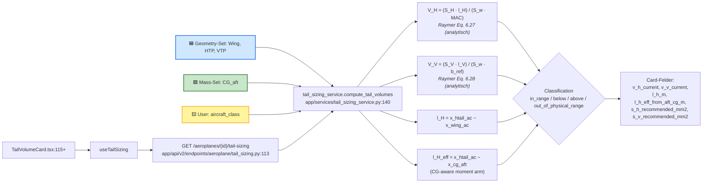

| Display | Komponente | Backend-Feld | Berechnung | Param-Set |
|---|---|---|---|---|
| **V_H** | `TailVolumeCard.tsx:115` | `v_h_current` | `(S_H·l_H)/(S_w·MAC)` | 🟦 G |
| **V_V** | `TailVolumeCard.tsx:127` | `v_v_current` | `(S_V·l_V)/(S_w·b_ref)` | 🟦 G |
| **l_H** | `TailVolumeCard.tsx:141` | `l_h_m` | `x_htail_ac − x_wing_ac` | 🟦 G |
| **l_H eff** | `TailVolumeCard.tsx:149` | `l_h_eff_from_aft_cg_m` | `x_htail_ac − x_cg_aft` | 🟦 G + 🟩 M |
| **S_H rec** | `TailVolumeCard.tsx:153` | `s_h_recommended_mm2` | `V_H_target · S_w · MAC / l_H` | 🟦 G + 🟨 U |

---

## 7. Pfad: Flight Envelope (V-n-Diagramm + KPIs)

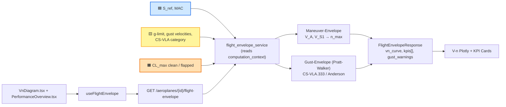

| Display | Komponente | Backend-Feld | Param-Set |
|---|---|---|---|
| **Maneuver Envelope ±g** | `VnDiagram.tsx:25/36` | `vn_curve.positive/.negative` | 🟧 P + 🟨 U |
| **Gust Lines** | `VnDiagram.tsx:58/70` | `vn_curve.gust_lines_positive/negative` | 🟦 G + 🟨 U |
| **V_dive / V_stall Linien** | `VnDiagram.tsx:176/189` | `dive_speed_mps / stall_speed_mps` | mehrere |
| **KPI-Cards (generisch)** | `PerformanceOverview.tsx:43` | `kpis[].{label, value, unit, confidence}` | mehrere |

---

## 8. Pfad: Endurance & Range (elektrisch)

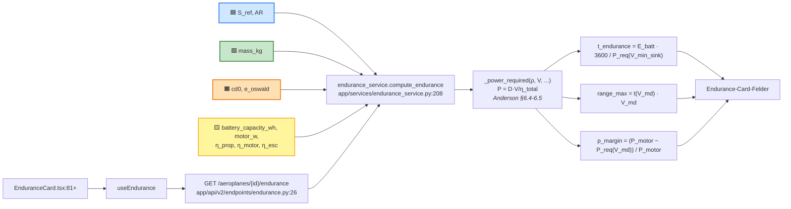

> **WICHTIG:** Keine Breguet-Formel im Code — Endurance/Range sind
> **energie-basiert** (Anderson §6.4–6.5), nicht treibstoff-basiert.

| Display | Komponente | Backend-Feld | Quelle |
|---|---|---|---|
| **t_endurance_max** | `EnduranceCard.tsx:81` | `t_endurance_max_s` | `endurance_service.py:208+` |
| **range_max** | `EnduranceCard.tsx:82` | `range_max_m` | dito |
| **P_req @ V_min_sink** | `EnduranceCard.tsx:133` | `p_req_at_v_min_sink_w` | dito |
| **P_req @ V_md** | `EnduranceCard.tsx:133` | `p_req_at_v_md_w` | dito |
| **Power Margin** | `EnduranceCard.tsx:148` | `p_margin` / `p_margin_class` | dito |
| **Battery Mass predicted** | `EnduranceCard.tsx:165` | `battery_mass_g_predicted` | dito |

---

## 9. Pfad: Mission Compliance Radar (7 KPIs)

Dieser Pfad ist besonders: **alle 7 KPIs werden aus dem cached
`computation_context` berechnet**, ohne neue Aero-Läufe. Mission-Presets
liefern die Normalisierungs-Ranges für das Spider-Chart.

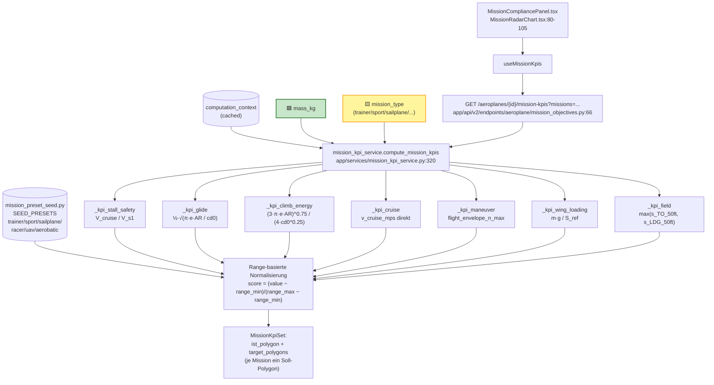

**Sailplane-Spezifikum** (Memory + Preset): Glide-Range 15–35 (statt 5–18
beim Trainer), Wing-Loading 10–50 N/m², Cruise 10–25 m/s.

| KPI-Achse | Quelle im Context | Formel |
|---|---|---|
| `stall_safety` | `v_cruise_mps`, `v_s1_mps` | `V_cruise / V_s1` |
| `glide` | `cd0`, `e_oswald`, `aspect_ratio` | `½·√(π·e·AR / cd0)` |
| `climb` | `cd0`, `e_oswald`, `aspect_ratio` | `(3·π·e·AR)^0.75 / (4·cd0^0.25)` |
| `cruise` | `v_cruise_mps` | direkt |
| `maneuver` | `flight_envelope_n_max` | direkt |
| `wing_loading` | `mass_kg`, `s_ref_m2` | `m·g / S_ref` |
| `field_friendliness` | `field_length_service` | `max(s_TO, s_LDG)` |

---

## 10. Pfad: Mass Sweep (Matching-Chart)

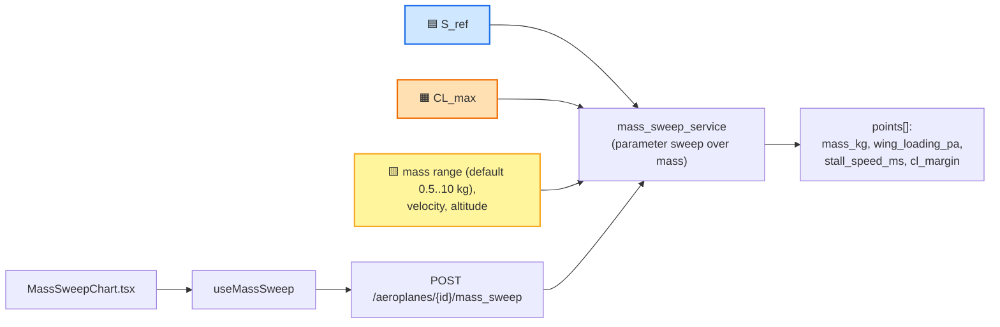

---

## 11. Pfad: Operating-Point-Persistierung & Resolver

Operating Points sind die einzigen **persistierten** Berechnungsergebnisse
neben dem ComputationContext. Sie ermöglichen reproducible Visualisierungen
(gh-577): Strip-Forces und Streamlines können sich auf einen getrimmten
Zustand zurückbeziehen, statt einen frischen Inline-OP zu rechnen.

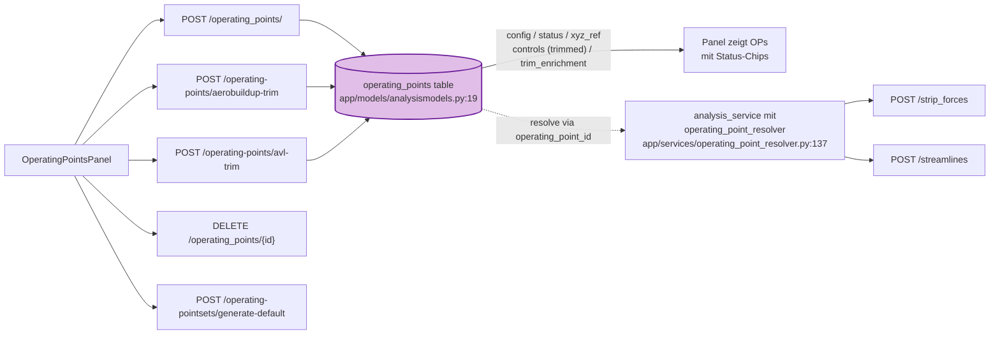

**Status-State-Machine:** `NOT_TRIMMED → COMPUTING → TRIMMED |
LIMIT_REACHED | DIRTY`

---

## 12. Geometrie-Doppelpfade (wo zwei Quellen existieren)

| Wert | Pfad A (primary) | Pfad B (fallback/legacy) | Frontend-Anzeige |
|---|---|---|---|
| **Mass** | User-Assumption `ESTIMATE` | Component-Tree-Aggregation via `weight_item_service` | Effective + Source-Chip (`ESTIMATE` / `CALCULATED`) |
| **CG_x** | Top-down: `Xnp − SM·MAC` (gh-Anti-Pattern: bottom-up) | Mass-weighted Sum aus Loading-Scenario / Weight Items | Mass-CG-Tab side-by-side |
| **e_Oswald** | `_fit_parabolic_polar` aus AeroBuildup | Fallback **0.8** (wenn Fit rejected) | `e_oswald_fallback_used`-Flag, abgeleitete Chips `null` |
| **CL_max** | `_fine_sweep_cl_max` (AeroBuildup) | User-Assumption `ESTIMATE` | Source-Indikator |
| **CD0** | `_stability_run_at_cruise` (AeroBuildup) | User-Assumption `ESTIMATE` | Source-Indikator |

> **Design-Philosophie** (Memory `project_design_cycle_philosophy`): CG ist
> ein **top-down Design-Target** aus Stability — nicht eine bottom-up
> Aggregation. Mass startet als manuelle Schätzung.

---

## 13. Einheiten-Konvertierungen (kritische Übergänge)

| Schicht | Einheit | Konvertierungs-Stelle |
|---|---|---|
| `WingConfiguration` (cad_designer) | **mm** | `cad_designer/.../WingConfiguration.py:588` (`asb_wing` Property) |
| `WingConfig.asb_wing(scale=0.001)` | mm → m | dito, Default-Skalierung |
| `_scale_asb_wing_geometry_schema(scale=0.001)` | konsistente m-Skala | `app/converters/model_schema_converters.py:331` |
| Database (`WingModel`, `FuselageModel`) | **m** | SQLAlchemy ORM |
| API-Response (`AsbWingReadSchema`) | **m** | `wing_service.get_wing()` |
| **Spare-Detail-Felder (DB)** ⚠️ | **mm** (gh-402 unified) | `width`, `height`, `length`, `start`, `spare_origin` |
| Spare-API-Response | m | `_convert_spare_to_meters()` (× 0.001) im `wing_service.get_wing():519` |
| `spare_vector` | dimensionslos | nicht konvertiert |
| Plotly `WingOutlineViewer` | **m direkt** | Memory `feedback_plotly_units` — keine mm-Konvertierung trotz allgemeiner Regel |

---

## 14. Vollständige Endpoint-Übersicht (26 Endpoints)

### Computation Context & Assumptions
1. `GET /aeroplanes/{id}/assumptions/computation-context` — ⭐ Hauptcache
2. `GET /aeroplanes/{id}/assumptions` — Liste aller Design-Assumptions
3. `PUT /aeroplanes/{id}/assumptions/{param_name}` — Update Estimate
4. `PATCH /aeroplanes/{id}/assumptions/{param_name}/source` — Switch ESTIMATE/CALCULATED
5. `POST /aeroplanes/{id}/recompute` — Trigger Recompute

### Analysis & Aerodynamics
6. `POST /aeroplanes/{id}/alpha_sweep` — α-Sweep Polar
7. `POST /aeroplanes/{id}/wings/{name}/strip_forces` — Strip-Forces einzelner Flügel
8. `POST /aeroplanes/{id}/strip_forces` — Strip-Forces alle Flügel
9. `POST /aeroplanes/{id}/streamlines` — 3D Streamlines (Plotly)
10. `POST /aeroplanes/{id}/stability_summary/{tool}` — Stability-Summary
11. `POST /aeroplanes/{id}/design_metrics` — S_ref + grundlegende Geometrie

### Flight Envelope & Performance
12. `GET /aeroplanes/{id}/flight-envelope` — V-n-Diagramm + KPIs
13. `POST /aeroplanes/{id}/flight-envelope/compute` — Recompute V-n

### Electric Performance
14. `GET /aeroplanes/{id}/endurance` — Endurance/Range

### Tail Sizing
15. `GET /aeroplanes/{id}/tail-sizing` — V_H, V_V
16. `POST /aeroplanes/{id}/tail_volumes` — Re-Compute Tail Volumes

### Operating Points & Trim
17. `GET /operating_points?aircraft_id={id}` — Liste
18. `POST /operating_points/` — Anlegen
19. `PATCH /operating_points/{op_id}/deflections` — Update Controls
20. `DELETE /operating_points/{op_id}` — Löschen
21. `POST /aeroplanes/{id}/operating-points/avl-trim` — AVL-Trim
22. `POST /aeroplanes/{id}/operating-points/aerobuildup-trim` — ASB-Trim
23. `POST /aeroplanes/{id}/operating-pointsets/generate-default` — Default OPs

### Mass Sweep & Sizing
24. `POST /aeroplanes/{id}/mass_sweep` — Matching-Chart

### Mission Compliance
25. `GET /aeroplanes/{id}/mission-kpis?missions=...` — 7-Achs-Radar

### Wings & Geometry
26. `GET /aeroplanes/{id}/wings/{name}` — Wing-Geometrie inkl. x_secs

---

## 15. Code-Index (alle erwähnten Quellen)

### Backend Services
- `app/services/assumption_compute_service.py:57` — `recompute_assumptions()`
- `app/services/assumption_compute_service.py:947+` — `_fit_parabolic_polar()`
- `app/services/assumption_compute_service.py:1046` — OLS-Polyfit
- `app/services/analysis_service.py:429-473` — `analyze_alpha_sweep()`
- `app/services/stability_service.py:288-361` — `get_stability_summary()`
- `app/services/stability_service.py:136-140` — `_compute_static_margin()`
- `app/services/aerobuildup_trim_service.py:65-308` — `trim_with_aerobuildup()`
- `app/services/avl_trim_service.py:59-171` — `trim_with_avl()`
- `app/services/avl_runner.py:238-367` — `AVLRunner.run()`
- `app/services/mission_kpi_service.py:109-412` — Mission-KPI-Berechnungen
- `app/services/endurance_service.py:208-450` — `compute_endurance()`
- `app/services/tail_sizing_service.py:140` — `compute_tail_volumes()`
- `app/services/operating_point_resolver.py:137-212` — Trimmed-OP-Resolver
- `app/services/mass_cg_service.py:276` — `get_s_ref_for_aeroplane()`
- `app/services/wing_service.py:504-519` — `get_wing()` + spare conversion

### Backend API-Layer
- `app/api/v2/endpoints/aeroanalysis.py:158-276` — Stability/Alpha-Sweep
- `app/api/v2/endpoints/endurance.py:26-58` — Endurance-Endpoint
- `app/api/v2/endpoints/aeroplane/tail_sizing.py:113` — Tail-Sizing-Endpoint
- `app/api/v2/endpoints/aeroplane/mass_cg.py:58` — Design-Metrics
- `app/api/v2/endpoints/aeroplane/mission_objectives.py:66-77` — Mission-KPIs
- `app/api/v2/endpoints/aeroplane/wings.py:357` — Wing-Read
- `app/api/v2/endpoints/aeroplane/component_tree.py:25` — Component-Tree
- `app/api/utils.py:22-115` — OP-Builder + Solver-Dispatch
- `app/converters/model_schema_converters.py:331,484` — ASB-Konvertierung

### Schemas
- `app/schemas/aeroanalysisschema.py:219-305` — `OperatingPointSchema`
- `app/schemas/polar_by_config.py:68-92` — `PolarRejection`
- `app/schemas/polar_by_config.py:94-119` — `ParabolicPolar`
- `app/schemas/stability.py:11-85` — `StabilitySummaryResponse`

### Frontend (Komponenten + Hooks)
- `frontend/components/.../GeometryChipRow.tsx`
- `frontend/components/.../PolarChipRow.tsx`
- `frontend/components/.../SpeedChipRow.tsx`
- `frontend/components/.../StabilityChipRow.tsx`
- `frontend/components/.../PolarRejectionBadge.tsx`
- `frontend/components/.../AnalysisViewerPanel.tsx`
- `frontend/components/.../VnDiagram.tsx`
- `frontend/components/.../EnduranceCard.tsx`
- `frontend/components/.../TailVolumeCard.tsx`
- `frontend/components/.../MissionRadarChart.tsx`
- `frontend/components/.../MassSweepChart.tsx`
- `frontend/components/.../OperatingPointsPanel.tsx`
- `frontend/lib/polar.ts` — derived metrics (k, C_L_md, L/D_max, ρ)
- `frontend/lib/missionScale.ts` — Spider-Chart-Normalisierung

### Models
- `app/models/analysismodels.py:19-43` — `OperatingPointModel`
- `app/models/mission_objective.py` — `MissionObjectiveModel`

### Seeds & Constants
- `app/services/mission_preset_seed.py` — 6 Mission-Presets
- `cad_designer/.../WingConfiguration.py:588,614+` — ASB-Wing-Property

---

## 16. Verwandte GitHub-Issues

| Issue | Thema | Auswirkung im Trace |
|---|---|---|
| gh-402 | Spare-Dimensionen mm-Vereinheitlichung | Spare-API konvertiert m, DB speichert mm |
| gh-487 | Gust-Critical-Warnung | V-n-Envelope |
| gh-488 | Loading-Scenarios + CG-Range | Mass-CG-Tab |
| gh-497 | Pratt-Walker-Validity | Gust-Line-Berechnung |
| gh-528 | Trim-Enrichment Stabilisierung | `trim_enrichment.*` |
| gh-546 | Field-Performance → Mission-Objective | `runway_type`, `t_static_N` |
| gh-577 | Operating-Point-Resolver | Strip-Forces / Streamlines reproducible |
| gh-587 | Operating-Point Validator | α ∈ ±180° |
| gh-626 | Polar Metrics Chip-Row | 8 Polar-Chips |
| gh-627 | trim_residuals dict[str, float] | Solver-Path NICHT in Residuals |
| gh-630 | Polar-Fit-Rejection-Gates | 6 Gates + UI-Badge |
| gh-633 | Surface Polar-Fit-Rejections | PolarRejectionBadge UI |
| gh-634 | Badge crash für pre-gh-630 Aeroplanes | undefined-Schutz |

---

## Anhang A — Diagramm-Legende

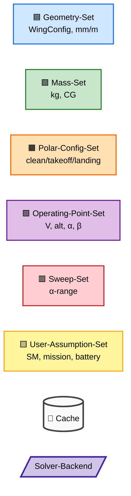
